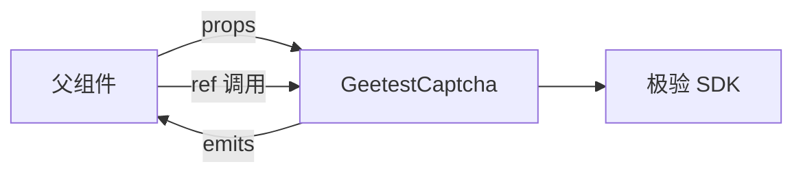
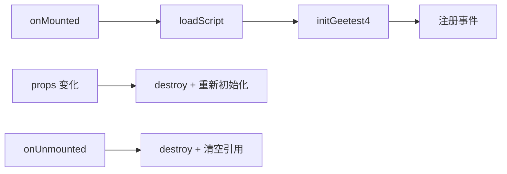

# 极验 GT4 的 Vue 组件封装与动态脚本加载

## 概述

将极验 GT4 封装为可复用的 Vue 3 组件，是工程化落地的关键一步。本文详解组件的输入输出设计、动态脚本加载方案、生命周期管理、事件透传机制，以及 props 变化后的实例重建策略。

## 前置知识

- 熟悉 Vue 3 Composition API（`<script setup>`、`defineProps`、`defineExpose`）
- 了解极验 GT4 基本接入流程（参见 [02-极验GT4行为验证接入与容灾](02-极验GT4行为验证接入与容灾.md)）
- 了解动态 `<script>` 插入与 Promise 化加载

## 学习目标

- 设计验证码组件的 props/emits/expose 接口
- 实现 Promise 化的动态脚本加载工具
- 掌握组件生命周期中的初始化与销毁时机
- 理解 bind 模式与 popup 模式的封装差异

---

## 一、组件封装目标

### 1.1 为什么要封装

- 统一接入方式，减少重复代码
- 对外暴露一致的调用方法
- 隐藏脚本加载、生命周期清理等细节
- 便于在登录、注册、短信发送等多场景复用

### 1.2 接口设计



**Props（输入）**：

```typescript
type GeetestProduct = "popup" | "float" | "bind";

interface GeetestCaptchaProps {
  captchaId: string;
  product?: GeetestProduct;
  language?: string;
  scriptSrc?: string;
  options?: Record<string, unknown>;
}
```

**Emits（事件输出）**：

```typescript
defineEmits<{
  ready: [];
  success: [result: Record<string, string>];
  error: [error: unknown];
  close: [];
}>();
```

**Expose（方法暴露）**：

```typescript
defineExpose({
  getInstance,
  showCaptcha,
  reset,
  destroy,
});
```

---

## 二、动态脚本加载

### 2.1 为什么需要动态加载

组件不应假设业务方已全局引入 `gt4.js`。如果页面未加载 SDK，初始化时会报 `initGeetest4 is not defined`。

### 2.2 Promise 化加载工具

```typescript
export function loadScript(
  src: string,
  attrs: Record<string, string> = {}
): Promise<void> {
  return new Promise((resolve, reject) => {
    const existed = document.querySelector(
      `script[src="${src}"]`
    ) as HTMLScriptElement | null;

    if (existed) {
      if (existed.dataset.loaded === "true") {
        resolve();
        return;
      }
      existed.addEventListener("load", () => resolve(), { once: true });
      existed.addEventListener(
        "error",
        () => reject(new Error(`load script failed: ${src}`)),
        { once: true }
      );
      return;
    }

    const script = document.createElement("script");
    script.src = src;
    Object.entries(attrs).forEach(([key, value]) => {
      script.setAttribute(key, value);
    });

    script.addEventListener(
      "load",
      () => {
        script.dataset.loaded = "true";
        resolve();
      },
      { once: true }
    );
    script.addEventListener(
      "error",
      () => reject(new Error(`load script failed: ${src}`)),
      { once: true }
    );

    document.head.appendChild(script);
  });
}
```

设计要点：
- 已加载过则直接复用，不重复插入
- 返回 Promise，`await` 成功后再初始化
- 加载失败时 reject，便于上层捕获

---

## 三、完整组件实现

```vue
<script setup lang="ts">
import { nextTick, onMounted, onUnmounted, ref, watch } from "vue";
import { loadScript } from "@/utils/loadScript";

type GeetestProduct = "popup" | "float" | "bind";

const props = withDefaults(
  defineProps<{
    captchaId: string;
    product?: GeetestProduct;
    language?: string;
    scriptSrc?: string;
    options?: Record<string, unknown>;
  }>(),
  {
    product: "popup",
    language: "zho",
    scriptSrc: "https://static.geetest.com/v4/gt4.js",
    options: () => ({}),
  }
);

const emit = defineEmits<{
  ready: [];
  success: [result: Record<string, string>];
  error: [error: unknown];
  close: [];
}>();

const rootRef = ref<HTMLElement | null>(null);
const instanceRef = ref<any>(null);

function getInstance() {
  return instanceRef.value;
}

function showCaptcha() {
  instanceRef.value?.showCaptcha?.();
}

function reset() {
  instanceRef.value?.reset?.();
}

function destroy() {
  instanceRef.value?.destroy?.();
  instanceRef.value = null;
  if (rootRef.value) rootRef.value.innerHTML = "";
}

async function initCaptcha() {
  await nextTick();
  if (!rootRef.value || typeof window.initGeetest4 !== "function") return;

  destroy();

  await new Promise<void>((resolve) => {
    window.initGeetest4(
      {
        captchaId: props.captchaId,
        product: props.product,
        language: props.language,
        ...props.options,
      },
      (captchaObj: any) => {
        instanceRef.value = captchaObj;

        // bind 模式不需要 appendTo
        if (props.product !== "bind") {
          captchaObj.appendTo(rootRef.value);
        }

        captchaObj
          .onReady(() => {
            emit("ready");
            resolve();
          })
          .onSuccess(() => {
            emit("success", captchaObj.getValidate());
          })
          .onError((error: unknown) => emit("error", error))
          .onClose(() => emit("close"));
      }
    );
  });
}

defineExpose({ getInstance, showCaptcha, reset, destroy });

onMounted(async () => {
  await loadScript(props.scriptSrc, { defer: "true" });
  await initCaptcha();
});

watch(
  () => [props.captchaId, props.product, props.language],
  () => initCaptcha()
);

onUnmounted(() => destroy());
</script>

<template>
  <div ref="rootRef"></div>
</template>
```

---

## 四、父组件调用示例

```vue
<script setup lang="ts">
import { ref } from "vue";
import GeetestCaptcha from "./GeetestCaptcha.vue";

const captchaRef = ref<InstanceType<typeof GeetestCaptcha> | null>(null);

function handleSuccess(result: Record<string, string>) {
  // 拿到验证结果，提交给后端
  console.log("验证结果", result);
}
</script>

<template>
  <GeetestCaptcha
    ref="captchaRef"
    captcha-id="你的-captchaId"
    product="popup"
    @success="handleSuccess"
  />
</template>
```

---

## 五、关键设计决策

### 5.1 bind 模式 vs popup 模式

| 模式 | appendTo | 触发方式 | 封装差异 |
|------|----------|---------|---------|
| popup | 需要 | 自动弹出 | 挂载到 rootRef |
| bind | 不需要 | 手动 `showCaptcha()` | 父组件通过 ref 调用 |
| float | 需要 | 按钮附近浮层 | 关注容器布局 |

### 5.2 生命周期管理



### 5.3 事件透传映射

| 极验原生事件 | 组件事件 | 说明 |
|------------|---------|------|
| onReady | ready | 组件就绪 |
| onSuccess | success | 验证成功，附带结果 |
| onError | error | 验证错误 |
| onClose | close | 关闭验证框 |

---

## 常见问题

| 问题 | 原因 | 解决方案 |
|------|------|---------|
| `initGeetest4 is not defined` | SDK 未加载完就初始化 | 用 Promise 化 loadScript，await 后再初始化 |
| bind 模式点按钮没反应 | 未调用 `showCaptcha()` | 父组件通过 ref 在合适时机调用 |
| 销毁后页面残留验证框 | 只销毁实例未清空容器 | destroy() 后同步清空 innerHTML 和引用 |
| props 改了验证码没变化 | 初始化参数只在创建时生效 | watch 关键 props 并重建实例 |
| 脚本重复插入 | 未判断页面是否已存在 | loadScript 中先查 `script[src="..."]` |

---

## 最佳实践

1. **Promise 化加载**：不用 setInterval 轮询，用 load/await 确保时序
2. **最小暴露原则**：优先事件驱动，defineExpose 只暴露必要方法
3. **销毁要彻底**：实例 destroy + 引用置 null + 容器清空
4. **bind 模式特殊处理**：不调用 appendTo，由父组件控制触发时机
5. **watch 重建有节制**：只监听影响初始化的 props，避免频繁销毁重建

---

## 延伸阅读

- 极验 GT4 Web API：https://docs.geetest.com/gt4/apirefer/api/web
- Vue 3 `<script setup>`：https://cn.vuejs.org/api/sfc-script-setup.html
- Vue 3 生命周期：https://cn.vuejs.org/guide/essentials/lifecycle.html
