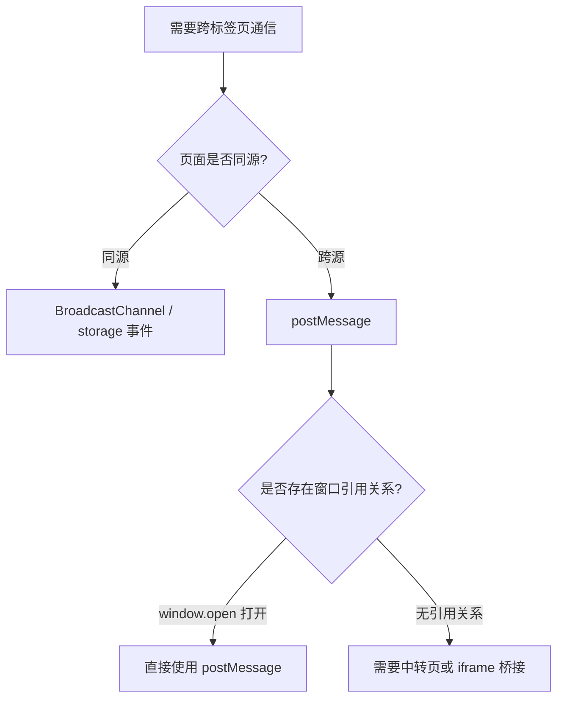
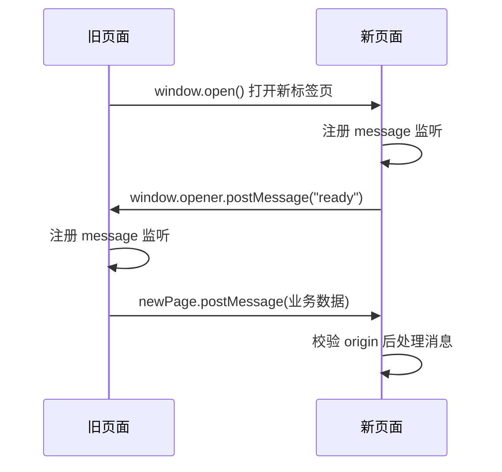
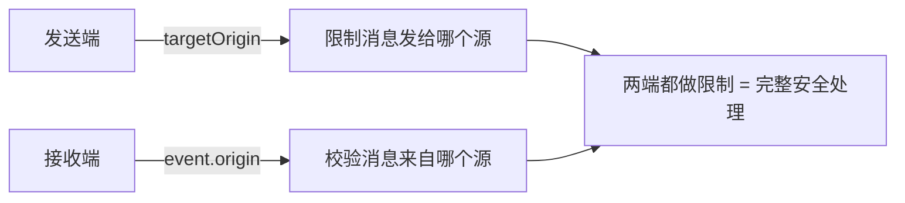

# postMessage 跨标签页通信

## 概述

在后台管理系统、统一登录、支付跳转、第三方授权、单点登录等场景中，页面之间经常需要交换状态或通知结果。`window.postMessage` 是浏览器原生提供的跨窗口消息通道，也是唯一能安全跨越同源限制的标签页通信方案。本文详解其发送/接收模型、窗口引用获取方式、安全校验机制与双向通信实现。

## 前置知识

- 了解浏览器同源策略（协议 + 域名 + 端口）
- 熟悉 `window.open()` 的基本用法
- 了解事件监听 `addEventListener`

## 学习目标

- 理解跨标签页通信的常见方案及其适用边界
- 掌握 `postMessage` 的发送与接收完整流程
- 理解 `window.opener` 与 `window.open()` 返回值的双向引用关系
- 掌握 `targetOrigin` 与 `event.origin` 的安全设计

---

## 一、跨标签页通信方案对比

### 1.1 常见业务场景

- 新标签页完成登录后，通知原页面刷新状态
- 管理后台打开新标签页操作完成后，同步结果回原页面
- 中转页将授权结果发回原始业务页

### 1.2 方案选型



| 方案 | 同源要求 | 特点 |
|------|---------|------|
| `localStorage` + `storage` 事件 | 必须同源 | 简单但依赖存储写入 |
| `BroadcastChannel` | 必须同源 | 广播模型，使用简洁 |
| `window.postMessage` | 可跨源 | 点对点，需持有目标窗口引用 |

关键认知：`postMessage` 不是广播机制，它依赖你拿到目标窗口对象。"在同一个浏览器里打开"不等于"同源"，即使两个页面都运行在本机，只要协议/域名/端口任一不同，浏览器安全边界依然成立。

---

## 二、发送消息

### 2.1 前提：获取目标窗口引用

调用 `postMessage` 的前提是先拿到目标窗口对象：

- 原页面通过 `window.open()` 的返回值拿到新标签页对象
- 新页面通过 `window.opener` 拿到打开它的原页面对象

### 2.2 基本调用形式

```typescript
targetWindow.postMessage(message, targetOrigin);
```

| 参数 | 说明 |
|------|------|
| `message` | 发送的数据，支持字符串、对象等可结构化克隆的值 |
| `targetOrigin` | 目标源，限制消息只发送给指定源的页面 |

```typescript
const newPage = window.open("http://auth.example.com/login");

newPage?.postMessage("hello from old tab", "http://auth.example.com");
```

注意：`window.open()` 可能因浏览器拦截弹窗而返回 `null`，必须先判断返回值是否存在。

---

## 三、接收消息

接收方通过监听 `message` 事件获取消息。事件对象中三个关键属性：

| 属性 | 说明 |
|------|------|
| `event.data` | 消息内容 |
| `event.origin` | 发送方的源（协议+域名+端口） |
| `event.source` | 发送消息的窗口对象 |

```typescript
window.addEventListener("message", (event) => {
  if (event.origin !== "http://localhost:5173") {
    return;
  }

  console.log("收到消息：", event.data);
});
```

---

## 四、双向通信模型

### 4.1 新页面 → 旧页面（window.opener）

当页面由另一个页面通过 `window.open()` 打开时，新页面可通过 `window.opener` 反向通信：

```typescript
if (window.opener) {
  window.opener.postMessage("hello from new tab", "http://localhost:5173");
}
```

注意：
- 如果页面是用户直接访问的（非 `window.open()` 打开），`window.opener` 为 `null`
- 如果打开时使用了 `noopener`，`window.opener` 同样为 `null`

### 4.2 旧页面 → 新页面（window.open 返回值）

```typescript
const newPage = window.open("http://auth.example.com/login");

setTimeout(() => {
  if (newPage && typeof newPage.postMessage === "function") {
    newPage.postMessage("hello from old tab", "http://auth.example.com");
  }
}, 3000);
```

`setTimeout` 等待新页面加载完成只适合演示。工程上更推荐由新页面加载完成后主动发送 "ready" 消息，旧页面收到后再发送正式消息（握手协议，详见下一篇）。

### 4.3 完整双向通信流程



---

## 五、安全机制

### 5.1 targetOrigin：发送端控制"发给谁"

```typescript
// 仅适合临时调试
targetWindow.postMessage("test", "*");

// 生产环境：显式指定目标源
targetWindow.postMessage("test", "http://localhost:5173");
```

如果 `targetOrigin` 与目标页面的实际源不匹配，浏览器会静默丢弃消息，不会报错。

### 5.2 event.origin：接收端控制"收谁的消息"

```typescript
window.addEventListener("message", (event) => {
  const allowedOrigins = [
    "http://localhost:5173",
    "http://auth.example.com",
  ];

  if (!allowedOrigins.includes(event.origin)) {
    return;
  }

  console.log("安全接收：", event.data);
});
```

### 5.3 双向安全原则



- 发送端指定 `targetOrigin` ≠ 安全，接收端仍必须校验来源
- 接收端无法假设所有发来的消息都可信
- 除了校验 `origin`，还应校验 `event.data` 的结构和字段

---

## 六、完整实战：跨源双向通信

**需求**：原页面打开登录页，登录成功后新页面通知原页面，原页面再向新页面发送确认。

原页面：

```typescript
const loginUrl = "http://auth.example.com/login";
const loginOrigin = "http://auth.example.com";

window.addEventListener("message", (event) => {
  if (event.origin !== loginOrigin) return;

  console.log("old tab received:", event.data);
});

const newPage = window.open(loginUrl);

setTimeout(() => {
  if (!newPage) return;
  newPage.postMessage("hello from old tab", loginOrigin);
}, 3000);
```

新页面：

```typescript
const dashboardOrigin = "http://localhost:5173";

window.addEventListener("message", (event) => {
  if (event.origin !== dashboardOrigin) return;

  console.log("new tab received:", event.data);
});

if (window.opener) {
  window.opener.postMessage("hello from new tab", dashboardOrigin);
}
```

---

## 常见问题

| 问题 | 原因 | 解决方案 |
|------|------|---------|
| `BroadcastChannel` 换了域名后不工作 | 它仅支持同源通信 | 跨源场景改用 `postMessage` |
| 新页面 `window.opener` 为 `null` | 页面非 `window.open()` 打开，或使用了 `noopener` | 只在"被原页面打开"的场景下依赖 opener |
| 消息收不到 | targetOrigin 配错 / 监听器未注册 / 页面未加载完 | 逐项检查目标源、监听时机、窗口引用 |
| 消息收到两次 | 打开了多个标签页，或重复绑定监听器 | 关闭多余页面，确认监听器只注册一次 |
| 改了端口后收不到消息 | targetOrigin 必须与目标页实际源严格一致 | 保证协议、域名、端口完全匹配 |
| 调试时收到不明消息 | 页面中已有 SDK/验证码脚本也在接收消息 | 测试前注释无关逻辑，排除第三方干扰 |

---

## 最佳实践

1. **生产环境禁用 `*`**：调试可用，上线必须指定明确的源
2. **接收端必须校验 origin**：白名单机制，不信任任何未知来源
3. **结构化消息体**：统一 `{ type, payload }` 格式，避免裸字符串
4. **握手优于定时器**：新页面 ready 后再通信，不靠 setTimeout 猜测
5. **Vue 组件中正确管理监听**：onMounted 注册、onUnmounted 移除，防止重复接收

---

## 延伸阅读

- MDN Window.postMessage()：https://developer.mozilla.org/zh-CN/docs/Web/API/Window/postMessage
- MDN message 事件：https://developer.mozilla.org/zh-CN/docs/Web/API/Window/message_event
- MDN BroadcastChannel：https://developer.mozilla.org/zh-CN/docs/Web/API/BroadcastChannel
- 下一篇：[postMessage 点对点通信与握手协议](05-postMessage点对点通信与握手协议.md)
