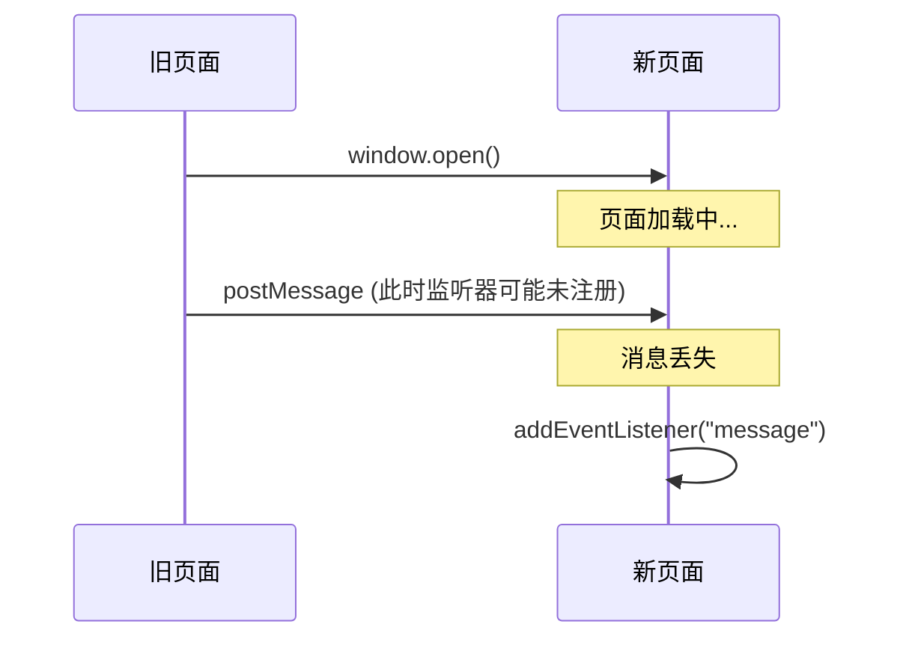
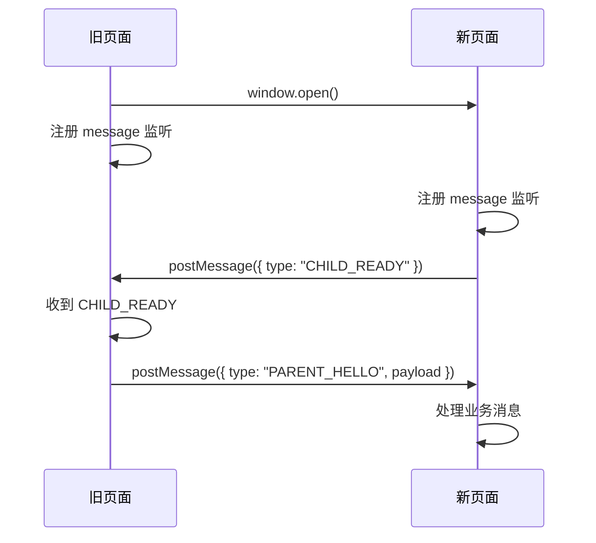
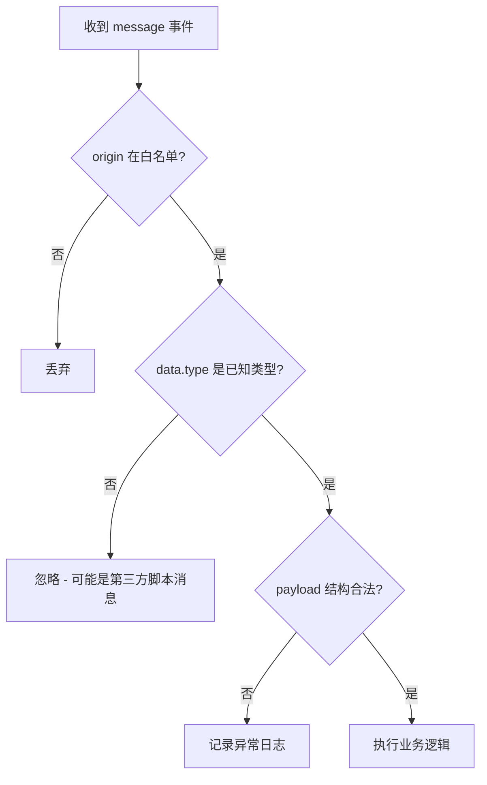
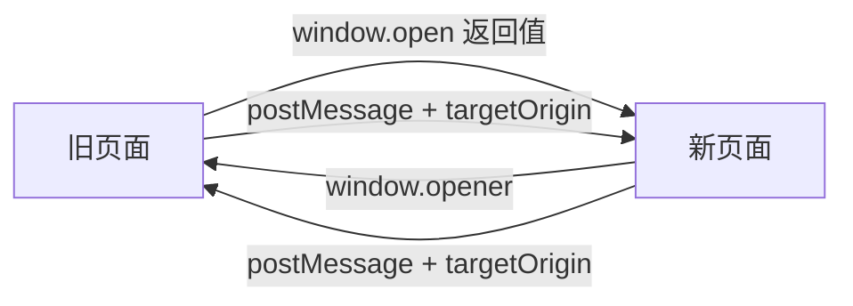

# postMessage 点对点通信与握手协议

## 概述

上一篇介绍了 `postMessage` 的基础收发模型。但在真实业务中，"旧页面何时向新页面发消息"是一个时序问题——新页面可能还没注册监听器，消息就已经发出了。本文详解基于 "ready 握手"的可靠通信协议设计、结构化消息规范，以及在 Vue 组件中管理消息监听的工程实践。

## 前置知识

- 掌握 `postMessage` 基本收发与 origin 校验（参见 [04-postMessage跨标签页通信](04-postMessage跨标签页通信.md)）
- 了解 Vue 3 生命周期钩子（onMounted / onUnmounted）

## 学习目标

- 理解 setTimeout 等待的缺陷与 ready 握手协议的设计思路
- 掌握结构化消息格式设计（type + payload）
- 实现完整的双向点对点通信闭环
- 在 Vue 组件中正确管理 message 监听的生命周期

---

## 一、时序问题：为什么不能靠定时器

### 1.1 问题场景

旧页面通过 `window.open()` 打开新页面后，如果想向新页面发消息，面临一个时序困境：



消息发出时接收方尚未就绪，消息会被静默丢弃。

### 1.2 setTimeout 的缺陷

```typescript
// 演示可以，生产不行
setTimeout(() => {
  newPage?.postMessage("hello", "http://auth.example.com");
}, 5000);
```

- 网络慢时 5 秒不够，消息丢失
- 网络快时白等 5 秒，体验差
- 无法确定"刚刚好"的时机

---

## 二、Ready 握手协议

### 2.1 设计思路

由新页面加载完成后**主动上报就绪状态**，旧页面收到 ready 信号后再发送正式消息：



### 2.2 完整实现

旧页面：

```typescript
const childPage = window.open("http://auth.example.com/login", "_blank");

window.addEventListener("message", (event) => {
  if (event.origin !== "http://auth.example.com") return;

  if (event.data?.type === "CHILD_READY") {
    childPage?.postMessage(
      {
        type: "PARENT_HELLO",
        payload: "hello from old tab",
      },
      "http://auth.example.com"
    );
  }
});
```

新页面：

```typescript
window.addEventListener("message", (event) => {
  if (event.origin !== "http://localhost:5173") return;

  console.log("新页面收到：", event.data);
});

// 注册完监听后，主动上报就绪
if (window.opener) {
  window.opener.postMessage(
    {
      type: "CHILD_READY",
      payload: "hello from new tab",
    },
    "http://localhost:5173"
  );
}
```

### 2.3 握手协议要点

| 要点 | 说明 |
|------|------|
| 先监听后上报 | 新页面必须先注册 message 监听，再发送 ready |
| 类型驱动 | 旧页面根据 `type === "CHILD_READY"` 判断是否开始通信 |
| 无猜测等待 | 不依赖任何固定延迟 |
| 可扩展 | ready 消息可携带初始化参数请求 |

---

## 三、结构化消息设计

### 3.1 为什么不用裸字符串

裸字符串无法区分消息类型，多业务共用通道时极易混淆。推荐统一消息格式：

```typescript
interface TabMessage {
  type: string;       // 消息类型，如 LOGIN_SUCCESS / CHILD_READY
  payload?: unknown;  // 业务数据
  requestId?: string; // 可选：用于请求-响应模式
}
```

### 3.2 消息类型设计示例

```typescript
type MessageType =
  | "CHILD_READY"      // 新页面就绪
  | "LOGIN_SUCCESS"    // 登录成功通知
  | "PARENT_HELLO"     // 旧页面问候
  | "REFRESH_STATE";   // 状态刷新指令

function sendMessage(
  target: Window,
  targetOrigin: string,
  type: MessageType,
  payload?: unknown
) {
  target.postMessage({ type, payload }, targetOrigin);
}
```

### 3.3 接收端校验层次



---

## 四、Vue 组件中的消息监听管理

### 4.1 正确的注册与清理

```typescript
import { onMounted, onUnmounted } from "vue";

function handleMessage(event: MessageEvent) {
  if (event.origin !== "http://localhost:5173") return;

  if (event.data?.type === "LOGIN_SUCCESS") {
    // 刷新登录状态
  }
}

onMounted(() => {
  window.addEventListener("message", handleMessage);
});

onUnmounted(() => {
  window.removeEventListener("message", handleMessage);
});
```

### 4.2 常见错误

- 在组件每次渲染时重复注册监听（应只在 onMounted 中注册一次）
- 页面切换后不移除监听，导致重复接收消息
- 使用匿名函数注册，无法在卸载时精确移除

### 4.3 封装为 Composable

```typescript
import { onMounted, onUnmounted } from "vue";

export function usePostMessage(
  allowedOrigins: string[],
  handler: (data: unknown, event: MessageEvent) => void
) {
  function listener(event: MessageEvent) {
    if (!allowedOrigins.includes(event.origin)) return;
    handler(event.data, event);
  }

  onMounted(() => window.addEventListener("message", listener));
  onUnmounted(() => window.removeEventListener("message", listener));
}
```

使用方式：

```typescript
usePostMessage(["http://auth.example.com"], (data) => {
  if ((data as TabMessage).type === "LOGIN_SUCCESS") {
    refreshUserState();
  }
});
```

---

## 五、双向通信的引用关系总结



| 方向 | 引用来源 | 前提条件 |
|------|---------|---------|
| 新 → 旧 | `window.opener` | 新页面由旧页面 `window.open()` 打开且未设 noopener |
| 旧 → 新 | `window.open()` 返回值 | 弹窗未被浏览器拦截 |

双向通信不等于任意页面都能互通——它依赖两个页面之间存在"打开者/被打开者"的引用关系。

---

## 常见问题

| 问题 | 原因 | 解决方案 |
|------|------|---------|
| 旧页面延迟发送仍偶尔丢消息 | setTimeout 无法适配所有网络环境 | 改用 ready 握手协议 |
| 用了 `postMessage("*")` 还是收不到 | 窗口引用不对，或接收端未监听 | 先确认 open 返回值和 opener 是否存在 |
| 收到两条相同消息 | 注册了多次监听，或开了多个标签页实例 | 清理旧监听、关闭多余标签页 |
| ready 消息发出但旧页面没反应 | 旧页面监听注册晚于 ready 发送 | 确保旧页面在 open 之前/之后立即注册监听 |
| 消息被第三方 SDK 干扰 | 页面中验证码等脚本也在收发 postMessage | 用 type 字段过滤，只处理已知类型 |

---

## 最佳实践

1. **握手优于等待**：新页面 ready 后再通信，彻底消除时序猜测
2. **消息必须结构化**：统一 `type + payload` 协议，多业务共存不混淆
3. **三层校验**：origin 白名单 → type 已知 → payload 结构合法
4. **监听有借有还**：onMounted 注册、onUnmounted 移除，避免内存泄漏
5. **先监听后打开**：旧页面在 `window.open()` 之前就注册好 message 监听

---

## 延伸阅读

- MDN window.postMessage：https://developer.mozilla.org/zh-CN/docs/Web/API/Window/postMessage
- MDN Window.opener：https://developer.mozilla.org/zh-CN/docs/Web/API/Window/opener
- Vue 3 生命周期：https://cn.vuejs.org/guide/essentials/lifecycle.html
- 下一篇：[SharedWorker端口池转发机制](06-SharedWorker端口池转发机制.md)
