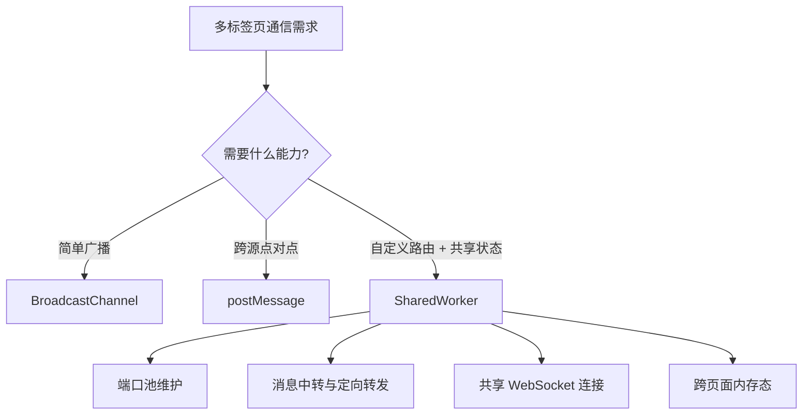
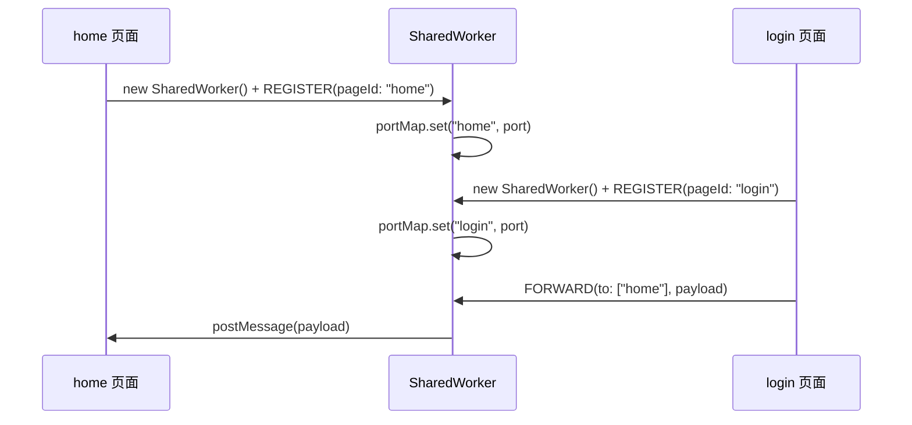
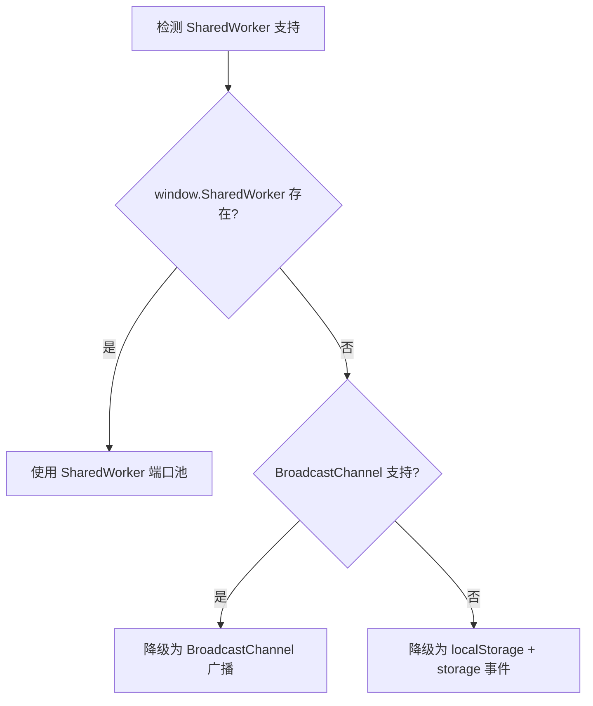

# SharedWorker 端口池转发机制

## 概述

`postMessage` 依赖窗口引用关系，`BroadcastChannel` 只能简单广播且限同源。`SharedWorker` 提供了第三种可能：多个同源页面共享同一个 Worker 线程，由 Worker 维护端口池并自定义转发规则，实现广播、点对多、按 ID 定向发送等灵活的消息路由。本文详解 SharedWorker 的通信模型、端口池设计与定向转发实现。

## 前置知识

- 掌握 postMessage 跨标签页通信（参见 [04](04-postMessage跨标签页通信.md)、[05](05-postMessage点对点通信与握手协议.md)）
- 了解 Web Worker 基本概念
- 了解 `MessagePort` 的 `postMessage` / `start` / `onmessage`

## 学习目标

- 理解 SharedWorker "一个 Worker，多个 Port" 的通信模型
- 掌握 `onconnect` 入口与 `port.start()` 的调用时机
- 实现端口池广播与基于 Map 的定向转发
- 了解 SharedWorker 的兼容性边界与降级策略

---

## 一、SharedWorker 解决了什么问题

### 1.1 方案定位



### 1.2 核心模型：一个 Worker，多个 Port

| 对比项 | Worker | SharedWorker |
|--------|--------|--------------|
| 实例关系 | 一个页面独占一个 | 多个同源页面共享一个 |
| 连接方式 | `new Worker()` | `new SharedWorker()` |
| 通信通道 | 直接 onmessage | 每个页面拿到独立的 `MessagePort` |
| 适用场景 | CPU 密集计算 | 多页面消息中转、共享连接 |

关键认知：

- 多个页面只要满足"同源 + 同一个 Worker 脚本 URL"，就会连接到同一个 SharedWorker 实例
- 每个页面拿到的是**自己独立的 port**，不是共享同一个 port 对象
- 共享的是后台线程，不是页面里的 JS 变量

### 1.3 为什么不能通过 window 传递 Worker 实例

```typescript
// A 页面
window.sharedPort = worker.port;

// B 页面
console.log(window.sharedPort); // undefined
```

不同标签页的 `window` 是彼此隔离的全局对象。正确方式是每个页面都各自执行 `new SharedWorker()`，连接到同一个共享线程。

---

## 二、基本连接与消息收发

### 2.1 页面侧连接

```typescript
const worker = new SharedWorker("/shared-worker.js");

worker.port.addEventListener("message", (event) => {
  console.log("页面收到：", event.data);
});

worker.port.start();

worker.port.postMessage({ type: "PING", payload: "hello" });
```

### 2.2 Worker 侧入口：onconnect

SharedWorker 内部不是直接用 `onmessage` 接收页面消息，而是先通过 `onconnect` 拿到连接进来的端口：

```javascript
self.onconnect = (event) => {
  const port = event.ports[0];

  port.onmessage = (messageEvent) => {
    console.log("worker 收到消息：", messageEvent.data);
  };

  port.start();
};
```

### 2.3 port.start() 的调用时机

| 监听方式 | 是否需要显式 start() |
|---------|-------------------|
| `port.addEventListener("message", ...)` | 需要 |
| `port.onmessage = ...` | 不需要（隐式启动） |

实践中建议统一调用一次 `start()`，避免遗漏。

---

## 三、端口池广播

### 3.1 为什么消息不会自动到其他页面

页面 A 和页面 B 都连接了同一个 SharedWorker，但 A 发的消息不会自动到达 B：

- 页面发消息给的是自己的 port
- Worker 默认只知道"这个端口发来了一条消息"
- 不手动转发，其他页面永远收不到

### 3.2 广播实现（除发送者外）

```javascript
// shared-worker.js
const ports = [];

self.onconnect = (event) => {
  const currentPort = event.ports[0];

  ports.push(currentPort);

  currentPort.onmessage = (messageEvent) => {
    ports.forEach((port) => {
      if (port !== currentPort) {
        port.postMessage(messageEvent.data);
      }
    });
  };

  currentPort.start();
};
```

---

## 四、定向转发：从数组到 Map

### 4.1 注册制端口池

数组只能区分"自己"和"其他人"。要支持定向发送，每个页面连接后先注册自己的 ID：



### 4.2 Worker 完整实现

```javascript
// public/shared-worker.js
const portMap = new Map();

self.onconnect = (event) => {
  const port = event.ports[0];

  port.onmessage = (messageEvent) => {
    const data = messageEvent.data;

    if (data.type === "REGISTER") {
      portMap.set(data.pageId, port);
      return;
    }

    if (data.type === "FORWARD") {
      (data.to || []).forEach((pageId) => {
        const targetPort = portMap.get(pageId);

        if (targetPort && targetPort !== port) {
          targetPort.postMessage({
            from: data.from,
            payload: data.payload,
          });
        }
      });
    }
  };

  port.start();
};
```

### 4.3 页面侧接入

```typescript
// home 页面
const worker = new SharedWorker("/shared-worker.js");

worker.port.addEventListener("message", (event) => {
  console.log("home 收到消息：", event.data);
});

worker.port.start();

worker.port.postMessage({ type: "REGISTER", pageId: "home" });
```

```typescript
// login 页面
const worker = new SharedWorker("/shared-worker.js");

worker.port.start();

worker.port.postMessage({ type: "REGISTER", pageId: "login" });

// 向 home 页面定向发送
worker.port.postMessage({
  type: "FORWARD",
  from: "login",
  to: ["home"],
  payload: "hello from login",
});
```

### 4.4 消息协议设计

```typescript
type WorkerMessage = {
  type: "REGISTER" | "FORWARD";
  pageId?: string;   // REGISTER 时使用
  from?: string;     // 发送方标识
  to?: string[];     // 目标页面 ID 列表
  payload?: unknown; // 业务数据
};
```

---

## 五、转发模式对比

| 模式 | 实现方式 | 适用场景 |
|------|---------|---------|
| 广播 | 遍历所有端口（排除发送者） | 全局通知、登录态同步 |
| 点对点 | `portMap.get(targetId)` | 页面间结果回传 |
| 点对多 | 遍历 `to[]` 列表 | 通知多个相关页面 |
| 按房间分组 | 维护 `room -> ports` 映射 | 协作编辑、多工作台 |

SharedWorker 的灵活性正在于此：你掌控了端口池，就可以自定义任何路由规则。

---

## 六、局限与降级策略

### 6.1 兼容性现状

- MDN 将 SharedWorker 标记为"不是 Baseline"，部分广泛使用的浏览器（如移动端 Safari 长期不支持）无法稳定运行
- Firefox 桌面版支持，Android 版不支持

### 6.2 降级方案



```typescript
function createCrossTabChannel() {
  if ("SharedWorker" in window) {
    return new SharedWorker("/shared-worker.js");
  }
  if ("BroadcastChannel" in window) {
    return new BroadcastChannel("app-channel");
  }
  // 最终降级：storage 事件
  return null;
}
```

### 6.3 其他注意事项

- 要求页面与 Worker 脚本同源
- 需自己维护端口池和消息协议
- 页面关闭后要清理失效端口，否则端口池会越来越脏
- 调试复杂度高于简单广播方案

---

## 常见问题

| 问题 | 原因 | 解决方案 |
|------|------|---------|
| 另一个页面拿不到我挂在 window 上的 port | 每个标签页的 window 是独立全局对象 | 每个页面单独 `new SharedWorker()` |
| 两个页面都连接了但收不到对方消息 | Worker 内部没有端口池和转发逻辑 | 维护 ports 数组/Map 并手动转发 |
| `addEventListener` 后收不到消息 | 忘了 `port.start()` | 使用 addEventListener 时显式调用 start() |
| 又 new 了一次还是不能定向发送 | 每个页面拿到的是自己的 port，不会天然互通 | 通过 Worker 内部路由实现定向 |
| 比 BroadcastChannel 复杂为什么还要用 | 它能承载路由、状态、连接池等中间层能力 | 简单广播用轻量方案，需要路由控制时用 SharedWorker |
| 能直接上生产吗 | 兼容性不理想 | 上线前检查目标环境，准备降级方案 |

---

## 最佳实践

1. **每页独立连接**：每个页面各自 `new SharedWorker()`，共享的是线程不是变量
2. **注册制身份**：连接后先 REGISTER，Worker 才知道端口对应哪个业务页面
3. **Map 优于数组**：`Map<id, port>` 支持定向查找，数组只能全量遍历
4. **协议先行**：定义清晰的消息类型（REGISTER / FORWARD / UNREGISTER）
5. **端口要清理**：页面关闭时移除失效端口，防止脏数据累积
6. **兼容性兜底**：检测不支持时降级到 BroadcastChannel 或 storage 事件

---

## 延伸阅读

- MDN SharedWorker：https://developer.mozilla.org/en-US/docs/Web/API/SharedWorker
- MDN connect 事件：https://developer.mozilla.org/en-US/docs/Web/API/SharedWorkerGlobalScope/connect_event
- MDN MessagePort.start()：https://developer.mozilla.org/en-US/docs/Web/API/MessagePort/start
- 下一篇：[SharedWorker与Vue消息机制封装](07-SharedWorker与Vue消息机制封装.md)
