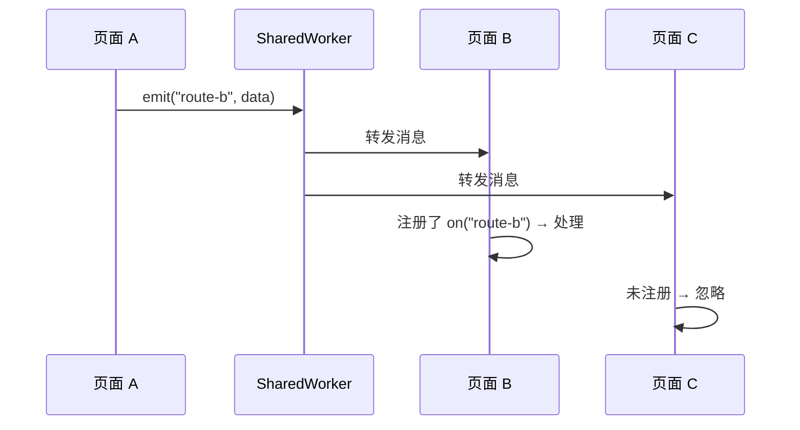
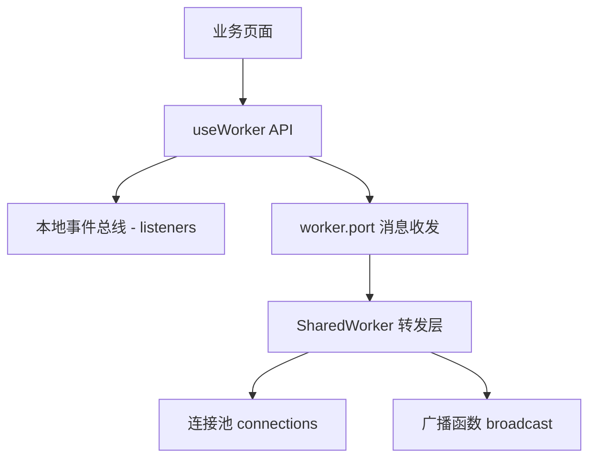

# SharedWorker 与 Vue 消息机制封装

## 概述

裸用 SharedWorker 意味着每个页面都要重复编写端口注册、消息监听、ID 维护等逻辑。将其封装为 Vue Composition API（`useWorker()`），可以统一输入输出、隐藏 Worker 细节，让业务页面只关心 `emit` / `on` / `broadcast` 这套事件语义。本文详解封装目标、消息协议设计、"广播 + 过滤"分发模型与完整实现。

## 前置知识

- 掌握 SharedWorker 端口池转发机制（参见 [06-SharedWorker端口池转发机制](06-SharedWorker端口池转发机制.md)）
- 熟悉 Vue 3 Composition API（ref、onUnmounted）
- 了解事件订阅/发布模式

## 学习目标

- 设计 `useWorker()` 的对外 API（emit / on / broadcast / message / connections）
- 理解"底层广播转发 + 上层按 eventName 过滤"的分发模型
- 实现 Worker 侧连接池与 connected 握手机制
- 掌握页面侧本地事件总线的封装方式

---

## 一、封装目标

### 1.1 从"能通信"到"好复用"

如果每个页面都自己重复编写注册端口、发送消息、监听消息、维护页面 ID 的逻辑，代码分散且难以维护。封装的核心目标是：**统一收口到一个 composable，让所有页面通过同一种方式使用消息机制**。

```typescript
const { emit, on, broadcast, message, connections, currentId } = useWorker();
```

### 1.2 API 设计

| API | 类型 | 说明 |
|-----|------|------|
| `emit(eventName, data)` | 方法 | 发送指定事件的消息 |
| `on(eventName, handler)` | 方法 | 订阅事件，返回取消函数 |
| `broadcast(data)` | 方法 | 广播给所有其他页面 |
| `message` | `Ref<unknown>` | 最近一条收到的消息（响应式） |
| `connections` | `Ref<string[]>` | 当前已连接的页面 ID 列表 |
| `currentId` | `Ref<string>` | 当前页面的连接 ID |

```typescript
type UseWorkerResult = {
  emit: (eventName: string, data?: unknown) => void;
  on: (eventName: string, handler: (data: unknown) => void) => () => void;
  broadcast: (data?: unknown) => void;
  message: Ref<unknown>;
  connections: Ref<string[]>;
  currentId: Ref<string>;
};
```

设计要点：
- API 命名贴近事件系统语义（on / emit / broadcast），业务层易理解
- `message` 用 ref 暴露，配合 Vue 响应式系统直接用于模板或 watch
- `on` 返回取消订阅函数，避免页面卸载后残留监听器

---

## 二、核心设计："广播 + 过滤"模型

### 2.1 不是链路级点对点

这套机制最重要的设计决策：**Worker 底层仍然是广播转发，由各页面根据 eventName 判断是否处理**。



### 2.2 逻辑点对点 vs 链路点对点

| 类型 | 实现方式 | 特点 |
|------|---------|------|
| 逻辑点对点 | eventName 等价于页面路由，只有目标页面监听 | 简单、好扩展 |
| 链路点对点 | Worker 按 targetId 只发给目标端口 | 精确、无冗余传输 |

当前约定 `eventName` 等价于页面路由且路由唯一时，效果等同于点对点。如果多个页面监听同一事件名，则自然变为点对多——这是设计使然，不是 bug。

后续如需真正的链路级定向，新增 `targetId` 字段即可，不影响现有 API。

---

## 三、Worker 侧实现

### 3.1 消息协议

```typescript
type WorkerEvent =
  | {
      type: "emit";
      eventName: string;
      data?: unknown;
      fromId: string;
    }
  | {
      type: "broadcast";
      data?: unknown;
      fromId: string;
    }
  | {
      type: "connected";
      currentId: string;
      ids: string[];
    };
```

### 3.2 连接池与 ID 生成

```javascript
// public/shared-worker.js
const connections = {};
let nextId = 0;

function generateUniqueId() {
  return `id-${nextId++}`;
}
```

从数组升级为 `id -> port` 映射的原因：
- 支持连接唯一 ID
- 支持连接列表同步给页面
- 支持按连接排除发送者
- 为后续定向发送打基础

### 3.3 广播函数

```javascript
function broadcast(message, excludeId) {
  Object.entries(connections).forEach(([id, port]) => {
    if (id !== excludeId) {
      port.postMessage(message);
    }
  });
}
```

`excludeId` 的作用：不把消息回发给发送者自己。如需"发送者也收到"，去掉排除逻辑即可。

### 3.4 完整 Worker 实现

```javascript
// public/shared-worker.js
const connections = {};
let nextId = 0;

function generateUniqueId() {
  return `id-${nextId++}`;
}

function broadcast(message, excludeId) {
  Object.entries(connections).forEach(([id, port]) => {
    if (id !== excludeId) {
      port.postMessage(message);
    }
  });
}

self.onconnect = (connectEvent) => {
  const port = connectEvent.ports[0];
  const currentId = generateUniqueId();

  connections[currentId] = port;

  port.onmessage = (event) => {
    const payload = event.data || {};

    if (payload.type === "emit") {
      broadcast(
        {
          type: "emit",
          eventName: payload.eventName,
          data: payload.data,
          fromId: currentId,
        },
        currentId
      );
      return;
    }

    if (payload.type === "broadcast") {
      broadcast(
        {
          type: "broadcast",
          data: payload.data,
          fromId: currentId,
        },
        currentId
      );
    }
  };

  // 连接建立后主动通知页面
  port.postMessage({
    type: "connected",
    currentId,
    ids: Object.keys(connections),
  });

  port.start();
};
```

`connected` 消息的意义：页面拿到自己的 ID 和当前连接列表后，才能维护本地 `connections` 状态，也才能支持后续的路由映射。

---

## 四、页面侧 Composable 实现

```typescript
// composables/useWorker.ts
import { onUnmounted, ref } from "vue";

const worker = new SharedWorker("/shared-worker.js");
const listeners = new Map<string, Set<(data: unknown) => void>>();

const message = ref<unknown>(null);
const connections = ref<string[]>([]);
const currentId = ref("");

worker.port.addEventListener("message", (event) => {
  const data = event.data || {};
  message.value = data;

  if (data.type === "connected") {
    currentId.value = data.currentId;
    connections.value = data.ids || [];
    return;
  }

  if (data.type === "emit" && data.eventName) {
    listeners.get(data.eventName)?.forEach((handler) => {
      handler(data.data);
    });
    return;
  }

  if (data.type === "broadcast") {
    listeners.get("message")?.forEach((handler) => {
      handler(data.data);
    });
  }
});

worker.port.start();

export function useWorker() {
  function emit(eventName: string, data?: unknown) {
    worker.port.postMessage({ type: "emit", eventName, data });
  }

  function broadcast(data?: unknown) {
    worker.port.postMessage({ type: "broadcast", data });
  }

  function on(eventName: string, handler: (data: unknown) => void) {
    const bucket = listeners.get(eventName) ?? new Set();
    bucket.add(handler);
    listeners.set(eventName, bucket);

    return () => {
      bucket.delete(handler);
    };
  }

  onUnmounted(() => {
    listeners.clear();
  });

  return { emit, on, broadcast, message, connections, currentId };
}
```

### 4.1 关键设计说明

| 设计点 | 说明 |
|--------|------|
| worker 放模块级 | 整个页面共享一个连接（单例策略） |
| listeners 用 Map + Set | 按事件名分桶，Set 天然去重 |
| `on()` 返回取消函数 | 支持按订阅粒度清理 |
| `message` ref | 暴露最新消息，配合 watch 调试 |
| broadcast 消息走 "message" 通道 | 订阅 `on("message")` 即可接收所有广播 |

### 4.2 业务页面使用示例

```typescript
const { emit, on, broadcast, message, connections } = useWorker();

// 订阅特定事件
const off = on("login-success", (data) => {
  console.log("登录成功通知：", data);
});

// 发送事件
emit("login-success", { userId: "1001" });

// 广播
broadcast({ text: "全局通知" });

// 响应式消费最新消息
watch(message, (msg) => console.log("latest:", msg));
```

---

## 五、架构层次总结



- SharedWorker 负责跨页面转发
- `useWorker()` 兼具"Worker 封装"和"本地事件总线"双重职责
- 业务页面只接触 emit / on / broadcast，不感知 Worker 细节

---

## 常见问题

| 问题 | 原因 | 解决方案 |
|------|------|---------|
| 想做点对点为什么 Worker 还在广播 | 当前设计是"广播 + eventName 过滤"模型 | 接受应用层定向；真正定向需新增 targetId |
| 已有 on() 为什么还要 message ref | on 适合事件订阅，message 适合响应式展示 | 两者并存，服务不同场景 |
| 为什么给每个连接分配唯一 ID | 需要同步连接列表、排除自己、支持定向 | Worker 端维护 id -> port 映射 |
| 用路由名当 eventName 安全吗 | 只要保证事件名具有唯一业务语义即可 | 避免多个页面混听同名事件 |
| `listeners.clear()` 会影响其他组件吗 | 如果多组件共用，整体清空过于粗暴 | 生产环境按订阅粒度清理（调用 off 函数） |

---

## 最佳实践

1. **统一收口**：所有跨页面通信走 useWorker()，禁止业务页面直接操作 port
2. **事件名即契约**：eventName 设计要稳定、有业务语义，避免随意命名
3. **订阅必须解绑**：on() 返回的取消函数要在组件卸载时调用
4. **协议字段不混用**：同一层级统一用 `data` 或 `payload`，不出现 message/data/payload 三种混写
5. **单例策略明确**：worker 实例放模块级共享，不要每个组件各 new 一个

---

## 延伸阅读

- Vue 3 Composition API：https://cn.vuejs.org/guide/extras/composition-api-faq.html
- Vue 3 响应式核心：https://cn.vuejs.org/api/reactivity-core.html
- MDN SharedWorker：https://developer.mozilla.org/en-US/docs/Web/API/SharedWorker
- MDN MessagePort：https://developer.mozilla.org/en-US/docs/Web/API/MessagePort
- 下一篇：[useWorker消息分发与路由映射](08-useWorker消息分发与路由映射.md)
