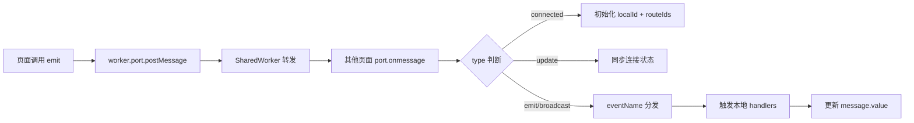

# useWorker 消息分发与路由映射

## 概述

上一篇完成了 `useWorker()` 的发送侧封装与 Worker 转发逻辑。但光能"发"还不够——当 SharedWorker 把消息发回页面后，页面侧必须知道：这条消息属于哪种类型、应该更新哪些本地状态、应该触发哪些监听回调。本文详解页面侧消息接收总入口、connected/update 握手处理、eventName 与 route.path 双层分发机制，以及 routeIds 映射表的设计。

## 前置知识

- 掌握 useWorker() 的基本封装（参见 [07-SharedWorker与Vue消息机制封装](07-SharedWorker与Vue消息机制封装.md)）
- 熟悉 Vue Router 的 `useRoute()`
- 了解事件总线（Event Bus）模式

## 学习目标

- 理解页面侧三类消息（connected / update / 业务消息）的处理分工
- 掌握 `localId` 与 `routeIds` 的初始化与用途
- 实现 eventName 精确匹配 + route.path 路由级匹配的双层分发
- 理解 handlers 空值兜底与生命周期清理

---

## 一、页面侧需要处理的消息

### 1.1 三类核心消息

```typescript
type WorkerIncomingMessage =
  | {
      type: "connected";
      id: string;
      ids?: string[];
    }
  | {
      type: "update";
      ids?: string[];
    }
  | {
      type: "emit" | "broadcast";
      eventName?: string;
      data?: unknown;
    };
```

| 消息类型 | 职责 | 处理动作 |
|---------|------|---------|
| `connected` | 初始化握手 | 记录 localId，建立路由映射 |
| `update` | 连接状态变化 | 同步最新连接列表 |
| `emit` / `broadcast` | 业务事件 | 分发到本地 handlers |

### 1.2 消息流转全链路



---

## 二、worker.port.onmessage：页面侧总入口

所有从 Worker 返回的消息都从这一个入口进入：

```typescript
worker.port.onmessage = function (event) {
  const { type, id, ids, eventName, data } = event.data || {};

  // 按 type 分支处理...
};
```

设计要点：
- 永远给 `event.data` 加默认空对象，避免解构报错
- 这是"页面侧总线接收器"，所有分发逻辑集中在此
- 如果不集中写在 useWorker() 内部，每个页面都要自己判断 type，复用价值大幅下降

---

## 三、connected 消息：初始化本地身份

### 3.1 它解决什么问题

页面第一次连接上 SharedWorker 时，Worker 返回 `connected` 消息，至少解决两件事：

1. 告诉页面"你的连接 ID 是什么"
2. 告诉页面"当前已知的连接列表有哪些"

### 3.2 本地状态设计

```typescript
const localId = ref("");
const routeIds = ref<Record<string, string>>({});
```

| 状态 | 含义 | 层次 |
|------|------|------|
| `localId` | 当前页面在连接池中的唯一标识 | 连接层身份 |
| `route.path` | 当前页面的路由路径 | 业务层身份 |
| `routeIds` | 路由路径 → 连接 ID 的映射表 | 两层之间的桥梁 |

### 3.3 处理逻辑

```typescript
const route = useRoute();

if (type === "connected") {
  localId.value = id;
  routeIds.value[route.path] = id;
  return;
}
```

`routeIds` 的价值：后续可以"按路由找连接"，实现路由级消息发送。

注意：如果多个标签页打开同一路由，仅凭 `route.path` 不再唯一，需要升级为 `route + instanceId` 组合键（详见下一篇）。

---

## 四、业务消息的双层分发

### 4.1 第一层：eventName 精确匹配

如果消息带有 `eventName`，从 handlers 集合中找到对应回调列表并逐个执行：

```typescript
if (eventName) {
  const handlers = events.get(eventName) || [];

  handlers.forEach((handler) => {
    handler(data);
  });
}
```

- eventName 可以是自定义业务事件，也可以约定为路由名
- 没有任何页面注册该 eventName 时，消息被自然丢弃（预期行为）

### 4.2 第二层：route.path 路由级匹配

课程设计中"点对点"的判断逻辑：当前页面的 `route.path` 是否等于消息的 `eventName`：

```typescript
if (eventName === route.path) {
  const handlers = events.get("message") || [];

  handlers.forEach((handler) => {
    handler(data);
  });
}
```

- `"message"` 是默认事件通道名
- 业务方把接收器注册到 `on("message")` 上，匹配到当前路由的消息就会进入默认处理器

### 4.3 空值兜底

凡是从 Map 中按 key 读取 handler 列表，必须做空值兜底：

```typescript
const handlers = events.get("message") || [];
```

不兜底时，页面未注册对应事件就会抛出 `undefined.forEach` 运行时错误。

### 4.4 更新 message.value

所有处理逻辑结束后，记录最新消息到响应式状态：

```typescript
message.value = event.data;
```

- `message.value` 保存的是"最新消息"，不是历史队列
- 需要消息日志时另起数组状态

---

## 五、完整页面侧实现

```typescript
// composables/useWorker.ts
import { onUnmounted, ref } from "vue";
import { useRoute } from "vue-router";

const worker = new SharedWorker("/shared-worker.js");
const events = new Map<string, Array<(data: unknown) => void>>();

const localId = ref("");
const routeIds = ref<Record<string, string>>({});
const message = ref<unknown>(null);

// useRoute() 只能在 setup 上下文中调用，因此在 useWorker() 内赋值
let route: ReturnType<typeof useRoute> | null = null;

worker.port.onmessage = function (event) {
  const { type, id, ids, eventName, data } = event.data || {};

  if (type === "connected") {
    localId.value = id;
    if (route) routeIds.value[route.path] = id;
    return;
  }

  if (type === "update") {
    // 按协议同步 routeIds / ids
    return;
  }

  if (eventName) {
    const handlers = events.get(eventName) || [];
    handlers.forEach((handler) => handler(data));
  }

  if (route && eventName === route.path) {
    const handlers = events.get("message") || [];
    handlers.forEach((handler) => handler(data));
  }

  message.value = event.data;
};

worker.port.start();

export function useWorker() {
  route = useRoute();

  function on(eventName: string, handler: (data: unknown) => void) {
    const handlers = events.get(eventName) || [];
    handlers.push(handler);
    events.set(eventName, handlers);

    return () => {
      const current = events.get(eventName) || [];
      events.set(
        eventName,
        current.filter((item) => item !== handler)
      );
    };
  }

  function emit(eventName: string, data?: unknown) {
    worker.port.postMessage({ type: "emit", eventName, data });
  }

  function broadcast(data?: unknown) {
    worker.port.postMessage({ type: "broadcast", data });
  }

  onUnmounted(() => {
    // 生产环境建议按订阅粒度清理，而非 events.clear()
  });

  return { worker, on, emit, broadcast, localId, routeIds, message };
}
```

### 5.1 返回值设计说明

| 返回值 | 用途 |
|--------|------|
| `worker` | 底层逃生口，调试或高级扩展用 |
| `emit` / `on` / `broadcast` | 日常业务 API |
| `localId` | 当前连接身份 |
| `routeIds` | 路由 → ID 映射索引 |
| `message` | 响应式最新消息 |

日常业务代码应优先走 emit / on / broadcast，`worker` 只在调试和特殊场景使用。

### 5.2 useRoute() 的使用约束

- `useRoute()` 必须在组件 setup 上下文中调用
- 如果 composable 未来要在非路由页面使用，需要将 route 依赖可选化

---

## 六、生命周期清理

### 6.1 onUnmounted 的职责

页面销毁时清理本页面注册的事件处理器，避免残留旧监听逻辑：

```typescript
onUnmounted(() => {
  events.clear();
});
```

### 6.2 更稳妥的方式

如果 `events` 是模块级共享状态，直接 `clear()` 可能影响其他还在使用的组件。推荐：

- `on()` 返回取消订阅函数
- 页面卸载时只移除当前页面注册的 handler
- 组件内保存 off 函数列表，onUnmounted 时逐个调用

---

## 常见问题

| 问题 | 原因 | 解决方案 |
|------|------|---------|
| emit 了但业务回调没执行 | 真正执行 handler 的是页面侧分发逻辑，不是 Worker | 检查 eventName 是否匹配、是否注册了对应 on() |
| 为什么单独处理 connected | 页面需要知道自己的连接 ID 和上下文 | 在 connected 分支初始化 localId 和映射 |
| routeIds 记录路由→ID 干什么 | 后续按路由找连接，支持路由级发送 | 连接建立时记录 route.path 与 localId 的映射 |
| `events.get("message")` 为什么兜底空数组 | 页面不一定注册了默认处理器 | `\|\| []` 防止 undefined.forEach |
| onUnmounted 直接 clear() 合适吗 | 共享状态下可能误删其他组件的监听 | 按订阅粒度解绑 |

---

## 最佳实践

1. **总入口集中分发**：所有消息处理逻辑收口在 port.onmessage 一处
2. **双层匹配互补**：eventName 精确匹配处理业务事件，route.path 匹配处理路由级通知
3. **兜底无处不在**：从 Map 取 handler 永远 `|| []`
4. **清理按粒度**：取消函数逐个解绑，不整体清空共享状态
5. **状态用 ref 暴露**：localId / routeIds / message 都走响应式，页面可直接消费

---

## 延伸阅读

- Vue Router useRoute：https://router.vuejs.org/zh/api/#useroute
- Vue 3 生命周期：https://cn.vuejs.org/guide/essentials/lifecycle.html
- MDN SharedWorker：https://developer.mozilla.org/en-US/docs/Web/API/SharedWorker
- 下一篇：[useWorker测试与生命周期维护](09-useWorker测试与生命周期维护.md)
