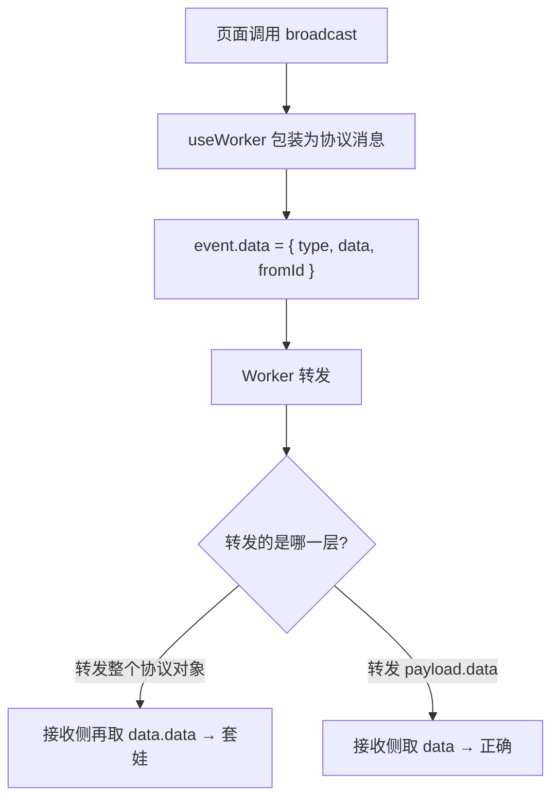
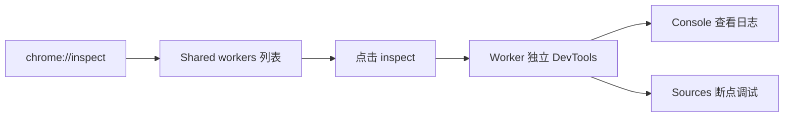
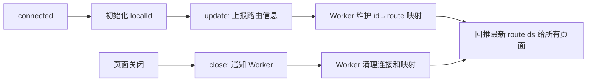

# useWorker 测试与生命周期维护

## 概述

消息机制写完不等于能用——协议结构不匹配、Worker 日志不可见、连接状态过期等问题都会在联调阶段暴露。本文记录 useWorker() 的完整测试过程：从广播消息收到 undefined 的排查，到 SharedWorker 的调试方法，再到 routeIds 在 update/close 生命周期中的持续维护，以及多标签页同路由冲突的设计边界。

## 前置知识

- 掌握 useWorker() 消息分发与路由映射（参见 [08-useWorker消息分发与路由映射](08-useWorker消息分发与路由映射.md)）
- 了解 Chrome DevTools 基本调试能力
- 了解 `beforeunload` 事件

## 学习目标

- 掌握"消息能到但值不对"类问题的排查思路
- 学会使用 chrome://inspect 调试 SharedWorker
- 实现 routeIds 在连接、更新、关闭三个阶段的完整维护
- 理解多标签页同路由场景的设计边界与演进方向

---

## 一、第一次测试：消息到了但值是 undefined

### 1.1 现象

在 login 页面点击按钮广播消息，另一个页面收到了消息事件，但业务数据是 `undefined`。

这说明：
- 消息链路本身已经通了（Worker 转发正常）
- 传输的数据结构和页面接收逻辑不一致

### 1.2 根因分析



问题出在 Worker 转发时没有正确提取业务数据层：

- `event.data` 是整条消息协议
- 页面真正关心的业务内容在 `event.data.data`
- 如果把整个协议对象原样转发再扩展，接收侧拿到的字段就会错位

### 1.3 修正

```javascript
port.onmessage = (event) => {
  const payload = event.data || {};

  if (payload.type === "broadcast") {
    broadcast(
      {
        type: "broadcast",
        data: payload.data, // 只转发业务数据层
        fromId: payload.fromId,
      },
      payload.fromId
    );
  }
};
```

核心教训：**"消息能到"和"消息结构对"是两件事。** 发现值不对时，优先排查数据结构，不要怀疑通信机制本身。

---

## 二、调试 SharedWorker

### 2.1 Worker 日志不在页面控制台

SharedWorker 运行在独立的 Worker 上下文中，在 `shared-worker.js` 里的 `console.log()` 不会出现在普通页面的 DevTools 控制台。

页面侧没看到日志 ≠ Worker 没执行。

### 2.2 Chrome 调试步骤

1. 打开 Chrome 地址栏输入 `chrome://inspect`
2. 找到 **Shared workers** 区域
3. 找到对应的 Worker 脚本
4. 点击 **inspect** 打开独立的 DevTools 窗口



在这个独立窗口中：
- Console 可以看到 Worker 内所有日志
- Sources 面板可以对 Worker 脚本打断点
- 可以检查端口池等内存状态

---

## 三、消息结构设计原则

### 3.1 协议层与业务层分离

从测试暴露的问题中总结出稳定的消息结构规范：

```typescript
type WorkerMessage = {
  // ---- 协议层 ----
  type: "broadcast" | "emit" | "update" | "connected" | "close";
  eventName?: string;
  fromId?: string;
  // ---- 业务层 ----
  data?: unknown; // 统一用一个字段承载业务数据
};
```

### 3.2 避免 data.data 套娃

| 做法 | 问题 |
|------|------|
| 业务字段也叫 `data`，嵌套在协议的 `data` 里 | `event.data.data` 极易误读 |
| 统一业务字段为 `payload` | 层次清晰，一眼区分协议与业务 |

如果项目已经用了 `data`，至少在代码注释和文档中明确区分"外层消息"和"内层业务数据"。

---

## 四、watch(message)：高效的验证手段

`message` 是响应式 ref，除了 `on()` 事件订阅外，可以直接 watch 验证：

```typescript
const { broadcast, message, routeIds } = useWorker();

function handleTest() {
  broadcast({ text: "从 login 页面发送的广播消息" });
}

watch(message, (newMessage) => {
  console.log("new message", newMessage);
});
```

| 方式 | 适用场景 |
|------|---------|
| `on(eventName)` | 事件语义明确的业务处理 |
| `watch(message)` | 调试、日志展示、状态联动 |

两者不是互斥关系，而是不同层级的使用方式。

---

## 五、routeIds 的完整生命周期

### 5.1 为什么只靠 connected 不够

仅在 `connected` 时记录"当前页面路由 → 当前 ID"远远不够：

- 新页面会继续加入
- 页面会关闭
- 同一路由可能开多个标签页

必须建立持续同步机制。

### 5.2 三个阶段



### 5.3 update 消息：同步路由与连接关系

页面侧上报：

```typescript
worker.port.postMessage({
  type: "update",
  route: route.path,
  id: localId.value,
});
```

Worker 侧处理并回推：

```javascript
const routeIds = {}; // id -> route 映射

if (payload.type === "update") {
  routeIds[payload.id] = payload.route;
  broadcast({
    type: "update",
    data: { routeIds },
  });
}
```

页面收到 update 后更新本地状态：

```typescript
if (type === "update") {
  routeIds.value = data.routeIds || {};
}
```

数据结构选择 `id -> route`（而非 route -> id）的原因：
- 同一路由可以有多个 ID（多标签页）
- 按 ID 查找路由是 O(1)
- 需要"给所有 login 页面发消息"时，遍历过滤即可

### 5.4 close 消息：页面关闭清理

```typescript
window.addEventListener("beforeunload", () => {
  worker.port.postMessage({
    type: "close",
    id: localId.value,
  });
});
```

Worker 侧清理：

```javascript
if (payload.type === "close") {
  delete routeIds[payload.id];
  delete connections[payload.id];

  broadcast({
    type: "update",
    data: { routeIds },
  });
}
```

不清理的后果：
- routeIds 残留失效页面
- 后续发消息时以为这些页面还在线
- 端口池越来越脏

### 5.5 beforeunload vs onUnmounted

| 生命周期 | 职责 | 可靠性 |
|---------|------|--------|
| `beforeunload` | 通知外部（Worker）"我要离开了" | 不是 100% 可靠 |
| `onUnmounted` | 清理自己（本地事件监听） | 组件正常卸载时可靠 |

两者分工不同，不能互相替代。生产级方案还应配合心跳检测、超时剔除等机制兜底。

---

## 六、多标签页同路由冲突

### 6.1 现象

同时打开多个 login 页面时：

```json
{
  "id-6": "/login",
  "id-7": "/login",
  "id-8": "/login"
}
```

按路由匹配发送消息给 `/login` 时，所有 login 页面都会收到——这不是 bug，而是当前设计的直接结果。

### 6.2 设计边界与演进方向

| 需求 | 当前方案 | 演进方案 |
|------|---------|---------|
| 发给某类页面（所有 login） | 按路由匹配，天然支持 | — |
| 发给某个特定页面实例 | 路由不唯一，无法区分 | 引入 targetId / instanceId |
| 精确请求-响应 | 不支持 | targetId + requestId |

当"路由不是唯一目标标识"的边界被触及时，下一步应该引入真正的 `targetId`、页面实例号或频道概念。

---

## 七、测试结论

这轮测试验证了三个关键事实：

1. **消息能不能通是一回事，消息结构对不对是另一回事** —— 协议层与业务层必须严格分离
2. **watch(message) 是验证 useWorker() 最高效的方式** —— 响应式状态天然适合调试
3. **只靠路由做目标匹配在多实例场景下不够** —— 必须继续演进消息目标模型

---

## 常见问题

| 问题 | 原因 | 解决方案 |
|------|------|---------|
| 广播链路通了但收到 undefined | 消息结构层级不匹配 | 明确协议字段与业务数据，Worker 只转发业务层 |
| 页面 Console 看不到 Worker 日志 | SharedWorker 运行在独立上下文 | chrome://inspect → Shared workers → inspect |
| 为什么要额外发 update 消息 | 仅靠 connected 无法持续同步路由关系 | 页面适时上报，Worker 统一维护并回推 |
| 页面关闭为什么要发 close | Worker 内部会残留失效连接 | beforeunload 上报 + Worker 清理 |
| 给 /login 发消息多个页面都收到 | 多标签页共享同一路由 | 需要精确到实例时引入 targetId |
| beforeunload 一定可靠吗 | 崩溃、kill 进程等场景不会触发 | 配合心跳/超时剔除兜底 |

---

## 最佳实践

1. **协议与业务分层**：外层 type/fromId 是协议，内层统一 payload 承载业务数据
2. **调试走专用入口**：chrome://inspect 是 Worker 调试的唯一正确方式
3. **routeIds 持续同步**：connected 初始化 → update 增量同步 → close 清理，三步缺一不可
4. **id → route 方向**：支持同路由多实例，比 route → id 更稳定
5. **双生命周期分工**：beforeunload 通知外部，onUnmounted 清理自己
6. **演进留口子**：协议中预留 targetId 字段位置，后续升级不破坏现有结构

---

## 延伸阅读

- MDN SharedWorker：https://developer.mozilla.org/en-US/docs/Web/API/SharedWorker
- MDN beforeunload：https://developer.mozilla.org/zh-CN/docs/Web/API/Window/beforeunload_event
- Vue 3 watch：https://cn.vuejs.org/guide/essentials/watchers.html
- Chrome DevTools 调试 Worker：https://developer.chrome.com/docs/devtools/javascript/web-workers
