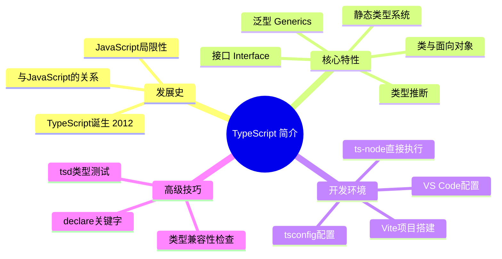

# TypeScript 简介

## 知识架构



## TypeScript 发展史

### JavaScript 的局限性

JavaScript 一开始只希望在浏览器中增加一些简单的动态效果,根本没有打算应用于大型项目。由于早期设计时间太短,因此语言细节考虑得不够严谨,甚至混乱不堪。

在一些比较小的项目中,这些问题并不明显。但随着 JavaScript 的兴起,JavaScript 的缺陷变得越来越明显,给企业带来了巨大的维护成本。其中核心的问题便是 JavaScript 是一种**动态类型语言**。不经历编译过程,所有的问题(如变量类型有误、属性为空等)都无法在代码编写时就发现,只能在运行、调试甚至测试环节才能发现。

除以上问题之外,JavaScript 还有很多设计上的缺陷:

| 问题类型 | 具体表现 |
|---------|---------|
| 类型系统 | 动态类型,缺乏类型检查 |
| 作用域 | var 变量提升,容易造成混淆 |
| 模块化 | 早期缺乏标准模块系统 |
| 面向对象 | 原型继承机制复杂难懂 |
| 兼容性 | 浏览器厂商对 ECMAScript 标准支持不一致 |

这些问题导致 JavaScript 天然地不适合开发中大型项目。业界急需一种新的语言,它既能解决 JavaScript 的核心问题,又能兼容现有的 ECMAScript 标准。

### TypeScript 的诞生

**2012年**,微软公司推出了 TypeScript。TypeScript 专为中大型项目设计,它是 **JavaScript 类型的超集**。TypeScript 在 JavaScript 的基础上添加了静态类型定义和基于类的面向对象编程等特性,彻底弥补了 JavaScript 的设计缺陷。

#### TypeScript 与 JavaScript 的关系

```
┌─────────────────────────────────────┐
│          TypeScript                 │
│  ┌───────────────────────────────┐  │
│  │      JavaScript               │  │
│  │  (ECMAScript 标准)            │  │
│  └───────────────────────────────┘  │
│  + 静态类型系统                      │
│  + 接口 (Interface)                 │
│  + 泛型 (Generics)                  │
│  + 装饰器 (Decorators)              │
│  + 枚举 (Enums)                     │
│  + 命名空间 (Namespaces)            │
└─────────────────────────────────────┘
```

TypeScript 需要编写类型定义代码,因此提高了代码的可读性,它还可以在集成开发环境下进行智能提示,并能随时通知可能产生的 Bug。

另外,JavaScript 不利于组织中大型项目的代码,而 TypeScript 中加入了面向对象编程的设计,可以使用命名空间、接口、类、装饰器等语法和特性,使代码更易于组织。TypeScript 支持最新的 ECMAScript 标准,其代码通过 TypeScript 编译器或 Babel 可以转译为 JavaScript 代码,可以在任何支持 JavaScript 的浏览器和平台中运行。

#### TypeScript 的优势

| 优势 | 说明 |
|-----|------|
| **静态类型检查** | 编译时发现类型错误,减少运行时异常 |
| **更好的 IDE 支持** | 智能提示、自动补全、重构工具 |
| **增强代码可读性** | 类型注解即文档,提高团队协作效率 |
| **ES6+ 特性支持** | 可使用最新 JavaScript 特性,编译为兼容代码 |
| **面向对象编程** | 完善的类、接口、泛型支持 |
| **渐进式采用** | 可以逐步将 JavaScript 项目迁移到 TypeScript |

## 核心特性

### 1. 静态类型系统

TypeScript 最核心的特性是静态类型系统,允许在编译时进行类型检查。

```typescript
// 基础类型
let name: string = "TypeScript";
let version: number = 5.0;
let isPopular: boolean = true;

// 数组类型
let numbers: number[] = [1, 2, 3];
let names: Array<string> = ["Alice", "Bob"];

// 对象类型
interface User {
  id: number;
  name: string;
  email?: string; // 可选属性
}

let user: User = {
  id: 1,
  name: "Alice"
};
```

### 2. 接口(Interface)

接口用于定义对象的形状,是 TypeScript 中最重要的特性之一。

```typescript
// 定义接口
interface Point {
  x: number;
  y: number;
}

// 使用接口
function printPoint(point: Point): void {
  console.log(`(${point.x}, ${point.y})`);
}

printPoint({ x: 10, y: 20 }); // 输出: (10, 20)

// 接口继承
interface Point3D extends Point {
  z: number;
}
```

### 3. 泛型(Generics)

泛型允许创建可重用的组件,可以支持多种类型而不失类型安全。

```typescript
// 泛型函数
function identity<T>(arg: T): T {
  return arg;
}

let output1 = identity<string>("hello"); // 类型为 string
let output2 = identity(123); // 类型为 number (类型推断)

// 泛型接口
interface Container<T> {
  value: T;
}

let numberContainer: Container<number> = { value: 123 };
let stringContainer: Container<string> = { value: "hello" };
```

### 4. 类与面向对象

TypeScript 提供了完善的面向对象编程支持。

```typescript
// 类定义
class Animal {
  protected name: string; // 子类需要访问,用 protected 而非 private
  
  constructor(name: string) {
    this.name = name;
  }
  
  public speak(): void {
    console.log(`${this.name} makes a sound.`);
  }
}

// 继承
class Dog extends Animal {
  constructor(name: string) {
    super(name);
  }
  
  public speak(): void {
    console.log(`${this.name} barks.`);
  }
}

const dog = new Dog("Buddy");
dog.speak(); // 输出: Buddy barks.
```

### 5. 类型推断

TypeScript 具有强大的类型推断能力,无需显式注解所有类型。

```typescript
let x = 10; // 推断为 number 类型
let y = "hello"; // 推断为 string 类型

// 函数返回值推断
function add(a: number, b: number) {
  return a + b; // 返回类型推断为 number
}
```

## TypeScript vs JavaScript

### 语法对比示例

```typescript
// ========== JavaScript ==========
function greet(name) {
  return "Hello, " + name;
}

let result = greet(123); // 运行时不会报错,但结果不符合预期
console.log(result); // "Hello, 123"

// ========== TypeScript ==========
function greet(name: string): string {
  return "Hello, " + name;
}

let result = greet(123); // 编译时报错:类型"number"的参数不能赋给类型"string"的参数
```

### 主要区别对比表

| 特性 | JavaScript | TypeScript |
|-----|-----------|-----------|
| 类型系统 | 动态类型 | 静态类型 |
| 类型检查 | 运行时 | 编译时 |
| 编译需求 | 不需要编译 | 需要编译为 JavaScript |
| IDE 支持 | 基础支持 | 强大的智能提示和重构 |
| 接口 | 不支持 | 支持 |
| 泛型 | 不支持 | 支持 |
| 枚举 | 不支持(可用对象或联合类型模拟) | 支持 |
| 装饰器 | 不支持(提案中) | 支持 |
| 学习曲线 | 较低 | 中等 |

### 适用场景

| 场景 | 推荐选择 | 原因 |
|-----|---------|------|
| 小型项目/脚本 | JavaScript | 开发速度快,无需编译 |
| 中大型项目 | TypeScript | 类型安全,易于维护 |
| 团队协作项目 | TypeScript | 接口定义清晰,降低沟通成本 |
| 开源库/框架 | TypeScript | 类型定义完善,开发体验好 |
| 原型开发 | JavaScript | 快速验证想法 |
| 企业级应用 | TypeScript | 可靠性高,维护性强 |

## 安装 TypeScript

### 前提条件

- Node.js(建议 v18.0.0 或更高版本)
- npm(Node.js 自带)

### 全局安装

```bash
# 使用 npm 安装
npm install -g typescript

# 验证安装
tsc --version

# 或使用 npx(无需全局安装)
npx tsc --version
```

### 项目本地安装

```bash
# 在项目中安装
npm install --save-dev typescript

# 使用 npx 运行
npx tsc --version
```

### 安装类型定义

```bash
# Node.js 类型定义
npm install --save-dev @types/node

# 常用库的类型定义(例如 lodash)
npm install --save-dev @types/lodash
```

## 开发环境搭建

### VS Code 编辑器设置

VS Code 由 TypeScript 构建,因此对 TypeScript 提供了顶级的原生支持,包括智能感知、类型检查和代码补全。

#### 推荐插件

安装插件能显著提升 TypeScript 开发体验:

- **TypeScript Importer**: 自动扫描项目中的所有类型定义,并在你输入 `:` 时提供智能补全。选择后,它会自动导入所需类型,极大简化了类型管理。

- **Move TS**: 在重构或调整项目结构时,此插件能自动更新因文件移动或重命名而产生的模块导入路径,保持代码的整洁和可维护性。

- **ErrorLens**: 将 VS Code 问题面板中的错误和警告直接内联显示在代码中,使问题定位更加直观、快捷。

- **Pretty TypeScript Errors**: 美化 TS 错误提示,将复杂的类型错误格式化展示。

- **ESLint**: 代码质量检查,确保代码符合最佳实践。

- **Prettier**: 代码格式化工具,保持代码风格一致。

- **Path Intellisense**: 路径自动补全,提高开发效率。

#### 优化 VS Code 配置

通过调整 VS Code 的内置设置,可以获得更丰富的代码提示和类型信息。

1. **打开工作区设置**: 使用 `Ctrl/Cmd + Shift + P` 打开命令面板,搜索并选择"打开工作区设置 (JSON)"。

2. **启用内联提示 (Inlay Hints)**: 在 `settings.json` 文件中添加以下配置,以便在编辑器中直接看到推导出的类型、参数名等信息。

```json
{
  "typescript.inlayHints.parameterNames.enabled": "all",
  "typescript.inlayHints.parameterTypes.enabled": true,
  "typescript.inlayHints.variableTypes.enabled": true,
  "typescript.inlayHints.propertyDeclarationTypes.enabled": true,
  "typescript.inlayHints.functionLikeReturnTypes.enabled": true,
  "typescript.inlayHints.enumMemberValues.enabled": true
}
```

**效果示例**：

```typescript
// 开启 Inlay Hints 后的代码显示效果：

//              ↓ 参数名提示     ↓ 参数名提示
function greet(name: string, age: number) {}
greet('linbudu', 20);

// ↓ 返回类型提示
const fn = () => 'hello';  // : string

// ↓ 变量类型提示
const obj = { name: 'linbudu' };  // : { name: string }

// ↓ 属性类型提示（类属性从初始值推断）
class User {
    name = 'linbudu';  // : string
}
```

### 其他开发工具

| 工具 | 特点 | 推荐指数 |
|-----|------|---------|
| **WebStorm** | JetBrains 出品,功能强大的 IDE | ⭐⭐⭐⭐⭐ |
| **Sublime Text** | 轻量级编辑器,需要安装插件 | ⭐⭐⭐ |
| **Vim/Neovim** | 高度可定制,适合高级用户 | ⭐⭐⭐⭐ |

### 在线开发工具

- **[TypeScript Playground](https://www.typescriptlang.org/zh/play)**: 官方提供的在线代码编辑器,无需任何本地配置即可编写、运行和分享 TypeScript 代码。非常适合快速学习和验证、调试 `tsconfig.json` 配置、代码分享。

- **[StackBlitz](https://stackblitz.com/)**: 在线 IDE,支持完整的 TypeScript 项目开发。

- **[CodeSandbox](https://codesandbox.io/)**: 在线代码编辑器,适合快速原型开发。

## 快速上手

### 方式一: TypeScript Playground

[TypeScript Playground](https://www.typescriptlang.org/zh/play) 是官方提供的在线代码编辑器,无需任何本地配置即可编写、运行和分享 TypeScript 代码。它非常适合:

- **快速学习和验证**: 即时查看编译后的 JavaScript 代码和类型声明文件
- **调试 `tsconfig.json`**: 通过可视化界面轻松切换 TypeScript 版本和编译选项,直观了解各项配置的作用
- **代码分享**: 生成可分享的链接,方便与他人交流

> 💡 遇到不确定的类型行为时,优先在 Playground 中验证,比在项目中试错更高效。

### 方式二: 命令行编译

#### 编写第一个程序

创建文件 `hello.ts`:

```typescript
// hello.ts

// 定义接口
interface Greeting {
  message: string;
  timestamp: Date;
}

// 创建问候对象
const greeting: Greeting = {
  message: "Hello, TypeScript!",
  timestamp: new Date()
};

// 打印问候信息
function printGreeting(greeting: Greeting): void {
  console.log(`${greeting.message} - ${greeting.timestamp.toLocaleString()}`);
}

printGreeting(greeting);
```

#### 编译 TypeScript

```bash
# 编译单个文件
tsc hello.ts

# 编译后生成 hello.js 文件
node hello.js
```

### 方式三: ts-node 直接执行

`ts-node` 是强大的工具,允许直接在 Node.js 环境中执行 TypeScript 文件,无需手动编译。

```bash
# 安装 ts-node
npm install -g ts-node typescript

# 初始化项目
tsc --init

# 创建并执行 TS 文件
ts-node index.ts
```

**常用命令行参数**:

- `--transpileOnly` (`-T`): 禁用类型检查,加快执行速度,适用于快速脚本验证
- `--swc`: 使用 SWC 作为编译器,进一步提升 `transpileOnly` 模式下的编译性能
- `--project` (`-P`): 指定 `tsconfig.json` 文件的路径

如果只需要快速运行而不追求完整的类型检查,也可以选择基于 esbuild 的极速运行器 `tsx`:

```bash
npx tsx src/index.ts
```

### 方式四: ts-node-dev 热重载

在开发 Node.js 应用时,希望代码变更后能自动重启服务。`ts-node-dev` 提供了高效的热重载功能。

```bash
# 安装 ts-node-dev
npm install -g ts-node-dev

# 使用热重载
ts-node-dev --respawn --transpile-only app.ts
```

参数说明:
- `--respawn`: 启用热重载
- `--transpile-only`: 跳过类型检查以实现快速重启

### 方式五: Vite + TypeScript

对于现代前端项目,推荐使用 Vite 来搭建开发环境。Vite 提供极速的冷启动、闪电般的热模块替换(HMR)和开箱即用的 TypeScript 支持。

```bash
# 创建项目
npm create vite@latest my-ts-app -- --template react-ts

# 启动开发服务器
cd my-ts-app
npm install
npm run dev

# 生产构建
npm run build
```

Vite 开发服务器启动速度极快,并且 HMR 性能出色,是现代 TypeScript 项目的首选。

### 使用配置文件

创建 `tsconfig.json` 配置文件:

```json
{
  "compilerOptions": {
    "target": "ES2020",          // 编译目标版本
    "module": "commonjs",        // 模块系统
    "outDir": "./dist",          // 输出目录
    "rootDir": "./src",          // 源码目录
    "strict": true,              // 启用严格模式
    "esModuleInterop": true,     // ES 模块互操作性
    "skipLibCheck": true,        // 跳过库检查
    "forceConsistentCasingInFileNames": true
  },
  "include": ["src/**/*"],
  "exclude": ["node_modules"]
}
```

使用配置文件编译:

```bash
# 使用 tsconfig.json 配置编译
tsc

# 监听文件变化,自动编译
tsc --watch
```

### 项目结构示例

```
my-typescript-project/
├── src/
│   ├── index.ts
│   ├── utils/
│   │   └── helpers.ts
│   └── types/
│       └── index.ts
├── dist/                   # 编译输出目录
├── node_modules/
├── package.json
├── tsconfig.json
└── README.md
```

## 高级技巧:类型兼容性检查

在 TypeScript 中有时需要检查一个类型是否可以赋值给另一个类型。除了通过变量赋值来验证,还可以使用更优雅的方式。

### 使用 `declare` 关键字

`declare` 关键字可以创建一个仅存在于类型空间的变量,它在编译后会被完全移除,不会产生任何运行时代码。这使得可以在不创建实际变量的情况下进行类型比较。

```typescript
interface Foo {
  name: string
  age: number
}

interface Bar {
  name: string
  job: string
}

declare let foo: Foo
declare let bar: Bar

// 类型不兼容,会产生编译错误
foo = bar // Error: Property 'age' is missing in type 'Bar' but required in type 'Foo'.
```

### 使用 `tsd` 进行声明式类型测试

`tsd` 是用于编写类型测试的工具,提供一系列断言函数,可以验证类型是否符合预期。

```bash
npm install -D tsd
```

**使用示例**:

```typescript
import { expectType, expectAssignable } from "tsd"

// 检查类型是否完全匹配
expectType<string>("linbudu") // √
expectType<string>(599) // × Error

// 检查类型是否可赋值
interface User {
  name: string
  age?: number
}

const user: User = { name: "linbudu" }
expectAssignable<User>(user) // √
```

`tsd` 非常适合在库开发或复杂类型逻辑中编写单元测试,以确保类型定义的正确性。

## 学习路径

### 学习路线图

#### 按能力维度：类型 → 语法 → 工程

TypeScript 由三个部分组成：**类型、语法与工程**，这也对应了学习 TypeScript 的最佳路径：

1. **类型能力**：最核心的部分，也是学习成本最高的部分。它为 JavaScript 中的变量、函数等概念提供了类型的标注，同时内置了一批类型工具，基于这些类型工具就能实现更复杂的类型描述，将类型关联起来。从最简单的类型开始，每学到一个新的类型能力就添加上去，思考它和已掌握部分的交相融合，以此一步步掌握整个类型系统。

2. **语法部分**：TypeScript 提前支持了一些已经到达 Stage 3/4 阶段，或是比较重要的 TC39 提案，比如可选链（`?.`）、空值合并（`??`）、装饰器等。这一部分几乎没有学习成本，只需要多提醒自己去使用，及时查询官方文档就能熟悉。

3. **工程能力**：TypeScript 会在构建时抹除类型代码与语法降级，这一能力通过 TypeScript Compiler（tsc）实现。tsc 以及 TSConfig 是工程层面的重要部分，另外还可以通过类型声明的方式在 TypeScript 中使用 JavaScript 社区的大量 npm 包。

> **类型、语法、工程**也代表了三个不同阶段使用 TypeScript 的目的：为 JavaScript 代码添加类型与类型检查来确保健壮性，提前使用新语法或新特性来简化代码，以及最终获得可用的 JavaScript 代码。

#### 按学习阶段：入门 → 进阶 → 高级 → 实战

```
入门阶段
├── TypeScript 基础语法
├── 静态类型系统
├── 接口和类型别名
└── 函数类型定义

进阶阶段
├── 类和面向对象编程
├── 泛型编程
├── 高级类型(联合类型、交叉类型)
└── 类型守卫和类型推断

高级阶段
├── 装饰器
├── 命名空间和模块
├── 声明文件编写
└── 类型体操

实战应用
├── React + TypeScript
├── Vue + TypeScript
├── Node.js + TypeScript
└── 构建开源项目
```

### 推荐学习资源

**官方资源**
- [TypeScript 官方文档](https://www.typescriptlang.org/docs/)
- [TypeScript Handbook](https://www.typescriptlang.org/docs/handbook/)

**推荐书籍**
- 《TypeScript 编程》
- 《深入理解 TypeScript》

**在线教程**
- TypeScript 官方教程
- TypeScript Deep Dive(开源电子书)

**延伸阅读**
- [Node.js `require` 机制](https://nodejs.org/api/modules.html#modules_the_module_wrapper): 了解 `ts-node` 等工具背后的模块加载原理
- [Vite 官方文档](https://vitejs.dev/): 深入学习 Vite 的强大功能
- [tsd 官方文档](https://github.com/SamVerschueren/tsd): 掌握更多类型测试的技巧

## 常见问题

### Q1: TypeScript 会影响性能吗?

**答**: TypeScript 在编译时进行类型检查,编译后生成的 JavaScript 代码不会包含类型信息,因此运行时性能与普通 JavaScript 相同。

### Q2: 如何将现有 JavaScript 项目迁移到 TypeScript?

**答**: 建议采用渐进式迁移策略:

1. 安装 TypeScript 和相关类型定义
2. 创建 `tsconfig.json`,设置 `allowJs: true`
3. 将 `.js` 文件重命名为 `.ts`,逐步添加类型
4. 启用严格模式,修复类型错误

### Q3: TypeScript 支持哪些 JavaScript 库?

**答**: TypeScript 支持所有 JavaScript 库。大多数流行库都有官方或社区提供的类型定义文件(在 DefinitelyTyped 仓库中)。

```bash
# 查找类型定义包
npm search @types/[库名]
```

### Q4: 编译后的 JavaScript 文件可以用于生产环境吗?

**答**: 可以。TypeScript 编译器生成的 JavaScript 代码完全符合标准,可以直接用于生产环境。建议配置:
- 设置合适的 `target`(如 ES2015+)
- 启用代码压缩和混淆
- 使用 source map 便于调试

### Q5: TypeScript 和 Flow 有什么区别?

| 特性 | TypeScript | Flow |
|-----|-----------|------|
| 开发者 | Microsoft | Meta (Facebook) |
| 类型系统 | 结构化类型 | 结构化类型 |
| 编译方式 | 独立编译器 | Babel 插件 |
| 生态支持 | 更完善 | 相对较少 |
| 学习曲线 | 中等 | 较低 |
| 社区活跃度 | 高 | 中 |

**建议**: 对于新项目,推荐使用 TypeScript,其生态系统更加完善,社区支持更好。

### Q6: 如何处理第三方库没有类型定义的情况?

**答**: 有几种解决方案:

```typescript
// 方案1: 使用 any 类型(不推荐)
declare module 'some-library';

// 方案2: 创建本地类型定义文件
// types/some-library.d.ts
declare module 'some-library' {
  export function someFunction(param: string): number;
}

// 方案3: 使用 @ts-ignore 临时忽略(不推荐)
// @ts-ignore
import { someFunction } from 'some-library';
```

---

## 总结

TypeScript 作为 JavaScript 的超集,通过静态类型系统和面向对象编程特性,弥补了 JavaScript 在大型项目开发中的不足。虽然学习 TypeScript 需要一定的时间成本,但其带来的代码质量提升、开发效率提高和维护成本降低,使其成为现代前端开发的重要工具。

**关键要点**:
- ✅ TypeScript 是 JavaScript 的类型超集
- ✅ 提供编译时类型检查,减少运行时错误
- ✅ 支持最新的 ECMAScript 特性
- ✅ 完善的面向对象编程支持
- ✅ 强大的 IDE 工具支持
- ✅ 渐进式采用,可与 JavaScript 共存

**下一步行动**:
1. 搭建 TypeScript 开发环境
2. 学习基础类型和接口
3. 实践小型项目
4. 逐步深入高级特性
