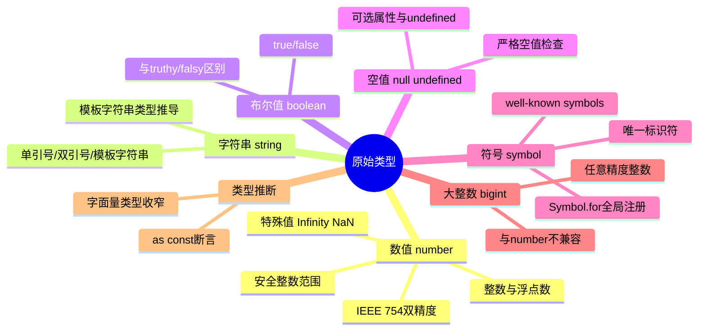

# 原始类型

原始类型（Primitive Types）是 TypeScript 类型系统的基础，它们表示不可变的值。理解原始类型对于编写类型安全的 TypeScript 代码至关重要。

## 知识架构



## 概述

JavaScript 内置原始类型包括 `number`、`string`、`boolean`、`null`、`undefined`，ES6 和 ES11 又分别引入了 `symbol` 与 `bigint`。TypeScript 为这些原始类型提供了完整的类型注解支持。

### 原始类型总览

| 类型 | JavaScript 版本 | 描述 | 典型用途 | 示例值 |
|------|----------------|------|----------|--------|
| `number` | ES1 | 双精度 64 位浮点数 | 数值计算 | `42`, `3.14`, `0b1010` |
| `string` | ES1 | UTF-16 字符序列 | 文本数据 | `"hello"`, `'world'`, `` `template` `` |
| `boolean` | ES1 | 逻辑值 | 条件判断 | `true`, `false` |
| `null` | ES1 | 空值引用 | 表示"无值" | `null` |
| `undefined` | ES1 | 未定义值 | 表示"未初始化" | `undefined` |
| `symbol` | ES6 | 唯一标识符 | 对象属性键、元编程 | `Symbol('key')` |
| `bigint` | ES11 | 任意精度整数 | 大整数运算 | `9007199254740991n` |

## 基础原始类型

### `number`

`number` 类型表示 JavaScript 中的所有数字（包括整数和浮点数），采用 IEEE 754 标准的双精度 64 位二进制格式。

```typescript
// 十进制
const integer: number = 42
const float: number = 3.14
const negative: number = -17

// 二进制、八进制、十六进制
const binary: number = 0b1010    // 10
const octal: number = 0o744      // 484
const hex: number = 0xf00d       // 61453

// 特殊数值
const infinity: number = Infinity
const negativeInfinity: number = -Infinity
const notANumber: number = NaN
```

**注意事项：**

```typescript
// ⚠️ IEEE 754 精度问题
console.log(0.1 + 0.2) // 0.30000000000000004

// ⚠️ 大整数精度丢失
const bigNumber = 9007199254740993  // 超过安全整数范围
console.log(bigNumber === 9007199254740992) // true (精度丢失)

// ✅ 使用 Number.MAX_SAFE_INTEGER 和 Number.MIN_SAFE_INTEGER
const maxSafeInteger: number = Number.MAX_SAFE_INTEGER  // 9007199254740991
const minSafeInteger: number = Number.MIN_SAFE_INTEGER  // -9007199254740991

// ✅ 使用 Number.isSafeInteger() 检查
if (Number.isSafeInteger(bigNumber)) {
  console.log('安全的整数')
}
```

**类型推断：**

```typescript
// TypeScript 会自动推断为 number 类型
let inferredNumber = 42       // 类型推断为 number
inferredNumber = 3.14        // OK
// inferredNumber = "42"      // Error: Type 'string' is not assignable to type 'number'
```

### `string`

`string` 类型表示文本数据，支持单引号、双引号和模板字符串。

```typescript
// 单引号和双引号
const single: string = 'Hello'
const double: string = "World"

// 模板字符串
const name: string = "Alice"
const age: number = 28
const greeting: string = `Hello, ${name}! You are ${age} years old.`

// 多行字符串
const multiline: string = `
  This is a
  multiline string
`

// 字符串方法返回 string 类型
const upper: string = greeting.toUpperCase()
const parts: string[] = greeting.split(',')
```

**常见陷阱：**

```typescript
// ⚠️ 字符串和数字拼接
const num: number = 42
const str: string = "The answer is " + num  // 自动转换为字符串

// ⚠️ 空字符串 vs 空格字符串
const empty: string = ""
const space: string = " "
console.log(empty.length)  // 0
console.log(space.length)  // 1

// ✅ 使用模板字符串更清晰
const better: string = `The answer is ${num}`
```

### `boolean`

`boolean` 类型表示逻辑值，只有 `true` 和 `false` 两个值。

```typescript
const isTrue: boolean = true
const isFalse: boolean = false

// 条件表达式的结果
const isAdult: boolean = age >= 18
const hasPermission: boolean = true

// 布尔运算
const bothTrue: boolean = isTrue && hasPermission
const eitherTrue: boolean = isTrue || isFalse
const negated: boolean = !isTrue
```

**类型推断陷阱：**

```typescript
// ⚠️ 注意区分布尔值和布尔对象的区别
const isBoolean: boolean = true          // 原始类型 boolean
const isBooleanObject: Boolean = true    // Boolean 对象（不推荐）
const booleanObject: Boolean = new Boolean(true) // 对象（不推荐）

// ⚠️ Boolean 对象总是 truthy
const falseObject = new Boolean(false)
if (falseObject) {
  console.log("This will execute!")  // 意外的行为
}

// ✅ 始终使用小写 boolean 类型
function toggle(flag: boolean): boolean {
  return !flag
}
```

## 特殊原始类型

### `null` 与 `undefined`

`undefined` 表示一个变量**已声明但未被赋值**，而 `null` 则用于**主动地表示一个值不存在**。在 TypeScript 中 `null` 和 `undefined` 拥有各自独立的类型。

#### `strictNullChecks` 配置

在 `tsconfig.json` 中配置 `strictNullChecks` 选项会显著影响类型检查行为。**强烈推荐始终开启此选项**。

**配置对比：**

| 配置项 | `strictNullChecks: false` | `strictNullChecks: true` |
|--------|---------------------------|---------------------------|
| `null` 赋值给其他类型 | ✅ 允许 | ❌ 禁止 |
| `undefined` 赋值给其他类型 | ✅ 允许 | ❌ 禁止 |
| 类型安全性 | 低 | 高 |
| 运行时错误风险 | 高 | 低 |

**示例：**

```typescript
// tsconfig.json: { "compilerOptions": { "strictNullChecks": true } }

// ❌ 错误：不能将 null 赋值给 string
let name: string = "Alice"
// name = null        // Error: Type 'null' is not assignable to type 'string'
// name = undefined   // Error: Type 'undefined' is not assignable to type 'string'

// ✅ 正确：使用联合类型明确表示可能为空
let nullableName: string | null = "Alice"
nullableName = null   // OK

let optionalName: string | undefined = "Bob"
optionalName = undefined  // OK

// ✅ 使用可选参数
function greet(name?: string) {
  // name 的类型为 string | undefined
  if (name) {
    console.log(`Hello, ${name}!`)
  } else {
    console.log("Hello, stranger!")
  }
}
```

#### `null` vs `undefined` 使用场景

```typescript
// undefined: 表示"缺失"或"未初始化"
let undefinedValue: undefined = undefined

// null: 表示"空"或"无值"（主动设置）
let nullValue: null = null

// 实际应用
interface User {
  id: number
  name: string
  email: string | null  // null 表示用户没有设置邮箱
  phone?: string        // undefined 表示该字段可选
}

const user: User = {
  id: 1,
  name: "Alice",
  email: null,          // 主动设置为 null
  // phone 未提供，为 undefined
}
```

#### 类型守卫与空值检查

```typescript
// 类型守卫
function processValue(value: string | null | undefined) {
  // ✅ 严格检查
  if (value === null) {
    return "value is null"
  }
  if (value === undefined) {
    return "value is undefined"
  }
  return value.toUpperCase()
}

// ✅ 使用可选链操作符
interface Config {
  server?: {
    host?: string
    port?: number
  }
}

const config: Config = {}
const host = config.server?.host  // string | undefined

// ✅ 使用空值合并运算符
const value: string | null = null
const result = value ?? "default"  // "default"
```

### `void`

`void` 类型主要用于表示**一个函数没有任何返回值**或不需要关注其返回值。

#### 基本用法

```typescript
// 没有返回值的函数
function logMessage(message: string): void {
  console.log(message)
  // 没有显式 return，隐式返回 undefined
}

// 显式 return
function doNothing(): void {
  return  // OK，等同于 return undefined
}

// 可以返回 undefined
function returnUndefined(): void {
  return undefined  // OK
}
```

#### `void` vs `undefined` 作为返回值类型

```typescript
// void: 可以不返回，也可以返回 undefined
function voidFunction(): void {
  // return;          // OK
  return undefined    // OK
  // return null;     // Error (with strictNullChecks)
}

// undefined: 必须显式返回 undefined
function undefinedFunction(): undefined {
  return undefined    // 必须有 return
  // return;          // Error: A function whose declared type is neither 'void' nor 'any' must return a value.
}
```

**关键区别：**

| 特性 | `void` | `undefined` |
|------|--------|-------------|
| 可以不返回 | ✅ 是 | ❌ 否 |
| 可以返回 `undefined` | ✅ 是 | ✅ 是 |
| 必须显式返回 | ❌ 否 | ✅ 是 |
| 典型用途 | 忽略返回值 | 明确返回 undefined |

#### 实际应用场景

```typescript
// 1. 回调函数
function processArray(
  items: string[],
  callback: (item: string, index: number) => void
): void {
  items.forEach((item, index) => {
    callback(item, index)  // 不关心回调的返回值
  })
}

processArray(["a", "b", "c"], (item, index) => {
  console.log(`${index}: ${item}`)
})

// 2. 事件处理器
type EventHandler = (event: Event) => void

document.addEventListener("click", ((event: Event) => {
  console.log("Clicked!")
}) as EventHandler)

// 3. 不需要返回值的方法
class Logger {
  private logs: string[] = []

  log(message: string): void {
    this.logs.push(message)
    console.log(message)
  }

  clear(): void {
    this.logs = []
  }
}
```

## 新增原始类型

### `symbol`

`symbol` 是 ES6 引入的原始类型，表示唯一的标识符。每个 `Symbol()` 调用都会创建一个唯一的值。

#### 基本用法

```typescript
// 创建唯一的 symbol
const sym1: symbol = Symbol()
const sym2: symbol = Symbol("description")  // 描述仅用于调试
const sym3: symbol = Symbol("description")

console.log(sym2 === sym3)  // false，每个 Symbol 都是唯一的

// Symbol.description (ES2019)
console.log(sym2.description)  // "description"
```

#### 作为对象属性键

```typescript
// Symbol 作为属性键
const uniqueKey = Symbol("key")

interface User {
  name: string
  [uniqueKey]: string
}

const user: User = {
  name: "Alice",
  [uniqueKey]: "secret"
}

console.log(user[uniqueKey])  // "secret"

// Symbol 属性不会被常规方法枚举
console.log(Object.keys(user))  // ["name"]
console.log(JSON.stringify(user))  // {"name":"Alice"}
```

#### 全局 Symbol 注册表

```typescript
// Symbol.for() - 在全局注册表中创建或获取 Symbol
const globalSym1 = Symbol.for("app.id")
const globalSym2 = Symbol.for("app.id")

console.log(globalSym1 === globalSym2)  // true，相同 key 返回同一个 Symbol

// Symbol.keyFor() - 获取全局 Symbol 的 key
console.log(Symbol.keyFor(globalSym1))  // "app.id"

// 普通符号不在全局注册表中
const localSym = Symbol("local")
console.log(Symbol.keyFor(localSym))  // undefined
```

#### 内置 Symbol 值

JavaScript 提供了多个内置 Symbol 值（well-known symbols），用于自定义对象行为：

```typescript
// Symbol.iterator - 自定义迭代行为
class Range {
  constructor(
    private start: number,
    private end: number
  ) {}

  [Symbol.iterator](): Iterator<number> {
    let current = this.start
    return {
      next: () => {
        if (current <= this.end) {
          return { value: current++, done: false }
        }
        return { value: undefined, done: true }
      }
    }
  }
}

const range = new Range(1, 3)
for (const num of range) {
  console.log(num)  // 1, 2, 3
}

// Symbol.toStringTag - 自定义 Object.prototype.toString 的输出
class MyClass {
  get [Symbol.toStringTag]() {
    return "MyClass"
  }
}

console.log(Object.prototype.toString.call(new MyClass()))  // "[object MyClass]"

// Symbol.toPrimitive - 自定义类型转换
class Money {
  constructor(private amount: number) {}

  [Symbol.toPrimitive](hint:%20string) {
    switch (hint) {
      case "string":
        return `$${this.amount}`
      case "number":
        return this.amount
      default:
        return this.amount
    }
  }
}

const price = new Money(100)
console.log(`${price}`)    // "$100"
console.log(+price)        // 100
console.log(price + 50)    // 150
```

#### unique symbol

Symbol 在 JavaScript 中代表着一个唯一的值类型，它类似于字符串类型，可以作为对象的属性名，并用于避免错误修改对象/Class 内部属性的情况。而在 TypeScript 中，`symbol` 类型并不具有这一特性——一百个具有 `symbol` 类型的对象，它们的 symbol 类型指的都是 TypeScript 中的同一个类型。为了实现"独一无二"这个特性，TypeScript 中支持了 `unique symbol` 这一类型声明，它是 `symbol` 类型的子类型，每一个 `unique symbol` 类型都是独一无二的。

```typescript
const uniqueSymbolFoo: unique symbol = Symbol("linbudu")

// 类型不兼容
const uniqueSymbolBar: unique symbol = uniqueSymbolFoo
```

在 JavaScript 中，我们可以用 `Symbol.for` 方法来复用已创建的 Symbol，如 `Symbol.for("linbudu")` 会首先查找全局是否已经有使用 `linbudu` 作为 key 的 Symbol 注册，如果有，则返回这个 Symbol，否则才会创建新的 Symbol。

在 TypeScript 中，如果要引用已创建的 `unique symbol` 类型，则需要使用类型查询操作符 `typeof`：

```typescript
declare const uniqueSymbolFoo: unique symbol;

const uniqueSymbolBaz: typeof uniqueSymbolFoo = uniqueSymbolFoo
```

> `unique symbol` 在日常开发中的使用非常少见，了解即可。

### `bigint`

`bigint` 是 ES11 引入的原始类型，用于表示任意精度的整数，解决了 `number` 类型的精度限制问题。

#### 基本用法

```typescript
// 字面量形式（后缀 n）
const big1: bigint = 9007199254740991n
const big2: bigint = 123456789012345678901234567890n

// BigInt() 函数
const big3: bigint = BigInt(9007199254740991)
const big4: bigint = BigInt("9007199254740991")
const big5: bigint = BigInt("0x1fffffffffffff")  // 十六进制

// 从 number 转换
const num = 123
const bigFromNum: bigint = BigInt(num)
```

#### 运算与精度

```typescript
// ✅ 大整数运算，无精度丢失
const huge1 = 9007199254740993n  // 超过 MAX_SAFE_INTEGER
const huge2 = 9007199254740993n
console.log(huge1 + huge2)  // 18014398509481986n

// ⚠️ bigint 和 number 不能混合运算
const big: bigint = 10n
const num: number = 5

// console.log(big + num)     // Error: Operator '+' cannot be applied to types 'bigint' and 'number'
console.log(big + BigInt(num))  // 15n
console.log(Number(big) + num)  // 15

// 支持的运算符
console.log(10n + 5n)    // 15n (加法)
console.log(10n - 5n)    // 5n (减法)
console.log(10n * 5n)    // 50n (乘法)
console.log(10n / 3n)    // 3n (除法，向下取整)
console.log(10n % 3n)    // 1n (取余)
console.log(10n ** 3n)   // 1000n (幂运算)

// ⚠️ 不支持的一元运算符
// console.log(+big)       // Error: Cannot convert a BigInt value to a number
// console.log(-big)       // OK: -10n
```

#### 比较与类型转换

```typescript
// ✅ bigint 和 number 可以进行关系比较
console.log(10n > 5)      // true
console.log(10n < 20)     // true

// ⚠️ 相等比较:运行时 10n === 10 为 false(类型不同)、10n == 10 为 true(宽松相等),
// 但 TypeScript 会报编译错误 TS2367(bigint 与 number 类型无重叠),需先转换类型再比较
console.log(10n === BigInt(10))  // true
console.log(Number(10n) === 10)  // true

// 类型转换
const bigValue: bigint = 123n
const asNumber: number = Number(bigValue)    // 123
const asString: string = String(bigValue)    // "123"

// ⚠️ 注意精度丢失
const huge: bigint = 9007199254740993n
const lost: number = Number(huge)            // 9007199254740992 (精度丢失!)

// 检查是否为 bigint
console.log(typeof 10n)              // "bigint"
console.log(typeof BigInt(10))       // "bigint"
```

#### 实际应用场景

```typescript
// 1. 大整数 ID
interface DatabaseRecord {
  id: bigint
  name: string
  createdAt: bigint  // 时间戳（毫秒）
}

const record: DatabaseRecord = {
  id: 9007199254740993n,
  name: "Record 1",
  createdAt: BigInt(Date.now())
}

// 2. 高精度计算
function factorial(n: bigint): bigint {
  if (n <= 1n) return 1n
  return n * factorial(n - 1n)
}

console.log(factorial(100n))
// 93326215443944152681699238856266700490715968264381621468592963895217599993229915608941463976156518286253697920827223758251185210916864000000000000000000000000n
// 注意:BigInt 转字符串不会使用科学计数法,而是输出完整的十进制数字

// 3. 加密相关
function hash(data: string): bigint {
  // 模拟哈希计算
  let hash = 0n
  for (let i = 0; i < data.length; i++) {
    hash = (hash * 31n + BigInt(data.charCodeAt(i))) % (2n ** 64n)
  }
  return hash
}
```

## 最佳实践

### 类型注解 vs 类型推断

```typescript
// ✅ 推荐：让 TypeScript 自动推断简单类型
const message = "Hello, TypeScript"  // 自动推断为 string
const count = 42                      // 自动推断为 number
const isValid = true                  // 自动推断为 boolean

// ✅ 推荐：为复杂类型或可变变量添加注解
let userName: string = "Alice"
userName = "Bob"  // OK

// ✅ 推荐：函数参数和返回值明确类型注解
function greet(name: string): string {
  return `Hello, ${name}!`
}

// ✅ 推荐：联合类型明确声明
type StringOrNumber = string | number
let identifier: StringOrNumber = "abc123"
identifier = 456  // OK
```

### 空值处理策略

```typescript
// ✅ 使用可选属性（undefined）
interface Config {
  host: string
  port?: number  // number | undefined
}

// ✅ 使用显式 null 表示"无值"
interface User {
  name: string
  email: string | null  // 明确表示可能没有邮箱
}

// ✅ 使用类型守卫
function processValue(value: string | null): string {
  if (value === null) {
    return "default"
  }
  return value.toUpperCase()
}

// ✅ 使用可选链和空值合并
interface DeepConfig {
  server?: {
    host?: string
    port?: number
  }
}

const config: DeepConfig = {}
const host = config.server?.host ?? "localhost"  // 提供默认值

// ✅ 使用类型谓词
function isString(value: unknown): value is string {
  return typeof value === "string"
}

function process(value: unknown) {
  if (isString(value)) {
    console.log(value.toUpperCase())  // TypeScript 知道 value 是 string
  }
}
```

### 类型别名与接口选择

```typescript
// ✅ 原始类型联合：使用类型别名
type ID = string | number
type Status = "pending" | "approved" | "rejected"

// ✅ 对象形状：使用接口
interface User {
  id: ID
  name: string
  status: Status
}

// ✅ 复杂类型组合：类型别名
type Nullable<T> = T | null
type UserResponse = Nullable<User>
```

## 常见问题与陷阱

### 1. 数字精度问题

```typescript
// ❌ 问题：IEEE 754 精度丢失
console.log(0.1 + 0.2)  // 0.30000000000000004
console.log(0.1 + 0.2 === 0.3)  // false

// ✅ 解决方案 1：使用整数运算（乘以倍数）
const price1 = 10  // 0.1 元 -> 10 分
const price2 = 20  // 0.2 元 -> 20 分
const total = (price1 + price2) / 100  // 0.3

// ✅ 解决方案 2：使用 toFixed()
const result = (0.1 + 0.2).toFixed(1)  // "0.3"
console.log(parseFloat(result))  // 0.3

// ✅ 解决方案 3：使用 bigint（如果不需要小数）
const big1 = 1n
const big2 = 2n
const bigTotal = big1 + big2  // 3n
```

### 2. 字符串拼接陷阱

```typescript
// ❌ 问题：字符串 + 数字 = 字符串
const age: number = 25
console.log("Age: " + age)        // "Age: 25"
console.log("1" + 2 + 3)          // "123"
console.log(1 + 2 + "3")          // "33"

// ✅ 使用模板字符串
console.log(`Age: ${age}`)        // "Age: 25"

// ✅ 明确类型转换
console.log("1" + String(2) + String(3))  // "123"
console.log(Number("1") + 2 + 3)          // 6
```

### 3. null 和 undefined 混淆

```typescript
// ❌ 问题：没有正确处理 null 和 undefined
function getLength(str: string | null): number {
  return str.length  // Error: str 可能为 null
}

// ✅ 使用类型守卫
function getLengthSafe(str: string | null): number {
  if (str === null) {
    return 0
  }
  return str.length
}

// ✅ 使用可选链
function getLengthOptionally(str: string | null): number {
  return str?.length ?? 0
}

// ❌ 问题：== null 同时检查 null 和 undefined
function check(value: string | null | undefined) {
  if (value == null) {
    // 这里同时捕获 null 和 undefined
    console.log("value is null or undefined")
  }
}

// ✅ 明确区分
function checkStrict(value: string | null | undefined) {
  if (value === null) {
    console.log("value is null")
  } else if (value === undefined) {
    console.log("value is undefined")
  } else {
    console.log(`value is "${value}"`)
  }
}
```

### 4. Symbol 序列化问题

```typescript
// ❌ 问题：Symbol 不能被 JSON 序列化
const data = {
  name: "Alice",
  [Symbol("id")]: 123
}

console.log(JSON.stringify(data))  // {"name":"Alice"}

// ✅ 使用 Symbol 作为元数据键
const metadataKey = Symbol("metadata")

const user = {
  name: "Alice",
  [metadataKey]: {
    createdAt: new Date(),
    version: 1
  }
}

// 访问元数据
console.log(user[metadataKey])

// ✅ 使用 toJSON 方法自定义序列化
const userWithMetadata = {
  name: "Alice",
  id: Symbol("123"),
  toJSON() {
    return {
      name: this.name,
      id: this.id.description  // 只序列化描述
    }
  }
}
```

### 5. BigInt 兼容性问题

```typescript
// ❌ 问题：JSON 不支持 bigint
const data = {
  bigNumber: 9007199254740993n
}

// JSON.stringify(data)  // Error: Do not know how to serialize a BigInt

// ✅ 解决方案 1：转换为字符串
const serialized1 = JSON.stringify({
  bigNumber: data.bigNumber.toString()
})

// ✅ 解决方案 2：自定义序列化
const serialized2 = JSON.stringify(data, (key, value) =>
  typeof value === 'bigint' ? value.toString() : value
)

// ✅ 解决方案 3：使用 toJSON 方法自定义序列化
const bigData = {
  value: 9007199254740993n,
  toJSON() {
    return { value: this.value.toString() }
  }
}
```

## TypeScript 配置参考

### `strictNullChecks`

```json
{
  "compilerOptions": {
    "strictNullChecks": true  // 强烈推荐开启
  }
}
```

**作用：**
- 将 `null` 和 `undefined` 视为独立的类型
- 防止将 `null` 或 `undefined` 赋值给其他类型
- 强制处理可能为空的值

### 相关配置

```json
{
  "compilerOptions": {
    "strict": true,                    // 启用所有严格类型检查选项
    "strictNullChecks": true,          // 严格空值检查
    "noImplicitAny": true,             // 禁止隐式 any
    "strictFunctionTypes": true,       // 严格函数类型检查
    "strictBindCallApply": true,       // 严格 bind/call/apply 检查
    "strictPropertyInitialization": true  // 严格类属性初始化检查
  }
}
```

## 总结

### 核心要点

1. **原始类型是 TypeScript 类型系统的基础**，理解每个类型的特点和适用场景至关重要。

2. **始终开启 `strictNullChecks`**，这是 TypeScript 最重要的类型安全配置之一。

3. **正确区分 `null`、`undefined` 和 `void`**：
   - `null`：主动表示"无值"
   - `undefined`：表示"缺失"或"未初始化"
   - `void`：表示函数无返回值

4. **注意 `number` 的精度限制**，对于大整数使用 `bigint`，对于高精度计算使用专门的库。

5. **善用 `symbol` 实现私有属性和元编程**，但注意序列化问题。

6. **遵循类型注解最佳实践**：简单类型让 TypeScript 推断，复杂类型明确声明。

### 类型选择决策图

```
需要表示数值？
├─ 在安全整数范围内？ → number
└─ 需要大整数？ → bigint

需要表示文本？ → string

需要表示真假？ → boolean

需要唯一标识？ → symbol

需要表示"无值"？
├─ 主动表示空值 → null
└─ 变量未初始化 → undefined

函数无返回值？ → void
```

通过深入理解原始类型的特性、正确配置 TypeScript 编译选项、遵循最佳实践，可以编写出更安全、更健壮的 TypeScript 代码。
