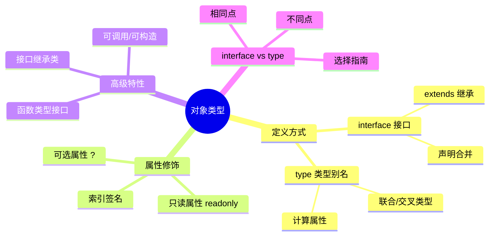

# 对象类型

在 TypeScript 中使用**接口 (interface)** 或**类型别名 (type)** 来定义对象的结构，从而获得强大的类型检查和代码提示。

## 知识架构



## 基础概念

### 什么是对象类型

对象类型描述了对象的形状（shape），即对象应该包含哪些属性、属性的类型是什么。TypeScript 采用**结构化类型系统**（也称为"鸭子类型"），只要对象的结构满足类型要求，就被认为是兼容的类型。

```typescript
interface Point {
  x: number
  y: number
}

function printPoint(point: Point) {
  console.log(`(${point.x}, ${point.y})`)
}

// 传递的对象只需要有 x 和 y 属性，类型正确即可
printPoint({ x: 10, y: 20 })
printPoint({ x: 10, y: 20, z: 30 }) // 多余的属性会被类型检查捕获
```

### 使用 `interface` 定义对象

```typescript
interface IUser {
  id: number
  name: string
  isAdmin: boolean
}

const user: IUser = {
  id: 1001,
  name: "xiaoye",
  isAdmin: true
}
```

### 使用 `type` 定义对象

```typescript
type TUser = {
  id: number
  name: string
  isAdmin: boolean
}

const user: TUser = {
  id: 1001,
  name: "xiaoye",
  isAdmin: true
}
```

## 接口特性

### 可选属性

使用 `?` 标记可选属性，表示该属性可以不存在于对象上。

```typescript
interface Profile {
  name: string
  age?: number // 可选属性
}

const p1: Profile = { name: "Alice" }       // 合法，age 属性不存在
const p2: Profile = { name: "Bob", age: 30 } // 合法

console.log(p1.age) // 输出: undefined
```

**可选属性与 `| undefined` 的区别：**

| 特性 | `prop?: T` | `prop: T \| undefined` |
| :--- | :--- | :--- |
| **属性是否必须存在** | 否，可以不存在 | 是，必须存在 |
| **属性缺失时** | 合法，读取返回 `undefined` | 编译错误（对象缺少该属性） |
| **常见场景** | 属性可能完全不返回 | 属性存在但值可能为空 |

```typescript
interface ProfileOptional {
  name: string
  age?: number // age 可以不存在
}

interface ProfileRequired {
  name: string
  age: number | undefined // age 必须存在
}

const p1: ProfileOptional = { name: "Alice" }        // 合法
// const p2: ProfileRequired = { name: "Bob" };      // 错误：缺少 age 属性
const p3: ProfileRequired = { name: "Carol", age: undefined } // 合法
```

**最佳实践：** 优先使用 `?` 表示可选属性，只有需要严格区分"属性不存在"和"属性值为 undefined"时才使用 `| undefined`。

### 只读属性

使用 `readonly` 修饰符标记只读属性，防止属性被重新赋值。

```typescript
interface Config {
  readonly apiUrl: string
  readonly timeout: number
}

const config: Config = {
  apiUrl: "https://api.example.com",
  timeout: 5000
}

// config.apiUrl = "https://new-api.example.com"; // 错误：无法分配到 "apiUrl" ，因为它是只读属性
```

**只读数组：**

```typescript
interface ReadonlyArrayExample {
  readonly items: readonly number[]
}

const example: ReadonlyArrayExample = {
  items: [1, 2, 3] as const
}

// example.items.push(4); // 错误
// example.items = [4, 5, 6]; // 错误
```

**`readonly` vs `const`：**

- `const` 用于变量声明，变量本身不可重新赋值
- `readonly` 用于属性，属性不可修改

### 索引签名

索引签名允许定义动态属性名的对象类型。

#### 字符串索引签名

```typescript
interface StringDictionary {
  [key: string]: string | number
  name: string // 必须兼容索引签名类型
  age: number  // 必须兼容索引签名类型
}

const dict: StringDictionary = {
  name: "Alice",
  age: 30,
  city: "Beijing",   // 动态属性
  country: "China"   // 动态属性
}
```

#### 数字索引签名

```typescript
interface NumberArray {
  [index: number]: string
}

const arr: NumberArray = ["a", "b", "c"]
console.log(arr[0]) // "a"
```

#### 混合索引签名

```typescript
interface MixedDictionary {
  [key: string]: string | number | boolean
  [index: number]: string // 数字索引返回类型必须是字符串索引返回类型的子类型
}

const mixed: MixedDictionary = {
  name: "Alice",
  0: "first",
  active: true
}
```

**注意事项：**

```typescript
interface Warning {
  [key: string]: string
  // length: number; // 错误：length 类型不兼容索引签名
}

// 推荐做法：明确定义已知属性，并确保它们兼容索引签名
interface SafeDictionary {
  [key: string]: string | number | undefined
  name: string
  age: number
  nickname?: string
}
```

### 接口继承

接口可以继承一个或多个接口，实现类型复用和扩展。

#### 单继承

```typescript
interface Animal {
  name: string
}

interface Dog extends Animal {
  breed: string
}

const dog: Dog = {
  name: "Buddy",
  breed: "Golden Retriever"
}
```

#### 多继承

```typescript
interface Flyable {
  fly(): void
}

interface Swimmable {
  swim(): void
}

interface Duck extends Flyable, Swimmable {
  quack(): void
}

const duck: Duck = {
  fly() { console.log("Flying...") },
  swim() { console.log("Swimming...") },
  quack() { console.log("Quack!") }
}
```

#### 覆盖继承的属性

```typescript
interface Base {
  id: string | number
}

interface Derived extends Base {
  id: number // 可以缩小类型范围（协变）
}

const item: Derived = {
  id: 123 // 必须是 number 类型
}
```

### 接口合并（声明合并）

同名接口会自动合并为一个接口，这是 `interface` 独有的特性。

```typescript
interface Box {
  height: number
  width: number
}

interface Box {
  depth: number
}

// 合并后的 Box 接口
const box: Box = {
  height: 10,
  width: 20,
  depth: 5
}
```

**合并规则：**

```typescript
interface Document {
  title: string
}

interface Document {
  // 同名属性类型必须一致
  title: string // 正确
  // title: number; // 错误：后续声明的同名属性必须具有相同的类型
}

interface Document {
  // 非函数成员：必须唯一
  author: string
  
  // 函数成员：视为重载
  createElement(tagName: string): HTMLElement
}

interface Document {
  // 函数重载
  createElement(tagName: "div"): HTMLDivElement
  createElement(tagName: "span"): HTMLSpanElement
}

// 合并后的 Document 接口包含所有成员
```

**实际应用场景：**

```typescript
// 扩展第三方库的类型定义
declare module "express" {
  interface Request {
    user?: {
      id: string
      name: string
    }
  }
}

// 现在可以在 Request 上访问 user 属性
```

## `interface` vs `type`

这是一个经典问题。虽然两者在很多场景下可以互换，但各有独特特性。

### 核心原则

- **优先使用 `interface` 定义对象和类的结构**：错误提示更友好，支持声明合并，更利于扩展
- **使用 `type` 定义非对象类型**：联合类型、交叉类型、元组、映射类型等

### 对比表格

| 特性 | `interface` | `type` |
| :--- | :--- | :--- |
| **定义对象** | ✅ 推荐 | ✅ |
| **定义联合类型** | ❌ | ✅ 推荐 |
| **定义交叉类型** | ❌ | ✅ 推荐 |
| **定义元组** | ❌ | ✅ 推荐 |
| **定义映射类型** | ❌ | ✅ 推荐 |
| **声明合并** | ✅ 自动合并 | ❌ 重复定义报错 |
| **继承/扩展** | `extends` | `&` 交叉类型 |
| **implements** | ✅ | ✅ |
| **错误提示** | 更清晰 | 复杂类型可能嵌套较深 |
| **typeof/infer** | ❌ | ✅ |

### 使用示例

```typescript
// ==================== interface ====================

// 定义数据模型（推荐）
interface User {
  id: number
  name: string
}

// 继承扩展（推荐）
interface AdminUser extends User {
  permissions: string[]
}

// 声明合并
interface Config {
  apiUrl: string
}
interface Config {
  timeout: number
}
// Config 现在有两个属性

// ==================== type ====================

// 联合类型（推荐）
type Status = "pending" | "processing" | "completed"

// 交叉类型（推荐）
type Employee = User & { department: string }

// 元组（推荐）
type Coordinate = [x: number, y: number]

// 映射类型（推荐）
type Readonly<T> = { readonly [K in keyof T]: T[K] }

// 条件类型（推荐）
type NonNullable<T> = T extends null | undefined ? never : T

// 函数类型（都可以，type 更简洁）
type LogHandler = (message: string, level: "info" | "warn" | "error") => void
```

### 决策流程

```
需要定义对象类型？
├── 是 ──> 使用 interface
└── 否 ──> 需要联合/交叉/元组/映射类型？
           ├── 是 ──> 使用 type
           └── 否 ──> 需要声明合并？
                      ├── 是 ──> 使用 interface
                      └── 否 ──> 两者皆可，优先 interface
```

**总结：** 遵循 "**能用 `interface` 就用 `interface`，不能再用 `type`**" 的原则。

## 函数类型

### 在接口中定义函数

```typescript
interface Calculator {
  (a: number, b: number): number // 调用签名
}

const add: Calculator = (a, b) => a + b
const multiply: Calculator = (a, b) => a * b

console.log(add(1, 2))      // 3
console.log(multiply(2, 3)) // 6
```

### 混合类型接口

接口可以同时描述对象属性和函数调用。

```typescript
interface Counter {
  (start: number): string // 函数调用签名
  interval: number        // 属性
  reset(): void           // 方法
}

function createCounter(): Counter {
  const counter = function (start: number) {
    return `Counting from ${start}`
  } as Counter
  
  counter.interval = 1000
  counter.reset = function () {
    console.log("Counter reset")
  }
  
  return counter
}

const myCounter = createCounter()
console.log(myCounter(10))     // "Counting from 10"
console.log(myCounter.interval) // 1000
myCounter.reset()               // "Counter reset"
```

### 构造签名

使用 `new` 关键字定义构造函数类型。

```typescript
interface AnimalConstructor {
  new (name: string): Animal
}

interface Animal {
  name: string
  speak(): void
}

class Dog implements Animal {
  constructor(public name: string) {}
  speak() {
    console.log(`${this.name} says: Woof!`)
  }
}

function createAnimal(ctor: AnimalConstructor, name: string): Animal {
  return new ctor(name)
}

const dog = createAnimal(Dog, "Buddy")
dog.speak() // "Buddy says: Woof!"
```

## 高级特性

### 结构化类型系统

TypeScript 采用结构化类型系统（鸭子类型），类型兼容性基于成员结构而非声明。

```typescript
interface Point2D {
  x: number
  y: number
}

interface Point3D {
  x: number
  y: number
  z: number
}

const point2D: Point2D = { x: 1, y: 2 }
const point3D: Point3D = { x: 1, y: 2, z: 3 }

// Point3D 可以赋值给 Point2D（子集关系）
const p: Point2D = point3D // 合法

// Point2D 不能赋值给 Point3D（缺少 z 属性）
// const q: Point3D = point2D; // 错误
```

**实际应用：**

```typescript
interface Named {
  name: string
}

function greet(entity: Named) {
  console.log(`Hello, ${entity.name}!`)
}

// 任何有 name 属性的对象都可以传入
greet({ name: "Alice" })
// 注意:直接传入对象字面量会触发多余属性检查,
// 需先赋值给变量,再传入变量(变量不做多余属性检查)
const person = { name: "Bob", age: 30 }
greet(person) // 合法:结构兼容即可,多余的 age 属性不影响
const pet = { name: "Charlie", breed: "Golden Retriever" }
greet(pet)    // 合法
```

### 对象字面量严格检查

对象字面量会有严格的属性检查，多余属性会报错。

```typescript
interface User {
  name: string
  age: number
}

// 直接传递对象字面量：严格检查
// const user: User = {
//   name: "Alice",
//   age: 30,
//   email: "alice@example.com" // 错误：对象字面量只能指定已知属性
// }

// 方式1：添加索引签名
interface UserWithEmail {
  name: string
  age: number
  [key: string]: unknown // 允许其他属性
}

// 方式2：类型断言
const user = {
  name: "Alice",
  age: 30,
  email: "alice@example.com"
} as User

// 方式3：先赋值给变量（绕过字面量检查）
const userObj = {
  name: "Alice",
  age: 30,
  email: "alice@example.com"
}
const user: User = userObj // 合法（结构兼容）
```

### 类型推断

TypeScript 会根据对象字面量自动推断类型。

```typescript
// 自动推断为 { name: string; age: number }
const person = {
  name: "Alice",
  age: 30
}

// 使用 as const 获得更精确的类型
const config = {
  apiUrl: "https://api.example.com",
  timeout: 5000
} as const
// 类型为 { readonly apiUrl: "https://api.example.com"; readonly timeout: 5000 }
```

## 常见问题

### Q1: 什么时候用 `interface`，什么时候用 `type`？

**A:** 
- 定义对象/类结构 → `interface`
- 定义联合/交叉/元组/映射类型 → `type`
- 需要声明合并 → `interface`
- 不确定时优先选择 `interface`

### Q2: 可选属性 `?` 和 `| undefined` 有什么区别？

**A:** 
- `prop?: T`：属性可以不存在
- `prop: T | undefined`：属性必须存在，值可以是 undefined

```typescript
interface A { name?: string }
interface B { name: string | undefined }

const a: A = {}                     // 合法
// const b: B = {};                 // 错误
const b: B = { name: undefined }    // 合法
```

### Q3: 如何让对象属性可选但禁止 undefined 值？

**A:** 使用精确可选类型（TypeScript 4.4+）：

```typescript
interface Post {
  title: string
  author?: string // 可以不存在，但如果存在必须是 string
}

const p1: Post = { title: "Hello" }           // 合法
const p2: Post = { title: "Hi", author: "Tom" } // 合法
// const p3: Post = { title: "Hey", author: undefined }; // 取决于配置
```

启用 `exactOptionalPropertyTypes` 编译选项后，可选属性不能显式赋值为 `undefined`。

### Q4: 如何动态添加属性到接口？

**A:** 使用索引签名或类型断言：

```typescript
// 方式1：索引签名
interface DynamicObject {
  [key: string]: unknown
}

// 方式2：交叉类型
interface BaseObject {
  name: string
}

type ExtendedObject = BaseObject & Record<string, unknown>
```

### Q5: 为什么对象字面量有多余属性会报错？

**A:** 这是 TypeScript 的严格检查机制，防止拼写错误：

```typescript
interface User {
  name: string
}

// 可能是拼写错误：usreName vs userName
// const user: User = { name: "Alice", usreName: "Alice" }; // 错误
```

如果确实需要多余属性，可以使用索引签名或类型断言绕过。

## 最佳实践

### 1. 命名规范

```typescript
// 推荐接口以 I 开头（可选，团队统一即可）
interface IUser {
  id: number
  name: string
}

// 或不使用前缀（更现代的风格）
interface User {
  id: number
  name: string
}

// 类型别名使用描述性名称
type UserStatus = "active" | "inactive" | "suspended"
type EventHandler<T> = (event: T) => void
```

### 2. 组织类型定义

```typescript
// types/user.ts - 集中管理类型定义
export interface User {
  id: number
  name: string
  email: string
}

export interface CreateUserDTO {
  name: string
  email: string
  password: string
}

export interface UpdateUserDTO {
  name?: string
  email?: string
}

export type UserStatus = "active" | "inactive"
```

### 3. 使用工具类型

```typescript
interface User {
  id: number
  name: string
  email: string
}

// 只读版本
type ReadonlyUser = Readonly<User>

// 可选版本
type PartialUser = Partial<User>

// 只选部分属性
type UserPreview = Pick<User, "id" | "name">

// 排除某些属性
type UserWithoutEmail = Omit<User, "email">
```

### 4. 文档化复杂类型

```typescript
/**
 * 用户配置接口
 * @description 定义应用全局配置项
 */
interface AppConfig {
  /** API 服务地址 */
  apiUrl: string
  /** 请求超时时间（毫秒） */
  timeout: number
  /** 是否启用调试模式 */
  debug?: boolean
  /**
   * 日志级别
   * @default "info"
   */
  logLevel?: "debug" | "info" | "warn" | "error"
}
```

### 5. 渐进式类型增强

```typescript
// 初始定义
interface Response {
  data: unknown
}

// 逐步细化
interface ApiResponse<T> {
  data: T
  status: number
  message: string
}

// 最终版本
interface PaginatedResponse<T> extends ApiResponse<T[]> {
  pagination: {
    page: number
    pageSize: number
    total: number
  }
}
```

## 总结

| 概念 | 要点 |
| :--- | :--- |
| **interface vs type** | 优先 `interface`，复杂类型用 `type` |
| **可选属性** | `?` 表示可不存在，`\| undefined` 表示必须存在 |
| **只读属性** | `readonly` 防止修改 |
| **索引签名** | `[key: string]: T` 支持动态属性 |
| **继承** | `extends` 实现复用和扩展 |
| **声明合并** | 同名 `interface` 自动合并 |
| **结构化类型** | 类型兼容基于结构而非声明 |

掌握对象类型是 TypeScript 的基础，合理使用 `interface` 和 `type` 能让代码更清晰、更易维护。
