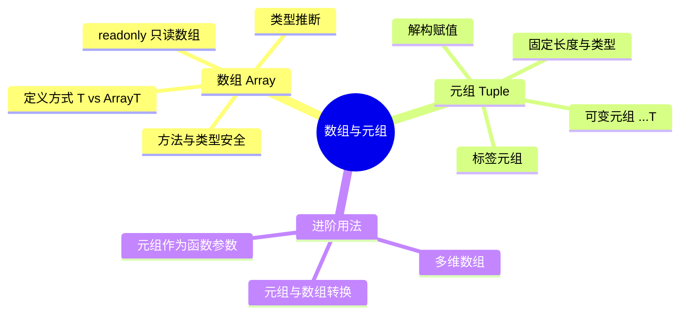

# 数组与元组

数组（Array）和元组（Tuple）是 TypeScript 中常用的数据结构。数组用于存储相同类型的元素集合，而元组则用于表示固定长度、类型确定的有序数据结构。

## 知识架构



## 概述

### 数组与元组对比

| 特性 | 数组（Array） | 元组（Tuple） |
| :--- | :--- | :--- |
| **长度** | 动态可变 | 固定（除非使用可变元组） |
| **元素类型** | 所有元素类型相同 | 每个位置类型可不同 |
| **类型安全性** | 元素类型统一 | 每个索引位置精确类型 |
| **典型用途** | 列表、集合、数据序列 | 键值对、坐标、函数返回多值 |
| **越界访问** | 返回 `undefined` | 编译时报错 |

## 数组类型

### 基本定义方式

在 TypeScript 中有两种等价的方式来声明数组类型：

```typescript
// 方式一：类型[] （推荐）
const arr1: string[] = ["a", "b", "c"]

// 方式二：泛型语法 Array<类型>
const arr2: Array<string> = ["a", "b", "c"]
```

**推荐使用 `类型[]` 语法**，原因：
- 语法更简洁直观
- 社区主流写法，阅读性更好
- 当类型较复杂时（如 `() => void`），泛型语法可能导致歧义

### 数组的特点

| 特性 | 说明 |
| :--- | :--- |
| **类型安全** | 一旦声明特定类型，只能存储该类型元素 |
| **可变性** | 大小可变，可动态添加/删除元素 |
| **索引访问** | 支持索引访问，TypeScript 能推断元素类型 |
| **类型推断** | 空数组推断为 `any[]`，非空数组根据元素推断 |

```typescript
// 类型推断示例
let list = [1, 2, 3]          // 推断为 number[]
let mixed = [1, "a", true]    // 推断为 (number | string | boolean)[]
let empty = []                // 推断为 any[]（应避免）

// 明确类型避免问题
let emptyNumbers: number[] = []
```

### 数组方法与类型安全

TypeScript 会对数组方法进行类型检查：

```typescript
const numbers: number[] = [1, 2, 3]

// ✅ 类型安全的方法调用
numbers.push(4)               // OK
numbers.map(n => n * 2)       // 返回 number[]
numbers.filter(n => n > 1)    // 返回 number[]
numbers.reduce((sum, n) => sum + n, 0)  // 返回 number

// ❌ 类型错误
// numbers.push("a")           // Error: 类型 "string" 的参数不能赋给类型 "number"
// numbers.map(n => n.toUpperCase())  // Error: number 上不存在 toUpperCase

// ⚠️ 注意：某些方法可能返回 undefined
const first = numbers.find(n => n > 5)  // 返回 number | undefined
const index = numbers.findIndex(n => n > 5)  // 返回 number

if (first !== undefined) {
  console.log(first.toFixed(2))  // OK，TypeScript 知道 first 是 number
}
```

### 多维数组

```typescript
// 二维数组
const matrix: number[][] = [
  [1, 2, 3],
  [4, 5, 6],
  [7, 8, 9]
]

// 访问元素
console.log(matrix[0][1])  // 2

// 三维数组
const cube: number[][][] = [
  [[1, 2], [3, 4]],
  [[5, 6], [7, 8]]
]

// 动态创建二维数组
function createMatrix(rows: number, cols: number, initialValue: number): number[][] {
  return Array.from({ length: rows }, () => 
    Array.from({ length: cols }, () => initialValue)
  )
}

const board = createMatrix(3, 3, 0)
// [[0, 0, 0], [0, 0, 0], [0, 0, 0]]
```

### 只读数组

使用 `readonly` 关键字创建只读数组，防止元素被修改：

```typescript
// 方式一：readonly 类型[]
const readonlyArr1: readonly number[] = [1, 2, 3]

// 方式二：ReadonlyArray<类型>
const readonlyArr2: ReadonlyArray<number> = [1, 2, 3]

// ❌ 以下操作都会导致编译错误
// readonlyArr1.push(4)        // Error: Property 'push' does not exist
// readonlyArr1[0] = 10        // Error: Index signature in type 'readonly number[]'
// readonlyArr1.length = 0     // Error: Cannot assign to 'length'

// ✅ 可以读取和遍历
console.log(readonlyArr1[0])   // OK
readonlyArr1.forEach(n => console.log(n))  // OK
const doubled = readonlyArr1.map(n => n * 2)  // OK，返回新数组
```

### 使用 `as const` 断言

`as const` 将数组转换为**只读元组**，锁定内容和类型：

```typescript
// 普通数组
const arr = [1, 2, 3]          // 类型: number[]

// as const 断言
const readonlyTuple = [1, 2, 3] as const  // 类型: readonly [1, 2, 3]

// 区别：
// arr[0] = 10                  // OK
// readonlyTuple[0] = 10        // Error: 只读

// 实际应用：定义常量列表
const COLORS = ["red", "green", "blue"] as const
// 类型: readonly ["red", "green", "blue"]

type Color = typeof COLORS[number]  // "red" | "green" | "blue"
```

## 元组 Tuple

元组（Tuple）是一种特殊的数组类型，它**固定长度、每个位置类型确定**。

### 为什么需要元组

```typescript
// 问题：普通数组无法约束长度和顺序
const framework: string[] = ["React", "Vue", "Angular"]
console.log(framework[3])  // undefined（运行时才发现越界）

// 解决：使用元组
const frameworkTuple: [string, string, string] = ["React", "Vue", "Angular"]
// console.log(frameworkTuple[3])  // 编译时报错！
```

### 元组定义与访问

```typescript
// 基本定义
let user: [number, string, boolean] = [1001, "xiaoye", true]

// 访问元素（带类型检查）
console.log(user[0].toFixed(2))      // OK，number 类型
console.log(user[1].toUpperCase())   // OK，string 类型
console.log(user[2] ? "Admin" : "User")  // OK，boolean 类型

// ❌ 类型错误
// user[0] = "1001"             // Error: 不能将 string 分配给 number
// user[1] = 123                // Error: 不能将 number 分配给 string

// ❌ 顺序错误
// user = ["xiaoye", 1001, true]  // Error: 类型不匹配
```

### 可选元素

使用 `?` 标记可选元素：

```typescript
type OptionalTuple = [string, number?, boolean?]

const t1: OptionalTuple = ["hello"]                    // OK
const t2: OptionalTuple = ["hello", 42]                // OK
const t3: OptionalTuple = ["hello", 42, true]          // OK
// const t4: OptionalTuple = ["hello", 42, true, "x"]  // Error: 长度不匹配

// 长度类型推断
type TupleLength = typeof t1.length  // 1 | 2 | 3
```

### 具名元组（Labeled Tuple Elements）

TypeScript 4.0+ 支持为元组元素添加标签，提高可读性：

```typescript
// 带标签的元组
const user: [id: number, name: string, isAdmin: boolean] = [1001, "xiaoye", true]

// 函数返回值使用具名元组
function getCoordinates(): [x: number, y: number] {
  return [10, 20]
}

const [x, y] = getCoordinates()
console.log(`x: ${x}, y: ${y}`)  // x: 10, y: 20

// HTTP 响应示例
type HttpResponse = [status: number, body: string]

function fetchUser(): HttpResponse {
  return [200, '{"name": "Alice"}']
}

const [status, body] = fetchUser()
```

### 可变元组（剩余元素）

使用 `...T[]` 语法定义可变长度元组：

```typescript
// 前面固定，后面可变
type StringNumberBooleans = [string, number, ...boolean[]]

const t1: StringNumberBooleans = ["hello", 42]                    // OK
const t2: StringNumberBooleans = ["hello", 42, true]              // OK
const t3: StringNumberBooleans = ["hello", 42, true, false, true] // OK

// 实际应用：函数参数
function logEvent(name: string, timestamp: number, ...details: string[]) {
  console.log(`[${new Date(timestamp)}] ${name}:`, details.join(", "))
}

logEvent("UserLogin", Date.now(), "user1", "192.168.1.1", "Chrome")

// 解构可变元组
const [name, age, ...rest]: [string, number, ...string[]] = [
  "xiaoye",
  25,
  "Beijing",
  "Engineer",
  "TypeScript"
]

console.log(name)  // "xiaoye"
console.log(age)   // 25
console.log(rest)  // ["Beijing", "Engineer", "TypeScript"]
```

### 元组操作方法

```typescript
const tuple: [number, string] = [1, "hello"]

// ✅ 支持数组方法
console.log(tuple.length)           // 2
console.log(tuple.concat([2, "world"]))  // [1, "hello", 2, "world"]
console.log(tuple.join("-"))        // "1-hello"

// ⚠️ push/pop 会改变运行时长度，但静态类型仍基于声明长度
tuple.push(2)        // 编译通过（push 参数类型为元素联合类型 number | string）
console.log(tuple.length)  // 3（运行时值；静态类型仍是字面量 2）
// console.log(tuple[2])    // 编译报错 TS2493：[number, string] 长度为 2，索引 2 不存在——静态类型不会因 push 而扩展

// 使用 readonly 防止修改
const readonlyTuple: readonly [number, string] = [1, "hello"]
// readonlyTuple.push(2)   // Error: Property 'push' does not exist
```

### 只读元组

```typescript
// 方式一：readonly 前缀
const readonlyTuple: readonly [string, number] = ["xiaoye", 25]

// 方式二：Readonly 工具类型
type ReadonlyTuple = Readonly<[string, number]>

// ❌ 禁止修改
// readonlyTuple[0] = "new"   // Error
// readonlyTuple.push("x")    // Error
```

## 元组的典型应用场景

### 1. 函数返回多个值

```typescript
// 返回状态和数据
function parseJSON(json: string): [boolean, unknown, string?] {
  try {
    const data = JSON.parse(json)
    return [true, data]
  } catch (e) {
    return [false, null, String(e)]
  }
}

const [success, data, error] = parseJSON('{"name": "Alice"}')

if (success) {
  console.log("Data:", data)
} else {
  console.error("Error:", error)
}

// 坐标点
function getCenter(): [x: number, y: number] {
  return [0, 0]
}

const [centerX, centerY] = getCenter()
```

### 2. 键值对与映射

```typescript
// 键值对
type Entry = [string, number]

const entries: Entry[] = [
  ["apple", 1],
  ["banana", 2],
  ["cherry", 3]
]

// 转换为 Map
const map = new Map(entries)

// Object.entries 返回元组数组
const obj = { name: "Alice", age: 30 }
const objEntries: [string, string | number][] = Object.entries(obj)
```

### 3. React Hooks 风格

```typescript
// 类似 useState 的模式
type UseState<T> = [T, (value: T) => void]

function createCounter(initial: number): UseState<number> {
  let value = initial
  return [
    value,
    (newValue) => { value = newValue }
  ]
}

const [count, setCount] = createCounter(0)
```

### 4. 枚举替代

```typescript
// 使用元组定义状态
type StatusTuple = readonly [code: number, message: string]

const SUCCESS: StatusTuple = [200, "OK"] as const
const NOT_FOUND: StatusTuple = [404, "Not Found"] as const
const SERVER_ERROR: StatusTuple = [500, "Internal Server Error"] as const

function handleResponse([code, message]: StatusTuple) {
  console.log(`Code: ${code}, Message: ${message}`)
}
```

## 数组与元组的类型关系

### 类型兼容性

```typescript
// 元组可以赋给数组（元组是数组的子类型）
let tuple: [number, number] = [1, 2]
let arr: number[] = tuple  // ✅ OK

// 数组不能赋给元组（数组长度不确定）
let arr2: number[] = [1, 2]
// let tuple2: [number, number] = arr2  // ❌ Error

// 使用类型断言可以绕过（不推荐）
let tuple3 = arr2 as [number, number]  // ⚠️ 运行时可能出错
```

### 越界访问对比

```typescript
// 数组越界访问
const arr: number[] = [1, 2, 3]
console.log(arr[10])  // undefined（运行时行为，编译不报错）

// 元组越界访问
const tuple: [number, number, number] = [1, 2, 3]
// console.log(tuple[10])  // ❌ 编译时报错：索引 10 处没有元素
```

### 类型推断对比

```typescript
// 数组推断
const arr = [1, 2, 3]           // number[]
const mixedArr = [1, "a"]       // (number | string)[]

// 元组推断
const tuple = [1, 2, 3] as const  // readonly [1, 2, 3]
const mixedTuple = [1, "a"] as const  // readonly [1, "a"]
```

## 最佳实践

### 1. 选择数组还是元组

```
需要存储的数据？
├── 类型相同，长度可变 → 数组 (T[])
├── 类型相同，长度固定 → 数组 + readonly 或 as const
├── 类型不同，长度固定 → 元组 ([T1, T2, T3])
└── 类型不同，部分可变 → 可变元组 ([T1, T2, ...T3[]])
```

### 2. 避免空数组类型推断

```typescript
// ❌ 不推荐：空数组推断为 any[]
let arr = []

// ✅ 推荐：明确类型
let arr: number[] = []
let arr2: string[] = new Array<string>()
```

### 3. 使用只读保护数据

```typescript
// 函数参数使用只读
function processItems(items: readonly number[]): number {
  // items.push(1)  // Error
  return items.reduce((sum, n) => sum + n, 0)
}

// 返回只读数组防止外部修改
function getConstants(): readonly number[] {
  return [1, 2, 3] as const
}
```

### 4. 使用具名元组提高可读性

```typescript
// ❌ 不推荐：位置含义不清晰
type Point = [number, number]

// ✅ 推荐：使用标签
type Point = [x: number, y: number]
type RGB = [red: number, green: number, blue: number]
type HttpResponse = [status: number, body: string]
```

### 5. 合理使用 `as const`

```typescript
// 定义常量列表
const COLORS = ["red", "green", "blue"] as const
type Color = typeof COLORS[number]  // "red" | "green" | "blue"

// 定义配置元组
const API_CONFIG = ["https://api.example.com", 5000] as const
// 类型: readonly ["https://api.example.com", 5000]
```

## 常见问题与陷阱

### Q1: 为什么 `push` 方法在元组上可以添加元素？

**A:** `push` 的参数类型是元组元素类型的联合（此处为 `string | number`），追加联合内的值可以编译通过，追加联合外的值会直接报错；同时静态类型仍按声明长度判断，新追加的元素无法通过索引访问：

```typescript
const tuple: [string, number] = ["a", 1]
tuple.push("b")      // 编译通过（"b" 属于元素联合类型 string | number）
// tuple.push(true)  // 编译报错：Argument of type 'boolean' is not assignable to parameter of type 'string | number'
// tuple[2]          // 编译报错 TS2493：Tuple type '[string, number]' of length '2' has no element at index '2'
```

**解决方案：** 使用 `readonly` 防止修改：

```typescript
const tuple: readonly [string, number] = ["a", 1]
// tuple.push(true)  // Error
```

### Q2: 如何定义固定长度的同类型元组？

**A:** 使用元组语法或工具类型：

```typescript
// 方式一：手动声明
type Vector3 = [number, number, number]

// 方式二：递归类型（TypeScript 4.1+）
type FixedArray<T, N extends number, R extends T[] = []> = 
  R['length'] extends N ? R : FixedArray<T, N, [...R, T]>

type Vector5 = FixedArray<number, 5>  // [number, number, number, number, number]
```

### Q3: 多维数组的类型如何定义？

```typescript
// 二维数组
type Matrix = number[][]

// 动态维度（借助查找元组实现维度减一：索引 D 取出 D-1）
type MultiArray<T, D extends number> = D extends 0 
  ? T 
  : MultiArray<T[], [never, 0, 1, 2, 3, 4, 5, 6, 7, 8, 9][D]>

type Tensor3D = MultiArray<number, 3>  // number[][][]
```

### Q4: 如何从元组类型获取元素类型？

```typescript
type MyTuple = [string, number, boolean]

// 获取所有元素类型的联合类型
type ElementTypes = MyTuple[number]  // string | number | boolean

// 获取特定位置类型
type First = MyTuple[0]   // string
type Second = MyTuple[1]  // number

// 获取长度
type Length = MyTuple['length']  // 3
```

### Q5: 数组方法返回值类型是什么？

```typescript
const arr: number[] = [1, 2, 3]

// 返回新数组的方法
arr.map(n => n * 2)       // number[]
arr.filter(n => n > 1)    // number[]
arr.concat([4, 5])        // number[]
arr.slice(0, 2)           // number[]

// 返回单个元素（可能为 undefined）
arr.find(n => n > 5)      // number | undefined
arr.at(0)                 // number | undefined
arr.pop()                 // number | undefined

// 返回索引或其他
arr.findIndex(n => n > 1) // number
arr.indexOf(1)            // number
arr.includes(1)           // boolean
arr.join(",")             // string
```

### Q6: 如何处理 JSON 序列化中的元组？

```typescript
// 问题：JSON 序列化后类型信息丢失
const tuple: [number, string] = [1, "hello"]
const json = JSON.stringify(tuple)  // "[1,\"hello\"]"
const parsed = JSON.parse(json)     // 类型: any

// 解决方案：使用类型守卫验证
function isTuple(arr: unknown): arr is [number, string] {
  return Array.isArray(arr) && 
         arr.length === 2 && 
         typeof arr[0] === "number" && 
         typeof arr[1] === "string"
}

if (isTuple(parsed)) {
  console.log(parsed[0].toFixed(2))  // OK
}
```

## 工具类型

TypeScript 提供了多个与数组/元组相关的工具类型：

```typescript
// ReadonlyArray - 只读数组
const readonly: ReadonlyArray<number> = [1, 2, 3]

// ArrayConstructor 方法
type MutableArray<T> = T[]  // 可变数组的显式声明

// 元组相关工具类型
type MyTuple = [string, number, boolean]

// 转换为只读
type ReadonlyTuple = Readonly<MyTuple>  // readonly [string, number, boolean]

// 提取元素类型
type Element = MyTuple[number]  // string | number | boolean

// 获取长度
type Len = MyTuple['length']  // 3

// 条件类型中推断元组元素
type First<T extends unknown[]> = T extends [infer F, ...unknown[]] ? F : never
type FirstElement = First<MyTuple>  // string

type Last<T extends unknown[]> = T extends [...unknown[], infer L] ? L : never
type LastElement = Last<MyTuple>  // boolean

type Tail<T extends unknown[]> = T extends [unknown, ...infer R] ? R : never
type RestElements = Tail<MyTuple>  // [number, boolean]
```

## 总结

| 概念 | 要点 |
| :--- | :--- |
| **数组定义** | 优先使用 `T[]`，复杂类型用 `Array<T>` |
| **只读数组** | `readonly T[]` 或 `ReadonlyArray<T>` |
| **元组定义** | `[T1, T2, T3]`，支持具名元素 |
| **可选元素** | `[T1, T2?]`，`?` 标记可选 |
| **可变元组** | `[T1, T2, ...T3[]]` |
| **类型兼容** | 元组可赋给数组，数组不可赋给元组 |
| **最佳实践** | 明确空数组类型、使用 readonly、善用具名元组 |

理解数组和元组的特性与区别，能够帮助在 TypeScript 中更精确地表达数据结构，获得更好的类型安全性。
