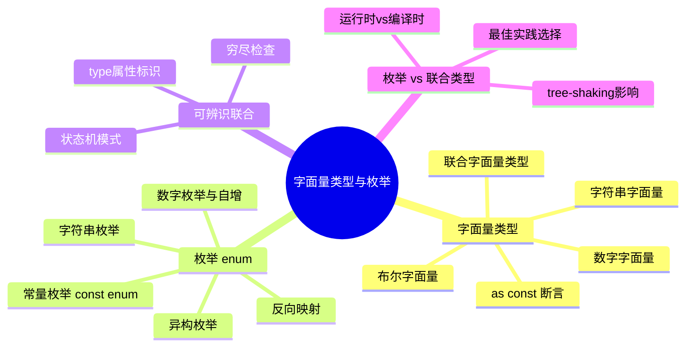

# 字面量类型与枚举

> **核心概念**：字面量类型和枚举是 TypeScript 中用于定义精确值类型的两种机制，它们让类型系统更加严格和具有表现力。

## 知识架构



## 引言：为什么需要精确类型

在 TypeScript 中，除 `string`、`number` 等基础类型之外，还可以定义更精确的类型，以增强代码的健壮性和可读性。假设正在为一个后端接口编写类型定义，该接口返回一个包含状态码和状态信息的响应：

```typescript
interface IApiResponse {
  code: number // 状态码
  status: string // 状态信息
  data: any
}
```

这个定义虽然可用，但过于宽泛。在实际业务中，`code` 和 `status` 通常是一组固定的值，例如 `code` 可能是 `10000`（成功）、`10001`（失败）或 `50000`（服务器错误），而 `status` 可能是 `"success"` 或 `"failure"`。

使用 `number` 和 `string` 这样的宽泛类型存在以下问题：

| 问题 | 说明 | 后果 |
|:-----|:-----|:-----|
| **类型提示不精确** | 访问 `res.code` 时只知道是 `number`，无法得知具体可能的值 | 开发时无法获得有效的代码补全 |
| **失去类型文档价值** | 其他开发者无法通过类型定义了解所有可能的状态 | 需要额外查阅文档或源码 |
| **运行时错误风险** | 可以赋任意值，编译期无法发现问题 | 潜在的 bug 可能到生产环境才暴露 |

为了解决这些问题，TypeScript 提供了**字面量类型**和**枚举**两种机制。

---

## 字面量类型 Literal Types

### 定义

字面量类型允许将具体的值作为一种类型。它是比原始类型（如 `string`）更精确的子类型。TypeScript 支持以下几种字面量类型：

| 类型 | 示例 | 适用场景 |
|:-----|:-----|:---------|
| **字符串字面量类型** | `"success"` | 定义固定字符串值集合 |
| **数字字面量类型** | `10000` | 定义固定数字值集合 |
| **布尔字面量类型** | `true` | 通常与联合类型配合使用 |
| **模板字面量类型** (TS 4.1+) | `` `on${string}` `` | 定义字符串模式 |

```typescript
// 字符串字面量类型
const successStatus: "success" = "success"

// 数字字面量类型
const successCode: 10000 = 10000

// 布尔字面量类型
const isSuccess: true = true

// 编译错误：不能将类型""failure""分配给类型""success""
const wrongStatus: "success" = "failure"
```

字面量类型要求变量的值必须严格等于类型本身。单独使用一个字面量类型意义不大，它真正的威力在于与**联合类型**结合使用。

### 联合类型与字面量类型结合

联合类型（`|`）表示一个值可以是几种类型之一。通过将多个字面量类型组合成一个联合类型，可以定义一个精确的取值范围：

```typescript
// 使用类型别名复用字面量联合类型
type ResponseStatus = "success" | "failure"
type ResponseCode = 10000 | 10001 | 50000

interface IApiResponse {
  code: ResponseCode
  status: ResponseStatus
  data: unknown // 使用 unknown 替代 any 更安全
}

declare const res: IApiResponse

// 当访问 res.status 时，TypeScript 会提供 "success" | "failure" 的精确提示
if (res.status === "success") {
  // 在这个代码块中，TypeScript 会将 res.status 的类型收窄为 "success"
  console.log("请求成功！")
}
```

这种模式极大地增强了代码的健壮性，因为 TypeScript 会检查赋给 `status` 或 `code` 的值是否在允许的范围内。

### 类型收窄

TypeScript 会根据条件判断自动收窄联合类型的范围，这是字面量联合类型的核心优势：

```typescript
type Status = "pending" | "success" | "failure"

function handleStatus(status: Status) {
  // status: "pending" | "success" | "failure"
  
  if (status === "pending") {
    // status: "pending" - 类型被收窄
    console.log("处理中...")
    return
  }
  
  // status: "success" | "failure" - 排除了 "pending"
  
  if (status === "success") {
    // status: "success"
    console.log("操作成功")
  } else {
    // status: "failure" - 排除了所有其他情况
    console.log("操作失败")
  }
}
```

**穷尽性检查**：使用 `never` 类型确保处理了所有可能的情况：

```typescript
function getStatusCode(status: Status): number {
  switch (status) {
    case "pending":
      return 0
    case "success":
      return 1
    case "failure":
      return -1
    default:
      // 如果新增了 Status 类型但未处理，这里会报错
      const _exhaustiveCheck: never = status
      return _exhaustiveCheck
  }
}
```

---

## 联合类型的高级应用：可辨识联合类型

可辨识联合类型（Discriminated Unions），又称**标签联合**或**变体类型**，是一种强大的模式，它利用共享的字面量类型属性来组合多个对象类型，实现类型安全的互斥逻辑。

### 核心要素

可辨识联合类型需要满足三个条件：

1. **公共的可辨识属性**：每个类型都有一个相同的属性名（通常命名为 `type`、`kind` 或 `tag`）
2. **字面量类型标记**：可辨识属性的类型是不同的字面量类型
3. **联合类型组合**：将这些类型组合成一个联合类型

### 示例：几何形状计算

```typescript
// 定义形状类型
interface ISquare {
  kind: "square" // 可辨识的属性
  size: number
}

interface IRectangle {
  kind: "rectangle" // 可辨识的属性
  width: number
  height: number
}

interface ICircle {
  kind: "circle" // 可辨识的属性
  radius: number
}

// Shape 是一个可辨识联合类型
type Shape = ISquare | IRectangle | ICircle

function getArea(shape: Shape): number {
  // 通过检查 kind 属性，TypeScript 可以精确地推断出 shape 的具体类型
  switch (shape.kind) {
    case "square":
      // shape 的类型被收窄为 ISquare
      return shape.size * shape.size
    case "rectangle":
      // shape 的类型被收窄为 IRectangle
      return shape.width * shape.height
    case "circle":
      // shape 的类型被收窄为 ICircle
      return Math.PI * shape.radius ** 2
    default:
      // 穷尽性检查：如果有新的 Shape 类型未处理，TypeScript 会在这里报错
      const _exhaustiveCheck: never = shape
      return _exhaustiveCheck
  }
}
```

### 实际应用：Redux Action 类型定义

可辨识联合类型在状态管理中应用广泛：

```typescript
// 定义 Action 类型
interface IncrementAction {
  type: "INCREMENT"
  payload: number
}

interface DecrementAction {
  type: "DECREMENT"
  payload: number
}

interface ResetAction {
  type: "RESET"
}

type CounterAction = IncrementAction | DecrementAction | ResetAction

function counterReducer(state: number, action: CounterAction): number {
  switch (action.type) {
    case "INCREMENT":
      // action 被收窄为 IncrementAction，可以安全访问 payload
      return state + action.payload
    case "DECREMENT":
      // action 被收窄为 DecrementAction
      return state - action.payload
    case "RESET":
      // action 被收窄为 ResetAction，没有 payload
      return 0
    default:
      const _exhaustiveCheck: never = action
      return _exhaustiveCheck
  }
}
```

### 类型守卫辅助函数

使用 `is` 类型谓词可以创建可复用的类型守卫：

```typescript
interface ISuccessResponse {
  type: "success"
  data: string
}

interface IErrorResponse {
  type: "error"
  message: string
}

type ApiResponse = ISuccessResponse | IErrorResponse

// 类型守卫函数
function isSuccess(response: ApiResponse): response is ISuccessResponse {
  return response.type === "success"
}

function handleResponse(response: ApiResponse) {
  if (isSuccess(response)) {
    // response 被收窄为 ISuccessResponse
    console.log("Data:", response.data)
  } else {
    // response 被收窄为 IErrorResponse
    console.error("Error:", response.message)
  }
}
```

---

## 枚举 Enums

枚举是 TypeScript 对 JavaScript 的一个重要补充，它允许为一组数值或字符串常量赋予易于理解的名称。

### 枚举类型概览

```
┌─────────────────────────────────────────────────────────────┐
│                        枚举 Enums                           │
├─────────────┬─────────────┬─────────────┬─────────────────┤
│  数字枚举   │  字符串枚举  │  常量枚举   │   异构枚举      │
│  Numeric    │  String     │  Const      │   Heterogeneous │
├─────────────┼─────────────┼─────────────┼─────────────────┤
│ 自动递增    │ 需显式初始化 │ 编译时内联  │   不推荐使用    │
│ 支持反向映射│ 无反向映射   │ 零运行时开销│   混合数字和字符串│
└─────────────┴─────────────┴─────────────┴─────────────────┘
```

### 数字枚举 (Numeric Enums)

默认情况下，枚举是基于数字的。第一个成员的默认值为 `0`，后续成员依次递增：

```typescript
enum Direction {
  Up, // 0
  Down, // 1
  Left, // 2
  Right // 3
}

const myDirection: Direction = Direction.Up // 0
```

也可以手动指定成员的值：

```typescript
enum Direction {
  Up = 1,
  Down, // 2 (自动递增)
  Left = 10,
  Right // 11 (自动递增)
}

console.log(Direction.Up) // 1
console.log(Direction.Down) // 2
console.log(Direction.Left) // 10
console.log(Direction.Right) // 11
```

**反向映射**：数字枚举的一个独特特性是支持"反向映射"，即可以从枚举值反查到枚举名：

```typescript
console.log(Direction[1]) // "Up"
console.log(Direction[10]) // "Left"

// 遍历所有成员
for (const key in Direction) {
  if (typeof Direction[key as keyof typeof Direction] === "number") {
    console.log(`${key}: ${Direction[key as keyof typeof Direction]}`)
  }
}
// 输出: Up: 1, Down: 2, Left: 10, Right: 11
```

**编译产物**：数字枚举会被编译成一个双向映射的 JavaScript 对象：

```javascript
// 编译后的 JavaScript
var Direction
;(function (Direction) {
  Direction[(Direction["Up"] = 1)] = "Up"
  Direction[(Direction["Down"] = 2)] = "Down"
  Direction[(Direction["Left"] = 10)] = "Left"
  Direction[(Direction["Right"] = 11)] = "Right"
})(Direction || (Direction = {}))
```

### 字符串枚举 (String Enums)

字符串枚举为每个成员赋予一个明确的字符串值：

```typescript
enum ResponseStatus {
  Success = "SUCCESS",
  Failure = "FAILURE",
  Pending = "PENDING"
}

const status: ResponseStatus = ResponseStatus.Success // "SUCCESS"
```

**优势**：

- **可读性强**：字符串值在调试时比数字更直观
- **序列化友好**：字符串值可以被轻松地序列化和反序列化
- **语义明确**：值本身就有业务含义

**编译产物**：字符串枚举会被编译成一个单向映射（从键到值）的对象，没有反向映射：

```javascript
// 编译后的 JavaScript
var ResponseStatus
;(function (ResponseStatus) {
  ResponseStatus["Success"] = "SUCCESS"
  ResponseStatus["Failure"] = "FAILURE"
  ResponseStatus["Pending"] = "PENDING"
})(ResponseStatus || (ResponseStatus = {}))
```

### 常量枚举 (Const Enums)

如果希望减少编译后的 JavaScript 代码量并追求极致性能，可以使用常量枚举：

```typescript
const enum Direction {
  Up,
  Down,
  Left,
  Right
}

const myDirection = Direction.Up
const allDirections = [Direction.Up, Direction.Down, Direction.Left, Direction.Right]
```

**特点**：

- **零运行时开销**：常量枚举在编译后会被完全移除
- **内联替换**：所有对枚举成员的引用都会被直接替换为对应的值

**编译产物**：

```javascript
// 编译后的 JavaScript
const myDirection = 0 /* Up */
const allDirections = [0 /* Up */, 1 /* Down */, 2 /* Left */, 3 /* Right */]
```

**注意**：由于常量枚举在编译后不存在，因此无法进行反向映射或在运行时动态访问。

### 异构枚举 (Heterogeneous Enums)

TypeScript 允许枚举同时包含数字和字符串成员，但这种用法**不推荐**：

```typescript
// ⚠️ 不推荐：异构枚举
enum Mixed {
  No = 0,
  Yes = "YES"
}
```

### 计算成员和常量成员

枚举成员可以是计算值或常量值：

```typescript
enum FileAccess {
  // 常量成员
  None = 0,
  Read = 1 << 0, // 位运算
  Write = 1 << 1,
  ReadWrite = Read | Write,
  
  // 计算成员
  G = "123".length,
  // 计算成员之后必须是计算成员，不能是常量成员
  H = Math.random() * 100
}
```

**常量成员条件**：
- 没有初始化器的第一个枚举成员
- 初始化为常量枚举表达式（无运行时计算）
- 初始化为 `+`、`-`、`~` 一元运算符应用于常量枚举表达式
- 初始化为 `+`、`-`、`*`、`/`、`%`、`<<`、`>>`、`>>>`、`&`、`|`、`^` 二元运算符应用于常量枚举表达式

### 枚举成员类型

在 TypeScript 中，枚举成员本身也可以作为类型使用：

```typescript
enum Color {
  Red,
  Green,
  Blue
}

// 枚举成员类型
let red: Color.Red = Color.Red

// 编译错误：不能将类型"Color.Green"分配给类型"Color.Red"
red = Color.Green

// 枚举类型可以接受任意枚举值
let color: Color = Color.Red
color = Color.Green // OK
```

---

## 模板字面量类型 (TypeScript 4.1+)

模板字面量类型是 TypeScript 4.1 引入的强大特性，它允许基于模式构建新的字符串字面量类型。

### 基本语法

```typescript
type World = "world"

type Greeting = `hello ${World}`
// type Greeting = "hello world"
```

### 结合联合类型

模板字面量类型与联合类型结合时，会产生笛卡尔积：

```typescript
type Color = "red" | "blue"
type Size = "small" | "large"

type ColorSize = `${Color}-${Size}`
// type ColorSize = "red-small" | "red-large" | "blue-small" | "blue-large"
```

### 实用示例

**事件处理器类型**：

```typescript
type EventName = "click" | "focus" | "blur"
type Handler = `on${Capitalize<EventName>}`
// type Handler = "onClick" | "onFocus" | "onBlur"

function addHandler(element: HTMLElement, event: Handler, callback: () => void) {
  // ...
}

addHandler(document.body, "onClick", () => {}) // OK
addHandler(document.body, "onHover", () => {}) // Error
```

**Getter/Setter 类型生成**：

```typescript
type PropName = "name" | "age" | "email"

type Getters<T extends string> = {
  [K in T as `get${Capitalize<K>}`]: () => string
}

type Setters<T extends string> = {
  [K in T as `set${Capitalize<K>}`]: (value: string) => void
}

type Person = Getters<PropName> & Setters<PropName>
// {
//   getName: () => string
//   getAge: () => string
//   getEmail: () => string
//   setName: (value: string) => void
//   setAge: (value: string) => void
//   setEmail: (value: string) => void
// }
```

### 内置工具类型

TypeScript 提供了四个内置的字符串操作类型：

```typescript
type Str = "Hello World"

type Upper = Uppercase<Str>      // "HELLO WORLD"
type Lower = Lowercase<Str>      // "hello world"
type Cap = Capitalize<Str>       // "Hello World"（首字符大写）
type Uncap = Uncapitalize<Str>   // "hello World"（仅首字符小写）
```

---

## `as const`：更轻量的"枚举"替代方案

`as const` 是 TypeScript 的类型断言，它告诉编译器将一个表达式推断为最精确的、不可变的字面量类型。

### 基本用法

```typescript
// 推断为 string[]
const directions1 = ["Up", "Down", "Left", "Right"]

// 推断为 readonly ["Up", "Down", "Left", "Right"]
const directions2 = ["Up", "Down", "Left", "Right"] as const

// 提取类型
type Direction = (typeof directions2)[number] // "Up" | "Down" | "Left" | "Right"
```

### 对象常量

`as const` 可以用于对象，将其所有属性标记为 `readonly` 并将属性值推断为字面量类型：

```typescript
const Status = {
  Success: 200,
  NotFound: 404,
  ServerError: 500
} as const

// Status.Success = 201; // 编译错误：无法分配到 "Success"，因为它是只读属性

// 提取键的联合类型
type StatusKey = keyof typeof Status // "Success" | "NotFound" | "ServerError"

// 提取值的联合类型
type StatusValue = (typeof Status)[keyof typeof Status] // 200 | 404 | 500
```

### 创建类型安全的常量对象

```typescript
// 定义常量集合
const ROUTES = {
  HOME: "/",
  ABOUT: "/about",
  CONTACT: "/contact"
} as const

// 提取路由类型
type Route = (typeof ROUTES)[keyof typeof ROUTES]

// 使用路由类型
function navigate(route: Route) {
  window.location.href = route
}

navigate(ROUTES.HOME) // OK
navigate(ROUTES.ABOUT) // OK
navigate("/invalid") // Error: 类型不匹配
```

### 与枚举对比

```typescript
// 使用枚举
enum Role {
  Admin = "ADMIN",
  User = "USER",
  Guest = "GUEST"
}

// 使用 as const
const ROLES = {
  Admin: "ADMIN",
  User: "USER",
  Guest: "GUEST"
} as const

type RoleType = (typeof ROLES)[keyof typeof ROLES]
```

**优势**：
- 纯 JavaScript 语法，更符合直觉
- 无额外编译产物
- 可与解构、展开等原生操作配合使用
- 支持运行时动态访问

---

## TypeScript 编译选项

TypeScript 提供了多个与枚举相关的编译选项，正确配置这些选项可以影响枚举的编译行为。

### preserveConstEnums

```json
// tsconfig.json
{
  "compilerOptions": {
    "preserveConstEnums": true
  }
}
```

**作用**：保留常量枚举的编译产物，即使使用 `const enum` 也会生成运行时对象。

```typescript
const enum Direction {
  Up,
  Down
}

const up = Direction.Up
```

**未启用时**：

```javascript
const up = 0 /* Up */
```

**启用后**：

```javascript
var Direction
;(function (Direction) {
  Direction[(Direction["Up"] = 0)] = "Up"
  Direction[(Direction["Down"] = 1)] = "Down"
})(Direction || (Direction = {}))
const up = 0 /* Up */
```

### isolatedModules

```json
{
  "compilerOptions": {
    "isolatedModules": true
  }
}
```

**作用**：`isolatedModules` 要求所有文件都能被单文件转译器（如 Babel、esbuild、swc）独立处理，而这类转译器无法内联其他文件中的常量枚举值。因此在此模式下，**环境常量枚举（`declare const enum`）会直接报错**；普通 `const enum` 虽然可以声明和导出，但跨文件使用时经单文件转译器处理后行为不可靠，不建议使用。

```typescript
// ⚠️ 启用 isolatedModules 后环境常量枚举会报错
// declare const enum Direction {
//   Up
// }

// 普通 const enum 可以导出,但跨文件内联依赖完整类型信息,
// 单文件转译器无法保证,因此应避免
const enum Direction {
  Up
}
```

### 建议配置

```json
{
  "compilerOptions": {
    // 如果你需要在运行时访问常量枚举
    "preserveConstEnums": true,

    // 如果使用 Babel 或其他单文件转译器
    "isolatedModules": true
  }
}
```

---

## 实际应用案例

### 案例 1：组件 Props 类型定义

```typescript
// 定义按钮组件的类型
type ButtonVariant = "primary" | "secondary" | "danger" | "ghost"
type ButtonSize = "small" | "medium" | "large"

interface ButtonProps {
  variant: ButtonVariant
  size: ButtonSize
  disabled?: boolean
  onClick?: () => void
  children?: React.ReactNode
}

function Button({ variant, size, disabled = false, onClick, children }: ButtonProps) {
  const className = `btn btn-${variant} btn-${size}`
  
  return (
    <button className={className} disabled={disabled} onClick={onClick}>
      {children}
    </button>
  )
}

// 使用 - TypeScript 会提供自动补全
<Button variant="primary" size="medium" />
<Button variant="danger" size="large" onClick={() => alert("clicked")} />
// <Button variant="invalid" /> // Error: "invalid" 不是有效的 variant
```

### 案例 2：API 响应类型定义

```typescript
// API 响应状态定义
type ApiStatus = "idle" | "loading" | "success" | "error"

interface ApiResponse<T> {
  status: ApiStatus
  data: T | null
  error: string | null
}

// 使用可辨识联合类型定义不同的响应状态
interface IIdleResponse {
  status: "idle"
}

interface ILoadingResponse {
  status: "loading"
}

interface ISuccessResponse<T> {
  status: "success"
  data: T
}

interface IErrorResponse {
  status: "error"
  error: string
}

type ApiResponseV2<T> = 
  | IIdleResponse 
  | ILoadingResponse 
  | ISuccessResponse<T> 
  | IErrorResponse

// 处理函数
function handleResponse<T>(response: ApiResponseV2<T>) {
  switch (response.status) {
    case "idle":
      console.log("等待请求")
      break
    case "loading":
      console.log("加载中...")
      break
    case "success":
      console.log("数据:", response.data)
      break
    case "error":
      console.error("错误:", response.error)
      break
  }
}
```

### 案例 3：表单验证状态

```typescript
// 使用 as const 定义验证状态
const VALIDATION_STATUS = {
  PRISTINE: "PRISTINE",
  DIRTY: "DIRTY",
  VALID: "VALID",
  INVALID: "INVALID"
} as const

type ValidationStatus = typeof VALIDATION_STATUS[keyof typeof VALIDATION_STATUS]

interface FieldState {
  value: string
  status: ValidationStatus
  errors: string[]
}

// 使用枚举定义验证规则
enum ValidationRule {
  Required = "REQUIRED",
  Email = "EMAIL",
  MinLength = "MIN_LENGTH",
  MaxLength = "MAX_LENGTH",
  Pattern = "PATTERN"
}

interface ValidationConfig {
  rule: ValidationRule
  value?: number | string | RegExp
  message: string
}

function validateField(value: string, rules: ValidationConfig[]): FieldState {
  const errors: string[] = []
  
  for (const config of rules) {
    switch (config.rule) {
      case ValidationRule.Required:
        if (!value.trim()) {
          errors.push(config.message)
        }
        break
      case ValidationRule.Email:
        if (!/^[^\s@]+@[^\s@]+\.[^\s@]+$/.test(value)) {
          errors.push(config.message)
        }
        break
      // ... 其他规则
    }
  }
  
  return {
    value,
    status: errors.length === 0 ? VALIDATION_STATUS.VALID : VALIDATION_STATUS.INVALID,
    errors
  }
}
```

### 案例 4：HTTP 状态码常量

```typescript
// 使用 as const 对象定义 HTTP 状态码
const HTTP_STATUS = {
  // 成功响应
  OK: 200,
  CREATED: 201,
  NO_CONTENT: 204,
  
  // 重定向
  MOVED_PERMANENTLY: 301,
  FOUND: 302,
  
  // 客户端错误
  BAD_REQUEST: 400,
  UNAUTHORIZED: 401,
  FORBIDDEN: 403,
  NOT_FOUND: 404,
  
  // 服务器错误
  INTERNAL_SERVER_ERROR: 500,
  BAD_GATEWAY: 502,
  SERVICE_UNAVAILABLE: 503
} as const

type HttpStatus = typeof HTTP_STATUS[keyof typeof HTTP_STATUS]

// 状态码分类
function getStatusCategory(status: HttpStatus): string {
  if (status >= 200 && status < 300) return "Success"
  if (status >= 300 && status < 400) return "Redirection"
  if (status >= 400 && status < 500) return "Client Error"
  if (status >= 500) return "Server Error"
  return "Unknown"
}
```

---

## 最佳实践：如何选择

### 方案对比

| 特性 | 字面量联合类型 | 枚举 | `as const` 对象 |
|:-----|:---------------|:-----|:----------------|
| **运行时** | 类型擦除，无开销 | 生成对象，有开销 | 生成对象，有开销 |
| **反向映射** | 不支持 | 仅数字枚举支持 | 不支持 |
| **类型安全** | 强类型安全 | 数字枚举有隐患 | 强类型安全 |
| **可读性** | 高，直观 | 良好，依赖命名 | 高，标准 JS |
| **扩展性** | 易扩展 | 难扩展 | 易扩展 |
| **运行时访问** | 不支持 | 支持 | 支持 |
| **Tree-shaking** | 完全支持 | 部分支持 | 支持 |
| **IDE 支持** | 完美 | 良好 | 完美 |

### 选择指南

```
                    开始
                      │
                      ▼
              ┌───────────────┐
              │ 需要运行时访问？│
              └───────┬───────┘
                 ╱           ╲
               是              否
                │               │
                ▼               ▼
        ┌───────────────┐   ┌───────────────┐
        │ 需要反向映射？ │   │ 字面量联合类型 │
        └───────┬───────┘   │ (推荐)        │
           ╱         ╲       └───────────────┘
         是           否
          │            │
          ▼            ▼
    ┌──────────┐  ┌──────────────┐
    │ 数字枚举  │  │ as const 对象 │
    └──────────┘  └──────────────┘
```

### 最佳实践建议

#### 1. 优先使用字面量联合类型

在大多数情况下，字面量联合类型是最佳选择：

```typescript
// ✅ 推荐：简单、直接、无运行时开销
type Status = "pending" | "success" | "failure"
type Role = "admin" | "user" | "guest"

// 适用于：组件 props、API 状态、配置选项等
```

#### 2. 使用 `as const` 创建常量集合

当需要在运行时访问值时：

```typescript
// ✅ 推荐：需要运行时访问或迭代时
const THEMES = {
  LIGHT: "light",
  DARK: "dark",
  SYSTEM: "system"
} as const

type Theme = typeof THEMES[keyof typeof THEMES]

// 可以遍历
Object.values(THEMES).forEach(theme => {
  console.log(theme)
})
```

#### 3. 谨慎使用枚举

仅在以下场景考虑枚举：

```typescript
// ✅ 场景 1：需要数字枚举的反向映射
enum ErrorCode {
  Unknown = 0,
  InvalidInput = 1,
  NetworkError = 2
}

const code = ErrorCode.NetworkError
const name = ErrorCode[code] // "NetworkError" - 反向映射

// ✅ 场景 2：与期望枚举类型的第三方库交互
import { SomeLibrary } from "third-party"

// 库期望枚举类型
const config: SomeLibrary.Config = {
  mode: SomeLibrary.Mode.Standard
}
```

#### 4. 避免的模式

```typescript
// ❌ 避免：异构枚举
enum Mixed {
  No = 0,
  Yes = "YES" // 混合类型，不推荐
}

// ❌ 避免：无意义的枚举
enum Boolean {
  True,
  False
}

// ❌ 避免：仅用于类型注解时使用枚举
enum Direction {
  Up,
  Down
}
// 如果只需要类型，用字面量联合类型更简单
type Direction = "up" | "down"
```

---

## 常见问题解答

### Q1: 枚举和字面量联合类型的主要区别是什么？

**A**: 主要区别在于运行时表现：

| 方面 | 枚举 | 字面量联合类型 |
|:-----|:-----|:---------------|
| 编译产物 | 生成 JavaScript 对象 | 完全擦除 |
| 运行时访问 | 支持 | 不支持 |
| 反向映射 | 数字枚举支持 | 不支持 |
| 代码体积 | 有额外开销 | 零开销 |

### Q2: 什么时候应该使用 `const enum`？

**A**: 通常不建议使用 `const enum`，原因如下：

1. **跨模块问题**：`const enum` 在 `--isolatedModules` 模式下无法跨文件使用
2. **调试困难**：编译后值为数字，调试时难以理解
3. **替代方案更好**：`as const` 提供了更好的替代方案

```typescript
// ❌ 不推荐
const enum Direction {
  Up,
  Down
}

// ✅ 推荐
const DIRECTIONS = {
  Up: "UP",
  Down: "DOWN"
} as const
```

### Q3: 如何从枚举中提取联合类型？

**A**: 使用 `keyof typeof` 或 `typeof` 配合索引访问：

```typescript
enum Color {
  Red,
  Green,
  Blue
}

// 提取键的联合类型
type ColorKey = keyof typeof Color // "Red" | "Green" | "Blue"

// 提取值的联合类型
type ColorValue = typeof Color[ColorKey] // Color.Red | Color.Green | Color.Blue
```

### Q4: 字面量类型可以扩展吗？

**A**: 可以使用交叉类型扩展字面量联合类型：

```typescript
type BaseStatus = "pending" | "success" | "failure"

// 扩展
type ExtendedStatus = BaseStatus | "cancelled" | "timeout"
// "pending" | "success" | "failure" | "cancelled" | "timeout"

// 条件扩展
type WithError<T extends string> = T | "error"
type MyStatus = WithError<"ok" | "loading"> // "ok" | "loading" | "error"
```

### Q5: 如何确保处理了所有枚举情况？

**A**: 使用 `never` 类型进行穷尽性检查：

```typescript
enum Status {
  Pending,
  Success,
  Failure
}

function handleStatus(status: Status): string {
  switch (status) {
    case Status.Pending:
      return "处理中"
    case Status.Success:
      return "成功"
    case Status.Failure:
      return "失败"
    default:
      // 如果新增枚举值但未处理，这里会报错
      const exhaustive: never = status
      return exhaustive
  }
}
```

### Q6: 字符串枚举和 `as const` 对象如何选择？

**A**: 推荐使用 `as const` 对象，除非有特殊需求：

```typescript
// 字符串枚举
enum Role {
  Admin = "ADMIN",
  User = "USER"
}

// as const 对象（推荐）
const ROLES = {
  Admin: "ADMIN",
  User: "USER"
} as const
```

**`as const` 的优势**：
- 更好的 Tree-shaking 支持
- 可与解构、展开等操作配合
- 无特殊语法，纯 JavaScript

### Q7: 数字枚举的类型安全问题是什么？

**A**: 在 TypeScript 5.0 之前，数字枚举存在类型宽松问题——任意数字都可以赋给枚举类型。**TypeScript 5.0 起，所有枚举都被视为联合枚举类型（每个成员有自己的类型），这一问题已经修复**：

```typescript
enum Direction {
  Up = 1,
  Down = 2
}

// TypeScript 5.0 之前：编译通过，但不是有效的 Direction
// TypeScript 5.0 起：编译报错——Type '999' is not assignable to type 'Direction'
// const dir: Direction = 999

// 收窄行为也随之改善,if/switch 比较可以正确收窄到具体成员
let d = Direction.Up
if (d === Direction.Up) {
  console.log("Up") // 此处 d 被收窄为 Direction.Up
}
```

---

## 总结

### 速查表

```typescript
// 1. 字面量联合类型 - 最简单的选择
type Status = "pending" | "success" | "failure"

// 2. as const 对象 - 需要运行时访问时
const STATUS = {
  Pending: "PENDING",
  Success: "SUCCESS",
  Failure: "FAILURE"
} as const
type Status = typeof STATUS[keyof typeof STATUS]

// 3. 可辨识联合 - 复杂状态管理
interface ISuccess { type: "success"; data: string }
interface IError { type: "error"; message: string }
type Result = ISuccess | IError

// 4. 数字枚举 - 仅在需要反向映射时
enum ErrorCode {
  Unknown = 0,
  InvalidInput = 1
}

// 5. 模板字面量 - 动态生成字符串类型 (TS 4.1+)
type EventName = "click" | "focus"
type Handler = `on${Capitalize<EventName>}`
```

### 决策流程

1. **只需类型注解** → 字面量联合类型
2. **需要运行时访问** → `as const` 对象
3. **需要反向映射** → 数字枚举
4. **复杂状态管理** → 可辨识联合类型
5. **字符串模式匹配** → 模板字面量类型
