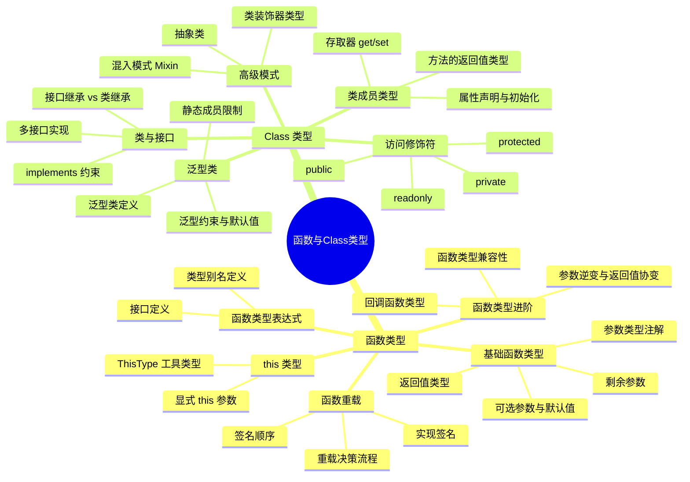
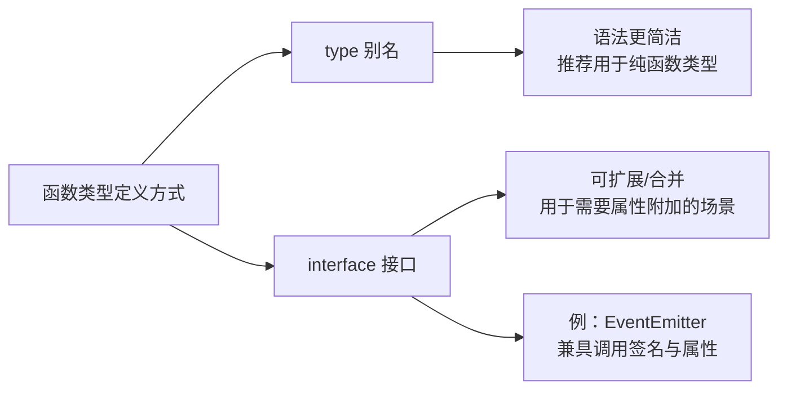
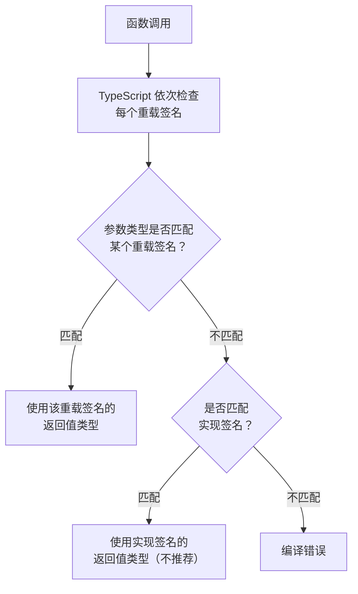
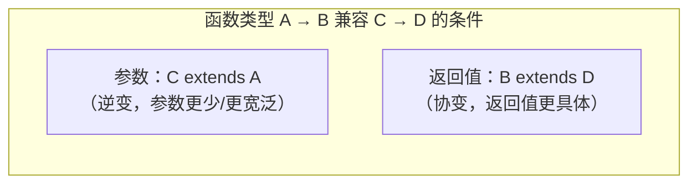
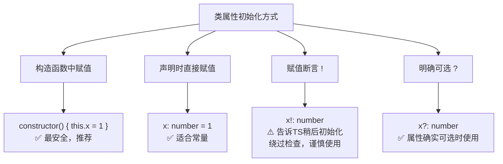
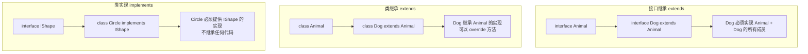

# 函数与 Class 中的类型

> **核心概念**：函数和类是 TypeScript 中类型系统的两大核心应用场景。函数类型涉及参数类型、返回值类型、重载、this 类型等；Class 类型涉及成员类型、访问修饰符、泛型类、混入模式等。掌握这两大场景的类型定义，是写出类型安全 TypeScript 代码的基础。

## 架构概览



---

## 一、函数类型

### 1.1 基础函数类型注解

函数是 JavaScript 的一等公民，TypeScript 为函数提供了完整的类型注解支持。

```typescript
// 参数类型注解 + 返回值类型注解
function add(a: number, b: number): number {
  return a + b;
}

// 返回值类型推断：TypeScript 能根据 return 语句自动推断
function multiply(a: number, b: number) {
  return a * b; // 返回值自动推断为 number
}
```

> **最佳实践**：对于简单函数，可以省略返回值类型注解，让 TypeScript 自动推断。对于复杂函数（尤其是返回联合类型或对象类型的函数），建议显式注解返回值类型，以提供更清晰的类型文档。

### 1.2 可选参数与默认值

```typescript
// 可选参数：使用 ? 标记
function greet(name: string, greeting?: string): string {
  return `${greeting ?? 'Hello'}, ${name}`;
}

greet('Alice');          // "Hello, Alice"
greet('Alice', 'Hi');   // "Hi, Alice"

// 默认值参数：在参数名后赋默认值
function createUser(name: string, role: string = 'user'): object {
  return { name, role };
}

createUser('Alice');              // { name: 'Alice', role: 'user' }
createUser('Alice', 'admin');    // { name: 'Alice', role: 'admin' }
```

**可选参数与默认值参数的对比**：

| 特性 | 可选参数 `param?: T` | 默认值参数 `param: T = default` |
|------|---------------------|-------------------------------|
| 调用时是否可省略 | ✅ 可以省略 | ✅ 可以省略 |
| 省略后参数值 | `undefined` | 默认值 |
| 函数体内类型 | `T \| undefined` | `T`（更安全） |
| 推荐程度 | ⭐⭐⭐ | ⭐⭐⭐⭐⭐ |

> **最佳实践**：优先使用默认值参数而非可选参数。默认值参数在函数体内的类型是 `T` 而非 `T | undefined`，避免了繁琐的空值检查。

### 1.3 剩余参数

```typescript
// 剩余参数的类型必须是数组类型
function sum(first: number, ...rest: number[]): number {
  return first + rest.reduce((acc, val) => acc + val, 0);
}

sum(1);            // 1
sum(1, 2, 3);      // 6
sum(1, 2, 3, 4);   // 10

// 剩余参数也可以是元组类型（TypeScript 3.0+）
function tupleFunc(...args: [string, number, boolean]): void {
  const [str, num, bool] = args;
  console.log(str, num, bool);
}

tupleFunc('hello', 42, true);  // OK
// tupleFunc('hello', 42);     // Error: 缺少参数
```

### 1.4 函数类型表达式

除了直接在函数定义上注解类型，还可以将函数类型抽离为独立的类型定义，实现类型的复用。

```typescript
// 使用类型别名定义函数类型
type MathFunc = (a: number, b: number) => number;

const add: MathFunc = (a, b) => a + b;
const subtract: MathFunc = (a, b) => a - b;
const multiply: MathFunc = (a, b) => a * b;

// 使用接口定义函数类型
interface StringTransformer {
  (input: string): string;
}

const toUpper: StringTransformer = (input) => input.toUpperCase();
const toLower: StringTransformer = (input) => input.toLowerCase();
```

**类型别名 vs 接口定义函数类型**：



```typescript
// 接口定义函数类型的典型场景：可调用对象（既有调用签名又有属性）
interface Counter {
  (start: number): string;     // 调用签名
  interval: number;            // 属性
  reset(): void;               // 方法
}

function createCounter(): Counter {
  let count = 0;
  const counter = ((start: number) => {
    count = start;
    return `Count: ${count}`;
  }) as Counter;

  counter.interval = 100;
  counter.reset = () => { count = 0; };

  return counter;
}
```

---

## 二、函数重载

### 2.1 为什么需要函数重载

在 JavaScript 中，同一个函数经常需要根据不同的参数类型执行不同的逻辑。例如 `Array.prototype.slice` 既可以不传参数（返回整个数组的副本），也可以传一个参数（从指定位置截取），还可以传两个参数（指定起止位置）。

TypeScript 的函数重载允许为同一个函数提供**多个类型签名**，让编译器在不同调用场景下提供精确的类型检查。

### 2.2 重载语法

```typescript
// 重载签名（可以有多个）
function makeDate(timestamp: number): Date;
function makeDate(year: number, month: number, day: number): Date;

// 实现签名（必须兼容所有重载签名）
function makeDate(yearOrTimestamp: number, month?: number, day?: number): Date {
  if (month !== undefined && day !== undefined) {
    return new Date(yearOrTimestamp, month - 1, day);  // year, month, day
  } else {
    return new Date(yearOrTimestamp);  // timestamp
  }
}

// 调用时 TypeScript 根据重载签名进行类型检查
const d1 = makeDate(1700000000000);     // OK: timestamp
const d2 = makeDate(2024, 1, 1);        // OK: year, month, day
// const d3 = makeDate(2024, 1);        // Error: 没有匹配的重载签名
```

### 2.3 重载决策流程



### 2.4 重载的最佳实践

**规则 1：重载签名按从具体到宽泛的顺序排列**

```typescript
// ✅ 正确：具体签名在前
function parse(input: string): string;
function parse(input: number): number;
function parse(input: string | number): string | number;

// ❌ 错误：宽泛签名在前，后面的具体签名永远不会被匹配
function parse(input: string | number): string | number;
function parse(input: string): string;  // 永远不会匹配
function parse(input: number): number;  // 永远不会匹配
```

**规则 2：实现签名必须兼容所有重载签名**

```typescript
// ✅ 正确
function fn(x: string): string;
function fn(x: number): number;
function fn(x: string | number): string | number {  // 实现签名兼容
  if (typeof x === 'string') return x.toUpperCase();
  return x * 2;
}

// ❌ 错误：重载签名 boolean 与实现签名不兼容
function fn(x: string): string;
function fn(x: number): number;
function fn(x: boolean): boolean;  // Error: 实现签名不接受 boolean
function fn(x: string | number): string | number {  // 实现签名只兼容 string | number
  if (typeof x === 'string') return x.toUpperCase();
  return x * 2;
}
```

**规则 3：避免在实现签名上直接调用**

实现签名对调用者不可见，但如果参数恰好匹配实现签名但不匹配任何重载签名，会导致意外行为。始终确保重载签名覆盖所有合法调用模式。

---

## 三、this 类型

### 3.1 显式 this 参数

JavaScript 中 `this` 的值取决于函数的调用方式，这常常导致类型不安全。TypeScript 允许在函数参数列表首位声明 `this` 的类型：

```typescript
interface User {
  name: string;
  age: number;
  greet(this: User): string;
}

const user: User = {
  name: 'Alice',
  age: 30,
  greet() {
    return `Hello, I'm ${this.name}, ${this.age} years old.`;
  }
};

user.greet();  // OK: this 绑定为 user 对象

// 错误场景：this 不匹配
const greetFn = user.greet;
// greetFn();  // Error: 脱离对象上下文调用，this 为 undefined
```

### 3.2 ThisType 工具类型

TypeScript 提供了 `ThisType<T>` 工具类型，用于标注对象字面量中方法的 `this` 类型：

```typescript
type ObjectDescriptor<D, M> = {
  data: D;
  methods: M & ThisType<D & M>;
};

function makeObject<D, M>(desc: ObjectDescriptor<D, M>): D & M {
  const { data, methods } = desc;
  return { ...data, ...methods } as D & M;
}

const obj = makeObject({
  data: { x: 0, y: 0 },
  methods: {
    moveBy(dx: number, dy: number) {
      this.x += dx;  // OK: this 有 x 属性
      this.y += dy;  // OK: this 有 y 属性
    }
  }
});

obj.x;       // number
obj.moveBy;  // (dx: number, dy: number) => void
```

> **注意**：`ThisType` 需要在 `tsconfig.json` 中启用 `noImplicitThis` 选项才能生效。

---

## 四、回调函数类型

### 4.1 回调函数的类型定义

```typescript
// 基础回调
function fetchData(url: string, callback: (data: unknown) => void): void {
  // ...
}

// 带错误处理的回调（Node.js 风格）
function readFile(
  path: string,
  callback: (err: Error | null, data?: string) => void
): void {
  // ...
}

// 使用类型别名提高可读性
type AsyncCallback = (err: Error | null, result?: unknown) => void;
type TransformCallback<T, R> = (value: T) => R;

function process<T, R>(
  input: T,
  transform: TransformCallback<T, R>
): R {
  return transform(input);
}
```

### 4.2 回调函数中的 void 返回值

```typescript
// void 表示"返回值被忽略"，不意味着回调不能返回值
type Callback = (value: number) => void;

function forEach(arr: number[], callback: Callback): void {
  for (const item of arr) {
    callback(item);  // 即使 callback 返回值，也会被忽略
  }
}

// 以下都是合法的 Callback
forEach([1, 2, 3], (n) => n.toString());  // 返回 string，但被忽略
forEach([1, 2, 3], (n) => console.log(n));  // 返回 void
forEach([1, 2, 3], (n) => { /* no return */ });  // 返回 undefined
```

> **陷阱**：如果回调类型定义为 `(value: number) => undefined`，则回调**必须**显式返回 `undefined`，这与 `void` 行为完全不同。

---

## 五、函数类型兼容性

函数类型的兼容性遵循**参数逆变、返回值协变**的原则（详见[协变与逆变](../02-类型系统/06-协变与逆变.md)）。



```typescript
// 参数逆变：把参数更宽泛的函数赋给参数更具体的函数类型是安全的,
// 反方向（strictFunctionTypes 下）会报错
type Handler = (event: Event) => void;
type MouseHandler = (event: MouseEvent) => void;

// ✅ Handler 可赋给 MouseHandler：Event 是 MouseEvent 的父类型,
// 一个能处理任意 Event 的函数当然能处理 MouseEvent
const mouseHandler: MouseHandler = (event: Event) => {
  console.log(event.type);
};

// ❌ 反方向不成立：Handler 可能收到任意 Event（如键盘事件）,
// 而下面的实现假设参数拥有 MouseEvent 特有的 clientX
// const handler: Handler = (event: MouseEvent) => {
//   console.log(event.clientX);  // Error: Event 上不存在 clientX
// };

// 返回值协变：源函数的返回值类型必须可以赋给目标函数的返回值类型
type StringProducer = () => string;
type HelloProducer = () => 'hello';

const producer: StringProducer = () => 'hello';  // OK: 'hello' 可赋给 string
```

---

## 六、Class 类型

### 6.1 类属性声明与初始化

TypeScript 要求类的属性必须先声明后使用，这与 JavaScript 的动态属性添加不同。

```typescript
class User {
  // 属性声明
  name: string;
  age: number;
  readonly id: number;  // 只读属性

  // 在构造函数中初始化
  constructor(name: string, age: number, id: number) {
    this.name = name;
    this.age = age;
    this.id = id;
  }
}

// 简写形式：构造函数参数属性自动声明并初始化属性
class UserShort {
  constructor(
    public name: string,
    public age: number,
    readonly id: number
  ) {}
}

// 等价于上面的 User 类
```

### 6.2 属性初始化的四种方式



```typescript
class Config {
  // 方式 1：声明时赋值
  port: number = 3000;
  host: string = 'localhost';

  // 方式 2：构造函数中赋值
  env: string;
  constructor(env: string) {
    this.env = env;
  }
}

class LazyInit {
  // 方式 3：赋值断言（!）—— 告诉 TypeScript 这个属性会在使用前被初始化
  value!: number;

  init() {
    this.value = 42;  // 延迟初始化
  }
}

class Optional {
  // 方式 4：可选属性
  nickname?: string;  // 类型为 string | undefined
}
```

### 6.3 访问修饰符

TypeScript 提供了三种访问修饰符，控制类成员的可访问性：

```typescript
class Employee {
  // public：任何地方都可访问（默认）
  public name: string;

  // private：仅在类内部可访问
  private salary: number;

  // protected：在类内部及子类中可访问
  protected department: string;

  constructor(name: string, salary: number, department: string) {
    this.name = name;
    this.salary = salary;
    this.department = department;
  }

  // 公有方法访问私有属性
  getSalary(): number {
    return this.salary;
  }
}

class Manager extends Employee {
  constructor(name: string, salary: number) {
    super(name, salary, 'Management');
    // this.salary;       // Error: private 成员不可在子类中访问
    this.department;       // OK: protected 成员可在子类中访问
  }
}

const emp = new Employee('Alice', 50000, 'Engineering');
emp.name;                  // OK: public
// emp.salary;             // Error: private
// emp.department;         // Error: protected
```

**访问修饰符对比**：

| 修饰符 | 类内部 | 子类 | 类外部 | 编译产物 |
|--------|--------|------|--------|----------|
| `public` | ✅ | ✅ | ✅ | 保留属性 |
| `protected` | ✅ | ✅ | ❌ | 保留属性 |
| `private` | ✅ | ❌ | ❌ | 保留属性（仅类型检查层面） |

> **注意**：TypeScript 的 `private` 是编译时检查，编译为 JavaScript 后属性仍然可以被访问。如需真正的运行时私有，使用 ES2022 的 `#` 私有字段：

```typescript
class TruePrivate {
  #secret: number;  // JavaScript 原生私有字段

  constructor(secret: number) {
    this.#secret = secret;
  }

  getSecret(): number {
    return this.#secret;
  }
}

const obj = new TruePrivate(42);
obj.getSecret();      // 42
// obj.#secret;       // SyntaxError: 私有字段无法从外部访问
```

### 6.4 存取器（Getter / Setter）

```typescript
class Temperature {
  private _celsius: number = 0;

  // Getter：读取时自动调用
  get celsius(): number {
    return this._celsius;
  }

  // Setter：赋值时自动调用，可进行验证
  set celsius(value: number) {
    if (value < -273.15) {
      throw new Error('Temperature below absolute zero!');
    }
    this._celsius = value;
  }

  // 只读属性：只有 getter 没有 setter
  get fahrenheit(): number {
    return this._celsius * 9 / 5 + 32;
  }
}

const temp = new Temperature();
temp.celsius = 25;         // OK: setter 被调用
console.log(temp.fahrenheit);  // 77: getter 被调用
// temp.fahrenheit = 100;   // Error: 只读属性
```

---

## 七、类与接口

### 7.1 implements 约束

`implements` 用于声明一个类满足某个接口的契约：

```typescript
interface Serializable {
  serialize(): string;
  deserialize(data: string): void;
}

interface Loggable {
  log(message: string): void;
}

// 实现单个接口
class JsonSerializer implements Serializable {
  private data: unknown;

  serialize(): string {
    return JSON.stringify(this.data);
  }

  deserialize(data: string): void {
    this.data = JSON.parse(data);
  }
}

// 实现多个接口
class PersistentEntity implements Serializable, Loggable {
  private data: unknown;

  serialize(): string {
    return JSON.stringify(this.data);
  }

  deserialize(data: string): void {
    this.data = JSON.parse(data);
  }

  log(message: string): void {
    console.log(`[${this.constructor.name}] ${message}`);
  }
}
```

### 7.2 接口继承 vs 类继承



| 特性 | `interface extends` | `class extends` | `class implements` |
|------|---------------------|-----------------|-------------------|
| 继承内容 | 类型声明 | 实现 + 类型 | 仅类型契约 |
| 代码复用 | ❌ | ✅ | ❌ |
| 多继承/实现 | ✅ 多继承 | ❌ 单继承 | ✅ 多实现 |
| 运行时影响 | 无 | 有 | 无 |

### 7.3 类表达式与抽象类

```typescript
// 抽象类：不能被实例化，只能被继承
abstract class Shape {
  abstract getArea(): number;     // 抽象方法：子类必须实现
  abstract getPerimeter(): number;

  // 具体方法：子类直接继承
  describe(): string {
    return `Area: ${this.getArea()}, Perimeter: ${this.getPerimeter()}`;
  }
}

class Circle extends Shape {
  constructor(public radius: number) {
    super();
  }

  getArea(): number {
    return Math.PI * this.radius ** 2;
  }

  getPerimeter(): number {
    return 2 * Math.PI * this.radius;
  }
}

// const shape = new Shape();  // Error: 无法创建抽象类的实例
const circle = new Circle(5);
circle.describe();  // "Area: 78.54..., Perimeter: 31.42..."
```

---

## 八、泛型类

### 8.1 泛型类定义

```typescript
// 泛型类：类型参数在类名后声明
class Stack<T> {
  private items: T[] = [];

  push(item: T): void {
    this.items.push(item);
  }

  pop(): T | undefined {
    return this.items.pop();
  }

  peek(): T | undefined {
    return this.items[this.items.length - 1];
  }

  get size(): number {
    return this.items.length;
  }
}

// 使用时指定具体类型
const numberStack = new Stack<number>();
numberStack.push(1);
numberStack.push(2);
const top = numberStack.pop();  // number | undefined

const stringStack = new Stack<string>();
stringStack.push('hello');
```

### 8.2 泛型约束与默认值

```typescript
// 泛型约束：限制类型参数的范围
interface HasId {
  id: number;
}

class Repository<T extends HasId> {
  private items: T[] = [];

  add(item: T): void {
    this.items.push(item);
  }

  findById(id: number): T | undefined {
    return this.items.find(item => item.id === id);
  }
}

// 泛型默认值
class ApiResponse<T = unknown> {
  constructor(
    public data: T,
    public status: number,
    public message: string
  ) {}
}

const defaultResponse = new ApiResponse(undefined, 200, 'OK');  // ApiResponse<unknown>
const typedResponse = new ApiResponse({ name: 'Alice' }, 200, 'OK');  // ApiResponse<{name: string}>
```

### 8.3 静态成员与泛型

> **重要限制**：类的静态成员**不能**引用类的类型参数。

```typescript
class Box<T> {
  // contents: T;            // OK: 实例成员可以使用 T
  // static defaultValue: T; // Error: 静态成员不能引用类型参数 T

  // 正确做法：静态成员使用自己的类型参数
  static create<U>(value: U): Box<U> {
    const box = new Box<U>();
    box.contents = value;
    return box;
  }

  contents!: T;
}
```

---

## 九、高级 Class 模式

### 9.1 混入模式（Mixin）

TypeScript 不支持多重继承，但可以通过混入模式实现类似效果：

```typescript
// 定义混入类
class Timestamped {
  createdAt: Date = new Date();
  updatedAt: Date = new Date();

  update(): void {
    this.updatedAt = new Date();
  }
}

class Versioned {
  version: number = 1;

  incrementVersion(): void {
    this.version++;
  }
}

// 应用混入
class Document extends Timestamped {
  constructor(public title: string, public content: string) {
    super();
  }
}

// 混入函数模式
function applyMixins(derivedCtor: any, constructors: any[]): void {
  constructors.forEach(baseCtor => {
    Object.getOwnPropertyNames(baseCtor.prototype).forEach(name => {
      Object.defineProperty(
        derivedCtor.prototype,
        name,
        Object.getOwnPropertyDescriptor(baseCtor.prototype, name) ||
          Object.create(null)
      );
    });
  });
}

class Article extends Document {}
// 声明混入带来的类型（接口与同名类自动合并）
interface Article extends Versioned {}
applyMixins(Article, [Versioned]);

const article = new Article('TypeScript', 'Content...');
article.createdAt;           // Date（继承自 Timestamped）
article.incrementVersion();  // 方法来自 Versioned 混入（运行时复制到 prototype）
// 注意：applyMixins 只复制原型上的方法，Versioned 的实例属性 version
// 不会被初始化，此时 article.version 为 undefined。生产中更推荐使用
// 工厂函数式的混入写法，让类型与运行时行为保持一致。
```

### 9.2 类类型与 typeof

```typescript
class Greeter {
  greeting: string;

  constructor(message: string) {
    this.greeting = message;
  }

  greet(): string {
    return `Hello, ${this.greeting}`;
  }
}

// 实例类型：Greeter（类的实例具有的类型）
const greeter: Greeter = new Greeter('world');

// 类类型：typeof Greeter（构造函数本身的类型）
const GreeterClass: typeof Greeter = Greeter;
const anotherGreeter = new GreeterClass('hello');  // OK
```

### 9.3 私有构造函数

将构造函数标记为 `private` 后，类将无法在外部被实例化：

```typescript
class Utils {
  public static identifier = "linbudu";

  private constructor() {}

  public static makeUHappy() {}
}

// Error: 类的构造函数被标记为私有，且只允许在类内部访问
new Utils();
```

私有构造函数的典型应用场景：

1. **工具类**：类内部全部是静态成员，不希望被实例化
2. **单例模式**：通过静态方法控制实例化逻辑，而非直接 `new`
3. **工厂模式**：将实例化逻辑收归类内部管理

类似地，`protected` 构造函数允许子类实例化但禁止外部实例化，适用于需要继承但限制直接创建的场景。

### 9.4 SOLID 原则

SOLID 原则是面向对象编程中的五项基本原则，在 TypeScript Class 设计中具有重要指导意义：

| 原则 | 全称 | 核心思想 |
|------|------|---------|
| **S** | 单一功能原则 | 一个类应该仅具有一种职责，只存在一种原因使得需要修改类的代码 |
| **O** | 开放封闭原则 | 一个类应该是可扩展但不可修改的，新增功能应通过扩展而非修改已有代码 |
| **L** | 里式替换原则 | 一个派生类可以在程序的任何一处对其基类进行替换，子类应扩展而非收窄父类功能 |
| **I** | 接口分离原则 | 类的实现方应当只需要实现自己需要的那部分接口，接口应按功能维度拆分 |
| **D** | 依赖倒置原则 | 对功能的实现应该依赖于抽象层，而非具体的实现类 |

以登录功能为例，应用开放封闭原则和依赖倒置原则：

```typescript
// ❌ 违反 O 原则：每次新增登录方式都要修改 handler 方法
class Login {
  public static handler(type: 'wechat' | 'taobao' | 'tiktok') {
    if (type === 'wechat') { /* ... */ }
    else if (type === 'tiktok') { /* ... */ }
    else if (type === 'taobao') { /* ... */ }
  }
}

// ✅ 遵循 O + D 原则：基于抽象类扩展，新增登录方式无需修改已有代码
abstract class LoginHandler {
  abstract handler(): void;
}

class WeChatLoginHandler extends LoginHandler {
  handler() { /* 微信登录逻辑 */ }
}

class TaoBaoLoginHandler extends LoginHandler {
  handler() { /* 淘宝登录逻辑 */ }
}

class Login {
  public static handlerMap: Record<string, LoginHandler> = {
    wechat: new WeChatLoginHandler(),
    taobao: new TaoBaoLoginHandler(),
  };

  public static handler(type: string) {
    Login.handlerMap[type]?.handler();
  }
}
```

---

## ⚠️ 常见陷阱

| 陷阱 | 描述 | 正确做法 |
|------|------|----------|
| **可选参数在必选参数前** | `fn(opt?: string, req: number)` 编译错误 | 可选参数必须在必选参数之后 |
| **重载签名顺序错误** | 宽泛签名在前导致具体签名永远不匹配 | 从具体到宽泛排列重载签名 |
| **实现签名暴露** | 调用者可能匹配到实现签名而非重载签名 | 确保重载签名覆盖所有合法调用 |
| **类属性未初始化** | `class C { x: number; }` 报错 | 在构造函数中赋值或使用 `!` 断言 |
| **静态成员引用泛型** | `static fn(): T {}` 报错 | 静态成员使用独立的类型参数 |
| **private 误以为运行时安全** | TS 的 `private` 编译后仍可访问 | 使用 `#` 原生私有字段 |
| **回调返回 void vs undefined** | `(val: T) => undefined` 要求显式返回 | 使用 `void` 表示忽略返回值 |

---

## 🔗 延伸阅读

- [泛型](../02-类型系统/02-泛型.md) — 泛型与函数/类的深度结合
- [结构化类型系统](../02-类型系统/04-结构化类型系统.md) — 类兼容性的判断规则
- [协变与逆变](../02-类型系统/06-协变与逆变.md) — 函数类型兼容性的理论基础
- [装饰器与反射元数据](../06-高级专题/02-装饰器与反射元数据.md) — 类装饰器的类型定义
