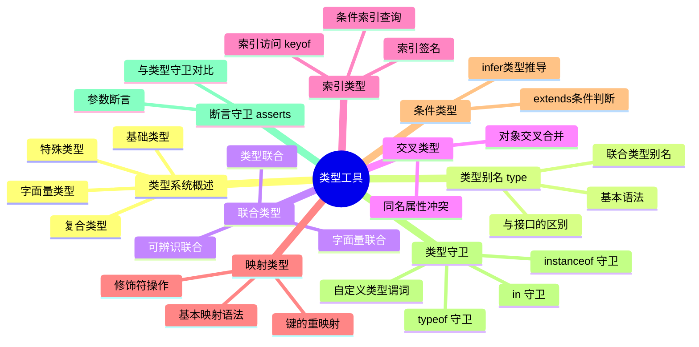

# 类型工具

## 知识架构



## TypeScript 类型系统中的类型

静态类型系统的目的是把类型检查从运行时提前到编译时。TypeScript 的类型系统复用了 JavaScript 的运行时类型，并在此基础上进行了扩展。

### 基础类型

TypeScript 直接复用 JavaScript 的基础类型：

- **原始类型**：`number`、`boolean`、`string`、`bigint`、`symbol`、`undefined`、`null`
- **包装类型**：`Number`、`Boolean`、`String`、`Object`、`Symbol`

```typescript
let num: number = 123
let str: string = "hello"
let bool: boolean = true
let big: bigint = 123n
let sym: symbol = Symbol("desc")
let undef: undefined = undefined
let nul: null = null
```

### 复合类型

除了 JavaScript 原有的 `class` 和 `Array`，TypeScript 还新增了三种复合类型：

#### 元组（Tuple）

元组是元素个数和类型固定的数组类型：

```typescript
type Tuple = [number, string]

const tuple: Tuple = [1, "hello"] // OK
// tuple[0] 是 number 类型
// tuple[1] 是 string 类型

// 带可选元素的元组
type OptionalTuple = [string, number?]
const t1: OptionalTuple = ["hello"]
const t2: OptionalTuple = ["hello", 123]
```

#### 接口（Interface）

接口可以描述函数、对象、构造器的结构：

**描述对象：**

```typescript
interface IPerson {
  name: string
  age: number
}

class Person implements IPerson {
  name: string
  age: number
}

const obj: IPerson = {
  name: "guang",
  age: 18
}
```

**描述函数：**

```typescript
interface SayHello {
  (name: string): string
}

const func: SayHello = (name: string) => {
  return "hello," + name
}
```

**描述构造器：**

```typescript
interface PersonConstructor {
  new (name: string, age: number): IPerson
}

function createPerson(ctor: PersonConstructor): IPerson {
  return new ctor("guang", 18)
}
```

对象类型、class 类型在 TypeScript 里也叫做**索引类型**，即索引了多个元素的类型。如果不确定会有什么属性，可以用可索引签名：

```typescript
interface IPerson {
  [prop: string]: string | number
}

const obj: IPerson = {}
obj.name = "guang"
obj.age = 18
```

#### 枚举（Enum）

枚举是一系列值的复合，用于定义一组命名的常量：

```typescript
enum Transpiler {
  Babel = "babel",
  Postcss = "postcss",
  Terser = "terser",
  Prettier = "prettier",
  TypeScriptCompiler = "tsc"
}

const transpiler = Transpiler.TypeScriptCompiler // "tsc"

// 数字枚举（自动递增）
enum Direction {
  Up, // 0
  Down, // 1
  Left, // 2
  Right // 3
}

// 混合枚举
enum BooleanLikeHeterogeneousEnum {
  No = 0,
  Yes = "YES"
}
```

### 字面量类型

TypeScript 支持字面量类型，即具体的值也可以作为类型：

```typescript
type NumLiteral = 123
type StrLiteral = "hello"
type BoolLiteral = true

const a: 123 = 123 // OK
// const b: 123 = 124 // Error
```

字符串字面量类型有两种形式：

1. **普通字符串字面量**：如 `"hello"`
2. **模板字面量类型**：如 `` `hello${string}` ``，表示以 "hello" 开头，后面是任意 string 的字符串

```typescript
type Greeting = `hello${string}`

const g1: Greeting = "hello world" // OK
const g2: Greeting = "hello" // OK
// const g3: Greeting = "hi world" // Error
```

模板字面量类型常用于约束特定格式的字符串：

```typescript
type HttpMethod = "GET" | "POST" | "PUT" | "DELETE"
type ApiPath = `/api/${string}`
type Endpoint = `${HttpMethod} ${ApiPath}`

const endpoint: Endpoint = "GET /api/users" // OK
// const bad: Endpoint = "PATCH /api/users" // Error
```

### 特殊类型

TypeScript 提供了四种特殊类型：

| 类型 | 含义 | 赋值规则 |
|------|------|----------|
| **`never`** | 不可达的类型 | 任何类型都不能赋值给它（除了 never 本身） |
| **`void`** | 空类型 | 可以是 `undefined` 或 `never` |
| **`any`** | 任意类型 | 任何类型都可以赋值给它，它也可以赋值给任何类型（除了 never） |
| **`unknown`** | 未知类型 | 任何类型都可以赋值给它，但它不可以赋值给其他类型 |

```typescript
// never：永不存在的类型
function throwError(message: string): never {
  throw new Error(message)
}

function infiniteLoop(): never {
  while (true) {}
}

// void：函数没有返回值
function log(message: string): void {
  console.log(message)
}

// any：放弃类型检查
let anything: any = "hello"
anything = 123 // OK
anything.foo() // OK（但运行时可能报错）

// unknown：类型安全的 any
let unknown: unknown = "hello"
unknown = 123 // OK
// unknown.toFixed() // Error：不能直接使用
if (typeof unknown === "number") {
  unknown.toFixed() // OK：类型收窄后可用
}
```

**`any` vs `unknown` 的选择：**

- `any` 完全放弃类型检查，适合快速原型开发或迁移 JavaScript 代码
- `unknown` 更安全，使用前必须进行类型检查，推荐在不确定类型时使用

### 类型的装饰

TypeScript 支持通过修饰符描述类型的属性特性：

```typescript
interface IPerson {
  readonly name: string // 只读属性
  age?: number // 可选属性
}

type tuple = [string, number?] // 可选元素的元组
```

- **`readonly`**：属性不可重新赋值
- **`?`**：属性可选，可以是 `undefined`

## TypeScript 类型系统中的类型运算

TypeScript 类型系统的强大之处在于支持对类型做运算。这些运算逻辑都是针对类型参数（泛型）来说的，传入类型参数，经过一系列类型运算逻辑后，返回新的类型，这就是**高级类型**。

### 类型运算全览

| 运算 | 语法 | 含义 | 示例 |
|------|------|------|------|
| **条件** | `extends ? :` | 类型层面的 if-else | `T extends U ? X : Y` |
| **推导** | `infer` | 在条件类型中提取类型的一部分 | `Tuple extends [infer T, ...infer R] ? T : never` |
| **联合** | `\|` | 类型可以是几种类型之一 | `1 \| 2 \| 3` |
| **交叉** | `&` | 对类型做合并 | `{ a: number } & { c: boolean }` |
| **映射** | `{ [K in keyof T]: ... }` | 遍历索引类型生成新类型 | `{ [Key in keyof T]: [T[Key], T[Key], T[Key]] }` |
| **索引查询** | `keyof` | 查询索引类型中所有的索引 | `keyof { a: 1, b: 2 }` → `"a" \| "b"` |
| **索引访问** | `T[K]` | 取索引类型某个索引的值 | `{ a: 1 }["a"]` → `1` |
| **重映射** | `as` | 在映射类型中改变键名 | `[K in keyof T as ...]` |

### 条件：extends ? :

TypeScript 里的条件判断是 `extends ? :`，叫做条件类型（Conditional Type）：

```typescript
type res = 1 extends 2 ? true : false; // false
```

静态的值自己就能算出结果，所以条件类型的意义在于对**类型参数**进行动态运算：

```typescript
type isTwo<T> = T extends 2 ? true : false;

type res1 = isTwo<1>; // false
type res2 = isTwo<2>; // true
```

### 推导：infer

`infer` 用于在条件类型中提取类型的一部分，通过模式匹配的方式：

```typescript
type First<Tuple extends unknown[]> = Tuple extends [infer T, ...infer R] ? T : never;

type res = First<[1, 2, 3]>; // 1
```

注意，第一个 `extends` 不是条件，条件类型是 `extends ? :`，这里的 extends 是约束的意思。

### 联合：|

联合类型（Union）类似 JS 里的或运算符 `|`，但作用于类型，代表类型可以是几种类型之一：

```typescript
type Union = 1 | 2 | 3;
```

### 交叉：&

交叉类型（Intersection）类似 JS 中的与运算符 `&`，但作用于类型，代表对类型做合并：

```typescript
type ObjType = { a: number } & { c: boolean };
// 结果: { a: number; c: boolean }
```

同一类型可以合并，不同的类型没法合并，会被舍弃（如 `string & number` 结果为 `never`）。

### 映射类型

对象、class 在 TypeScript 对应的类型是索引类型（Index Type），对索引类型做修改需要用**映射类型**：

```typescript
type MapType<T> = {
  [Key in keyof T]?: T[Key]
}
```

- `keyof T` 是查询索引类型中所有的索引，叫做**索引查询**
- `T[Key]` 是取索引类型某个索引的值，叫做**索引访问**
- `in` 是用于遍历联合类型的运算符

映射类型就相当于把一个集合映射到另一个集合，这是它名字的由来。

除了值可以变化，索引也可以做变化，用 `as` 运算符，叫做**重映射**：

```typescript
type MapType<T> = {
    [
        Key in keyof T 
            as `${Key & string}${Key & string}${Key & string}`
    ]: [T[Key], T[Key], T[Key]]
}
```

这里 `& string` 是因为索引类型可以用 `string`、`number` 和 `symbol` 作为 key，`keyof T` 取出的索引就是 `string | number | symbol` 的联合类型，和 `string` 取交叉部分就只剩下 `string` 了。

### 高级类型

这些语法看起来不复杂，但它们可以实现很多复杂逻辑，就像 JS 的语法也不复杂，却可以实现很多复杂逻辑一样。传入类型参数，经过一系列类型运算逻辑后，返回新的类型的类型就叫做**高级类型**。如果是静态的值，直接算出结果即可，没必要写类型逻辑。

## 类型工具分类

**1. 按使用目的划分：**

- **类型创建与转换**：这是本章的重点。这类工具用于基于已有类型生成新类型
  - **类型别名 (`type`)**：为类型命名，提高复用性
  - **联合类型 (`|`)**：让一个类型可以是多种类型之一
  - **交叉类型 (`&`)**：将多个类型合并为一个类型
  - **索引类型 (`keyof`, `[]`)**：查询和访问对象类型的键和值
  - **映射类型 (`in`)**：遍历一个类型的键来创建新类型
  - **条件类型 (`extends ? :`)**：根据类型条件判断返回不同类型
  - **类型推导 (`infer`)**：在条件类型中提取类型的一部分
- **类型安全保护**：这类工具用于在运行时收窄类型范围，确保代码安全
  - **类型守卫 (`is`, `typeof`, `instanceof`)**：在特定代码块中断言更具体的类型

**2. 按语法形式划分：**

- **操作符**：如 `|`、`&`、`keyof`、`typeof`
- **关键字**：如 `type`、`in`、`is`、`extends`、`infer`
- **专用语法**：如索引访问 `T[K]`、映射类型 `{ [K in keyof T]: ... }` 和条件类型 `T extends U ? A : B`

## 类型别名 type

类型别名是 TypeScript 类型编程的基石。从简单的类型命名到复杂的"类型体操"，都离不开它。它的核心功能是为任何类型（无论是原始类型、联合类型还是复杂的对象类型）提供一个可复用的名称

### 基础用法：命名与复用

`type` 关键字用于声明一个类型别名，其作用主要是封装一个类型定义，以便在多处复用，从而提高代码的可读性和可维护性。

**抽离联合类型：**

```typescript
type StatusCode = 200 | 301 | 400 | 500 | 502
type PossibleDataTypes = string | number | (() => unknown)

const status: StatusCode = 502
```

**抽离函数签名：**

```typescript
type Handler = (e: Event) => void

const clickHandler: Handler = (e) => {
  /* ... */
}
const moveHandler: Handler = (e) => {
  /* ... */
}
```

**声明对象类型（类似 `interface`）：**

```typescript
type UserProfile = {
  name: string
  age: number
  isActive: boolean
}
```

### 引入泛型：创建"类型函数"

基础的类型别名是"类型变量"，但引入泛型后，类型别名就升级为了"类型函数"。它不再是一个固定的类型，而是可以接受一个或多个类型作为"参数"，并返回一个新类型。通常称之为**工具类型**。

泛型使用尖括号 `<T>` 来声明，`T` 只是占位符可以换成任何合法的名称（通常使用 `T`, `K`, `U`, `P` 等单个大写字母）。

```typescript
type Factory<T> = T | number | string
```

这个 `Factory<T>` 工具类型就像一个函数：传入一个类型 `T`，它返回一个联合类型 `T | number | string`

```typescript
// "调用"类型函数，传入 boolean
type FactoryWithBool = Factory<boolean> // 得到 boolean | number | string

const foo: FactoryWithBool = true
```

**示例 1：创建可空类型 `Maybe<T>`**

在处理可能为 `null` 或 `undefined` 的数据时，可以创建 `Maybe<T>` 工具类型来增加代码的健壮性。

```typescript
type Maybe<T> = T | null | undefined

function process(input: Maybe<{ handler: () => {} }>) {
  // input 可能是 null 或 undefined，必须使用可选链 ?.
  input?.handler()
}
```

**示例 2：创建数组或单体类型 `MaybeArray<T>`**

一个函数可能接受一个元素，也可能接受一个元素数组。`MaybeArray<T>` 可以完美地描述这种情况。

```typescript
type MaybeArray<T> = T | T[]

// 这个函数确保返回值总是一个数组
function ensureArray<T>(input: MaybeArray<T>): T[] {
  return Array.isArray(input) ? input : [input]
}
```

**示例 3：封装 API 响应结构 `ApiResponse<T>`**

在项目中，API 的响应格式通常是固定的。可以创建一个 `ApiResponse<T>` 来封装通用结构，其中 `T` 代表具体的数据类型。

```typescript
type ApiResponse<T> = {
  data: T
  isSuccess: boolean
  errorMessage?: string
}

type UserResponse = ApiResponse<{ name: string; age: number }>
const response: UserResponse = {
  data: { name: "xiaoye", age: 18 },
  isSuccess: true
}

type ArticleResponse = ApiResponse<{ title: string; content: string }>
```

通过这种方式极大地提高了类型定义的复用性，并确保了项目中 API 响应格式的一致性

### `type` vs. `interface`

`type` 和 `interface` 在很多场景下可以互换，但它们之间存在关键区别，理解这些区别有助于我们做出更合适的选择。

| 特性         | `interface`                                          | `type`                                                                         |
| :----------- | :--------------------------------------------------- | :----------------------------------------------------------------------------- |
| **扩展性**   | 支持通过同名声明进行"声明合并" (Declaration Merging) | 不支持声明合并，但可以通过交叉类型 (`&`) 实现扩展                              |
| **实现**     | 类可以通过 `implements` 来实现接口                   | 类也可以 `implements` 一个包含对象结构的 `type`，但 `interface` 更为通用和直观 |
| **适用范围** | 只能用于描述对象或函数的形状                         | 可以描述任何类型，包括原始类型、联合类型、元组等                               |
| **计算属性** | 不支持                                               | 支持通过映射类型计算属性类型                                                   |
| **条件类型** | 不支持                                               | 支持条件类型、类型推断等高级特性                                               |

**声明合并示例**：

```typescript
// interface 支持声明合并
interface Config {
  host: string
}

interface Config {
  port: number
}

const config: Config = {
  host: 'localhost',
  port: 3000
}

// type 不支持声明合并
type ConfigType = {
  host: string
}

// Error: Duplicate identifier 'ConfigType'
// type ConfigType = {
//   port: number
// }
```

**同名属性冲突规则**：

当同名接口声明中存在同名属性时，这些属性的类型必须兼容：

```typescript
interface Struct1 {
  primitiveProp: string;
}

interface Struct1 {
  // Error: 后续属性声明必须属于同一类型
  // 属性"primitiveProp"的类型必须为"string"，但此处却为类型"number"
  primitiveProp: number;
}
```

**接口与类型别名的合并**：

接口继承类型别名，和类型别名使用交叉类型合并接口，行为一致：

```typescript
type Base = {
  name: string;
};

interface IDerived extends Base {
  // Error: 就像继承接口一样需要类型兼容
  name: number;
  age: number;
}

interface IBase {
  name: string;
}

// 合并后的 name 是 never 类型（string & number = never）
type Derived = IBase & {
  name: number;
};
```

**高级类型示例**：

```typescript
// type 可以表示更复杂的类型
type ID = string | number // 联合类型
type Tuple = [string, number] // 元组类型
type Readonly<T> = {
  // 映射类型
  readonly [K in keyof T]: T[K]
}

// interface 只能描述对象形状
interface IUser {
  name: string
  age: number
}
```

**选择建议：**

- **优先使用 `interface` 定义公共 API 的形状**：比如一个库暴露给外部的类型、组件的 `props` 等。因为 `interface` 的声明合并特性为用户提供了扩展的可能
- **在需要定义联合类型、元组或其他非对象类型时，使用 `type`**。
- **当你需要利用映射类型等高级类型工具时，`type` 是唯一的选择**。

简单来说：**"`interface` 用于'定义'，`type` 用于'变换'"**。当你不确定时，可以先使用 `type`，因为它更灵活

## 类型组合：联合与交叉

在 TypeScript 中经常需要将已有的类型组合起来，形成更复杂的类型。最核心的两种组合方式是**联合类型（Union Types）**和**交叉类型（Intersection Types）**

- **联合类型 (`|`)** 对应逻辑上的"**或**"（`||`）
- **交叉类型 (`&`)** 对应逻辑上的"**与**"（`&&`）

### 联合类型 (`|`)："或"逻辑

联合类型表示一个值可以是几种类型之一。只要满足其中任意一个类型，该值就是合法的。

```typescript
let a: string | number

a = "hello" // OK
a = 123 // OK

a = true // Error: Type 'boolean' is not assignable to type 'string | number'.
```

常见的用例是描述一个函数可以接受不同类型的参数：

```typescript
function formatId(id: string | number) {
  // Inside the function, we need to narrow the type
  if (typeof id === "string") {
    return id.toUpperCase()
  } else {
    return id.toFixed(2)
  }
}
```

**联合类型的特性**：

- **类型收窄**：通过类型守卫可以收窄联合类型的范围
- **分发特性**：在条件类型中，联合类型会分发到每个成员
- **字面量联合**：常用于表示有限的选项集合

```typescript
// 字面量联合类型：表示有限的状态
type Status = 'pending' | 'approved' | 'rejected'
type Role = 'admin' | 'user' | 'guest'

// 类型收窄示例
function process(value: string | number | boolean) {
  if (typeof value === 'string') {
    // value 的类型收窄为 string
    return value.toUpperCase()
  } else if (typeof value === 'number') {
    // value 的类型收窄为 number
    return value.toFixed(2)
  } else {
    // value 的类型收窄为 boolean
    return value ? 'true' : 'false'
  }
}
```

### 交叉类型 (`&`)："与"逻辑

交叉类型是将多个类型合并为一个新类型。这个新类型**同时拥有**所有组成类型的所有特性。

#### 联合类型与交叉类型的对比

| 特性 | 联合类型 (`|`) | 交叉类型 (`&`) |
|------|----------------|----------------|
| **逻辑关系** | "或"关系，满足其一即可 | "与"关系，必须同时满足 |
| **类型范围** | 取并集，范围扩大 | 取交集，范围缩小 |
| **对象类型** | 值可以满足其中任意一个 | 值必须同时满足所有类型 |
| **原始类型** | 表示多种可能的类型 | 不同原始类型交叉得到 `never` |
| **使用场景** | 处理多种可能的类型情况 | 合并多个类型的特性 |

#### 对象类型的合并

对于对象类型，交叉类型会将它们的属性合并。`ProfileStruct` 是**同时包含** `name` 和 `age` 属性的新类型。这在功能上类似于 `interface` 的 `extends`

```typescript
interface NameStruct {
  name: string
}

interface AgeStruct {
  age: number
}

type ProfileStruct = NameStruct & AgeStruct

const profile: ProfileStruct = {
  name: "xiaoye",
  age: 18
} // OK, it has both name and age
```

#### 原始类型的交叉

当对原始类型使用交叉类型时，结果通常会是 `never`，因为一个值不可能**同时**是两种不同的原始类型。`never` 类型在这里的出现是合乎逻辑的，它代表了一个永不存在的类型。没有哪个值既是 `string` 又是 `number`

```typescript
type StrAndNum = string & number // Type is never
```

#### 属性冲突的处理

如果交叉的多个对象类型中存在同名属性，那么这个属性的类型将是它们原有类型的交叉类型。

```typescript
type Struct1 = {
  primitiveProp: string
  objectProp: {
    name: string
  }
}

type Struct2 = {
  primitiveProp: number
  objectProp: {
    age: number
  }
}

type Composed = Struct1 & Struct2

type PrimitivePropType = Composed["primitiveProp"] // never
type ObjectPropType = Composed["objectProp"] // { name: string; age: number; }

const composedVar: Composed = {
  // Type 'string' is not assignable to type 'never'.
  primitiveProp: "hello",
  objectProp: {
    name: "xiaoye",
    age: 18
  }
}
```

因为 `composedVar.primitiveProp` 的类型是 `never`，所以无法给它赋任何值（除了 `never` 本身，但 `never` 类型的值无法被创建）。这使得 `Composed` 类型实际上是不可构造的

#### 联合类型的交叉

当两个联合类型相交时，其结果是取两个联合类型中**共有的成员**

```typescript
type UnionA = "a" | "b" | "c"
type UnionB = "b" | "c" | "d"

// Result is 'b' | 'c'
type IntersectionOfUnions = UnionA & UnionB
```

这可以理解为：值的类型必须**同时**是 `UnionA` **和** `UnionB`。要满足这个条件，该值必须是 `UnionA` 和 `UnionB` 的交集

### 实践场景：可扩展的配置对象

假设正在设计一个组件，它有基础配置 `BaseConfig` 和扩展配置 `ExtendedConfig`。可以使用交叉类型来创建一个完整的配置对象

```typescript
interface BaseConfig {
  theme: "light" | "dark"
  responsive: boolean
}

interface ExtendedConfig {
  animations: boolean
  lazyLoad: boolean
}

type FullConfig = BaseConfig & ExtendedConfig

function createComponent(config: FullConfig) {
  console.log(`Theme: ${config.theme}`)
  console.log(`Animations: ${config.animations}`)
}

// We can also use it for partial updates
function updateConfig(current: FullConfig, patch: Partial<FullConfig>): FullConfig {
  return { ...current, ...patch }
}
```

## 解构对象类型：索引类型

索引类型是 TypeScript 中一组用于"解构"和操作对象类型的强大工具。它们允许以类型安全的方式查询对象的键、访问属性的类型，或者定义具有动态键的结构。

### 索引类型的三大核心工具

1. **索引签名 (Index Signatures)**：用于定义一个对象可以拥有哪些类型的键和值
2. **`keyof` 操作符**：用于获取一个类型的所有键，并返回一个由这些键组成的联合类型
3. **索引访问类型 (Indexed Access Types)**：用于获取一个类型中某个键对应的属性类型

### 索引类型的应用场景

- **动态对象**：处理键不确定但值类型统一的场景
- **类型查询**：从已有类型中提取键名或值类型
- **泛型约束**：确保类型参数符合特定结构
- **类型推导**：自动推导对象的结构类型

### 核心思想

在 TypeScript 的类型世界里，"索引"操作指的是**通过一个"键的类型"来获取一个"值的类型"**。这与 JavaScript 中通过变量（键）来访问对象属性值的行为是平行的

### 索引签名：定义动态键值结构

索引签名允许为一个类型定义"任意"属性。这在处理一些键不确定，但值的类型是统一的场景时非常有用，例如动态创建的字典或缓存对象。语法为 `[key: KeyType]: ValueType`。

```typescript
interface StringMap {
  [key: string]: string
}

const myMap: StringMap = {}
myMap.foo = "bar"
myMap.anyKey = "anyValue"

const value: string = myMap.whatever // OK, a string
```

**关键点：**

- **键的类型**：`KeyType` 只能是 `string`、`number` 或 `symbol`（或由它们组成的联合类型）
- **JavaScript 行为映射**：由于 JavaScript 会将数字索引转换为字符串（`obj[1]` 等同于 `obj['1']`），因此 `string` 类型的索引签名也允许使用 `number` 类型的键
- **与具体属性共存**：类型可以同时拥有索引签名和具体的属性声明，但所有具体属性的类型都必须与索引签名的值类型兼容（或是其子类型）

```typescript
interface MixedType {
  propA: number // OK, number is a subtype of number | boolean
  propB: boolean
  [key: string]: number | boolean

  // Error: Property 'propC' of type 'string' is not assignable
  // to 'string' index type 'number | boolean'.
  propC: string
}
```

在重构旧的 JavaScript 代码时，`[key: string]: any` 是一种常见的过渡策略，它可以让你在逐步完善类型定义的同时，暂时绕过严格的类型检查

### `keyof` 操作符：查询键

`keyof` 操作符接收一个对象类型，并返回一个由该对象所有**键**的字面量类型组成的**联合类型**。

```typescript
interface User {
  id: number
  name: string
  email: string
}

type UserKeys = keyof User // "id" | "name" | "email"
```

`keyof` 的行为就像 `Object.keys()`，但它操作的是类型层面，返回的是键名的**类型**

**关键点：**

- **数字和符号键**：如果对象键是 `number` 或 `symbol`，`keyof` 也会返回它们对应的字面量类型

  ```typescript
  const sym = Symbol()
  interface MixedKeys {
    [sym]: string
    123: number
    prop: boolean
  }
  type Keys = keyof MixedKeys // typeof sym | 123 | "prop"
  ```

- **`keyof any`**：对 `any` 使用 `keyof` 会得到 `string | number | symbol`，这代表了 JavaScript 中所有合法的对象键类型

### 索引访问类型：访问属性类型

索引访问类型允许"查询"一个类型中特定属性的类型。它的语法是 `T[K]`，其中 `T` 是一个类型，`K` 是一个代表键的类型

```typescript
interface User {
  id: number
  name: string
  email: string
}

type UserIdType = User["id"] // number
type UserNameType = User["name"] // string
```

这里的 `'id'` 和 `'name'` 是字符串字面量**类型**，而不是值

#### 组合 `keyof` 和索引访问类型

`keyof` 和索引访问类型是天作之合。可以用 `keyof` 获取所有键的联合类型，然后用索引访问类型获取所有值的联合类型

```typescript
interface User {
  id: number
  name: string
  email: string
}

type UserValues = User[keyof User] // string | number
```

这行代码可以这样解读：

1.  `keyof User` 得到 `"id" | "name" | "email"`
2.  `User["id" | "name" | "email"]` 被展开为 `User["id"] | User["name"] | User["email"]`
3.  最终得到 `number | string | string`，简化为 `number | string`

这种模式在创建泛型工具类型时非常有用，例如：编写一个安全地获取对象属性值的函数：

```typescript
function getProperty<T, K extends keyof T>(obj: T, key: K): T[K] {
  return obj[key]
}

const user: User = { id: 1, name: "xiaoye", email: "test@test.com" }

const userName = getProperty(user, "name") // Type is string
const userId = getProperty(user, "id") // Type is number

// Error: Argument of type '"age"' is not assignable to parameter of type 'keyof User'.
const userAge = getProperty(user, "age")
```

`K extends keyof T` 是一个泛型约束，它确保了传入的 `key` 必须是 `obj` 的一个真实存在的键。函数的返回值类型 `T[K]` 则精确地表示了该键对应的值的类型。这是 TypeScript 类型安全性的一个完美体现

## 映射类型

如果说索引类型是"解构"类型，那么映射类型就是"重构"类型。它是 TypeScript 类型编程中最强大的工具之一，允许像遍历数组一样遍历一个对象类型的所有键，并对每个属性进行转换，从而创建出全新的类型结构。

许多内置的工具类型，如 `Partial<T>`、`Readonly<T>`、`Pick<T>` 等，都是基于映射类型实现的。

### 映射类型的优势

- **批量操作**：一次性对对象的所有属性进行转换
- **类型安全**：保留原始类型的键名和结构信息
- **声明式**：以声明的方式描述类型变换，易于理解和维护
- **可组合**：可以链式组合多个映射操作

### 核心语法与思想

映射类型的核心思想是**"从一个旧类型中，映射出一个新类型"**。它的语法与索引签名相似，但使用 `in` 关键字：

```typescript
type MappedType<T> = {
  [K in keyof T]: NewType
}
```

这行代码可以这样解读：

1.  `keyof T`：获取类型 `T` 的所有键，形成一个联合类型（如 `"prop1" | "prop2"`）
2.  `K in ...`：遍历这个联合类型中的每一个键 `K`
3.  `[K ...]: NewType`：对于每一个键 `K`，创建一个新的属性，其类型为 `NewType`

示例：克隆一个类型

```typescript
type Clone<T> = {
  [K in keyof T]: T[K]
}
```

这里，`NewType` 就是 `T[K]`，即原类型中该键对应的值类型。这使得 `Clone<T>` 成为了 `T` 的一个精确副本

### 映射修饰符：修改属性特性

映射类型不仅可以改变属性的类型，还可以改变属性的**修饰符**，如 `readonly` 和 `?`（可选）。可以通过 `+` 和 `-` 前缀来显式地添加或移除这些修饰符

#### 添加修饰符

TypeScript 内置的 `Readonly<T>` 和 `Partial<T>` 就是通过添加修饰符实现的。

**`Readonly<T>`：将所有属性变为只读**

```typescript
type MyReadonly<T> = {
  readonly [K in keyof T]: T[K]
}

// 使用
interface User {
  name: string
  age: number
}

const readonlyUser: MyReadonly<User> = { name: "xiaoye", age: 18 }
readonlyUser.name = "new name" // Error: Cannot assign to 'name' because it is a read-only property.
```

**`Partial<T>`：将所有属性变为可选**

```typescript
type MyPartial<T> = {
  [K in keyof T]?: T[K]
}

// 使用
const partialUser: MyPartial<User> = {} // OK
const partialUser2: MyPartial<User> = { name: "xiaoye" } // OK
```

#### 移除修饰符

使用 `-` 前缀可以移除属性的修饰符。

**`Required<T>`：将所有可选属性变为必选**

```typescript
type MyRequired<T> = {
  [K in keyof T]-?: T[K]
}

interface UserWithOptional {
  name: string
  age?: number
}

// Error: Property 'age' is missing in type '{ name: string; }' but required in type 'MyRequired<UserWithOptional>'.
const requiredUser: MyRequired<UserWithOptional> = { name: "xiaoye" }
```

**`Mutable<T>`：移除所有只读属性**

```typescript
type Mutable<T> = {
  -readonly [K in keyof T]: T[K]
}

const mutableUser: Mutable<MyReadonly<User>> = { name: "xiaoye", age: 18 }
mutableUser.name = "new name" // OK
```

### 键的重映射：`as` 子句

这是映射类型最强大的功能之一：在映射过程中可以使用 `as` 子句来**改变键的名称**。语法：`[K in keyof T as NewKeyType]`

#### 示例：为属性添加 `get` 前缀

假设想将一个对象类型 `{ prop: number }` 转换为 `{ getProp: () => number }`。

```typescript
type Getter<T> = {
  [K in keyof T as `get${Capitalize<string & K>}`]: () => T[K]
}

interface User {
  name: string
  age: number
}

type UserGetter = Getter<User>

// 等价于：
// type UserGetter = {
//   getName: () => string;
//   getAge: () => number;
// }
```

这里发生了几件事：

1.  `K in keyof T`：遍历 `"name"` 和 `"age"`。
2.  `as get${Capitalize<string & K>}` ：对每个键 `K` 进行重命名
    - `string & K`：这是一个小技巧，确保 `K` 被当作字符串处理，以便 `Capitalize` 内置工具类型能正常工作。
    - `Capitalize<...>`：将字符串首字母大写（`name` -> `Name`）。
    - 模板字面量类型：最终拼接成 `"getName"` 和 `"getAge"`。
3.  `: () => T[K]`：将属性的类型设置为一个返回原属性类型的函数。

#### 示例：过滤属性

通过在 `as` 子句中返回 `never`，可以实现属性的过滤，`Omit<T, K>` 一类需要过滤属性的工具类型也是同样的思路。

示例：创建只保留字符串类型属性的工具 `PickStringProps<T>`。

```typescript
type PickStringProps<T> = {
  [K in keyof T as T[K] extends string ? K : never]: T[K]
}

interface User {
  name: string
  age: number
  email: string
}

type StringPropsOnly = PickStringProps<User>

// 等价于：
// type StringPropsOnly = {
//   name: string;
//   email: string;
// }
```

代码解读：

1.  `K in keyof T`：遍历 `"name"`、 `"age"`、 `"email"`
2.  `as T[K] extends string ? K : never`：这是一个条件判断
    - `T[K]` 是当前属性的值类型
    - 如果 `T[K]` 是 `string` 的子类型，那么键名保持为 `K`
    - 否则，键名被重映射为 `never`
3.  当键名为 `never` 时，该属性会被从最终的类型中**丢弃**

## 条件类型与类型推导

除了联合、交叉、索引和映射类型，TypeScript 还支持条件判断和类型推导，这是实现复杂类型逻辑的基础。

### 条件类型：`extends ? :`

TypeScript 中的条件判断是 `extends ? :`，称为**条件类型（Conditional Type）**。它相当于类型层面的 `if...else`：

```typescript
type res = 1 extends 2 ? true : false // false
```

静态的值自己就能算出结果，所以条件类型的意义在于对**类型参数**进行动态运算：

```typescript
type IsTwo<T> = T extends 2 ? true : false

type res1 = IsTwo<1> // false
type res2 = IsTwo<2> // true
```

条件类型常用于根据输入类型返回不同的类型结果：

```typescript
// 判断是否为字符串类型
type IsString<T> = T extends string ? true : false

type A = IsString<"hello"> // true
type B = IsString<123> // false

// 根据类型返回不同的值类型
type ResultType<T> = T extends string
  ? { value: string }
  : T extends number
  ? { value: number }
  : { value: unknown }

type StringResult = ResultType<"hello"> // { value: string }
type NumberResult = ResultType<123> // { value: number }
```

**注意**：条件类型中的 `extends` 有两种含义：
- 在 `T extends U ? A : B` 中，`extends` 是**条件判断**
- 在 `T extends U` 的泛型约束中，`extends` 是**约束**，表示 T 必须满足 U 的结构

### 类型推导：`infer`

`infer` 关键字用于在条件类型中**提取类型的一部分**，它只能在 `extends` 条件分支中使用：

```typescript
// 提取元组的第一个元素类型
type First<Tuple extends unknown[]> = Tuple extends [infer T, ...infer R] ? T : never

type res1 = First<[1, 2, 3]> // 1
type res2 = First<[string, number]> // string

// 提取函数的返回值类型
type GetReturnType<T> = T extends (...args: any[]) => infer R ? R : never

type ReturnTypeOf = GetReturnType<() => string> // string

// 提取函数的参数类型
type GetParameters<T> = T extends (...args: infer P) => any ? P : never

type ParamsOf = GetParameters<(a: string, b: number) => void> // [a: string, b: number]

// 提取 Promise 的内部类型
type Unpacked<T> = T extends Promise<infer U> ? U : T

type PromiseContent = Unpacked<Promise<string>> // string
type NormalType = Unpacked<number> // number
```

`infer` 的核心思想是：在 `extends` 的条件判断中，用 `infer` 声明一个**待推导的类型变量**，TypeScript 会根据匹配的模式自动推导出这个类型变量的具体类型。

### 高级类型

引入泛型后，类型别名从"类型变量"升级为"类型函数"。当类型函数中包含条件判断、推导等类型运算逻辑时，就构成了**高级类型**：

> 高级类型的特点是：传入类型参数，经过一系列类型运算逻辑后，返回新的类型。

```typescript
// 高级类型：传入类型参数，经过运算返回新类型
type IsNever<T> = [T] extends [never] ? true : false

type A = IsNever<never> // true
type B = IsNever<string> // false
```

高级类型是 TypeScript 类型编程的核心，前面提到的映射类型、条件类型、`infer` 推导等都是构建高级类型的基础工具。后面的章节会大量使用这些工具来实现各种复杂的类型逻辑。

## 类型查询 `typeof`

在 TypeScript 中 `typeof` 操作符拥有双重身份，它既是 JavaScript 中用于获取运行时类型的操作符，也是 TypeScript 在编译时用于类型查询的关键字。

### `typeof` 的双重身份

- **JavaScript `typeof`（运行时）**：在代码运行时返回一个表示变量类型的字符串，如 `"string"`、`"number"`、`"object"` 等
- **TypeScript `typeof`（编译时）**：当 `typeof` 用于类型上下文中（如类型标注、类型别名），它会变身为 **类型查询操作符（Type Query Operator）**，在编译阶段获取变量或属性的静态类型

### `typeof` 的核心价值

1. **保持同步**：从实际代码中提取类型，确保类型定义与实现同步
2. **减少重复**：避免重复定义相同的类型结构
3. **提高可维护性**：当实现改变时，类型自动更新
4. **简化类型定义**：对于复杂对象，直接从值推导类型更简单

### 应用场景

`typeof` 主要用途是从实际代码中"提取"类型，这在保持类型与实现同步方面非常有用

**基础用法：获取变量类型**

`typeof` 会推导出变量最精确的类型，包括字面量类型。

```typescript
const str = "xiaoye"
const obj = { name: "xiaoye" }
const nullVar = null
const undefinedVar = undefined
const func = (input: string) => {
  return input.length > 10
}

// 从变量中提取类型
type Str = typeof str // "xiaoye"
type Obj = typeof obj // { name: string; }
type Null = typeof nullVar // null
type Undefined = typeof undefinedVar // undefined
type Func = typeof func // (input: string) => boolean
```

**与工具类型结合**

`typeof` 常与 `ReturnType`、`Parameters` 等工具类型结合使用，以获取函数签名的一部分

```typescript
const func = (input: string) => {
  return input.length > 10
}

// 获取函数 func 的返回值类型
type FuncReturnType = ReturnType<typeof func> // boolean

// 获取函数 func 的参数类型
type FuncParametersType = Parameters<typeof func> // [input: string]
```

**注意事项**：为确保类型查询的纯粹性，TypeScript 禁止在 `typeof` 后面使用表达式，因为它应该直接指向一个明确的标识符

```typescript
const isInputValid = (input: string) => {
  return input.length > 10;
};

// ❌ 错误：不允许在 typeof 后使用表达式
let isValid: typeof isInputValid("xiaoye");
```

## 类型守卫

TypeScript 强大的类型推导能力会根据代码逻辑自动收窄类型，这一过程称为 **类型控制流分析**。当代码执行到特定分支时，TypeScript 会分析判断条件，从而在当前作用域中获得更精确的类型信息。

### 类型守卫的作用

类型守卫是 TypeScript 类型系统的核心机制之一，它能够：

1. **类型收窄**：将宽泛的类型缩小到更具体的类型
2. **类型安全**：确保在特定代码块中访问类型特有的属性和方法
3. **代码提示**：提供更精确的智能提示
4. **错误预防**：在编译时捕获类型错误

```typescript
function foo(input: string | number) {
  if (typeof input === "string") {
    // TypeScript 在此分支中知道 input 是 string 类型
  }
  if (typeof input === "number") {
    // TypeScript 在此分支中知道 input 是 number 类型
  }
  // ...
}
```

但将判断逻辑封装到独立的函数中时，TypeScript 的类型控制流分析可能会"失效"，因为它默认不会跨越函数边界进行类型推断。

```typescript
function isString(input: unknown): boolean {
  return typeof input === "string"
}

function foo(input: string | number) {
  if (isString(input)) {
    // ❌ 错误：类型"string | number"上不存在属性"replace"。
    // TypeScript 无法将 isString 的返回结果与 input 的类型关联起来
    input.replace("xiaoye", "xiaoye599")
  }
  // ...
}
```

为了解决这个问题，TypeScript 提供 `is` 关键字，允许创建自定义的 **类型守卫函数**，显式地告诉编译器在函数返回 `true` 时，参数应该被收窄为哪种特定类型

### `is` 关键字

类型守卫函数是一个返回值为 `参数 is 类型` 的函数。它的作用是，当函数返回 `true` 时，TypeScript 会将该参数的类型收窄为指定的类型

```typescript
// 这个函数就是一个类型守卫
function isString(input: unknown): input is string {
  return typeof input === "string"
}

function foo(input: string | number) {
  if (isString(input)) {
    // ✅ 正确：TypeScript 知道这里的 input 是 string 类型
    input.replace("xiaoye", "xiaoye599")
  }
  // ...
}
```

**工作原理**：

- `input is string` 如果函数返回 `true`，那么传入的 `input` 参数就是 `string` 类型
- 在 `if (isString(input))` 分支中，TypeScript 的类型控制流分析机制会识别这个信号，从而将 `input` 的类型从 `string | number` 收窄为 `string`

**注意事项**：

类型守卫的正确性完全由开发者保证。TypeScript 并不会检查实现逻辑是否真的与声明的类型匹配。如果错误地进行类型判断，可能会导致运行时错误

```typescript
// 这是一个错误的类型守卫，会误导 TypeScript
function isStringButActuallyNumber(input: unknown): input is number {
  // 逻辑上判断的是 string，但类型上声明的是 number
  return typeof input === "string"
}

function foo(input: string | number) {
  if (isStringButActuallyNumber(input)) {
    // ❌ 运行时错误：input.toFixed is not a function
    // TypeScript 认为 input 是 number，但实际上它可能是 string
    input.toFixed()
  }
}
```

**实用示例：过滤数组中的无效值**

类型守卫在处理包含混合类型或可能存在 `null`、`undefined` 的数组时非常有用。

```typescript
export type Falsy = false | "" | 0 | null | undefined

export const isFalsy = (val: unknown): val is Falsy => !val

// 一个更具体的守卫，只检查 null 和 undefined
export const isNil = (val: unknown): val is null | undefined =>
  val === null || val === undefined

const arr = [1, 2, null, 3, undefined, 4]

// 使用 isNil 守卫过滤掉 null 和 undefined
const nonNilArr = arr.filter((item): item is number => !isNil(item)) // number[]

// 如果没有类型守卫，filter 后的类型仍然是 (number | null | undefined)[]
const stillMixedArr = arr.filter((item) => !isNil(item)) // (number | null | undefined)[]
```

### `in` 操作符

`in` 操作符是 JavaScript 的原生操作符，用于检查一个对象（或其原型链）上是否存在某个属性。TypeScript 利用它来收窄联合类型中包含不同属性的对象类型。

**适用场景**：当处理的联合类型中，每个成员都拥有独特的属性时，`in` 操作符是理想的类型保护工具

```typescript
interface Foo {
  foo: string
  fooOnly: boolean
  shared: number
}

interface Bar {
  bar: string
  barOnly: boolean
  shared: number
}

function handle(input: Foo | Bar) {
  if ("foo" in input) {
    // ✅ 正确：TypeScript 知道 input 是 Foo 类型
    input.fooOnly
  } else {
    // ✅ 正确：TypeScript 知道 input 是 Bar 类型
    input.barOnly
  }
}
```

如果一个属性在联合类型的所有成员中都存在，那么它就不能作为类型保护的"标识"，因为 `in` 检查始终为 `true`

```typescript
function handle(input: Foo | Bar) {
  if ("shared" in input) {
    // ❌ 错误：input 仍然是 Foo | Bar 类型
    input.fooOnly
  } else {
    // 这里的 input 是 never 类型
    input.barOnly
  }
}
```

#### 可辨识联合类型

虽然 `in` 操作符可以区分联合类型中的不同成员，但更健壮和可扩展的方式是使用 **可辨识联合类型（Discriminated Unions）**，也称为 **标签联合类型（Tagged Unions）**。

可辨识联合类型是一种特殊的联合类型，其所有成员都包含一个 **共同的、类型为字面量** 的属性，这个属性被称为 **可辨识属性（Discriminant Property）** 或 **标签（Tag）**。通过检查这个标签属性，我们可以精确地识别出当前处理的是联合类型中的哪一个成员

```typescript
interface Foo {
  kind: "foo" // 可辨识属性
  diffType: string
  fooOnly: boolean
}

interface Bar {
  kind: "bar" // 可辨识属性
  diffType: number
  barOnly: boolean
}

function handle(input: Foo | Bar) {
  if (input.kind === "foo") {
    // ✅ 正确：TypeScript 知道 input 是 Foo 类型
    input.fooOnly
  } else {
    // ✅ 正确：TypeScript 知道 input 是 Bar 类型
    input.barOnly
  }
}
```

**优势**：

- **明确性**：比 `in` 操作符更明确，代码意图更清晰
- **可扩展性**：当需要向联合类型中添加新成员时，只需添加新的接口和对应的 `case` 即可
- **安全性**：可以配合 `never` 类型实现穷尽性检查，确保所有可能的情况都已被处理

### `instanceof` 操作符

`instanceof` 也是 JavaScript 原生的操作符，用于检查一个对象是否是某个构造函数（类）的实例。TypeScript 同样利用它来收窄类型。

**适用场景**：当处理的类型是类（Class）的实例时，`instanceof` 是最自然的类型保护方式。

```typescript
class FooBase {}
class BarBase {}

class Foo extends FooBase {
  fooOnly() {}
}
class Bar extends BarBase {
  barOnly() {}
}

function handle(input: Foo | Bar) {
  if (input instanceof FooBase) {
    // ✅ 正确：TypeScript 知道 input 是 Foo 类型
    input.fooOnly()
  } else {
    // ✅ 正确：TypeScript 知道 input 是 Bar 类型
    input.barOnly()
  }
}
```

## 断言守卫 `asserts`

除了 `is` 关键字，TypeScript 还提供另一种形式的类型守卫：**断言守卫（Assertion Guards）**

断言守卫与 `is` 类型守卫的核心区别在于 **失败时的行为**：

- **`is` 类型守卫**：如果检查未通过，代码会继续执行，但类型不会被收窄
- **`asserts` 断言守卫**：如果检查未通过，函数 **必须抛出错误**，中断代码执行

### 工作原理与示例

断言守卫的返回类型被标注为 `asserts condition` 或 `asserts val is type`。它的作用是，如果函数没有抛出错误并正常返回，那么 TypeScript 就会认为 `condition` 为真，或者 `val` 的类型就是 `type`。

**基础用法：断言条件**

在 Node.js 的 `assert` 模块中，断言函数是常见工具。我们可以这样为其添加类型定义：

```typescript
// `asserts condition` 表示，如果函数成功返回，那么 condition 一定为真
function assert(condition: any, msg?: string): asserts condition {
  if (!condition) {
    throw new Error(msg)
  }
}

let name: any = "xiaoye"

// 在这里，TypeScript 并不知道 name 的类型
assert(typeof name === "number")

// ✅ 正确：通过断言后，TypeScript 知道 name 是 number 类型
name.toFixed()
```

**结合 `is` 的用法：断言类型**

也可以创建一个更具体的断言函数，直接断言变量的类型

```typescript
function assertIsNumber(val: any): asserts val is number {
  if (typeof val !== "number") {
    throw new Error("Not a number!")
  }
}

let name: any = "xiaoye"

assertIsNumber(name)

// ✅ 正确：通过断言后，TypeScript 知道 name 是 number 类型
name.toFixed() // 在运行时会抛出 "Not a number!" 错误
```

###  `asserts` 与 `is` 的对比

| 特性         | `is` 类型守卫          | `asserts` 断言守卫         |
| :----------- | :--------------------- | :------------------------- |
| **核心功能** | 类型收窄               | 类型断言与流程控制         |
| **失败行为** | 继续执行，类型不收窄   | 抛出错误，中断执行         |
| **返回类型** | `boolean`（隐式）      | `void`（隐式）             |
| **适用场景** | 处理联合类型、过滤数据 | 验证函数入参、确保前置条件 |

**选择建议**：

- 当你希望在不中断程序流程的情况下处理不同类型时，使用 `is` 类型守卫（例如，在 `if` 分支或 `filter` 中）。
- 当你需要确保某个条件必须满足，否则程序无法继续安全执行时，使用 `asserts` 断言守卫（例如，在函数开头验证参数）。

## 类型保护机制对比总结

| 机制             | 检查目标   | 适用场景                                                     | 示例                            |
| :--------------- | :--------- | :----------------------------------------------------------- | :------------------------------ |
| **`typeof`**     | 原始类型   | 区分 `string`、 `number`、 `boolean`、 `symbol`、 `bigint`、 `undefined`、 `function` | `if (typeof x === 'string')`    |
| **`instanceof`** | 类的实例   | 检查一个对象是否是某个类的实例                               | `if (x instanceof MyClass)`     |
| **`in`**         | 对象属性   | 检查对象上是否存在某个属性，区分联合类型                     | `if ('prop' in x)`              |
| **`is`**         | 自定义逻辑 | 创建可复用的类型守卫函数，用于复杂逻辑                       | `if (isCustomType(x))`          |
| **`asserts`**    | 断言条件   | 确保代码执行的某个前置条件必须满足                           | `assert(typeof x === 'string')` |

## 最佳实践与常见陷阱

### 最佳实践

#### 1. 类型别名的使用原则

**优先使用语义化的命名**

```typescript
// ❌ 不推荐：命名过于抽象
type T1 = string | number
type T2 = { a: string; b: number }

// ✅ 推荐：使用语义化的命名
type UserID = string | number
type UserProfile = {
  name: string
  age: number
}
```

**合理使用泛型约束**

```typescript
// ✅ 使用泛型约束确保类型安全
type ApiResponse<T extends object> = {
  data: T
  success: boolean
  message?: string
}

// 这样可以防止传入原始类型
type Response = ApiResponse<string> // Error: 类型不满足约束
```

#### 2. 联合类型与交叉类型的选择

**何时使用联合类型**：
- 当一个值可能是多种类型之一时
- 当需要实现函数重载的简化版本时
- 当需要描述互斥的状态时

**何时使用交叉类型**：
- 当需要合并多个类型的特性时
- 当需要扩展对象类型时
- 当需要实现混入（Mixin）模式时

```typescript
// ✅ 联合类型：表示互斥的状态
type LoadingState = { status: 'loading' }
type SuccessState = { status: 'success'; data: string }
type ErrorState = { status: 'error'; error: Error }
type AppState = LoadingState | SuccessState | ErrorState

// ✅ 交叉类型：合并配置
type BaseOptions = { debug: boolean }
type LoggerOptions = { logLevel: 'info' | 'warn' | 'error' }
type NetworkOptions = { timeout: number }

type AllOptions = BaseOptions & LoggerOptions & NetworkOptions
```

#### 3. 映射类型的最佳实践

**使用内置工具类型组合**

```typescript
// ❌ 不推荐：重复造轮子
type MyPartial<T> = {
  [K in keyof T]?: T[K]
}

// ✅ 推荐：组合使用内置工具类型
type OptionalUser = Partial<User>
type ReadonlyUser = Readonly<User>
type UserKeys = keyof User
type UserValues = User[keyof User]
```

#### 4. 类型守卫的使用建议

**创建可复用的类型守卫库**

```typescript
// utils/type-guards.ts
export const isString = (val: unknown): val is string => typeof val === 'string'
export const isNumber = (val: unknown): val is number => typeof val === 'number'
export const isObject = (val: unknown): val is Record<string, unknown> =>
  typeof val === 'object' && val !== null
export const isArray = <T>(val: unknown): val is T[] => Array.isArray(val)

// 使用
import { isString, isNumber } from './utils/type-guards'

function process(value: unknown) {
  if (isString(value)) {
    // value 是 string
  } else if (isNumber(value)) {
    // value 是 number
  }
}
```

### 常见陷阱

#### 陷阱 1：交叉类型的属性冲突

```typescript
// ⚠️ 陷阱：同名属性类型冲突会导致 never
type Conflict = { a: string } & { a: number }
// a 的类型是 never，无法赋值

// ✅ 解决方案：使用不同的属性名
type Safe = { str: string } & { num: number }
```

#### 陷阱 2：联合类型的分发特性

```typescript
// ⚠️ 陷阱：直接检查联合类型会导致分发
type ToArray<T> = T extends any ? T[] : never
type Result = ToArray<string | number> // string[] | number[]

// ✅ 如果想要 (string | number)[]，需要使用元组
type ToArray2<T> = T[]
type Result2 = ToArray2<string | number> // (string | number)[]
```

#### 陷阱 3：类型守卫的正确性

```typescript
// ⚠️ 陷阱：错误的类型守卫实现
function isUser(val: unknown): val is User {
  // ❌ 只检查了一个属性，不够严格
  return typeof val === 'object' && val !== null && 'name' in val
}

// ✅ 正确的实现：检查所有必需属性
function isUser(val: unknown): val is User {
  return (
    typeof val === 'object' &&
    val !== null &&
    'name' in val &&
    typeof (val as User).name === 'string' &&
    'age' in val &&
    typeof (val as User).age === 'number'
  )
}
```

#### 陷阱 4：索引签名的类型限制

```typescript
// ⚠️ 陷阱：索引签名与具体属性类型不兼容
interface BadExample {
  name: string
  [key: string]: number // Error: name 是 string，与 number 不兼容
}

// ✅ 解决方案：让具体属性兼容索引签名
interface GoodExample {
  name: string
  [key: string]: string | number
}
```

#### 陷阱 5：映射类型中的可选属性

```typescript
// ⚠️ 陷阱：映射类型会保留可选性
interface Original {
  a: string
  b?: number
}

type Mapped = {
  [K in keyof Original]: Original[K] | boolean
}
// b 仍然是可选的

// ✅ 使用 -? 修饰符强制必选
type MappedRequired = {
  [K in keyof Original]-?: Original[K] | boolean
}
```

## 实战案例

### 案例 1：构建类型安全的事件系统

```typescript
// 定义事件映射
interface EventMap {
  click: { x: number; y: number }
  focus: { target: HTMLElement }
  input: { value: string }
}

// 类型安全的事件发射器
class TypedEventEmitter<T extends Record<string, any>> {
  private listeners: {
    [K in keyof T]?: ((payload: T[K]) => void)[]
  } = {}

  on<K extends keyof T>(event: K, listener: (payload: T[K]) => void) {
    if (!this.listeners[event]) {
      this.listeners[event] = []
    }
    this.listeners[event]!.push(listener)
  }

  emit<K extends keyof T>(event: K, payload: T[K]) {
    const eventListeners = this.listeners[event]
    if (eventListeners) {
      eventListeners.forEach(listener => listener(payload))
    }
  }

  off<K extends keyof T>(event: K, listener: (payload: T[K]) => void) {
    const eventListeners = this.listeners[event]
    if (eventListeners) {
      const index = eventListeners.indexOf(listener)
      if (index > -1) {
        eventListeners.splice(index, 1)
      }
    }
  }
}

// 使用示例
const emitter = new TypedEventEmitter<EventMap>()

emitter.on('click', (payload) => {
  console.log(`Clicked at (${payload.x}, ${payload.y})`)
})

emitter.emit('click', { x: 100, y: 200 }) // ✅ 类型安全
// emitter.emit('click', { x: '100' }) // ❌ 类型错误
```

### 案例 2：实现深层 Partial 和 Required

```typescript
// 深层 Partial
type DeepPartial<T> = {
  [K in keyof T]?: T[K] extends object ? DeepPartial<T[K]> : T[K]
}

// 深层 Required
type DeepRequired<T> = {
  [K in keyof T]-?: T[K] extends object ? DeepRequired<T[K]> : T[K]
}

// 使用示例
interface Config {
  server: {
    host: string
    port: number
    options: {
      ssl: boolean
      timeout: number
    }
  }
  database: {
    host: string
    name: string
  }
}

const partialConfig: DeepPartial<Config> = {
  server: {
    options: {
      ssl: true
    }
  }
}

const requiredConfig: DeepRequired<Config> = {
  server: {
    host: 'localhost',
    port: 3000,
    options: {
      ssl: false,
      timeout: 5000
    }
  },
  database: {
    host: 'localhost',
    name: 'mydb'
  }
}
```

### 案例 3：构建类型安全的路由系统

```typescript
// 定义路由配置
interface RouteConfig {
  home: {
    path: '/'
    params: {}
  }
  user: {
    path: '/user/:id'
    params: { id: string }
  }
  post: {
    path: '/post/:postId/comment/:commentId'
    params: { postId: string; commentId: string }
  }
}

// 提取路径参数的类型
type ExtractParams<T extends string> = T extends `${infer _}:${infer Param}/${infer Rest}`
  ? { [K in Param]: string } & ExtractParams<Rest>
  : T extends `${infer _}:${infer Param}`
  ? { [K in Param]: string }
  : {}

// 各路由对应的路径模板（运行时数据）
const routePaths: { [K in keyof RouteConfig]: RouteConfig[K]['path'] } = {
  home: '/',
  user: '/user/:id',
  post: '/post/:postId/comment/:commentId'
}

// 类型安全的路由导航
function navigate<K extends keyof RouteConfig>(
  route: K,
  params: RouteConfig[K]['params']
) {
  let path: string = routePaths[route]

  // 替换路径参数
  Object.keys(params).forEach(key => {
    path = path.replace(`:${key}`, (params as any)[key])
  })

  console.log(`Navigating to: ${path}`)
}

// 使用示例
navigate('home', {}) // ✅
navigate('user', { id: '123' }) // ✅
// navigate('user', {}) // ❌ 缺少 id 参数
// navigate('user', { id: 123 }) // ❌ id 必须是 string
```

### 案例 4：实现类型安全的对象路径访问

```typescript
// 获取对象深层路径的类型
type PathValue<T, P extends string> = P extends `${infer K}.${infer Rest}`
  ? K extends keyof T
    ? PathValue<T[K], Rest>
    : never
  : P extends keyof T
  ? T[P]
  : never

// 获取对象所有可能的路径
type Path<T> = T extends object
  ? {
      [K in keyof T]: K extends string
        ? T[K] extends object
          ? K | `${K}.${Path<T[K]>}`
          : K
        : never
    }[keyof T]
  : never

// 类型安全的 get 函数
function get<T, P extends Path<T>>(obj: T, path: P): PathValue<T, P> {
  return path.split('.').reduce((acc: any, key) => acc?.[key], obj)
}

// 使用示例
const obj = {
  a: {
    b: {
      c: 'hello'
    },
    d: 123
  },
  e: true
}

const value1 = get(obj, 'a.b.c') // string
const value2 = get(obj, 'a.d') // number
const value3 = get(obj, 'e') // boolean
// const value4 = get(obj, 'a.b.x') // ❌ 类型错误：路径不存在
```

## 总结

### 核心要点回顾

TypeScript 类型工具是构建类型安全应用的基石。通过本章的学习，我们掌握了以下核心能力：

#### 1. TypeScript 类型系统中的类型

- **基础类型**：复用 JavaScript 的原始类型（`number`、`string`、`boolean` 等）
- **复合类型**：元组（固定长度数组）、接口（描述结构）、枚举（命名常量集合）
- **字面量类型**：具体的值作为类型，包括模板字面量类型
- **特殊类型**：`void`（空）、`never`（不可达）、`any`（任意）、`unknown`（未知）

#### 2. 类型创建与转换工具

- **类型别名 (`type`)**：灵活的类型命名工具，支持泛型、联合类型、交叉类型等所有类型形式
- **联合类型 (`|`)**：实现"或"逻辑，表示一个值可以是多种类型之一
- **交叉类型 (`&`)**：实现"与"逻辑，合并多个类型的特性
- **索引类型 (`keyof`, `T[K]`)**：解构对象类型，实现类型安全的属性访问
- **映射类型 (`in`)**：重构对象类型，批量转换属性类型和修饰符
- **条件类型 (`extends ? :`)**：类型层面的条件判断，根据类型关系返回不同结果
- **类型推导 (`infer`)**：在条件类型中提取类型的一部分

#### 3. 类型安全保护机制

- **类型守卫 (`is`)**：创建可复用的类型检查函数，实现类型收窄
- **断言守卫 (`asserts`)**：在条件不满足时抛出错误，确保前置条件
- **原生操作符 (`typeof`, `instanceof`, `in`)**：利用 JavaScript 原生能力进行类型保护

#### 4. 实践建议

| 场景 | 推荐工具 | 原因 |
|------|----------|------|
| 定义公共 API 形状 | `interface` | 支持声明合并，便于扩展 |
| 创建类型变换 | `type` | 支持泛型、映射类型等高级特性 |
| 处理多状态场景 | 联合类型 + 可辨识联合 | 类型安全，便于模式匹配 |
| 合并配置对象 | 交叉类型 | 清晰表达组合关系 |
| 批量修改属性 | 映射类型 | 声明式，易于维护 |
| 类型检查与收窄 | 类型守卫 (`is`) | 可复用，类型安全 |
| 根据条件返回类型 | 条件类型 | 实现动态类型逻辑 |
| 提取类型的一部分 | `infer` | 模式匹配提取类型 |

### 学习路径建议

1. **基础阶段**：熟练掌握 `type`、联合类型、交叉类型的基本用法，理解 TypeScript 类型系统中的各类类型
2. **进阶阶段**：深入理解索引类型、映射类型、条件类型，能够自定义工具类型
3. **高级阶段**：灵活运用类型守卫、`infer` 推导，构建类型安全的架构

### 延伸阅读

- **TypeScript 官方文档**：了解最新特性和最佳实践
- **内置工具类型源码**：学习官方工具类型的实现方式（如 `Partial`、`Readonly`、`ReturnType` 等）
- **开源项目类型定义**：参考优秀项目的类型设计模式

TypeScript 的类型系统是一个强大的工具，它不仅能在编译时捕获错误，还能作为代码文档和智能提示的来源。掌握这些类型工具，将帮助你编写出更健壮、更易维护的代码。
