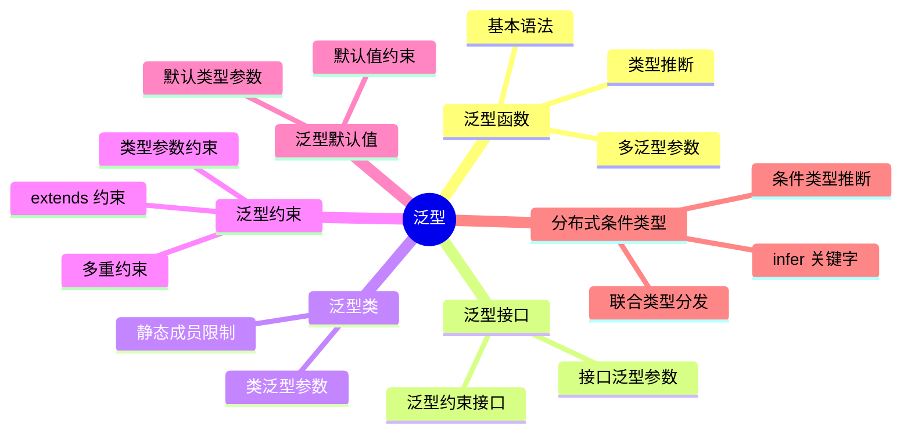

# 泛型

## 知识架构



## 核心概念

### 什么是泛型

泛型(Generics)是指在定义函数、接口或类的时候,不预先指定具体的类型,而是在使用的时候再指定类型的一种特性。泛型允许我们编写灵活、可重用的代码,同时保持类型安全。

```
┌─────────────────────────────────────────────────────────┐
│                    泛型的核心思想                         │
├─────────────────────────────────────────────────────────┤
│  定义时: 使用类型参数占位符 (如 <T>)                       │
│  使用时: 传入具体类型,实例化类型参数                       │
│  编译时: 类型检查器确保类型安全                           │
│  运行时: 类型擦除(编译后无泛型痕迹)                        │
└─────────────────────────────────────────────────────────┘
```

### 为什么需要泛型

考虑以下场景:

```typescript
// 方案1: 使用 any 类型 - 丢失类型安全
function identity1(arg: any): any {
  return arg
}

const result1 = identity1(123)
result1.toUpperCase() // 编译通过,运行时报错!

// 方案2: 使用具体类型 - 代码重复
function identityString(arg: string): string {
  return arg
}

function identityNumber(arg: number): number {
  return arg
}

// 方案3: 使用泛型 - 完美解决
function identity3<T>(arg: T): T {
  return arg
}

const result3 = identity3(123)
// result3.toUpperCase() // 编译错误: number 类型没有 toUpperCase 方法
console.log(result3.toFixed(2)) // 正确: TypeScript 知道返回值是 number
```

### 泛型的优势

| 特性 | 描述 | 示例 |
|-----|------|------|
| **类型安全** | 编译时捕获类型错误,避免运行时错误 | 传入 `number`,返回值也是 `number` |
| **代码复用** | 一套代码适用于多种类型 | 同一个函数处理 `string`、`number` 等 |
| **更好的智能提示** | IDE 能够提供准确的类型提示 | 自动补全特定类型的方法和属性 |
| **性能优化** | 避免类型断言和类型检查的开销 | 无需 `typeof` 检查 |

---

## 泛型函数

泛型函数是最常见的泛型应用场景。它允许在定义函数时声明一个或多个**类型参数**,这些参数可以在函数签名(参数和返回值)中使用。

### 基本使用

```typescript
function identity<T>(arg: T): T {
  return arg
}
```

**语法解析:**

- `<T>` - 类型参数声明,`T` 是类型变量(通常使用大写字母)
- `arg: T` - 参数类型使用类型变量
- `: T` - 返回值类型使用类型变量

**泛型参数命名约定:**

| 名称 | 含义 | 使用场景 |
|-----|------|---------|
| `T` | Type | 通用类型 |
| `U` | 第二个类型 | 多个类型参数时 |
| `K` | Key | 对象键类型 |
| `V` | Value | 对象值类型 |
| `E` | Element | 数组元素类型 |
| `R` | Return | 返回值类型 |
| `TData` | 数据类型 | 业务数据类型 |

**使用方式:**

```typescript
// 1. 显式指定类型
let output1 = identity<string>("hello world") // output1: string

// 2. 类型推断(推荐)
let output2 = identity("hello world") // output2: string
let output3 = identity(123) // output3: number
let output4 = identity({ name: "Alice" }) // output4: { name: string }
```

### 类型推断机制

TypeScript 会根据实际参数自动推断类型参数:

```typescript
function identity<T>(arg: T): T {
  return arg
}

// 推断流程图
// identity("hello") → 参数是 string → T = string → 返回值 string
// identity(123)      → 参数是 number → T = number → 返回值 number
// identity([1,2,3])  → 参数是 number[] → T = number[] → 返回值 number[]

// 示例: 复杂类型推断
interface IUser {
  id: number
  name: string
}

const user = identity({ id: 1, name: "Alice" })
// user 的类型被推断为 { id: number; name: string }

// 更推荐的方式: 使用接口定义
const typedUser = identity<IUser>({ id: 1, name: "Alice" })
// typedUser: IUser - 提供更好的可读性和约束
```

**何时需要显式指定类型:**

```typescript
// 场景1: 类型推断不够精确
function merge<T, U>(obj1: T, obj2: U): T & U {
  return { ...obj1, ...obj2 }
}

// 推断结果
const inferred = merge({ a: 1 }, { b: "hello" })
// 类型: { a: number } & { b: string }

// 显式指定更精确
const explicit = merge<{ a: number }, { b: string }>({ a: 1 }, { b: "hello" })

// 场景2: 参数无法推断返回类型
function getFirstElement<T>(arr: T[]): T | undefined {
  return arr[0]
}

// 必须显式指定
const element = getFirstElement<string>([]) // element: string | undefined
```

### 多泛型参数

函数可以拥有多个泛型参数,以处理更复杂的场景:

```typescript
// 示例1: 交换元组成员位置
function swap<T, U>([start, end]: [T, U]): [U, T] {
  return [end, start]
}

const swapped = swap(["hello", 123])
// swapped: [number, string] → [123, "hello"]

// 示例2: 合并两个对象
function mergeObjects<T extends object, U extends object>(obj1: T, obj2: U): T & U {
  return { ...obj1, ...obj2 }
}

const merged = mergeObjects({ name: "Alice" }, { age: 30 })
// merged: { name: string } & { age: number }

// 示例3: 创建键值对映射
function createPair<K extends string | number, V>(key: K, value: V): [K, V] {
  return [key, value]
}

const pair1 = createPair("id", 123) // ["id", 123]
const pair2 = createPair(1, "Alice") // [1, "Alice"]
```

---

## 泛型接口与类型别名

泛型不仅能用于函数,还能用于定义可复用的类型结构。

### 泛型接口

```typescript
// 基本语法
interface IGenericIdentityFn<T> {
  (arg: T): T
}

// 使用
function identity<T>(arg: T): T {
  return arg
}

const myIdentity: IGenericIdentityFn<number> = identity
```

**实战示例: API 响应结构**

```typescript
// 标准的 API 响应结构
interface IApiResponse<TData = unknown> {
  code: number
  message: string
  data: TData
  timestamp: number
}

// 用户数据类型
interface IUser {
  id: number
  name: string
  email: string
}

// 文章数据类型
interface IArticle {
  id: number
  title: string
  content: string
}

// 使用泛型接口
const userResponse: IApiResponse<IUser> = {
  code: 200,
  message: "Success",
  data: { id: 1, name: "Alice", email: "alice@example.com" },
  timestamp: Date.now()
}

const articlesResponse: IApiResponse<IArticle[]> = {
  code: 200,
  message: "Success",
  data: [
    { id: 1, title: "TypeScript 泛型", content: "..." },
    { id: 2, title: "TypeScript 高级类型", content: "..." }
  ],
  timestamp: Date.now()
}

// 使用默认类型
const errorResponse: IApiResponse = {
  code: 500,
  message: "Internal Server Error",
  data: null,
  timestamp: Date.now()
}
// data 类型为 unknown
```

**泛型接口与函数类型:**

```typescript
// 定义一个泛型函数接口
interface IObserver<T> {
  next: (value: T) => void
  error?: (err: any) => void
  complete?: () => void
}

// 定义一个可观察对象接口
interface IObservable<T> {
  subscribe(observer: IObserver<T>): void
  unsubscribe(observer: IObserver<T>): void
}

// 实现示例
class SimpleObservable<T> implements IObservable<T> {
  private observers: IObserver<T>[] = []

  subscribe(observer: IObserver<T>): void {
    this.observers.push(observer)
  }

  unsubscribe(observer: IObserver<T>): void {
    const index = this.observers.indexOf(observer)
    if (index > -1) {
      this.observers.splice(index, 1)
    }
  }

  notify(value: T): void {
    this.observers.forEach(observer => observer.next(value))
  }
}

// 使用
const numberObservable = new SimpleObservable<number>()
numberObservable.subscribe({
  next: (value) => console.log(`Received: ${value}`),
  error: (err) => console.error(`Error: ${err}`),
  complete: () => console.log("Complete")
})
```

### 泛型类型别名

类型别名同样支持泛型,常用于创建工具类型:

```typescript
// 示例1: Result 类型 (函数式编程风格)
type Result<T, E = Error> = 
  | { success: true; value: T }
  | { success: false; error: E }

function divide(a: number, b: number): Result<number, string> {
  if (b === 0) {
    return { success: false, error: "Cannot divide by zero" }
  }
  return { success: true, value: a / b }
}

const result1 = divide(10, 2) // { success: true, value: 5 }
const result2 = divide(10, 0) // { success: false, error: "Cannot divide by zero" }

// 类型守卫
function handleResult(result: Result<number>): number {
  if (result.success) {
    return result.value
  }
  throw new Error(result.error)
}

// 示例2: Nullable 类型
type Nullable<T> = T | null | undefined

function processValue(value: Nullable<string>): string {
  return value ?? "default"
}

// 示例3: 深度可选类型
type DeepPartial<T> = {
  [P in keyof T]?: T[P] extends object ? DeepPartial<T[P]> : T[P]
}

interface IConfig {
  database: {
    host: string
    port: number
    credentials: {
      username: string
      password: string
    }
  }
}

const config: DeepPartial<IConfig> = {
  database: {
    port: 3306
    // host 和 credentials 都是可选的
  }
}
```

---

## 泛型类

类也可以是泛型的。泛型类在类的定义中使用类型参数,允许类的属性和方法与特定的类型关联。

```typescript
// 示例: 通用队列数据结构
class Queue<T> {
  private data: T[] = []

  // 入队
  enqueue(item: T): void {
    this.data.push(item)
  }

  // 出队
  dequeue(): T | undefined {
    return this.data.shift()
  }

  // 查看队首元素
  peek(): T | undefined {
    return this.data[0]
  }

  // 获取队列长度
  get length(): number {
    return this.data.length
  }

  // 判断是否为空
  isEmpty(): boolean {
    return this.data.length === 0
  }
}

// 使用示例
const numberQueue = new Queue<number>()
numberQueue.enqueue(1)
numberQueue.enqueue(2)
numberQueue.enqueue(3)
// numberQueue.enqueue("3") // 错误: 类型"string"的参数不能赋给类型"number"的参数

console.log(numberQueue.dequeue()) // 1
console.log(numberQueue.peek()) // 2
console.log(numberQueue.length) // 2

// 字符串队列
const stringQueue = new Queue<string>()
stringQueue.enqueue("A")
stringQueue.enqueue("B")
console.log(stringQueue.dequeue()) // "A"
```

**更多泛型类示例:**

```typescript
// 示例1: 泛型栈
class Stack<T> {
  private items: T[] = []

  push(item: T): void {
    this.items.push(item)
  }

  pop(): T | undefined {
    return this.items.pop()
  }

  peek(): T | undefined {
    return this.items[this.items.length - 1]
  }
}

// 示例2: 泛型键值对存储
class KeyValueStore<K, V> {
  private store = new Map<K, V>()

  set(key: K, value: V): void {
    this.store.set(key, value)
  }

  get(key: K): V | undefined {
    return this.store.get(key)
  }

  has(key: K): boolean {
    return this.store.has(key)
  }

  delete(key: K): boolean {
    return this.store.delete(key)
  }

  getAll(): Map<K, V> {
    return new Map(this.store)
  }
}

// 使用
const userStore = new KeyValueStore<number, { name: string; email: string }>()
userStore.set(1, { name: "Alice", email: "alice@example.com" })
userStore.set(2, { name: "Bob", email: "bob@example.com" })

console.log(userStore.get(1)) // { name: "Alice", email: "alice@example.com" }

// 示例3: 泛型二叉树节点
class BinaryTreeNode<T> {
  constructor(
    public value: T,
    public left: BinaryTreeNode<T> | null = null,
    public right: BinaryTreeNode<T> | null = null
  ) {}
}

class BinarySearchTree<T> {
  constructor(private root: BinaryTreeNode<T> | null = null) {}

  insert(value: T): void {
    const newNode = new BinaryTreeNode(value)
    if (!this.root) {
      this.root = newNode
      return
    }
    // 插入逻辑...
  }

  // 其他方法...
}
```

**静态成员与泛型:**

```typescript
class GenericClass<T> {
  private value: T

  constructor(value: T) {
    this.value = value
  }

  // ✅ 实例方法可以使用 T
  getValue(): T {
    return this.value
  }

  // ❌ 静态成员不能使用类的类型参数 T
  // static defaultValue: T // 错误!
  
  // ✅ 静态方法可以有自己的泛型参数
  static create<U>(value: U): GenericClass<U> {
    return new GenericClass(value)
  }
}

// 正确使用
const instance = GenericClass.create<string>("hello")
console.log(instance.getValue()) // "hello"
```

---

## 高级泛型概念

### 泛型约束

#### 基本约束

有时希望泛型参数不是"任意类型",而是满足某些特定条件的类型:

```typescript
// ❌ 错误示例: T 不一定有 length 属性
function logLength<T>(arg: T): void {
  // console.log(arg.length) // 错误: 类型"T"上不存在属性"length"
}

// ✅ 正确: 使用 extends 添加约束
interface IWithLength {
  length: number
}

function logLength<T extends IWithLength>(arg: T): void {
  console.log(arg.length)
}

logLength("hello") // 5 (string 有 length 属性)
logLength([1, 2, 3]) // 3 (array 有 length 属性)
logLength({ length: 10, value: "hi" }) // 10 (自定义对象有 length 属性)
// logLength(123) // ❌ 错误: number 没有 length 属性
```

#### 在泛型约束中使用类型参数

可以在泛型约束中引用其他类型参数:

```typescript
// 示例: 获取对象属性的值
function getProperty<T, K extends keyof T>(obj: T, key: K): T[K] {
  return obj[key]
}

const user = {
  name: "Alice",
  age: 30,
  email: "alice@example.com"
}

const name = getProperty(user, "name") // name: string
const age = getProperty(user, "age") // age: number
// const invalid = getProperty(user, "gender") // ❌ 错误: "gender" 不是 user 的属性
```

**工作原理图:**

```
┌────────────────────────────────────────────────────────┐
│ getProperty<T, K extends keyof T>(obj: T, key: K)      │
├────────────────────────────────────────────────────────┤
│ T = { name: string; age: number; email: string }      │
│ keyof T = "name" | "age" | "email"                    │
│ K extends "name" | "age" | "email"                    │
│                                                        │
│ 当 K = "name" 时:                                     │
│   返回值类型 T[K] = T["name"] = string               │
│                                                        │
│ 当 K = "age" 时:                                      │
│   返回值类型 T[K] = T["age"] = number                │
└────────────────────────────────────────────────────────┘
```

#### 多重约束

泛型参数可以有多个约束:

```typescript
interface ILengthwise {
  length: number
}

interface IStringifiable {
  toString(): string
}

// T 必须同时满足两个约束
function logAndStringify<T extends ILengthwise & IStringifiable>(arg: T): void {
  console.log(`Length: ${arg.length}`)
  console.log(`String: ${arg.toString()}`)
}

// string 和 array 都满足约束
logAndStringify("hello") // Length: 5, String: hello
logAndStringify([1, 2, 3]) // Length: 3, String: 1,2,3

// 示例: 约束为对象并包含特定属性
function updateObject<T extends { id: number }>(obj: T, updates: Partial<T>): T {
  return { ...obj, ...updates }
}

const user1 = { id: 1, name: "Alice", age: 30 }
const user2 = updateObject(user1, { age: 31 })
console.log(user2) // { id: 1, name: "Alice", age: 31 }
```

#### 使用类类型约束

在工厂函数中,可以使用 `new` 约束:

```typescript
// 约束 T 必须有构造函数
type Constructor<T = any> = new (...args: any[]) => T

function createInstance<T>(ctor: Constructor<T>, ...args: any[]): T {
  return new ctor(...args)
}

class Person {
  constructor(public name: string, public age: number) {}
  
  greet() {
    console.log(`Hello, I'm ${this.name}`)
  }
}

const person = createInstance(Person, "Alice", 30)
person.greet() // Hello, I'm Alice

// 示例: 泛型工厂装饰器
function createWithLog<T extends Constructor>(ctor: T) {
  return class extends ctor {
    constructor(...args: any[]) {
      console.log(`Creating instance with args: ${args.join(", ")}`)
      super(...args)
    }
  }
}
```

### 泛型默认类型

可以为泛型参数提供**默认类型**。当用户没有显式指定类型,并且 TypeScript 无法推断时,将使用该默认类型:

```typescript
// 基本语法
interface IApiResponse<TData = unknown> {
  code: number
  message: string
  data: TData
}

// 未指定 TData,默认为 unknown
const res: IApiResponse = {
  code: 500,
  message: "Internal Error",
  data: "An error occurred" // data 是 unknown 类型
}

// 指定具体类型
const userRes: IApiResponse<{ id: number; name: string }> = {
  code: 200,
  message: "Success",
  data: { id: 1, name: "Alice" }
}
```

**多个默认类型:**

```typescript
interface IConfig<TEnv = "development", TLogLevel = "info"> {
  env: TEnv
  logLevel: TLogLevel
}

const config1: IConfig = {
  env: "development", // 类型推断为 "development"
  logLevel: "info" // 类型推断为 "info"
}

const config2: IConfig<"production", "error"> = {
  env: "production",
  logLevel: "error"
}
```

**默认类型的依赖关系:**

```typescript
// TElement 的默认类型依赖于 T
interface IList<T, TElement = T[number]> {
  items: T
  firstElement?: TElement
}

const numberList: IList<number[]> = {
  items: [1, 2, 3],
  firstElement: 1 // TElement 由默认类型 T[number] 计算为 number
}
```

### 泛型与映射类型

泛型与映射类型(Mapped Types)结合,可以创造出强大的类型转换工具:

```typescript
// Partial<T> 的实现 - 将所有属性变为可选
type Partial<T> = {
  [P in keyof T]?: T[P]
}

// Required<T> 的实现 - 将所有属性变为必需
type Required<T> = {
  [P in keyof T]-?: T[P]
}

// Readonly<T> 的实现 - 将所有属性变为只读
type Readonly<T> = {
  readonly [P in keyof T]: T[P]
}

// Mutable<T> 的实现 - 移除只读修饰符
type Mutable<T> = {
  -readonly [P in keyof T]: T[P]
}

// Pick<T, K> 的实现 - 选取部分属性
type Pick<T, K extends keyof T> = {
  [P in K]: T[P]
}

// Omit<T, K> 的实现 - 排除部分属性
type Omit<T, K extends keyof any> = Pick<T, Exclude<keyof T, K>>

// 使用示例
interface IUser {
  id: number
  name: string
  age: number
  email: string
}

// Partial - 部分更新
const partialUser: Partial<IUser> = {
  name: "Bob" // id, age, email 都是可选的
}

// Pick - 选择特定字段
const userPreview: Pick<IUser, "id" | "name"> = {
  id: 1,
  name: "Alice"
}

// Omit - 排除敏感字段
const publicUser: Omit<IUser, "email"> = {
  id: 1,
  name: "Alice",
  age: 30
}
```

**高级映射类型示例:**

```typescript
// 将所有属性类型包装成 Promise
type Promisify<T> = {
  [P in keyof T]: Promise<T[P]>
}

interface IUser {
  id: number
  name: string
}

const asyncUser: Promisify<IUser> = {
  id: Promise.resolve(1),
  name: Promise.resolve("Alice")
}

// 为所有方法添加异步版本
type AsyncMethods<T> = {
  [K in keyof T]: T[K] extends (...args: infer A) => infer R
    ? (...args: A) => Promise<R>
    : T[K]
}

interface IApi {
  getUser(id: number): IUser
  updateUser(user: IUser): void
}

const asyncApi: AsyncMethods<IApi> = {
  getUser: async (id) => ({ id: 1, name: "Alice" }),
  updateUser: async (user) => {}
}
```

### 泛型与条件类型

条件类型(Conditional Types)让泛型拥有了"逻辑判断"的能力,其语法类似于 JavaScript 的三元运算符: `T extends U ? X : Y`。

```typescript
// 基本语法
type IsString<T> = T extends string ? true : false

type A = IsString<"hello"> // true
type B = IsString<123> // false
type C = IsString<string> // true（string extends string 直接成立，单一类型不触发分发）
type D = IsString<string | number> // boolean（联合类型才触发分发，得到 true | false）
```

**常用条件类型工具:**

```typescript
// Exclude<T, U> - 从 T 中排除 U
type Exclude<T, U> = T extends U ? never : T

type Result1 = Exclude<"a" | "b" | "c", "a"> // "b" | "c"
type Result2 = Exclude<string | number | boolean, number> // string | boolean

// Extract<T, U> - 从 T 中提取 U
type Extract<T, U> = T extends U ? T : never

type Result3 = Extract<"a" | "b" | "c", "a" | "f"> // "a"
type Result4 = Extract<string | number | boolean, number> // number

// NonNullable<T> - 排除 null 和 undefined
type NonNullable<T> = T extends null | undefined ? never : T

type Result5 = NonNullable<string | null | undefined> // string

// ReturnType<T> - 获取函数返回值类型
type ReturnType<T extends (...args: any) => any> = T extends (...args: any) => infer R ? R : any

function getUser() {
  return { id: 1, name: "Alice" }
}

type User = ReturnType<typeof getUser> // { id: number; name: string }

// Parameters<T> - 获取函数参数类型
type Parameters<T extends (...args: any) => any> = T extends (...args: infer P) => any ? P : never

function createUser(name: string, age: number): IUser {
  return { id: 1, name, age, email: "" }
}

type CreateUserParams = Parameters<typeof createUser> // [string, number]
```

### 分布式条件类型

当条件类型作用于联合类型时,会自动分发到每个成员:

```typescript
// 分布式条件类型
type ToArray<T> = T extends any ? T[] : never

type Result = ToArray<string | number> // string[] | number[]

// 过程解析:
// ToArray<string | number> 
// → (string extends any ? string[] : never) | (number extends any ? number[] : never)
// → string[] | number[]
```

**实际应用:**

```typescript
// 获取对象类型的函数属性名
type FunctionPropertyNames<T> = {
  [K in keyof T]: T[K] extends Function ? K : never
}[keyof T]

type NonFunctionPropertyNames<T> = {
  [K in keyof T]: T[K] extends Function ? never : K
}[keyof T]

interface IMixin {
  name: string
  age: number
  greet(): void
  update(name: string): void
}

type FuncNames = FunctionPropertyNames<IMixin> // "greet" | "update"
type NonFuncNames = NonFunctionPropertyNames<IMixin> // "name" | "age"
```

---

## 内置工具类型解析

TypeScript 提供了许多内置的工具类型,它们都是基于泛型实现的:

### 属性修饰工具

```typescript
// Partial<T> - 所有属性可选
interface ITodo {
  title: string
  description: string
}

function updateTodo(todo: ITodo, updates: Partial<ITodo>): ITodo {
  return { ...todo, ...updates }
}

const todo: ITodo = {
  title: "Learn TypeScript",
  description: "Study generics"
}

const updated = updateTodo(todo, { description: "Master generics" })

// Required<T> - 所有属性必需
interface IProps {
  a?: number
  b?: string
}

const obj: Required<IProps> = {
  a: 5,
  b: "hello"
}

// Readonly<T> - 所有属性只读
const readonlyObj: Readonly<IProps> = {
  a: 5,
  b: "hello"
}
// readonlyObj.a = 10 // 错误: 只读属性
```

### 类型转换工具

```typescript
// Record<K, T> - 构造对象类型
type Record<K extends keyof any, T> = {
  [P in K]: T
}

const userMap: Record<string, IUser> = {
  "user1": { id: 1, name: "Alice", email: "alice@example.com" },
  "user2": { id: 2, name: "Bob", email: "bob@example.com" }
}

const roleMap: Record<"admin" | "user" | "guest", string[]> = {
  admin: ["read", "write", "delete"],
  user: ["read", "write"],
  guest: ["read"]
}

// Pick<T, K> - 选择属性
type UserPreview = Pick<IUser, "id" | "name">

// Omit<T, K> - 排除属性
type UserWithoutEmail = Omit<IUser, "email">
```

### 类型推断工具

```typescript
// ReturnType<T> - 函数返回值类型
async function fetchUser() {
  const response = await fetch("/api/user")
  return response.json() as Promise<IUser>
}

type FetchUserReturn = ReturnType<typeof fetchUser> // Promise<IUser>

// InstanceType<T> - 构造函数实例类型
class Person {
  constructor(public name: string) {}
}

type PersonInstance = InstanceType<typeof Person> // Person

// ThisParameterType<T> - 获取 this 参数类型
function format(this: { prefix: string }, message: string) {
  return this.prefix + message
}

type ThisType = ThisParameterType<typeof format> // { prefix: string }

// OmitThisParameter<T> - 移除 this 参数
type FormatWithoutThis = OmitThisParameter<typeof format>
// (message: string) => string
```

---

## 实战应用

### 示例1: 类型安全的 EventEmitter

```typescript
interface IEventMap {
  [key: string]: any[]
}

class TypedEventEmitter<TEvents extends IEventMap> {
  private listeners = new Map<keyof TEvents, Function[]>()

  on<K extends keyof TEvents>(event: K, listener: (...args: TEvents[K]) => void): void {
    const existing = this.listeners.get(event) || []
    this.listeners.set(event, [...existing, listener])
  }

  emit<K extends keyof TEvents>(event: K, ...args: TEvents[K]): void {
    const listeners = this.listeners.get(event) || []
    listeners.forEach(listener => listener(...args))
  }

  off<K extends keyof TEvents>(event: K, listener: (...args: TEvents[K]) => void): void {
    const existing = this.listeners.get(event) || []
    const index = existing.indexOf(listener)
    if (index > -1) {
      existing.splice(index, 1)
    }
  }
}

// 定义事件类型（注意：事件表用 type 定义，interface 声明的对象类型
// 不具备隐式索引签名，无法满足 TEvents extends IEventMap 约束）
type IUserEvents = {
  login: [userId: number, username: string]
  logout: [userId: number]
  update: [userId: number, changes: Partial<IUser>]
}

// 使用
const emitter = new TypedEventEmitter<IUserEvents>()

// ✅ 类型安全的事件监听
emitter.on("login", (userId, username) => {
  console.log(`User ${userId} (${username}) logged in`)
})

emitter.on("update", (userId, changes) => {
  console.log(`User ${userId} updated:`, changes)
})

// ✅ 类型安全的事件触发
emitter.emit("login", 1, "Alice")
emitter.emit("update", 1, { name: "Bob" })

// ❌ 错误示例
// emitter.emit("login", "invalid") // 错误: 参数类型不匹配
// emitter.emit("unknown", 1) // 错误: 事件不存在
```

### 示例2: 类型安全的 JSON 解析器

```typescript
function safeJsonParse<T>(json: string): Result<T> {
  try {
    const value = JSON.parse(json) as T
    return { success: true, value }
  } catch (error) {
    return { success: false, error: error as Error }
  }
}

// 使用
interface IConfig {
  apiEndpoint: string
  timeout: number
}

const jsonString = '{"apiEndpoint":"https://api.example.com","timeout":5000}'

const result = safeJsonParse<IConfig>(jsonString)
if (result.success) {
  console.log(result.value.apiEndpoint) // 类型安全!
} else {
  console.error("Parse failed:", result.error.message)
}
```

### 示例3: 类型安全的存储类

```typescript
class TypedStorage<T extends Record<string, any>> {
  constructor(private prefix: string = "") {}

  set<K extends keyof T>(key: K, value: T[K]): void {
    localStorage.setItem(this.prefix + String(key), JSON.stringify(value))
  }

  get<K extends keyof T>(key: K): T[K] | null {
    const item = localStorage.getItem(this.prefix + String(key))
    return item ? JSON.parse(item) : null
  }

  remove<K extends keyof T>(key: K): void {
    localStorage.removeItem(this.prefix + String(key))
  }

  clear(): void {
    Object.keys(localStorage)
      .filter(key => key.startsWith(this.prefix))
      .forEach(key => localStorage.removeItem(key))
  }
}

// 定义存储结构
interface IAppStorage {
  userToken: string
  userPreferences: {
    theme: "light" | "dark"
    language: string
  }
  lastVisit: string
}

const storage = new TypedStorage<IAppStorage>("app_")

// ✅ 类型安全
storage.set("userToken", "abc123")
storage.set("userPreferences", { theme: "dark", language: "en" })

// ❌ 错误示例
// storage.set("userToken", 123) // 错误: number 不能赋给 string
// storage.set("unknown", "value") // 错误: "unknown" 不是有效键
```

### 示例4: React Hooks 中的泛型

```typescript
import { useState, useCallback, useRef, useEffect } from "react"

// 类型安全的 API Hook
function useApi<T>(url: string) {
  const [data, setData] = useState<T | null>(null)
  const [loading, setLoading] = useState(false)
  const [error, setError] = useState<Error | null>(null)

  const execute = useCallback(async () => {
    setLoading(true)
    setError(null)
    try {
      const response = await fetch(url)
      if (!response.ok) throw new Error(`HTTP error! status: ${response.status}`)
      const json = await response.json()
      setData(json as T)
    } catch (e) {
      setError(e as Error)
    } finally {
      setLoading(false)
    }
  }, [url])

  return { data, loading, error, execute }
}

// 使用
interface IUser {
  id: number
  name: string
}

function UserProfile({ userId }: { userId: number }) {
  const { data: user, loading, error, execute } = useApi<IUser>(`/api/users/${userId}`)

  useEffect(() => {
    execute()
  }, [execute])

  if (loading) return <div>Loading...</div>
  if (error) return <div>Error: {error.message}</div>
  if (!user) return null

  return <div>{user.name}</div> // user 类型为 IUser
}

// 类型安全的表单 Hook
function useForm<T extends Record<string, any>>(initialValues: T) {
  const [values, setValues] = useState<T>(initialValues)

  const handleChange = useCallback(<K extends keyof T>(field: K, value: T[K]) => {
    setValues(prev => ({ ...prev, [field]: value }))
  }, [])

  const reset = useCallback(() => {
    setValues(initialValues)
  }, [initialValues])

  return { values, handleChange, reset, setValues }
}

// 使用
interface ILoginForm {
  email: string
  password: string
  rememberMe: boolean
}

function LoginForm() {
  const { values, handleChange, reset } = useForm<ILoginForm>({
    email: "",
    password: "",
    rememberMe: false
  })

  return (
    <form>
      <input
        type="email"
        value={values.email}
        onChange={e => handleChange("email", e.target.value)}
      />
      <input
        type="password"
        value={values.password}
        onChange={e => handleChange("password", e.target.value)}
      />
      <input
        type="checkbox"
        checked={values.rememberMe}
        onChange={e => handleChange("rememberMe", e.target.checked)}
      />
    </form>
  )
}
```

### 示例5: 数据库查询构建器

```typescript
interface ITableSchema {
  users: {
    id: number
    name: string
    email: string
    age: number
  }
  posts: {
    id: number
    title: string
    content: string
    userId: number
  }
}

class QueryBuilder<T extends keyof ITableSchema> {
  private table: T
  private conditions: string[] = []
  private selectedFields: (keyof ITableSchema[T])[] = []

  constructor(table: T) {
    this.table = table
  }

  select<K extends keyof ITableSchema[T]>(...fields: K[]): this {
    this.selectedFields = fields
    return this
  }

  where<K extends keyof ITableSchema[T]>(
    field: K,
    operator: string,
    value: ITableSchema[T][K]
  ): this {
    this.conditions.push(`${String(field)} ${operator} ${value}`)
    return this
  }

  build(): string {
    const fields = this.selectedFields.length > 0
      ? this.selectedFields.join(", ")
      : "*"
    
    let query = `SELECT ${fields} FROM ${this.table}`
    
    if (this.conditions.length > 0) {
      query += ` WHERE ${this.conditions.join(" AND ")}`
    }
    
    return query
  }
}

// 使用
const query = new QueryBuilder("users")
  .select("id", "name", "email")
  .where("age", ">", 18)
  .build()

console.log(query) // SELECT id, name, email FROM users WHERE age > 18
```

---

## 最佳实践

### 1. 使用有意义的命名

```typescript
// ❌ 不推荐: 单字母命名用于复杂场景
interface IApi<T, U, V> {
  execute(data: T): Promise<U>
  validate(data: V): boolean
}

// ✅ 推荐: 描述性命名
interface IApi<TRequest, TResponse, TValidationData> {
  execute(data: TRequest): Promise<TResponse>
  validate(data: TValidationData): boolean
}

// 常用命名约定
type UserResponse = IApiResponse<IUserData>     // TData → UserData
type ErrorHandler<TError = Error> = (error: TError) => void // TError
type Processor<TInput, TOutput> = (input: TInput) => TOutput // TInput, TOutput
```

### 2. 保持简洁

❌ 不推荐：过于复杂的泛型

```typescript
type DeepReadonly<T> = {
  readonly [P in keyof T]: T[P] extends Function
    ? T[P]
    : T[P] extends Array<infer U>
    ? ReadonlyArray<DeepReadonly<U>>
    : T[P] extends object
    ? DeepReadonly<T[P]>
    : T[P]
}
```

✅ 推荐：分解为更小的单元

```typescript
type ReadonlyObject<T> = { readonly [P in keyof T]: T[P] }
type DeepReadonly<T> = T extends Function
  ? T
  : T extends Array<infer U>
  ? ReadonlyArray<DeepReadonly<U>>
  : T extends object
  ? { readonly [P in keyof T]: DeepReadonly<T[P]> }
  : T
```

### 3. 优先使用类型推断

```typescript
// ❌ 不推荐: 总是显式指定
const result = identity<string>("hello")
const numbers = [1, 2, 3].map<number>((n) => n * 2)

// ✅ 推荐: 让 TypeScript 推断
const result = identity("hello") // 自动推断为 string
const numbers = [1, 2, 3].map((n) => n * 2) // 自动推断为 number[]

// 显式指定的场景
// 1. 类型推断不够精确
const element = getFirstElement<string>([]) // 需要明确元素类型

// 2. API 边界
const user = await fetchData<IUser>("/api/user") // 明确返回类型
```

### 4. 避免为了泛型而泛型

```typescript
// ❌ 不推荐: T 只在一个地方使用
function log<T>(arg: T): void {
  console.log(arg)
}

// ✅ 推荐: 使用具体类型
function log(arg: unknown): void {
  console.log(arg)
}

// ✅ 正确的泛型使用: T 在多个位置建立关联
function identity<T>(arg: T): T {
  return arg // 输入和输出类型关联
}

function getProperty<T, K extends keyof T>(obj: T, key: K): T[K] {
  return obj[key] // 多个类型参数建立关联
}
```

### 5. 为复杂泛型添加注释

```typescript
/**
 * 深度合并两个对象类型
 * @template T - 第一个对象类型
 * @template U - 第二个对象类型
 * @description 递归合并嵌套对象,U 的属性会覆盖 T 的同名属性
 */
type DeepMerge<T, U> = {
  [K in keyof T | keyof U]: K extends keyof U
    ? U[K] extends object
      ? K extends keyof T
        ? T[K] extends object
          ? DeepMerge<T[K], U[K]>
          : U[K]
        : U[K]
      : U[K]
    : K extends keyof T
    ? T[K]
    : never
}

// 使用示例
type Config = DeepMerge<
  { api: { url: string }; timeout: number },
  { api: { key: string }; retry: number }
>
// 结果: { api: { url: string; key: string }; timeout: number; retry: number }
```

### 6. 使用泛型约束保证类型安全

```typescript
// ❌ 不推荐: 没有约束
function getLength<T>(arg: T): number {
  // return arg.length // 错误: T 不一定有 length
  return 0
}

// ✅ 推荐: 使用约束
interface ILengthwise {
  length: number
}

function getLength<T extends ILengthwise>(arg: T): number {
  return arg.length // 类型安全
}

// ✅ 更推荐: 使用更精确的约束
function getLength<T extends string | any[] | { length: number }>(arg: T): number {
  return arg.length
}
```

---

## 常见问题解答

### Q1: 泛型与 any 有什么区别?

```typescript
// any: 丢弃类型检查
function identityAny(arg: any): any {
  return arg
}

const result1 = identityAny(123)
result1.toUpperCase() // 编译通过,运行时错误!

// 泛型: 保留类型信息
function identityGeneric<T>(arg: T): T {
  return arg
}

const result2 = identityGeneric(123)
// result2.toUpperCase() // 编译错误: number 没有 toUpperCase 方法
```

**关键区别:**

| 特性 | `any` | 泛型 |
|-----|-------|------|
| 类型安全 | ❌ 无 | ✅ 有 |
| 类型保留 | ❌ 丢失 | ✅ 保留 |
| 智能提示 | ❌ 无 | ✅ 有 |
| 适用场景 | 临时迁移/未知类型 | 可复用组件 |

### Q2: 什么时候使用泛型 vs 联合类型?

```typescript
// 联合类型: 有限的已知类型集合
function formatValue(value: string | number): string {
  return String(value)
}

// 泛型: 无限的可能类型,需要类型关联
function identity<T>(arg: T): T {
  return arg
}

// 判断标准:
// 1. 类型集合是否有限? → 联合类型
// 2. 需要保留输入输出的类型关联? → 泛型
// 3. 需要返回与输入相同的类型? → 泛型
```

### Q3: 泛型会影响运行时性能吗?

**答案: 不会。** TypeScript 的泛型是编译时特性,编译后的 JavaScript 代码中所有泛型类型信息都会被擦除。

```typescript
// TypeScript 代码
function identity<T>(arg: T): T {
  return arg
}

// 编译后的 JavaScript
function identity(arg) {
  return arg
}
```

### Q4: 如何在泛型中使用类型守卫?

```typescript
function processValue<T>(value: T): string {
  // ❌ 错误: value 的类型是 T，不能直接按 string 使用
  // value.toUpperCase()

  // ✅ 正确: 先用类型守卫收窄
  if (typeof value === "string") {
    return value.toUpperCase() // value 被收窄为 string
  }

  if (typeof value === "number") {
    return value.toFixed(2) // value 被收窄为 number
  }

  return String(value)
}

// 更推荐: 使用函数重载
function processValue(value: string): string
function processValue(value: number): string
function processValue(value: string | number): string {
  if (typeof value === "string") {
    return value.toUpperCase()
  }
  return value.toFixed(2)
}
```

### Q5: 泛型约束与继承有什么区别?

```typescript
// 泛型约束: 限制类型参数的范围
function getProperty<T, K extends keyof T>(obj: T, key: K): T[K] {
  return obj[key]
}

// 类继承: 建立类型关系
class Animal {
  name: string = ""
}

class Dog extends Animal {
  breed: string = ""
}

// 泛型约束 vs 类继承
interface IEntity {
  id: number
}

// 泛型约束: T 必须有 id 属性
function save<T extends IEntity>(entity: T): void {
  console.log(entity.id)
}

// 类继承: Dog 继承 Animal 的属性和方法
const dog = new Dog()
dog.name = "Buddy" // 来自 Animal
dog.breed = "Labrador" // 来自 Dog
```

### Q6: 如何调试复杂的泛型类型?

```typescript
// 技巧1: 使用类型别名简化
type Debug<T> = T // 在这里设置断点,查看 T 的实际类型

// 技巧2: 使用工具类型查看类型
type ShowType<T> = { [K in keyof T]: T[K] }

// 技巧3: 使用条件类型打印类型
type PrintType<T> = T extends infer U ? { type: U } : never

// 示例
interface IUser {
  id: number
  name: string
  email: string
}

type DebugUser = Debug<IUser> // 鼠标悬停查看类型
type ShowUser = ShowType<IUser> // 展开所有属性
type PrintUser = PrintType<IUser> // { type: IUser }
```

### Q7: 何时使用 `infer` 关键字?

`infer` 用于在条件类型中推断类型:

```typescript
// 获取函数返回值类型
type MyReturnType<T> = T extends (...args: any[]) => infer R ? R : any

// 获取函数参数类型
type MyParameters<T> = T extends (...args: infer P) => any ? P : never

// 获取 Promise 值类型
type UnwrapPromise<T> = T extends Promise<infer U> ? U : T

type Result1 = UnwrapPromise<Promise<string>> // string
type Result2 = UnwrapPromise<string> // string

// 获取数组元素类型
type ElementOf<T> = T extends Array<infer E> ? E : never

type Item = ElementOf<string[]> // string
```

---

## 总结

泛型是 TypeScript 类型系统中最强大的特性之一,它提供了:

✅ **类型安全** - 编译时捕获类型错误
✅ **代码复用** - 一套代码适用于多种类型
✅ **更好的开发体验** - 智能提示和自动补全
✅ **性能优势** - 避免运行时类型检查

**学习路径:**

```
基础 → 泛型函数 → 泛型接口 → 泛型类
  ↓
进阶 → 泛型约束 → 条件类型 → 映射类型
  ↓
高级 → 工具类型 → 类型体操 → 实战应用
```

**核心要点:**

1. 泛型参数 `<T>` 是类型占位符,使用时才确定具体类型
2. 优先使用类型推断,必要时才显式指定
3. 使用 `extends` 约束泛型参数的范围
4. 避免过度使用泛型,保持代码简洁
5. 为复杂泛型添加注释,提高可维护性
