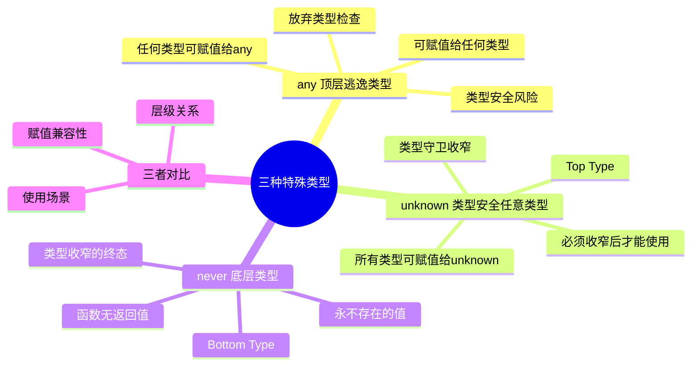

# any、unknown、never

## 知识架构



## 概述

在 TypeScript 的类型系统中，`any`、`unknown` 和 `never` 是三种特殊的顶层/底层类型，它们在类型安全和灵活性之间提供了不同的权衡：

- **`any`**：类型系统的"逃逸舱"，完全放弃类型检查
- **`unknown`**：类型安全的"任意类型"，强制进行类型检查后才能使用
- **`never`**：表示"永不存在的值"，常用于错误处理和类型检查

理解这三种类型对于编写类型安全的 TypeScript 代码至关重要。

## 类型系统层级

```
        unknown (顶层类型)
           ↑
           |  (所有类型都是 unknown 的子类型)
           |
      其他所有类型
      (string, number, object, etc.)
           |
           |  (never 是所有类型的子类型)
           ↓
        never (底层类型)
        
any ──→ 特殊位置：赋值上与所有类型双向兼容（但并非真正的顶层/底层类型）
```

**类型兼容性规则**：
- `never` 可以赋值给任何类型（包括 `never` 自身）
- 任何类型都可以赋值给 `unknown`
- `any` 可以赋值给任何类型，也可以被任何类型赋值（双向兼容）

---

## `any` 类型

### 基本特性

`any` 类型是 TypeScript 中的"特殊角色"。当把变量的类型指定为 `any` 时，实际上是在告诉 TypeScript 编译器："**不要对这个变量进行任何类型检查**"。

核心特性：
- **兼容所有类型**：`any` 类型的变量可以被赋值为任何类型的值
- **可赋值给所有类型**：`any` 类型的值可以赋值给任何其他类型的变量
- **无限制访问**：可以访问 `any` 类型变量的任意属性、调用任意方法，即使它们实际上并不存在
- **关闭类型推断**：`any` 类型会"传染"，导致后续的类型推断失效

示例 1：基本用法

```typescript
let flexible: any = "Hello, TypeScript!"

// 1. 可以赋值为任何类型
flexible = 42
flexible = true
flexible = { name: "any type" }
flexible = () => "I am a function"

// 2. 可以赋值给任何其他类型
let num: number = flexible // 运行时可能出错，但编译时通过
let str: string = flexible // 运行时可能出错，但编译时通过

// 3. 无限制访问
console.log(flexible.nonExistentProperty) // 编译时通过，运行时为 undefined
flexible.nonExistentMethod() // 编译时通过，运行时抛出 TypeError
```

示例 2：类型传染

```typescript
let data: any = { value: 42 }
let result = data.value // result 的类型被推断为 any

result.toFixed() // 编译通过，但运行时可能出错
result.toUpperCase() // 编译通过，但运行时肯定出错
```

### 隐式 any

当 TypeScript 无法推断变量的类型时，会隐式地将其类型设为 `any`。这通常发生在：
- 未提供类型注解的函数参数
- 未提供类型注解的变量声明
- 对象字面量的属性访问

示例 3：隐式 any 的情况

```typescript
// 隐式 any（启用 noImplicitAny 会报错）
function process(data) {
  // data 的类型隐式为 any
  return data.value
}

// 显式 any（不会触发 noImplicitAny）
function processSafe(data: any) {
  return data.value
}
```

### 应用场景

尽管 `any` 会削弱 TypeScript 的类型保护,但在某些特定场景下，它仍然非常有用：

#### 1. 迁移旧的 JavaScript 项目

在将大型 JavaScript 项目迁移到 TypeScript 时，可以先将复杂的、难以确定类型的变量标记为 `any`，以确保项目能够快速编译通过，然后再逐步替换为更具体的类型。

```typescript
// 迁移阶段 1：先用 any 让代码编译通过
function legacyProcess(data: any) {
  return data.map(item => item.value)
}

// 迁移阶段 2：逐步替换为具体类型
interface DataItem {
  value: number
}

function improvedProcess(data: DataItem[]) {
  return data.map(item => item.value)
}
```

#### 2. 与第三方库交互

当使用的第三方库没有提供 TypeScript 类型定义时，可能需要使用 `any` 来处理来自这些库的数据。

```typescript
// types/some-untyped-library.d.ts
// 在独立的声明文件中为无类型的第三方库补充类型
declare module 'some-untyped-library' {
  export function process(data: any): any
}
```

```typescript
// 使用
import { process } from 'some-untyped-library'

const result = process({ value: 42 }) // result 的类型为 any
```

#### 3. 动态内容与 JSON 解析

处理来自用户输入或 API 响应等动态内容时，如果数据结构不固定，`any` 可以作为一个临时的解决方案。

```typescript
async function fetchData(url: string): Promise<any> {
  const response = await fetch(url)
  const data = await response.json()
  return data
}

async function processData() {
  const data = await fetchData("https://api.example.com/data")

  // 假设知道 data 中有 `user.name`，但编译器不知道
  console.log(data.user.name.toUpperCase()) // 编译时通过
}
```

#### 4. 类型断言的简化

在某些复杂的类型转换场景中，使用 `any` 作为中间类型可以简化代码。

```typescript
// 复杂的类型转换
type Original = { a: string; b: number }
type Target = { a: number; b: string }

function convert(obj: Original): Target {
  // 临时使用 any 简化转换
  return {
    a: parseInt(obj.a),
    b: obj.b.toString()
  } as any as Target
}
```

### 常见陷阱与错误

#### 陷阱 1：过度使用 any

```typescript
// ❌ 错误：过度使用 any
function getUser(id: any): any {
  return fetch(`/api/user/${id}`).then(r => r.json())
}

// ✅ 正确：使用具体类型
function getUser(id: number): Promise<User> {
  return fetch(`/api/user/${id}`).then(r => r.json())
}
```

#### 陷阱 2：any 的传染性

```typescript
// ❌ any 会传染
let data: any = { value: "hello" }
let result = data.value // result 也是 any 类型
let final = result.toUpperCase() // final 还是 any 类型
```

```typescript
// ✅ 使用 unknown 避免传染
let safeData: unknown = { value: "hello" }
if (typeof safeData === 'object' && safeData !== null && 'value' in safeData) {
  let result = (safeData as { value: string }).value // result 是 string 类型
}
```

#### 陷阱 3：忘记类型检查

```typescript
// ❌ 运行时错误
function process(data: any) {
  return data.name.toUpperCase() // 如果 data.name 不是字符串，运行时崩溃
}

// ✅ 添加类型检查
function process(data: unknown) {
  if (typeof data === 'object' && data !== null && 'name' in data) {
    const name = (data as { name: unknown }).name
    if (typeof name === 'string') {
      return name.toUpperCase()
    }
  }
  throw new Error('Invalid data')
}
```

### 风险与最佳实践

滥用 `any` 会导致代码失去 TypeScript 带来的类型安全优势，这种情况通常被称为"**AnyScript**"。

**最佳实践**：

1. **启用 `noImplicitAny`**：在 `tsconfig.json` 中启用该选项，强制为所有未明确指定类型的变量提供类型注解

```json
{
  "compilerOptions": {
    "noImplicitAny": true
  }
}
```

2. **优先使用 `unknown`**：如果只是想表示一个"未知"类型，`unknown` 是一个更安全的选择

3. **添加注释说明**：当必须使用 `any` 时，添加注释说明原因

```typescript
// 使用 any 的原因：第三方库缺少类型定义，且自定义类型定义成本过高
// TODO: 等待官方类型定义或贡献类型定义文件
function processThirdParty(data: any) {
  // ...
}
```

4. **缩小 any 的作用域**：尽量在最小范围内使用 `any`

```typescript
// ❌ 整个函数都使用 any
function process(data: any) {
  const value = data.value
  return value.toString()
}

// ✅ 只在必要时使用 any
function process(data: unknown) {
  const value = (data as any).value as string // 只在这一行使用 any
  return value.toString()
}
```

---

## `unknown` 类型

### 基本特性

`unknown` 类型是 TypeScript 3.0 引入的，旨在提供比 `any` 更安全的"任意类型"。与 `any` 类似，`unknown` 也可以表示任何类型的值。但关键区别在于，**TypeScript 不允许对 `unknown` 类型的值执行任何操作，除非先进行类型检查或类型断言**。

核心特性：
- **兼容所有类型**：任何类型的值都可以赋值给 `unknown` 类型的变量
- **只能赋值给 `unknown` 和 `any`**：`unknown` 类型的值不能直接赋值给其他类型的变量（除了 `unknown` 和 `any`）
- **操作受限**：不能对 `unknown` 类型的变量执行任何操作（如属性访问、函数调用）
- **类型安全**：强制进行类型检查后才能使用，避免运行时错误

示例 1：与 `any` 的对比

```typescript
let valAny: any
let valUnknown: unknown

let str1: string = valAny // ✅ OK
let str2: string = valUnknown // ❌ Error: Type 'unknown' is not assignable to type 'string'.

valAny.method() // ✅ OK
valUnknown.method() // ❌ Error: Object is of type 'unknown'.
```

示例 2：类型赋值规则

```typescript
let unknownValue: unknown

// ✅ 任何类型都可以赋值给 unknown
unknownValue = "string"
unknownValue = 42
unknownValue = { name: "John" }

// ❌ unknown 只能赋值给 unknown 或 any
let str: string = unknownValue // Error
let num: number = unknownValue // Error
let any: any = unknownValue // OK
let unk: unknown = unknownValue // OK
```

### 类型缩小技术

要使用 `unknown` 类型的值，必须先"缩小"它的类型范围。以下是几种常用的类型缩小技术：

#### 1. typeof 类型守卫

```typescript
function processValue(value: unknown) {
  if (typeof value === "string") {
    // 在这个代码块中，TypeScript 知道 value 是 string 类型
    console.log(value.toUpperCase())
  } else if (typeof value === "number") {
    // 在这里，value 是 number 类型
    console.log(value.toFixed(2))
  } else if (typeof value === "boolean") {
    console.log(value ? "yes" : "no")
  }
}

processValue("hello") // 输出: HELLO
processValue(123.456) // 输出: 123.46
```

#### 2. instanceof 类型守卫

```typescript
function processElement(value: unknown) {
  if (value instanceof HTMLElement) {
    // 在这里，value 是 HTMLElement 类型
    console.log(value.tagName)
    value.addEventListener('click', () => {})
  } else if (value instanceof Date) {
    console.log(value.toISOString())
  }
}
```

#### 3. 自定义类型守卫

```typescript
interface User {
  name: string
  email: string
  age: number
}

// 自定义类型守卫函数
function isUser(obj: unknown): obj is User {
  return (
    typeof obj === "object" &&
    obj !== null &&
    "name" in obj &&
    "email" in obj &&
    "age" in obj &&
    typeof (obj as User).name === "string" &&
    typeof (obj as User).email === "string" &&
    typeof (obj as User).age === "number"
  )
}

function processUser(data: unknown) {
  if (isUser(data)) {
    // 在这里，data 的类型被收窄为 User
    console.log(`User: ${data.name} (${data.email})`)
  } else {
    console.error("Invalid user data")
  }
}
```

#### 4. 类型断言

```typescript
function processValue(value: unknown) {
  // 使用类型断言（不推荐，除非确定类型）
  const str = value as string
  console.log(str.toUpperCase())
}

// 更安全的方式：先用类型守卫收窄，再使用
function safeAssertion(value: unknown) {
  if (typeof value === "string") {
    const str = value as string
    console.log(str.toUpperCase())
  }
}
```

#### 5. in 操作符检查

```typescript
interface Car {
  drive(): void
}

interface Boat {
  sail(): void
}

function process(vehicle: unknown) {
  if (typeof vehicle === "object" && vehicle !== null) {
    if ("drive" in vehicle) {
      (vehicle as Car).drive()
    } else if ("sail" in vehicle) {
      (vehicle as Boat).sail()
    }
  }
}
```

### 应用场景

#### 1. 处理 API 响应

```typescript
interface ApiResponse {
  id: number
  name: string
  email: string
}

function isApiResponse(data: unknown): data is ApiResponse {
  return (
    typeof data === "object" &&
    data !== null &&
    "id" in data &&
    "name" in data &&
    "email" in data
  )
}

async function fetchUser(id: number): Promise<ApiResponse> {
  const response = await fetch(`/api/users/${id}`)
  const data: unknown = await response.json()
  
  if (isApiResponse(data)) {
    return data
  }
  
  throw new Error("Invalid API response format")
}

// 使用
async function main() {
  try {
    const user = await fetchUser(1)
    console.log(`User: ${user.name}`) // 类型安全
  } catch (error) {
    console.error("Failed to fetch user:", error)
  }
}
```

#### 2. 类型安全的 JSON 解析

```typescript
function safeJsonParse(json: string): unknown {
  try {
    return JSON.parse(json)
  } catch (error) {
    throw new Error("Invalid JSON string")
  }
}

// 使用
const data = safeJsonParse('{"name": "John", "age": 30}')

if (typeof data === "object" && data !== null && "name" in data) {
  console.log((data as { name: string }).name)
}
```

#### 3. 函数参数验证

```typescript
function validateConfig(config: unknown) {
  if (typeof config !== "object" || config === null) {
    throw new Error("Config must be an object")
  }
  
  const cfg = config as Record<string, unknown>
  
  if (typeof cfg.apiUrl !== "string") {
    throw new Error("apiUrl must be a string")
  }
  
  if (typeof cfg.timeout !== "number") {
    throw new Error("timeout must be a number")
  }
  
  return {
    apiUrl: cfg.apiUrl,
    timeout: cfg.timeout
  }
}
```

#### 4. 与泛型结合使用

```typescript
function identity<T>(arg: T): T {
  return arg
}

// 当不知道具体类型时，可以使用 unknown
function safeIdentity(arg: unknown): unknown {
  return arg
}

// 更灵活的泛型约束
function process<T extends unknown>(value: T): T {
  if (typeof value === "string") {
    console.log("String value:", value)
  } else if (typeof value === "number") {
    console.log("Number value:", value)
  }
  return value
}
```

### 性能考虑

`unknown` 类型在编译时提供类型安全，但在运行时没有额外的性能开销。所有的类型检查代码都会被编译到最终的 JavaScript 代码中。

```typescript
// TypeScript 代码
function process(value: unknown) {
  if (typeof value === "string") {
    return value.toUpperCase()
  }
}

// 编译后的 JavaScript（无类型信息）
function process(value) {
  if (typeof value === "string") {
    return value.toUpperCase();
  }
}
```

---

## `never` 类型

### 基本特性

`never` 类型表示那些**永不出现**的值的类型。它是 TypeScript 类型系统的**底层类型**（bottom type），具有以下特性：

- **永不存在的值**：表示永远不会发生的值或永远不会返回的函数
- **所有类型的子类型**：`never` 可以赋值给任何类型
- **无父类型**：没有任何类型可以赋值给 `never`（除了 `never` 自身）
- **联合类型中的吸收者**：`T | never` 结果为 `T`
- **交叉类型中的不变者**：`T & never` 结果为 `never`

示例 1：never 的类型特性

```typescript
// ✅ never 可以赋值给任何类型
let neverValue: never
let str: string = neverValue
let num: number = neverValue
let obj: object = neverValue

// ❌ 任何类型都不能赋值给 never（除了 never）
let neverVar: never
neverVar = "string" // Error
neverVar = 123 // Error
neverVar = {} // Error
```

示例 2：联合类型中的吸收

```typescript
type A = string | never // 结果为 string
type B = number | never // 结果为 number
type C = string | number | never // 结果为 string | number
```

### 应用场景

#### 1. 抛出错误的函数

函数总是抛出错误，永远不会正常返回时，返回值类型应为 `never`。

```typescript
function throwError(message: string): never {
  throw new Error(message)
}

function fail(message: string): never {
  throw new Error(message)
}

// 使用
function process(value: string | null) {
  if (value === null) {
    return fail("Value cannot be null") // 返回类型为 never
  }
  
  // 这里 TypeScript 知道 value 不为 null
  console.log(value.toUpperCase())
}
```

#### 2. 无限循环的函数

函数包含无限循环，永远不会返回时，返回值类型应为 `never`。

```typescript
function infiniteLoop(): never {
  while (true) {
    // 永不退出
  }
}

function monitor(): never {
  while (true) {
    // 持续监控逻辑
    checkSystem()
    sleep(1000)
  }
}
```

#### 3. 穷尽检查（Exhaustive Checking）

这是 `never` 类型最实用的场景之一，用于确保所有联合类型的分支都被处理。

```typescript
type Shape = "circle" | "square" | "triangle"

function getArea(shape: Shape): number {
  switch (shape) {
    case "circle":
      return Math.PI * 5 ** 2
    case "square":
      return 10 ** 2
    case "triangle":
      return (10 * 10) / 2
    default:
      // 如果忘记处理某个形状，这里会报错
      const _exhaustiveCheck: never = shape
      return _exhaustiveCheck
  }
}
```

改进版本：使用辅助函数

```typescript
function assertNever(value: never): never {
  throw new Error(`Unexpected value: ${value}`)
}

type Shape = "circle" | "square" | "triangle"

function getArea(shape: Shape): number {
  switch (shape) {
    case "circle":
      return Math.PI * 5 ** 2
    case "square":
      return 10 ** 2
    case "triangle":
      return (10 * 10) / 2
    default:
      return assertNever(shape)
  }
}

// 如果在 Shape 中添加新类型但未处理，编译时就会报错
// type Shape = "circle" | "square" | "triangle" | "rectangle"
// ❌ Error: Type '"rectangle"' is not assignable to type 'never'.
```

#### 4. 条件类型中的应用

`never` 在条件类型中常用于过滤类型。

```typescript
// 过滤掉类型中的 null 和 undefined
type NonNullable<T> = T extends null | undefined ? never : T

type A = NonNullable<string | null | undefined> // string
type B = NonNullable<number | null> // number

// 提取函数返回类型
type ReturnType<T> = T extends (...args: any) => infer R ? R : never

type R1 = ReturnType<() => string> // string
type R2 = ReturnType<() => number> // number
type R3 = ReturnType<string> // never（string 不是函数类型）
```

#### 5. 映射类型中的过滤

```typescript
// 只保留函数类型的属性
type FunctionPropertyNames<T> = {
  [K in keyof T]: T[K] extends Function ? K : never
}[keyof T]

type FunctionProperties<T> = Pick<T, FunctionPropertyNames<T>>

interface User {
  name: string
  age: number
  greet(): void
  update(): void
}

type UserFunctions = FunctionProperties<User>
// { greet: () => void; update: () => void }
```

#### 6. 不可能的交叉类型

当两个类型不可能同时存在时，它们的交叉类型为 `never`。

```typescript
type StringAndNumber = string & number // never

interface A {
  type: "A"
  value: string
}

interface B {
  type: "B"
  value: number
}

type AB = A & B // never（type 字段不可能同时为 "A" 和 "B"）
```

### never 与其他类型的对比

```typescript
// void: 函数没有返回值
function log(message: string): void {
  console.log(message)
  // 可以正常返回
}

// never: 函数永远不会返回
function error(message: string): never {
  throw new Error(message)
  // 无法到达这里
}
```

---

## 类型对比与选择指南

### 完整对比表

| 特性               | `any`                                    | `unknown`                           | `never`                        |
| :----------------- | :-------------------------------------- | :---------------------------------- | :----------------------------- |
| **类型层级**       | 既不是顶层也不是底层                     | 顶层类型                            | 底层类型                       |
| **赋值兼容性**     | 双向兼容（可赋值给任何类型，也可被任何类型赋值） | 只能被赋值（可被任何类型赋值）      | 只能赋值（可赋值给任何类型）    |
| **操作限制**       | 无限制                                   | 必须类型检查后才能操作              | 无法操作（没有实际值）          |
| **类型安全性**     | 无                                       | 高                                  | 高                             |
| **适用场景**       | 快速迁移、兼容旧库、临时绕过类型检查     | 不确定的动态数据、API 响应          | 错误处理、穷尽检查、条件类型    |
| **推荐程度**       | ⚠️ 尽量避免                              | ✅ 推荐                              | ✅ 推荐                         |

### 类型兼容性示意图

```
赋值方向 → (箭头表示可以赋值给)

unknown → any
unknown → unknown
（反过来，任何类型都可以赋值给 unknown：string → unknown、number → unknown、never → unknown）

any → string
any → number
any → unknown
any → never
any → any

never → string
never → number
never → unknown
never → any
never → never

string ↛ unknown (不能赋值)
string ↛ any (不能赋值)
string ↛ never (不能赋值)
```

### 选择决策树

```
需要表示一个值
    |
    ├─ 知道具体类型？
    |   └─ 是 → 使用具体类型 (string, number, interface 等)
    |
    └─ 不知道具体类型
        |
        ├─ 需要类型安全？
        |   |
        |   ├─ 是 → 使用 unknown
        |   |   └─ 使用前必须进行类型检查
        |   |
        |   └─ 否 → 使用 any
        |       └─ 仅用于快速迁移或临时绕过类型检查
        |
需要表示"永不存在的值"
    |
    ├─ 函数抛出错误 → 返回类型为 never
    ├─ 函数无限循环 → 返回类型为 never
    ├─ 条件类型过滤 → 使用 never 作为过滤结果
    └─ 穷尽检查 → 使用 never 确保覆盖所有分支
```

---

## TypeScript 配置选项

### 相关编译选项

在 `tsconfig.json` 中，有几个与 `any` 相关的重要配置选项：

```json
{
  "compilerOptions": {
    // 禁止隐式 any（强烈推荐）
    "noImplicitAny": true,
    
    // 禁止 this 隐式为 any
    "noImplicitThis": true,
    
    // 严格模式（包含 noImplicitAny）
    "strict": true,
    
    // 关闭索引访问的 undefined 检查（默认值；开启后 obj[key] 的类型为 T | undefined）
    "noUncheckedIndexedAccess": false
  }
}
```

### noImplicitAny 的作用

```typescript
// noImplicitAny: false（默认）
function process(data) {
  // data 的类型隐式为 any，不报错
  return data.value
}

// noImplicitAny: true
function process(data) {
  // ❌ Error: Parameter 'data' implicitly has an 'any' type.
  return data.value
}

// 修复：提供显式类型
function process(data: { value: string }) {
  return data.value
}
```

---

## 常见问题与陷阱

### 问题 1：何时使用 any vs unknown？

**答案**：优先使用 `unknown`，只在以下情况使用 `any`：
- 快速迁移 JavaScript 项目（临时使用）
- 第三方库缺少类型定义且无法创建类型文件
- 确实需要绕过类型检查的特殊场景

```typescript
// ❌ 不推荐
function fetchData(): any {
  return fetch('/api/data').then(r => r.json())
}

// ✅ 推荐
function fetchData(): Promise<unknown> {
  return fetch('/api/data').then(r => r.json())
}

// 然后在使用时进行类型检查
const data = await fetchData()
if (isValidData(data)) {
  // 安全使用
}
```

### 问题 2：never 类型有什么实际用途？

**答案**：`never` 的主要用途：
1. **类型系统标记**：表示不可能发生的情况
2. **穷尽检查**：确保所有分支都被处理
3. **条件类型过滤**：在类型运算中过滤类型

```typescript
// 实际案例：Redux Action 的穷尽检查
type Action = 
  | { type: 'INCREMENT' }
  | { type: 'DECREMENT' }
  | { type: 'RESET' }

function reducer(state: number, action: Action): number {
  switch (action.type) {
    case 'INCREMENT':
      return state + 1
    case 'DECREMENT':
      return state - 1
    case 'RESET':
      return 0
    default:
      // 如果忘记处理某个 action，这里会报错
      const _exhaustiveCheck: never = action
      return _exhaustiveCheck
  }
}
```

### 问题 3：如何安全地处理 unknown 类型的值？

**答案**：使用类型守卫或自定义类型检查函数：

```typescript
// 方法 1：使用类型守卫
function process(value: unknown) {
  if (typeof value === 'string') {
    return value.toUpperCase()
  }
  if (typeof value === 'number') {
    return value.toFixed(2)
  }
  throw new Error('Invalid type')
}

// 方法 2：使用自定义类型守卫
function isStringArray(value: unknown): value is string[] {
  return Array.isArray(value) && value.every(item => typeof item === 'string')
}

function process(value: unknown) {
  if (isStringArray(value)) {
    return value.join(', ')
  }
  throw new Error('Expected string array')
}
```

### 问题 4：any 会导致运行时错误吗？

**答案**：`any` 本身不会导致运行时错误，但它会让你失去编译时的类型检查保护，可能导致运行时错误。

```typescript
// 编译通过，但运行时会崩溃
let value: any = "hello"
let num: number = value
console.log(num.toFixed(2)) // TypeError: num.toFixed is not a function

// 使用 unknown 避免这种情况
let value2: unknown = "hello"
// let num: number = value2 // 编译错误，阻止潜在问题
```

### 问题 5：如何在 any 和 unknown 之间转换？

```typescript
// unknown → any (隐式转换)
let unknownValue: unknown = "hello"
let anyValue: any = unknownValue // OK

// any → unknown (隐式转换)
let anotherAny: any = "hello"
let anotherUnknown: unknown = anotherAny // OK

// 推荐：在 API 边界使用 unknown，内部使用具体类型
function parseJson(json: string): unknown {
  return JSON.parse(json)
}

// 然后在使用时进行类型检查
const data = parseJson('{"name":"John"}')
if (typeof data === 'object' && data !== null && 'name' in data) {
  console.log((data as { name: string }).name)
}
```

### 问题 6：never 可以用于变量的类型吗？

**答案**：可以，但这种情况很少见，通常表示逻辑错误或不可能的状态。

```typescript
// 永远无法到达的代码
function impossible(): never {
  throw new Error("Never returns")
}

let value: never = impossible() // value 类型为 never

// 条件类型中的 never
type Result = string extends number ? string : never
// Result 的类型为 never

// 实际应用：表示不可能的状态
type InvalidState = never // 永远不应该使用的状态
```

---

## 最佳实践总结

### 1. 类型使用原则

```typescript
// ✅ 按优先级使用类型
// 1. 具体类型（最佳）
function process(data: { name: string; age: number }) {
  return data.name
}

// 2. unknown（次选）
function process(data: unknown) {
  if (typeof data === 'object' && data !== null && 'name' in data) {
    return (data as { name: string }).name
  }
}

// 3. any（最后选择）
function process(data: any) {
  return data.name
}
```

### 2. API 边界使用 unknown

```typescript
// ✅ 推荐：在 API 边界使用 unknown
async function fetchUser(id: number): Promise<unknown> {
  const response = await fetch(`/api/users/${id}`)
  return response.json()
}

// 使用类型守卫验证
function isUser(data: unknown): data is User {
  return typeof data === 'object' 
    && data !== null 
    && 'name' in data 
    && 'email' in data
}

const userData = await fetchUser(1)
if (isUser(userData)) {
  console.log(userData.name) // 类型安全
}
```

### 3. 使用 never 进行穷尽检查

```typescript
// ✅ 推荐：使用 never 确保所有分支都被处理
function assertNever(value: never): never {
  throw new Error(`Unexpected value: ${value}`)
}

type Status = 'pending' | 'approved' | 'rejected'

function getStatusMessage(status: Status): string {
  switch (status) {
    case 'pending':
      return 'Waiting for approval'
    case 'approved':
      return 'Approved'
    case 'rejected':
      return 'Rejected'
    default:
      return assertNever(status)
  }
}
```

### 4. 避免类型断言

```typescript
// ❌ 不推荐：过度使用类型断言
const value = data as any as string

// ✅ 推荐：使用类型检查
if (typeof data === 'string') {
  const value = data
}
```

### 5. 启用严格模式

```json
// tsconfig.json
{
  "compilerOptions": {
    "strict": true,
    "noImplicitAny": true,
    "strictNullChecks": true
  }
}
```

---

## 参考资源

- [TypeScript 官方文档 - any 类型](https://www.typescriptlang.org/docs/handbook/2/everyday-types.html#any)
- [TypeScript 官方文档 - unknown 类型](https://www.typescriptlang.org/docs/handbook/2/functions.html#unknown)
- [TypeScript 官方文档 - never 类型](https://www.typescriptlang.org/docs/handbook/2/narrowing.html#exhaustiveness-checking)
- [TypeScript Deep Dive - any vs unknown](https://basarat.gitbook.io/typescript/type-system/any)
