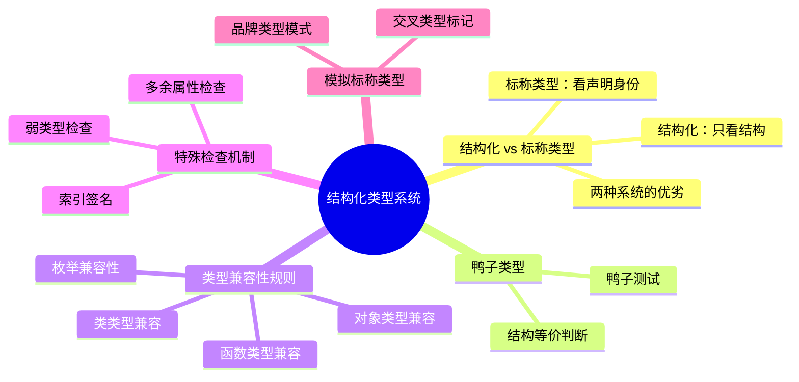

# 结构化类型系统

## 知识架构



在 TypeScript 的世界里，你是否曾对下面这种"看似不合理，却能顺利通过编译"的代码感到困惑？

```typescript
class Cat {
  eat() {}
}

class Dog {
  eat() {}
}

function feedCat(cat: Cat) {}

// 竟然不报错！
feedCat(new Dog())
```

`feedCat` 函数明明期望接收一个 `Cat` 类型的参数，为何传入 `Dog` 类型的实例也能被接受？这背后正是 TypeScript 类型系统的核心特性之一——**结构化类型系统（Structural Type System）**。

理解结构化类型系统，是掌握 TypeScript 精髓的关键一步。它不仅能帮助你从根本上理解类型兼容性的判断逻辑，还能让你在日常开发中游刃有余地解决各类类型报错问题。

本文将带你深入探索结构化类型系统的幕后工作原理，具体包括：

- **核心概念**：剖析结构化类型系统的基本思想与"鸭子类型"的渊源。
- **兼容性规则**：详解 TypeScript 如何判断不同类型之间的兼容性，包括对象、函数、类等多种类型。
- **特殊检查机制**：了解多余属性检查、索引签名等高级特性。
- **对比标称类型系统**：了解另一种主流的类型系统，并学习如何在 TypeScript 中模拟更严格的类型检查。
- **实践应用**：通过丰富的代码示例，展示结构化类型系统的应用场景、潜在陷阱与最佳实践。

学完本章，你将对 TypeScript 的类型检查机制有更深刻的理解，并能更自信地驾驭这门语言。

> 本节代码见：[Structural Type System](https://github.com/linbudu599/TypeScript-Tiny-Book/tree/main/packages/07-structural-type-system)

## 一、结构化类型系统：只看结构，不问出处

### 1.1 核心思想

结构化类型系统的核心思想可以用一句广为流传的"鸭子测试"（Duck Typing）来概括：

> "如果它走起路来像鸭子，叫起来也像鸭子，那么它就是一只鸭子。"

换言之，TypeScript 在判断类型是否兼容时，**不关心类型的"名义"身份**（叫 `Cat` 还是 `Dog`），**只关心其内部的"结构"**——即它所拥有的属性和方法。只要目标类型（鸭子）要求的结构（走路、叫）在源类型（某只鸟）中都存在，TypeScript 就认为它们是兼容的。

### 1.2 为什么采用结构化类型系统？

JavaScript 是一门动态语言，本身没有类型的概念。TypeScript 作为 JavaScript 的超集，选择结构化类型系统有以下几个原因：

1. **更贴近 JavaScript 的本质**：JavaScript 中的鸭子类型本身就是基于结构的
2. **提供更好的灵活性**：允许使用结构兼容的对象，即使它们的来源不同
3. **降低迁移成本**：便于将 JavaScript 代码逐步迁移到 TypeScript

### 1.3 基本示例

让我们回到开头的例子：

```typescript
class Cat {
  eat() {}
}

class Dog {
  eat() {}
}

function feedCat(cat: Cat) {}

// OK
feedCat(new Dog())
```

因为 `Dog` 的实例拥有 `Cat` 类型所要求的所有成员（一个 `eat` 方法），所以 TypeScript 认为 `new Dog()` 兼容 `Cat` 类型。

## 二、类型兼容性规则详解

在结构化类型系统中，类型兼容性的基本规则可以总结为：

> **如果源类型 S 的结构包含了目标类型 T 的所有结构，那么 S 类型的值就可以赋值给 T 类型的变量。**

这个规则也被称为**子类型兼容性**（Subtype Compatibility）。我们用数学符号表示为：`S <: T`（S 是 T 的子类型）。

### 2.1 对象类型的兼容性

#### 2.1.1 源类型缺少目标类型的属性（不兼容）

如果我们为 `Cat` 添加一个独有的方法 `meow`，那么 `Dog` 就不再兼容 `Cat`，因为它缺少 `meow` 这个结构：

```typescript
class Cat {
  meow() {} // Cat独有的方法
  eat() {}
}

class Dog {
  eat() {}
}

function feedCat(cat: Cat) {}

// Error: Property 'meow' is missing in type 'Dog' but required in type 'Cat'.
feedCat(new Dog())
```

#### 2.1.2 源类型拥有比目标类型更多的属性（兼容）

反过来，如果 `Dog` 在满足 `Cat` 所有结构的基础上，还拥有额外的方法 `bark`，这是否会影响兼容性呢？

```typescript
class Cat {
  eat() {}
}

class Dog {
  bark() {} // Dog额外的方法
  eat() {}
}

function feedCat(cat: Cat) {}

// OK
feedCat(new Dog())
```

答案是**不影响**。TypeScript 只检查 `Cat` 要求的属性是否存在于 `Dog` 中，对于 `Dog` 的额外属性则不关心。这可以理解为 `Dog` 是 `Cat` 的一个"更具体"的子类型。

#### 2.1.3 对象字面量的多余属性检查

需要注意的是，对象字面量有特殊的**多余属性检查**（Excess Property Checking）机制：

```typescript
interface Point {
  x: number;
  y: number;
}

// OK - 使用对象字面量
const p1: Point = { x: 1, y: 2 };

// Error: 对象字面量只能指定已知属性，并且 'z' 不在类型 'Point' 中。
const p2: Point = { x: 1, y: 2, z: 3 };

// OK - 先赋值给变量，再传递
const p3 = { x: 1, y: 2, z: 3 };
const p4: Point = p3; // 多余属性检查被绕过
```

这个机制帮助我们在编写代码时避免拼写错误。要绕过这个检查，可以：

1. 先将对象赋值给变量
2. 使用类型断言：`{ x: 1, y: 2, z: 3 } as Point`
3. 使用索引签名：`[key: string]: any`

### 2.2 递归比较

类型结构的比较是**递归进行**的。也就是说，如果比较的属性本身也是一个对象或函数，TypeScript 会继续深入比较这些属性的类型。

例如，如果 `Cat` 和 `Dog` 的 `eat` 方法签名不兼容，那么这两个类型本身也就不再兼容：

```typescript
class Cat {
  eat(): boolean {
    return true
  }
}

class Dog {
  eat(): number {
    return 599
  }
}

function feedCat(cat: Cat) {}

// Error: Types of property 'eat' are incompatible.
// Type '() => number' is not assignable to type '() => boolean'.
feedCat(new Dog())
```

这里，因为 `eat` 方法的返回值类型（`number` 和 `boolean`）不兼容，导致了 `Dog` 类型与 `Cat` 类型的不兼容。

### 2.3 函数类型的兼容性

函数类型的兼容性判断更为复杂，涉及到参数类型和返回值类型的比较规则。简单来说：

**返回值类型**：协变（Covariant）
- 返回值类型必须是目标类型的子类型
- 即：`(arg: any) => Dog` 是 `(arg: any) => Animal` 的子类型

**参数类型**：逆变（Contravariant）
- 参数类型必须是目标类型的父类型
- 即：`(arg: Animal) => any` 是 `(arg: Dog) => any` 的子类型

```typescript
class Animal {
  asPet() {}
}

class Dog extends Animal {
  bark() {}
}

class Corgi extends Dog {
  cute() {}
}

// 返回值协变示例
type AnimalFactory = () => Animal;
type DogFactory = () => Dog;
type CorgiFactory = () => Corgi;

let makeAnimal: AnimalFactory = () => new Animal();
let makeDog: DogFactory = () => new Dog();
let makeCorgi: CorgiFactory = () => new Corgi();

makeAnimal = makeDog; // OK - 返回值协变
makeAnimal = makeCorgi; // OK - 返回值协变
makeDog = makeCorgi; // OK - 返回值协变

// 参数逆变示例（需要开启 strictFunctionTypes）
type HandleDog = (dog: Dog) => void;
type HandleAnimal = (animal: Animal) => void;
type HandleCorgi = (corgi: Corgi) => void;

let handleDog: HandleDog = (dog) => {};
let handleAnimal: HandleAnimal = (animal) => {};
let handleCorgi: HandleCorgi = (corgi) => {};

handleDog = handleAnimal; // OK - 参数逆变
// handleDog = handleCorgi; // Error - 参数类型不兼容
```

> 关于协变与逆变的详细讲解，请参阅下一节《协变与逆变》。

### 2.4 类的兼容性

类的兼容性比较主要关注实例成员：

```typescript
class Animal {
  name: string = 'animal';
}

class Dog extends Animal {
  bark() {
    console.log('Woof!');
  }
}

class Cat {
  name: string = 'cat';
  meow() {
    console.log('Meow!');
  }
}

let animal: Animal = new Dog(); // OK - 继承关系
animal = new Cat(); // OK - 结构兼容，都有 name 属性
```

**私有成员和受保护成员**：如果类有私有或受保护成员，则只有在它们来自同一个声明时才被认为是兼容的：

```typescript
class First {
  private name: string = 'first';
}

class Second {
  private name: string = 'second';
}

let first: First = new Second(); // Error - 私有成员来自不同的声明
```

### 2.5 枚举的兼容性

枚举类型与数字类型互相兼容：

```typescript
enum Status {
  Pending,
  InProgress,
  Done
}

let status: Status = Status.Pending;
let num: number = 0;

status = num; // OK
num = status; // OK
```

但不同枚举类型之间不兼容：

```typescript
enum Color {
  Red,
  Blue
}

let status: Status = Status.Pending;
let color: Color = Color.Red;

status = color; // Error
```

## 三、标称类型系统：有名有姓才认你

与结构化类型系统相对的是**标称类型系统（Nominal Typing System）**。在这种体系下，类型兼容性的判断依据是类型的**名称**或**声明位置**，而不是结构。只有名称完全相同或来自同一声明的类型，才被认为是兼容的。

### 3.1 结构化 vs 标称类型系统对比

让我们来看一个经典的货币单位例子：

```typescript
// 在结构化类型系统中
type USD = number
type CNY = number

const CNYCount: CNY = 200
const USDCount: USD = 200

function addCNY(source: CNY, input: CNY) {
  return source + input
}

// 竟然不报错，离谱！
addCNY(CNYCount, USDCount)
```

在 TypeScript（结构化类型系统）中，`USD` 和 `CNY` 都被视为 `number` 的别名，其结构完全相同，因此可以互相赋值。这就导致了逻辑上的谬误：人民币和美元显然不应该直接相加。

而在标称类型系统中，`USD` 和 `CNY` 会被视为两个完全不同的、不可混用的类型，从而在编译阶段就阻止这种错误的发生。

### 3.2 两种类型系统的对比

| 特性 | 结构化类型系统 | 标称类型系统 |
|------|----------------|--------------|
| **判断依据** | 类型的结构（属性和方法） | 类型的名称或声明位置 |
| **灵活性** | 高，允许结构兼容的类型互相赋值 | 低，只允许相同类型的赋值 |
| **类型安全** | 相对较低，可能出现意外的类型兼容 | 高，能有效区分结构相同但意义不同的类型 |
| **典型语言** | TypeScript, Go（接口部分） | Java, C#, C++, Rust |
| **适用场景** | 动态语言的类型增强，需要高度灵活性 | 强类型约束，防止类型混用 |

### 3.3 标称类型系统的优势

标称类型系统通过强制要求"名义"上的一致性，为代码提供了更强的类型安全保障，尤其适用于：

- **单位类型**：货币（CNY、USD）、距离（米、千米）、温度（摄氏度、华氏度）
- **ID 类型**：用户ID、订单ID、商品ID
- **密码学**：不同的密钥类型
- **领域建模**：区分概念上不同的值对象

## 四、在 TypeScript 中模拟标称类型

虽然 TypeScript 的核心是结构化类型，但我们可以巧妙地利用其类型系统，为类型"打上"独一无二的"标签"，从而模拟出标称类型的效果。其本质是**为类型附加一个独特的、不可被结构化系统识别的私有成员，以此来区分它们**。

### 4.1 方法一：交叉类型与"幽灵"属性

我们可以通过交叉类型，将一个带有唯一标识的"幽灵"属性附加到原始类型上。这个"幽灵"属性只存在于类型层面，不影响运行时的值。

```typescript
// 一个通用的"名义化"类型工具
export type Nominal<T, U extends string> = T & {
  // 这个属性只在类型系统中存在，不会编译到 JavaScript
  readonly __brand: U
}
```

这个 `Nominal` 工具类型接收一个原始类型 `T` 和一个字符串字面量 `U` 作为标签，然后通过交叉类型 `&` 将它们合并。`__brand` 属性就像一个类型的"身份证"，确保了类型的唯一性。

**使用示例：**

```typescript
export type CNY = Nominal<number, "CNY">
export type USD = Nominal<number, "USD">
export type UserID = Nominal<string, "UserID">
export type OrderID = Nominal<string, "OrderID">

// 创建名义类型的值
function makeCNY(amount: number): CNY {
  return amount as CNY
}

function makeUSD(amount: number): USD {
  return amount as USD
}

const CNYCount = makeCNY(100)
const USDCount = makeUSD(100)

function addCNY(source: CNY, input: CNY): CNY {
  return (source + input) as CNY
}

addCNY(CNYCount, CNYCount) // OK

// Error: Argument of type 'USD' is not assignable to parameter of type 'CNY'.
//  Types of property '__brand' are incompatible.
addCNY(CNYCount, USDCount)

// 其他类型示例
const userId: UserID = "user-123" as UserID
const orderId: OrderID = "order-456" as OrderID

function getUser(id: UserID) {
  // ...
}

getUser(userId) // OK
// getUser(orderId) // Error - 不同类型不能混用
```

**优点：**
- 零运行时开销，标签只在编译时存在
- 使用简单，对现有代码侵入性小
- 可以直接使用原始值（number、string 等）

**缺点：**
- 需要手动类型断言
- 缺少运行时验证
- 纯类型层面，无法添加额外逻辑

### 4.2 方法二：使用类进行封装

另一种更符合面向对象思想的方法是使用类（Class）来封装数据。通过 `private` 成员，我们可以轻松地创建出结构相同但类型不兼容的类。

```typescript
class CNY {
  // 私有成员确保了类型的唯一性
  private readonly __brand!: "CNY"

  constructor(public readonly value: number) {
    if (value < 0) {
      throw new Error("金额不能为负数")
    }
  }

  add(other: CNY): CNY {
    return new CNY(this.value + other.value)
  }

  toString(): string {
    return `¥${this.value}`
  }
}

class USD {
  private readonly __brand!: "USD"

  constructor(public readonly value: number) {
    if (value < 0) {
      throw new Error("金额不能为负数")
    }
  }

  add(other: USD): USD {
    return new USD(this.value + other.value)
  }

  toString(): string {
    return `$${this.value}`
  }
}

const CNYCount = new CNY(100)
const USDCount = new USD(100)

function addCNY(source: CNY, input: CNY): CNY {
  return source.add(input)
}

addCNY(CNYCount, CNYCount) // OK

// Error: Argument of type 'USD' is not assignable to parameter of type 'CNY'.
addCNY(CNYCount, USDCount)

// 支持运行时验证
try {
  const invalid = new CNY(-100) // Error: 金额不能为负数
} catch (e) {
  console.error(e)
}
```

**优点：**
- 更强的封装性，可以在构造函数中添加验证逻辑
- 可以添加实例方法和计算逻辑
- 符合面向对象编程思想
- 提供运行时安全性

**缺点：**
- 需要通过 `new` 创建实例
- 访问值需要通过 `.value` 属性
- 有运行时开销

### 4.3 方法三：使用 Brand 工具类型（推荐）

结合前两种方法的优点，可以创建一个更优雅的实现：

```typescript
// 品牌类型工具
declare const brand: unique symbol

type Brand<T, TBrand extends string> = T & {
  readonly [brand]: TBrand
}

// 类型安全的构造函数
function createBrand<T, TBrand extends string>(
  value: T,
  brandName: TBrand
): Brand<T, TBrand> {
  return value as Brand<T, TBrand>
}

// 实际使用
type CNY = Brand<number, "CNY">
type USD = Brand<number, "USD">
type UserID = Brand<string, "UserID">

// 工厂函数
const CNY = {
  from: (amount: number): CNY => {
    if (amount < 0) throw new Error("Invalid amount")
    return createBrand(amount, "CNY")
  },
  add: (a: CNY, b: CNY): CNY => createBrand(a + b, "CNY")
}

const userId = createBrand("user-123", "UserID")
const amount = CNY.from(100)
const total = CNY.add(amount, CNY.from(50))
```

### 4.4 方法对比总结

| 特点 | 方法一 (交叉类型) | 方法二 (类封装) | 方法三 (Brand 工具) |
|------|------------------|-----------------|-------------------|
| **实现复杂度** | 低 | 中 | 中 |
| **运行时开销** | 零开销 | 有实例化开销 | 零开销 |
| **运行时验证** | 不支持 | 支持 | 可选支持 |
| **类型安全** | 编译时 | 编译时+运行时 | 编译时 |
| **使用便捷性** | 需要类型断言 | 需要 new | 提供工厂函数 |
| **扩展性** | 低 | 高 | 中 |
| **推荐场景** | 简单场景 | 复杂业务逻辑 | 通用场景 |

**选择建议：**
- **方法一**：适合简单场景，只需防止类型混用
- **方法二**：适合需要封装业务逻辑和运行时验证的场景
- **方法三**：推荐用于大多数场景，平衡了易用性和类型安全

## 五、实践应用与最佳实践

### 5.1 实际应用场景

#### 场景一：API 响应处理

结构化类型系统使得我们可以灵活处理来自不同源的相似数据：

```typescript
interface User {
  id: string
  name: string
  email: string
}

// 来自 API 的数据可能有额外字段
interface APIUser {
  id: string
  name: string
  email: string
  createdAt: string
  updatedAt: string
}

function processUser(user: User) {
  console.log(`Processing ${user.name}`)
}

// OK - APIUser 兼容 User
const apiUser: APIUser = {
  id: "1",
  name: "John",
  email: "john@example.com",
  createdAt: "2024-01-01",
  updatedAt: "2024-01-02"
}
processUser(apiUser)
```

#### 场景二：Mock 数据与测试

在测试中，我们不需要完全实现接口的所有属性：

```typescript
interface ComplexService {
  method1(): void
  method2(): void
  method3(): void
  // ... 更多方法
}

// 测试时只需要 Mock 需要的方法
const mockService = {
  method1: jest.fn()
  // 不需要实现其他方法
} as ComplexService

test('should call method1', () => {
  // 使用 mockService 进行测试
})
```

#### 场景三：渐进式类型迁移

从 JavaScript 迁移到 TypeScript 时，结构化类型系统降低了迁移成本：

```typescript
// JavaScript 代码可能返回各种结构的对象
function getUser() {
  return {
    name: "John",
    age: 30,
    // 可能还有其他属性
  }
}

// TypeScript 中只需要定义核心结构
interface User {
  name: string
  age: number
}

const user: User = getUser() // OK - 兼容
```

### 5.2 常见陷阱与解决方案

#### 陷阱一：意外的类型兼容

```typescript
interface Point2D {
  x: number
  y: number
}

interface Point3D {
  x: number
  y: number
  z: number
}

let point2D: Point2D = { x: 1, y: 2 }
let point3D: Point3D = { x: 1, y: 2, z: 3 }

point2D = point3D // OK，但可能不是你想要的
```

**解决方案**：使用标称类型或品牌类型

```typescript
type BrandPoint2D = Brand<Point2D, "2D">
type BrandPoint3D = Brand<Point3D, "3D">
```

#### 陷阱二：多余属性检查被绕过

```typescript
interface Config {
  apiUrl: string
  timeout: number
}

// 直接传递对象字面量会有检查
function init(config: Config) {
  // ...
}

// Error: 多余属性检查
init({ apiUrl: "...", timeout: 1000, invalid: true })

// 但这样就不会报错
const config = { apiUrl: "...", timeout: 1000, invalid: true }
init(config) // OK - 绕过了多余属性检查
```

**解决方案**：使用更严格的类型检查或运行时验证

```typescript
function init(config: Config) {
  const validKeys: (keyof Config)[] = ['apiUrl', 'timeout']
  const hasInvalidKeys = Object.keys(config).some(
    key => !validKeys.includes(key as keyof Config)
  )
  if (hasInvalidKeys) {
    throw new Error('Invalid config properties')
  }
}
```

#### 陷阱三：函数参数的双变检查

```typescript
class Animal {
  eat() {}
}

class Dog extends Animal {
  bark() {}
}

function makeAnimalSound(animal: Animal) {
  animal.eat()
}

function makeDogSound(dog: Dog) {
  dog.bark()
}

let animalHandler: (animal: Animal) => void = makeAnimalSound
let dogHandler: (dog: Dog) => void = makeDogSound

// 在默认模式下这可能不会报错（双变）
// 但在 strictFunctionTypes 模式下会报错
animalHandler = dogHandler // 可能有问题
```

**解决方案**：启用 `strictFunctionTypes` 配置

### 5.3 最佳实践建议

#### 1. 接口设计原则

```typescript
// ✅ 好：接口保持最小化
interface User {
  id: string
  name: string
}

// ❌ 不好：接口过于庞大
interface User {
  id: string
  name: string
  email: string
  age: number
  address: string
  // ... 更多属性
}
```

#### 2. 类型别名 vs 接口

```typescript
// 对于对象结构，优先使用 interface
interface User {
  id: string
  name: string
}

// 对于联合类型、工具类型，使用 type
type ID = string | number
type Point = [number, number]
type Nullable<T> = T | null
```

#### 3. 严格模式配置

```json
// tsconfig.json
{
  "compilerOptions": {
    "strict": true,
    "strictFunctionTypes": true,
    "strictPropertyInitialization": true,
    "noImplicitAny": true
  }
}
```

#### 4. 为关键类型使用标称类型

```typescript
// 对关键业务类型使用品牌类型
type UserID = Brand<string, "UserID">
type OrderID = Brand<string, "OrderID">
type CNY = Brand<number, "CNY">

// 避免类型混用
function processUser(id: UserID) { /* ... */ }
function processOrder(id: OrderID) { /* ... */ }

const userId = createBrand("user-123", "UserID")
const orderId = createBrand("order-456", "OrderID")

processUser(userId) // OK
// processUser(orderId) // Error
```

## 六、常见问题解答（FAQ）

### Q1: 为什么对象字面量有多余属性检查，而变量赋值没有？

**A:** 多余属性检查是为了帮助开发者在编写对象字面量时发现拼写错误等常见问题。当你直接传递对象字面量时，TypeScript 假设你知道自己正在定义什么。而当你先赋值给变量再传递时，TypeScript 认为这个变量可能在其他地方被使用，因此不进行多余属性检查。

### Q2: 什么时候应该使用标称类型？

**A:** 当类型具有相同的结构但代表不同的业务概念时，应该使用标称类型。例如：
- 不同单位的数值（货币、距离、温度）
- 不同类型的 ID（用户ID、订单ID）
- 不同概念的字符串（用户名、邮箱、URL）

### Q3: 如何在函数重载中正确使用结构化类型？

**A:**

```typescript
// ✅ 正确：从具体到宽泛
function process(value: string): string
function process(value: number): number
function process(value: string | number): string | number {
  return value
}

// ❌ 错误：顺序反了
function process(value: string | number): string | number
function process(value: string): string
function process(value: number): number
```

### Q4: 结构化类型系统会影响性能吗？

**A:** 结构化类型系统的类型检查只在编译时进行，对运行时性能没有任何影响。编译后的 JavaScript 代码不包含类型信息。

### Q5: 如何处理第三方库的类型定义不兼容问题？

**A:**

```typescript
// 使用类型断言
import { SomeType } from 'third-party-lib'

interface MyType {
  id: string
}

const myData = thirdPartyData as unknown as MyType

// 或使用模块扩展
declare module 'third-party-lib' {
  interface SomeType {
    customProperty?: string
  }
}
```

## 七、总结

本文深入探讨了 TypeScript 类型系统的核心机制——结构化类型系统，以及与之相对的标称类型系统。让我们回顾一下关键知识点：

### 核心要点

1. **结构化类型系统**：
   - **核心思想**：只关心值的"结构"（属性和方法），不关心其"名义"类型
   - **兼容性规则**：如果类型 S 包含了类型 T 所要求的所有成员，那么 S 就兼容 T
   - **优点**：灵活性高，代码更具表现力，适合 JavaScript 生态
   - **缺点**：在某些场景下可能导致不符合业务逻辑的类型兼容

2. **标称类型系统**：
   - **核心思想**：严格基于类型的"名称"或声明位置来判断兼容性
   - **优点**：提供更强的类型安全，能有效区分结构相同但意义不同的类型
   - **在 TypeScript 中模拟**：通过品牌类型、类封装等方法实现

3. **类型兼容性规则**：
   - 对象类型：要求目标属性都必须存在，额外属性不影响兼容性
   - 函数类型：返回值协变，参数逆变
   - 类类型：关注实例成员，私有/受保护成员需要同源
   - 枚举类型：与数字类型互相兼容，不同枚举类型之间不兼容

4. **实践应用**：
   - 灵活处理 API 响应
   - 简化 Mock 数据和测试
   - 渐进式类型迁移
   - 注意常见陷阱并采取相应对策

### 学习路径

理解结构化与标称类型系统是掌握 TypeScript 的重要一步。建议的学习路径：

1. 熟悉基本的类型兼容性规则
2. 理解函数类型的协变与逆变（下一节重点）
3. 在实践中应用标称类型解决实际问题
4. 结合条件类型、映射类型等高级特性，深入类型编程

掌握这些知识后，你将能够更自信地驾驭 TypeScript 的类型系统，写出更安全、更优雅的代码。

## 八、扩展阅读

### 官方文档

- [TypeScript Type Compatibility](https://www.typescriptlang.org/docs/handbook/type-compatibility.html)
- [TypeScript Everyday Types - Object Types](https://www.typescriptlang.org/docs/handbook/2/everyday-types.html#object-types)
- [TypeScript Narrowing](https://www.typescriptlang.org/docs/handbook/2/narrowing.html)

### 相关概念

- **鸭子类型（Duck Typing）**：源自短语"如果它走起路来像鸭子，叫起来也像鸭子，那么它就是一只鸭子"。这是结构化类型系统的理论基础。

- **里氏替换原则（Liskov Substitution Principle）**：子类型必须能够替换掉它们的基类型，这是类型兼容性的理论基础之一。

- **协变与逆变（Covariance and Contravariance）**：描述类型在泛型和函数类型中的兼容性规则，详见下一节。

### 进阶主题

1. **类型体操实战**
   - 使用条件类型实现类型兼容性检查
   - 使用映射类型和递归类型深度比较类型结构
   - 使用 infer 关键字提取函数参数和返回值类型

2. **运行时类型检查**
   - 使用 io-ts、zod 等库实现运行时类型验证
   - 结合静态类型和运行时检查提升代码安全性

3. **类型编程**
   - 高级类型工具的实现原理
   - 类型系统的数学基础（类型论）

### 相关章节

- [类型工具](01-类型工具.md)：了解 TypeScript 提供的类型工具
- [类型系统层级](05-类型系统层级.md)：深入理解类型之间的层级关系
- [协变与逆变](06-协变与逆变.md)：学习函数类型的兼容性规则
- [上下文相关类型](07-上下文相关类型.md)：了解类型推断的上下文相关性

### 社区资源

- [TypeScript Deep Dive - Type System](https://basarat.gitbook.io/typescript/type-system)
- [TypeScript New Handbook - Type Compatibility](https://www.typescriptlang.org/docs/handbook/2/type-compatibility.html)
- [Effective TypeScript - Item 7: Think of Types as Sets of Values](https://effectivetypescript.com/)

---

**下一篇**：[类型系统层级](05-类型系统层级.md) - 全面梳理 TypeScript 类型系统的层级关系
