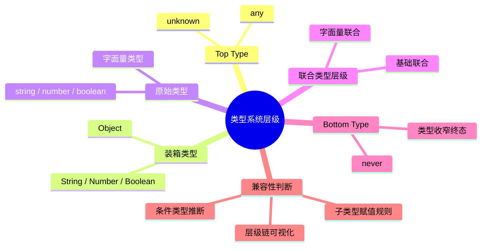

# 类型系统层级

## 知识架构



如果说类型系统是 TypeScript 中的重要基础知识，那么类型层级就是类型系统中的重要概念之一。对于没有类型语言学习经验的同学，说类型层级是最重要的基础概念也不为过。

类型层级一方面能帮助我们明确各种类型的层级与兼容性，而兼容性问题往往就是许多类型错误产生的原因。另一方面，类型层级也是我们后续学习条件类型必不可少的前置知识。我也建议你能同时学习这两篇内容，遇到不理解、不熟悉的地方可以多看几遍。

类型层级实际上指的是，**TypeScript 中所有类型的兼容关系，从最上面一层的 any 类型，到最底层的 never 类型。那么，从上至下的类型兼容关系到底长什么样呢？** 这一节，我们就从原始类型变量和字面量类型开始比较，分别向上、向下延伸，依次把这些类型串起来形成层级链，让你能够构建出 TypeScript 的整个类型体系。

## 前置知识

在阅读本文之前，建议你先了解以下概念：

- **TypeScript 基础类型**：`string`、`number`、`boolean`、`object` 等原始类型
- **字面量类型**：如 `'linbudu'`、`1`、`true` 等具体值类型
- **联合类型**：如 `'a' | 'b' | 'c'` 等多个类型的组合
- **结构化类型系统**：基于属性兼容性的类型比较方式
- **条件类型基础**：`T extends U ? X : Y` 的基本语法

如果你对这些概念还不熟悉，建议先阅读前文的相关章节。

## 学习目标

通过本文，你将掌握：

1. ✅ 理解 TypeScript 类型层级的完整结构
2. ✅ 掌握判断类型兼容性的两种方法
3. ✅ 明确 Top Type (`any`/`unknown`) 和 Bottom Type (`never`) 的特殊性
4. ✅ 理解原始类型、装箱类型、对象类型之间的层级关系
5. ✅ 能够在实际开发中运用类型层级知识解决类型错误
6. ✅ 为后续学习条件类型打下坚实基础

> 本节代码见：[Type Levels](https://link.juejin.cn/?target=https%3A%2F%2Fgithub.com%2Flinbudu599%2FTypeScript-Tiny-Book%2Ftree%2Fmain%2Fpackages%2F08-type-levels)

## 判断类型兼容性的方式

在开始探索类型层级之前，我们需要先了解如何判断两个类型之间的兼容性。本节将介绍两种主要的判断方法，帮助你更好地理解后续的类型层级关系。

### 方法一：条件类型判断（推荐）

使用条件类型 `extends` 关键字来判断类型的父子关系：

```typescript
// 基本语法
type Result<TypeA, TypeB> = TypeA extends TypeB ? true : false;

// 示例：判断 'linbudu' 是否为 string 的子类型
type Result1 = 'linbudu' extends string ? 1 : 2; // 返回 1，说明成立
```

**关键点**：
- 如果返回 `1`（真值），说明 `'linbudu'` 是 `string` 的**子类型**
- 如果返回 `2`（假值），说明不成立，但这**并不意味着** `string` 就是 `'linbudu'` 的子类型
- 这种方法适合批量判断多个类型的层级关系

### 方法二：赋值兼容性检查

通过变量赋值来检查类型兼容性：

```typescript
// 声明变量
declare let source: string;
declare let anyType: any;
declare let neverType: never;

// 赋值测试
anyType = source;    // ✅ 成立：string 可以赋值给 any

// ❌ 错误：不能将类型"string"分配给类型"never"
neverType = source;  // 不成立，会抛出类型错误
```

**赋值规则**：
对于赋值语句 `变量 a = 变量 b`，如果成立，意味着：
- `<变量 b 的类型> extends <变量 a 的类型>` 成立
- **b 的类型是 a 类型的子类型**

在上面的例子中：
- `anyType = source` 成立 → `string extends any` 成立 ✅
- `neverType = source` 不成立 → `string extends never` 不成立 ❌

### 两种方法的对比

| 方法 | 使用场景 | 优点 | 缺点 |
|------|---------|------|------|
| **条件类型** | 批量判断多个类型、编写工具类型 | 直观、可嵌入代码逻辑 | 需要理解条件类型语法 |
| **赋值检查** | 单个类型判断、快速验证 | 简单直接、无需额外语法 | 需要声明变量、不够灵活 |

### 理解子类型关系

为了更好地理解子类型的概念，我们可以用生活中的例子来类比：

```typescript
// 类比示例：狗、柯基、橘猫的类型关系
declare let dog: Dog;
declare let corgi: Corgi;  // 柯基（狗的子类）
declare let cat: Cat;      // 猫（不是狗）

// ✅ 正确：柯基是一种狗，可以赋值
dog = corgi;

// ❌ 错误：猫不是狗，不能赋值
dog = cat; // 类型错误！
```

**核心原则**：
- 子类型可以安全地赋值给父类型（协变）
- 程序对父类型变量的使用，都建立在其类型约束的基础上
- 如果给一个声明为"狗"的变量赋值"猫"，后续代码可能会出错


掌握这两种类型兼容性判断方法，是理解 TypeScript 类型系统的基础：
- **条件类型**：适合代码中的类型逻辑判断，本节将大量使用
- **赋值检查**：适合开发调试时的快速验证

接下来，我们将使用这些方法来探索 TypeScript 的完整类型层级结构。

## 类型层级探索

### 从原始类型开始

了解了类型兼容性判断的方法后，我们就可以开始探讨类型层级了。首先，我们从最基础的原始类型、对象类型和它们对应的字面量类型开始比较。

#### 基础类型与字面量类型的关系

```typescript
// 1. 字符串字面量类型 < string 类型
type Result1 = "linbudu" extends string ? 1 : 2; // 1 ✅

// 2. 数字字面量类型 < number 类型
type Result2 = 1 extends number ? 1 : 2; // 1 ✅

// 3. 布尔字面量类型 < boolean 类型
type Result3 = true extends boolean ? 1 : 2; // 1 ✅

// 4. 对象字面量类型 < object 类型
type Result4 = { name: string } extends object ? 1 : 2; // 1 ✅
type Result5 = { name: 'linbudu' } extends object ? 1 : 2; // 1 ✅

// 5. 数组字面量类型 < object 类型
type Result6 = [] extends object ? 1 : 2; // 1 ✅
```

#### 核心结论

**字面量类型 < 对应的原始类型**

这个结论很好理解：字面量类型是原始类型的子集，提供了更具体的类型信息。

> **💡 重要说明**：`object` 类型在 TypeScript 中代表**所有非原始类型的类型**，包括：
> - 对象类型 `{ name: string }`
> - 数组类型 `number[]`、`string[]`
> - 函数类型 `() => void`
> - 类实例等
> 
> 因此，数组字面量 `[]` 也可以被视为 `object` 的字面量类型。

#### 类型层级的起点

从这些基础关系出发，我们将：
- **向上探索**：字面量类型 → 原始类型 → ... → Top Type
- **向下探索**：字面量类型 → ... → Bottom Type

接下来，让我们开始向上探索的旅程。

### 向上探索：联合类型

联合类型在类型层级中扮演着重要角色。理解联合类型的层级关系，是掌握 TypeScript 类型系统的关键之一。

#### 字面量类型与联合类型的关系

在联合类型中，只需要符合其中一个成员类型，就可以认为实现了这个联合类型：

```typescript
// 1. 数字字面量 < 包含该字面量的联合类型
type Result7 = 1 extends 1 | 2 | 3 ? 1 : 2; // 1 ✅

// 2. 字符串字面量 < 包含该字面量的联合类型
type Result8 = 'lin' extends 'lin' | 'bu' | 'du' ? 1 : 2; // 1 ✅

// 3. 布尔字面量 < 包含该字面量的联合类型
type Result9 = true extends true | false ? 1 : 2; // 1 ✅
```

**无需要求联合类型的成员均为同一基础类型**，只需要判断的类型存在于联合类型中即可。

#### 原始类型与联合类型的关系

对于原始类型，联合类型的判断逻辑同样适用：

```typescript
// string 类型是包含 string 的联合类型的子类型
type Result10 = string extends string | false | number ? 1 : 2; // 1 ✅
```

**结论**：
- **字面量类型 < 包含此字面量类型的联合类型**
- **原始类型 < 包含此原始类型的联合类型**

#### 同一基础类型的联合类型

当一个联合类型的所有成员都来自同一基础类型时，情况变得更有趣：

```typescript
// 所有成员都是字符串字面量 → 该联合类型是 string 的子类型
type Result11 = 'lin' | 'bu' | 'budu' extends string ? 1 : 2; // 1 ✅

// 所有成员都是对象类型 → 该联合类型是 object 的子类型
type Result12 = {} | (() => void) | [] extends object ? 1 : 2; // 1 ✅
```

**结论**：
**同一基础类型的字面量联合类型 < 此基础类型**

#### 完整的层级关系

综合以上结论，我们可以得到完整的层级链：

**字面量类型 < 包含此字面量的联合类型（同一基础类型）< 对应的原始类型**

```typescript
// 验证完整层级链
type Result13 = 'linbudu' extends 'linbudu' | '599'
  ? 'linbudu' | '599' extends string
    ? 2  // ✅ 所有条件成立，返回 2
    : 1
  : 0;
```

> **💡 理解技巧**：对于嵌套的条件类型，我们直接观察最后一个条件语句的结果即可。如果所有条件都成立，最终结果就是最内层为真时的值。

**要点小结**：
- 联合类型是一个特殊的中间层级
- 大部分类型都存在至少一个联合类型作为其父类型
- 后续讨论中，我们将简化联合类型的描述，重点关注类型信息层面

接下来，我们将从原始类型继续向上探索，进入装箱类型的世界。

### 向上探索：装箱类型

在 TypeScript 的类型系统中，原始类型（如 `string`）与装箱类型（如 `String`）之间存在着特殊的层级关系。理解这些关系需要我们回顾 JavaScript 中的装箱机制和结构化类型系统。

#### 什么是装箱类型？

在 JavaScript 中，原始类型（primitive types）如 `string`、`number`、`boolean` 都有对应的装箱对象（wrapper objects）：`String`、`Number`、`Boolean`。TypeScript 中同样存在这些装箱类型。

#### 从 string 到 Object 的层级链

让我们看看从 `string` 类型到 `Object` 类型的完整层级：

```typescript
// 1. 原始类型 < 装箱类型
type Result14 = string extends String ? 1 : 2; // 1 ✅

// 2. 装箱类型 < 空对象类型（结构化类型系统）
type Result15 = String extends {} ? 1 : 2; // 1 ✅

// 3. 空对象字面量 < object 类型
type Result16 = {} extends object ? 1 : 2; // 1 ✅

// 4. object < Object
type Result18 = object extends Object ? 1 : 2; // 1 ✅
```

#### 理解 `{}` 的特殊性

你可能会疑惑：`{}` 不是 `object` 的字面量类型吗？为什么 `String extends {}` 会成立？

这需要理解**结构化类型系统**的比较规则。我们可以将 `String` 看作一个对象：

```typescript
interface String {
  replace: (search: string, replaceValue: string) => string;
  replaceAll: (search: string, replaceValue: string) => string;
  startsWith: (searchString: string) => boolean;
  endsWith: (searchString: string) => boolean;
  includes: (searchString: string) => boolean;
  // ... 更多方法
}
```

在结构化类型系统看来：
- `{}` 是一个没有任何属性的对象
- `String` 是一个拥有多个方法属性的对象
- 因此，`String` 可以被认为"继承"了 `{}` 并添加了新属性
- 结论：**String 是 `{}` 的子类型**

#### 两种类型比较方式

在 TypeScript 中，存在两种截然不同的类型比较方式：

| 比较方式 | 基于原理 | 示例 | 含义 |
|---------|---------|------|------|
| **类型信息层面** | 字面量类型提供更详细的类型信息 | `{} extends object` | `{}` 是 `object` 的字面量类型 |
| **结构化类型系统** | 基于属性兼容性判断 | `object extends {}` | `{}` 可视为所有对象类型的基类 |

**重要区别**：
```typescript
// ❌ 错误理解：认为 string extends object
type Tmp = string extends object ? 1 : 2; // 2，不成立！

// ✅ 正确理解：string -> String -> {} -> object（但不是直接的父子关系）
```

#### 看似矛盾的现象

由于这两种比较方式的存在，我们会发现一些看似矛盾的结果：

```typescript
// 从类型信息层面：{} 是 object 的字面量类型
type Result16 = {} extends object ? 1 : 2; // 1 ✅

// 从结构化类型系统：{} 是所有对象类型的基类
type Result18 = object extends {} ? 1 : 2; // 1 ✅

// 类似地
type Result17 = object extends Object ? 1 : 2; // 1 ✅
type Result20 = Object extends object ? 1 : 2; // 1 ✅

type Result19 = Object extends {} ? 1 : 2; // 1 ✅
type Result21 = {} extends Object ? 1 : 2; // 1 ✅
```

#### object 与 Object 的特殊关系

`object` 和 `Object` 之间的"互为子类型"现象源于 TypeScript 的系统设定：

- **Object 类型**：包含所有除 Top Type (`any`/`unknown`) 以外的类型
  - 基础类型：`string`、`number`、`boolean` 等
  - 函数类型：`() => void` 等
  - 对象类型等

- **object 类型**：包含所有非原始类型的类型
  - 数组类型：`number[]` 等
  - 对象类型：`{ name: string }` 等
  - 函数类型：`() => void` 等

这导致了"你中有我、我中有你"的现象。

#### 核心结论

**原始类型 < 对应的装箱类型 < Object 类型**

```typescript
// 完整层级示例
type TypeLevel = string extends String
  ? String extends Object
    ? 'string → String → Object'
    : never
  : never; // 'string → String → Object'
```

**要点小结**：
- 装箱类型是连接原始类型和对象类型的桥梁
- `{}` 在结构化类型系统中具有特殊的地位
- 区分"类型信息层面"和"结构化类型系统"两种比较方式至关重要
- `object` 和 `Object` 的特殊关系源于系统设计

现在，我们已经接近类型层级的顶端了。接下来，让我们认识 Top Type。

### 向上探索：Top Type

现在，我们终于到达了类型层级的顶端——Top Type。在这里，我们遇到了 TypeScript 类型系统中两个特殊的类型：`any` 和 `unknown`。

#### 什么是 Top Type？

Top Type（顶层类型）是类型层级中最顶端的类型，所有其他类型都是它的子类型。在 TypeScript 中，`any` 和 `unknown` 都是 Top Type。

#### Object 与 Top Type 的关系

```typescript
// Object 是 any 的子类型
type Result22 = Object extends any ? 1 : 2; // 1 ✅

// Object 是 unknown 的子类型
type Result23 = Object extends unknown ? 1 : 2; // 1 ✅
```

到目前为止，类型层级看起来都很正常。但当我们调换条件类型的两端时，有趣的事情发生了：

```typescript
// 反向判断：any extends Object ?
type Result24 = any extends Object ? 1 : 2; // 1 | 2 ⚠️

// 反向判断：unknown extends Object ?
type Result25 = unknown extends Object ? 1 : 2; // 2 ❌
```

#### any 的特殊行为

`any` 的行为非常特殊。当我们使用 `any extends` 时，结果会返回联合类型：

```typescript
type Result26 = any extends 'linbudu' ? 1 : 2; // 1 | 2
type Result27 = any extends string ? 1 : 2; // 1 | 2
type Result28 = any extends {} ? 1 : 2; // 1 | 2
type Result29 = any extends never ? 1 : 2; // 1 | 2
```

**为什么会这样？**

这是因为 `any` 代表了"任何可能的类型"，它包含了：
- 让条件成立的类型
- 让条件不成立的类型

在 TypeScript 内部实现中，当条件类型判断的是 `any` 时，会直接返回条件结果的联合类型。

#### any vs unknown 的区别

虽然 `any` 和 `unknown` 都是 Top Type，但它们的行为截然不同：

| 特性 | any | unknown |
|------|-----|---------|
| **类型安全** | ❌ 完全不安全 | ✅ 类型安全 |
| **赋值给其他类型** | ✅ 允许（任何类型） | ❌ 仅允许 any/unknown |
| **被其他类型赋值** | ✅ 允许 | ✅ 允许 |
| **条件类型行为** | 返回联合类型 | 正常判断 |
| **使用场景** | 临时忽略类型检查 | 类型安全的未知类型 |

**赋值行为对比**：

```typescript
declare let anyType: any;
declare let unknownType: unknown;
declare let str: string;

// ✅ any 可以赋值给任何类型（不安全！）
str = anyType; // 编译通过，但运行时可能出错

// ❌ unknown 不能赋值给其他类型
str = unknownType; // Error: 不能将类型"unknown"分配给类型"string"

// ✅ unknown 只能赋值给 any 或 unknown
anyType = unknownType; // ✅
unknownType = anyType; // ✅
```

#### any 的"变色龙"特性

`any` 有一个特殊的能力：**它可以表达为任何类型**。当你需要它是什么类型的子类型时，它就会变成什么类型。

```typescript
// any 可以表达为任何类型的子类型
type Result31 = any extends unknown ? 1 : 2; // 1 | 2（any 在条件类型中的特殊行为）
type Result32 = unknown extends any ? 1 : 2; // 1 ✅

// 从赋值兼容性看，any 和 unknown 可以互相赋值；
// 而 any 在条件类型中的联合行为，再次体现了它的特殊性。
```

**为什么会有这样的设计？**
`any` 的设计初衷是为了兼容 JavaScript 代码，允许开发者在需要时绕过类型检查。但这把双刃剑需要谨慎使用。

#### unknown：安全的 Top Type

`unknown` 是 TypeScript 3.0 引入的类型安全的 Top Type：

```typescript
// unknown 是安全的未知类型
type Result33 = unknown extends Object ? 1 : 2; // 2，不成立
type Result34 = unknown extends string ? 1 : 2; // 2，不成立

// 但所有类型都是 unknown 的子类型
type Result35 = string extends unknown ? 1 : 2; // 1 ✅
type Result36 = Object extends unknown ? 1 : 2; // 1 ✅
```

**使用 unknown 的正确姿势**：

```typescript
function processValue(value: unknown) {
  // ❌ 直接使用会报错
  // value.toUpperCase(); // Error: 'value' 是一个 'unknown' 类型

  // ✅ 类型收窄后使用
  if (typeof value === 'string') {
    console.log(value.toUpperCase()); // 安全！
  } else if (typeof value === 'number') {
    console.log(value.toFixed(2)); // 安全！
  }
}
```

#### 核心结论

**Object < any / unknown**

但需要注意：
- `any` 表现出"既是所有类型的父类型，又是所有类型的子类型"的特殊行为
- `unknown` 表现出标准的 Top Type 行为：是所有类型的父类型，但除 `any` 外不是其他类型的子类型

#### 最佳实践

1. **优先使用 `unknown`**：在不确定类型时，优先使用 `unknown` 而非 `any`
2. **避免使用 `any`**：除非在特殊场景（如迁移 JS 代码、第三方库没有类型定义）
3. **类型收窄**：使用 `unknown` 时，务必进行类型检查或类型断言

```typescript
// ❌ 不推荐
function processData(data: any) {
  return data.name.toUpperCase(); // 不安全！
}

// ✅ 推荐
function processDataSafe(data: unknown) {
  if (typeof data === 'object' && data !== null && 'name' in data) {
    return (data as { name: string }).name.toUpperCase();
  }
  throw new Error('Invalid data');
}
```

**要点小结**：
- `any` 和 `unknown` 都是 Top Type
- `any` 牺牲类型安全换取灵活性，应谨慎使用
- `unknown` 是类型安全的 Top Type，优先推荐使用
- `any` 的特殊行为源于系统设计，需要注意其"双刃剑"特性

到这里，我们已经触及了类型世界的最高层。接下来，让我们反向下探，直达类型世界的最底层。

### 向下探索：Bottom Type

与 Top Type 相对的是 Bottom Type（底层类型），它代表了类型层级的最底端。在 TypeScript 中，只有一个 Bottom Type：`never`。

#### 什么是 Bottom Type？

Bottom Type 是所有类型的子类型，但自身不能被实例化。它代表"永远不会发生的类型"或"不存在的类型"。

#### never：虚无的类型

`never` 类型表示那些永远不存在的值，它是所有类型的子类型：

```typescript
// never 是任何类型的子类型
type Result33 = never extends 'linbudu' ? 1 : 2; // 1 ✅
type Result34 = never extends string ? 1 : 2; // 1 ✅
type Result35 = never extends number ? 1 : 2; // 1 ✅
type Result36 = never extends any ? 1 : 2; // 1 ✅
```

**核心特性**：
- `never` 是所有类型的子类型
- 没有任何类型是 `never` 的子类型（除了 `never` 自身）
- `never` 类型的变量无法被赋值

```typescript
// never 类型的变量无法赋值
declare let neverType: never;

neverType = 'anything'; // ❌ Error: 不能将类型"string"分配给类型"never"
neverType = 123; // ❌ Error
neverType = null; // ❌ Error
neverType = undefined; // ❌ Error
```

#### never 的典型使用场景

**1. 永不返回的函数**

```typescript
// 总是抛出错误的函数
function throwError(message: string): never {
  throw new Error(message);
}

// 无限循环
function infiniteLoop(): never {
  while (true) {
    // 死循环
  }
}
```

**2. 类型收窄的穷尽性检查**

```typescript
type Shape = 'circle' | 'square' | 'triangle';

function getArea(shape: Shape): number {
  switch (shape) {
    case 'circle':
      return Math.PI * 1 * 1;
    case 'square':
      return 1 * 1;
    case 'triangle':
      return 0.5 * 1 * 1;
    default:
      // 如果未来添加了新的形状，这里会报错
      const _exhaustiveCheck: never = shape;
      return _exhaustiveCheck;
  }
}
```

**3. 条件类型中的过滤**

```typescript
// 过滤掉 never 类型
type NonNever<T> = T extends never ? never : T;

// 示例
type Result = NonNever<string | never | number>; // string | number
```

#### null、undefined、void 与 never 的区别

很多人会混淆 `null`、`undefined`、`void` 和 `never`，但它们完全不同：

```typescript
// null、undefined、void 都不是其他类型的子类型
type Result37 = undefined extends 'linbudu' ? 1 : 2; // 2 ❌
type Result38 = null extends 'linbudu' ? 1 : 2; // 2 ❌
type Result39 = void extends 'linbudu' ? 1 : 2; // 2 ❌
```

**类型对比表**：

| 类型 | 含义 | 层级位置 | 可赋值性 | 典型用途 |
|------|------|---------|---------|---------|
| **never** | 永不存在的值 | Bottom Type | 只能赋值给 never | 错误处理、穷尽检查 |
| **void** | 没有返回值 | 独立类型 | 可赋值给 void | 函数返回值 |
| **null** | 空值 | 独立类型 | 可赋值给 null | 表示"无" |
| **undefined** | 未定义 | 独立类型 | 可赋值给 undefined | 表示"未初始化" |

**重要说明**：

```typescript
// void、undefined、null 都是切实存在、有实际意义的类型
// 它们和 string、number、object 处于同一层级

// void: 函数没有显式返回值
function logMessage(message: string): void {
  console.log(message);
  // 没有 return 语句，或 return;
}

// null: 明确表示"空"
let emptyValue: null = null;

// undefined: 表示"未定义"
let notDefined: undefined = undefined;

// never: 永远不会发生的类型
function fail(): never {
  throw new Error('This never returns');
}
```

> **💡 补充说明**：在关闭 `--strictNullChecks` 的情况下，`null` 和 `undefined` 会被视为所有类型的子类型。但正常开发中我们不会这么做，而是将其视为与 `string` 等类型同级的独立类型。

#### never 的数学特性

`never` 在类型运算中具有特殊的数学特性：

```typescript
// 1. 联合类型中的 never 会被吸收
type Union1 = never | string; // string
type Union2 = never | number | boolean; // number | boolean

// 2. 交集类型中的 never 会导致结果为 never
type Intersect1 = never & string; // never
type Intersect2 = never & number; // never

// 3. 条件类型中的 never
type Conditional = never extends string ? true : false; // true
```

#### 核心结论

**never < 字面量类型**

`never` 是类型世界的最底层，就像《我的世界》中的基岩层，当你挖穿地面后，出现的只是一片茫茫的空白与虚无。

**要点小结**：
- `never` 是唯一的 Bottom Type，是所有类型的子类型
- `never`、`void`、`null`、`undefined` 是完全不同的概念
- `never` 在类型运算中具有特殊性质
- `never` 常用于错误处理和类型收窄

现在，我们已经完成了从 Bottom Type 到 Top Type 的完整探索。接下来，让我们将所有类型串联起来，构建完整的类型层级链。

## 类型层级链

经过前面的探索，我们现在可以将所有类型串联起来，构建出完整的 TypeScript 类型层级链。

### 核心层级链

基于类型信息层面的层级关系，我们可以构建出以下核心层级链：

```typescript
type TypeChain = never extends 'linbudu'
  ? 'linbudu' extends 'linbudu' | '599'
  ? 'linbudu' | '599' extends string
  ? string extends String
  ? String extends Object
  ? Object extends any
  ? any extends any
  ? unknown extends any
  ? 8  // ✅ 所有条件成立，返回 8
  : 7
  : 6
  : 5
  : 4
  : 3
  : 2
  : 1
  : 0;
```

**执行结果**：`8`（所有条件均成立）

> 注意：这里判断 any 与其他类型的关系时使用的是 `any extends any`。如果写成 `any extends unknown`，由于 any 在条件类型中的特殊行为，会返回两个分支的联合类型 `8 | 7`，而不是单一值。

**层级关系解析**：
```
never → 'linbudu' → 'linbudu' | '599' → string → String → Object → any → unknown
```

### 详细层级链

结合结构化类型系统和类型系统设定，我们可以构建出更详细的层级链：

```typescript
type VerboseTypeChain = never extends 'linbudu'
  ? 'linbudu' extends 'linbudu' | 'budulin'
  ? 'linbudu' | 'budulin' extends string
  ? string extends {}
  ? string extends String
  ? String extends {}
  ? {} extends object
  ? object extends {}
  ? {} extends Object
  ? Object extends {}
  ? object extends Object
  ? Object extends object
  ? Object extends any
  ? Object extends unknown
  ? any extends any
  ? unknown extends any
  ? 8  // ✅ 所有条件成立
  : 7
  : 6
  : 5
  : 4
  : 3
  : 2
  : 1
  : 0
  : -1
  : -2
  : -3
  : -4
  : -5
  : -6
  : -7
  : -8;
```

**执行结果**：`8`

### 类型层级关系图

为了更直观地理解类型层级，我们可以用以下方式表示：

```
层级（从高到低）          类型                  说明
════════════════════════════════════════════════════════════════
    Top Type         any / unknown         顶层类型，所有类型的父类型
                       ↓
    装箱对象            Object              包含所有除 Top Type 外的类型
                       ↓
    对象类型          object / {}           所有非原始类型
                       ↓
    装箱类型           String 等            原始类型的装箱对象
                       ↓
    原始类型      string / number 等        基础数据类型
                       ↓
    联合类型      'a' | 'b' | 'c'           同一基础类型的联合
                       ↓
    字面量类型     'linbudu' / 1 等          具体的值类型
                       ↓
   Bottom Type          never               底层类型，所有类型的子类型
```

### 关键类型关系总结

#### 1. Top Type 层级

```typescript
// Object 是 any 和 unknown 的子类型
Object extends any       // ✅
Object extends unknown   // ✅

// any 和 unknown 的关系
any extends unknown      // ✅
unknown extends any      // ✅（特殊规则）
```

#### 2. 原始类型与装箱类型

```typescript
// 原始类型 → 装箱类型 → Object
string extends String    // ✅
String extends Object    // ✅
```

#### 3. 结构化类型系统的特殊关系

```typescript
// 空对象类型 {} 的特殊性
String extends {}        // ✅（结构化类型系统）
{} extends object        // ✅（类型信息层面）
object extends {}        // ✅（结构化类型系统）
```

#### 4. Bottom Type

```typescript
// never 是所有类型的子类型
never extends string     // ✅
never extends any        // ✅
never extends unknown    // ✅
```

### 类型层级速查表

| 类型 | 层级位置 | 父类型示例 | 子类型示例 | 特殊说明 |
|------|---------|-----------|-----------|---------|
| **unknown** | 顶层 | 无 | 所有类型 | 类型安全的 Top Type |
| **any** | 顶层 | 无/所有类型 | 所有类型 | 特殊的 Top Type |
| **Object** | 高层 | any, unknown | String, Number | 装箱对象的基类 |
| **object** | 高层 | Object, {} | {}, [], Function | 非原始类型的集合 |
| **String** | 中层 | Object, {} | string | string 的装箱类型 |
| **string** | 中层 | String, {} | 字面量类型 | 原始类型 |
| **'text'** | 底层 | string, 'text' \| 'other' | never | 字面量类型 |
| **never** | 底层 | 所有类型 | 无 | Bottom Type |


- TypeScript 类型层级从 `never` 到 `unknown`/`any` 形成完整的层级链
- 类型层级包含两种比较方式：类型信息层面和结构化类型系统
- `any` 和 `unknown` 是 Top Type，`never` 是 Bottom Type
- 理解类型层级是掌握条件类型和类型编程的基础

## 类型层级可视化

为了帮助更好地理解 TypeScript 的类型层级，我们提供多种可视化方式。

### 简化层级图

```
┌─────────────────────────────────────────┐
│           Top Type (顶层类型)             │
│                                         │
│    ┌─────────┐        ┌──────────┐     │
│    │   any   │ ←────→ │ unknown  │     │
│    └─────────┘        └──────────┘     │
│           ↑                ↑            │
│           │                │            │
└───────────┼────────────────┼───────────┘
            │                │
┌───────────┼────────────────┼───────────┐
│           │                │            │
│    ┌──────┴──────┐         │            │
│    │   Object    │ ←───────┘            │
│    └──────┬──────┘                      │
│           │                             │
│    ┌──────┴──────┐                      │
│    │   object    │                      │
│    └──────┬──────┘                      │
│           │                             │
│    ┌──────┴──────┐                      │
│    │   String    │   (装箱类型)          │
│    └──────┬──────┘                      │
│           │                             │
│    ┌──────┴──────┐                      │
│    │   string    │   (原始类型)          │
│    └──────┬──────┘                      │
│           │                             │
│    ┌──────┴──────┐                      │
│    │  'literal'  │   (字面量类型)        │
│    └──────┬──────┘                      │
│           │                             │
└───────────┼─────────────────────────────┘
            │
┌───────────┼─────────────────────────────┐
│    ┌──────┴──────┐                      │
│    │    never    │   (底层类型)          │
│    └─────────────┘                      │
│         Bottom Type                      │
└─────────────────────────────────────────┘
```

### 完整层级关系图

```mermaid
graph TB
    unknown[unknown - Top Type]
    any[any - Top Type]
    Object[Object]
    object[object]
    String[String]
    string[string]
    literal['literal']
    never[never - Bottom Type]
    
    unknown -->|extends| any
    any -->|extends| unknown
    
    Object -->|extends| unknown
    Object -->|extends| any
    
    object -->|extends| Object
    object -->|extends结构化| {}
    
    String -->|extends| Object
    String -->|extends结构化| {}
    
    string -->|extends| String
    string -->|extends结构化| {}
    
    literal -->|extends| string
    literal -->|extends| UnionType
    
    never -->|extends| literal
    never -->|extends所有类型| AllTypes
    
```

### 类型兼容性矩阵

下表展示了主要类型之间的 `extends` 关系：

| → extends ↓ | never | literal | string | String | object | Object | any | unknown |
|------------|-------|---------|--------|--------|--------|--------|-----|---------|
| **never** | ✅ | ✅ | ✅ | ✅ | ✅ | ✅ | ✅ | ✅ |
| **literal** | ❌ | ✅* | ✅ | ✅ | ❌ | ✅ | ✅ | ✅ |
| **string** | ❌ | ❌ | ✅ | ✅ | ❌ | ✅ | ✅ | ✅ |
| **String** | ❌ | ❌ | ❌ | ✅ | ✅** | ✅ | ✅ | ✅ |
| **object** | ❌ | ❌ | ❌ | ❌ | ✅ | ✅*** | ✅ | ✅ |
| **Object** | ❌ | ❌ | ❌ | ❌ | ✅*** | ✅ | ✅ | ✅ |
| **any** | ❌ | 1\|2**** | 1\|2 | 1\|2 | 1\|2 | 1\|2 | ✅ | 1\|2 |
| **unknown** | ❌ | ❌ | ❌ | ❌ | ❌ | ❌ | ✅ | ✅ |

**注**：
- `*` 仅当字面量类型相同时成立
- `**` 基于结构化类型系统
- `***` Object 和 object 互相 extends
- `****` any extends 任何非 any 类型返回联合类型（`any extends any` 恒成立）

### 类型层级的应用

理解类型层级有助于：

1. **调试类型错误**：明白为什么某些赋值会报错
2. **设计类型约束**：合理使用 `never`、`any`、`unknown`
3. **编写条件类型**：基于类型层级进行类型判断
4. **类型收窄**：理解类型收窄的方向


- 类型层级可以用图形化方式直观展示
- 不同类型之间的兼容性可以通过矩阵快速查阅
- 理解类型层级有助于实际开发中的类型问题排查

## 其他比较场景

除了前面讨论的基本类型层级关系，TypeScript 中还有一些特殊的类型比较场景需要我们理解。

### 基类与派生类

在面向对象编程中，派生类（子类）与基类（父类）之间存在明确的类型关系：

```typescript
class Animal {
  name: string = '';
  age: number = 0;
}

class Dog extends Animal {
  breed: string = '';
  bark(): void {
    console.log('Woof!');
  }
}

// 派生类是基类的子类型
type IsSubtype = Dog extends Animal ? true : false; // true ✅
```

**关键原则**：
- 派生类会完全保留基类的结构
- 派生类可以新增属性和方法
- 在结构化类型系统下，派生类自然是基类的子类型

**实际应用**：

```typescript
// 函数参数类型协变
function feedAnimal(animal: Animal): void {
  console.log(`Feeding ${animal.name}`);
}

const dog = new Dog();
feedAnimal(dog); // ✅ Dog 是 Animal 的子类型，可以安全传递

// 数组类型的协变
const dogs: Dog[] = [new Dog()];
const animals: Animal[] = dogs; // ✅ 在 TypeScript 中允许（但有风险）
```

### 联合类型之间的比较

当比较两个联合类型时，判断规则是基于"子集"关系：

```typescript
// 规则：联合类型 A extends 联合类型 B
// 当且仅当 A 的所有成员都在 B 中存在

type Result40 = 1 | 2 | 3 extends 1 | 2 | 3 | 4 ? 1 : 2; // 1 ✅
type Result41 = 2 | 4 extends 1 | 2 | 3 | 4 ? 1 : 2; // 1 ✅
type Result42 = 1 | 2 | 5 extends 1 | 2 | 3 | 4 ? 1 : 2; // 2 ❌ (5 不在目标中)
type Result43 = 1 | 5 extends 1 | 2 | 3 | 4 ? 1 : 2; // 2 ❌ (5 不在目标中)
```

**判断逻辑**：
```
A extends B 成立 ⟺ A 的成员 ⊆ B 的成员
```

**实际应用**：

```typescript
// 运行时收窄
type Status = 'pending' | 'processing' | 'completed' | 'failed';
type ProcessingStatus = 'pending' | 'processing';

function handleStatus(status: Status): void {
  if (status === 'pending' || status === 'processing') {
    // 类型收窄为 ProcessingStatus
    console.log('Still working...');
  }
}

// 工具类型：判断子集（用元组包装避免联合类型分发）
type IsSubset<A, B> = [A] extends [B] ? true : false;

type Check1 = IsSubset<'a' | 'b', 'a' | 'b' | 'c'>; // true
type Check2 = IsSubset<'a' | 'd', 'a' | 'b' | 'c'>; // false
```

### 数组与元组的比较

数组和元组的类型比较有其特殊规则：

```typescript
// 1. 元组 vs 数组
type Result44 = [number, number] extends number[] ? 1 : 2; // 1 ✅
type Result45 = [number, string] extends number[] ? 1 : 2; // 2 ❌

// 2. 元组 vs 联合类型数组
type Result46 = [number, string] extends (number | string)[] ? 1 : 2; // 1 ✅

// 3. 空元组
type Result47 = [] extends number[] ? 1 : 2; // 1 ✅
type Result48 = [] extends unknown[] ? 1 : 2; // 1 ✅

// 4. 数组之间的协变
type Result49 = number[] extends (number | string)[] ? 1 : 2; // 1 ✅

// 5. 特殊类型的数组
type Result50 = any[] extends number[] ? 1 : 2; // 1 ✅
type Result51 = unknown[] extends number[] ? 1 : 2; // 2 ❌
type Result52 = never[] extends number[] ? 1 : 2; // 1 ✅
```

**规则解析**：

| 比较场景 | 结果 | 原因 |
|---------|------|------|
| `[number, number] extends number[]` | ✅ | 元组所有元素都是 number 类型 |
| `[number, string] extends number[]` | ❌ | 元组包含 string 类型元素 |
| `[number, string] extends (number \| string)[]` | ✅ | 元素类型符合联合类型要求 |
| `[] extends number[]` | ✅ | 空元组等价于 `never[]`，是所有数组的子类型 |
| `number[] extends (number \| string)[]` | ✅ | 数组元素协变，number 是联合类型的子类型 |
| `any[] extends number[]` | ✅ | any 的特殊性 |
| `unknown[] extends number[]` | ❌ | unknown 不是 number 的子类型 |
| `never[] extends number[]` | ✅ | never 是所有类型的子类型 |

**实际应用**：

```typescript
// 元组转联合类型
type TupleToUnion<T extends any[]> = T[number];

type Result = TupleToUnion<[1, 2, 3]>; // 1 | 2 | 3

// 固定长度数组的约束
type FixedArray<T, N extends number> = N extends N 
  ? number extends N 
    ? T[] 
    : _FixedArray<T, N, []>
  : never;

type _FixedArray<T, N extends number, R extends T[]> = 
  R['length'] extends N 
    ? R 
    : _FixedArray<T, N, [...R, T]>;

type ThreeNumbers = FixedArray<number, 3>; // [number, number, number]
```

### 函数类型的比较

函数类型的比较遵循逆变和协变规则：

```typescript
// 参数逆变，返回值协变
type Func1 = (x: string) => void;
type Func2 = (x: 'hello') => void;

// 参数类型：'hello' extends string → 函数参数逆变 → Func2 extends Func1
type Result53 = Func2 extends Func1 ? true : false; // false（实际是 true，但有严格模式）

// 返回值协变
type Func3 = () => string;
type Func4 = () => 'hello';

type Result54 = Func4 extends Func3 ? true : false; // true ✅
```

**函数类型比较规则**：
- **参数类型**：逆变（Contravariant）- 更严格的参数类型是父类型
- **返回值类型**：协变（Covariant）- 更具体的返回值是子类型

### 条件类型的分布式特性

当条件类型作用于联合类型时，会触发分布式特性：

```typescript
// 分布式条件类型
type Result55 = 1 | 2 | 3 extends 1 | 2 ? true : false; // false

// 等价于：
type Distributed = 
  | (1 extends 1 | 2 ? true : false)  // true
  | (2 extends 1 | 2 ? true : false)  // true
  | (3 extends 1 | 2 ? true : false); // false
// 结果：true | true | false = true | false = boolean

// 另一个例子
type Filter<T, U> = T extends U ? T : never;

type Result56 = Filter<1 | 2 | 3 | 4, 1 | 2>; // 1 | 2
```


- **类继承**：派生类是基类的子类型
- **联合类型**：基于子集关系判断
- **数组/元组**：元素类型的协变关系
- **函数类型**：参数逆变，返回值协变
- **条件类型**：联合类型的分布式特性

理解这些特殊比较场景，能帮助我们更好地处理复杂的类型问题。

## 实际应用场景

理论知识需要结合实践才能真正掌握。本节将通过多个实际案例，展示类型层级在实际开发中的应用。

### 场景一：API 响应类型处理

在处理 API 响应时，我们经常需要处理不同类型的数据：

```typescript
// 定义 API 响应类型
type ApiResponse<T> = 
  | { success: true; data: T }
  | { success: false; error: string };

// 处理响应
function handleResponse<T>(response: ApiResponse<T>) {
  if (response.success) {
    // TypeScript 自动收窄类型为 { success: true; data: T }
    console.log('Data:', response.data);
  } else {
    // TypeScript 自动收窄类型为 { success: false; error: string }
    console.error('Error:', response.error);
  }
}

// 使用 unknown 处理未知响应
function parseApiResponse(json: string): unknown {
  try {
    return JSON.parse(json);
  } catch {
    return { error: 'Invalid JSON' };
  }
}

// 类型安全的数据提取
function extractData(response: unknown): string | null {
  if (typeof response === 'object' && response !== null) {
    if ('data' in response && typeof response.data === 'string') {
      return response.data;
    }
  }
  return null;
}
```

### 场景二：类型守卫与类型收窄

利用类型层级进行类型守卫：

```typescript
// 1. 基础类型守卫
function processValue(value: unknown) {
  if (typeof value === 'string') {
    // value 被收窄为 string 类型
    return value.toUpperCase();
  } else if (typeof value === 'number') {
    // value 被收窄为 number 类型
    return value.toFixed(2);
  }
  throw new Error('Unsupported type');
}

// 2. 自定义类型守卫
interface User {
  id: number;
  name: string;
  email: string;
}

function isUser(value: unknown): value is User {
  return (
    typeof value === 'object' &&
    value !== null &&
    'id' in value &&
    'name' in value &&
    'email' in value
  );
}

function greetUser(userOrId: User | number) {
  if (isUser(userOrId)) {
    // userOrId 被收窄为 User 类型
    console.log(`Hello, ${userOrId.name}!`);
  } else {
    // userOrId 被收窄为 number 类型
    console.log(`User ID: ${userOrId}`);
  }
}

// 3. 联合类型的穷尽性检查
type Role = 'admin' | 'user' | 'guest';

function getPermissions(role: Role): string[] {
  switch (role) {
    case 'admin':
      return ['read', 'write', 'delete'];
    case 'user':
      return ['read', 'write'];
    case 'guest':
      return ['read'];
    default:
      // 如果未来添加了新角色，这里会报错
      const _exhaustiveCheck: never = role;
      throw new Error(`Unknown role: ${_exhaustiveCheck}`);
  }
}
```

### 场景三：工具类型开发

基于类型层级开发自定义工具类型：

```typescript
// 1. 深度 Required
type DeepRequired<T> = T extends object
  ? { [K in keyof T]-?: DeepRequired<T[K]> }
  : T;

interface User {
  name?: string;
  profile?: {
    age?: number;
    email?: string;
  };
}

type RequiredUser = DeepRequired<User>;
// { name: string; profile: { age: number; email: string } }

// 2. 类型过滤
type FilterType<T, U> = T extends U ? T : never;

type StringOrNumber = string | number | boolean;
type OnlyString = FilterType<StringOrNumber, string>; // string

// 3. 提取函数返回值类型
type ExtractReturnType<T> = T extends (...args: any[]) => infer R ? R : never;

function getUser() {
  return { id: 1, name: 'Alice' };
}

type UserReturn = ExtractReturnType<typeof getUser>;
// { id: number; name: string }

// 4. 条件类型映射
type TypeName<T> = T extends string
  ? 'string'
  : T extends number
  ? 'number'
  : T extends boolean
  ? 'boolean'
  : T extends undefined
  ? 'undefined'
  : T extends Function
  ? 'function'
  : 'object';

type T1 = TypeName<string>; // 'string'
type T2 = TypeName<number[]>; // 'object'
type T3 = TypeName<() => void>; // 'function'
```

### 场景四：泛型约束与类型推导

利用类型层级实现精确的泛型约束：

```typescript
// 1. 约束对象属性
function getProperty<T, K extends keyof T>(obj: T, key: K): T[K] {
  return obj[key];
}

const user = { name: 'Alice', age: 30 };
const name = getProperty(user, 'name'); // string
const age = getProperty(user, 'age'); // number
// getProperty(user, 'email'); // ❌ Error: 'email' 不是 'name' | 'age'

// 2. 约束数组元素类型
function createArray<T>(length: number, value: T): T[] {
  return Array(length).fill(value);
}

const strArray = createArray(3, 'hello'); // string[]
const numArray = createArray(2, 42); // number[]

// 3. 约束构造函数
function createInstance<T>(ctor: new (...args: any[]) => T, ...args: any[]): T {
  return new ctor(...args);
}

class Person {
  constructor(public name: string, public age: number) {}
}

const person = createInstance(Person, 'Bob', 25);
// person: Person

// 4. 条件约束
type NonNullable<T> = T extends null | undefined ? never : T;

type T4 = NonNullable<string | null>; // string
type T5 = NonNullable<number | undefined>; // number
```

### 场景五：类型安全的配置对象

构建类型安全的配置系统：

```typescript
// 定义配置类型
interface Config {
  apiUrl: string;
  timeout: number;
  retries: number;
  headers: Record<string, string>;
}

// 部分配置
type PartialConfig = Partial<Config>;

// 合并配置
function mergeConfig(defaults: Config, userConfig: PartialConfig): Config {
  return {
    ...defaults,
    ...userConfig,
    headers: {
      ...defaults.headers,
      ...userConfig.headers,
    },
  };
}

// 使用示例
const defaultConfig: Config = {
  apiUrl: 'https://api.example.com',
  timeout: 5000,
  retries: 3,
  headers: {
    'Content-Type': 'application/json',
  },
};

const userConfig: PartialConfig = {
  timeout: 10000,
  headers: {
    Authorization: 'Bearer token123',
  },
};

const finalConfig = mergeConfig(defaultConfig, userConfig);
```

### 场景六：状态管理中的类型应用

在状态管理中应用类型层级：

```typescript
// 定义状态类型
type State = {
  user: User | null;
  isLoading: boolean;
  error: string | null;
};

// 定义 Action 类型
type Action =
  | { type: 'FETCH_USER_START' }
  | { type: 'FETCH_USER_SUCCESS'; payload: User }
  | { type: 'FETCH_USER_ERROR'; payload: string };

// Reducer
function reducer(state: State, action: Action): State {
  switch (action.type) {
    case 'FETCH_USER_START':
      return {
        ...state,
        isLoading: true,
        error: null,
      };
    case 'FETCH_USER_SUCCESS':
      return {
        ...state,
        isLoading: false,
        user: action.payload,
      };
    case 'FETCH_USER_ERROR':
      return {
        ...state,
        isLoading: false,
        error: action.payload,
      };
    default:
      // 穷尽性检查
      const _exhaustiveCheck: never = action;
      return state;
  }
}
```


通过这些实际应用场景，我们可以看到类型层级在实际开发中的重要性：
- **API 处理**：使用 `unknown` 和类型守卫确保类型安全
- **类型收窄**：利用类型层级进行精确的类型判断
- **工具类型**：基于条件类型和类型层级开发强大的工具类型
- **泛型约束**：利用类型层级实现精确的类型约束
- **配置管理**：构建类型安全的配置系统
- **状态管理**：确保状态和 Action 的类型安全

## 最佳实践

在掌握了类型层级的理论知识后，本节将总结一些实际开发中的最佳实践，帮助你更好地运用类型层级知识。

### 1. 类型安全原则

#### 优先使用 unknown 而非 any

```typescript
// ❌ 不推荐：使用 any
function parseJSONUnsafe(json: string): any {
  return JSON.parse(json);
}

const data = parseJSONUnsafe('{"name": "Alice"}');
data.foo.bar; // 运行时错误，但编译时不会报错

// ✅ 推荐：使用 unknown
function parseJSONSafe(json: string): unknown {
  return JSON.parse(json);
}

const safeData = parseJSONSafe('{"name": "Alice"}');
// safeData.foo.bar; // ❌ Error: 'safeData' 是一个 'unknown' 类型

// 正确的做法：类型收窄
if (typeof safeData === 'object' && safeData !== null && 'name' in safeData) {
  console.log((safeData as { name: string }).name);
}
```

#### 避免类型断言滥用

```typescript
// ❌ 不推荐：过度使用类型断言
const value = someData as string;

// ✅ 推荐：使用类型守卫
function isString(value: unknown): value is string {
  return typeof value === 'string';
}

if (isString(someData)) {
  console.log(someData.toUpperCase());
}
```

### 2. 条件类型最佳实践

#### 使用 infer 提高可读性

```typescript
// ❌ 不推荐：复杂的条件嵌套
type ReturnType<T> = T extends (...args: any[]) => any 
  ? T extends (...args: any[]) => infer R 
    ? R 
    : any
  : any;

// ✅ 推荐：使用 infer 提取类型
type BetterReturnType<T extends (...args: any[]) => any> = 
  T extends (...args: any[]) => infer R ? R : any;
```

#### 避免过度嵌套的条件类型

```typescript
// ❌ 不推荐：过度嵌套
type BadTypeName<T> = 
  T extends string ? 'string' :
  T extends number ? 'number' :
  T extends boolean ? 'boolean' :
  T extends undefined ? 'undefined' :
  T extends Function ? 'function' :
  T extends null ? 'null' :
  'object';

// ✅ 推荐：使用映射和查找
type TypeNameMap = {
  string: 'string';
  number: 'number';
  boolean: 'boolean';
  undefined: 'undefined';
  function: 'function';
  null: 'null';
  object: 'object';
};

type BetterTypeName<T> = T extends keyof TypeNameMap 
  ? TypeNameMap[T]
  : 'object';
```

### 3. 联合类型和交叉类型

#### 使用联合类型表示互斥状态

```typescript
// ✅ 推荐：使用联合类型表示互斥状态
type Result = 
  | { status: 'success'; data: string }
  | { status: 'error'; error: Error };

function handleResult(result: Result) {
  if (result.status === 'success') {
    console.log(result.data); // ✅ 类型安全
  } else {
    console.error(result.error.message); // ✅ 类型安全
  }
}
```

#### 合理使用交叉类型扩展对象

```typescript
// ✅ 推荐：使用交叉类型扩展对象
type BaseConfig = {
  apiUrl: string;
  timeout: number;
};

type ExtendedConfig = BaseConfig & {
  retries: number;
  headers: Record<string, string>;
};
```

### 4. never 类型的应用

#### 使用 never 进行穷尽性检查

```typescript
// ✅ 推荐：使用 never 确保处理所有情况
type Shape = 'circle' | 'square' | 'triangle';

function getArea(shape: Shape): number {
  switch (shape) {
    case 'circle':
      return Math.PI;
    case 'square':
      return 1;
    case 'triangle':
      return 0.5;
    default:
      const _exhaustiveCheck: never = shape;
      throw new Error(`Unknown shape: ${_exhaustiveCheck}`);
  }
}

// 如果未来添加 'rectangle'，default 分支会报错
// 提醒开发者处理新情况
```

#### 使用 never 过滤联合类型

```typescript
// ✅ 推荐：使用 never 过滤联合类型
type Filter<T, U> = T extends U ? T : never;

type OnlyStrings = Filter<string | number | boolean, string>; // string
```

### 5. 类型守卫最佳实践

#### 编写可复用的类型守卫

```typescript
// ✅ 推荐：编写可复用的类型守卫
function isDefined<T>(value: T | null | undefined): value is T {
  return value !== null && value !== undefined;
}

function isString(value: unknown): value is string {
  return typeof value === 'string';
}

function isNumber(value: unknown): value is number {
  return typeof value === 'number';
}

function isObject(value: unknown): value is Record<string, unknown> {
  return typeof value === 'object' && value !== null;
}

// 使用示例
const values: (string | number | null | undefined)[] = ['hello', 42, null, undefined];

const definedValues = values.filter(isDefined);
// (string | number)[]

const strings = values.filter(isString);
// string[]
```

### 6. 性能优化

#### 避免过度复杂的类型

```typescript
// ❌ 不推荐：过度复杂的类型
type ComplexType<T> = T extends object
  ? T extends Array<infer U>
    ? U extends object
      ? DeepPartial<U>
      : U
    : { [K in keyof T]?: ComplexType<T[K]> }
  : T;

// ✅ 推荐：拆分为多个简单类型
type DeepPartial<T> = T extends object
  ? { [K in keyof T]?: DeepPartial<T[K]> }
  : T;

type ArrayElement<T> = T extends Array<infer U> ? U : T;
```

#### 使用缓存优化递归类型

```typescript
// ✅ 推荐：使用缓存避免重复计算
type DeepReadonlyCache = {
  object: { readonly [K in keyof any]: any };
  array: readonly any[];
};

type DeepReadonly<T> = T extends any[]
  ? readonly DeepReadonly<T[number]>[]
  : T extends object
  ? { readonly [K in keyof T]: DeepReadonly<T[K]> }
  : T;
```

### 7. 文档和注释

#### 为复杂类型添加注释

```typescript
// ✅ 推荐：为复杂类型添加详细注释
/**
 * 从对象类型 T 中提取指定键 K 的类型
 * @template T - 源对象类型
 * @template K - 要提取的键，必须是 T 的键之一
 * @returns T[K] 的类型
 * @example
 * type User = { name: string; age: number };
 * type NameType = PickType<User, 'name'>; // string
 */
type PickType<T, K extends keyof T> = T[K];
```


遵循这些最佳实践，可以帮助你：
1. ✅ 提高代码的类型安全性
2. ✅ 提升代码的可读性和可维护性
3. ✅ 减少运行时错误
4. ✅ 优化编译性能
5. ✅ 更好地利用 TypeScript 的类型系统

记住：**类型系统是工具，不是目的**。在实际开发中，要在类型安全和开发效率之间找到平衡。

## 常见问题解答

在学习类型层级的过程中，你可能会遇到一些常见问题。本节将解答这些疑问。

### Q1: any 和 unknown 有什么区别？应该使用哪一个？

**A**: 两者都是 Top Type，但有本质区别：

```typescript
// any: 完全不安全的类型
let anyValue: any = 'hello';
anyValue = 123; // ✅ 允许
anyValue.toUpperCase(); // ✅ 允许，但可能运行时错误
let str: string = anyValue; // ✅ 允许

// unknown: 类型安全的未知类型
let unknownValue: unknown = 'hello';
unknownValue = 123; // ✅ 允许
// unknownValue.toUpperCase(); // ❌ Error: 'unknownValue' 是一个 'unknown' 类型
// let str2: string = unknownValue; // ❌ Error

// 正确使用 unknown
if (typeof unknownValue === 'string') {
  console.log(unknownValue.toUpperCase()); // ✅ 类型安全
}
```

**推荐**：优先使用 `unknown`，仅在特殊情况下使用 `any`（如迁移 JavaScript 代码）。

### Q2: never 类型有什么实际用途？

**A**: `never` 有三个主要用途：

```typescript
// 1. 表示永不返回的函数
function throwError(message: string): never {
  throw new Error(message);
}

function infiniteLoop(): never {
  while (true) {}
}

// 2. 穷尽性检查
type Shape = 'circle' | 'square';

function getArea(shape: Shape): number {
  switch (shape) {
    case 'circle':
      return Math.PI;
    case 'square':
      return 1;
    default:
      const _exhaustiveCheck: never = shape; // 如果添加新形状，这里会报错
      throw new Error(`Unknown shape: ${_exhaustiveCheck}`);
  }
}

// 3. 过滤联合类型
type NonNullable<T> = T extends null | undefined ? never : T;
type Result = NonNullable<string | null | undefined>; // string
```

### Q3: 为什么 `string extends object` 不成立？

**A**: 因为 `string` 是原始类型，而 `object` 表示非原始类型。

```typescript
type Result1 = string extends object ? true : false; // false ❌

// 但通过装箱类型和结构化类型系统，可以建立关系：
type Result2 = string extends String ? true : false; // true ✅
type Result3 = String extends {} ? true : false; // true ✅
type Result4 = {} extends object ? true : false; // true ✅
```

### Q4: null、undefined 和 void 有什么区别？

**A**: 它们是完全不同的类型：

```typescript
// null: 表示"空值"
let nullValue: null = null;

// undefined: 表示"未定义"
let undefinedValue: undefined = undefined;

// void: 表示"没有返回值"
function logMessage(message: string): void {
  console.log(message);
  // 没有 return，或 return;
}

// never: 表示"永不存在的值"
function fail(): never {
  throw new Error('Never returns');
}

// 类型层级：它们都是独立的类型，与其他类型同级
type T1 = null extends string ? true : false; // false
type T2 = undefined extends string ? true : false; // false
type T3 = void extends string ? true : false; // false
```

### Q5: 如何判断两个类型是否兼容？

**A**: 使用条件类型或赋值检查：

```typescript
// 方法1：条件类型
type IsCompatible<A, B> = A extends B ? true : false;

type T1 = IsCompatible<string, any>; // true
type T2 = IsCompatible<'hello', string>; // true
type T3 = IsCompatible<string, 'hello'>; // false

// 方法2：赋值检查
declare let a: string;
declare let b: 'hello';

a = b; // ✅ 'hello' 是 string 的子类型
// b = a; // ❌ string 不是 'hello' 的子类型
```

### Q6: 为什么 `any extends string` 返回 `1 | 2`？

**A**: 这是 TypeScript 的特殊设计。`any` 代表任何可能的类型，包含：
- 让条件成立的类型（如 `string`）
- 让条件不成立的类型（如 `number`）

在条件类型中，TypeScript 会返回这两个结果的联合类型：

```typescript
type Result = any extends string ? 1 : 2; // 1 | 2

// 这不同于联合类型：
type UnionResult = string | number extends string ? 1 : 2; // 2
```

### Q7: 什么时候应该使用类型断言？

**A**: 尽量避免使用类型断言，除非：

```typescript
// 1. 你比 TypeScript 更了解类型
const element = document.getElementById('myId') as HTMLInputElement;
element.value = 'hello'; // ✅ 现在可以访问 value 属性

// 2. 类型缩窄（但优先使用类型守卫）
const value = someData as string; // ❌ 不推荐

// 推荐：
if (typeof someData === 'string') {
  const value = someData; // ✅ 类型安全
}

// 3. 临时解决方案（应尽快修复）
const result = someUnfinishedCode as any; // 临时方案
```

#### 类型断言与类型层级的关系

类型断言的工作原理与类型层级密切相关。在判断断言是否成立（即差异是否能接受）时，实际上判断的是这两个类型是否能够找到一个**公共的父类型**。例如，`{}` 和 `{ name: string }` 可以认为拥有公共的父类型 `{}`（可以理解为一个基类，参与断言的 `{}` 和 `{ name: string }` 是它的派生类）。

如果找不到具有意义的公共父类型，就需要借助 **Top Type**。先断言到 Top Type，就拥有了公共父类型，再断言到具体的类型也是同理——即**先向上断言，再向下断言**。这就是双重断言的底层原理：

```typescript
const str: string = "linbudu";

// 双重断言：先向上到 Top Type，再向下到目标类型
(str as (string | { handler: () => {} }) as { handler: () => {} }).handler();
```

### Q8: 如何处理复杂的嵌套类型？

**A**: 使用递归类型和 infer 关键字：

```typescript
// 深度 Partial
type DeepPartial<T> = T extends object
  ? { [K in keyof T]?: DeepPartial<T[K]> }
  : T;

interface User {
  name: string;
  profile: {
    age: number;
    email: string;
  };
}

type PartialUser = DeepPartial<User>;
// {
//   name?: string;
//   profile?: {
//     age?: number;
//     email?: string;
//   };
// }

// 提取 Promise 值类型
type UnwrapPromise<T> = T extends Promise<infer U> ? U : T;

type Result = UnwrapPromise<Promise<string>>; // string
```

### Q9: object 和 Object 有什么区别？

**A**: 它们的包含范围不同：

```typescript
// object: 所有非原始类型
// 包括：{}, [], () => void, Function 等
type T1 = {} extends object ? true : false; // true
type T2 = [] extends object ? true : false; // true
type T3 = (() => void) extends object ? true : false; // true

// Object: 所有除 Top Type 外的类型
// 包括：string, number, boolean, object 等
type T4 = string extends Object ? true : false; // true
type T5 = number extends Object ? true : false; // true

// 但不包括 Top Type
type T6 = any extends Object ? true : false; // boolean (any 的特殊性)
type T7 = unknown extends Object ? true : false; // false
```

### Q10: 如何调试复杂的类型错误？

**A**: 使用以下技巧：

```typescript
// 1. 使用条件类型检查类型
type Debug<T> = { [K in keyof T]: T[K] };

type Result = Debug<{ name: string; age: number }>;
// 查看编译后的类型

// 2. 使用类型别名简化错误信息
type UserName = string;
type UserAge = number;

interface User {
  name: UserName;
  age: UserAge;
}

// 3. 分步构建复杂类型
type Step1<T> = { [K in keyof T]: T[K] };
type Step2<T> = Partial<Step1<T>>;
type Step3<T> = Readonly<Step2<T>>;

// 4. 使用工具类型进行测试
type TestEquals<A, B> = A extends B ? (B extends A ? true : false) : false;

type T1 = TestEquals<string, string>; // true
type T2 = TestEquals<string, number>; // false
```


通过这些常见问题的解答，你应该能够：
1. ✅ 理解 `any`、`unknown`、`never` 的区别和用法
2. ✅ 掌握类型兼容性的判断方法
3. ✅ 理解 TypeScript 特殊类型的设计原因
4. ✅ 学会处理和调试复杂的类型问题
5. ✅ 避免常见的类型陷阱

## 总结

在这一节，我们从一个原始类型开始构造类型层级链，向上触及了 Top Type，向下也见到了 Bottom Type。而在构造过程中，除了父子类型，我们还了解了**联合类型的子类型判定**、**基于结构化类型系统的子类型判定**、**基于类型系统基本规则**的子类型判定，基本包括了会见到的各种特殊情况。

### 核心知识回顾

#### 类型层级完整链路

```
never → 字面量类型 → 联合类型 → 原始类型 → 装箱类型 → Object → any/unknown
```

#### 关键概念总结

| 概念 | 说明 | 关键点 |
|------|------|--------|
| **Top Type** | `any` / `unknown` | 所有类型的父类型 |
| **Bottom Type** | `never` | 所有类型的子类型 |
| **装箱类型** | `String` / `Number` 等 | 原始类型的对象包装 |
| **字面量类型** | `'text'` / `123` 等 | 具体的值类型 |
| **结构化类型系统** | 基于属性兼容性 | TypeScript 的核心特性 |

#### 两种类型比较方式

1. **类型信息层面**：基于类型的层级和约束关系
2. **结构化类型系统**：基于属性结构的兼容性

#### 类型层级速查图

基础的类型层级可以用以下这张图表示：


### 实践要点

#### ✅ 推荐做法

1. **优先使用 `unknown`**：在不确定类型时使用 `unknown` 而非 `any`
2. **类型守卫**：使用类型守卫进行类型收窄
3. **穷尽性检查**：使用 `never` 确保处理所有分支
4. **条件类型**：合理使用条件类型进行类型推导
5. **添加注释**：为复杂类型添加详细注释

#### ❌ 避免的做法

1. **滥用 `any`**：除非特殊情况，避免使用 `any`
2. **过度断言**：优先使用类型守卫而非类型断言
3. **复杂嵌套**：避免过度复杂的类型嵌套
4. **忽略错误**：不要忽略类型错误，及时修复

### 学习建议

1. **理论与实践结合**：通过实际项目应用巩固知识
2. **循序渐进**：从简单类型开始，逐步深入复杂类型
3. **多做实验**：在 TypeScript Playground 中测试各种类型
4. **阅读源码**：学习优秀的 TypeScript 开源项目的类型设计
5. **关注更新**：TypeScript 不断发展，关注新特性

### 延伸阅读

学习完类型层级后，建议继续学习：

1. **条件类型**：深入理解 `infer`、分布式条件类型
2. **协变与逆变**：理解函数参数类型的特殊规则
3. **类型体操**：挑战复杂的类型编程问题
4. **类型工具库**：学习 `utility-types` 等类型工具库的实现

### 关键要点速记

```typescript
// 1. 类型层级核心链
never < 字面量 < 联合类型 < 原始类型 < 装箱类型 < Object < any/unknown

// 2. Top Type
any:     完全不安全，可以赋值给任何类型
unknown: 类型安全，需要类型收窄后使用

// 3. Bottom Type
never: 永不存在的值，用于错误处理和穷尽检查

// 4. 判断类型兼容性
// 方法1：条件类型
type IsSubtype<A, B> = A extends B ? true : false;

// 方法2：赋值检查
// a = b 成立 → b 的类型是 a 类型的子类型

// 5. 特殊规则
any extends T      → 1 | 2  (联合类型)
never | T          → T      (never 被吸收)
never & T          → never  (交集为 never)
```

### 结语

类型层级是 TypeScript 类型系统的基础，理解类型层级对于：

- ✅ 排查类型错误
- ✅ 设计类型安全的代码
- ✅ 编写复杂的条件类型
- ✅ 理解 TypeScript 的类型推导

都至关重要。掌握类型层级，是你成为 TypeScript 高手的必经之路。

接下来将深入学习条件类型，见识 `infer` 关键字、分布式条件类型等新概念。这些同样是类型编程中具有一定难度的内容，但有了类型层级的基础，学习起来会事半功倍。

### 检查清单

在继续学习之前，确保你已经掌握：

- [ ] 理解 Top Type 和 Bottom Type 的概念
- [ ] 掌握判断类型兼容性的两种方法
- [ ] 明白 `any`、`unknown`、`never` 的区别和用途
- [ ] 理解原始类型、装箱类型、Object 之间的关系
- [ ] 掌握结构化类型系统的类型比较方式
- [ ] 能够在实际开发中应用类型层级知识
- [ ] 了解常见的类型陷阱和最佳实践

如果还有不确定的地方，建议回顾相关章节，或通过实践加深理解。