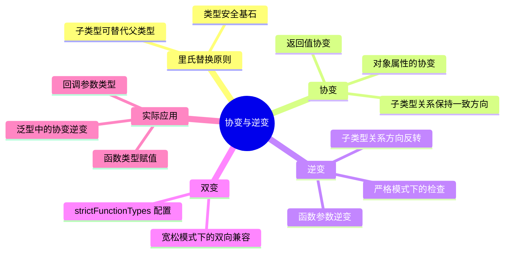

# TypeScript 协变与逆变

## 知识架构



## 概述

在 [全面梳理类型系统的层级关系:从 Top Type 到 Bottom Type](https://juejin.cn/book/7086408430491172901/section/7100488161263878177) 一节中,我们分析了 TypeScript 类型系统自下而上的层级,比较了原始类型、联合类型、对象类型、内置类型等的层级关系。但是,一个重要的问题随之而来:**函数类型有类型层级吗?** 如果有,它的类型层级又是怎么样的?

考虑以下示例:

```typescript
type FooFunc = () => string;
type BarFunc = () => "literal types";
type BazFunc = (input: string) => number;
```

这些函数类型之间的兼容性如何?如何判断它们之间的类型关系?这一节,我们将深入探讨函数类型的类型层级,以及隐藏在这一比较幕后的核心理论——**协变(Covariance)与逆变(Contravariance)**。

**学习目标:**

- ✅ 理解函数类型的兼容性比较规则
- ✅ 掌握协变与逆变的核心概念
- ✅ 了解 TypeScript 中的相关配置选项
- ✅ 能够在实际项目中正确应用这些知识

> 📚 **本节代码见:** [Covariance and Contravariance](https://link.juejin.cn/?target=https%3A%2F%2Fgithub.com%2Flinbudu599%2FTypeScript-Tiny-Book%2Ftree%2Fmain%2Fpackages%2F12-covariance-and-contravariance)

## 前置知识

在深入学习本节内容前,你需要了解以下概念:

### 必备知识

1. **TypeScript 类型基础** - 理解基本类型、接口、类型别名等
2. **类型层级关系** - 了解父子类型、联合类型等概念
3. **面向对象基础** - 理解类继承、多态等概念

### 核心概念回顾

#### 里氏替换原则

**里氏替换原则(Liskov Substitution Principle, LSP):** 子类可以扩展父类的功能,但不能改变父类原有的功能。子类型(subtype)必须能够替换掉它们的基类型(base type)。

```typescript
class Animal {
  asPet() {}
}

class Dog extends Animal {
  bark() {}
}

class Corgi extends Dog {
  cute() {}
}

// ✅ 子类型可以替换父类型
const animal: Animal = new Dog();
const dog: Dog = new Corgi();

// ❌ 父类型不能替换子类型
// const corgi: Corgi = new Dog(); // Error
```

#### 类型兼容性规则

**核心原则:** 如果一个值能够被赋值给某个类型的变量,那么可以认为这个值的类型为此变量类型的子类型。

```typescript
function makeDogBark(dog: Dog) {
  dog.bark();
}

// ✅ 正确: 传入子类型
makeDogBark(new Corgi());

// ❌ 错误: 不能传入父类型
// makeDogBark(new Animal()); // Error: Property 'bark' is missing
```

## 核心概念

### 术语对照表

| 中文术语 | 英文术语 | 说明 |
|---------|---------|------|
| 协变 | Covariance | 类型关系保持一致的变化 |
| 逆变 | Contravariance | 类型关系发生逆转的变化 |
| 双变 | Bivariance | 协变与逆变都被接受 |
| 不变 | Invariance | 类型之间无法进行分配 |
| 子类型 | Subtype | 更具体的类型 |
| 基类型 | Base Type / Supertype | 更通用的类型 |

### 类型变化关系图

```
基础类型关系: Corgi ≼ Dog ≼ Animal

包装后的类型关系:

协变(Covariance):
┌─────────────────────────────────┐
│ 如果 A ≼ B                      │
│ 则 Wrapper<A> ≼ Wrapper<B>     │
│ (关系保持一致)                   │
└─────────────────────────────────┘

逆变(Contravariance):
┌─────────────────────────────────┐
│ 如果 A ≼ B                      │
│ 则 Wrapper<B> ≼ Wrapper<A>     │
│ (关系发生逆转)                   │
└─────────────────────────────────┘
```

## 函数类型比较

### 问题引入

对于函数类型的比较,我们不会将函数类型与其他类型(如对象类型)进行比较,而是专注于两个函数类型之间的比较。

#### 示例场景

定义三个具有层级关系的类:

```typescript
class Animal {
  asPet() {}
}

class Dog extends Animal {
  bark() {}
}

class Corgi extends Dog {
  cute() {}
}
```

定义一个接受 Dog 类型并返回 Dog 类型的函数:

```typescript
type DogFactory = (args: Dog) => Dog;
```

简化表示为: `Dog -> Dog`

### 排列组合分析

对于 Animal、Dog、Corgi 这三个类,如果将它们分别放置在参数类型与返回值类型处,可以得到以下函数签名类型:

| 参数类型 | 返回值类型 | 函数签名 |
|---------|-----------|---------|
| Animal | Animal | Animal -> Animal |
| Animal | Dog | Animal -> Dog |
| Animal | Corgi | Animal -> Corgi |
| Dog | Animal | Dog -> Animal |
| Dog | Dog | Dog -> Dog (基准) |
| Dog | Corgi | Dog -> Corgi |
| Corgi | Animal | Corgi -> Animal |
| Corgi | Dog | Corgi -> Dog |
| Corgi | Corgi | Corgi -> Corgi |

> 💡 **注意:** `Dog -> Dog` 作为基准类型,用于被其他类型比较

### 兼容性判断方法

引入辅助函数来判断兼容性:

```typescript
function transformDogAndBark(dogFactory: DogFactory) {
  const dog = dogFactory(new Dog()); // 传入 Dog 实例
  dog.bark(); // 调用返回值的 bark 方法
}
```

**约束条件分析:**

1. **参数约束:** 只会传入 `Dog` 类型(但不限定具体品种)
2. **返回值约束:** 返回的必须能调用 `bark()` 方法(即必须是 Dog 或其子类型)

### 逐个验证

#### ❌ 返回值不满足的情况

```typescript
// Animal -> Animal
// 返回值是 Animal,不能保证有 bark() 方法
type WrongReturn1 = (args: Animal) => Animal;

// Dog -> Animal
// 返回值是 Animal,不能保证有 bark() 方法
type WrongReturn2 = (args: Dog) => Animal;

// Corgi -> Animal
// 返回值是 Animal,不能保证有 bark() 方法
type WrongReturn3 = (args: Corgi) => Animal;
```

**结论:** 所有返回 `Animal` 类型的函数签名都不满足要求。

#### ❌ 参数不满足的情况

```typescript
// Corgi -> Dog
// 参数需要 Corgi,但我们可能传入其他品种的狗
type WrongParam1 = (args: Corgi) => Dog;

// Corgi -> Corgi
// 参数需要 Corgi,但我们可能传入其他品种的狗
type WrongParam2 = (args: Corgi) => Corgi;
```

**问题:** 函数内部可能依赖 `Corgi` 的特有属性(如腿短),但我们传入的可能是 `GermanShepherd`(德牧),导致程序崩溃。

#### ✅ 满足条件的情况

```typescript
// Animal -> Dog ✅
// 参数能接受 Dog(因为 Dog 是 Animal 的子类型)
// 返回值是 Dog,能调用 bark()
type Valid1 = (args: Animal) => Dog;

// Animal -> Corgi ✅
// 参数能接受 Dog
// 返回值是 Corgi,能调用 bark()
type Valid2 = (args: Animal) => Corgi;

// Dog -> Corgi ✅
// 参数接受 Dog
// 返回值是 Corgi,能调用 bark()
type Valid3 = (args: Dog) => Corgi;
```

### 核心结论

经过分析,我们发现:

| 位置 | 允许的类型关系 | 说明 |
|-----|---------------|------|
| **参数类型** | 允许为父类型 | 更宽松的输入要求 |
| **返回值类型** | 允许为子类型 | 更具体的输出承诺 |

**最终结论:** 参数类型为 Dog 的父类型、返回值类型为 Dog 的子类型的组合均成立，如 `(Animal → Corgi) ≼ (Dog → Dog)`、`(Animal → Dog) ≼ (Dog → Dog)`、`(Dog → Corgi) ≼ (Dog → Dog)`

> 📝 **符号说明:** `A ≼ B` 表示 A 是 B 的子类型

## 协变与逆变详解

### 定义与原理

#### 协变(Covariance)

**定义:** 如果有 `A ≼ B`,则 `Wrapper<A> ≼ Wrapper<B>`,即包装后的类型关系保持一致。

**在函数返回值中的体现:**

```typescript
// Corgi ≼ Dog
// (T -> Corgi) ≼ (T -> Dog) ✅
```

**验证示例:**

```typescript
type AsFuncReturnType<T> = (arg: unknown) => T;

// 成立: 返回值类型遵循协变
type CheckReturnType = AsFuncReturnType<Corgi> extends AsFuncReturnType<Dog>
  ? "Covariant" 
  : "Error";
// 结果: "Covariant"
```

#### 逆变(Contravariance)

**定义:** 如果有 `A ≼ B`,则 `Wrapper<B> ≼ Wrapper<A>`,即包装后的类型关系发生逆转。

**在函数参数中的体现:**

```typescript
// Dog ≼ Animal
// (Animal -> T) ≼ (Dog -> T) ✅
```

**验证示例:**

```typescript
type AsFuncArgType<T> = (arg: T) => void;

// 成立: 参数类型遵循逆变
type CheckArgType = AsFuncArgType<Animal> extends AsFuncArgType<Dog>
  ? "Contravariant" 
  : "Error";
// 结果: "Contravariant"
```

### 可视化理解

```
类型层级关系:
    Animal (父类型)
       ↑
      Dog
       ↑
    Corgi (子类型)

函数返回值 - 协变:
    (T -> Corgi) ≼ (T -> Dog)
    关系保持: 子 -> 子, 父 -> 父

函数参数 - 逆变:
    (Animal -> T) ≼ (Dog -> T)  
    关系逆转: 父 -> 子, 子 -> 父
```

### 为什么参数要逆变?

**理解方式:** 从使用者的角度思考

```typescript
// 假设我们需要一个处理 Dog 的函数
type DogHandler = (dog: Dog) => void;

// ✅ 可以传入能处理 Animal 的函数
// 因为这个函数能处理所有动物,当然能处理 Dog
const animalHandler: DogHandler = (animal: Animal) => {
  animal.asPet();
};

// ❌ 不能传入只能处理 Corgi 的函数
// 因为这个函数可能依赖 Corgi 的特性
// 但我们可能会传入其他品种的狗
const corgiHandler: DogHandler = (corgi: Corgi) => {
  corgi.cute(); // 如果传入德牧,会出错
};
```

### 为什么返回值要协变?

**理解方式:** 从使用者的角度思考

```typescript
// 假设我们需要一个返回 Dog 的函数
type DogCreator = () => Dog;

// ✅ 可以传入返回 Corgi 的函数
// 因为 Corgi 是 Dog,满足所有 Dog 的要求
const corgiCreator: DogCreator = () => new Corgi();

// ❌ 不能传入返回 Animal 的函数
// 因为 Animal 不一定有 Dog 的所有特性
const animalCreator: DogCreator = () => new Animal();
// Error: Type 'Animal' is not assignable to type 'Dog'
```

## 配置与实践

### strictFunctionTypes 配置

#### 配置说明

```json
// tsconfig.json
{
  "compilerOptions": {
    "strictFunctionTypes": true
  }
}
```

**作用:** 在比较两个函数类型是否兼容时,对函数参数进行更严格的检查(启用逆变检查)。

#### 配置对比

| 配置状态 | 参数检查方式 | 说明 |
|---------|-------------|------|
| `strictFunctionTypes: false` | 双变(Bivariant) | 逆变和协变都被接受 |
| `strictFunctionTypes: true` | 逆变(Contravariant) | 只接受逆变关系 |

#### 示例演示

```typescript
function fn(dog: Dog) {
  dog.bark();
}

type CorgiFunc = (input: Corgi) => void;
type AnimalFunc = (input: Animal) => void;

// strictFunctionTypes: false
const func1: CorgiFunc = fn; // ✅ 允许(双变)
const func2: AnimalFunc = fn; // ✅ 允许(双变)

// strictFunctionTypes: true
const func3: CorgiFunc = fn; // ✅ 正确(逆变检查：fn 的参数 Dog 是 Corgi 的父类型)
// const func4: AnimalFunc = fn; // ❌ 错误(逆变检查：Dog 不是 Animal 的父类型)
```

**等价关系:**

```typescript
// func1/func3 的赋值等价于: (Dog -> T) ≼ (Corgi -> T)
// 参数逆变要求 Corgi ≼ Dog，成立，严格模式下合法

// func2/func4 的赋值等价于: (Dog -> T) ≼ (Animal -> T)
// 参数逆变要求 Animal ≼ Dog，不成立，严格模式下报错
```

### 接口声明方式

#### Method vs Property

```typescript
// ❌ Method 声明 - 使用双变检查
interface MethodStyle {
  func(arg: string): number;
  // 等价于: func: {(arg: string): number}
}

// ✅ Property 声明 - 使用逆变检查(需要开启 strictFunctionTypes)
interface PropertyStyle {
  func: (arg: string) => number;
}
```

#### TypeScript ESLint 规则

推荐使用 [method-signature-style](https://github.com/typescript-eslint/typescript-eslint/blob/main/packages/eslint-plugin/docs/rules/method-signature-style.md) 规则:

```json
// .eslintrc.json
{
  "rules": {
    "@typescript-eslint/method-signature-style": ["error", "property"]
  }
}
```

### 为什么内置类型使用 Method 声明?

#### Array 示例分析

```typescript
interface Array<T> {
  push(...items: T[]): number;
  // 如果是 property 声明并启用严格检查
  // push: (...items: T[]) => number;
}
```

**问题:** 如果使用严格逆变检查,会导致数组类型不兼容:

```typescript
// 假设启用严格逆变检查
const dogs: Dog[] = [new Dog()];
const animals: Animal[] = dogs; // ❌ 会报错!

// 原因分析:
// Dog[].push ≼ Animal[].push 是否成立?
// 等价于: (...items: Dog[]) => number ≼ (...items: Animal[]) => number
// 逆变检查: Animal[] ≼ Dog[] ? 不成立!
```

**解决方案:** 使用 method 声明,保持双变检查:

```typescript
// ✅ 使用 method 声明,数组类型兼容
const dogs: Dog[] = [new Dog()];
const animals: Animal[] = dogs; // 正确
```

## 实际应用场景

### 场景1: 事件处理器

```typescript
// ❌ 错误示例
type MouseEventHandler = (event: MouseEvent) => void;

const handler: MouseEventHandler = (event: UIEvent) => {
  // Error: UIEvent 缺少 MouseEvent 的特有属性
  console.log(event.clientX); // clientX 只存在于 MouseEvent
};

// ✅ 正确示例
const correctHandler: MouseEventHandler = (event: Event) => {
  // Event 是 MouseEvent 的父类型
  // 可以安全地处理 MouseEvent
  console.log(event.type);
};
```

### 场景2: 数据转换管道

```typescript
// 数据转换函数类型
type Transformer<Input, Output> = (input: Input) => Output;

// 基础类型
type BaseData = { id: string };
type UserData = BaseData & { name: string };
type AdminData = UserData & { permissions: string[] };

// ✅ 正确使用协变(返回值)
const userTransformer: Transformer<BaseData, UserData> = (input) => ({
  ...input,
  name: "Unknown",
});

// ✅ 正确使用逆变(参数)
const adminTransformer: Transformer<UserData, AdminData> = (input) => ({
  ...input,
  permissions: [],
});

// 组合使用
type DataProcessor = Transformer<BaseData, AdminData>;
const processor: DataProcessor = (input) => ({
  id: input.id,
  name: "Admin",
  permissions: ["read", "write"],
});
```

### 场景3: 回调函数类型

```typescript
// 异步数据加载器
type DataLoader<T> = (callback: (data: T) => void) => void;

// 基础类型
interface Response {
  status: number;
}

interface UserResponse extends Response {
  data: {
    name: string;
    email: string;
  };
}

// ✅ 正确使用
const loader: DataLoader<UserResponse> = (callback) => {
  // 模拟异步加载
  callback({
    status: 200,
    data: { name: "John", email: "john@example.com" },
  });
};

// 可以传入接受父类型回调的函数
const callback = (response: Response) => {
  console.log(response.status);
};

loader(callback); // ✅ 类型安全
```

### 场景4: 依赖注入

```typescript
// 服务接口
interface Logger {
  log(message: string): void;
}

interface Database {
  query(sql: string): any[];
}

// 依赖容器
type ServiceFactory<T> = (container: Container) => T;

interface Container {
  get<T>(factory: ServiceFactory<T>): T;
}

// ✅ 服务注册示例
const loggerFactory: ServiceFactory<Logger> = (container) => ({
  log: (msg) => console.log(msg),
});

// 更具体的容器类型
interface AppContainer extends Container {
  register<T>(token: string, factory: ServiceFactory<T>): void;
}

// ❌ 反例：不能将只接受 AppContainer 的工厂赋给接受任意 Container 的工厂类型
// (AppContainer -> Logger) ≼ (Container -> Logger) 要求参数逆变成立，
// 即 Container ≼ AppContainer，而 Container 是 AppContainer 的父类型，方向相反
// 严格模式下报错：Property 'register' is missing in type 'Container'
// const appLoggerFactory: ServiceFactory<Logger> = (
//   container: AppContainer
// ) => ({
//   log: (msg) => console.log(`[${Date.now()}] ${msg}`),
// });

// ✅ 正确：参数逆变下，能处理所有 Container 的工厂可以赋给只需处理 AppContainer 的位置
// (Container -> Logger) ≼ (AppContainer -> Logger)，因为 AppContainer ≼ Container
const containerLoggerFactory: (container: AppContainer) => Logger = (
  container: Container
) => ({
  log: (msg) => console.log(`[${Date.now()}] ${msg}`),
});
```

### 场景5: 高阶函数

```typescript
// 函数装饰器
type Decorator<T extends any[], R> = (
  fn: (...args: T) => R
) => (...args: T) => R;

// 日志装饰器
const withLogging: Decorator<[string, number], void> = (fn) => {
  return (...args) => {
    console.log("Calling with:", args);
    fn(...args);
  };
};

// ✅ 可以用于更宽松的参数类型
const logDecorator: Decorator<[any, any], void> = (fn) => {
  return (...args) => {
    console.log("Logged:", args);
    fn(args[0], args[1]);
  };
};
```

## 常见问题解答

### Q1: 为什么我的函数类型赋值时报错?

**问题:**

```typescript
type StringHandler = (input: string) => void;

const handler: StringHandler = (input: any) => {
  console.log(input);
}; // ✅ 没问题

const handler2: StringHandler = (input: "literal") => {
  console.log(input);
}; // ❌ 报错
```

**原因:** 参数类型使用了字面量类型,比目标类型更严格,不满足逆变要求。

**解决:**

```typescript
// ✅ 正确: 参数使用父类型或相同类型
const handler3: StringHandler = (input: string | number) => {
  if (typeof input === "string") console.log(input);
};
```

### Q2: 什么时候应该启用 strictFunctionTypes?

**建议:**

- ✅ **推荐启用** - 在新项目中,或者项目代码质量要求较高时
- ⚠️ **谨慎启用** - 在遗留项目中,可能会引入大量类型错误

**启用步骤:**

```json
// tsconfig.json
{
  "compilerOptions": {
    "strict": true, // 自动启用 strictFunctionTypes
    // 或者单独启用
    "strictFunctionTypes": true
  }
}
```

### Q3: 如何处理泛型函数的类型兼容?

**问题:**

```typescript
function identity<T>(arg: T): T {
  return arg;
}

type StringIdentity = (arg: string) => string;
type NumberIdentity = (arg: number) => number;

const strId: StringIdentity = identity; // ✅
const numId: NumberIdentity = identity; // ✅

// 但这两个类型之间不兼容
const wrong: NumberIdentity = ((arg: string) => arg); // ❌
```

**解决:** 理解泛型的实例化过程:

```typescript
// identity<string> 实例化后的类型是 (arg: string) => string
// identity<number> 实例化后的类型是 (arg: number) => number

// 这两个实例化后的类型之间不兼容(兄弟类型关系)
```

### Q4: 为什么数组是协变的?

**回答:** 数组在读取位置是协变的;按类型安全的要求,写入位置应当是不变的,但 TypeScript 并未对此强制检查,因此可能出现不健全的写入:

```typescript
// ✅ 读取 - 协变
const dogs: Dog[] = [new Dog()];
const animals: Animal[] = dogs; // 允许

// ❌ 写入 - 不变
animals.push(new Animal()); // 运行时可能导致问题!

// TypeScript 通过 method 声明来放宽这个限制
// 但在运行时可能会出现类型安全问题
```

### Q5: 如何理解联合类型的协变和逆变?

**示例:**

```typescript
type Union = string | number;

// 联合类型作为返回值 - 协变
type ReturnUnion = () => string | number;
type ReturnString = () => string;

const r1: ReturnUnion = (() => "hello") as ReturnString; // ✅
const r2: ReturnString = (() => "hello" as string | number); // ❌

// 联合类型作为参数 - 逆变
type ParamUnion = (input: string | number) => void;
type ParamString = (input: string) => void;

const p1: ParamUnion = ((input: string) => {}) as ParamString; // ❌
const p2: ParamString = ((input: string | number) => {}) as ParamUnion; // ✅
```

**规则:** 联合类型中,类型范围越宽,作为参数时越能接受,作为返回值时越不具体。

## 最佳实践

### 1. 接口声明规范

```typescript
// ✅ 推荐: 使用 property 声明
interface GoodInterface {
  // 回调函数、事件处理器等
  onClick: (event: MouseEvent) => void;
  onSuccess: (data: Response) => void;
  onError: (error: Error) => void;
}

// ❌ 避免: 使用 method 声明(除非有特殊需求)
interface AvoidInterface {
  onClick(event: MouseEvent): void;
}
```

### 2. 函数类型设计

```typescript
// ✅ 好的设计: 参数宽松,返回值严格
type GoodFunc = (input: Base) => Specific;

// ❌ 不好的设计: 参数严格,返回值宽松
type BadFunc = (input: Specific) => Base;
```

### 3. 使用工具类型辅助验证

```typescript
// 验证类型兼容性的工具类型
type IsAssignable<T, U> = T extends U ? true : false;

// 验证协变
type IsCovariant<T, U> = IsAssignable<
  () => T,
  () => U
>;

// 验证逆变
type IsContravariant<T, U> = IsAssignable<
  (arg: U) => void,
  (arg: T) => void
>;

// 使用示例
type Test1 = IsCovariant<Corgi, Dog>; // true
type Test2 = IsContravariant<Dog, Animal>; // true
```

### 4. 配置推荐

```json
// tsconfig.json
{
  "compilerOptions": {
    "strict": true,
    "strictFunctionTypes": true,
    "noImplicitAny": true
  }
}
```

```json
// .eslintrc.json
{
  "rules": {
    "@typescript-eslint/method-signature-style": ["error", "property"],
    "@typescript-eslint/strict-boolean-expressions": "error"
  }
}
```

### 5. 类型断言的使用

```typescript
// ✅ 在明确知道类型安全时使用双重断言
const handler: (input: string) => void = 
  ((input: unknown) => {
    if (typeof input === "string") {
      console.log(input);
    }
  }) as (input: string) => void;

// ❌ 避免滥用断言绕过类型检查
const bad = ((input: number) => input) as any as (input: string) => string;
```

## 总结

### 核心要点

1. **协变(Covariance):** 类型关系保持一致的变化,应用于函数返回值类型
2. **逆变(Contravariance):** 类型关系发生逆转的变化,应用于函数参数类型
3. **双变(Bivariance):** 协变和逆变都被接受,默认模式或 method 声明
4. **不变(Invariance):** 类型之间无法分配,严格的类型约束

### 记忆口诀

```
参数逆变要宽松,返回协变要严格。
父类参数能接受,子类返回可提供。
严格检查开配置,property 声明更安全。
```

### 配置建议表

| 场景 | strictFunctionTypes | 声明方式 | 说明 |
|-----|-------------------|---------|------|
| 新项目 | `true` | property | 最严格的类型检查 |
| 遗留项目 | `false` | method | 兼容旧代码 |
| 库开发 | `true` | property | 提供更好的类型安全 |
| 应用开发 | `true` | property | 减少运行时错误 |

### 检查清单

在编写函数类型时,请检查以下内容:

- [ ] 参数类型是否比目标类型更宽松(父类型或相同)?
- [ ] 返回值类型是否比目标类型更严格(子类型或相同)?
- [ ] 是否使用了 property 而非 method 声明?
- [ ] 是否启用了 `strictFunctionTypes` 配置?
- [ ] 是否理解了为什么内置类型使用 method 声明?

## 扩展阅读

### 联合类型与兄弟类型下的比较

在上面我们只关注了显式的父子类型关系,实际上在类型层级中还有隐式的父子类型关系(联合类型)以及兄弟类型(同一基类的两个派生类)。

#### 联合类型

对于隐式的父子类型(如 `string` 与 `string | number`),仍然可以沿用显式的父子类型协变与逆变判断:

```typescript
type Union = string | number;

// ✅ 协变示例
type CovariantExample = () => string;
const covariant: () => Union = (() => "hello") as CovariantExample;

// ✅ 逆变示例
type ContravariantExample = (input: Union) => void;
const contravariant: (input: string) => void = ((input: Union) => {}) as ContravariantExample;
```

#### 兄弟类型

对于兄弟类型(如 Dog 与 Cat),它们**不满足逆变与协变的发生条件**:

```typescript
class Cat extends Animal {
  meow() {}
}

// ❌ 兄弟类型之间不兼容
type DogFunc = (dog: Dog) => void;
type CatFunc = (cat: Cat) => void;

const dogFunc: DogFunc = (cat: Cat) => {}; // Error
const catFunc: CatFunc = (dog: Dog) => {}; // Error
```

### 非函数签名包装类型的变换

我们在前面主要以函数体作为包装类型来讨论协变与逆变,现在考虑其他包装类型。

#### 泛型容器示例

```typescript
interface Cage<T> {
  value: T;
  add: (item: T) => void;
}
```

**场景分析:**

1. **只读容器(协变):**

```typescript
interface ReadonlyCage<T> {
  readonly value: T;
  // 没有 add 方法
}

// ✅ 协变成立
const dogCage: ReadonlyCage<Dog> = { value: new Dog() };
const animalCage: ReadonlyCage<Animal> = dogCage; // OK
```

**原理:** 只读操作只需要读取,更具体的类型(Dog)总能满足更宽泛的类型(Animal)。

2. **可写容器(不变):**

```typescript
// 使用 property 声明（严格逆变检查生效；method 声明会因双变而放行）
interface WriteOnlyCage<T> {
  add: (item: T) => void;
}

// ❌ 不变（在 property 声明 + strictFunctionTypes 下）
const dogCage: WriteOnlyCage<Dog> = {
  add: (dog: Dog) => {}
};
const animalCage: WriteOnlyCage<Animal> = dogCage; // Error!

// 因为:
// animalCage.add(new Animal()); // 类型不安全
```

**原理:** 写入操作要求参数类型,如果允许赋值,可能会写入不兼容的类型。

3. **读写容器(不变):**

```typescript
// 使用 property 声明
interface Cage<T> {
  value: T;
  add: (item: T) => void;
}

// ❌ 既不能协变也不能逆变（在 property 声明 + strictFunctionTypes 下）
const dogCage: Cage<Dog> = {
  value: new Dog(),
  add: (dog: Dog) => {}
};
const animalCage: Cage<Animal> = dogCage; // Error
```

#### TypeScript 中的解决方案

TypeScript 使用 `readonly` 修饰符来标记协变位置:

```typescript
interface Array<T> {
  // 读取 - 协变位置
  [index: number]: T;
  readonly length: number;
  
  // 写入 - 不变位置
  push(...items: T[]): number;
}

// 实际上,数组在读取时是协变的
const dogs: Dog[] = [new Dog()];
const animals: Animal[] = dogs; // ✅ 允许,但类型不安全

// TypeScript 通过 method 声明来放宽写入的限制
```

#### 使用变型注解

一些语言(如 Scala、Kotlin)支持变型注解:

```typescript
// 假设的语法(TypeScript 不支持)
interface Covariant<out T> {
  // T 只能出现在输出位置
  getValue(): T;
}

interface Contravariant<in T> {
  // T 只能出现在输入位置
  setValue(value: T): void;
}
```

TypeScript 通过结构性类型系统自动推断变型:

```typescript
// 协变类型
type Producer<T> = () => T;

// 逆变类型
type Consumer<T> = (value: T) => void;

// 不变类型
type Container<T> = {
  get(): T;
  set(value: T): void;
};
```

### 进阶话题

#### 函数重载与变型

```typescript
// 函数重载的类型检查
interface Overloaded {
  (input: string): string;
  (input: number): number;
}

const fn: Overloaded = (input: string | number) => {
  return input;
};

// 重载类型的兼容性检查更加严格
```

#### 条件类型中的变型

```typescript
type Conditional<T> = T extends string 
  ? (input: string) => T 
  : (input: number) => T;

// 条件类型的变型分析很复杂,需要具体实例化后判断
```

### 双向协变与不变详解

#### 双向协变（Bivariant）

⚠️ **双向协变曾是 `strictFunctionTypes`（TypeScript 2.6 引入）出现之前的行为**：函数参数既支持逆变又支持协变，即父子类型之间可以双向赋值。如今只要开启 `strict`（或单独开启 `strictFunctionTypes`），函数参数就按逆变检查。

```typescript
interface Person {
    name: string;
    age: number;
}

interface Guang extends Person {
    hobbies: string[];
}

// 函数参数的双向协变示例
let printHobbies: (guang: Guang) => void;
let printName: (person: Person) => void;

// strictFunctionTypes: false 时，两种赋值都可以：
// printName = printHobbies; // ✅ 双向协变时允许（但不安全！）
// printHobbies = printName; // ✅ 双向协变时允许（安全）

// strictFunctionTypes: true 时，只有逆变允许：
// printName = printHobbies; // ❌ 严格模式下报错（协变方向）
// printHobbies = printName; // ✅ 严格模式下正确（逆变方向）
```

**为什么双向协变不安全？** 因为如果将参数更具体的函数赋值给参数更宽松的函数类型，调用时传入宽松类型的值，函数内部可能访问具体类型特有的属性：

```typescript
// ❌ 双向协变的风险
const printHobbiesFn = (guang: Guang) => {
    console.log(guang.hobbies); // 访问 Guang 特有属性
};

// 如果允许双向协变：
let printPerson: (person: Person) => void = printHobbiesFn;
printPerson({ name: 'test', age: 20 }); // 运行时打印 undefined！hobbies 不存在，逻辑出错
```

**strictFunctionTypes 的历史背景**：TypeScript 2.x 之前默认允许双向协变，这是为了保持与 JavaScript 代码的兼容性。但从类型安全角度，这显然有问题，因此引入了 `strictFunctionTypes` 选项，在 `strict: true` 时自动启用。

#### 不变（Invariant）

⚠️ **不变是指非父子类型之间不会发生型变**，只要类型不一样就会报错。这是最严格的类型关系。

```typescript
// 不变示例：非父子类型之间无法赋值
interface Dog {
    bark(): void;
}

interface Cat {
    meow(): void;
}

// Dog 和 Cat 是兄弟类型，不是父子类型
// 它们之间是不变的，不能互相赋值
const dog: Dog = { bark() {} };
// const cat: Cat = dog; // ❌ 报错：类型不兼容

// 泛型容器的不变性
interface Container<T> {
    get(): T;
    set(value: T): void;
}

// Container<Dog> 和 Container<Cat> 也是不变的
// const dogContainer: Container<Dog> = ...;
// const catContainer: Container<Cat> = dogContainer; // ❌ 报错
```

**不变在实际中的应用：**

```typescript
// 只读容器 → 协变（可读不可写，子类型可赋值给父类型）
interface ReadonlyContainer<T> {
    readonly value: T;
}

const dogReadonly: ReadonlyContainer<Dog> = { value: { bark() {} } };
// const animalReadonly: ReadonlyContainer<Animal> = dogReadonly; // ✅ 协变

// 只写容器 → 逆变（可写不可读，父类型可赋值给子类型）
interface WriteOnlyContainer<T> {
    set(value: T): void;
}

// 读写容器 → 不变（既读又写，类型必须完全一致；property 声明 + strictFunctionTypes 下）
interface ReadWriteContainer<T> {
    get: () => T;
    set: (value: T) => void;
}

// ReadWriteContainer<Dog> 和 ReadWriteContainer<Animal> 之间不变
// 不能互相赋值
```

**型变总结表：**

| 型变类型 | 方向 | 类型安全 | 适用场景 | strictFunctionTypes |
|---------|------|---------|---------|-------------------|
| **协变** | 子 → 父 | ✅ 安全 | 返回值、只读属性 | 无关 |
| **逆变** | 父 → 子 | ✅ 安全 | 函数参数 | 启用时生效 |
| **双向协变** | 子 ↔ 父 | ❌ 不安全 | 旧代码兼容 | 关闭时生效 |
| **不变** | 无 | ✅ 安全 | 非父子类型 | 无关 |

### 参考资料

- [TypeScript 官方文档 - Type Compatibility](https://www.typescriptlang.org/docs/handbook/type-compatibility.html)
- [TypeScript 官方文档 - strictFunctionTypes](https://www.typescriptlang.org/tsconfig#strictFunctionTypes)
- [TypeScript ESLint - method-signature-style](https://github.com/typescript-eslint/typescript-eslint/blob/main/packages/eslint-plugin/docs/rules/method-signature-style.md)
- [Wikipedia - Covariance and contravariance](https://en.wikipedia.org/wiki/Covariance_and_contravariance_(computer_science))

---

**下节预告:** 类型工具、类型系统、类型编程这三辆马车我们已经解决了俩,在下一节,我们就将开始进入类型编程的世界里,此前我们所学的所有类型工具与类型系统知识将轮番上阵接受考验!
