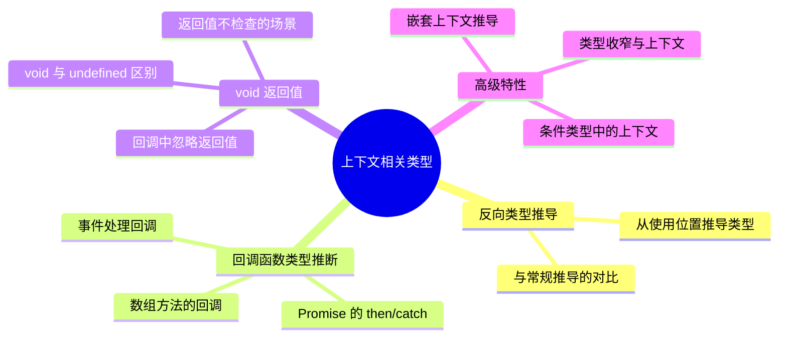

# TypeScript 上下文相关类型

## 知识架构



## 概述

TypeScript 拥有非常强大的类型推导能力。通常，这些类型推导依赖开发者的输入，比如：

- **变量声明时的类型推导**
- **函数返回值的类型推导**
- **类型保护后的类型收窄**（typeof、instanceof等）

实际上，TypeScript 中还存在着另一种类型推导，它默默无闻却又无处不在，这就是本节的主角：**上下文类型(Contextual Typing)**。

### 什么是上下文类型?

**上下文类型**是一种**反向的类型推导机制**，它基于值所在的上下文位置，自动推导出该值应该具有的类型。与传统的"根据右侧值推导左侧类型"不同，上下文类型是"根据左侧类型约束右侧值"。

### 核心特点

| 特性 | 说明 |
|-----|------|
| **方向性** | 从上下文到值（反向推导） |
| **位置性** | 基于位置进行类型匹配 |
| **约束性** | 规范开发者的使用方式 |
| **智能性** | 自动推导,无需显式声明 |

### 学习目标

通过本节学习,你将掌握:

- ✅ 理解上下文类型的工作原理
- ✅ 掌握上下文类型的应用场景
- ✅ 了解上下文类型的限制与边界情况
- ✅ 能够在实际项目中正确利用上下文类型
- ✅ 理解 void 返回值类型的特殊行为

> 📚 **本节代码见:** [Contextual Typings](https://link.juejin.cn/?target=https%3A%2F%2Fgithub.com%2Flinbudu599%2FTypeScript-Tiny-Book%2Ftree%2Fmain%2Fpackages%2F11-contextual-typing)

## 前置知识

在深入学习本节内容前,你需要了解以下概念:

### 必备知识

1. **TypeScript 基础类型** - string、number、boolean等基本类型
2. **函数类型签名** - 理解参数类型和返回值类型
3. **类型推导基础** - 了解 TypeScript 自动推导类型的机制
4. **接口与类型别名** - 理解如何定义类型结构

### 类型推导对比

```
传统类型推导（正向）:
┌──────────────────────────────┐
│ 右侧表达式 → 左侧变量类型    │
│ 根据值推导类型               │
└──────────────────────────────┘

上下文类型推导（反向）:
┌──────────────────────────────┐
│ 左侧类型 → 右侧表达式类型    │
│ 根据位置约束类型             │
└──────────────────────────────┘
```

### 术语对照表

| 中文术语 | 英文术语 | 说明 |
|---------|---------|------|
| 上下文类型 | Contextual Typing | 基于上下文位置的类型推导 |
| 类型推导 | Type Inference | 自动推导类型的机制 |
| 类型注解 | Type Annotation | 显式声明的类型 |
| 函数签名 | Function Signature | 函数的类型定义 |
| 位置匹配 | Positional Matching | 基于位置的类型对应关系 |

## 核心概念

### 工作原理

上下文类型的核心原理是**基于位置的类型匹配**:

```
类型定义位置      实现位置
    ↓              ↓
(arg1: T1, arg2: T2) => R
    ↓              ↓
(arg1,    arg2)    => value
    ↓              ↓
 推导为T1      推导为T2
```

### 基本示例

#### 示例1: 窗口事件处理

```typescript
// ✅ 上下文类型自动推导参数类型
window.onerror = (event, source, line, col, err) => {
  // event: Event | string
  // source: string | undefined
  // line: number | undefined
  // col: number | undefined
  // err: Error | undefined
  console.log(event, source, line, col, err);
};
```

**类型定义来源:**

```typescript
interface Window {
  onerror: OnErrorEventHandlerNonNull;
}

interface OnErrorEventHandlerNonNull {
  (
    event: Event | string,
    source?: string,
    lineno?: number,
    colno?: number,
    error?: Error
  ): any;
}
```

#### 示例2: 自定义函数类型

```typescript
// 定义函数类型
type CustomHandler = (name: string, age: number) => boolean;

// ✅ 自动推导参数类型
const handler: CustomHandler = (arg1, arg2) => {
  // arg1: string
  // arg2: number
  // 返回值必须是 boolean
  return true;
};

// ❌ 返回值类型错误
const wrongHandler: CustomHandler = (name, age) => {
  // Error: 不能将类型"void"分配给类型"boolean"
  // 上下文类型会约束返回值
};
```

### 类型推导流程

```
┌─────────────────────────────────────┐
│  1. 解析左侧类型定义                │
│     (函数签名、接口、类型别名等)     │
└──────────────┬──────────────────────┘
               │
               ▼
┌─────────────────────────────────────┐
│  2. 提取参数位置和类型信息          │
│     参数1 → 类型1                   │
│     参数2 → 类型2                   │
│     返回值 → 返回类型                │
└──────────────┬──────────────────────┘
               │
               ▼
┌─────────────────────────────────────┐
│  3. 将类型信息应用到右侧表达式      │
│     位置匹配,逐个对应                │
└──────────────┬──────────────────────┘
               │
               ▼
┌─────────────────────────────────────┐
│  4. 类型检查和约束                  │
│     参数类型必须兼容                 │
│     返回值类型必须兼容               │
└─────────────────────────────────────┘
```

## 基础应用

### 应用场景1: 事件处理

```typescript
// DOM 事件处理
document.addEventListener('click', (event) => {
  // event: MouseEvent
  console.log(event.clientX, event.clientY);
});

// 表单提交
const form = document.querySelector('form')!;
form.addEventListener('submit', (event) => {
  // event: SubmitEvent
  event.preventDefault();
  console.log('Form submitted');
});

// 键盘事件
document.addEventListener('keydown', (event) => {
  // event: KeyboardEvent
  if (event.key === 'Escape') {
    console.log('Escape pressed');
  }
});
```

### 应用场景2: 数组方法

```typescript
const users = [
  { name: 'Alice', age: 30 },
  { name: 'Bob', age: 25 },
  { name: 'Charlie', age: 35 }
];

// forEach - 参数自动推导
users.forEach((user, index) => {
  // user: { name: string; age: number }
  // index: number
  console.log(`${index}: ${user.name}`);
});

// map - 返回值类型约束
const names: string[] = users.map((user) => {
  // user: { name: string; age: number }
  return user.name; // 必须返回 string
});

// filter - 条件约束
const adults = users.filter((user) => {
  // user: { name: string; age: number }
  return user.age >= 30; // 必须返回 boolean
});

// reduce - 累加器类型推导
const totalAge = users.reduce((sum, user) => {
  // sum: number (初始值决定)
  // user: { name: string; age: number }
  return sum + user.age;
}, 0); // 初始值为 number
```

### 应用场景3: Promise 处理

```typescript
// Promise.then
fetch('/api/users')
  .then((response) => {
    // response: Response
    return response.json();
  })
  .then((data) => {
    // data: any (需要手动指定类型)
    console.log(data);
  });

// 带类型的 Promise
interface User {
  id: number;
  name: string;
}

async function getUser(id: number): Promise<User> {
  const response = await fetch(`/api/users/${id}`);
  return response.json();
}

// 使用时自动推导
getUser(1).then((user) => {
  // user: User
  console.log(user.name);
});
```

### 应用场景4: 回调函数

```typescript
// 定时器
setTimeout(() => {
  // 自动推导为 TimerHandler
  console.log('Timeout!');
}, 1000);

// 自定义回调类型
type DataCallback = (data: string, timestamp: number) => void;

function processData(callback: DataCallback) {
  const data = 'sample data';
  const timestamp = Date.now();
  callback(data, timestamp);
}

// ✅ 使用上下文类型
processData((data, time) => {
  // data: string
  // time: number
  console.log(`${time}: ${data}`);
});
```

## 高级特性

### 特性1: 嵌套函数推导

上下文类型支持多层嵌套的函数类型推导:

```typescript
// 嵌套函数类型
declare let func: (raw: number) => (input: string) => any;

// ✅ 两层都能正确推导
func = (raw) => {
  // raw: number (第一层)
  return (input) => {
    // input: string (第二层)
    console.log(raw, input);
  };
};

// 实际应用: 高阶函数
type Validator<T> = (value: T) => boolean;
type ValidatorFactory = <T>(rules: string[]) => Validator<T>;

const createValidator: ValidatorFactory = (rules) => {
  // rules: string[]
  return (value) => {
    // value: T (泛型)
    return true;
  };
};
```

### 特性2: 参数个数限制

**规则:** 实现的参数个数可以少于定义,但不能多于定义。

```typescript
type Handler = (a: string, b: number, c: boolean) => void;

// ✅ 允许: 使用更少的参数
const h1: Handler = (a) => {
  // a: string
  console.log(a);
};

const h2: Handler = (a, b) => {
  // a: string, b: number
  console.log(a, b);
};

const h3: Handler = (a, b, c) => {
  // a: string, b: number, c: boolean
  console.log(a, b, c);
};

// ❌ 错误: 使用更多的参数
const h4: Handler = (a, b, c, d) => {
  // Error: 参数个数超出定义
  console.log(a, b, c, d);
};
```

**原因:** 基于位置匹配,超出定义的参数无法找到对应的位置。

### 特性3: 对象属性推导

```typescript
interface Config {
  timeout: number;
  retry: (times: number) => boolean;
  onError: (error: Error) => void;
}

// ✅ 对象字面量中的函数属性
const config: Config = {
  timeout: 3000,
  retry: (times) => {
    // times: number
    return times < 3;
  },
  onError: (error) => {
    // error: Error
    console.error(error.message);
  }
};

// ✅ 可选链调用
interface RequestOptions {
  onSuccess?: (data: unknown) => void;
  onError?: (error: Error) => void;
}

const options: RequestOptions = {
  onSuccess: (data) => {
    // data: unknown
    console.log('Success:', data);
  }
};
```

### 特性4: 泛型函数推导

```typescript
// 泛型函数类型
type Mapper<T, U> = (input: T) => U;

// 泛型接口
interface Container<T> {
  value: T;
  map<U>(fn: (value: T) => U): Container<U>;
}

// 使用工厂函数构造，map 方法内上下文类型仍然生效
function createContainer<T>(value: T): Container<T> {
  return {
    value,
    map(fn) {
      // fn: (value: T) => U（上下文推导）
      return createContainer(fn(value));
    }
  };
}

const container = createContainer(42); // Container<number>

// 调用时推导
const result = container.map((val) => {
  // val: number
  return val.toString(); // U 推导为 string
});
// result: Container<string>
```

### 特性5: void 返回值的特殊行为

**重要规则:** 当目标类型返回值为 `void` 时,实现可以返回任意类型,但调用结果仍然是 `void`。

```typescript
type VoidHandler = (name: string, age: number) => void;

// ✅ 都可以接受: 返回值类型被忽略
const handler1: VoidHandler = (name, age) => true;
const handler2: VoidHandler = (name, age) => 'linbudu';
const handler3: VoidHandler = (name, age) => null;
const handler4: VoidHandler = (name, age) => undefined;
const handler5: VoidHandler = (name, age) => ({ foo: 'bar' });

// 但调用结果的类型仍然是 void
const result1 = handler1('linbudu', 599); // void
const result2 = handler2('linbudu', 599); // void
const result3 = handler3('linbudu', 599); // void
```

**为什么允许这样做?**

```typescript
// 实际场景: 数组的 forEach 方法
const arr: number[] = [];
const list: number[] = [1, 2, 3];

// forEach 的回调返回值类型是 void
// push 方法返回 number (新长度)
list.forEach((item) => arr.push(item));
// ✅ 不报错,因为返回值被忽略

// 如果不允许,需要这样写:
list.forEach((item) => {
  arr.push(item); // 显式忽略返回值
});
```

**类型签名对比:**

```typescript
// Array.prototype.forEach 的类型定义
interface Array<T> {
  forEach(callbackfn: (value: T, index: number, array: T[]) => void): void;
}

// push 方法的返回值
interface Array<T> {
  push(...items: T[]): number; // 返回新长度
}
```

**设计理念:** 

> 对于一个 void 类型的函数,我们不会消费它的返回值,因此它返回什么都可以。这提升了代码的灵活性和实用性。

### 特性6: 联合类型的限制

上下文类型在某些联合类型情况下会失效:

```typescript
class Foo {
  foo!: number;
}

class Bar extends Foo {
  bar!: number;
}

// ❌ 联合的函数类型 - 上下文类型失效
let f1: { (input: Foo): void } | { (input: Bar): void };
// ❌ Error: Parameter 'input' implicitly has an 'any' type.（上下文签名缺失，严格模式下报错）
f1 = (input) => {
  console.log(input);
};

// ✅ 使用联合类型的参数
let f2: { (input: Foo | Bar): void };
f2 = (input) => {
  // input: Foo | Bar (推导成功)
};
```

**嵌套联合类型的特殊情况:**

```typescript
// ✅ 嵌套后反而能推导
let f3:
  | { (raw: number): (input: Foo) => void }
  | { (raw: number): (input: Bar) => void };

f3 = (raw) => {
  // raw: number
  return (input) => {
    // input: Bar (推导为更严格的子类型)
  };
};
```

**推导为 Bar 的原因:** 与协变、逆变有关。任何接收 Foo 类型参数的地方,都可以接收 Bar 类型参数,因此推导到 Bar 更安全。

## 实际应用场景

### 场景1: Express/Koa 中间件

```typescript
import { Request, Response, NextFunction } from 'express';

// ✅ 中间件参数自动推导
app.use((req, res, next) => {
  // req: Request
  // res: Response
  // next: NextFunction
  console.log(req.path);
  next();
});

// ✅ 错误处理中间件
app.use((err, req, res, next) => {
  // err: any
  // req: Request
  // res: Response
  // next: NextFunction
  res.status(500).json({ error: err.message });
});
```

### 场景2: React 事件处理

```tsx
import React from 'react';

function Form() {
  return (
    <form
      onSubmit={(event) => {
        // ✅ 内联回调：event: React.FormEvent<HTMLFormElement>（上下文类型）
        event.preventDefault();
        console.log('Form submitted');
      }}
    >
      <input
        onChange={(event) => {
          // event: React.ChangeEvent<HTMLInputElement>（上下文类型）
          console.log(event.target.value);
        }}
      />
      <button
        onClick={(event) => {
          // event: React.MouseEvent<HTMLButtonElement>（上下文类型）
          console.log('Button clicked');
        }}
      >
        Submit
      </button>
    </form>
  );
}
```

注意：如果把回调提取为独立的函数再传入 JSX 属性，参数将失去上下文（`const handleSubmit = (event) => {}` 会报隐式 any 错误），此时需要显式注解参数类型。

### 场景3: 数据库操作

```typescript
// 假设使用 Prisma
import { PrismaClient } from '@prisma/client';

const prisma = new PrismaClient();

// ✅ 查询回调自动推导
prisma.user.findMany({
  where: {
    age: { gt: 18 }
  }
}).then((users) => {
  // users: User[]
  console.log(users);
});

// ✅ 事务回调
prisma.$transaction(async (tx) => {
  // tx: Prisma.TransactionClient
  await tx.user.create({
    data: { name: 'Alice' }
  });
  await tx.post.create({
    data: { title: 'Hello' }
  });
});
```

### 场景4: 测试框架

```typescript
// Jest 示例
describe('UserService', () => {
  // ✅ 测试回调自动推导
  test('should create user', async () => {
    // 自动推导为 jest.DoneCallback
    const user = await createUser({ name: 'Alice' });
    expect(user.name).toBe('Alice');
  });

  // ✅ 钩子函数
  beforeEach(() => {
    // 自动推导参数类型
    console.log('Before each test');
  });

  afterEach(async () => {
    // 支持异步
    await cleanup();
  });
});
```

### 场景5: 函数式编程

```typescript
// Ramda 或类似库
import * as R from 'ramda';

// ✅ 管道函数
const pipeline = R.pipe(
  (x: number) => x + 1,      // x: number
  (x) => x * 2,              // x: number
  (x) => x.toString(),       // x: number
  (x) => `Result: ${x}`      // x: string
);

// ✅ 柯里化函数
const add = R.curry((a: number, b: number, c: number) => {
  return a + b + c;
});

const add5 = add(5);
const add5and3 = add5(3);
const result = add5and3(2); // 10
```

### 场景6: WebSocket 事件

```typescript
const ws = new WebSocket('ws://example.com');

// ✅ 连接事件
ws.onopen = (event) => {
  // event: Event
  console.log('Connected');
};

// ✅ 消息事件
ws.onmessage = (event) => {
  // event: MessageEvent
  console.log('Message:', event.data);
};

// ✅ 错误事件
ws.onerror = (event) => {
  // event: Event
  console.error('Error occurred');
};

// ✅ 关闭事件
ws.onclose = (event) => {
  // event: CloseEvent
  console.log('Disconnected', event.code, event.reason);
};
```

## 常见问题解答

### Q1: 为什么有时候参数会被推导为 any?

**问题:**

```typescript
let f1: { (input: Foo): void } | { (input: Bar): void };
// ❌ Error: Parameter 'input' implicitly has an 'any' type.
// 上下文签名失效后，参数既不是 Foo 也不是 Foo | Bar，严格模式下直接报错
f1 = (input) => {
  console.log(input);
};
```

**原因:** TypeScript 的上下文类型目前不支持对联合函数类型的参数进行合并推导。

**解决方案:**

```typescript
// ✅ 使用联合类型参数
let f2: { (input: Foo | Bar): void };
f2 = (input) => {
  // input: Foo | Bar
};

// ✅ 或者显式注解
f1 = (input: Foo | Bar) => {
  // 显式指定类型
};
```

### Q2: 为什么 void 返回值可以返回任意类型?

**回答:** 这是 TypeScript 的设计决策,基于实用性考虑:

1. **实际需求:** 很多常用方法(如 `forEach`)期望 `void` 返回值,但回调可能返回值
2. **类型安全:** 调用结果的类型仍然是 `void`,不会误用返回值
3. **灵活性:** 避免不必要的代码包装

**对比其他语言:**

```typescript
// 如果严格限制 void 返回值
list.forEach((item) => {
  arr.push(item); // 需要显式忽略返回值
  return; // 或显式返回 void
});

// TypeScript 允许这样写
list.forEach((item) => arr.push(item)); // 简洁
```

### Q3: 如何调试上下文类型推导?

**方法:**

```typescript
// 1. 使用 typeof 查看推导结果
window.onerror = (event, source, line, col, err) => {
  type EventType = typeof event; // Event | string
  type SourceType = typeof source; // string | undefined
};

// 2. 使用工具类型
type ShowType<T> = T extends infer U ? { type: U } : never;

const handler: CustomHandler = (arg1, arg2) => {
  const check1: ShowType<typeof arg1> = { type: 'test' }; // string
  const check2: ShowType<typeof arg2> = { type: 123 }; // number
  return true;
};

// 3. 使用 IDE 悬停提示
// 大多数 IDE 会显示推导出的类型
```

### Q4: 上下文类型与显式类型注解优先级如何?

**回答:** 显式类型注解优先级更高:

```typescript
type Handler = (input: string) => void;

// ✅ 显式注解覆盖上下文类型
const h1: Handler = (input: number) => {
  // Error: input 类型不匹配
  // 显式注解为 number,但上下文要求 string
};

// ✅ 部分参数显式注解
const h2: Handler = (input: string, extra: number = 0) => {
  // extra 不在上下文类型中,需要显式注解
};
```

### Q5: 上下文类型在类方法中是否生效?

**回答:** 不生效。上下文类型只在**赋值位置**生效，而 `implements` 声明接口并不是赋值，类方法的参数不会从接口自动推导，需要显式注解：

```typescript
interface Component {
  render(): void;
  onClick(event: MouseEvent): void;
}

// ✅ 实现接口
class MyComponent implements Component {
  render() {
    // 自动推导返回值类型
  }

  // ⚠️ 方法参数不会从接口获得上下文类型，需要显式注解
  onClick(event: MouseEvent) {
    console.log(event.clientX);
  }
}

// ✅ 对比：对象字面量赋值给接口类型时，上下文类型生效
const handler: Component = {
  render() {},
  onClick(event) {
    // event: MouseEvent（上下文类型）
    console.log(event.clientX);
  }
};
```

### Q6: 如何处理复杂的嵌套上下文类型?

**解决方案:**

```typescript
// 复杂嵌套类型
type ComplexHandler = {
  (input: {
    user: {
      name: string;
      profile: {
        age: number;
      };
    };
  }): Promise<{
    success: boolean;
    data?: string;
  }>;
};

// ✅ 使用时自动推导
const handler: ComplexHandler = async (input) => {
  // input: { user: { name: string; profile: { age: number } } }
  const { user } = input;
  const { name, profile: { age } } = user;
  
  return {
    success: true,
    data: name
  };
};

// ✅ 分步解构更清晰
const handler2: ComplexHandler = async ({
  user: { name, profile: { age } }
}) => {
  // 参数解构,类型仍然正确
  return { success: true };
};
```

## 最佳实践

### 1. 优先使用上下文类型

```typescript
// ✅ 推荐: 利用上下文类型
document.addEventListener('click', (event) => {
  console.log(event.clientX);
});

// ❌ 不必要: 显式注解已推导的类型
document.addEventListener('click', (event: MouseEvent) => {
  console.log(event.clientX);
});
```

### 2. 复杂类型使用类型别名

```typescript
// ✅ 好的做法: 定义类型别名
type UserCallback = (user: User, index: number) => void;

function processUsers(callback: UserCallback) {
  // ...
}

// 使用时清晰
processUsers((user, index) => {
  // 自动推导
});

// ❌ 避免: 内联复杂类型
function processUsers(
  callback: (user: { name: string; age: number }, index: number) => void
) {
  // 难以阅读和复用
}
```

### 3. 合理使用 void 返回值

```typescript
// ✅ 对于不需要返回值的函数,使用 void
type LogFunction = (message: string) => void;

const log: LogFunction = (message) => {
  console.log(message);
  // 可以返回任何值,但调用结果是 void
};

// ✅ 需要返回值时,明确指定类型
type CalculateFunction = (a: number, b: number) => number;

const add: CalculateFunction = (a, b) => a + b;
```

### 4. 避免过度依赖上下文类型

```typescript
// ⚠️ 虽然可以,但可读性差
users.map((u) => u.name).filter((n) => n.length > 3).forEach((n) => console.log(n));

// ✅ 更好的做法: 适当使用变量名提高可读性
users
  .map((user) => user.name)
  .filter((name) => name.length > 3)
  .forEach((name) => console.log(name));
```

### 5. 处理边界情况

```typescript
// ✅ 联合函数类型时,显式注解
type Handler = ((input: Foo) => void) | ((input: Bar) => void);

const handler: Handler = (input: Foo | Bar) => {
  // 显式处理联合类型
  if ('foo' in input) {
    console.log(input.foo);
  }
};

// ✅ 复杂泛型时,提供类型参数
interface Container<T> {
  map<U>(fn: (value: T) => U): Container<U>;
}

declare const container: Container<number>;

// 推荐显式指定 U
const result = container.map<string>((val) => val.toString());
```

### 6. 使用工具类型验证

```typescript
// 创建类型验证工具
type AssertType<T, U extends T> = T;

// 验证上下文类型
type Handler = (input: string) => number;

const handler: Handler = (input) => {
  // 验证 input 类型
  type InputCheck = AssertType<typeof input, string>;
  return input.length;
};
```

### 7. 文档化复杂类型

```typescript
/**
 * 处理用户数据的回调函数
 * @param user - 用户对象,包含基本信息
 * @param index - 在列表中的索引
 * @param array - 完整的用户数组
 */
type ProcessUserCallback = (
  user: User,
  index: number,
  array: User[]
) => void;

function processUsers(users: User[], callback: ProcessUserCallback) {
  users.forEach(callback);
}
```

## 总结

### 核心要点

1. **上下文类型是反向推导** - 根据左侧类型约束右侧值
2. **基于位置匹配** - 参数按位置对应类型
3. **参数可少不可多** - 实现参数可以少于定义
4. **void 返回值特殊** - 实现可返回任意类型,但调用结果为 void
5. **嵌套支持** - 支持多层嵌套的函数类型推导

### 类型推导对比表

| 场景 | 传统推导 | 上下文类型 |
|-----|---------|-----------|
| **方向** | 值 → 类型 | 类型 → 值 |
| **触发** | 赋值、返回 | 赋值位置 |
| **约束** | 根据值推导 | 根据位置约束 |
| **示例** | `let x = 1` | `(x) => x` |

### 检查清单

使用上下文类型时,请检查:

- [ ] 是否有明确的类型定义(函数签名、接口等)?
- [ ] 参数个数是否未超出定义?
- [ ] 返回值类型是否兼容(void 特殊)?
- [ ] 是否在复杂的联合类型中?
- [ ] 是否需要显式类型注解?
- [ ] 是否有更好的类型别名可复用?

### 记忆口诀

```
上下文类型反向推,位置匹配是关键。
参数可少不可多,void返回随便写。
事件回调自动导,代码简洁又安全。
```

## 扩展阅读

### 更少参数的函数赋值

在 JavaScript 中,经常使用更少参数的函数作为更多参数函数的实现:

```typescript
// 常见场景
const arr: number[] = [];
const list: number[] = [1, 2, 3];

// ✅ 不消费参数
list.forEach(() => arr.push(1));

// ✅ 只消费部分参数
list.forEach((item) => arr.push(item));
// 实际 forEach 还有 index 和 array 参数
```

**原理:** 这符合里氏替换原则 - 子类型可以替换父类型,而更少参数的函数是更多参数函数的子类型。

### 与协变逆变的关系

上下文类型与协变逆变密切相关:

```typescript
class Animal {
  name!: string;
}

class Dog extends Animal {
  bark() {}
}

// 参数位置 - 逆变
type Handler = (dog: Dog) => void;

const animalHandler: Handler = (animal: Animal) => {
  // ✅ 可以接受更宽泛的类型（逆变：Dog 是 Animal 的子类型）
  console.log(animal.name);
};

// ❌ 反向赋值在严格模式下报错
// const wrongHandler: (animal: Animal) => void = (dog: Dog) => dog.bark();

// 返回值位置 - 协变
type Creator = () => Animal;

const dogCreator: Creator = () => new Dog();
// 可以返回更具体的类型
```

### 相关 TypeScript 配置

```json
// tsconfig.json
{
  "compilerOptions": {
    // 严格函数类型检查
    "strictFunctionTypes": true,
    
    // 启用严格模式(包含 strictFunctionTypes)
    "strict": true,
    
    // 隐式 any 检查
    "noImplicitAny": true
  }
}
```

### 进一步学习

- **类型推导深入:** 了解 TypeScript 如何推导复杂类型
- **控制流分析:** 理解类型守卫和类型收窄
- **泛型约束:** 掌握泛型与上下文类型的交互
- **条件类型:** 学习高级类型推导技巧

### 参考资料

- [TypeScript 官方文档 - Type Inference](https://www.typescriptlang.org/docs/handbook/type-inference.html)
- [TypeScript 官方文档 - Contextual Typing](https://www.typescriptlang.org/docs/handbook/type-inference.html#contextual-typing)
- [TypeScript Deep Dive - Contextual Typing](https://basarat.gitbook.io/typescript/type-system/contextual-typing)

---

**下节预告:** 在下一节,我们将学习一个稍微复杂的概念:函数类型兼容性比较,以及其中的**协变**与**逆变**概念。这一节将为理解 TypeScript 类型系统的深层机制奠定基础。
