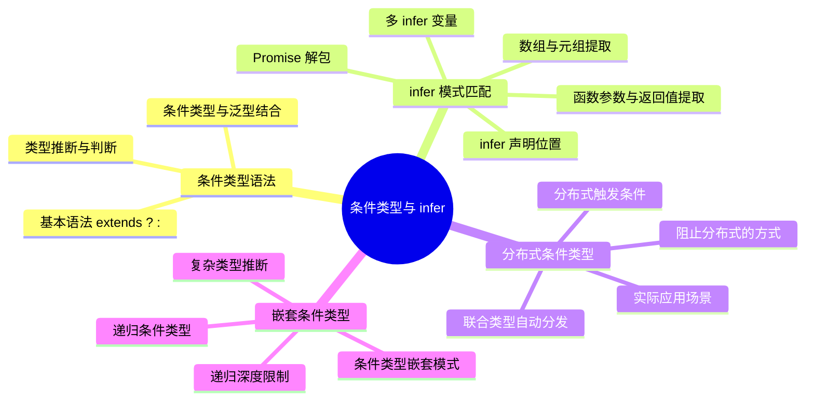

# 条件类型与 infer

## 知识架构



## 本章概览

在工具类型与类型体操的实践中，条件类型是最核心的控制流：它让类型系统拥有了类似编程语言中 `if-else` 的判断能力。配合 `infer` 关键字，可以在类型层面进行模式匹配和类型提取，这是实现复杂工具类型的基础。

**学习目标：**
- 理解条件类型的基本语法和工作原理
- 掌握 `infer` 关键字的使用场景和技巧
- 理解分布式条件类型的特性和应用
- 能够实现常见的类型推断工具类型
- 掌握条件类型的实际应用场景和最佳实践

**核心概念：**
```
条件类型 → 类型判断 → infer → 类型提取 → 分布式特性 → 联合类型处理
```

**知识图谱：**

```
┌─────────────────────────────────────────────────────────────────────────┐
│                        条件类型与 infer 知识体系                          │
├─────────────────────────────────────────────────────────────────────────┤
│                                                                         │
│  ┌─────────────┐      ┌─────────────┐      ┌─────────────────────────┐ │
│  │  条件类型    │ ──→ │  infer 关键字 │ ──→ │     分布式条件类型        │ │
│  │  基础语法    │      │  类型提取    │      │     (Distributive)       │ │
│  └─────────────┘      └─────────────┘      └─────────────────────────┘ │
│         │                    │                       │                 │
│         ▼                    ▼                       ▼                 │
│  ┌─────────────┐      ┌─────────────┐      ┌─────────────────────────┐ │
│  │ - 基本语法   │      │ - 函数类型  │      │ - 裸类型 vs 包裹类型     │ │
│  │ - 嵌套条件   │      │ - 数组/元组 │      │ - 集合运算              │ │
│  │ - 类型兼容   │      │ - 对象类型  │      │ - 特殊类型处理          │ │
│  │ - 类型推断   │      │ - Promise   │      │ - 条件分支控制          │ │
│  └─────────────┘      └─────────────┘      └─────────────────────────┘ │
│                                                                         │
├─────────────────────────────────────────────────────────────────────────┤
│  实战应用：ReturnType / Parameters / Extract / Exclude / IsNever 等     │
└─────────────────────────────────────────────────────────────────────────┘
```

## 条件类型基础

### 基本语法

条件类型的语法类似于 JavaScript 中的三元表达式：

```typescript
// JavaScript 中的三元表达式
ValueA === ValueB ? Result1 : Result2;

// TypeScript 中的条件类型
TypeA extends TypeB ? Result1 : Result2;
```

> ⚠️ **重要区别**：条件类型使用 `extends` 判断类型的**兼容性**，而非判断类型的全等性。这是因为在类型层面，对于能够进行赋值操作的两个变量，我们并不需要它们的类型完全相等，只需要具有兼容性。

**类型兼容性规则：**

```
┌────────────────────────────────────────────────────────────────┐
│                    extends 类型兼容性判断                        │
├────────────────────────────────────────────────────────────────┤
│                                                                │
│   子类型 extends 父类型 ? true : false                          │
│                                                                │
│   示例：                                                        │
│   ┌──────────────────┬────────────────┬───────────────────┐   │
│   │      类型 A       │     类型 B      │  A extends B ?    │   │
│   ├──────────────────┼────────────────┼───────────────────┤   │
│   │     string       │     string     │       ✅ true     │   │
│   │    "hello"       │     string     │       ✅ true     │   │
│   │     string       │    "hello"     │       ❌ false    │   │
│   │   string | number│     string     │       ❌ false    │   │
│   │     string       │  string|number │       ✅ true     │   │
│   │      never       │     string     │       ✅ true     │   │
│   │      any         │     string     │       ✅ 双分支   │   │
│   │     unknown      │     string     │       ❌ false    │   │
│   └──────────────────┴────────────────┴───────────────────┘   │
│                                                                │
│   关键点：子类型可以赋值给父类型，所以 extends 成立              │
└────────────────────────────────────────────────────────────────┘
```

> ⚠️ 上表中 `any` 一行：`any extends string` 会**同时命中 true / false 两个分支**（结果为两个分支类型的联合），详见下文「any 类型的特殊行为」。

### 简单示例

```typescript
type LiteralType<T> = T extends string ? "string" : "other";

type Res1 = LiteralType<"linbudu">; // "string"
type Res2 = LiteralType<599>;       // "other"
```

### 嵌套条件类型

同三元表达式一样，条件类型支持多层嵌套：

```typescript
export type LiteralType<T> = T extends string
  ? "string"
  : T extends number
  ? "number"
  : T extends boolean
  ? "boolean"
  : T extends null
  ? "null"
  : T extends undefined
  ? "undefined"
  : never;

type Res1 = LiteralType<"linbudu">; // "string"
type Res2 = LiteralType<599>;       // "number"
type Res3 = LiteralType<true>;      // "boolean"
type Res4 = LiteralType<null>;      // "null"
type Res5 = LiteralType<object>;    // never
```

### 实际应用：字面量类型提取

在函数中，条件类型与泛型的搭配非常常见。以下示例展示了如何从字面量联合类型推导回其基础类型：

```typescript
// 字面量类型到基础类型的映射
export type LiteralToPrimitive<T> = T extends number
  ? number
  : T extends bigint
  ? bigint
  : T extends string
  ? string
  : never;

// 实际应用：通用加法函数
function universalAdd<T extends number | bigint | string>(
  x: T,
  y: T
): LiteralToPrimitive<T> {
  return x + (y as any);
}

universalAdd("linbudu", "599"); // string
universalAdd(599, 1);           // number
universalAdd(10n, 10n);         // bigint
```

### 函数类型的条件判断

条件类型可以用来对复杂的函数类型进行比较：

```typescript
type Func = (...args: any[]) => any;

type FunctionConditionType<T extends Func> = T extends (
  ...args: any[]
) => string
  ? 'A string return func!'
  : 'A non-string return func!';

type StringResult = FunctionConditionType<() => string>;    // "A string return func!"
type NonStringResult1 = FunctionConditionType<() => boolean>; // "A non-string return func!"
type NonStringResult2 = FunctionConditionType<() => number>;  // "A non-string return func!"
```

### extends 的两种角色

> 💡 **提示**：注意区分泛型约束中的 `extends` 和条件类型中的 `extends`：

| 角色 | 位置 | 作用 | 示例 |
|------|------|------|------|
| **泛型约束** | 泛型参数声明处 | 限制类型参数的范围，相当于参数校验 | `<T extends string>` |
| **条件类型** | 条件类型表达式中 | 进行条件判断，相当于 if-else | `T extends string ? A : B` |

```typescript
// 泛型约束：限制 T 必须是 string 的子类型
function process<T extends string>(value: T): T {
  return value;
}

process("hello");  // ✅ 正确
process(123);      // ❌ 错误：number 不满足 string 约束

// 条件类型：根据 T 的类型决定返回类型
type ProcessResult<T> = T extends string ? `处理: ${T}` : number;

type R1 = ProcessResult<"hello">; // "处理: hello"
type R2 = ProcessResult<123>;     // number
```

### 类型延迟推断

当条件类型的判断依赖泛型参数时，TypeScript 会**延迟推断**结果：

```typescript
type TypeName<T> = T extends string
  ? "string"
  : T extends number
  ? "number"
  : T extends boolean
  ? "boolean"
  : T extends undefined
  ? "undefined"
  : T extends Function
  ? "function"
  : "object";

// 具体类型：立即求值
type T1 = TypeName<string>;     // "string"
type T2 = TypeName<number[]>;   // "object"

// 泛型参数：延迟求值
function getTypeName<T>(value: T): TypeName<T> {
  // 这里 TypeName<T> 的值在调用时才确定
  return typeof value as TypeName<T>;
}

getTypeName("hello");  // TypeName<"hello"> = "string"
getTypeName(123);      // TypeName<123> = "number"
getTypeName(true);     // TypeName<true> = "boolean"
```

## infer 关键字

### 基本概念

`infer` 是 `inference`（推断）的缩写，用于在条件类型中**提取类型的某一部分信息**。它只能在条件类型的 `extends` 子句中使用。

```typescript
type FunctionReturnType<T extends (...args: any[]) => any> = T extends (
  ...args: any[]
) => infer R
  ? R
  : never;
```

**解读：**
- 当传入的类型参数满足 `(...args: any[]) => infer R` 结构时
- `infer R` 位置的类型会被提取并赋值给 `R`
- 最终返回 `R`，否则返回 `never`

**infer 工作原理：**

```
┌────────────────────────────────────────────────────────────────────┐
│                      infer 模式匹配流程                             │
├────────────────────────────────────────────────────────────────────┤
│                                                                    │
│   输入类型: () => string                                           │
│                                                                    │
│   匹配模式: (...args: any[]) => infer R                            │
│                  ↓                                                 │
│   ┌─────────────────────────────────────────────────────────┐     │
│   │   模式匹配中 infer R 占位的位置 → 提取该位置的类型        │     │
│   │                                                         │     │
│   │   函数返回值位置: () => string                          │     │
│   │                      ↓                                  │     │
│   │                   infer R                               │     │
│   │                      ↓                                  │     │
│   │                   R = string                            │     │
│   └─────────────────────────────────────────────────────────┘     │
│                                                                    │
│   结果: string                                                     │
│                                                                    │
└────────────────────────────────────────────────────────────────────┘
```

### 函数类型提取

```typescript
type Func = (...args: any[]) => any;

// 提取函数返回值类型（内置 ReturnType 的实现）
type FunctionReturnType<T extends Func> = T extends (
  ...args: any[]
) => infer R
  ? R
  : never;

type R1 = FunctionReturnType<() => string>;  // string
type R2 = FunctionReturnType<() => number>;  // number
type R3 = FunctionReturnType<(x: number) => boolean>; // boolean

// 提取函数参数类型（内置 Parameters 的实现）
type FunctionParameters<T extends Func> = T extends (...args: infer P) => any ? P : never;

type P1 = FunctionParameters<(a: string, b: number) => void>; // [a: string, b: number]
type P2 = FunctionParameters<(x: number, y: string, z: boolean) => void>; // [x: number, y: string, z: boolean]

// 提取第一个参数类型
type FirstParameter<T extends Func> = T extends (first: infer F, ...rest: any[]) => any
  ? F
  : never;

type FP1 = FirstParameter<(x: string, y: number) => void>; // string
type FP2 = FirstParameter<() => void>; // unknown（无实参位置可推断，得到 unknown）

// 提取剩余参数类型
type RestParameters<T extends Func> = T extends (first: any, ...rest: infer R) => any
  ? R
  : never;

type RP1 = RestParameters<(x: string, y: number, z: boolean) => void>; // [y: number, z: boolean]
```

### 数组/元组类型提取

```typescript
// 交换元组首尾元素
type Swap<T extends any[]> = T extends [infer A, infer B] ? [B, A] : T;

type SwapResult1 = Swap<[1, 2]>;    // [2, 1]
type SwapResult2 = Swap<[1, 2, 3]>; // [1, 2, 3]（不符合结构，原样返回）

// 使用 rest 操作符处理任意长度
type ExtractStartAndEnd<T extends any[]> = T extends [
  infer Start,
  ...any[],
  infer End
]
  ? [Start, End]
  : T;

type ExtractResult1 = ExtractStartAndEnd<[1, 2, 3, 4]>; // [1, 4]
type ExtractResult2 = ExtractStartAndEnd<[1, 2]>;       // [1, 2]
type ExtractResult3 = ExtractStartAndEnd<[1]>;          // [1]（不匹配，原样返回）

// 交换首尾元素（保留中间）
type SwapStartAndEnd<T extends any[]> = T extends [
  infer Start,
  ...infer Left,
  infer End
]
  ? [End, ...Left, Start]
  : T;

type SwapResult3 = SwapStartAndEnd<[1, 2, 3, 4]>; // [4, 2, 3, 1]
type SwapResult4 = SwapStartAndEnd<[1, 2]>;       // [2, 1]

// 提取数组元素类型（类似内置的 ArrayElement）
type ArrayItemType<T> = T extends Array<infer ElementType> ? ElementType : never;

type ArrayItemTypeResult1 = ArrayItemType<[]>;              // never
type ArrayItemTypeResult2 = ArrayItemType<string[]>;        // string
type ArrayItemTypeResult3 = ArrayItemType<[string, number]>; // string | number

// 提取元组第一个元素
type Head<T extends any[]> = T extends [infer First, ...any[]] ? First : never;

type HeadResult1 = Head<[1, 2, 3]>;    // 1
type HeadResult2 = Head<string[]>;     // never（普通数组不满足 [First, ...] 元组结构）
type HeadResult3 = Head<[]>;           // never

// 提取元组尾部元素
type Tail<T extends any[]> = T extends [any, ...infer Rest] ? Rest : never;

type TailResult1 = Tail<[1, 2, 3]>;    // [2, 3]
type TailResult2 = Tail<[1]>;          // []
type TailResult3 = Tail<[]>;           // never

// 提取元组最后一个元素
type Last<T extends any[]> = T extends [...any[], infer L] ? L : never;

type LastResult1 = Last<[1, 2, 3]>;    // 3
type LastResult2 = Last<[1]>;          // 1
type LastResult3 = Last<[]>;           // never
```

**元组提取图解：**

```
元组: [1, 2, 3, 4]
       ↓
┌─────────────────────────────────────────────┐
│  提取位置           │  infer 位置   │  结果  │
├─────────────────────────────────────────────┤
│  第一个元素         │  [infer F, ...]│   1    │
│  最后一个元素       │  [..., infer L]│   4    │
│  除第一个外的元素   │  [_, ...infer R]│ [2,3,4]│
│  除最后一个外的元素 │  [...infer R, _]│ [1,2,3]│
│  首尾元素          │  [infer S, ..., infer E] │ [1,4] │
└─────────────────────────────────────────────┘
```

### 对象类型提取

```typescript
// 提取对象的属性类型
type PropType<T, K extends keyof T> = T extends { [Key in K]: infer R }
  ? R
  : never;

type PropTypeResult1 = PropType<{ name: string }, 'name'>;           // string
type PropTypeResult2 = PropType<{ name: string; age: number }, 'name' | 'age'>; // string | number

// 提取构造函数实例类型（内置 InstanceType 的实现原理）
type InstanceType<T extends new (...args: any[]) => any> = T extends new (
  ...args: any[]
) => infer R
  ? R
  : never;

class Person {
  constructor(public name: string) {}
}

type PersonInstance = InstanceType<typeof Person>; // Person

// 提取构造函数参数类型（内置 ConstructorParameters 的实现原理）
type ConstructorParameters<T extends new (...args: any[]) => any> = T extends new (
  ...args: infer P
) => any
  ? P
  : never;

type PersonParams = ConstructorParameters<typeof Person>; // [name: string]

// 反转键名与键值（需要使用 & string 确保属性名类型合法）
type ReverseKeyValue<T extends Record<string, unknown>> = T extends Record<infer K, infer V>
  ? Record<V & string, K>
  : never;

type ReverseKeyValueResult1 = ReverseKeyValue<{ "key": "value" }>; // { "value": "key" }
type ReverseKeyValueResult2 = ReverseKeyValue<{ a: "x"; b: "y" }>; // { x: "a" | "b"; y: "a" | "b" }
```

> ⚠️ **注意**：`V & string` 这个技巧确保了交叉后键名一定是 `string`（不满足 `string` 的成员与 `string` 交叉后变为 `never`，即被过滤掉），符合索引签名键只允许 `string | number | symbol` 的要求。另外注意 K、V 是独立推断的：多键对象中所有键名与所有键值会各自合并为联合，丢失键值对应关系（如上例 Result2）。

### Promise 类型提取

```typescript
// 单层提取
type PromiseValue<T> = T extends Promise<infer V> ? V : T;

type PromiseValueResult1 = PromiseValue<Promise<number>>; // number
type PromiseValueResult2 = PromiseValue<number>;          // number（未发生提取）
type PromiseValueResult3 = PromiseValue<Promise<string | number>>; // string | number

// 递归提取（处理嵌套 Promise）
type DeepPromiseValue<T> = T extends Promise<infer V>
  ? DeepPromiseValue<V>
  : T;

type DeepResult1 = DeepPromiseValue<Promise<Promise<boolean>>>; // boolean
type DeepResult2 = DeepPromiseValue<Promise<Promise<Promise<string>>>>; // string

// 实际应用：处理异步函数返回值
async function fetchData(): Promise<{ id: number; name: string }> {
  return { id: 1, name: "test" };
}

// 提取异步函数返回的数据类型
type AsyncReturnType<T extends (...args: any[]) => Promise<any>> = T extends (
  ...args: any[]
) => Promise<infer R>
  ? R
  : never;

type Data = AsyncReturnType<typeof fetchData>; // { id: number; name: string }
```

**Promise 提取流程图：**

```
Promise<Promise<Promise<string>>>
           ↓
┌─────────────────────────────────────────────────────┐
│  第一次匹配: Promise<Promise<Promise<string>>>     │
│  infer V = Promise<Promise<string>>                │
│  结果: DeepPromiseValue<Promise<Promise<string>>>  │
├─────────────────────────────────────────────────────┤
│  第二次匹配: Promise<Promise<string>>              │
│  infer V = Promise<string>                         │
│  结果: DeepPromiseValue<Promise<string>>           │
├─────────────────────────────────────────────────────┤
│  第三次匹配: Promise<string>                       │
│  infer V = string                                  │
│  结果: DeepPromiseValue<string>                    │
├─────────────────────────────────────────────────────┤
│  第四次匹配: string                                │
│  string 不满足 Promise<infer V> 结构               │
│  结果: string                                      │
└─────────────────────────────────────────────────────┘
```

---

## 分布式条件类型

### 概念说明

**分布式条件类型（Distributive Conditional Type）** 是条件类型的一个重要特性。当条件类型满足以下条件时，会自动将联合类型"分发"到每个成员上进行判断：

1. 类型参数是一个联合类型
2. 类型参数通过泛型参数传入
3. 条件类型中的泛型参数是**裸类型**（未被包裹）

### 工作原理

**分布式条件类型的执行流程：**

```
┌─────────────────────────────────────────────────────────────────────┐
│                    分布式条件类型执行流程                             │
├─────────────────────────────────────────────────────────────────────┤
│                                                                     │
│  输入: Condition<1 | 2 | 3 | 4 | 5>                                │
│                                                                     │
│  ┌───────────────────────────────────────────────────────────────┐ │
│  │               条件类型定义                                     │ │
│  │   type Condition<T> = T extends 1 | 2 | 3 ? T : never         │ │
│  └───────────────────────────────────────────────────────────────┘ │
│                                                                     │
│  执行过程（分布式展开）：                                           │
│  ┌─────────────────────────────────────────────────────────────┐   │
│  │  Condition<1 | 2 | 3 | 4 | 5>                                │   │
│  │        ↓                                                      │   │
│  │  (1 extends 1|2|3 ? 1 : never)  // 结果: 1                    │   │
│  │  | (2 extends 1|2|3 ? 2 : never)  // 结果: 2                  │   │
│  │  | (3 extends 1|2|3 ? 3 : never)  // 结果: 3                  │   │
│  │  | (4 extends 1|2|3 ? 4 : never)  // 结果: never              │   │
│  │  | (5 extends 1|2|3 ? 5 : never)  // 结果: never              │   │
│  │        ↓                                                      │   │
│  │  1 | 2 | 3 | never | never                                    │   │
│  │        ↓                                                      │   │
│  │  1 | 2 | 3  (never 在联合类型中被过滤)                        │   │
│  └─────────────────────────────────────────────────────────────┘   │
│                                                                     │
│  最终结果: 1 | 2 | 3                                                │
│                                                                     │
└─────────────────────────────────────────────────────────────────────┘
```

```typescript
type Condition<T> = T extends 1 | 2 | 3 ? T : never;

// 分布式处理过程：
// Condition<1 | 2 | 3 | 4 | 5> 
// = (1 extends 1|2|3 ? 1 : never) | (2 extends 1|2|3 ? 2 : never) | ...
// = 1 | 2 | 3
type Res1 = Condition<1 | 2 | 3 | 4 | 5>; // 1 | 2 | 3
```

### 裸类型 vs 包裹类型

```typescript
type Naked<T> = T extends boolean ? "Y" : "N";
type Wrapped<T> = [T] extends [boolean] ? "Y" : "N";

// 分布式生效（裸类型）
type Res3 = Naked<number | boolean>;    // "N" | "Y"

// 分布式不生效（被元组包裹）
type Res4 = Wrapped<number | boolean>;  // "N"
```

**裸类型 vs 包裹类型对比：**

| 特性 | 裸类型 `T` | 包裹类型 `[T]` / `T & {}` |
|------|-----------|--------------------------|
| 分布式行为 | ✅ 生效 | ❌ 不生效 |
| 联合类型处理 | 分发到每个成员 | 整体判断 |
| never 处理 | 直接返回 never | 可以正常判断 |
| 典型场景 | 集合运算、过滤 | 整体类型比较 |

**等效伪代码：**

```typescript
// Naked<number | boolean> 的执行过程：
const Res3 = [];

for (const input of [number, boolean]) {
  if (input extends boolean) {
    Res3.push("Y");
  } else {
    Res3.push("N");
  }
}
// 结果: ["N", "Y"] → "N" | "Y"

// Wrapped<number | boolean> 的执行过程：
// 直接判断 [number | boolean] extends [boolean]
// number | boolean 不完全兼容 boolean
// 结果: "N"
```

### 禁用分布式特性

使用包裹类型可以禁用分布式特性：

```typescript
// 方法一：使用 T & {} 包裹
type NoDistribute<T> = T & {};

type Wrapped<T> = NoDistribute<T> extends boolean ? "Y" : "N";

type Test1 = Wrapped<number | boolean>; // "N"（整体判断）

// 方法二：使用数组包裹
type CompareUnion<T, U> = [T] extends [U] ? true : false;

type CompareRes1 = CompareUnion<1 | 2, 1 | 2 | 3>; // true（1|2 是 1|2|3 的子集）
type CompareRes2 = CompareUnion<1 | 2, 1>;         // false（1|2 不是 1 的子集）

// 方法三：借助 UnionToTuple（见下文"实现UnionToTuple"）——单成员联合转出的元组长度为 1，多成员大于 1
type IsUnion<T> = UnionToTuple<T> extends [T] ? false : true;

type IsUnionRes1 = IsUnion<string>;    // false
type IsUnionRes2 = IsUnion<"a" | "b">; // true

// 实际应用：判断两个类型的关系
type IsSubset<A, B> = [A] extends [B] ? true : false;

type SubResult1 = IsSubset<"a" | "b", "a" | "b" | "c">; // true
type SubResult2 = IsSubset<"a" | "b" | "c", "a" | "b">; // false
```

**禁用分布式的应用场景：**

```typescript
// 场景1：判断类型是否完全相等
type Equal<X, Y> = (<T>() => T extends X ? 1 : 2) extends <T>() => T extends Y
  ? 1
  : 2
  ? true
  : false;

type EqualRes1 = Equal<{ a: 1 }, { a: 1 }>; // true
type EqualRes2 = Equal<{ a: 1 }, { b: 1 }>; // false

// 场景2：判断联合类型是否为空
type IsNever<T> = [T] extends [never] ? true : false;

type NeverRes1 = IsNever<never>; // true
type NeverRes2 = IsNever<string>; // false

// 场景3：安全的联合类型判断
type SafeCondition<T> = [T] extends [string] ? "string" : "other";

type Safe1 = SafeCondition<string | number>; // "other"（整体判断，不是 "string" | "other"）
```

### 特殊类型处理

条件类型对某些特殊类型有独特的行为，理解这些行为对于正确使用条件类型至关重要。

#### never 类型的特殊行为

`never` 是"空的联合类型"，在分布式条件类型中有特殊表现：

```typescript
// never 作为裸类型泛型参数时，直接返回 never（跳过判断）
type Tmp<T> = T extends string ? 1 : 2;
type TmpRes = Tmp<never>; // never（直接返回，不进行判断）

// 原因：never 是空联合类型，没有成员可以分发
// 伪代码：for (const item of []) { ... } // 空循环，无返回值

// 使用包裹类型可以正常判断 never
type IsNever<T> = [T] extends [never] ? true : false;

type IsNeverRes1 = IsNever<never>;    // true
type IsNeverRes2 = IsNever<"linbudu">; // false
type IsNeverRes3 = IsNever<null>;     // false
```

#### any 类型的特殊行为

`any` 类型在条件类型中表现"双重身份"：

```typescript
// any 在条件类型中同时匹配 true 和 false 分支
type Tmp1 = any extends string ? 1 : 2;  // 1 | 2
type Tmp2 = any extends number ? 1 : 2;  // 1 | 2
type Tmp3 = any extends never ? 1 : 2;   // 1 | 2

// 泛型参数传入 any 也是一样
type Tmp4<T> = T extends string ? 1 : 2;
type Tmp4Res = Tmp4<any>; // 1 | 2

// 特殊情况：any extends any 成立（返回单一值）
type Special1 = any extends any ? 1 : 2; // 1

// 利用这个特性检测 any 类型
type IsAny<T> = 0 extends 1 & T ? true : false;
// 原理：1 & any = any，而 0 extends any 成立
//      1 & 其他类型 ≠ any，0 extends 1 不成立

type IsAnyRes1 = IsAny<any>;     // true
type IsAnyRes2 = IsAny<unknown>; // false
type IsAnyRes3 = IsAny<never>;   // false
type IsAnyRes4 = IsAny<string>;  // false
```

#### unknown 类型的特殊行为

`unknown` 是类型系统的"顶层类型"：

```typescript
// unknown 不满足大多数 extends 条件
type Tmp5 = unknown extends string ? 1 : 2;  // 2
type Tmp6 = unknown extends {} ? 1 : 2;      // 2（unknown 只能赋值给 unknown / any，不能赋值给 {}）

// 检测 unknown 类型
type IsUnknown<T> = unknown extends T
  ? IsAny<T> extends true
    ? false
    : true
  : false;
// 原理：unknown extends T 只有在 T 为 any 或 unknown 时成立
//       排除 any 后，剩下的就是 unknown

type IsUnknownRes1 = IsUnknown<unknown>; // true
type IsUnknownRes2 = IsUnknown<any>;     // false
type IsUnknownRes3 = IsUnknown<string>;  // false
```

**特殊类型行为总结表：**

| 类型 | 裸类型条件判断 | 包裹后判断 | extends any | extends never |
|------|---------------|-----------|-------------|---------------|
| `never` | 直接返回 never | 可正常判断 | ✅ 成立 | ✅ 成立（直接判断时） |
| `any` | 返回两个分支的联合 | 可正常判断（不分发，单分支） | ✅ 成立 | ⚠️ 双分支均命中 |
| `unknown` | 正常判断 | 正常判断 | ✅ 成立 | ❌ 不成立 |

### 实际应用：集合运算

分布式条件类型非常适合进行类型层面的集合运算，这是类型体操的核心技能之一：

```typescript
// 交集（Intersection）：A ∩ B
type Intersection<A, B> = A extends B ? A : never;
type IntersectionRes = Intersection<1 | 2 | 3, 2 | 3 | 4>; // 2 | 3

// 差集（Difference）：A - B
type Difference<A, B> = A extends B ? never : A;
type DifferenceRes = Difference<1 | 2 | 3, 2 | 3 | 4>; // 1

// 补集（Complement）：A - B（需要约束 B 是 A 的子集）
type Complement<A, B extends A> = Difference<A, B>;
type ComplementRes = Complement<1 | 2 | 3 | 4, 2 | 3>; // 1 | 4

// 并集（Union）：A ∪ B（直接使用联合类型即可）
type Union<A, B> = A | B;

// 排除 null 和 undefined（内置 NonNullable 的实现）
type NonNullable<T> = T extends null | undefined ? never : T;
type NonNullableRes = NonNullable<string | null | number | undefined>; // string | number

// 排除特定类型
type Exclude<T, U> = T extends U ? never : T;
type ExcludeRes = Exclude<"a" | "b" | "c", "a">; // "b" | "c"

// 提取特定类型（内置 Extract 的实现）
type Extract<T, U> = T extends U ? T : never;
type ExtractRes = Extract<"a" | "b" | "c", "a" | "b">; // "a" | "b"
```

**集合运算图解：**

```
集合 A = {1, 2, 3, 4, 5}
集合 B = {3, 4, 5, 6, 7}

┌─────────────────────────────────────────────────────────────┐
│                                                             │
│     A ∩ B（交集）         A - B（差集）       A | B（并集）  │
│                                                             │
│      ┌───┐               ┌───┐             ┌───────────┐   │
│      │ 3 │               │ 1 │             │ 1 2 3 4 5 │   │
│      │ 4 │               │ 2 │             │     6 7   │   │
│      │ 5 │               └───┘             └───────────┘   │
│      └───┘                                                  │
│                                                             │
│     结果: 3|4|5           结果: 1|2          结果: 1|2|3|   │
│                                            4|5|6|7         │
└─────────────────────────────────────────────────────────────┘
```

### 实战示例：类型守卫辅助

```typescript
// 定义类型检查工具类型
type CheckTypes<T> = T extends string
  ? { type: "string"; value: T }
  : T extends number
  ? { type: "number"; value: T }
  : T extends boolean
  ? { type: "boolean"; value: T }
  : { type: "other"; value: T };

// 使用示例
function checkType<T>(value: T): CheckTypes<T> {
  if (typeof value === "string") {
    return { type: "string", value } as CheckTypes<T>;
  }
  if (typeof value === "number") {
    return { type: "number", value } as CheckTypes<T>;
  }
  if (typeof value === "boolean") {
    return { type: "boolean", value } as CheckTypes<T>;
  }
  return { type: "other", value } as CheckTypes<T>;
}

const result1 = checkType("hello"); // { type: "string"; value: "hello" }
const result2 = checkType(123);     // { type: "number"; value: 123 }
```

---

## 总结

### 核心要点

| 概念 | 说明 |
|------|------|
| **条件类型** | 基于 `extends` 的类型判断，类似三元表达式 |
| **infer 关键字** | 在条件类型中提取类型的某部分，实现模式匹配 |
| **分布式特性** | 联合类型通过裸类型泛型参数传入时自动分发处理 |

### 最佳实践

1. **使用 infer 进行模式匹配**：适合提取函数参数、返回值、Promise 值等
2. **合理使用递归**：处理嵌套结构（如 `DeepPromiseValue`）
3. **注意分布式特性**：联合类型判断时，根据需要决定是否禁用
4. **包裹技巧**：使用 `[T]` 或 `T & {}` 来控制分布式行为

### 常见应用场景

- 提取函数的参数类型和返回值类型
- 提取 Promise 的内部值类型
- 提取数组/元组的元素类型
- 实现类型层面的集合运算
- 判断特殊类型（`IsNever`、`IsAny`、`IsUnknown`）

---

## 扩展阅读

### 类型系统核心工具类型实现

以下是一些重要的类型系统工具类型的完整实现，帮助深入理解条件类型和 infer 的应用：

```typescript
// ============================================
// 类型判断工具
// ============================================

// 检测 any 类型
type IsAny<T> = 0 extends 1 & T ? true : false;

// 检测 unknown 类型
type IsUnknown<T> = unknown extends T
  ? IsAny<T> extends true
    ? false
    : true
  : false;

// 检测 never 类型
type IsNever<T> = [T] extends [never] ? true : false;

// 检测联合类型
type IsUnion<T, U = T> = (T extends U ? (U extends T ? true : false) : never) extends true
  ? false
  : true;

// ============================================
// 类型关系判断
// ============================================

// 严格相等判断
type Equal<X, Y> = (<T>() => T extends X ? 1 : 2) extends <T>() => T extends Y
  ? 1
  : 2
  ? true
  : false;

// 子类型判断
type IsSubtype<A, B> = [A] extends [B] ? true : false;

// ============================================
// 函数类型工具
// ============================================

// 提取异步函数返回值
type Awaited<T> = T extends Promise<infer V> ? Awaited<V> : T;

// 提取函数 this 参数类型
type ThisParameterType<T> = T extends (this: infer U, ...args: any[]) => any ? U : unknown;

// 移除函数 this 参数
type OmitThisParameter<T> = T extends (this: any, ...args: infer A) => infer R
  ? (...args: A) => R
  : T;
```

### infer 约束（TypeScript 4.7+）

TypeScript 4.7 支持对 `infer` 提取的类型添加约束，使类型提取更加精确：

```typescript
// 传统写法：需要嵌套条件判断
type FirstArrayItemType<T extends any[]> = T extends [infer P, ...any[]]
  ? P extends string
    ? P
    : never
  : never;

// 使用 infer 约束：更加简洁
type FirstStringItem<T extends any[]> = T extends [infer P extends string, ...any[]]
  ? P
  : never;

type Tmp1 = FirstStringItem<[599, 'linbudu']>; // never（599 不是 string）
type Tmp2 = FirstStringItem<['linbudu', 599]>; // 'linbudu'

// 更多 infer 约束示例
// 提取第一个 number 类型元素
type FirstNumber<T extends any[]> = T extends [infer P extends number, ...any[]]
  ? P
  : never;

type NumTest1 = FirstNumber<[1, 2, 3]>;     // 1
type NumTest2 = FirstNumber<['a', 1, 2]>;   // never

// 提取对象类型的属性值
type ExtractObjectProperty<T, K extends string> = T extends { [P in K]: infer V }
  ? V
  : never;
```

#### infer extends 解决的核心问题

⚠️ **为什么需要 infer extends？** 因为 `infer` 提取的类型默认推导为 `unknown`，导致不能直接当具体类型使用：

```typescript
// ❌ 问题：从零参函数中提取"第一个参数"类型，实参位置不存在，推导为 unknown
type First<Fn extends (...args: any[]) => any> = 
    Fn extends (first: infer F, ...rest: any[]) => any
        ? F 
        : never;

type Result = First<() => void>; 
// 结果是 unknown，不是 string！无法直接当 string 用

// 旧方案1：加一层条件判断
type FirstFixed1<Fn extends (...args: any[]) => any> = 
    Fn extends (first: infer F, ...rest: any[]) => any
        ? F extends string ? F : never
        : never;

// 旧方案2：与 string 取交叉类型
type FirstFixed2<Fn extends (...args: any[]) => any> = 
    Fn extends (first: infer F, ...rest: any[]) => any
        ? F & string
        : never;

// ✅ 新方案：使用 infer extends 直接约束推导类型
type FirstFixed3<Fn extends (...args: any[]) => any> = 
    Fn extends (first: infer F extends string, ...rest: any[]) => any
        ? F 
        : never;

type Result1 = FirstFixed1<(a: string, b: number) => void>; // string
type Result2 = FirstFixed2<(a: string, b: number) => void>; // string
type Result3 = FirstFixed3<(a: string, b: number) => void>; // string
type Result3b = FirstFixed3<() => void>; // never（无实参可推断时直接匹配失败，比 unknown 更安全）
```

**问题本质**：提取出的参数类型 `F` 没有约束，既可能是我们期望的 `string`，也可能是无实参可推断时的 `unknown`，使用前还需要通过 `& string` 或 `xxx extends string` 来转换/收窄一次，这非常麻烦。TypeScript 4.7 引入 `infer extends` 语法正是为了解决这个问题。

#### infer extends 的类型转换能力

⚠️ **infer extends 的第二个重要作用：类型转换。** 可以将字符串字面量类型转换为 number、boolean、null 等基础类型：

```typescript
// 字符串转数字类型
type StrToNum<Str> =
  Str extends `${infer Num extends number}`
    ? Num
    : Str;

type N1 = StrToNum<'123'>;  // 123（数字字面量类型）
type N2 = StrToNum<'abc'>;  // 'abc'（不匹配，原样返回）

// 字符串转布尔类型
type StrToBool<Str> =
  Str extends `${infer Bool extends boolean}`
    ? Bool
    : Str;

type B1 = StrToBool<'true'>;   // true
type B2 = StrToBool<'false'>;  // false

// 字符串转 null 类型
type StrToNull<Str> =
  Str extends `${infer N extends null}`
    ? N
    : Str;

// 实际应用：提取枚举值的精确类型
enum Code {
    a = 111,
    b = 222,
    c = "abc"
}

// 默认推导：所有值都被当作字符串
type EnumValues = `${Code}`; // "111" | "222" | "abc"

// 使用 infer extends 转换：数字值恢复为 number 类型
type ExactEnumValue<T> = 
    T extends `${infer Num extends number}` ? Num : T;

type PreciseValues = ExactEnumValue<`${Code}`>; // 111 | 222 | "abc"
```

> 💡 **版本差异**：TypeScript 4.7 中 `infer extends` 推导出的是约束类型本身（如 `number`、`boolean`），4.8+ 则能推导出更精确的字面量类型（如 `123`、`true`、`false`）。例如 `StrToNum<'123'>` 在 4.7 中结果为 `number`，在 4.8+ 中结果为 `123`。推荐使用 4.8 及以上版本以获得更精确的类型推导。

### 高级类型体操示例

#### 实现DeepReadonly

递归地将所有属性变为只读：

```typescript
type DeepReadonly<T> = {
  readonly [P in keyof T]: T[P] extends object
    ? T[P] extends Function
      ? T[P]
      : DeepReadonly<T[P]>
    : T[P];
};

interface NestedObject {
  a: {
    b: {
      c: string;
    };
  };
  d: number;
}

type ReadonlyNested = DeepReadonly<NestedObject>;
// 所有嵌套属性都变为只读
```

#### 实现DeepPartial

递归地将所有属性变为可选：

```typescript
type DeepPartial<T> = T extends object
  ? {
      [P in keyof T]?: DeepPartial<T[P]>;
    }
  : T;

interface Config {
  database: {
    host: string;
    port: number;
    credentials: {
      username: string;
      password: string;
    };
  };
}

type PartialConfig = DeepPartial<Config>;
// 所有嵌套属性都变为可选
```

#### 实现UnionToIntersection

将联合类型转换为交叉类型：

```typescript
type UnionToIntersection<U> = (U extends any ? (k: U) => void : never) extends (k: infer I) => void
  ? I
  : never;

type Union = { a: string } | { b: number };
type Intersection = UnionToIntersection<Union>;
// { a: string } & { b: number }
```

#### 实现UnionToTuple

将联合类型转换为元组（高级技巧）：

```typescript
// 辅助类型
type LastOf<T> = UnionToIntersection<T extends any ? () => T : never> extends () => infer R
  ? R
  : never;

type Push<T extends any[], V> = [...T, V];

type UnionToTuple<T, L = LastOf<T>> = [T] extends [never]
  ? []
  : Push<UnionToTuple<Exclude<T, L>>, L>;

type Tuple = UnionToTuple<1 | 2 | 3>; // [1, 2, 3]（顺序可能不同）
```

### 条件类型性能优化

在复杂类型体操中，条件类型的性能可能会成为问题。以下是一些优化技巧：

```typescript
// ❌ 性能较差：多层嵌套
type SlowType<T> = T extends A
  ? T extends B
    ? T extends C
      ? 1
      : 2
    : 3
  : 4;

// ✅ 性能优化：扁平化条件
type FastType<T> = T extends A & B & C
  ? 1
  : T extends A & B
  ? 2
  : T extends A
  ? 3
  : 4;

// ✅ 使用缓存技巧（避免重复计算）
type CachedCompute<T> = T extends infer U ? { result: U } : never;

// ✅ 提前终止技巧
type QuickCheck<T> = [T] extends [never]
  ? "never"
  : T extends string
  ? "string"
  : "other";
```

### 相关内置工具类型源码

```typescript
// TypeScript 内置工具类型的条件类型实现

// NonNullable - 排除 null 和 undefined
type NonNullable<T> = T & {}; // 或者 T extends null | undefined ? never : T

// Exclude - 排除可赋值给 U 的类型
type Exclude<T, U> = T extends U ? never : T;

// Extract - 提取可赋值给 U 的类型
type Extract<T, U> = T extends U ? T : never;

// ReturnType - 获取函数返回值类型
type ReturnType<T extends (...args: any) => any> = T extends (...args: any) => infer R ? R : any;

// Parameters - 获取函数参数类型
type Parameters<T extends (...args: any) => any> = T extends (...args: infer P) => any ? P : never;

// InstanceType - 获取构造函数实例类型
type InstanceType<T extends new (...args: any) => any> = T extends new (...args: any) => infer R
  ? R
  : any;

// ConstructorParameters - 获取构造函数参数类型
type ConstructorParameters<T extends new (...args: any) => any> = T extends new (
  ...args: infer P
) => any
  ? P
  : never;

// Awaited - 递归获取 Promise 值类型（TS 4.5+）
type Awaited<T> = T extends null | undefined
  ? T
  : T extends object & { then(onfulfilled: infer F): any }
  ? F extends (value: infer V, ...args: any) => any
    ? Awaited<V>
    : never
  : T;
```

---

## 参考资料

- [TypeScript 官方文档 - Conditional Types](https://www.typescriptlang.org/docs/handbook/2/conditional-types.html)
- [TypeScript 官方文档 - Type Inference in Conditional Types](https://www.typescriptlang.org/docs/handbook/2/conditional-types.html#inferring-within-conditional-types)
- [TypeScript 4.7 Release Notes - infer Constraint](https://devblogs.microsoft.com/typescript/announcing-typescript-4-7/#infer-extends)

---

> 本节代码见：[Conditional Types](https://link.juejin.cn/?target=https%3A%2F%2Fgithub.com%2Flinbudu599%2FTypeScript-Tiny-Book%2Ftree%2Fmain%2Fpackages%2F09-conditional-types)
