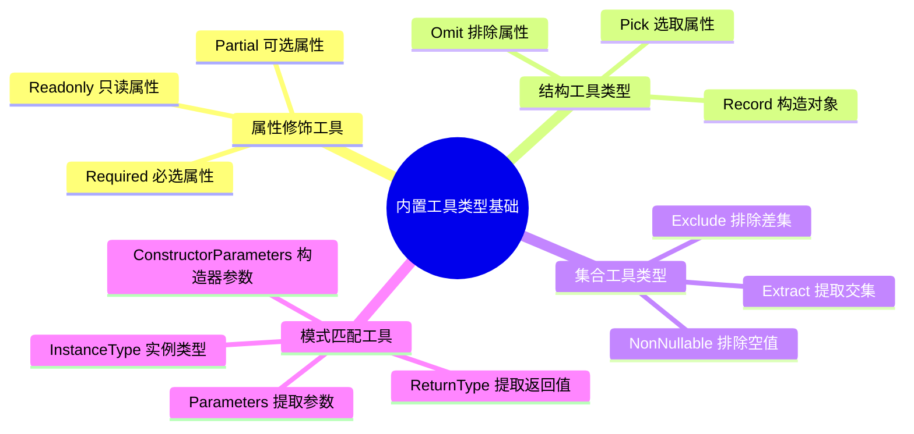

# 内置工具类型基础

## 知识架构



## 本章概览

上一章的条件类型与 `infer` 解决了"如何判断和提取"，本章把它们落地到 TypeScript 内置的工具类型上：工具类型（Utility Types）是 TypeScript 内置的类型工具，可以帮助我们进行类型转换、类型提取和类型约束。理解内置工具类型的实现原理，是掌握 TypeScript 类型编程的关键一步。

**学习目标：**
- 掌握 TypeScript 内置工具类型的分类和用途
- 理解每种工具类型的实现原理
- 了解工具类型的扩展方向
- 能够在实际项目中正确选择和使用工具类型

**工具类型分类总览：**

```
┌─────────────────────────────────────────────────────────────┐
│                    TypeScript 工具类型                       │
├─────────────────┬───────────────────┬───────────────────────┤
│  属性修饰工具    │   结构工具类型     │   集合工具类型        │
│  - Partial      │   - Record        │   - Extract           │
│  - Required     │   - Pick          │   - Exclude           │
│  - Readonly     │   - Omit          │   - NonNullable       │
├─────────────────┴───────────────────┴───────────────────────┤
│              模式匹配工具类型                │
│              - Parameters     - ReturnType                   │
│              - ConstructorParameters  - InstanceType        │
├─────────────────────────────────────────────────────────────┤
│              模板字符串工具类型（见后续章节）                   │
└─────────────────────────────────────────────────────────────┘
```

---

## 工具类型概述

### 什么是工具类型？

工具类型本质上是一种**类型转换函数**——接受一个或多个类型作为输入，返回一个新的类型。它们能够：

1. **减少重复代码**：避免手动定义相似的类型结构
2. **提高类型安全**：确保类型转换的一致性和正确性
3. **增强代码可维护性**：集中管理类型变换逻辑

### 类型编程的四大范式

内置工具类型按照类型操作的不同，可以划分为以下几类：

| 分类 | 说明 | 典型工具类型 | 核心技术 |
|------|------|--------------|----------|
| **属性修饰工具类型** | 对属性的可选/必选、只读/可写进行修饰 | `Partial`、`Required`、`Readonly` | 映射类型、索引类型 |
| **结构工具类型** | 对既有类型的裁剪、拼接、转换 | `Pick`、`Omit`、`Record` | 映射类型、条件类型 |
| **集合工具类型** | 对联合类型进行集合运算 | `Extract`、`Exclude`、`NonNullable` | 分布式条件类型 |
| **模式匹配工具类型** | 基于 `infer` 提取类型的特定部分 | `Parameters`、`ReturnType`、`InstanceType` | 条件类型、infer |

### 工具类型的类型层级

```
TypeScript 类型系统
├── 原始类型（string, number, boolean...）
├── 对象类型（interface, type...）
├── 联合类型（A | B）
├── 交叉类型（A & B）
└── 工具类型 ← 本节重点
    ├── 输入：一个或多个类型
    ├── 处理：类型转换/提取/约束
    └── 输出：新的类型
```

---

## 属性修饰工具类型

属性修饰工具类型主要使用**映射类型**与**索引类型**，对对象属性的可选性和只读性进行控制。

### Partial\<T\> - 可选属性

将类型 `T` 的所有属性变为可选：

```typescript
type Partial<T> = {
  [P in keyof T]?: T[P];
};

// 使用示例
interface User {
  name: string;
  age: number;
  email: string;
}

// 所有属性都变成可选的
type PartialUser = Partial<User>;
// 等价于：
// {
//   name?: string;
//   age?: number;
//   email?: string;
// }

// 实际应用：更新函数
function updateUser(user: User, updates: Partial<User>): User {
  return { ...user, ...updates };
}

const user: User = { name: 'Alice', age: 30, email: 'alice@example.com' };
updateUser(user, { age: 25 }); // 只更新 age

// 实际应用：配置合并
interface AppConfig {
  apiUrl: string;
  timeout: number;
  retryCount: number;
}

function createConfig(defaults: AppConfig, userConfig: Partial<AppConfig>): AppConfig {
  return { ...defaults, ...userConfig };
}

const defaults: AppConfig = {
  apiUrl: 'https://api.example.com',
  timeout: 5000,
  retryCount: 3
};

createConfig(defaults, { timeout: 10000 }); // 用户只覆盖 timeout
```

**应用场景：**
- 函数参数可选化（更新、合并、配置）
- 表单数据部分更新
- API 请求的可选字段

### Required\<T\> - 必选属性

将类型 `T` 的所有属性变为必选：

```typescript
type Required<T> = {
  [P in keyof T]-?: T[P];
};

// 使用示例
interface Config {
  host?: string;
  port?: number;
  debug?: boolean;
}

type RequiredConfig = Required<Config>;
// 所有属性都变成必选的

// 实际应用：确保配置完整
function initializeApp(config: Required<Config>) {
  console.log(`Connecting to ${config.host}:${config.port}`);
  // config.debug 一定存在，不需要判断 undefined
}

// 实际应用：表单验证后确保字段完整
interface FormData {
  username?: string;
  email?: string;
  password?: string;
}

type CompleteFormData = Required<FormData>;

function submitForm(data: CompleteFormData) {
  // 所有字段一定存在
  return fetch('/api/register', {
    method: 'POST',
    body: JSON.stringify(data)
  });
}
```

> 💡 **提示**：`-?` 修饰符表示移除可选标记，而 `+?`（可省略）表示添加可选标记。

### Readonly\<T\> - 只读属性

将类型 `T` 的所有属性变为只读：

```typescript
type Readonly<T> = {
  readonly [P in keyof T]: T[P];
};

// 使用示例
interface Point {
  x: number;
  y: number;
}

type ReadonlyPoint = Readonly<Point>;
// {
//   readonly x: number;
//   readonly y: number;
// }

const point: ReadonlyPoint = { x: 10, y: 20 };
point.x = 30; // Error: 无法分配到 "x" ，因为它是只读属性

// 实际应用：不可变配置
interface ApiConfig {
  baseUrl: string;
  apiKey: string;
  maxRetries: number;
}

function createApiClient(config: Readonly<ApiConfig>) {
  // 配置在函数内部不可被修改，确保一致性
  return {
    get: (endpoint: string) => fetch(`${config.baseUrl}${endpoint}`),
    config // 外部也无法修改这个配置
  };
}

// 实际应用：保护对象不被外部修改
interface User {
  id: number;
  name: string;
  email: string;
}

function freezeUser(user: User): Readonly<User> {
  return Object.freeze({ ...user });
}
```

### 可选标记 vs undefined 类型

> ⚠️ **重要区别**：可选标记 `?` 不等于修改类型为 `原类型 | undefined`。

```typescript
interface Foo {
  optional: string | undefined;  // 类型包含 undefined，但属性仍是必选的
  required: string;
}

// 错误：缺少 optional 属性
const foo1: Foo = {
  required: '1',
};

// 正确：提供了 optional 属性
const foo2: Foo = {
  required: '1',
  optional: undefined
};

// 对比：使用可选标记
interface Bar {
  optional?: string;  // 属性可选，可以不提供
  required: string;
}

// 正确：可以不提供 optional
const bar: Bar = {
  required: '1'
};
```

**区别总结：**

```
┌──────────────────────────────────────────────────────────────┐
│  optional?: string        → 可以不提供属性                    │
│  optional: string | undefined → 必须提供属性，值可以是 undefined │
└──────────────────────────────────────────────────────────────┘
```

### 扩展：Mutable\<T\>

TypeScript 没有内置 `Mutable` 类型，但我们可以轻松实现：

```typescript
type Mutable<T> = {
  -readonly [P in keyof T]: T[P];
};

// 使用示例
interface ReadonlyConfig {
  readonly apiUrl: string;
  readonly timeout: number;
}

type MutableConfig = Mutable<ReadonlyConfig>;
// {
//   apiUrl: string;
//   timeout: number;
// }

// 实际应用：修改只读对象
const readonlyConfig: ReadonlyConfig = {
  apiUrl: 'https://api.example.com',
  timeout: 5000
};

function updateConfig(config: Mutable<ReadonlyConfig>) {
  config.timeout = 10000; // 现在可以修改了
  return config as ReadonlyConfig;
}
```

### 属性修饰符操作总结

```
┌────────────────────────────────────────────────────────────┐
│           属性修饰符操作符                                  │
├──────────────┬─────────────────────────────────────────────┤
│  +?          │  添加可选标记（默认行为）                     │
│  -?          │  移除可选标记                                │
│  +readonly   │  添加只读标记（默认行为）                     │
│  -readonly   │  移除只读标记                                │
└──────────────┴─────────────────────────────────────────────┘
```

### 扩展方向思考

在实际应用中，我们可能会遇到以下需求：

1. **深层属性修饰**：如何将嵌套对象的所有属性也进行修饰？
   ```typescript
   interface DeepUser {
     name: string;
     profile: {
       age: number;
       address: {
         city: string;
         country: string;
       };
     };
   }
   
   // 需要 DeepPartial<DeepUser> 让所有层级的属性都可选
   ```

2. **部分属性修饰**：如何只修饰特定的属性？
   - 基于已知键名（如只修饰 `name` 和 `age`）
   - 基于属性类型（如只修饰函数类型的属性）

这些进阶用法将在下一章详细讲解。

---

## 结构工具类型

结构工具类型可以分为**结构声明**和**结构处理**两类。

### Record\<K, T\> - 结构声明

创建一个键类型为 `K`、值类型为 `T` 的对象类型：

```typescript
type Record<K extends keyof any, T> = {
  [P in K]: T;
};

// 使用示例
// 键名均为字符串，键值类型为 number
type AgeMap = Record<string, number>;

// 使用字面量联合类型作为键
type UserRole = 'admin' | 'user' | 'guest';
type RolePermissions = Record<UserRole, string[]>;

const permissions: RolePermissions = {
  admin: ['read', 'write', 'delete'],
  user: ['read', 'write'],
  guest: ['read']
};

// 实际应用：路由配置
type HttpMethod = 'GET' | 'POST' | 'PUT' | 'DELETE';
type RouteHandler = (req: any, res: any) => void;

type RouteConfig = Record<HttpMethod, RouteHandler>;

const apiRoutes: RouteConfig = {
  GET: (req, res) => res.json({ data: 'list' }),
  POST: (req, res) => res.json({ created: true }),
  PUT: (req, res) => res.json({ updated: true }),
  DELETE: (req, res) => res.json({ deleted: true })
};

// 实际应用：状态管理
type Status = 'idle' | 'loading' | 'success' | 'error';
type StateConfig = Record<Status, { color: string; message: string }>;

const statusConfig: StateConfig = {
  idle: { color: 'gray', message: '等待操作' },
  loading: { color: 'blue', message: '加载中...' },
  success: { color: 'green', message: '操作成功' },
  error: { color: 'red', message: '操作失败' }
};

// 常见用法：替代 object 类型
type StringDictionary = Record<string, unknown>;
type NumericDictionary = Record<string, any>;
```

**Record vs 普通对象类型：**

```typescript
// 方式 1：普通对象类型
interface UserDict {
  [key: string]: User;
}

// 方式 2：Record
type UserDict = Record<string, User>;

// 方式 2 优势：更清晰地表达"所有键都是同一类型，所有值都是同一类型"
```

### Pick\<T, K\> - 选取属性

从类型 `T` 中选取一组属性 `K`，构造新的类型：

```typescript
type Pick<T, K extends keyof T> = {
  [P in K]: T[P];
};

// 使用示例
interface User {
  id: number;
  name: string;
  email: string;
  password: string;
  createdAt: Date;
}

// 只选取公开信息
type PublicUser = Pick<User, 'id' | 'name' | 'email'>;
// {
//   id: number;
//   name: string;
//   email: string;
// }

// 实际应用：API 响应类型
type UserResponse = Pick<User, 'id' | 'name' | 'email' | 'createdAt'>;

// 实际应用：表单数据
type UserForm = Pick<User, 'name' | 'email'>;

// 实际应用：权限控制
interface Document {
  id: string;
  title: string;
  content: string;
  authorId: string;
  isPublished: boolean;
  createdAt: Date;
}

// 公开视图：只暴露部分字段
type PublicDocument = Pick<Document, 'id' | 'title' | 'authorId' | 'createdAt'>;

// 编辑视图：暴露可编辑字段
type EditableDocument = Pick<Document, 'title' | 'content'>;
```

### Omit\<T, K\> - 排除属性

从类型 `T` 中排除一组属性 `K`，构造新的类型：

```typescript
type Omit<T, K extends keyof any> = Pick<T, Exclude<keyof T, K>>;

// 使用示例
interface User {
  id: number;
  name: string;
  email: string;
  password: string;
  createdAt: Date;
}

// 排除敏感字段
type SafeUser = Omit<User, 'password'>;
// {
//   id: number;
//   name: string;
//   email: string;
//   createdAt: Date;
// }

// 实际应用：创建时排除自动生成字段
type CreateUserDTO = Omit<User, 'id' | 'createdAt'>;

const newUser: CreateUserDTO = {
  name: 'Alice',
  email: 'alice@example.com',
  password: 'secure123'
};

// 实际应用：更新时排除不可变字段
type UpdateUserDTO = Omit<User, 'id' | 'createdAt'>;

// 实际应用：排除多个字段
type UserPreview = Omit<User, 'password' | 'email' | 'createdAt'>;
```

### Pick 与 Omit 的对比

```typescript
interface Product {
  id: string;
  name: string;
  price: number;
  description: string;
  stock: number;
}

// Pick：明确要保留的属性（白名单模式）
type ProductPreview = Pick<Product, 'id' | 'name' | 'price'>;

// Omit：明确要排除的属性（黑名单模式）
type ProductWithoutStock = Omit<Product, 'stock' | 'description'>;
```

**选择原则：**

```
┌──────────────────────────────────────────────────────────────┐
│  保留的属性少  → 使用 Pick（白名单）                          │
│  排除的属性少  → 使用 Omit（黑名单）                          │
│  属性数量相当  → 根据语义选择                                 │
│                - 表达"只取这些"用 Pick                        │
│                - 表达"不要这些"用 Omit                        │
└──────────────────────────────────────────────────────────────┘
```

### 关于 Omit 的类型约束

你可能注意到 `Pick` 约束 `K extends keyof T`，而 `Omit` 约束 `K extends keyof any`。这是为了支持以下场景：

```typescript
declare function combineSpread<T1, T2>(
  obj: T1, 
  otherObj: T2, 
  rest: Omit<T1, keyof T2>
): void;

type Point3d = { x: number, y: number, z: number };
declare const p1: Point3d;

// 能够检测出错误：rest 中缺少 y
combineSpread(p1, { x: 10 }, { z: 2 });
// rest 应该包含 y，因为 otherObj 只包含 x

// 如果 Omit 使用 K extends keyof T1，则无法检测这类错误
```

### 扩展方向思考

1. **基于值类型的选取**：如何选取所有函数类型的属性？
   ```typescript
   interface Component {
     id: string;
     name: string;
     onClick: () => void;
     onChange: (value: string) => void;
   }
   
   // 如何提取所有函数类型的属性？
   type ComponentMethods = PickFunctions<Component>;
   // { onClick: () => void; onChange: (value: string) => void; }
   ```

2. **互斥属性处理**：如何定义"存在 A 就不能存在 B"的类型关系？

---

## 集合工具类型

集合工具类型主要使用**条件类型**和**分布式条件类型**，对联合类型进行集合运算。

### 数学背景

对于两个集合 A 和 B，存在以下基本运算：

```
┌───────────────────────────────────────────────────────┐
│  并集：A ∪ B = A 和 B 中所有元素                        │
│  交集：A ∩ B = 同时在 A 和 B 中的元素                    │
│  差集：A - B = 在 A 中但不在 B 中的元素                  │
│  补集：Ā = 全集中不在 A 的元素（A 为全集子集）           │
└───────────────────────────────────────────────────────┘
```

**Venn 图表示：**

```
    ┌─────────┐
    │    A    │     并集 A ∪ B
    │   ┌─────┼───┐  = A + B 区域
    │   │  ∩  │   │
    └───┼─────┘   │  交集 A ∩ B
        │    B    │  = 重叠区域
        └─────────┘
```

### Extract\<T, U\> - 交集

从类型 `T` 中提取可以赋值给 `U` 的类型：

```typescript
type Extract<T, U> = T extends U ? T : never;

// 使用示例
type T0 = Extract<"a" | "b" | "c", "a" | "f">;  // "a"
type T1 = Extract<string | number | (() => void), Function>; // () => void

// 实际应用：提取特定类型的联合成员
type Events = 'click' | 'focus' | 'blur' | 'keydown' | 'keyup';
type FocusEvents = Extract<Events, 'focus' | 'blur'>; // "focus" | "blur"

// 实际应用：提取特定接口的实现
interface Animal { name: string; }
interface Dog extends Animal { breed: string; }
interface Cat extends Animal { meow: boolean; }
interface Robot { battery: number; }

type Creature = Dog | Cat | Robot;
type AnimalType = Extract<Creature, Animal>; // Dog | Cat

// 实际应用：事件处理
type EventType = 'click' | 'hover' | 'scroll' | 'resize';
type MouseEvent = Extract<EventType, 'click' | 'hover'>;

function handleMouseEvents(event: MouseEvent) {
  // 只处理鼠标事件
}
```

### Exclude\<T, U\> - 差集

从类型 `T` 中排除可以赋值给 `U` 的类型：

```typescript
type Exclude<T, U> = T extends U ? never : T;

// 使用示例
type T0 = Exclude<"a" | "b" | "c", "a">;  // "b" | "c"
type T1 = Exclude<string | number | (() => void), Function>; // string | number

// 实际应用：从事件类型中排除某些事件
type AllEvents = 'click' | 'focus' | 'blur' | 'keydown' | 'keyup';
type MouseEvents = Exclude<AllEvents, 'keydown' | 'keyup'>; // "click" | "focus" | "blur"

// 实际应用：排除特定类型
type Primitive = string | number | boolean | null | undefined;
type NonNullPrimitive = Exclude<Primitive, null | undefined>; // string | number | boolean

// 实际应用：HTTP 方法排除
type HttpMethod = 'GET' | 'POST' | 'PUT' | 'DELETE' | 'PATCH' | 'OPTIONS' | 'HEAD';
type DataMethod = Exclude<HttpMethod, 'OPTIONS' | 'HEAD'>; // GET | POST | PUT | DELETE | PATCH
```

### NonNullable\<T\> - 排除 null 和 undefined

从类型 `T` 中排除 `null` 和 `undefined`：

```typescript
type NonNullable<T> = T extends null | undefined ? never : T;

// 使用示例
type T0 = NonNullable<string | number | undefined>;  // string | number
type T1 = NonNullable<string | null | undefined>;    // string

// 实际应用：确保参数非空
type FormValue = string | number | null | undefined;

function processValue(value: FormValue): NonNullable<FormValue> {
  if (value === null || value === undefined) {
    throw new Error('value 不能为空');
  }
  return value; // 收窄后剩余 string | number
}

const v = processValue('foo');
console.log(v.toString()); // 安全调用

// 实际应用：API 响应处理
interface ApiResponse<T> {
  data: T | null;
  error: string | null;
}

type SuccessResponse<T> = {
  data: NonNullable<T>;
  error: null;
};

// 实际应用：数组过滤
type MixedArray = (string | number | null | undefined)[];
type NonNullArray = NonNullable<MixedArray[number]>[]; // (string | number)[]

// 实际应用：表单值处理
type FormValue = string | number | null | undefined;
type ValidFormValue = NonNullable<FormValue>; // string | number
```

### 自定义集合工具类型

基于分布式条件类型，我们可以轻松实现其他集合运算：

```typescript
// 并集
type Concurrence<A, B> = A | B;

// 交集（同 Extract）
type Intersection<A, B> = A extends B ? A : never;

// 差集（同 Exclude）
type Difference<A, B> = A extends B ? never : A;

// 补集（需要约束 B 是 A 的子集）
type Complement<A, B extends A> = Difference<A, B>;

// 使用示例
type Set1 = 1 | 2 | 3 | 4 | 5;
type Set2 = 3 | 4 | 5 | 6 | 7;

type Union = Concurrence<Set1, Set2>;      // 1 | 2 | 3 | 4 | 5 | 6 | 7
type Intersect = Intersection<Set1, Set2>; // 3 | 4 | 5
type Diff = Difference<Set1, Set2>;        // 1 | 2
type Comp = Complement<Set1, 1 | 2>;       // 3 | 4 | 5
```

### 集合运算可视化

```
集合 A = {1, 2, 3, 4, 5}
集合 B = {3, 4, 5, 6, 7}

运算结果：
┌────────────────────────────────────────────────┐
│  A ∪ B = {1, 2, 3, 4, 5, 6, 7}   并集         │
│  A ∩ B = {3, 4, 5}               交集         │
│  A - B = {1, 2}                  差集         │
│  B - A = {6, 7}                  差集         │
└────────────────────────────────────────────────┘

对应的工具类型：
┌────────────────────────────────────────────────┐
│  Concurrence<A, B> = A | B                     │
│  Intersection<A, B> = Extract<A, B>            │
│  Difference<A, B> = Exclude<A, B>              │
│  Complement<A, B> = Exclude<A, B> (B extends A)│
└────────────────────────────────────────────────┘
```

### 扩展方向思考

1. **对象类型集合运算**：如何在对象类型层面进行集合运算？
   ```typescript
   type ObjA = { a: number; b: string };
   type ObjB = { b: number; c: boolean };
   // 如何实现对象属性的集合运算？
   ```

2. **同名属性处理**：合并对象时，如何处理同名属性的优先级？

---

## 模式匹配工具类型

模式匹配工具类型基于**条件类型**和**infer 关键字**，从函数类型和类类型中提取特定部分的类型信息。

### 函数类型提取

#### Parameters\<T\> - 提取函数参数类型

```typescript
type Parameters<T extends (...args: any) => any> = T extends (
  ...args: infer P
) => any
  ? P
  : never;

// 使用示例
type T0 = Parameters<() => string>;              // []
type T1 = Parameters<(s: string) => void>;       // [s: string]
type T2 = Parameters<(a: number, b: string) => void>; // [a: number, b: string]

// 实际应用：从函数签名推断参数类型
function greet(name: string, age: number): string {
  return `Hello, ${name}! You are ${age} years old.`;
}

type GreetParams = Parameters<typeof greet>; // [name: string, age: number]

// 实际应用：包装函数保持参数类型
function logCall<T extends (...args: any) => any>(
  fn: T,
  ...args: Parameters<T>
): ReturnType<T> {
  console.log(`Calling with args:`, args);
  return fn(...args);
}

// 实际应用：类型安全的函数调用
type EventHandler = (event: Event, target: HTMLElement) => void;
type HandlerParams = Parameters<EventHandler>; // [event: Event, target: HTMLElement]
```

#### ReturnType\<T\> - 提取函数返回值类型

```typescript
type ReturnType<T extends (...args: any) => any> = T extends (
  ...args: any
) => infer R
  ? R
  : never;

// 使用示例
type T0 = ReturnType<() => string>;     // string
type T1 = ReturnType<(x: number) => boolean>; // boolean
type T2 = ReturnType<typeof Math.random>; // number

// 实际应用：自动推断异步函数返回类型
async function fetchData() {
  return { id: 1, name: 'test' };
}

type Data = ReturnType<typeof fetchData>; // Promise<{ id: number; name: string; }>

// 实际应用：提取 Promise 返回值
type Awaited<T> = T extends Promise<infer U> ? U : T;
type AsyncData = Awaited<ReturnType<typeof fetchData>>; // { id: number; name: string; }

// 实际应用：API 响应类型推断
function createUser(data: { name: string; email: string }) {
  return {
    id: Math.random(),
    ...data,
    createdAt: new Date()
  };
}

type UserResponse = ReturnType<typeof createUser>;
// { id: number; name: string; email: string; createdAt: Date; }
```

### 类类型提取

#### ConstructorParameters\<T\> - 提取构造函数参数类型

```typescript
type ConstructorParameters<T extends abstract new (...args: any) => any> = 
  T extends abstract new (...args: infer P) => any ? P : never;

// 使用示例
class User {
  constructor(
    public name: string,
    public age: number
  ) {}
}

type UserConstructorParams = ConstructorParameters<typeof User>; 
// [name: string, age: number]

// 实际应用：依赖注入
class Database {
  constructor(
    public host: string,
    public port: number,
    public username: string,
    public password: string
  ) {}
}

type DbConfig = ConstructorParameters<typeof Database>;
// [host: string, port: number, username: string, password: string]

// 实际应用：工厂函数
function createInstance<C extends abstract new (...args: any) => any>(
  Class: C,
  ...args: ConstructorParameters<C>
): InstanceType<C> {
  return new Class(...args);
}

const db = createInstance(Database, 'localhost', 5432, 'admin', 'password');
```

#### InstanceType\<T\> - 提取实例类型

```typescript
type InstanceType<T extends abstract new (...args: any) => any> = 
  T extends abstract new (...args: any) => infer R ? R : never;

// 使用示例
class User {
  name: string;
  constructor(name: string) {
    this.name = name;
  }
}

type UserInstance = InstanceType<typeof User>; // User

// 实际应用：从类获取实例类型
function createUser<C extends abstract new (...args: any[]) => any>(
  Class: C,
  ...args: ConstructorParameters<C>
): InstanceType<C> {
  return new Class(...args);
}

// 实际应用：泛型工厂模式
interface Entity {
  id: string;
  save(): void;
}

function createRepository<T extends abstract new (...args: any) => Entity>(
  EntityClass: T
) {
  return {
    create: (...args: ConstructorParameters<T>): InstanceType<T> => {
      return new EntityClass(...args);
    },
    findById: (id: string): InstanceType<T> | null => {
      // 数据库查询逻辑
      return null;
    }
  };
}
```

### 模式匹配流程图

```
函数类型 (a: string, b: number) => boolean
         │
         ▼
┌────────────────────────────────────────┐
│  Parameters: 提取参数类型               │
│  [a: string, b: number]                │
└────────────────────────────────────────┘
         │
         ▼
┌────────────────────────────────────────┐
│  ReturnType: 提取返回类型               │
│  boolean                               │
└────────────────────────────────────────┘

类类型 class User { constructor(name: string) {} }
         │
         ▼
┌────────────────────────────────────────┐
│  ConstructorParameters: 提取构造参数    │
│  [name: string]                        │
└────────────────────────────────────────┘
         │
         ▼
┌────────────────────────────────────────┐
│  InstanceType: 提取实例类型             │
│  User                                  │
└────────────────────────────────────────┘
```

### 扩展：提取第一个参数类型

```typescript
type FirstParameter<T extends (...args: any) => any> = T extends (
  arg: infer P,
  ...args: any
) => any
  ? P
  : never;

type FuncFoo = (arg: number) => void;
type FuncBar = (...args: string[]) => void;

type FooFirstParameter = FirstParameter<FuncFoo>; // number
type BarFirstParameter = FirstParameter<FuncBar>; // string

// 实际应用：提取事件处理器的第一个参数
type EventHandler = (event: Event, target: HTMLElement) => void;
type EventParam = FirstParameter<EventHandler>; // Event
```

### 扩展：提取最后一个参数类型

```typescript
type LastParameter<T extends (...args: any) => any> = T extends (arg: infer P) => any
  ? P
  : T extends (...args: infer Rest) => any
  ? Rest extends [...any[], infer L]
    ? L
    : never
  : never;

type Func = (a: string, b: number, c: boolean) => void;
type Last = LastParameter<Func>; // boolean
```

### 扩展方向思考

1. **深层模式匹配**：如何处理多层嵌套的类型结构？
2. **特殊位置提取**：如何提取函数的最后一个参数类型？
3. **infer 约束**：如何对提取的类型添加约束条件？

---

## 工具类型组合应用

### 组合模式示例

```typescript
// 场景 1：创建 DTO（数据传输对象）
interface User {
  id: number;
  name: string;
  email: string;
  password: string;
  createdAt: Date;
  updatedAt: Date;
}

// 创建 DTO：排除自动生成字段
type CreateUserDTO = Omit<User, 'id' | 'createdAt' | 'updatedAt'>;

// 更新 DTO：所有字段可选，排除只读字段
type UpdateUserDTO = Partial<Omit<User, 'id' | 'createdAt'>>;

// 响应 DTO：排除敏感字段
type UserResponseDTO = Omit<User, 'password'>;

// 场景 2：表单状态管理
interface FormState<T> {
  data: T;
  errors: Partial<Record<keyof T, string>>;
  touched: Partial<Record<keyof T, boolean>>;
}

type UserFormState = FormState<User>;

// 场景 3：API 请求参数
interface PaginatedRequest<T> {
  data: T;
  pagination: {
    page: number;
    pageSize: number;
  };
  filters?: Partial<T>;
}

// 场景 4：事件处理器
type EventHandler<T extends string> = {
  [K in T]: (event: Event) => void;
};

type MouseEventHandler = EventHandler<'click' | 'dblclick' | 'contextmenu'>;
```

### 实际项目案例

```typescript
// 案例 1：用户管理系统
interface User {
  id: string;
  username: string;
  email: string;
  password: string;
  role: 'admin' | 'user' | 'guest';
  isActive: boolean;
  createdAt: Date;
  updatedAt: Date;
}

// 不同场景的类型
type UserCreateInput = Omit<User, 'id' | 'createdAt' | 'updatedAt'>;
type UserUpdateInput = Partial<Omit<User, 'id' | 'createdAt'>>;
type UserPublic = Omit<User, 'password'>;
type UserFilter = Partial<Pick<User, 'role' | 'isActive'>>;

// 案例 2：商品管理系统
interface Product {
  id: string;
  name: string;
  description: string;
  price: number;
  stock: number;
  category: string;
  tags: string[];
  images: string[];
  createdAt: Date;
}

// API 响应类型
type ProductListResponse = Pick<Product, 'id' | 'name' | 'price' | 'stock'>[];
type ProductDetailResponse = Omit<Product, 'createdAt'>;
type ProductCreateInput = Omit<Product, 'id' | 'createdAt'>;
type ProductUpdateInput = Partial<ProductCreateInput>;

// 案例 3：权限系统
type Action = 'create' | 'read' | 'update' | 'delete';
type Resource = 'user' | 'product' | 'order';

type Permission = Record<Resource, Record<Action, boolean>>;

const defaultPermissions: Permission = {
  user: { create: false, read: true, update: false, delete: false },
  product: { create: false, read: true, update: false, delete: false },
  order: { create: false, read: true, update: false, delete: false }
};
```

---

## 工具类型速查表

### 属性修饰

| 工具类型 | 作用 | 示例 | 应用场景 |
|---------|------|------|----------|
| `Partial<T>` | 所有属性可选 | `Partial<{ a: string }>` → `{ a?: string }` | 更新对象、表单数据 |
| `Required<T>` | 所有属性必选 | `Required<{ a?: string }>` → `{ a: string }` | 确保配置完整 |
| `Readonly<T>` | 所有属性只读 | `Readonly<{ a: string }>` → `{ readonly a: string }` | 不可变对象、配置保护 |

### 结构处理

| 工具类型 | 作用 | 示例 | 应用场景 |
|---------|------|------|----------|
| `Record<K, T>` | 构建对象类型 | `Record<'a' \| 'b', number>` → `{ a: number; b: number }` | 字典、映射、配置 |
| `Pick<T, K>` | 选取属性 | `Pick<{a, b, c}, 'a' \| 'b'>` → `{ a, b }` | API 响应、视图模型 |
| `Omit<T, K>` | 排除属性 | `Omit<{a, b, c}, 'c'>` → `{ a, b }` | 排除敏感字段、DTO |

### 集合运算

| 工具类型 | 作用 | 示例 | 应用场景 |
|---------|------|------|----------|
| `Extract<T, U>` | 提取交集 | `Extract<'a' \| 'b' \| 'c', 'a' \| 'd'>` → `'a'` | 类型过滤、事件分类 |
| `Exclude<T, U>` | 排除交集 | `Exclude<'a' \| 'b' \| 'c', 'a'>` → `'b' \| 'c'` | 排除特定类型 |
| `NonNullable<T>` | 排除空值 | `NonNullable<string \| null>` → `string` | 确保值非空 |

### 模式匹配

| 工具类型 | 作用 | 示例 | 应用场景 |
|---------|------|------|----------|
| `Parameters<T>` | 提取参数类型 | `Parameters<(a: string) => void>` → `[string]` | 函数包装、类型推断 |
| `ReturnType<T>` | 提取返回类型 | `ReturnType<() => string>` → `string` | API 响应推断 |
| `ConstructorParameters<T>` | 提取构造参数 | `ConstructorParameters<typeof Date>` | 依赖注入、工厂模式 |
| `InstanceType<T>` | 提取实例类型 | `InstanceType<typeof Date>` → `Date` | 工厂模式、类型推断 |

---

## 常见问题与陷阱

### 问题 1：Partial 的嵌套问题

```typescript
// 问题：Partial 只处理第一层
interface User {
  name: string;
  profile: {
    age: number;
    address: {
      city: string;
    };
  };
}

type PartialUser = Partial<User>;
// profile 仍然是必选的，且其内部属性也是必选的

// 解决方案：使用 DeepPartial（下一章讲解）
type DeepPartial<T> = {
  [P in keyof T]?: T[P] extends object ? DeepPartial<T[P]> : T[P];
};
```

### 问题 2：Readonly 的浅层限制

```typescript
// 问题：Readonly 只保护第一层
interface Config {
  settings: {
    theme: string;
  };
}

type ReadonlyConfig = Readonly<Config>;

const config: ReadonlyConfig = {
  settings: { theme: 'dark' }
};

config.settings = { theme: 'light' }; // Error ✓
config.settings.theme = 'light';      // OK ✗ （内部仍可修改）

// 解决方案：使用 DeepReadonly
type DeepReadonly<T> = {
  readonly [P in keyof T]: T[P] extends object ? DeepReadonly<T[P]> : T[P];
};
```

### 问题 3：联合类型的分布式行为

```typescript
// 问题：分布式条件类型可能产生意外结果
type ToArray<T> = T extends any ? T[] : never;

type Result = ToArray<string | number>; // string[] | number[]
// 而不是 (string | number)[]

// 解决方案：使用元组包裹
type ToArrayFixed<T> = [T] extends [any] ? T[] : never;
type ResultFixed = ToArrayFixed<string | number>; // (string | number)[]
```

### 问题 4：Omit 的类型安全问题

```typescript
// 问题：Omit 不会检查排除的键是否存在
interface User {
  id: number;
  name: string;
}

type SafeUser = Omit<User, 'password'>; // 不会报错
// 即使 User 没有 password 属性

// 解决方案：自定义 StrictOmit
type StrictOmit<T, K extends keyof T> = Pick<T, Exclude<keyof T, K>>;
type SafeUserStrict = StrictOmit<User, 'password'>; // Error: 'password' 不存在
```

### 问题 5：函数重载的参数提取

```typescript
// 问题：Parameters 只提取最后一个签名
function func(x: string): string;
function func(x: string, y: number): string;
function func(x: string, y?: number): string {
  return x + (y ?? '');
}

type Params = Parameters<typeof func>; // [x: string, y: number]
// Parameters 取的是最后一个重载签名（实现签名不参与重载）

// 解决方案：无法完美解决，建议使用单一函数签名
```

---

## 性能考量

### 类型推断性能

```typescript
// 好的做法：简单直接的类型
type UserPreview = Pick<User, 'id' | 'name'>;

// 避免：过度嵌套的工具类型
type ComplexType = Partial<Readonly<Omit<Pick<User, 'id' | 'name'>, 'id'>>>;
// 类型推断变慢，编译时间增加
```

### 循环引用问题

```typescript
// 问题：循环引用导致无限递归
interface Node {
  value: string;
  children: Node[];
}

type PartialNode = Partial<Node>; // OK
type DeepPartialNode = DeepPartial<Node>; // 可能导致无限递归

// 解决方案：限制递归深度
type DeepPartial<T, Depth extends number = 5> = Depth extends 0 
  ? T 
  : {
      [P in keyof T]?: T[P] extends object 
        ? DeepPartial<T[P], Depth extends 5 ? 4 : Depth extends 4 ? 3 : Depth extends 3 ? 2 : Depth extends 2 ? 1 : 0>
        : T[P];
    };
```

---

## TypeScript 版本兼容性

### 工具类型引入版本

| 工具类型 | 引入版本 | 说明 |
|---------|---------|------|
| `Partial`、`Required`、`Readonly` | 2.1 | 基础属性修饰 |
| `Pick`、`Record` | 2.1 | 结构处理 |
| `Omit` | 3.5 | 官方支持 |
| `Extract`、`Exclude`、`NonNullable` | 2.8 | 集合运算 |
| `Parameters`、`ReturnType` | 3.1 | 函数类型提取 |
| `ConstructorParameters`、`InstanceType` | 3.1 | 类类型提取 |

### 版本差异注意事项

```typescript
// TypeScript < 3.5：需要自己实现 Omit
type Omit<T, K extends keyof any> = Pick<T, Exclude<keyof T, K>>;

// TypeScript 4.0+：支持元组展开（先提取参数元组，再取最后一个元素）
type LastParameter<T extends (...args: any) => any> = T extends (arg: infer P) => any
  ? P
  : T extends (...args: infer Rest) => any
  ? Rest extends [...any[], infer L] ? L : never
  : never;

// TypeScript 4.7+：支持 infer 约束
type FirstStringItem<T extends any[]> = 
  T extends [infer P extends string, ...any[]] ? P : never;
```

---

## 总结

### 核心要点

1. **工具类型本质**：类型层面的函数，接受类型输入，返回新类型
2. **实现原理**：映射类型、条件类型、索引类型、infer 关键字的组合
3. **分类方式**：属性修饰、结构处理、集合运算、模式匹配

### 最佳实践

1. **优先使用内置工具类型**：它们经过充分测试，性能更优
2. **理解原理再扩展**：在理解实现原理的基础上进行扩展
3. **组合使用**：复杂类型变换可以通过多个工具类型组合实现
4. **注意性能**：避免过度嵌套和循环引用
5. **类型安全**：使用 StrictOmit 等严格的工具类型变体

### 学习路径

```
Level 1: 掌握基础工具类型
   ↓
Level 2: 理解实现原理
   ↓
Level 3: 组合使用工具类型
   ↓
Level 4: 自定义工具类型
   ↓
Level 5: 高级类型编程
```

## 内置工具类型的源码级解析

理解内置工具类型的实现原理，有助于深入掌握类型编程的思维方式。以下从六大套路的角度重新解读常见工具类型的实现。

### 属性修饰类工具类型的实现

```typescript
// Partial<T>：模式匹配 + 重新构造（将所有属性变为可选）
type MyPartial<T> = {
    [K in keyof T]?: T[K];   // 重新构造 + ? 可选修饰
};

// Required<T>：模式匹配 + 重新构造（将所有属性变为必选）
type MyRequired<T> = {
    [K in keyof T]-?: T[K];  // -? 移除可选修饰
};

// Readonly<T>：模式匹配 + 重新构造（将所有属性变为只读）
type MyReadonly<T> = {
    readonly [K in keyof T]: T[K];  // +readonly 添加只读修饰
};

// Mutable<T>（非内置）：移除只读修饰
type MyMutable<T> = {
    -readonly [K in keyof T]: T[K]; // -readonly 移除只读修饰
};

// Pick<T, K>：模式匹配 + 重新构造（提取指定属性）
type MyPick<T, K extends keyof T> = {
    [P in K]: T[P];  // 只保留 K 对应的属性
};

// Omit<T, K>：模式匹配 + 重新构造（排除指定属性）
type MyOmit<T, K extends keyof any> = Pick<T, Exclude<keyof T, K>>;
// 等价于：
type MyOmitAlt<T, K extends keyof any> = {
    [P in keyof T as P extends K ? never : P]: T[P];  // as 重映射过滤
};

// Record<K, V>：模式映射构造（创建新对象类型）
type MyRecord<K extends keyof any, V> = {
    [P in K]: V;  // 将 K 中的每个键映射为 V 类型
};
```

### 条件推断类工具类型的实现

```typescript
// Exclude<T, U>：联合分散（从 T 中排除 U 的成员）
type MyExclude<T, U> = T extends U ? never : T;
// 原理：分布式条件类型，对联合类型 T 的每个成员分别判断

// Extract<T, U>：联合分散（从 T 中提取 U 的成员）
type MyExtract<T, U> = T extends U ? T : never;

// NonNullable<T>：联合分散（排除 null 和 undefined）
type MyNonNullable<T> = T extends null | undefined ? never : T;

// ReturnType<T>：模式匹配做提取（提取函数返回值类型）
type MyReturnType<T> = T extends (...args: any[]) => infer R ? R : never;
// 原理：套路一——模式匹配，用 infer R 提取返回值位置的类型

// Parameters<T>：模式匹配做提取（提取函数参数类型）
type MyParameters<T> = T extends (...args: infer P) => any ? P : never;

// InstanceType<T>：模式匹配做提取（提取构造器实例类型）
type MyInstanceType<T> = T extends new (...args: any[]) => infer R ? R : never;

// ConstructorParameters<T>：模式匹配做提取（提取构造器参数类型）
type MyConstructorParameters<T> = T extends new (...args: infer P) => any ? P : never;
```

### 较少使用的工具类型

```typescript
// ThisParameterType<T>：提取函数的 this 参数类型
type MyThisParameterType<T> = T extends (this: infer U, ...args: any[]) => any ? U : unknown;

// OmitThisParameter<T>：移除函数的 this 参数
type MyOmitThisParameter<T> = unknown extends ThisParameterType<T>
    ? T                                         // 没有 this 参数，原样返回
    : T extends (...args: infer A) => infer R   // 有 this 参数，重新构造
    ? (...args: A) => R
    : T;

// 使用示例
function foo(this: { name: string }, age: number) { return age; }
type ThisType1 = ThisParameterType<typeof foo>;     // { name: string }
type NoThis = OmitThisParameter<typeof foo>;        // (age: number) => number
```

### 实现原理与套路对应表

| 工具类型 | 使用的套路 | 核心机制 |
|---------|-----------|---------|
| `Partial` / `Required` / `Readonly` | 重新构造做变换 | 映射类型 + 修饰符 |
| `Pick` / `Omit` | 模式匹配 + 重新构造 | keyof + 映射过滤 |
| `Record` | 重新构造做变换 | 键映射构造 |
| `Exclude` / `Extract` / `NonNullable` | 联合分散可简化 | 分布式条件类型 |
| `ReturnType` / `Parameters` | 模式匹配做提取 | extends + infer |
| `InstanceType` / `ConstructorParameters` | 模式匹配做提取 | extends + infer（构造器模式） |
| `ThisParameterType` / `OmitThisParameter` | 模式匹配做提取 + 重新构造 | this 参数 infer + 函数重构 |

---

### 下一章预告

下一章我们将深入探讨工具类型的进阶用法，包括：
- 深层属性修饰（`DeepPartial`、`DeepRequired`）
- 基于值类型的结构处理（`PickByValueType`、`OmitByValueType`）
- 对象类型集合运算
- 互斥属性类型设计

---

> 本节代码见：[Builtin Tool Types](https://link.juejin.cn/?target=https%3A%2F%2Fgithub.com%2Flinbudu599%2FTypeScript-Tiny-Book%2Ftree%2Fmain%2Fpackages%2F10-builtin-tool-type)

## 扩展阅读：infer 约束

TypeScript 4.7 引入了 `infer` 约束功能，可以在提取类型时添加约束条件：

```typescript
// 传统写法：先提取再判断
type FirstArrayItemType<T extends any[]> = T extends [infer P, ...any[]]
  ? P extends string
    ? P
    : never
  : never;

// 使用 infer 约束：直接在提取时约束
type FirstStringItem<T extends any[]> = T extends [infer P extends string, ...any[]]
  ? P
  : never;

type Tmp1 = FirstStringItem<[599, 'linbudu']>; // never
type Tmp2 = FirstStringItem<['linbudu', 599]>; // 'linbudu'
```

`infer` 约束特别适合在连续嵌套的条件类型中使用，能够显著提升代码可读性。

### infer 约束的高级应用

```typescript
// 提取 Promise 值类型
type Awaited<T> = T extends Promise<infer U> ? U : T;

// 提取数组第一个元素（带约束）
type FirstString<T extends any[]> = T extends [infer S extends string, ...any[]] 
  ? S 
  : never;

// 提取函数返回值（返回值位置的 infer 约束需要括号包裹）
type ReturnString<T extends (...args: any) => any> = 
  T extends (...args: any) => (infer R extends string) ? R : never;

// 实际应用：类型守卫
function isStringArray(arr: any[]): arr is [string, ...any[]] {
  return typeof arr[0] === 'string';
}

const arr: [599, 'linbudu'] = [599, 'linbudu'];
if (isStringArray(arr)) {
  type First = FirstString<typeof arr>; // string
}
```
