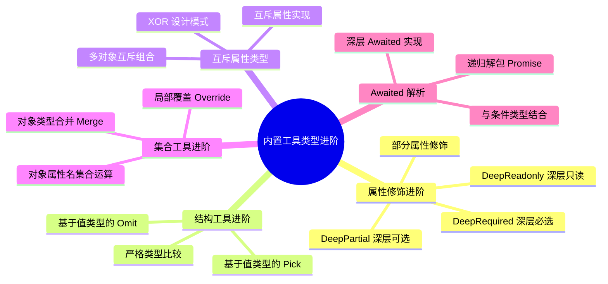

# 内置工具类型进阶

## 知识架构



## 本章概览

本章在上一章的基础上,深入探讨工具类型的进阶用法和实现技巧。我们将学习如何扩展现有的工具类型,解决实际开发中遇到的复杂类型问题。

**学习目标:**
- 掌握深层属性修饰的实现原理
- 学会基于值类型的结构处理
- 理解对象类型集合运算的实现
- 掌握互斥属性类型的设计模式

**本章内容导图:**

```
工具类型进阶知识体系
├── 属性修饰进阶
│   ├── 深层属性修饰（DeepPartial、DeepRequired...）
│   ├── 部分属性修饰（MarkPropsAsOptional...）
│   └── 基于值类型的修饰
│
├── 结构工具进阶
│   ├── 基于值类型的 Pick/Omit
│   ├── 严格类型比较
│   └── 互斥属性类型（XOR）
│
├── 集合工具进阶
│   ├── 对象属性名集合运算
│   ├── 对象类型合并（Merge、Assign）
│   └── 局部覆盖（Override）
│
└── 模式匹配进阶
    ├── 深层嵌套提取
    ├── 特殊位置 infer
    └── Awaited 实现解析
```

**学习路径:**

```
基础工具类型（上一章）
      ↓
深层/部分属性修饰
      ↓
基于值类型的结构处理
      ↓
复杂类型关系（XOR、Merge）
      ↓
高级模式匹配
```

---

## 属性修饰进阶

### 深层属性修饰

内置的 `Partial` 和 `Required` 只能处理浅层属性,对于嵌套对象无法递归处理。通过递归,我们可以实现深层属性修饰。

#### DeepPartial 实现

```typescript
/**
 * 递归地将所有属性变为可选
 * @example
 * type Result = DeepPartial<{
 *   foo: string;
 *   nested: { bar: number };
 * }>;
 * // { foo?: string; nested?: { bar?: number } }
 */
export type DeepPartial<T extends object> = {
  [K in keyof T]?: T[K] extends object 
    ? DeepPartial<T[K]> 
    : T[K];
};
```

**实现原理流程图:**

```
DeepPartial<{ foo: string; nested: { bar: number } }>
                ↓
         第一层映射类型
                ↓
  { foo?: string; nested?: DeepPartial<{ bar: number }> }
                ↓
         递归处理 nested
                ↓
         第二层映射类型
                ↓
  { foo?: string; nested?: { bar?: number } }
```

**使用示例:**

```typescript
import { expectType } from 'tsd';

type DeepPartialStruct = DeepPartial<{
  foo: string;
  nested: {
    nestedFoo: string;
    nestedBar: {
      nestedBarFoo: string;
    };
  };
}>;

// 以下都通过类型检查
expectType<DeepPartialStruct>({
  foo: 'bar',
  nested: {},
});

expectType<DeepPartialStruct>({
  nested: {
    nestedBar: {},
  },
});

expectType<DeepPartialStruct>({
  nested: {
    nestedBar: {
      nestedBarFoo: undefined,
    },
  },
});

// 实际应用：配置对象的部分更新
interface AppConfig {
  database: {
    host: string;
    port: number;
    username: string;
    password: string;
  };
  cache: {
    enabled: boolean;
    ttl: number;
  };
  logging: {
    level: 'debug' | 'info' | 'error';
    file: string;
  };
}

function updateConfig(
  current: AppConfig,
  updates: DeepPartial<AppConfig>
): AppConfig {
  return {
    database: { ...current.database, ...updates.database },
    cache: { ...current.cache, ...updates.cache },
    logging: { ...current.logging, ...updates.logging },
  };
}

// 可以只更新部分配置
updateConfig(currentConfig, {
  database: { port: 3307 }
});
```

#### 其他深层修饰类型

```typescript
// 深层必选
export type DeepRequired<T extends object> = {
  [K in keyof T]-?: T[K] extends object ? DeepRequired<T[K]> : T[K];
};

// 深层只读（也称为 DeepImmutable）
export type DeepReadonly<T extends object> = {
  readonly [K in keyof T]: T[K] extends object ? DeepReadonly<T[K]> : T[K];
};

// 深层可变
export type DeepMutable<T extends object> = {
  -readonly [K in keyof T]: T[K] extends object ? DeepMutable<T[K]> : T[K];
};
```

**使用示例:**

```typescript
interface UserProfile {
  name: string;
  settings: {
    theme: string;
    notifications: {
      email: boolean;
      push: boolean;
    };
  };
}

// 深层必选
type CompleteProfile = DeepRequired<UserProfile>;
// 所有嵌套属性都必须提供

// 深层只读
type ImmutableProfile = DeepReadonly<UserProfile>;
// 所有嵌套属性都不可修改

// 实际应用：状态管理
interface AppState {
  user: {
    profile: UserProfile;
    preferences: {
      language: string;
      timezone: string;
    };
  };
  ui: {
    sidebar: {
      collapsed: boolean;
      width: number;
    };
  };
}

// 深层只读的状态
type ImmutableState = DeepReadonly<AppState>;

// 深层可变的草稿
type MutableDraft = DeepMutable<ImmutableState>;
```

#### DeepNonNullable 与 DeepNullable

处理 `null` 和 `undefined` 的深层修饰:

```typescript
// 基础类型：剔除 null 和 undefined
type NonNullable<T> = T extends null | undefined ? never : T;

// 深层剔除 null 和 undefined
export type DeepNonNullable<T extends object> = {
  [K in keyof T]: T[K] extends object
    ? DeepNonNullable<T[K]>
    : NonNullable<T[K]>;
};

// 基础类型：添加 null
type Nullable<T> = T | null;

// 深层添加 null
export type DeepNullable<T extends object> = {
  [K in keyof T]: T[K] extends object ? DeepNullable<T[K]> : Nullable<T[K]>;
};
```

**实际应用:**

```typescript
// API 响应可能包含 null
interface APIResponse {
  user: {
    name: string | null;
    email: string | null;
    profile: {
      avatar: string | null;
      bio: string | null;
    };
  };
}

// 清理后的数据
type CleanResponse = DeepNonNullable<APIResponse>;
// 所有 null 都被剔除

// 数据清理函数
function cleanResponse(response: APIResponse): CleanResponse {
  // 移除所有 null 值
  return JSON.parse(JSON.stringify(response, (key, value) => 
    value === null ? undefined : value
  ));
}
```

> ⚠️ **注意**: `DeepNullable` 和 `DeepNonNullable` 需要开启 `--strictNullChecks` 才能正常工作。

### 部分属性修饰

有时候我们只需要修饰部分属性,而非全部。这可以通过"拆分-处理-组合"的思路实现。

#### 核心实现思路

```
┌─────────────────────────────────────────────────────────┐
│         部分属性修饰的实现策略                           │
├─────────────────────────────────────────────────────────┤
│  步骤 1: 拆分对象类型                                   │
│    原始对象 → 目标属性 + 其他属性                       │
│                                                          │
│  步骤 2: 处理目标属性                                   │
│    对目标属性应用修饰符                                 │
│                                                          │
│  步骤 3: 组合结果                                       │
│    处理后的属性 + 未处理的属性                          │
└─────────────────────────────────────────────────────────┘
```

#### MarkPropsAsOptional 实现

```typescript
/**
 * 将指定属性标记为可选
 * @param T 目标对象类型
 * @param K 要标记为可选的属性名，默认为全部属性
 */
export type MarkPropsAsOptional<
  T extends object,
  K extends keyof T = keyof T
> = Partial<Pick<T, K>> & Omit<T, K>;

// 为了获得更清晰的类型提示，可以使用 Flatten 展平
export type Flatten<T> = { [K in keyof T]: T[K] };

export type MarkPropsAsOptionalFlat<
  T extends object,
  K extends keyof T = keyof T
> = Flatten<Partial<Pick<T, K>> & Omit<T, K>>;
```

**使用示例:**

```typescript
interface User {
  id: number;
  name: string;
  email: string;
  avatar?: string;
}

// 只让 email 变为可选
type UserWithOptionalEmail = MarkPropsAsOptional<User, 'email'>;
// 等价于:
// {
//   id: number;
//   name: string;
//   email?: string;
//   avatar?: string;
// }

// 不传第二个参数时，行为与 Partial 一致
type AllOptional = MarkPropsAsOptional<User>;

// 实际应用：表单验证
interface FormFields {
  username: string;
  email: string;
  phone?: string;
  address?: string;
}

// 验证时某些字段可选
type ValidationFields = MarkPropsAsOptional<FormFields, 'email'>;
// email 变为可选，其他保持不变

// 实际应用：API 参数
interface QueryParams {
  page: number;
  pageSize: number;
  search?: string;
  filter?: string;
  sort?: string;
}

// 某些查询参数可选
type OptionalQueryParams = MarkPropsAsOptional<
  QueryParams,
  'search' | 'filter' | 'sort'
>;
```

#### 其他部分修饰类型

```typescript
// 部分必选
export type MarkPropsAsRequired<
  T extends object,
  K extends keyof T = keyof T
> = Flatten<Omit<T, K> & Required<Pick<T, K>>>;

// 部分只读
export type MarkPropsAsReadonly<
  T extends object,
  K extends keyof T = keyof T
> = Flatten<Omit<T, K> & Readonly<Pick<T, K>>>;

// 部分可变
export type MarkPropsAsMutable<
  T extends object,
  K extends keyof T = keyof T
> = Flatten<Omit<T, K> & Mutable<Pick<T, K>>>;

// 部分可空
export type MarkPropsAsNullable<
  T extends object,
  K extends keyof T = keyof T
> = Flatten<Omit<T, K> & { [P in K]: T[P] | null }>;

// 部分非空
export type MarkPropsAsNonNullable<
  T extends object,
  K extends keyof T = keyof T
> = Flatten<Omit<T, K> & NonNullable<Pick<T, K>>>;
```

**实际应用场景:**

```typescript
// 场景 1：数据库实体与 API 响应
interface DatabaseUser {
  id: number;
  name: string;
  email: string;
  password: string;
  createdAt: Date;
  updatedAt: Date;
}

// API 响应：排除敏感字段，某些字段只读
type UserResponse = MarkPropsAsReadonly<
  Omit<DatabaseUser, 'password'>,
  'id' | 'createdAt' | 'updatedAt'
>;

// 场景 2：表单数据
interface FormData {
  id?: number;           // 创建时可选
  name: string;          // 必填
  email: string;         // 必填
  phone?: string;        // 可选
  subscribe?: boolean;   // 可选
}

// 更新表单：id 必填
type UpdateFormData = MarkPropsAsRequired<FormData, 'id'>;

// 场景 3：配置对象
interface Config {
  apiUrl: string;
  timeout: number;
  retries: number;
  debug: boolean;
  logLevel: string;
}

// 某些配置必须提供，其他可选
type RequiredConfig = MarkPropsAsRequired<Config, 'apiUrl' | 'timeout'>;
```

---

## 结构工具类型进阶

### 基于值类型的 Pick 与 Omit

内置的 `Pick` 和 `Omit` 基于键名进行筛选,但有时我们需要基于键值类型进行筛选。

#### 实现思路

```
┌─────────────────────────────────────────────────────────┐
│         基于值类型的属性筛选                             │
├─────────────────────────────────────────────────────────┤
│  步骤 1: 遍历所有属性                                   │
│    遍历对象的所有属性名                                 │
│                                                          │
│  步骤 2: 类型匹配                                       │
│    检查每个属性的值类型是否符合目标类型                 │
│                                                          │
│  步骤 3: 收集属性名                                     │
│    收集符合条件的属性名                                 │
│                                                          │
│  步骤 4: 应用 Pick/Omit                                 │
│    使用收集的属性名进行筛选                             │
└─────────────────────────────────────────────────────────┘
```

#### FunctionKeys 实现

首先实现一个获取所有函数类型属性名的工具类型:

```typescript
type FuncStruct = (...args: any[]) => any;

/**
 * 获取对象类型中所有函数类型的属性名
 */
type FunctionKeys<T extends object> = {
  [K in keyof T]: T[K] extends FuncStruct ? K : never;
}[keyof T];

// 原理解析:
// 第一步: { foo: 'foo'; bar: 'bar'; baz: never }
// 第二步: 'foo' | 'bar' | never
// 结果: 'foo' | 'bar'
```

**可视化原理:**

```
interface Component {
  name: string;        // string
  onClick: () => void; // 函数
  onUpdate: () => void; // 函数
  count: number;       // number
}

FunctionKeys<Component> 的计算过程:

步骤 1: 映射类型创建对象
{
  name: never;       // string 不匹配函数
  onClick: 'onClick'; // 函数匹配
  onUpdate: 'onUpdate'; // 函数匹配
  count: never;       // number 不匹配函数
}

步骤 2: 索引访问获取联合类型
'onClick' | 'onUpdate' | never

结果: 'onClick' | 'onUpdate'
```

#### 通用实现: ExpectedPropKeys

将上述逻辑抽象为通用工具类型:

```typescript
/**
 * 获取符合指定值类型的属性名
 * @param T 目标对象类型
 * @param ValueType 期望的值类型
 */
type ExpectedPropKeys<T extends object, ValueType> = {
  [Key in keyof T]-?: T[Key] extends ValueType ? Key : never;
}[keyof T];

// 使用示例
type FunctionKeys<T extends object> = ExpectedPropKeys<T, FuncStruct>;
type StringKeys<T extends object> = ExpectedPropKeys<T, string>;
type NumberKeys<T extends object> = ExpectedPropKeys<T, number>;
```

> 💡 **技巧**: 使用 `-?` 移除可选标记,避免可选属性干扰条件类型判断。

#### PickByValueType 实现

```typescript
/**
 * 选取指定值类型的属性
 */
export type PickByValueType<T extends object, ValueType> = Pick<
  T,
  ExpectedPropKeys<T, ValueType>
>;

// 使用示例
interface Mixed {
  name: string;
  age: number;
  greet: () => void;
  farewell: () => string;
}

type OnlyFunctions = PickByValueType<Mixed, Function>;
// {
//   greet: () => void;
//   farewell: () => string;
// }

type OnlyStrings = PickByValueType<Mixed, string>;
// {
//   name: string;
// }
```

**实际应用:**

```typescript
// 场景 1：分离方法和数据
interface UserModel {
  // 数据属性
  id: number;
  name: string;
  email: string;
  
  // 方法属性
  save: () => Promise<void>;
  delete: () => Promise<void>;
  validate: () => boolean;
}

type UserData = OmitByValueType<UserModel, Function>;
// { id: number; name: string; email: string; }

type UserMethods = PickByValueType<UserModel, Function>;
// { save: () => Promise<void>; delete: () => Promise<void>; validate: () => boolean; }

// 场景 2：事件处理器提取
interface ComponentEvents {
  onClick: (e: MouseEvent) => void;
  onHover: (e: MouseEvent) => void;
  onChange: (value: string) => void;
  onSubmit: () => void;
  id: string;
  disabled: boolean;
}

type EventHandlers = PickByValueType<ComponentEvents, Function>;
// 提取所有事件处理器

// 场景 3：API 参数类型筛选
interface ApiParams {
  query: string;
  page: number;
  limit: number;
  filter: (item: any) => boolean;
  transform: (data: any) => any;
}

type PrimitiveParams = PickByValueType<ApiParams, string | number>;
// { query: string; page: number; limit: number; }

type FunctionParams = PickByValueType<ApiParams, Function>;
// { filter: (item: any) => boolean; transform: (data: any) => any; }
```

> ⚠️ **注意**：可选属性（如 `query?: string`）的值类型包含 `undefined`，而 `undefined` 不能赋值给 `string | number`，因此上面的筛选会漏掉所有可选属性。需要筛选可选属性时，应先对值类型做 `NonNullable` 处理。

#### OmitByValueType 实现

```typescript
/**
 * 排除指定值类型的属性
 */
type FilteredPropKeys<T extends object, ValueType> = {
  [Key in keyof T]-?: T[Key] extends ValueType ? never : Key;
}[keyof T];

export type OmitByValueType<T extends object, ValueType> = Pick<
  T,
  FilteredPropKeys<T, ValueType>
>;

// 使用示例
type WithoutFunctions = OmitByValueType<Mixed, Function>;
// {
//   name: string;
//   age: number;
// }
```

### 严格类型比较

上述实现使用 `extends` 进行类型判断,对于联合类型会产生分布式效果。如果需要严格相等比较,需要特殊处理。

#### 问题分析

```typescript
// 问题：联合类型的 extends 判断
type Res1 = 1 | 2 extends 1 | 2 | 3 ? true : false; // true
// 1 | 2 整体是 1 | 2 | 3 的子类型，所以判断成立（这里没有分布式行为：
// 只有裸类型参数在 extends 左侧才会触发分布式条件类型，字面量联合是整体判断的）
// 但我们可能希望是 false，因为两者不相等
```

**整体判断 vs 严格相等判断:**

```
┌─────────────────────────────────────────────────────────┐
│  extends 判断 vs 严格相等判断                           │
├─────────────────────────────────────────────────────────┤
│  1 | 2 extends 1 | 2 | 3                                │
│    ↓ 整体判断（无分布式）                                │
│  1 | 2 是 1 | 2 | 3 的子类型 → true                     │
│                                                          │
│  但我们希望: 1 | 2 不等于 1 | 2 | 3                     │
└─────────────────────────────────────────────────────────┘
```

#### StrictConditional 实现

```typescript
/**
 * 严格类型比较
 * 当且仅当 A 和 B 严格相等时返回 Resolved
 */
type StrictConditional<A, B, Resolved, Rejected, Fallback = never> = [
  A
] extends [B]
  ? [B] extends [A]
    ? Resolved
    : Rejected
  : Fallback;

// 使用示例
type Res1 = StrictConditional<1 | 2, 1 | 2 | 3, true, false>; // false
type Res2 = StrictConditional<1 | 2, 1 | 2, true, false>;     // true
```

**原理图解:**

```
StrictConditional<A, B, Resolved, Rejected>

步骤 1: [A] extends [B]
  - 使用元组避免分布式条件类型
  - 检查 A 是否是 B 的子类型

步骤 2: [B] extends [A]
  - 检查 B 是否是 A 的子类型
  - 只有两者互相包含才算相等

结果:
  - A 等于 B → Resolved
  - A 不等于 B → Rejected
  - A 不是 B 的子类型 → Fallback
```

#### 严格版本的工具类型

```typescript
export type StrictValueTypeFilter<
  T extends object,
  ValueType,
  Positive extends boolean = true
> = {
  [Key in keyof T]-?: StrictConditional<
    ValueType,
    T[Key],
    Positive extends true ? Key : never,
    Positive extends true ? never : Key,
    Positive extends true ? never : Key
  >;
}[keyof T];

export type StrictPickByValueType<T extends object, ValueType> = Pick<
  T,
  StrictValueTypeFilter<T, ValueType>
>;

export type StrictOmitByValueType<T extends object, ValueType> = Pick<
  T,
  StrictValueTypeFilter<T, ValueType, false>
>;

// 使用示例
interface Strict {
  foo: 1;           // 字面量类型
  bar: 1 | 2;       // 联合类型
  baz: 1 | 2 | 3;   // 联合类型
}

type StrictPick = StrictPickByValueType<Strict, 1 | 2>;
// { bar: 1 | 2 }（严格匹配，foo 和 baz 不匹配）

// 对比普通版本
type NormalPick = PickByValueType<Strict, 1 | 2>;
// { foo: 1; bar: 1 | 2 }
// foo（1）和 bar（1 | 2）能赋值给 1 | 2 所以保留；
// baz（1 | 2 | 3）不能赋值给 1 | 2，被过滤
```

### 互斥属性类型（XOR）

在某些场景下,我们需要表达"要么 A,要么 B,但不能同时存在"的类型关系。

#### 问题场景

```typescript
interface VIP {
  vipExpires: number;
}

interface CommonUser {
  promotionUsed: boolean;
}

// 使用联合类型无法实现互斥
type User = VIP | CommonUser;

const user1: User = {
  vipExpires: 599,
  promotionUsed: false, // 不应该允许！
};

// 问题：联合类型允许同时拥有两个类型的属性
```

#### XOR 实现

```typescript
/**
 * 从 T 中排除 U 的属性，设为 never
 */
type Without<T, U> = { [P in Exclude<keyof T, keyof U>]?: never };

/**
 * 异或类型：要么 T，要么 U，但不能同时存在
 */
export type XOR<T, U> = (Without<T, U> & U) | (Without<U, T> & T);
```

**原理解析:**

```
XOR<VIP, CommonUser> 的计算过程:

步骤 1: Without<VIP, CommonUser>
  - Exclude<'vipExpires', 'promotionUsed'> = 'vipExpires'
  - 结果: { vipExpires?: never }
  - U 中没有的属性（vipExpires）设为 never

步骤 2: Without<VIP, CommonUser> & CommonUser
  - { vipExpires?: never } & { promotionUsed: boolean }
  - 结果: { vipExpires?: never; promotionUsed: boolean }

步骤 3: XOR 最终结果
  - { vipExpires?: never; promotionUsed: boolean }  // 选 CommonUser 时 vipExpires 禁用
  - 或 { promotionUsed?: never; vipExpires: number }  // 选 VIP 时 promotionUsed 禁用
```

**使用示例:**

```typescript
type XORUser = XOR<VIP, CommonUser>;

// ✅ 正确：只有 VIP 属性
expectType<XORUser>({
  vipExpires: 0,
});

// ✅ 正确：只有 CommonUser 属性
expectType<XORUser>({
  promotionUsed: false,
});

// ❌ 错误：至少需要一个
expectType<XORUser>({}); // Error

// ❌ 错误：不允许同时拥有
expectType<XORUser>({
  promotionUsed: false,
  vipExpires: 0,
}); // Error
```

**实际应用场景:**

```typescript
// 场景 1：支付方式互斥
interface CreditCard {
  cardNumber: string;
  cvv: string;
}

interface PayPal {
  email: string;
  token: string;
}

type PaymentMethod = XOR<CreditCard, PayPal>;
// 只能选择一种支付方式

// 场景 2：登录方式互斥
interface EmailLogin {
  email: string;
  password: string;
}

interface PhoneLogin {
  phone: string;
  code: string;
}

interface OAuthLogin {
  provider: 'google' | 'github';
  token: string;
}

type LoginMethod = XOR<EmailLogin, XOR<PhoneLogin, OAuthLogin>>;
// 只能选择一种登录方式

// 场景 3：配置项互斥
interface LocalStorage {
  type: 'local';
  path: string;
}

interface CloudStorage {
  type: 'cloud';
  bucket: string;
  region: string;
}

type StorageConfig = XOR<LocalStorage, CloudStorage>;
```

#### 扩展：三选一互斥

```typescript
interface Visitor {
  refererType: string;
}

// 联合类型会自动合并重复部分
type XORUser = XOR<VIP, XOR<CommonUser, Visitor>>;

// 只能三选一
const u1: XORUser = { vipExpires: 100 };
const u2: XORUser = { promotionUsed: true };
const u3: XORUser = { refererType: 'google' };
```

#### 绑定属性

使用 XOR 可以实现"要么同时存在,要么都不存在"的效果:

```typescript
type BoundStruct = XOR<
  {},
  {
    foo: string;
    bar: number;
  }
>;

// ✅ 两个属性都没有
expectType<BoundStruct>({});

// ✅ 两个属性都有
expectType<BoundStruct>({
  foo: 'linbudu',
  bar: 599,
});

// ❌ 只有一个属性
expectType<BoundStruct>({ foo: 'linbudu' }); // Error
```

---

## 集合工具类型进阶

### 对象类型集合运算

将一维的联合类型集合运算扩展到二维的对象类型。

#### 基础集合类型回顾

```typescript
// 并集
type Concurrence<A, B> = A | B;

// 交集
type Intersection<A, B> = A extends B ? A : never;

// 差集
type Difference<A, B> = A extends B ? never : A;

// 补集
type Complement<A, B extends A> = Difference<A, B>;
```

#### 对象属性名集合运算

```typescript
type PlainObjectType = Record<string, any>;

// 属性名并集
type ObjectKeysConcurrence<
  T extends PlainObjectType,
  U extends PlainObjectType
> = keyof T | keyof U;

// 属性名交集
type ObjectKeysIntersection<
  T extends PlainObjectType,
  U extends PlainObjectType
> = Intersection<keyof T, keyof U>;

// 属性名差集
type ObjectKeysDifference<
  T extends PlainObjectType,
  U extends PlainObjectType
> = Difference<keyof T, keyof U>;

// 属性名补集
type ObjectKeysComplement<
  T extends U,
  U extends PlainObjectType
> = Complement<keyof T, keyof U>;
```

**可视化示例:**

```
对象 A = { a: string; b: number; c: boolean }
对象 B = { b: number; c: string; d: Date }

属性名运算:
┌─────────────────────────────────────────────────────────┐
│  A 的属性: a, b, c                                      │
│  B 的属性: b, c, d                                      │
│                                                          │
│  并集: a | b | c | d                                    │
│  交集: b | c                                             │
│  差集(A-B): a                                            │
│  差集(B-A): d                                            │
└─────────────────────────────────────────────────────────┘
```

#### 对象类型集合运算

```typescript
// 对象交集
export type ObjectIntersection<
  T extends PlainObjectType,
  U extends PlainObjectType
> = Pick<T, ObjectKeysIntersection<T, U>>;

// 对象差集
export type ObjectDifference<
  T extends PlainObjectType,
  U extends PlainObjectType
> = Pick<T, ObjectKeysDifference<T, U>>;

// 对象补集
export type ObjectComplement<T extends U, U extends PlainObjectType> = Pick<
  T,
  ObjectKeysComplement<T, U>
>;
```

### 对象合并：Merge 与 Assign

合并两个对象类型时,需要考虑同名属性的处理策略。

```typescript
/**
 * 合并两个对象，U 的同名属性优先级更高
 * 类似于 Object.assign({}, T, U)
 */
type Merge<
  T extends PlainObjectType,
  U extends PlainObjectType
> = ObjectDifference<T, U> & ObjectIntersection<U, T> & ObjectDifference<U, T>;

/**
 * 合并两个对象，T 的同名属性优先级更高
 * 类似于 { ...U, ...T }
 */
type Assign<
  T extends PlainObjectType,
  U extends PlainObjectType
> = ObjectDifference<T, U> & ObjectIntersection<T, U> & ObjectDifference<U, T>;
```

**合并策略对比:**

```
┌─────────────────────────────────────────────────────────┐
│  Merge vs Assign                                        │
├─────────────────────────────────────────────────────────┤
│  T = { a: string; b: number }                           │
│  U = { b: string; c: boolean }                          │
│                                                          │
│  Merge<T, U>:                                            │
│    - T 独有: a                                           │
│    - 交集使用 U 的类型: b: string                        │
│    - U 独有: c                                           │
│    结果: { a: string; b: string; c: boolean }           │
│                                                          │
│  Assign<T, U>:                                           │
│    - T 独有: a                                           │
│    - 交集使用 T 的类型: b: number                        │
│    - U 独有: c                                           │
│    结果: { a: string; b: number; c: boolean }           │
└─────────────────────────────────────────────────────────┘
```

**使用示例:**

```typescript
interface DefaultConfig {
  host: string;
  port: number;
  debug: boolean;
}

interface UserConfig {
  host: string;
  port: number;
  timeout: number;
}

type MergedConfig = Merge<DefaultConfig, UserConfig>;
// {
//   debug: boolean;      // T 独有
//   host: string;        // 交集，使用 U 的类型
//   port: number;        // 交集，使用 U 的类型
//   timeout: number;     // U 独有
// }

type AssignedConfig = Assign<DefaultConfig, UserConfig>;
// {
//   debug: boolean;      // T 独有
//   host: string;        // 交集，使用 T 的类型
//   port: number;        // 交集，使用 T 的类型
//   timeout: number;     // U 独有
// }
```

**实际应用:**

```typescript
// 场景 1：配置合并
const defaultOptions = {
  retry: 3,
  timeout: 5000,
  cache: true,
};

const userOptions = {
  timeout: 10000,
  cache: false,
  debug: true,
};

type Options = Merge<typeof defaultOptions, typeof userOptions>;
// userOptions 覆盖默认值

// 场景 2：主题样式合并
interface BaseTheme {
  primaryColor: string;
  fontSize: number;
  padding: number;
}

interface DarkTheme {
  primaryColor: string;
  backgroundColor: string;
  padding: number;
}

type MergedTheme = Merge<BaseTheme, DarkTheme>;
// DarkTheme 的属性优先
```

### 局部覆盖：Override

只覆盖同名属性,不追加新属性:

```typescript
/**
 * 使用 U 覆盖 T 中的同名属性，但不追加 U 独有的属性
 */
type Override<
  T extends PlainObjectType,
  U extends PlainObjectType
> = ObjectDifference<T, U> & ObjectIntersection<U, T>;
```

**使用示例:**

```typescript
interface Base {
  a: string;
  b: number;
  c: boolean;
}

interface Patch {
  a: number;  // 覆盖
  d: string;  // 不追加
}

type Overridden = Override<Base, Patch>;
// {
//   a: number;     // 被覆盖
//   b: number;     // 保留
//   c: boolean;    // 保留
// }

// 实际应用：部分配置覆盖
interface AppConfig {
  apiUrl: string;
  timeout: number;
  retries: number;
  debug: boolean;
}

interface PartialConfig {
  timeout?: number;
  debug?: boolean;
}

type PatchedConfig = Override<AppConfig, PartialConfig>;
// 只允许覆盖 timeout 和 debug，不追加新属性
```

---

## 模式匹配工具类型进阶

### 深层嵌套提取

#### 提取最后一个参数类型

```typescript
type FunctionType = (...args: any) => any;

type LastParameter<T extends FunctionType> = T extends (arg: infer P) => any
  ? P
  : T extends (...args: infer R) => any
  ? R extends [...any, infer Q]
    ? Q
    : never
  : never;

// 使用示例
type FuncFoo = (arg: number) => void;
type FuncBar = (...args: string[]) => void;
type FuncBaz = (arg1: string, arg2: boolean) => void;

type FooLastParameter = LastParameter<FuncFoo>; // number
type BarLastParameter = LastParameter<FuncBar>; // string
type BazLastParameter = LastParameter<FuncBaz>; // boolean
```

**提取过程:**

```
LastParameter<(a: string, b: number, c: boolean) => void>

步骤 1: 检查单参数函数
  (arg: infer P) => any
  不匹配，继续下一步

步骤 2: 提取所有参数
  (...args: infer R) => any
  R = [a: string, b: number, c: boolean]

步骤 3: 提取最后一个元素
  R extends [...any, infer Q]
  Q = c: boolean

结果: boolean
```

### Awaited 实现解析

TypeScript 内置的 `Awaited<T>` 比我们之前实现的 `PromiseValue<T>` 更加严谨:

```typescript
type Awaited<T> = T extends null | undefined
  ? T 
  : T extends object & { then(onfulfilled: infer F): any }
  ? F extends (value: infer V, ...args: any) => any 
    ? Awaited<V>
    : never
  : T;
```

**实现解析:**

```
┌─────────────────────────────────────────────────────────┐
│  Awaited<T> 的处理流程                                  │
├─────────────────────────────────────────────────────────┤
│  步骤 1: 处理 null/undefined                            │
│    如果 T 是 null 或 undefined，直接返回                 │
│                                                          │
│  步骤 2: 检测 Thenable                                  │
│    通过 { then(onfulfilled: infer F): any } 判断       │
│    是否是 Promise-like 对象                             │
│                                                          │
│  步骤 3: 提取 resolve 值                                │
│    从 onfulfilled 回调的第一个参数提取值类型            │
│                                                          │
│  步骤 4: 递归处理                                       │
│    支持嵌套 Promise，如 Promise<Promise<T>>             │
└─────────────────────────────────────────────────────────┘
```

**使用示例:**

```typescript
type A = Awaited<Promise<string>>;           // string
type B = Awaited<Promise<Promise<number>>>;  // number
type C = Awaited<null>;                       // null
type D = Awaited<boolean | Promise<string>>; // boolean | string

// 实际应用：异步函数返回类型
async function fetchUser() {
  return { id: 1, name: 'Alice' };
}

type UserData = Awaited<ReturnType<typeof fetchUser>>;
// { id: number; name: string; }

// 实际应用：Promise 解包
type PromiseResult = Awaited<Promise<Promise<{ data: string }>>>;
// { data: string }
```

---

## 实战案例

### 案例 1：表单状态管理

```typescript
interface FormState<T> {
  values: T;
  errors: DeepPartial<Record<keyof T, string>>;
  touched: Partial<Record<keyof T, boolean>>;
  isSubmitting: boolean;
}

interface UserForm {
  username: string;
  email: string;
  password: string;
  confirmPassword: string;
}

type UserFormState = FormState<UserForm>;

// 创建表单状态
function createFormState<T extends object>(
  initialValues: T
): FormState<T> {
  return {
    values: initialValues,
    errors: {},
    touched: {},
    isSubmitting: false,
  };
}

// 更新表单字段
function updateField<T extends object, K extends keyof T>(
  state: FormState<T>,
  field: K,
  value: T[K]
): FormState<T> {
  return {
    ...state,
    values: {
      ...state.values,
      [field]: value,
    },
    touched: {
      ...state.touched,
      [field]: true,
    },
  };
}
```

### 案例 2：API 客户端

```typescript
interface ApiClientConfig {
  baseURL: string;
  timeout: number;
  headers: Record<string, string>;
  retries: number;
}

// 默认配置
const defaultConfig: ApiClientConfig = {
  baseURL: 'https://api.example.com',
  timeout: 5000,
  headers: {
    'Content-Type': 'application/json',
  },
  retries: 3,
};

// 用户配置类型（部分可选）
type UserConfig = DeepPartial<ApiClientConfig>;

// 合并配置
function createConfig(userConfig: UserConfig): ApiClientConfig {
  return {
    ...defaultConfig,
    ...userConfig,
    headers: {
      ...defaultConfig.headers,
      ...userConfig.headers,
    },
  };
}

// 创建 API 客户端
class ApiClient {
  constructor(private config: ApiClientConfig) {}
  
  async get<T>(endpoint: string): Promise<T> {
    const response = await fetch(`${this.config.baseURL}${endpoint}`, {
      method: 'GET',
      headers: this.config.headers,
    });
    return response.json();
  }
}

// 使用
const client = new ApiClient(
  createConfig({
    baseURL: 'https://myapi.com',
    timeout: 10000,
  })
);
```

### 案例 3：状态机

```typescript
type State = 'idle' | 'loading' | 'success' | 'error';

interface StateConfig<T> {
  idle: { data: null };
  loading: { data: null };
  success: { data: T };
  error: { data: Error };
}

// 状态机类型
type StateMachine<T> = {
  [K in State]: StateConfig<T>[K] & { status: K };
};

// 当前状态类型
type CurrentState<T> = StateMachine<T>[State];

// 状态转换类型安全
function transition<T>(
  current: CurrentState<T>,
  to: State,
  data?: any
): CurrentState<T> {
  switch (to) {
    case 'idle':
      return { status: 'idle', data: null };
    case 'loading':
      return { status: 'loading', data: null };
    case 'success':
      return { status: 'success', data: data as T };
    case 'error':
      return { status: 'error', data: data as Error };
  }
}
```

---

## 常见问题与陷阱

### 问题 1：递归深度限制

```typescript
// 问题：TypeScript 递归深度有限制
interface DeeplyNested {
  level1: {
    level2: {
      level3: {
        // ... 更多层级
      };
    };
  };
}

// 解决方案：限制递归深度
type DeepPartialWithDepth<
  T extends object,
  Depth extends number = 10
> = Depth extends 0
  ? T
  : {
      [K in keyof T]?: T[K] extends object
        ? DeepPartialWithDepth<T[K], Depth extends 10 ? 9 : Depth extends 9 ? 8 : /* ... */ 0>
        : T[K];
    };
```

### 问题 2：循环引用

```typescript
// 问题：循环引用导致无限递归
interface Node {
  value: string;
  children: Node[];
}

type PartialNode = DeepPartial<Node>; // 可能导致错误

// 解决方案：使用 WeakMap 跟踪已处理的类型
type DeepPartialSafe<T extends object, Seen = never> = T extends Seen
  ? T
  : {
      [K in keyof T]?: T[K] extends object
        ? DeepPartialSafe<T[K], Seen | T>
        : T[K];
    };
```

### 问题 3：数组和 Map/Set 处理

```typescript
// DeepPartial 是同态映射类型（K in keyof T），数组结构会被保留，
// 但可选标记会作用到元素上，元素类型带上 undefined
type PartialArray = DeepPartial<string[]>;
// 结果：(string | undefined)[]

// 如果希望数组元素类型保持不变（递归修饰元素但不加可选），需要特殊处理数组
type DeepPartialArray<T> = T extends (infer U)[]
  ? (U extends object ? DeepPartial<U> : U)[]
  : T extends object
  ? DeepPartial<T>
  : T;

// 处理 Map 和 Set
type DeepPartialCollection<T> = T extends Map<infer K, infer V>
  ? Map<K, V extends object ? DeepPartial<V> : V>
  : T extends Set<infer V>
  ? Set<V extends object ? DeepPartial<V> : V>
  : T;
```

### 问题 4：函数类型处理

```typescript
// 问题：DeepPartial 会错误处理函数
interface Component {
  name: string;
  onClick: (e: Event) => void;
}

type PartialComponent = DeepPartial<Component>;
// onClick?: (e: Event) => void 仍然是函数

// 解决方案：排除函数类型
type DeepPartialExcludeFunction<T extends object> = {
  [K in keyof T]?: T[K] extends (...args: any) => any
    ? T[K]
    : T[K] extends object
    ? DeepPartialExcludeFunction<T[K]>
    : T[K];
};
```

---

## 性能考量

### 类型推断性能

```typescript
// 好的做法：简单直接的类型
type UserPreview = Pick<User, 'id' | 'name'>;

// 避免：过度嵌套的工具类型
type ComplexType = DeepPartial<
  DeepReadonly<
    Omit<
      Pick<User, 'id' | 'name' | 'email'>,
      'email'
    >
  >
>;
// 类型推断变慢，编译时间增加
```

### 优化建议

```typescript
// 1. 分步定义，提高可读性和性能
type UserBase = Pick<User, 'id' | 'name'>;
type UserPreview = DeepPartial<UserBase>;

// 2. 避免不必要的深层修饰
type UserUpdate = Partial<User>; // 通常够用
// 而不是 DeepPartial<User>

// 3. 缓存中间类型
type CachedDeepPartial = DeepPartial<User>;
// 在多处复用，避免重复计算
```

---

## 扩展阅读

### RequiredKeys 与 OptionalKeys

获取对象中必选/可选的属性名:

```typescript
// 原理：{} extends { prop?: number } 成立，但 {} extends { prop: number } 不成立
export type RequiredKeys<T> = {
  [K in keyof T]-?: {} extends Pick<T, K> ? never : K;
}[keyof T];

export type OptionalKeys<T> = {
  [K in keyof T]-?: {} extends Pick<T, K> ? K : never;
}[keyof T];

// 使用示例
interface User {
  name: string;      // 必选
  age: number;       // 必选
  nickname?: string; // 可选
}

type Required = RequiredKeys<User>; // "name" | "age"
type Optional = OptionalKeys<User>; // "nickname"

// 实际应用：表单验证
interface Form {
  username: string;
  email: string;
  phone?: string;
  address?: string;
}

type RequiredFields = RequiredKeys<Form>; // "username" | "email"
type OptionalFields = OptionalKeys<Form>; // "phone" | "address"
```

### MutableKeys 与 ImmutableKeys

获取可变/只读的属性名:

```typescript
// 类型全等判断工具
type Equal<X, Y, A = X, B = never> = (
  <T>() => T extends X ? 1 : 2
) extends <T>() => T extends Y ? 1 : 2
  ? A
  : B;

export type MutableKeys<T extends object> = {
  [P in keyof T]-?: Equal<
    { [Q in P]: T[P] },
    { -readonly [Q in P]: T[P] },
    P,
    never
  >;
}[keyof T];

export type ImmutableKeys<T extends object> = {
  [P in keyof T]-?: Equal<
    { [Q in P]: T[P] },
    { -readonly [Q in P]: T[P] },
    never,
    P
  >;
}[keyof T];

// 使用示例
interface Config {
  host: string;           // 可变
  readonly port: number;  // 只读
}

type Mutable = MutableKeys<Config>;   // "host"
type Immutable = ImmutableKeys<Config>; // "port"

// 实际应用：配置验证
function validateMutableConfig<T extends object>(
  config: T,
  updates: Partial<Pick<T, MutableKeys<T>>>
): T {
  return { ...config, ...updates };
}
```

---

## TypeScript 5.x 新增工具类型

### NoInfer（TypeScript 5.4+）

`NoInfer<T>` 阻止 TypeScript 对泛型参数进行类型推断，强制开发者显式指定类型：

```typescript
function createRoute<T extends string>(path: NoInfer<T>, params: Record<T, string>) {
  return { path, params }
}

// ✅ 显式指定泛型
createRoute<'/users/:id'>('/users/:id', { '/users/:id': '123' })

// ❌ 不使用 NoInfer 时，path 参数会参与推断，导致类型过于宽泛
function createRouteWithoutNoInfer<T extends string>(path: T, params: Record<T, string>) {
  return { path, params }
}
// T 被推断为 '/users/:id'，params 的 key 也必须是 '/users/:id'
// 但如果 path 写错了，推断也会跟着错
```

#### 实际应用场景

```typescript
// 场景 1：API 请求函数
function apiCall<T>(url: NoInfer<T>, config: ApiConfig<T>): Promise<T> {
  return fetch(url, config).then(r => r.json())
}

// 场景 2：事件系统
function on<T extends string>(event: NoInfer<T>, handler: (data: EventData<T>) => void) {
  // event 必须与 T 匹配，但不能从 event 推断 T
}

// 场景 3：国际化
function t<T extends string>(key: NoInfer<T>, params: TranslateParams<T>): string {
  return translate(key, params)
}
```

### Awaited（TypeScript 4.5+）

`Awaited<T>` 用于递归地解包 Promise 类型，获取 Promise 链最终解析的值类型：

```typescript
type A = Awaited<Promise<string>>           // string
type B = Awaited<Promise<Promise<number>>>  // number
type C = Awaited<boolean | Promise<string>> // boolean | string

// 实际应用：获取异步函数返回值类型
async function fetchUser() {
  return { id: 1, name: 'Alice' }
}

type UserData = Awaited<ReturnType<typeof fetchUser>>
// { id: number; name: string }
```

### 其他 TypeScript 5.x 类型改进

#### satisfies 运算符（TypeScript 4.9+）

`satisfies` 运算符用于类型检查而不拓宽类型：

```typescript
type ColorMap = Record<string, [number, number, number] | string>

// ❌ 使用类型注解：类型被拓宽
const colors1: ColorMap = {
  red: [255, 0, 0],
  green: '#00ff00',
}
// colors1.red 的类型是 [number, number, number] | string，丢失了精确信息

// ✅ 使用 satisfies：保留精确类型
const colors2 = {
  red: [255, 0, 0],
  green: '#00ff00',
} satisfies ColorMap
// colors2.red 的类型是 [number, number, number]，保留了精确信息
```

#### using 声明（TypeScript 5.2+）

支持 ECMAScript 显式资源管理提案：

```typescript
async function processFile(path: string) {
  // using 声明确保资源在作用域结束时被清理
  using file = await openFile(path)
  // ... 使用 file
  // 作用域结束时自动调用 file[Symbol.dispose]()
}

// await using 用于异步资源清理
async function processDatabase() {
  await using connection = await getConnection()
  // ... 使用 connection
  // 作用域结束时自动调用 connection[Symbol.asyncDispose]()
}
```

#### 装饰器元数据（TypeScript 5.0+）

TC39 标准装饰器支持：

```typescript
function log(originalMethod: Function, context: ClassMethodDecoratorContext) {
  const name = String(context.name)
  return function (this: any, ...args: any[]) {
    console.log(`调用 ${name}，参数:`, args)
    return originalMethod.call(this, ...args)
  }
}

class Example {
  @log
  greet(name: string) {
    return `Hello, ${name}`
  }
}
```

## 总结

### 核心技巧总结

| 技巧 | 说明 | 应用场景 | 示例 |
|------|------|---------|------|
| **递归** | 处理嵌套结构 | 深层属性修饰 | `DeepPartial`、`DeepReadonly` |
| **拆分-处理-组合** | 复杂类型分解 | 部分属性修饰 | `MarkPropsAsOptional` |
| **条件类型 + 索引访问** | 收集符合条件的属性名 | 基于值类型筛选 | `PickByValueType` |
| **never 作为占位** | 实现互斥逻辑 | 类型约束 | `XOR` 类型 |
| **双层 extends** | 严格类型相等比较 | 精确类型匹配 | `StrictConditional` |
| **元组避免分布式** | 避免联合类型展开 | 严格类型判断 | `[A] extends [B]` |

### 类型编程思路

```
┌─────────────────────────────────────────────────────────┐
│  类型编程的最佳实践                                     │
├─────────────────────────────────────────────────────────┤
│  1. 复杂问题简单化                                     │
│     将复杂类型分解为基础工具类型的组合                 │
│                                                          │
│  2. 边界情况优先                                       │
│     先处理特殊情况（空数组、null、undefined 等）       │
│                                                          │
│  3. 递归注意终止                                       │
│     确保递归有明确的终止条件，避免无限循环             │
│                                                          │
│  4. 善用工具组合                                       │
│     Pick、Omit、Partial 等可以灵活组合                 │
│                                                          │
│  5. 性能考量                                           │
│     避免过度嵌套，考虑编译性能                         │
└─────────────────────────────────────────────────────────┘
```

### 学习路径

```
Level 1: 掌握基础工具类型（上一章）
   ↓
Level 2: 理解深层修饰和部分修饰
   ↓
Level 3: 学会基于值类型的结构处理
   ↓
Level 4: 掌握复杂类型关系（XOR、Merge）
   ↓
Level 5: 高级模式匹配和实战应用
   ↓
Level 6: 自定义工具类型库开发
```

### 工具类型速查表

#### 属性修饰进阶

| 工具类型 | 作用 | 应用场景 |
|---------|------|----------|
| `DeepPartial<T>` | 深层可选 | 嵌套对象更新 |
| `DeepRequired<T>` | 深层必选 | 确保数据完整 |
| `DeepReadonly<T>` | 深层只读 | 不可变状态 |
| `MarkPropsAsOptional<T, K>` | 部分可选 | 表单字段 |
| `MarkPropsAsRequired<T, K>` | 部分必选 | 必填字段 |

#### 结构工具进阶

| 工具类型 | 作用 | 应用场景 |
|---------|------|----------|
| `PickByValueType<T, V>` | 按值类型选取 | 提取方法 |
| `OmitByValueType<T, V>` | 按值类型排除 | 排除函数 |
| `StrictPickByValueType<T, V>` | 严格选取 | 精确匹配 |
| `XOR<T, U>` | 互斥类型 | 支付方式 |

#### 集合工具进阶

| 工具类型 | 作用 | 应用场景 |
|---------|------|----------|
| `Merge<T, U>` | 合并对象（U 优先） | 配置合并 |
| `Assign<T, U>` | 合并对象（T 优先） | 默认值覆盖 |
| `Override<T, U>` | 局部覆盖 | 配置补丁 |

---

> 本节代码见: [Advanced Builtin Tool Types](https://link.juejin.cn/?target=https%3A%2F%2Fgithub.com%2Flinbudu599%2FTypeScript-Tiny-Book%2Ftree%2Fmain%2Fpackages%2F13-advanced-builtin-tool-types)

## 附录：工具类型库推荐

### 常用工具类型库

1. **utility-types** - 轻量级工具类型集合
2. **type-fest** - 丰富的类型集合
3. **ts-toolbelt** - 高级类型操作
4. **type-zoo** - 类型工具动物园

### 示例：使用 type-fest

```typescript
import { SetRequired, SetOptional, Merge, Except } from 'type-fest';

interface User {
  id: number;
  name: string;
  email?: string;
}

// 设置必选字段
type RequiredEmail = SetRequired<User, 'email'>;

// 设置可选字段
type OptionalName = SetOptional<User, 'name'>;

// 合并类型
interface Defaults {
  timeout: number;
}

interface Config extends Defaults {
  url: string;
}

type Merged = Merge<Defaults, Config>;

// 排除字段
type UserWithoutId = Except<User, 'id'>;
```
