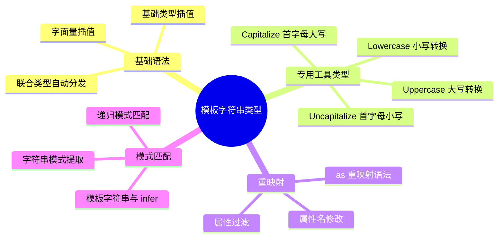

# 模板字符串类型

## 知识架构



## 本章概览

内置工具类型解决的是对象类型的变换，而模板字符串类型把这套能力带给了字符串：它是 TypeScript 4.1 引入的重磅特性，将 JavaScript 中模板字符串的能力引入到类型系统，让类型层面的字符串操作成为可能。配合重映射、条件类型和 `infer` 关键字，模板字符串类型能够实现强大的类型推导能力。

**学习目标：**
- 掌握模板字符串类型的基本语法和工作原理
- 理解联合类型在模板字符串中的自动分发特性
- 学会使用重映射修改对象属性名
- 掌握字符串专用工具类型的使用
- 理解模板字符串类型与 infer 结合的模式匹配
- 了解性能优化和最佳实践

**核心概念架构：**

```
模板字符串类型体系
├── 基础语法
│   ├── 字面量插值
│   ├── 基础类型插值
│   └── 联合类型分发
├── 专用工具类型
│   ├── Uppercase<T>
│   ├── Lowercase<T>
│   ├── Capitalize<T>
│   └── Uncapitalize<T>
├── 高级特性
│   ├── 重映射（Remapping）
│   ├── 模式匹配（Pattern Matching）
│   └── 条件类型结合
└── 实战应用
    ├── 类型生成
    ├── 类型约束
    └── 类型推导
```

---

## 模板字符串类型基础

### 基本语法

模板字符串类型的语法与 JavaScript 模板字符串类似，使用反引号和 `${}` 插槽：

```typescript
type World = 'World';

// "Hello World"
type Greeting = `Hello ${World}`;
```

**工作原理：**
1. 模板插槽 `${}` 中可以放入类型
2. TypeScript 会将类型转换为字符串字面量
3. 最终返回组合后的字符串字面量类型

### 支持的类型

模板字符串插槽中支持以下类型：

```typescript
type SupportedTypes = 
  | string      // 字符串类型
  | number      // 数字类型
  | boolean     // 布尔类型
  | null        // null
  | undefined   // undefined
  | bigint;     // 大整数类型

// 使用示例
type Greet<T extends string | number | boolean | null | undefined | bigint> = 
  `Hello ${T}`;

type Greet1 = Greet<"linbudu">;         // "Hello linbudu"
type Greet2 = Greet<599>;               // "Hello 599"
type Greet3 = Greet<true>;              // "Hello true"
type Greet4 = Greet<null>;              // "Hello null"
type Greet5 = Greet<undefined>;         // "Hello undefined"
type Greet6 = Greet<0x1fffffffffffff>;   // "Hello 9007199254740991"
```

**不支持的类型：**
- `symbol` - 无法转换为有意义的字符串
- `object` - 对象类型无法直接转换为字符串
- 自定义类型（除非实现了 toString）

```typescript
// ❌ 错误示例
type Invalid1 = `Value ${symbol}`;        // Error: 不支持 symbol
type Invalid2 = `Value ${object}`;        // Error: 不支持 object
type Invalid3 = `Value ${Date}`;          // Error: 不支持构造函数类型
```

### 基础类型插槽与字面量类型插槽的区别

当插槽中是基础类型（如 `string`、`number`）而非字面量类型时，行为有所不同：

```typescript
// 字面量类型插槽 - 精确匹配
type GreetingLiteral = `Hello ${'World'}`;  // "Hello World"

// 基础类型插槽 - 模式匹配
type GreetingPattern = `Hello ${string}`;   // 模板字符串类型

// 使用场景对比
let g1: GreetingLiteral = 'Hello World';   // ✅
let g2: GreetingLiteral = 'Hello Lin';     // ❌ Error: 类型不匹配

let g3: GreetingPattern = 'Hello World';   // ✅
let g4: GreetingPattern = 'Hello Lin';     // ✅
let g5: GreetingPattern = 'Hi World';      // ❌ Error: 不以 "Hello " 开头
```

**类型层级关系：**

```typescript
// 模板字符串类型的层级
type TemplateType = `prefix-${string}`;

// 字面量类型是模板字符串类型的子类型
type LiteralType = 'prefix-value';

declare let template: TemplateType;
declare let literal: LiteralType;

template = literal;  // ✅ 子类型可以赋值给父类型
literal = template;  // ❌ 父类型不能赋值给子类型
```

---

## 联合类型的自动分发

当模板字符串的插槽包含联合类型时，TypeScript 会自动进行排列组合（Distributive）：

### 基本分发机制

```typescript
type Size = 'Small' | 'Middle' | 'Large';

type SizeRecord = `${Size}-Record`;
// "Small-Record" | "Middle-Record" | "Large-Record"

// 等价于：
type SizeRecordManual = 
  | 'Small-Record' 
  | 'Middle-Record' 
  | 'Large-Record';
```

### 多插槽分发（笛卡尔积）

```typescript
type Prefix = 'get' | 'set';
type Name = 'Name' | 'Age';

type MethodName = `${Prefix}${Name}`;
// "getName" | "getAge" | "setName" | "setAge"

// 分发过程：
// get + Name = getName
// get + Age  = getAge
// set + Name = setName
// set + Age  = setAge
```

**分发数量计算：**

```typescript
type A = 'a1' | 'a2';           // 2 个
type B = 'b1' | 'b2' | 'b3';    // 3 个
type C = 'c1' | 'c2';           // 2 个

type Combined = `${A}-${B}-${C}`;
// 2 × 3 × 2 = 12 种组合
```

### 通过泛型传入联合类型

```typescript
type SizeRecord<Size extends string> = `${Size}-Record`;

type Size = 'Small' | 'Middle' | 'Large';

type UnionSizeRecord = SizeRecord<Size>;
// "Small-Record" | "Middle-Record" | "Large-Record"
```

### 条件类型中的分发控制

```typescript
// 默认分发行为
type Distribute<T> = T extends any ? `value_${T}` : never;

type Result1 = Distribute<'a' | 'b'>;  
// "value_a" | "value_b"

// 禁用分发（使用元组）
type NoDistribute<T> = [T] extends [any] ? `value_${T}` : never;

type Result2 = NoDistribute<'a' | 'b'>;  
// "value_a" | "value_b"（仍然分发，因为模板字符串本身会分发）
```

---

## 实际应用场景

### 场景一：版本号类型约束

```typescript
// 语义化版本号约束
type SemVer = `${number}.${number}.${number}`;

const v1: SemVer = '1.0.0';    // ✅
const v2: SemVer = '2.1.3';    // ✅
const v3: SemVer = '1.0';      // ❌ Error: 缺少补丁版本
const v4: SemVer = 'a.b.c';    // ❌ Error: 不是数字

// 带预发布标识的版本号
type PreReleaseTag = 'alpha' | 'beta' | 'rc';
type VersionWithPreRelease = 
  | `${number}.${number}.${number}`
  | `${number}.${number}.${number}-${PreReleaseTag}.${number}`;

const v5: VersionWithPreRelease = '1.0.0-alpha.1';  // ✅
const v6: VersionWithPreRelease = '2.0.0-beta.2';   // ✅
const v7: VersionWithPreRelease = '1.0.0-rc.1';     // ✅
```

### 场景二：SKU 类型自动生成

**传统方式（维护困难）：**

```typescript
type SKU = 
  | 'iphone-16G-official'
  | 'xiaomi-16G-official'
  | 'honor-16G-official'
  | 'iphone-16G-second-hand'
  // ... 需要 12 行手动声明
```

**模板字符串方式（自动生成）：**

```typescript
type Brand = 'iphone' | 'xiaomi' | 'honor';
type Memory = '16G' | '64G';
type ItemType = 'official' | 'second-hand';

// 自动生成所有组合（3 × 2 × 2 = 12 种）
type SKU = `${Brand}-${Memory}-${ItemType}`;

// 扩展新品牌，无需修改 SKU 类型定义
type BrandExtended = Brand | 'samsung' | 'oppo';
type SKUExtended = `${BrandExtended}-${Memory}-${ItemType}`;
// 自动增加 8 种组合
```

### 场景三：事件处理器类型生成

```typescript
type DOMEvents = 'click' | 'focus' | 'blur' | 'keydown' | 'keyup';

// 生成事件处理器类型
type EventHandlers<T extends string> = {
  [K in T as `on${Capitalize<K>}`]: (event: Event) => void;
} & {
  [K in T as `on${Capitalize<K>}Capture`]: (event: Event) => void;
};

type Handlers = EventHandlers<DOMEvents>;
// {
//   onClick: (event: Event) => void;
//   onClickCapture: (event: Event) => void;
//   onFocus: (event: Event) => void;
//   onFocusCapture: (event: Event) => void;
//   ...
// }
```

### 场景四：API 路径类型安全

```typescript
type ApiVersion = 'v1' | 'v2';
type Resource = 'users' | 'posts' | 'comments';
type Action = 'list' | 'detail' | 'create' | 'update' | 'delete';

type ApiEndpoint = `/api/${ApiVersion}/${Resource}/${Action}`;

// 类型安全的 API 调用
async function apiCall(endpoint: ApiEndpoint): Promise<Response> {
  return fetch(endpoint);
}

apiCall('/api/v1/users/list');      // ✅
apiCall('/api/v2/posts/detail');    // ✅
apiCall('/api/v3/users/list');      // ❌ Error: v3 不在 ApiVersion 中
apiCall('/api/v1/invalid/list');    // ❌ Error: invalid 不在 Resource 中
```

### 场景五：CSS 类名生成

```typescript
type Breakpoint = 'sm' | 'md' | 'lg' | 'xl';
type Spacing = 0 | 1 | 2 | 3 | 4 | 5 | 6 | 8 | 10 | 12;
type Direction = 't' | 'r' | 'b' | 'l' | 'x' | 'y';

// 生成 Tailwind 风格的 margin 类名
type MarginClass = 
  | `m${Spacing}`
  | `m${Direction}-${Spacing}`
  | `${Breakpoint}:m${Spacing}`
  | `${Breakpoint}:m${Direction}-${Spacing}`;

// 示例：
// "m0", "m1", "mt-2", "mx-4", "sm:m2", "lg:my-8"
```

---

## 重映射（Remapping）

重映射是 TypeScript 4.1 随模板字符串类型一起引入的特性，允许在映射类型中修改键名。

### 基本语法

```typescript
type MappedType<T> = {
  [K in keyof T as NewKeyType]: T[K];
};

// as 子句用于重映射键名
// NewKeyType 可以是模板字符串类型
```

### 为属性添加前缀/后缀

```typescript
// 添加前缀
type Prefix<T extends object, P extends string> = {
  [K in keyof T as `${P}${string & K}`]: T[K];
};

interface User {
  name: string;
  age: number;
}

type PrefixedUser = Prefix<User, 'user_'>;
// {
//   user_name: string;
//   user_age: number;
// }

// 添加后缀
type Suffix<T extends object, S extends string> = {
  [K in keyof T as `${string & K}${S}`]: T[K];
};

type SuffixedUser = Suffix<User, '_value'>;
// {
//   name_value: string;
//   age_value: number;
// }
```

### Getter/Setter 类型生成

```typescript
type Getters<T extends object> = {
  [K in keyof T as `get${Capitalize<string & K>}`]: () => T[K];
};

type Setters<T extends object> = {
  [K in keyof T as `set${Capitalize<string & K>}`]: (value: T[K]) => void;
};

type Reactive<T extends object> = T & Getters<T> & Setters<T>;

interface State {
  count: number;
  name: string;
}

type ReactiveState = Reactive<State>;
// {
//   count: number;
//   name: string;
//   getCount: () => number;
//   setCount: (value: number) => void;
//   getName: () => string;
//   setName: (value: string) => void;
// }
```

### 条件重映射

```typescript
// 只为特定类型的属性生成方法
type MethodsForType<T extends object, TargetType> = {
  [K in keyof T as T[K] extends TargetType 
    ? `process${Capitalize<string & K>}`
    : never
  ]: (value: T[K]) => T[K];
};

interface Data {
  name: string;
  age: number;
  active: boolean;
  metadata: object;
}

type StringMethods = MethodsForType<Data, string>;
// {
//   processName: (value: string) => string;
// }

type NumberMethods = MethodsForType<Data, number>;
// {
//   processAge: (value: number) => number;
// }
```

### 过滤属性（PickByValueType）

```typescript
type PickByValueType<T extends object, Type> = {
  [K in keyof T as T[K] extends Type ? K : never]: T[K];
};

interface Mixed {
  name: string;
  age: number;
  email: string;
  active: boolean;
  greet: () => void;
}

type OnlyStrings = PickByValueType<Mixed, string>;
// {
//   name: string;
//   email: string;
// }

type OnlyFunctions = PickByValueType<Mixed, Function>;
// {
//   greet: () => void;
// }
```

---

## 专用工具类型

TypeScript 为模板字符串类型提供了四个专用工具类型，用于字符串转换。

### 工具类型概览

| 工具类型 | 作用 | 示例 | 说明 |
|---------|------|------|------|
| `Uppercase<T>` | 转换为大写 | `'hello'` → `'HELLO'` | 整个字符串转大写 |
| `Lowercase<T>` | 转换为小写 | `'HELLO'` → `'hello'` | 整个字符串转小写 |
| `Capitalize<T>` | 首字母大写 | `'hello'` → `'Hello'` | 仅首字母大写 |
| `Uncapitalize<T>` | 首字母小写 | `'Hello'` → `'hello'` | 仅首字母小写 |

### 基本使用

```typescript
// Uppercase
type Upper = Uppercase<'hello world'>;  // "HELLO WORLD"

// Lowercase
type Lower = Lowercase<'HELLO WORLD'>;  // "hello world"

// Capitalize
type Cap = Capitalize<'hello world'>;   // "Hello world"

// Uncapitalize
type Uncap = Uncapitalize<'Hello World'>;  // "hello World"

// 组合使用
type ScreamingSnake<T extends string> = Uppercase<`_${T}`>;
type Result = ScreamingSnake<'hello'>;  // "_HELLO"
```

### 实战案例：命名风格转换

```typescript
// 驼峰转短横线
type CamelToKebab<S extends string> = S extends `${infer First}${infer Rest}`
  ? `${First extends Uppercase<First> 
      ? `-${Lowercase<First>}` 
      : First}${CamelToKebab<Rest>}`
  : S;

type Kebab = CamelToKebab<'backgroundColor'>;  // "background-color"

// 短横线转驼峰
type KebabToCamel<S extends string> = S extends `${infer First}-${infer Rest}`
  ? `${First}${Capitalize<KebabToCamel<Rest>>}`
  : S;

type Camel = KebabToCamel<'background-color'>;  // "backgroundColor"
```

### 内部实现原理

这些工具类型由 TypeScript 编译器内部实现：

```typescript
type Uppercase<S extends string> = intrinsic;
type Lowercase<S extends string> = intrinsic;
type Capitalize<S extends string> = intrinsic;
type Uncapitalize<S extends string> = intrinsic;
```

**编译器实现（参考）：**

```typescript
function applyStringMapping(kind: IntrinsicTypeKind, str: string): string {
  switch (kind) {
    case IntrinsicTypeKind.Uppercase: 
      return str.toUpperCase();
    case IntrinsicTypeKind.Lowercase: 
      return str.toLowerCase();
    case IntrinsicTypeKind.Capitalize: 
      return str.charAt(0).toUpperCase() + str.slice(1);
    case IntrinsicTypeKind.Uncapitalize: 
      return str.charAt(0).toLowerCase() + str.slice(1);
  }
  return str;
}
```

---

## 模式匹配与 infer

模板字符串类型与 `infer` 结合，可以实现强大的字符串模式匹配能力。

### 基本模式匹配

```typescript
// 提取字符串的一部分
type ExtractPart<S extends string> = 
  S extends `Hello ${infer Name}` ? Name : never;

type Name1 = ExtractPart<'Hello World'>;  // "World"
type Name2 = ExtractPart<'Hello Lin'>;    // "Lin"
type Name3 = ExtractPart<'Hi World'>;     // never
```

### 多 infer 匹配

```typescript
// 反转姓名
type ReverseName<S extends string> = 
  S extends `${infer First} ${infer Last}` 
    ? `${Capitalize<Last>} ${First}` 
    : S;

type Reversed1 = ReverseName<'Tom hardy'>;      // "Hardy Tom"
type Reversed2 = ReverseName<'Budu Lin'>;       // "Lin Budu"
type Reversed3 = ReverseName<'Budu Lin 599'>;   // "Lin 599 Budu"
type Reversed4 = ReverseName<'Single'>;         // "Single"
```

**匹配原理：**

```
"Tom hardy"
   ↓
`${infer First} ${infer Last}`
   ↓
First = "Tom"
Last = "hardy"
   ↓
`${Capitalize<Last>} ${First}`
   ↓
"Hardy Tom"
```

### 字符串分割

```typescript
type Split<S extends string, D extends string> = 
  S extends `${infer Head}${D}${infer Tail}`
    ? [Head, ...Split<Tail, D>]
    : S extends '' 
      ? [] 
      : [S];

type Parts1 = Split<'a-b-c', '-'>;  // ["a", "b", "c"]
type Parts2 = Split<'hello world', ' '>;  // ["hello", "world"]
type Parts3 = Split<'single', '-'>;  // ["single"]
```

### 字符串替换

```typescript
type Replace<S extends string, From extends string, To extends string> = 
  S extends `${infer Before}${From}${infer After}`
    ? `${Before}${To}${After}`
    : S;

type Replaced1 = Replace<'hello world', ' ', '-'>;  // "hello-world"
type Replaced2 = Replace<'hello world', 'world', 'TypeScript'>;  // "hello TypeScript"
```

### 提取字符串数组

```typescript
// 提取所有以特定前缀开头的字符串
type ExtractByPrefix<T extends string, P extends string> = 
  T extends `${P}${infer Rest}` ? T : never;

type Paths = 'user_name' | 'user_age' | 'post_title' | 'post_content';
type UserFields = ExtractByPrefix<Paths, 'user_'>;
// "user_name" | "user_age"

// 提取后缀
type ExtractSuffix<T extends string, P extends string> = 
  T extends `${P}${infer Rest}` ? Rest : never;

type UserFieldNames = ExtractSuffix<UserFields, 'user_'>;
// "name" | "age"
```

### 函数参数模式匹配

```typescript
declare function assertType<T>(value: `type is ${T}`): T;

// 类型推导
const result1 = assertType('type is string');   // string
const result2 = assertType('type is number');   // number
const result3 = assertType('type is boolean');  // boolean

// 约束函数参数格式
declare function handler<Str extends string>(
  arg: `Guess who is ${Str}`
): Str;

handler('Guess who is Linbudu');  // "Linbudu"
handler('Guess who is ');         // ""
handler('Guess who is  ');        // " "

handler('Guess who was');         // ❌ Error: 不匹配模式
handler('');                      // ❌ Error: 不匹配模式
```

---

## 类型层级与类型推导

### 与字符串类型的关系

```typescript
// 类型层级
type StringType = string;                           // 最宽泛
type TemplateString = `prefix-${string}`;           // 模板字符串类型
type LiteralString = 'prefix-value';                // 字面量类型（最精确）

// 类型兼容性
declare let str: string;
declare let tpl: `prefix-${string}`;
declare let lit: 'prefix-value';

str = tpl;    // ✅ 模板字符串是 string 的子类型
str = lit;    // ✅ 字面量是 string 的子类型
tpl = lit;    // ✅ 字面量是模板字符串的子类型

lit = str;    // ❌ string 不是字面量的子类型
lit = tpl;    // ❌ 模板字符串不是字面量的子类型
tpl = str;    // ❌ string 不是模板字符串的子类型
```

### 函数返回值推导

```typescript
// 返回模板字符串类型
const greet = (to: string): `Hello ${string}` => {
  return `Hello ${to}`;
};

const result = greet('World');  // 类型为 `Hello ${string}`

// 条件返回
function formatValue<T extends string | number>(
  value: T
): T extends string ? `string:${T}` : `number:${T}` {
  return (typeof value === 'string' ? `string:${value}` : `number:${value}`) as any;
}

const str = formatValue('hello');  // "string:hello"
const num = formatValue(42);       // "number:42"
```

### 泛型约束

```typescript
// 约束泛型参数必须匹配特定模式
function createPath<T extends string>(
  segment: T
): T extends `/${string}` ? T : `/${T}` {
  return (segment.startsWith('/') ? segment : `/${segment}`) as any;
}

const path1 = createPath('/users');   // "/users"
const path2 = createPath('users');    // "/users"
```

---

## 高级实战案例

### 案例 1：类型安全的 EventEmitter

```typescript
type EventMap = {
  click: { x: number; y: number };
  focus: { target: HTMLElement };
  blur: { target: HTMLElement };
};

type EventHandler<T extends keyof EventMap> = (event: EventMap[T]) => void;

type EventHandlers = {
  [K in keyof EventMap as `on${Capitalize<string & K>}`]: EventHandler<K>;
} & {
  [K in keyof EventMap as `off${Capitalize<string & K>}`]: (handler: EventHandler<K>) => void;
};

// 类型安全的 emitter
const handlers: EventHandlers = {
  onClick: (event) => {
    console.log(event.x, event.y);  // ✅ 类型安全
  },
  onFocus: (event) => {
    console.log(event.target);       // ✅ 类型安全
  },
  onBlur: (event) => {
    console.log(event.target);       // ✅ 类型安全
  },
  offClick: (handler) => {},
  offFocus: (handler) => {},
  offBlur: (handler) => {},
};
```

### 案例 2：类型安全的 Redux Actions

```typescript
// Action 类型自动生成
type ActionCreator<T extends string, P = void> = P extends void
  ? { type: T }
  : { type: T; payload: P };

type ActionTypes = 
  | 'INCREMENT'
  | 'DECREMENT'
  | 'SET_VALUE'
  | 'ADD_TODO';

type ActionMap = {
  INCREMENT: void;
  DECREMENT: void;
  SET_VALUE: number;
  ADD_TODO: { text: string; completed: boolean };
};

type Actions = {
  [K in keyof ActionMap]: ActionCreator<K, ActionMap[K]>;
}[keyof ActionMap];

// 使用
const increment: Actions = { type: 'INCREMENT' };
const setValue: Actions = { type: 'SET_VALUE', payload: 42 };
const addTodo: Actions = { 
  type: 'ADD_TODO', 
  payload: { text: 'Learn TypeScript', completed: false } 
};
```

### 案例 3：类型安全的路由系统

```typescript
type RoutePath = 
  | '/'
  | '/users'
  | '/users/:id'
  | '/posts'
  | '/posts/:postId/comments/:commentId';

// 提取路由参数
type ExtractParams<Path extends string> = 
  Path extends `${string}:${infer Param}/${infer Rest}`
    ? { [K in Param | keyof ExtractParams<`/${Rest}`>]: string }
    : Path extends `${string}:${infer Param}`
    ? { [K in Param]: string }
    : {};

type Params1 = ExtractParams<'/users/:id'>;
// { id: string }

type Params2 = ExtractParams<'/posts/:postId/comments/:commentId'>;
// { postId: string; commentId: string }

// 类型安全的路由函数
function navigate<Path extends RoutePath>(
  path: Path,
  ...args: keyof ExtractParams<Path> extends never
    ? []
    : [params: ExtractParams<Path>]
): void {
  // 实现
}

navigate('/');                    // ✅ 无需参数（没有路由参数）
navigate('/users');               // ✅ 无需参数
navigate('/users/:id', { id: '1' });  // ✅ 需要参数
navigate('/posts/:postId/comments/:commentId', { 
  postId: '1', 
  commentId: '2' 
});  // ✅ 需要多个参数
```

### 案例 4：数据库查询构建器

```typescript
type Operator = 'eq' | 'ne' | 'gt' | 'lt' | 'gte' | 'lte';

type WhereClause<T extends string> = `${T}_${Operator}`;

interface UserTable {
  id: number;
  name: string;
  email: string;
  age: number;
}

type UserWhere = {
  [K in keyof UserTable as WhereClause<string & K>]?: UserTable[K];
};

const query: UserWhere = {
  id_eq: 1,
  name_eq: 'John',
  age_gte: 18,
  age_lt: 65,
};
```

---

## 性能优化

### 分发数量控制

```typescript
// ❌ 危险：大量联合类型导致编译缓慢
type LargeUnion = 'a' | 'b' | 'c' | 'd' | 'e' | 'f';  // 6 个
type Numbers = '1' | '2' | '3' | '4' | '5' | '6';     // 6 个
type Letters = 'x' | 'y' | 'z';                        // 3 个

type Combined = `${LargeUnion}-${Numbers}-${Letters}`;
// 6 × 6 × 3 = 108 种组合，可能影响编译性能

// ✅ 优化：减少联合类型数量，或分步处理
type Step1 = `${LargeUnion}-${Numbers}`;  // 36 种
type Step2<T extends string> = `${T}-${Letters}`;  // 分步生成
```

### 避免过度嵌套

```typescript
// ❌ 过度嵌套的条件类型
type DeepNested<S extends string> = 
  S extends `${infer A}${infer B}${infer C}${infer D}`
    ? A extends 'a'
      ? B extends 'b'
        ? C extends 'c'
          ? D
          : never
        : never
      : never
    : never;

// ✅ 简化逻辑，提高可读性和性能
type Simplified<S extends string> = 
  S extends `abc${infer Rest}` ? Rest : never;
```

### 使用缓存模式

```typescript
// 使用泛型参数作为缓存
type Cached<S extends string, Cache = never> = 
  Cache extends never 
    ? Cached<S, ProcessString<S>> 
    : Cache;

type ProcessString<S extends string> = 
  // 复杂的字符串处理逻辑
  S extends `${infer First}${infer Rest}` 
    ? `${Uppercase<First>}${Rest}` 
    : S;
```

---

## 最佳实践

### 1. 使用描述性命名

```typescript
// ❌ 不推荐
type T1 = `${string}-${string}`;

// ✅ 推荐
type ProductSKU = `${Brand}-${Model}-${Variant}`;
```

### 2. 合理使用类型约束

```typescript
// ❌ 过于宽松
function process(value: `${string}`) {}

// ✅ 适当约束
function process(value: `user_${string}` | `admin_${string}`) {}
```

### 3. 模块化类型定义

```typescript
// 将相关类型组织在一起
type BrandPrefix = 'app' | 'web' | 'api';
type Environment = 'dev' | 'staging' | 'prod';
type ResourceType = 'user' | 'product' | 'order';

type ResourceId = `${BrandPrefix}-${Environment}-${ResourceType}-${string}`;
// "app-dev-user-123"
// "web-prod-product-456"
```

### 4. 提供类型注释

```typescript
/**
 * 生成 Getter 方法名称
 * @template T - 属性名类型
 * @example
 * type Getter = GetterName<'value'>; // "getValue"
 */
type GetterName<T extends string> = `get${Capitalize<T>}`;
```

### 5. 测试类型定义

```typescript
// 使用类型断言测试类型
type TestCases = [
  Expect<Equal<GetterName<'value'>, 'getValue'>>,
  Expect<Equal<SetterName<'value'>, 'setValue'>>,
];

// 辅助类型
type Expect<T extends true> = T;
type Equal<X, Y> = (<T>() => T extends X ? 1 : 2) extends (<T>() => T extends Y ? 1 : 2)
  ? true
  : false;

// 被测类型
type GetterName<T extends string> = `get${Capitalize<T>}`;
type SetterName<T extends string> = `set${Capitalize<T>}`;
```

---

## 常见问题解答（FAQ）

### Q1: 为什么模板字符串类型不支持 symbol？

**A:** `symbol` 类型无法转换为有意义的字符串表示。每个 `symbol` 值都是唯一的，无法在编译时确定其字符串形式。

```typescript
// ❌ 不支持
type Invalid = `key_${symbol}`;

// ✅ 替代方案：使用字符串键
type Valid = `key_${string}`;
```

### Q2: 如何限制模板字符串中的数字范围？

**A:** 模板字符串类型无法直接限制数字范围，但可以通过预定义联合类型实现：

```typescript
// ❌ 无法直接限制
type Port = `${number}`;  // 接受任何数字

// ✅ 使用预定义联合类型
type ValidPort = 
  | '3000' | '3001' | '3002' | '3003' | '3004' | '3005'
  | '8080' | '8081' | '8082';

type ServerUrl = `http://localhost:${ValidPort}`;
```

### Q3: 模板字符串类型可以用于运行时吗？

**A:** 模板字符串类型是编译时特性，仅用于类型检查。运行时仍需使用 JavaScript 模板字符串：

```typescript
// 类型定义（编译时）
type Endpoint = `/api/${string}`;

// 运行时实现
function createEndpoint(path: string): Endpoint {
  return `/api/${path}`;  // 运行时拼接
}
```

### Q4: 如何处理动态数量的插槽？

**A:** 模板字符串类型不支持动态插槽数量，需要预先定义：

```typescript
// ❌ 无法动态定义插槽数量
type Dynamic<T extends string[]> = ???  // 不支持

// ✅ 预定义可能的格式
type Path = 
  | `/${string}`
  | `/${string}/${string}`
  | `/${string}/${string}/${string}`;
```

### Q5: 重映射与映射类型的区别是什么？

**A:** 重映射允许修改键名，而普通映射类型只能修改键值：

```typescript
interface User {
  name: string;
  age: number;
}

// 普通映射类型：修改值类型
type ReadonlyUser = {
  readonly [K in keyof User]: User[K];
};

// 重映射：修改键名
type GetterUser = {
  [K in keyof User as `get${Capitalize<string & K>}`]: () => User[K];
};
// { getName: () => string; getAge: () => number }
```

### Q6: 如何调试复杂的模板字符串类型？

**A:** 使用类型别名和工具类型进行分解：

```typescript
// 复杂类型
type ComplexType<T extends string> = 
  T extends `${infer Prefix}_${infer Suffix}`
    ? `${Capitalize<Prefix>}${Capitalize<Suffix>}`
    : Capitalize<T>;

// 分解调试
type Step1<T extends string> = T extends `${infer Prefix}_${infer Suffix}`
  ? { prefix: Prefix; suffix: Suffix }
  : T;

type Step2<T extends string> = Capitalize<T>;

type Debug = Step1<'hello_world'>;  // { prefix: "hello"; suffix: "world" }
```

---

## 故障排查

### 问题 1: 类型推导为 never

**原因：** 模式匹配失败

```typescript
type Extract<S extends string> = 
  S extends `prefix_${infer Rest}` ? Rest : never;

type Result = Extract<'invalid_format'>;  // never

// 解决：检查模式是否正确
type Result2 = Extract<'prefix_value'>;   // "value"
```

### 问题 2: 编译性能下降

**原因：** 过多的联合类型组合

```typescript
// 问题代码
type A = 'a' | 'b' | 'c' | 'd' | 'e';  // 5 个
type B = '1' | '2' | '3' | '4' | '5';  // 5 个
type C = 'x' | 'y' | 'z';               // 3 个

type Combined = `${A}-${B}-${C}`;  // 5 × 5 × 3 = 75 种组合

// 解决方案：减少组合数量或使用字符串类型
type Optimized = `${string}-${string}-${string}`;
```

### 问题 3: 宽泛 string 与模板字符串类型不兼容

**原因：** 值为宽泛 `string` 类型的变量不能直接赋给模板字符串类型，即使内容"看起来"符合模式。

```typescript
function format(prefix: string): `prefix-${string}` {
  const s: string = `prefix-${prefix}`;
  return s;  // ❌ Error: string 不能赋值给 `prefix-${string}`
}

// 解决：直接返回模板字符串表达式，编译器可以推断出其类型
function formatFixed(prefix: string): `prefix-${string}` {
  return `prefix-${prefix}`;  // ✅ 模板字符串表达式可推断为模板字符串类型
}
```

### 问题 4: 重映射不生效

**原因：** 键名类型不正确

```typescript
interface Foo {
  name: string;
  [key: symbol]: any;  // symbol 键
}

type Renamed = {
  [K in keyof Foo as `new_${K}`]: Foo[K];  // ❌ Error: K 可能是 symbol
};

// 解决：过滤 symbol 键
type RenamedFixed = {
  [K in keyof Foo as K extends string ? `new_${K}` : never]: Foo[K];
};
```

---

## 与其他 TypeScript 特性的结合

### 与条件类型结合

```typescript
type ProcessValue<T> = 
  T extends `${infer Num extends number}`
    ? Num
    : T extends `${infer Bool extends boolean}`
    ? Bool
    : T;

type Num = ProcessValue<'42'>;       // 42 (number)
type Bool = ProcessValue<'true'>;    // true (boolean)
type Str = ProcessValue<'hello'>;    // "hello"
```

### 与映射类型结合

```typescript
type ObjectPaths<T extends object, Prefix extends string = ''> = {
  [K in keyof T]: T[K] extends object
    ? ObjectPaths<T[K], `${Prefix}${string & K}.`>
    : `${Prefix}${string & K}`;
}[keyof T];

interface Config {
  server: {
    host: string;
    port: number;
  };
  database: {
    name: string;
    url: string;
  };
}

type Paths = ObjectPaths<Config>;
// "server.host" | "server.port" | "database.name" | "database.url"
```

### 与递归类型结合

```typescript
// 深度路径提取
type DeepValue<T, Path extends string> = 
  Path extends `${infer Key}.${infer Rest}`
    ? Key extends keyof T
      ? DeepValue<T[Key], Rest>
      : never
    : Path extends keyof T
    ? T[Path]
    : never;

interface Data {
  user: {
    profile: {
      name: string;
      age: number;
    };
  };
}

type Name = DeepValue<Data, 'user.profile.name'>;  // string
type Age = DeepValue<Data, 'user.profile.age'>;    // number
```

---

## TypeScript 配置相关

### 最低版本要求

模板字符串类型需要 TypeScript 4.1 或更高版本：

```json
// tsconfig.json
{
  "compilerOptions": {
    "target": "ES2020",
    "lib": ["ES2020"],
    "strict": true
  }
}
```

### 推荐配置

```json
{
  "compilerOptions": {
    "target": "ES2022",
    "lib": ["ES2022"],
    "strict": true,
    "noImplicitAny": true,
    "strictNullChecks": true,
    "noImplicitThis": true,
    "alwaysStrict": true,
    "noUnusedLocals": true,
    "noUnusedParameters": true,
    "noImplicitReturns": true,
    "noFallthroughCasesInSwitch": true
  }
}
```

### 性能优化配置

```json
{
  "compilerOptions": {
    "skipLibCheck": true,           // 跳过类型检查库文件
    "incremental": true,             // 增量编译
    "tsBuildInfoFile": ".tsbuildinfo"
  }
}
```

---

## 总结

### 核心要点回顾

| 特性 | 说明 | 应用场景 |
|------|------|----------|
| **基本语法** | 使用反引号和 `${}` 插槽组合字符串字面量类型 | 类型生成、格式约束 |
| **联合类型分发** | 插槽中的联合类型会自动进行排列组合 | SKU 生成、事件名生成 |
| **重映射** | 使用 `as` 语法在映射类型中修改键名 | Getter/Setter 生成、属性重命名 |
| **专用工具类型** | `Uppercase`、`Lowercase`、`Capitalize`、`Uncapitalize` | 命名风格转换 |
| **模式匹配** | 结合 `infer` 提取字符串结构 | 字符串解析、类型推导 |

### 学习路径建议

1. **入门阶段**：掌握基本语法和联合类型分发
2. **进阶阶段**：理解重映射和专用工具类型
3. **高级阶段**：掌握模式匹配和 infer 使用
4. **实战阶段**：应用于实际项目，解决类型安全问题

### 下一步学习

- 模板字符串工具类型进阶（`Trim`、`Replace`、`Split`、`Join`）
- Case 转换工具类型（`CamelCase`、`SnakeCase`、`KebabCase`）
- 类型体操实战练习

---

## 参考资料

- [TypeScript 官方文档 - Template Literal Types](https://www.typescriptlang.org/docs/handbook/2/template-literal-types.html)
- [TypeScript 4.1 发布说明](https://www.typescriptlang.org/docs/handbook/release-notes/typescript-4-1.html)
- [TypeScript 类型体操练习](https://github.com/type-challenges/type-challenges)

---

> 本节代码见：[Template String Types](https://link.juejin.cn/?target=https%3A%2F%2Fgithub.com%2Flinbudu599%2FTypeScript-Tiny-Book%2Ftree%2Fmain%2Fpackages%2F15-template-string-type)

**下一章预告**：我们将深入学习模板字符串工具类型的进阶应用，包括 `Trim`、`Replace`、`Split`、`Join` 以及 `Case` 转换（如 `CamelCase`）等高级工具类型的实现。
