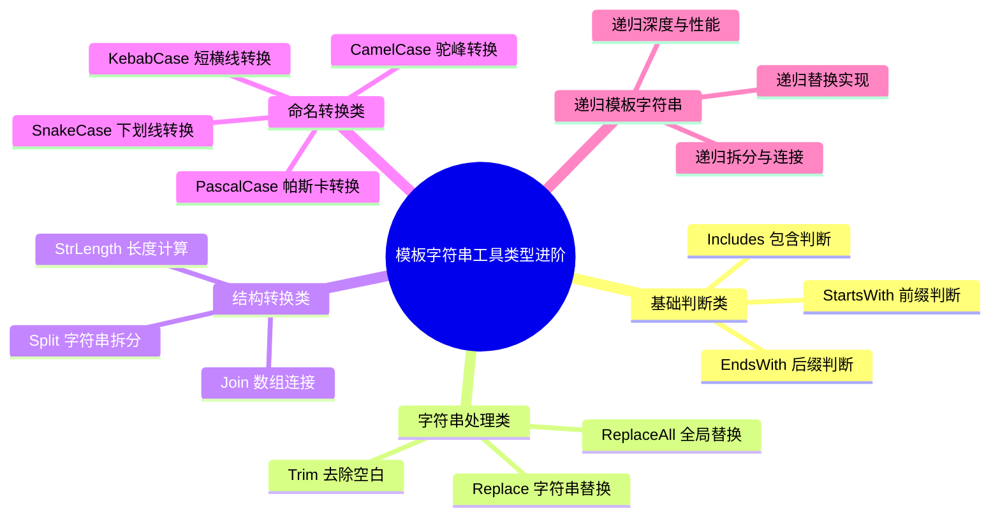

# 模板字符串工具类型进阶

## 知识架构



## 本章概览

本章将深入探讨模板字符串类型与模式匹配结合后的高级应用，实现类型层面的字符串操作方法，包括 `Trim`、`Replace`、`Split`、`Join` 以及各种 Case 转换。

**学习目标：**
- 掌握 `Trim`、`Includes`、`StartsWith` 等简单字符串工具类型的实现原理
- 学会实现 `Replace`、`Split`、`Join` 等结构转换工具类型
- 掌握 `CamelCase` 等 Case 转换工具类型的实现思路
- 理解递归在模板字符串类型中的应用
- 了解性能优化策略和最佳实践

**工具类型架构：**

```
模板字符串工具类型体系
├── 基础判断类
│   ├── Includes      - 包含判断
│   ├── StartsWith    - 前缀判断
│   └── EndsWith      - 后缀判断
├── 字符串处理类
│   ├── Trim          - 去除空白
│   ├── Replace       - 字符串替换
│   └── ReplaceAll    - 全局替换
├── 结构转换类
│   ├── Split         - 字符串拆分
│   ├── Join          - 数组连接
│   └── StrLength     - 长度计算
└── 命名转换类
    ├── CamelCase     - 小驼峰
    ├── SnakeCase     - 蛇形
    └── KebabCase     - 短横线
```

---

## 核心概念：模式匹配与递归

### 模式匹配基础

模板字符串类型的模式匹配使用 `extends` 和 `infer` 关键字：

```typescript
// 基本模式
type Match<S extends string> = S extends `${infer Head}${infer Tail}` 
  ? { head: Head; tail: Tail }
  : never;

type Result = Match<'hello'>;
// { head: "h"; tail: "ello" }
```

**匹配规则：**
- `infer` 变量按从左到右的顺序匹配
- 第一个 `infer` 匹配最小单位（贪婪性较低）
- 最后一个 `infer` 匹配剩余所有内容（贪婪性最高）

### 递归模式

递归是模板字符串工具类型的核心机制：

```typescript
// 递归结构
type Recursive<S extends string> = 
  S extends `${infer Char}${infer Rest}`
    ? Char | Recursive<Rest>  // 处理当前字符 + 递归处理剩余
    : never;                   // 终止条件

type Chars = Recursive<'abc'>;  // "a" | "b" | "c"
```

**递归三要素：**
1. **分解条件**：将问题分解为更小的子问题
2. **递归调用**：处理子问题
3. **终止条件**：无法继续分解时返回结果

---

## 简单模式匹配工具类型

### Includes - 判断字符串包含

#### 基本实现

```typescript
/**
 * 判断字符串是否包含指定子串
 * @param Str 目标字符串
 * @param Search 要搜索的子串
 * @returns true 或 false
 * 
 * @example
 * Includes<'linbudu', 'lin'> // true
 * Includes<'linbudu', 'foo'> // false
 */
type Includes<
  Str extends string,
  Search extends string
> = Str extends `${string}${Search}${string}` ? true : false;
```

#### 使用示例

```typescript
type Res1 = Includes<'linbudu', 'lin'>;    // true
type Res2 = Includes<'linbudu', 'bud'>;    // true
type Res3 = Includes<'linbudu', 'foo'>;    // false
type Res4 = Includes<'linbudu', ''>;       // true（空字符串总是包含）
type Res5 = Includes<'', 'lin'>;           // false
type Res6 = Includes<'', ''>;              // true
```

#### 边界情况处理

```typescript
/**
 * 完整版：正确处理空字符串边界情况
 */
type Includes<
  Str extends string,
  Search extends string
> = Str extends ''
  ? Search extends ''
    ? true
    : false
  : Str extends `${string}${Search}${string}`
  ? true
  : false;
```

**边界情况分析：**

| Str | Search | 结果 | 说明 |
|-----|--------|------|------|
| `'hello'` | `'ell'` | `true` | 正常匹配 |
| `'hello'` | `'xyz'` | `false` | 不匹配 |
| `'hello'` | `''` | `true` | 空字符串总是包含 |
| `''` | `'hello'` | `false` | 空字符串不包含非空字符串 |
| `''` | `''` | `true` | 空字符串包含空字符串 |

### Trim 系列 - 去除空白

#### 基本实现

```typescript
/**
 * 去除字符串开头的空白
 */
type TrimLeft<Str extends string> = Str extends ` ${infer Rest}`
  ? TrimLeft<Rest>
  : Str;

/**
 * 去除字符串结尾的空白
 */
type TrimRight<Str extends string> = Str extends `${infer Rest} `
  ? TrimRight<Rest>
  : Str;

/**
 * 去除字符串两端的空白
 */
type Trim<Str extends string> = TrimLeft<TrimRight<Str>>;
```

#### 使用示例

```typescript
type Trimmed1 = TrimLeft<'   hello'>;     // 'hello'
type Trimmed2 = TrimRight<'hello   '>;    // 'hello'
type Trimmed3 = Trim<'   hello   '>;      // 'hello'
type Trimmed4 = Trim<'hello'>;            // 'hello'
type Trimmed5 = Trim<'    '>;             // ''
```

#### 支持更多空白字符

```typescript
/**
 * 支持多种空白字符：空格、制表符、换行符
 */
type Whitespace = ' ' | '\t' | '\n' | '\r';

type TrimLeft<Str extends string> = Str extends `${Whitespace}${infer Rest}`
  ? TrimLeft<Rest>
  : Str;

type TrimRight<Str extends string> = Str extends `${infer Rest}${Whitespace}`
  ? TrimRight<Rest>
  : Str;

type Trim<Str extends string> = TrimLeft<TrimRight<Str>>;

// 使用示例
type T1 = Trim<'\n  hello  \t'>;  // 'hello'
type T2 = Trim<'\t\t\t'>;         // ''
```

#### 执行流程图

```
输入: '   hello   '
     ↓
TrimLeft<'   hello   '>
     ↓ (匹配 ' ', 递归)
TrimLeft<'  hello   '>
     ↓ (匹配 ' ', 递归)
TrimLeft<' hello   '>
     ↓ (匹配 ' ', 递归)
TrimLeft<'hello   '>
     ↓ (不匹配，返回)
'hello   '
     ↓
TrimRight<'hello   '>
     ↓ (匹配 ' ', 递归)
TrimRight<'hello  '>
     ↓ (匹配 ' ', 递归)
TrimRight<'hello '>
     ↓ (匹配 ' ', 递归)
TrimRight<'hello'>
     ↓ (不匹配，返回)
'hello'
```

### StartsWith 与 EndsWith

```typescript
/**
 * 判断字符串是否以指定前缀开头
 * @example
 * StartsWith<'linbudu', 'lin'> // true
 */
type StartsWith<
  Str extends string,
  Prefix extends string
> = Str extends `${Prefix}${string}` ? true : false;

/**
 * 判断字符串是否以指定后缀结尾
 * @example
 * EndsWith<'linbudu', 'du'> // true
 */
type EndsWith<
  Str extends string,
  Suffix extends string
> = Str extends `${string}${Suffix}` ? true : false;
```

#### 使用示例

```typescript
// StartsWith
type Start1 = StartsWith<'linbudu', 'lin'>;    // true
type Start2 = StartsWith<'linbudu', 'Lin'>;    // false（区分大小写）
type Start3 = StartsWith<'linbudu', ''>;       // true（空前缀总是匹配）
type Start4 = StartsWith<'', 'lin'>;           // false

// EndsWith
type End1 = EndsWith<'linbudu', 'du'>;         // true
type End2 = EndsWith<'linbudu', 'DU'>;         // false（区分大小写）
type End3 = EndsWith<'linbudu', ''>;           // true（空后缀总是匹配）
type End4 = EndsWith<'', 'lin'>;               // false
```

#### 实际应用：路由守卫

```typescript
type ApiRoutes = '/api/users' | '/api/posts' | '/api/comments';

/**
 * 检查路径是否为 API 路由
 */
function isApiRoute(path: string): path is ApiRoutes {
  return path.startsWith('/api/');
}

// 类型安全的路由处理
function handleRoute(route: ApiRoutes) {
  // ...
}

const path = '/api/users';
if (isApiRoute(path)) {
  handleRoute(path);  // ✅ 类型安全
}
```

---

## 结构转换工具类型

### Replace - 字符串替换

#### 基本实现

```typescript
/**
 * 替换字符串中的第一个匹配项
 * @param Str 目标字符串
 * @param Search 要替换的子串
 * @param Replacement 替换后的内容
 * 
 * @example
 * Replace<'hello world', 'world', 'ts'> // 'hello ts'
 */
type Replace<
  Str extends string,
  Search extends string,
  Replacement extends string
> = Str extends `${infer Head}${Search}${infer Tail}`
  ? `${Head}${Replacement}${Tail}`
  : Str;
```

#### 使用示例

```typescript
type Replaced1 = Replace<'hello world', 'world', 'ts'>;        // "hello ts"
type Replaced2 = Replace<'hello world', 'o', '0'>;             // "hell0 world"
type Replaced3 = Replace<'hello world', 'foo', 'bar'>;         // "hello world"
type Replaced4 = Replace<'hello world', '', '-'>;              // "-hello world"
type Replaced5 = Replace<'', 'foo', 'bar'>;                    // ""
```

#### 工作原理

```
输入: Replace<'hello world', 'world', 'ts'>
     ↓
模式匹配: 'hello world' extends `${infer Head}world${infer Tail}`
     ↓
Head = 'hello '
Tail = ''
     ↓
结果: 'hello ' + 'ts' + '' = 'hello ts'
```

### ReplaceAll - 全局替换

#### 基本实现

```typescript
/**
 * 替换字符串中的所有匹配项
 * @example
 * ReplaceAll<'www.linbudu.top', 'w', 'm'> // 'mmm.linbudu.top'
 */
type ReplaceAll<
  Str extends string,
  Search extends string,
  Replacement extends string
> = Str extends `${infer Head}${Search}${infer Tail}`
  ? ReplaceAll<`${Head}${Replacement}${Tail}`, Search, Replacement>
  : Str;
```

#### 使用示例

```typescript
type All1 = ReplaceAll<'www.linbudu.top', 'w', 'm'>;    // "mmm.linbudu.top"
type All2 = ReplaceAll<'a-b-c', '-', '_'>;              // "a_b_c"
type All3 = ReplaceAll<'hello world', 'o', '0'>;        // "hell0 w0rld"
type All4 = ReplaceAll<'aaa', 'a', 'b'>;                // "bbb"
type All5 = ReplaceAll<'hello', 'x', 'y'>;              // "hello"
```

#### 执行流程

```
ReplaceAll<'a-b-c', '-', '_'>
     ↓
第一次: 'a' + '_' + 'b-c' = 'a_b-c'
     ↓ (递归)
ReplaceAll<'a_b-c', '-', '_'>
     ↓
第二次: 'a_b' + '_' + 'c' = 'a_b_c'
     ↓ (递归)
ReplaceAll<'a_b_c', '-', '_'>
     ↓
不匹配，返回 'a_b_c'
```

### 可配置的 Replace

```typescript
/**
 * 可配置是否全局替换
 * @param ShouldReplaceAll 是否替换所有匹配项，默认 false
 */
type Replace<
  Input extends string,
  Search extends string,
  Replacement extends string,
  ShouldReplaceAll extends boolean = false
> = Input extends `${infer Head}${Search}${infer Tail}`
  ? ShouldReplaceAll extends true
    ? Replace<`${Head}${Replacement}${Tail}`, Search, Replacement, true>
    : `${Head}${Replacement}${Tail}`
  : Input;

// 使用示例
type Single = Replace<'a-b-c', '-', '_', false>;  // "a_b-c"
type All = Replace<'a-b-c', '-', '_', true>;      // "a_b_c"
type Default = Replace<'a-b-c', '-', '_'>;         // "a_b-c"
```

### Split - 字符串拆分

#### 基本实现

```typescript
/**
 * 将字符串按分隔符拆分为元组
 * @param Str 目标字符串
 * @param Delimiter 分隔符
 * 
 * @example
 * Split<'a-b-c', '-'> // ['a', 'b', 'c']
 */
type Split<
  Str extends string,
  Delimiter extends string
> = Str extends `${infer Head}${Delimiter}${infer Tail}`
  ? [Head, ...Split<Tail, Delimiter>]
  : Str extends Delimiter
  ? []
  : [Str];
```

> ⚠️ **注意**：`Str extends Delimiter ? []` 分支只在空分隔符（`Split<'', ''>`）时可达；普通分隔符的"纯分隔符"输入（如 `Split<'-','-'>`）会先被第一个模式分支匹配，得到 `["", ""]`。

#### 使用示例

```typescript
type Split1 = Split<'linbudu,599,fe', ','>;      // ["linbudu", "599", "fe"]
type Split2 = Split<'linbudu 599 fe', ' '>;      // ["linbudu", "599", "fe"]
type Split3 = Split<'linbudu', ''>;              // ["l", "i", "n", "b", "u", "d", "u"]
type Split4 = Split<'', '-'>;                    // [""]
type Split5 = Split<'a--b', '-'>;                // ["a", "", "b"]
type Split6 = Split<'-', '-'>;                   // ["", ""]（首个空段 + 空字符串兜底段）
```

#### 边界情况详解

| 输入 | 分隔符 | 结果 | 说明 |
|------|--------|------|------|
| `'a-b-c'` | `'-'` | `["a", "b", "c"]` | 正常拆分 |
| `'linbudu'` | `''` | `["l", "i", "n", ...]` | 空分隔符按字符拆分 |
| `''` | `'-'` | `[""]` | 空字符串返回单元素数组 |
| `'-'` | `'-'` | `["", ""]` | 首尾都是空段，得到两个空元素 |
| `'a--b'` | `'-'` | `["a", "", "b"]` | 连续分隔符产生空元素 |

#### 执行流程图

```
Split<'a-b-c', '-'>
     ↓
匹配: 'a' + '-' + 'b-c'
结果: ['a', ...Split<'b-c', '-'>]
     ↓
匹配: 'b' + '-' + 'c'
结果: ['a', 'b', ...Split<'c', '-'>]
     ↓
不匹配，'c' 不等于 '-'
结果: ['a', 'b', 'c']
```

### 多分隔符支持

```typescript
type Delimiters = '-' | '_' | ' ';

// ⚠️ 注意：联合类型作为分隔符会产生所有可能的组合
type SplitRes = Split<'lin_bu_du', Delimiters>;
// 结果取决于 TypeScript 的分发行为

// ✅ 推荐：按顺序多次拆分
type MultiSplit<
  S extends string,
  D extends string
> = Split<S, D>;

type Step1 = Split<'lin_bu-du', '_'>;  // ["lin", "bu-du"]
type Step2 = Split<'bu-du', '-'>;       // ["bu", "du"]
```

### StrLength - 字符串长度

```typescript
/**
 * 计算字符串长度（先去除首尾空白）
 */
type StrLength<T extends string> = Split<Trim<T>, ''>['length'];

// 使用示例
type Len1 = StrLength<'linbudu'>;   // 7
type Len2 = StrLength<'lin budu'>;  // 8
type Len3 = StrLength<''>;          // 0
type Len4 = StrLength<'  '>;        // 0（Trim 后）
type Len5 = StrLength<'hello'>;     // 5
```

### Join - 数组连接

#### 基本实现

```typescript
/**
 * 将字符串数组连接成单个字符串
 * @param List 字符串数组
 * @param Delimiter 分隔符
 * 
 * @example
 * Join<['a', 'b', 'c'], '-'> // 'a-b-c'
 */
type Join<
  List extends Array<string | number>,
  Delimiter extends string
> = List extends []
  ? ''
  : List extends [infer First extends string | number]
  ? `${First}`
  : List extends [infer First extends string | number, ...infer Rest extends Array<string | number>]
  ? `${First}${Delimiter}${Join<Rest, Delimiter>}`
  : string;
```

#### 使用示例

```typescript
type Joined1 = Join<['lin', 'bu', 'du'], '-'>;   // "lin-bu-du"
type Joined2 = Join<['a', 'b', 'c'], ''>;        // "abc"
type Joined3 = Join<[], '-'>;                    // ""
type Joined4 = Join<['single'], '-'>;            // "single"
type Joined5 = Join<[1, 2, 3], '-'>;             // "1-2-3"
```

#### 实现要点

```
Join<['a', 'b', 'c'], '-'>
     ↓
列表长度 > 1
结果: 'a' + '-' + Join<['b', 'c'], '-'>
     ↓
列表长度 > 1
结果: 'a-b' + '-' + Join<['c'], '-'>
     ↓
列表长度 = 1
结果: 'a-b-c'
```

---

## Case 转换工具类型

Case 转换是模板字符串类型中最复杂的部分，需要综合运用模式匹配、递归和专用工具类型。

### 转换流程架构

```
输入字符串
     ↓
┌─────────────────┐
│  1. 标准化处理    │  转换为统一格式
└─────────────────┘
     ↓
┌─────────────────┐
│  2. 拆分单词     │  按分隔符拆分
└─────────────────┘
     ↓
┌─────────────────┐
│  3. 处理每个单词  │  大小写转换
└─────────────────┘
     ↓
┌─────────────────┐
│  4. 重新组合     │  按目标格式连接
└─────────────────┘
     ↓
输出字符串
```

### SnakeCase 转 CamelCase

#### 基本实现

```typescript
/**
 * 蛇形命名转小驼峰
 * @example
 * SnakeCase2CamelCase<'foo_bar_baz'> // 'fooBarBaz'
 */
type SnakeCase2CamelCase<S extends string> =
  S extends `${infer Head}_${infer Rest}`
    ? `${Head}${SnakeCase2CamelCase<Capitalize<Rest>>}`
    : S;
```

#### 使用示例

```typescript
type Camel1 = SnakeCase2CamelCase<'foo_bar_baz'>;    // "fooBarBaz"
type Camel2 = SnakeCase2CamelCase<'user_name'>;      // "userName"
type Camel3 = SnakeCase2CamelCase<'user_id'>;        // "userId"
type Camel4 = SnakeCase2CamelCase<'single'>;         // "single"
type Camel5 = SnakeCase2CamelCase<'_private'>;       // "Private"
```

#### 执行流程

```
SnakeCase2CamelCase<'user_name'>
     ↓
匹配: 'user' + '_' + 'name'
结果: 'user' + SnakeCase2CamelCase<'Name'>
     ↓
不匹配（无下划线）
结果: 'userName'
```

### KebabCase 转 CamelCase

```typescript
/**
 * 短横线命名转小驼峰
 * @example
 * KebabCase2CamelCase<'foo-bar-baz'> // 'fooBarBaz'
 */
type KebabCase2CamelCase<S extends string> =
  S extends `${infer Head}-${infer Rest}`
    ? `${Head}${KebabCase2CamelCase<Capitalize<Rest>>}`
    : S;

// 使用示例
type Kebab1 = KebabCase2CamelCase<'foo-bar-baz'>;   // "fooBarBaz"
type Kebab2 = KebabCase2CamelCase<'background-color'>; // "backgroundColor"
type Kebab3 = KebabCase2CamelCase<'font-size'>;     // "fontSize"
```

### 通用分隔符转换

```typescript
/**
 * 通用分隔符命名转小驼峰
 * @param S 目标字符串
 * @param Delimiter 分隔符
 */
type DelimiterCase2CamelCase<
  S extends string,
  Delimiter extends string
> = S extends `${infer Head}${Delimiter}${infer Rest}`
  ? `${Head}${DelimiterCase2CamelCase<Capitalize<Rest>, Delimiter>}`
  : S;

// 使用示例
type Delim1 = DelimiterCase2CamelCase<'foo-bar-baz', '-'>;   // "fooBarBaz"
type Delim2 = DelimiterCase2CamelCase<'foo~bar~baz', '~'>;   // "fooBarBaz"
type Delim3 = DelimiterCase2CamelCase<'foo bar baz', ' '>;   // "fooBarBaz"
type Delim4 = DelimiterCase2CamelCase<'foo.bar.baz', '.'>;   // "fooBarBaz"
```

### 智能 CamelCase

自动识别常见分隔符（`-`、`_`、空格）并处理大写情况：

```typescript
type WordSeparators = '-' | '_' | ' ';

/**
 * 智能转换为小驼峰
 * 自动处理多种分隔符和大写情况
 */
type CamelCase<K extends string> = CamelCaseStringArray<
  Split<K extends Uppercase<K> ? Lowercase<K> : K, WordSeparators>
>;

// 辅助类型：处理字符串数组，将后续单词首字母大写
type CapitalizeStringArray<Words extends readonly any[]> = Words extends [
  `${infer First}`,
  ...infer Rest
]
  ? First extends ''
    ? CapitalizeStringArray<Rest>
    : `${Capitalize<First>}${CapitalizeStringArray<Rest>}`
  : '';

// 辅助类型：组合字符串数组，首个单词首字母小写
type CamelCaseStringArray<Words extends readonly string[]> = Words extends [
  `${infer First}`,
  ...infer Rest
]
  ? Uncapitalize<`${First}${CapitalizeStringArray<Rest>}`>
  : never;
```

#### 使用示例

```typescript
type C1 = CamelCase<'foo-bar-baz'>;     // "fooBarBaz"
type C2 = CamelCase<'foo_bar_baz'>;     // "fooBarBaz"
type C3 = CamelCase<'foo bar baz'>;     // "fooBarBaz"
type C4 = CamelCase<'FOO-BAR-BAZ'>;     // "fooBarBaz"
type C5 = CamelCase<'Foo-Bar-Baz'>;     // "fooBarBaz"
type C6 = CamelCase<'alreadyCamel'>;    // "alreadyCamel"（仅首字母小写，内部大写不动）
type C7 = CamelCase<'XML-Http-Request'>; // "xMLHttpRequest"
```

#### 转换流程详解

```
输入: 'FOO-BAR-BAZ'
     ↓
判断: 是全大写？是
     ↓
Lowercase: 'foo-bar-baz'
     ↓
Split: ['foo', 'bar', 'baz']
     ↓
CapitalizeStringArray: 'FooBarBaz'
     ↓
Uncapitalize: 'fooBarBaz'
```

### CamelCase 转 SnakeCase/KebabCase

```typescript
/**
 * 小驼峰转蛇形命名
 * @example
 * CamelCase2SnakeCase<'fooBarBaz'> // 'foo_bar_baz'
 */
type CamelCase2SnakeCase<S extends string> = CamelCase2DelimiterCase<S, '_'>;

/**
 * 小驼峰转短横线命名
 * @example
 * CamelCase2KebabCase<'fooBarBaz'> // 'foo-bar-baz'
 */
type CamelCase2KebabCase<S extends string> = CamelCase2DelimiterCase<S, '-'>;

/**
 * 小驼峰转分隔符命名（通用实现）
 */
type CamelCase2DelimiterCase<
  S extends string,
  Delimiter extends string
> = S extends `${infer First}${infer Rest}`
  ? First extends Uppercase<First>
    ? `${Delimiter}${Lowercase<First>}${CamelCase2DelimiterCase<Rest, Delimiter>}`
    : `${First}${CamelCase2DelimiterCase<Rest, Delimiter>}`
  : S;

// 使用示例
type Snake1 = CamelCase2SnakeCase<'userName'>;       // "user_name"
type Snake2 = CamelCase2SnakeCase<'backgroundColor'>; // "background_color"
type Kebab1 = CamelCase2KebabCase<'fontSize'>;       // "font-size"
type Kebab2 = CamelCase2KebabCase<'marginLeft'>;     // "margin-left"
```

### 应用到对象类型

使用重映射，可以将 Case 转换应用到对象的所有属性名：

```typescript
type PlainObjectType = Record<string, any>;

/**
 * 将对象属性名转换为小驼峰
 * 支持嵌套对象
 */
type CamelCasedProperties<T extends PlainObjectType> = {
  [K in keyof T as CamelCase<string & K>]: T[K] extends object
    ? CamelCasedProperties<T[K]>
    : T[K];
};

// 使用示例
interface ApiResponse {
  user_name: string;
  user_age: number;
  user_profile: {
    profile_avatar: string;
    profile_bio: string;
  };
}

type CamelCaseResponse = CamelCasedProperties<ApiResponse>;
// {
//   userName: string;
//   userAge: number;
//   userProfile: {
//     profileAvatar: string;
//     profileBio: string;
//   };
// }
```

#### 实际应用：API 响应转换

```typescript
// 后端返回的 snake_case 数据
const apiResponse: ApiResponse = {
  user_name: 'John',
  user_age: 30,
  user_profile: {
    profile_avatar: 'avatar.png',
    profile_bio: 'Developer'
  }
};

// 转换函数
function transformToCamelCase<T extends PlainObjectType>(
  data: T
): CamelCasedProperties<T> {
  const result: any = {};
  
  for (const key in data) {
    const camelKey = key.replace(/_([a-z])/g, (_, letter) => 
      letter.toUpperCase()
    );
    
    result[camelKey] = typeof data[key] === 'object' && data[key] !== null
      ? transformToCamelCase(data[key])
      : data[key];
  }
  
  return result;
}

// 类型安全的转换
const transformed = transformToCamelCase(apiResponse);
console.log(transformed.userName);  // ✅ 类型安全
console.log(transformed.userProfile.profileAvatar);  // ✅ 类型安全
```

---

## 高级实战案例

### 案例 1：类型安全的 CSS 属性

```typescript
// CSS 属性名类型
type CSSProperty = 
  | 'background-color'
  | 'font-size'
  | 'margin-left'
  | 'padding-top'
  // ...

// 转换为 JS 属性名
type CSSPropertyToJS<S extends string> = CamelCase<S>;

type JSProperty = CSSPropertyToJS<'background-color'>;  // "backgroundColor"

// CSS 样式对象
type CSSProperties = {
  [K in CSSProperty as CSSPropertyToJS<K>]?: string | number;
};

// 使用
const styles: CSSProperties = {
  backgroundColor: 'red',
  fontSize: '16px',
  marginLeft: '10px'
};
```

### 案例 2：环境变量类型推导

```typescript
type EnvPrefix = 'VITE_' | 'NEXT_PUBLIC_';

// 已知的环境变量键（字面量联合）
type EnvKey = 'VITE_API_URL' | 'NEXT_PUBLIC_API_KEY';

// 环境变量类型：去前缀 + 转小写
type EnvVariables = {
  [K in EnvKey as Lowercase<RemovePrefix<K, EnvPrefix>>]: string;
};

type RemovePrefix<S extends string, P extends string> = 
  S extends `${P}${infer Rest}` ? Rest : S;

type MyEnv = EnvVariables;
// {
//   vite_api_url: string;
//   next_public_api_key: string;
// }
```

> ⚠️ **注意**：`as` 重映射的键必须能枚举出具体字面量。如果写成 `type EnvKey = \`${EnvPrefix}${string}\`` 这种模式模板，映射类型无法枚举具体键，只能得到索引签名 `{ [x: string]: string }`。

### 案例 3：类型安全的国际化

```typescript
type TranslationKey = 
  | 'user.name'
  | 'user.email'
  | 'settings.theme'
  | 'settings.language';

// 转换为嵌套对象结构
type TranslationObject = {
  [K in TranslationKey as (Split<K, '.'>)[0]]: {
    [L in TranslationKey as L extends `${(Split<K, '.'>)[0]}.${infer Rest}`
      ? Rest
      : never
    ]: string;
  };
};

// 简化实现
type NestedTranslations = {
  user: {
    name: string;
    email: string;
  };
  settings: {
    theme: string;
    language: string;
  };
};
```

### 案例 4：类型安全的 JSON Path

```typescript
type PathImpl<T, Key extends string = ''> = 
  T extends object
    ? {
        [K in keyof T]: 
          | `${Key}${Key extends '' ? '' : '.'}${K & string}`
          | PathImpl<T[K], `${Key}${Key extends '' ? '' : '.'}${K & string}`>
      }[keyof T]
    : Key;

type JSONPath<T> = PathImpl<T>;

interface Data {
  user: {
    name: string;
    address: {
      city: string;
      country: string;
    };
  };
  posts: {
    latest: {
      id: number;
      title: string;
    };
  };
}

type DataPath = JSONPath<Data>;
// "user" | "user.name" | "user.address" | "user.address.city" | "user.address.country"
// | "posts" | "posts.latest" | "posts.latest.id" | "posts.latest.title"
```

> ⚠️ **注意**：值类型为数组（如 `Array<{ id: number }>`）时，`keyof` 会展开出数组方法等无关路径，实际使用需对数组做特殊处理（如只映射 `number` 索引）。

---

## 性能优化

### 递归深度限制

TypeScript 对递归深度有限制（约 1000 层），需要避免过深的递归：

```typescript
// ❌ 可能触发递归限制
type DeepSplit<S extends string> = Split<S, ''>;  // 长字符串可能失败

// ✅ 限制输入长度或使用迭代模式
type SafeSplit<
  S extends string,
  D extends string,
  MaxDepth extends number = 50
> = MaxDepth extends 0
  ? [S]
  : S extends `${infer Head}${D}${infer Tail}`
  ? [Head, ...SafeSplit<Tail, D, Decrease<MaxDepth>>]
  : [S];

type Decrease<N extends number> = N extends 0 
  ? 0 
  : N extends 1 
  ? 0 
  : N extends 2 
  ? 1 
  // ... 手动定义
  : 0;
```

### 减少联合类型分发

```typescript
// ❌ 大量联合类型分发
type ManyOptions = 'a' | 'b' | 'c' | 'd' | 'e';
type AllCombos = `${ManyOptions}${ManyOptions}${ManyOptions}`;
// 5 × 5 × 5 = 125 种组合，编译缓慢

// ✅ 使用更宽松的类型
type AnyCombo = `${string}${string}${string}`;
```

### 用递归累积结果

```typescript
// 每轮递归把中间结果拼进字符串，避免重复计算（大写字母前插入下划线）
type Cached<S extends string> = S extends `${infer First}${infer Rest}`
  ? First extends Uppercase<First>
    ? `_${Lowercase<First>}${Cached<Rest>}`
    : `${First}${Cached<Rest>}`
  : S;
```

---

## 最佳实践

### 1. 优先组合简单工具类型

```typescript
// ✅ 推荐：组合简单类型
type SnakeToKebab<S extends string> = ReplaceAll<S, '_', '-'>;

// ❌ 不推荐：从头实现
type SnakeToKebabComplex<S extends string> = 
  S extends `${infer Head}_${infer Rest}`
  ? `${Head}-${SnakeToKebabComplex<Rest>}`
  : S;
```

### 2. 处理所有边界情况

```typescript
// ✅ 完整的边界处理
type CompleteTrim<S extends string> = 
  S extends `${Whitespace}${infer Rest}`
  ? CompleteTrim<Rest>
  : S extends `${infer Rest}${Whitespace}`
  ? CompleteTrim<Rest>
  : S;

// ❌ 不完整的实现
type IncompleteTrim<S extends string> = 
  S extends ` ${infer Rest}` ? IncompleteTrim<Rest> : S;
```

### 3. 添加类型注释和示例

```typescript
/**
 * 将字符串转换为小驼峰命名
 * @template S - 输入字符串类型
 * @example
 * type Result = CamelCase<'user-name'>; // "userName"
 * type Result2 = CamelCase<'background_color'>; // "backgroundColor"
 */
export type CamelCase<S extends string> = /* 实现 */;
```

### 4. 提供工具类型组合

```typescript
// 创建可复用的工具类型集合
export type StringCaseUtils = {
  toCamelCase: typeof CamelCase;
  toSnakeCase: typeof CamelCase2SnakeCase;
  toKebabCase: typeof CamelCase2KebabCase;
};
```

### 5. 测试工具类型

```typescript
// 使用类型断言测试
type TestCases = [
  Expect<Equal<CamelCase<'user-name'>, 'userName'>>,
  Expect<Equal<CamelCase<'background_color'>, 'backgroundColor'>>,
  Expect<Equal<CamelCase<'font-size'>, 'fontSize'>>,
  Expect<Equal<CamelCase<'single'>, 'single'>>,
];

type Expect<T extends true> = T;
type Equal<X, Y> = (<T>() => T extends X ? 1 : 2) extends (<T>() => T extends Y ? 1 : 2)
  ? true
  : false;
```

---

## 常见问题解答（FAQ）

### Q1: 为什么 Split 空字符串返回 `[""]` 而不是 `[]`？

**A:** 这符合 JavaScript 的 `String.split()` 行为：

```typescript
// JavaScript
''.split('-');  // [""]

// TypeScript
type Result = Split<'', '-'>;  // [""]
```

如果需要空数组，可以特殊处理：

```typescript
type SplitEmpty<S extends string, D extends string> = 
  S extends '' ? [] : Split<S, D>;
```

### Q2: CamelCase 转换会影响已存在的驼峰命名吗？

**A:** 会。因为无法区分大小写是否来自分隔：

```typescript
type Result = CamelCase<'alreadyCamel'>;  // "alreadyCamel"

// 解决方案：检测是否需要转换
type SmartCamelCase<S extends string> = 
  S extends `${string}${WordSeparators}${string}`
  ? CamelCase<S>
  : S;
```

### Q3: 如何处理连续的分隔符？

**A:** 连续分隔符会产生空元素：

```typescript
type Result = Split<'a--b', '-'>;  // ["a", "", "b"]

// 解决方案：在拆分时跳过空元素
type SplitNonEmpty<
  S extends string,
  D extends string
> = S extends `${infer Head}${D}${infer Tail}`
  ? Head extends ''
    ? SplitNonEmpty<Tail, D>
    : [Head, ...SplitNonEmpty<Tail, D>]
  : S extends ''
  ? []
  : [S];

type NonEmptyResult = SplitNonEmpty<'a--b', '-'>;  // ["a", "b"]
```

### Q4: 类型转换能用于运行时吗？

**A:** 不能。模板字符串类型是编译时特性：

```typescript
// ❌ 运行时无法使用类型
function convertCase(str: string): CamelCase<typeof str> {
  // 类型在运行时被擦除
}

// ✅ 需要运行时实现
function camelCase(str: string): string {
  return str.replace(/[-_](.)/g, (_, c) => c.toUpperCase());
}
```

### Q5: 如何避免递归深度限制？

**A:** 使用迭代模式或限制输入：

```typescript
// 限制最大长度
type MaxLength<
  S extends string,
  Max extends number
> = StrLength<S> extends Max
  ? S
  : never;

type SafeCase<S extends string> = MaxLength<S, 50> extends never
  ? string
  : CamelCase<S>;
```

### Q6: 如何处理 Unicode 字符？

**A:** 模板字符串类型对 Unicode 有良好支持：

```typescript
type Chinese = Split<'你好世界', ''>;  // ["你", "好", "世", "界"]
type Emoji = CamelCase<'hello-👋-world'>;  // "hello👋World"
```

---

## 故障排查

### 问题 1: 相邻 infer 的分割点不可控

**原因：** 两个 `infer` 相邻（中间没有字面量分隔）时，第一个 `infer` 只会匹配一个字符，无法控制分割位置。

```typescript
// 问题代码
type Wrong<S extends string> = 
  S extends `${infer A}${infer B}`  // 相邻的两个 infer，A 只拿到第一个字符
  ? A
  : never;

type WrongRes = Wrong<'hello'>;  // "h"，而非期望的 "hell"

// 解决方案：用字面量或 ${string} 明确分割点
type Correct<S extends string> = 
  S extends `${infer A}l${infer B}`  // 用字面量 'l' 作为分隔
  ? A
  : never;

type CorrectRes = Correct<'hello'>;  // "he"
```

### 问题 2: 递归无限循环

**原因：** 递归参数没有向终止条件推进

```typescript
// 问题代码
type InfiniteLoop<S extends string> = 
  S extends `${infer A}${infer B}`
  ? InfiniteLoop<`${S}_`>  // ❌ 每轮拼接后字符串只增不减，永远不会走到终止分支
  : S;

// 解决方案：每轮递归都消费掉至少一个字符，让字符串最终为空
type FiniteLoop<S extends string> = 
  S extends `${infer A}${infer B}`
  ? B extends ''
    ? A
    : FiniteLoop<B>  // ✅ 每轮去掉一个字符，B 最终为空串触发终止
  : S;
```

### 问题 3: 性能问题

**原因：** 过多的联合类型分发

```typescript
// 问题代码
type Many = 'a' | 'b' | 'c' | 'd';
type Combined = `${Many}${Many}${Many}${Many}`;  // ❌ 4^4 = 256 种组合

// 解决方案
type Simple = `${string}${string}${string}${string}`;  // ✅ 更宽松的类型
```

### 问题 4: 边界情况未处理

**原因：** 未考虑空字符串、空数组等情况

```typescript
// 问题代码
type UnsafeJoin<T extends string[]> = 
  T extends [infer First, ...infer Rest]
  ? `${First}${UnsafeJoin<Rest>}`  // ❌ 未处理空数组
  : never;

// 解决方案
type SafeJoin<T extends string[]> = 
  T extends []
  ? ''
  : T extends [infer First, ...infer Rest]
  ? `${First}${SafeJoin<Rest>}`
  : never;
```

---

## 完整工具类型参考

### 类型定义集合

```typescript
// ==================== 基础判断 ====================

/** 判断包含 */
type Includes<Str extends string, Search extends string> = 
  Str extends `${string}${Search}${string}` ? true : false;

/** 判断前缀 */
type StartsWith<Str extends string, Prefix extends string> = 
  Str extends `${Prefix}${string}` ? true : false;

/** 判断后缀 */
type EndsWith<Str extends string, Suffix extends string> = 
  Str extends `${string}${Suffix}` ? true : false;

// ==================== 字符串处理 ====================

/** 空白字符 */
type Whitespace = ' ' | '\t' | '\n' | '\r';

/** 去除左侧空白 */
type TrimLeft<Str extends string> = Str extends `${Whitespace}${infer Rest}` 
  ? TrimLeft<Rest> 
  : Str;

/** 去除右侧空白 */
type TrimRight<Str extends string> = Str extends `${infer Rest}${Whitespace}` 
  ? TrimRight<Rest> 
  : Str;

/** 去除两端空白 */
type Trim<Str extends string> = TrimLeft<TrimRight<Str>>;

/** 替换 */
type Replace<
  Str extends string, 
  Search extends string, 
  Replacement extends string
> = Str extends `${infer Head}${Search}${infer Tail}` 
  ? `${Head}${Replacement}${Tail}` 
  : Str;

/** 全局替换 */
type ReplaceAll<
  Str extends string, 
  Search extends string, 
  Replacement extends string
> = Str extends `${infer Head}${Search}${infer Tail}` 
  ? ReplaceAll<`${Head}${Replacement}${Tail}`, Search, Replacement> 
  : Str;

// ==================== 结构转换 ====================

/** 拆分 */
type Split<Str extends string, Delimiter extends string> = 
  Str extends `${infer Head}${Delimiter}${infer Tail}` 
  ? [Head, ...Split<Tail, Delimiter>] 
  : Str extends Delimiter 
    ? [] 
    : [Str];

/** 连接 */
type Join<List extends Array<string | number>, Delimiter extends string> =
  List extends []
    ? ''
    : List extends [infer First extends string | number]
      ? `${First}`
      : List extends [infer First extends string | number, ...infer Rest extends Array<string | number>]
        ? `${First}${Delimiter}${Join<Rest, Delimiter>}`
        : string;

/** 长度 */
type StrLength<T extends string> = Split<Trim<T>, ''>['length'];

// ==================== Case 转换 ====================

/** 单词分隔符 */
type WordSeparators = '-' | '_' | ' ';

/** 小驼峰 */
type CamelCase<S extends string> = CamelCaseStringArray<
  Split<S extends Uppercase<S> ? Lowercase<S> : S, WordSeparators>
>;

/** 辅助类型 */
type CapitalizeStringArray<Words extends readonly any[]> = Words extends [
  `${infer First}`,
  ...infer Rest
]
  ? First extends ''
    ? CapitalizeStringArray<Rest>
    : `${Capitalize<First>}${CapitalizeStringArray<Rest>}`
  : '';

type CamelCaseStringArray<Words extends readonly string[]> = Words extends [
  `${infer First}`,
  ...infer Rest
]
  ? Uncapitalize<`${First}${CapitalizeStringArray<Rest>}`>
  : never;

/** 对象属性小驼峰 */
type CamelCasedProperties<T extends Record<string, any>> = {
  [K in keyof T as CamelCase<string & K>]: T[K] extends object 
    ? CamelCasedProperties<T[K]> 
    : T[K];
};
```

---

## 总结

### 核心要点回顾

| 类别 | 工具类型 | 核心技术 | 应用场景 |
|------|---------|---------|---------|
| **基础判断** | Includes, StartsWith, EndsWith | 单次模式匹配 | 类型守卫、路由匹配 |
| **字符串处理** | Trim, Replace, ReplaceAll | 递归模式匹配 | 数据清洗、格式转换 |
| **结构转换** | Split, Join, StrLength | 数组操作 | 数据解析、路径处理 |
| **命名转换** | CamelCase, SnakeCase, KebabCase | 组合处理 | API 响应转换、样式处理 |

### 实现思路总结

1. **简单匹配**：使用单一 `extends` 条件判断结构
2. **结构转换**：使用递归逐步处理，注意边界情况
3. **Case 转换**：拆分 → 处理 → 重组的流水线思路
4. **性能优化**：控制递归深度、减少联合类型分发

### 学习路径建议

1. **基础阶段**：掌握简单模式匹配（Includes、Trim）
2. **进阶阶段**：理解递归在结构转换中的应用（Split、Join）
3. **高级阶段**：掌握复杂的 Case 转换实现
4. **实战阶段**：应用到实际项目中，解决类型安全问题

### 下一步学习

- 类型体操实战练习
- TypeScript 高级类型特性
- 类型安全的前端工程实践

---

## 参考资料

- [TypeScript 官方文档 - Template Literal Types](https://www.typescriptlang.org/docs/handbook/2/template-literal-types.html)
- [TypeScript 类型体操练习](https://github.com/type-challenges/type-challenges)
- [utility-types - TypeScript 工具类型库](https://github.com/piotrwitek/utility-types)

---

> 本节代码见：[Advanced Template String Types](https://link.juejin.cn/?target=https%3A%2F%2Fgithub.com%2Flinbudu599%2FTypeScript-Tiny-Book%2Ftree%2Fmain%2Fpackages%2F16-advanced-template-string-type)

**下一步建议**：完成了类型能力核心篇章的学习后，建议稍作整理，巩固已学知识，然后进入实战环节。实战环节将涵盖类型声明、React 与 ESLint 工程实践、装饰器、TSConfig 配置等内容。
