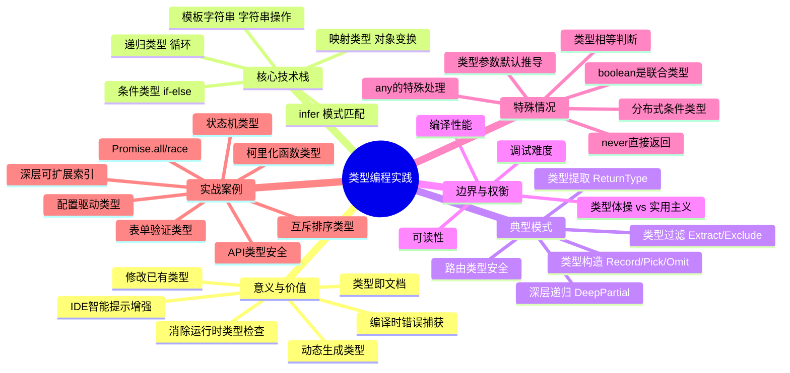
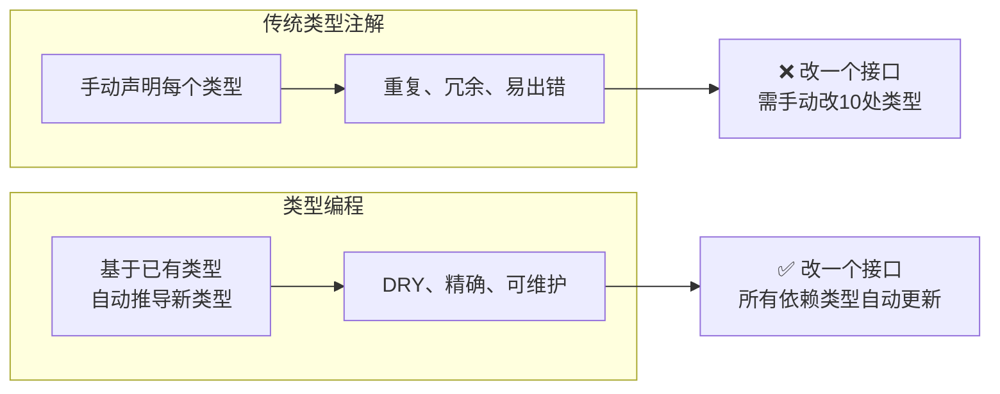
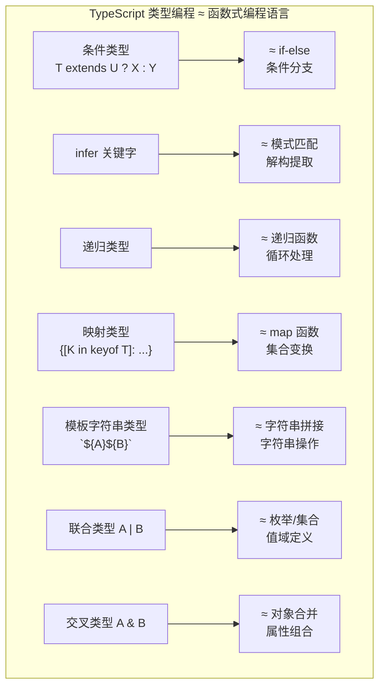
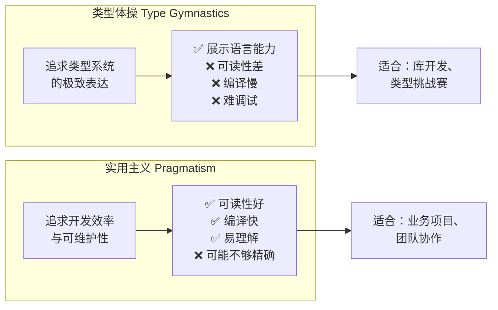
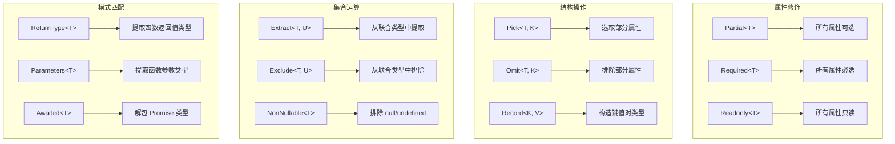

# 类型编程实践

> **核心概念**：类型编程（Type-Level Programming）是将 TypeScript 类型系统当作一门图灵完备的函数式编程语言来使用的技术。它能让类型系统执行逻辑判断、模式匹配、递归运算等操作，实现编译时的类型推导与约束。本章探讨类型编程的实战意义、边界把握与典型模式。

## 架构概览



---

## 一、类型编程的意义

### 1.1 为什么需要类型编程

传统的类型注解是"声明式"的——开发者手动标注每个变量的类型。类型编程则让类型系统具备了"计算"能力，能够根据已有类型**自动推导**出新类型。



### 1.2 类型编程的三层价值

| 层级 | 描述 | 典型应用 | 收益 |
|------|------|----------|------|
| **L1: 类型复用** | 避免重复定义相似类型 | `Partial<T>`, `Pick<T, K>` | 减少代码重复 |
| **L2: 类型推导** | 从已有类型自动计算新类型 | `ReturnType<T>`, `Parameters<T>` | 消除手动同步 |
| **L3: 类型约束** | 在类型层面实现业务规则 | 路由参数类型安全、表单字段关联 | 编译时捕获逻辑错误 |

### 1.3 两类典型场景

类型编程解决的核心问题可以归纳为两类：

**场景一：必须动态生成类型**——返回值类型与参数类型有关联，需要经过类型运算才能得到。这类场景不用类型编程就无法实现精确的类型定义。

- `Promise.all`：返回值类型是对参数中每个 Promise 的 value 类型解包后组成的数组，必须用映射类型 + `Awaited` 来计算。
- `Promise.race`：返回值类型是参数中任意一个 Promise 的 value 类型，必须用 `Awaited<T[number]>` 来推导。
- 柯里化函数：返回值是一个层层嵌套的函数类型，层数由参数个数决定，必须用递归条件类型来构造。

```typescript
// Promise.all 的类型定义：返回值类型由参数类型计算得出
interface PromiseConstructor {
  all<T extends readonly unknown[] | []>(values: T): Promise<{
    -readonly [P in keyof T]: Awaited<T[P]>
  }>;
}

// 柯里化函数类型：参数个数决定嵌套层数
type CurriedFunc<Params, Return> =
  Params extends [infer Arg, ...infer Rest]
    ? (arg: Arg) => CurriedFunc<Rest, Return>
    : Return;

declare function currying<Func>(fn: Func):
  Func extends (...args: infer Params) => infer Result ? CurriedFunc<Params, Result> : never;

// 使用：自动推导出 (a: string) => (b: number) => (c: boolean) => void
const curried = currying((a: string, b: number, c: boolean) => {});
```

**场景二：用类型编程实现更精准的类型提示**——不用类型编程也能工作，但用了之后类型提示和检查会更精确。

```typescript
// 不用类型编程：返回值类型为 object 或 Record<string, any>，没有属性提示
function parseQueryString(queryStr: string): Record<string, any> { ... }

// 用类型编程：返回值类型精确到每个属性，IDE 有完整提示
function parseQueryString<Str extends string>(queryStr: Str): ParseQueryString<Str>;
function parseQueryString(queryStr: string) { ... }

const res = parseQueryString('a=1&b=2&c=3');
// res 的类型为 { a: "1"; b: "2"; c: "3" }，有完整属性提示
```

> **注意**：像 `parseQueryString` 这类返回值类型依赖参数字面量类型的函数，最好通过函数重载来声明类型，否则返回值可能和类型运算结果匹配不上，需要 `as any` 才行。

---

## 二、核心技术栈

### 2.1 类型编程的"编程语言"映射

TypeScript 类型系统可以看作一门独立的函数式编程语言：



### 2.2 技术组合模式

```typescript
// 模式 1：条件类型 + infer → 类型提取
type UnpackPromise<T> = T extends Promise<infer U> ? U : T;

type Result1 = UnpackPromise<Promise<string>>;  // string
type Result2 = UnpackPromise<number>;           // number

// 模式 2：映射类型 + 条件类型 → 属性级变换
type Stringify<T> = {
  [K in keyof T]: T[K] extends number ? string : T[K];
};

type Config = { port: number; host: string; debug: boolean };
type StringifiedConfig = Stringify<Config>;
// { port: string; host: string; debug: boolean }

// 模式 3：递归 + 条件类型 + infer → 深层处理
type DeepReadonly<T> = T extends object
  ? { readonly [K in keyof T]: DeepReadonly<T[K]> }
  : T;

type Nested = { a: { b: { c: number } } };
type DeepNested = DeepReadonly<Nested>;
// { readonly a: { readonly b: { readonly c: number } } }

// 模式 4：模板字符串 + 映射类型 → 属性名变换
type Getters<T> = {
  [K in keyof T as `get${Capitalize<string & K>}`]: () => T[K];
};

type Person = { name: string; age: number };
type PersonGetters = Getters<Person>;
// { getName: () => string; getAge: () => number }
```

---

## 三、实战案例

### 3.1 路由参数类型安全

```typescript
// 定义路由与参数的映射关系
interface RouteParams {
  '/users': Record<string, never>;           // 无参数
  '/users/:id': { id: string };              // 单参数
  '/users/:id/posts': { id: string };        // 单参数
  '/users/:id/posts/:postId': { id: string; postId: string };  // 多参数
}

// 从路由字符串提取参数名
type ExtractParams<T extends string> =
  T extends `${string}:${infer Param}/${infer Rest}`
    ? { [K in Param | keyof ExtractParams<Rest>]: string }
    : T extends `${string}:${infer Param}`
      ? { [K in Param]: string }
      : Record<string, never>;

// 验证
type Params1 = ExtractParams<'/users'>;              // Record<string, never>（无参数）
type Params2 = ExtractParams<'/users/:id'>;          // { id: string }
type Params3 = ExtractParams<'/users/:id/posts/:postId'>;  // { id: string; postId: string }

// 类型安全的路由导航
function navigate<T extends keyof RouteParams>(
  path: T,
  params: RouteParams[T]
): void {
  // 实现...
}

navigate('/users', {});                          // OK
navigate('/users/:id', { id: '123' });          // OK
// navigate('/users/:id', {});                  // Error: 缺少 id
// navigate('/users/:id', { id: '123', foo: 'bar' });  // Error: 多余属性
```

### 3.2 表单字段关联类型

```typescript
// 定义表单字段的类型与验证规则的关联
// 注意：这里必须用 type 而不是 interface——对象类型别名才能满足
// Record<string, ...> 形式的约束，interface 没有隐式索引签名
type FormSchema = {
  username: { type: 'text'; required: true; minLength: 3 };
  email: { type: 'text'; required: true; pattern: 'email' };
  age: { type: 'number'; required: false; min: 0; max: 150 };
  subscribe: { type: 'boolean'; required: true };
}

// 从 Schema 推导表单数据类型
type FormDataType<S extends object> = {
  [K in keyof S]: S[K] extends { type: 'number' }
    ? number
    : S[K] extends { type: 'boolean' }
      ? boolean
      : string;
};

type FormData = FormDataType<FormSchema>;
// { username: string; email: string; age: number; subscribe: boolean }

// 从 Schema 推导必填字段类型
type RequiredFields<S extends object> = {
  [K in keyof S as S[K] extends { required: true } ? K : never]: FormDataType<Pick<S, K>>[K];
};

type Required = RequiredFields<FormSchema>;
// { username: string; email: string; subscribe: boolean }
```

### 3.3 状态机类型安全

```typescript
// 定义状态与合法转换
interface StateTransitions {
  idle: 'loading';
  loading: 'success' | 'error';
  success: 'idle';
  error: 'idle' | 'retrying';
  retrying: 'success' | 'error';
}

// 状态机类：只允许合法的状态转换
class StateMachine<T extends string, Transitions extends Record<T, string>> {
  private _state: T;

  constructor(
    initialState: T,
    private transitions: Transitions
  ) {
    this._state = initialState;
  }

  get state(): T {
    return this._state;
  }

  // 类型安全的状态转换：只允许转换到当前状态的合法目标状态
  transition<N extends Transitions[T] & string>(nextState: N): void {
    this._state = nextState as unknown as T;
  }
}

// 使用
type RequestState = keyof StateTransitions;
const machine = new StateMachine<RequestState, StateTransitions>(
  'idle',
  { idle: 'loading', loading: 'success', success: 'idle', error: 'idle', retrying: 'success' } as StateTransitions
);

machine.transition('loading');   // OK
machine.transition('success');  // OK
machine.transition('idle');     // OK

// ⚠️ 注意：T 是所有状态的联合类型，Transitions[T] 取出的是所有转换目标的联合，
// 所以 transition('error') 同样能通过编译。这个类只在类型层面约束了
// "目标状态是某个状态的合法后继"，并未在类型上跟踪运行时的当前状态。
```

### 3.4 配置驱动的类型生成

```typescript
// 从数据库 Schema 定义自动生成完整的 CRUD 类型
interface DBSchema {
  users: {
    id: number;
    name: string;
    email: string;
    role: 'admin' | 'user';
    createdAt: Date;
  };
  posts: {
    id: number;
    title: string;
    content: string;
    authorId: number;
    published: boolean;
    createdAt: Date;
  };
}

// 自动生成创建类型（不含自增 ID 和时间戳）
type CreateInput<T> = Omit<T, 'id' | 'createdAt'>;

// 自动生成更新类型（所有字段可选）
type UpdateInput<T> = Partial<Omit<T, 'id' | 'createdAt'>>;

// 自动生成 API 响应类型
type ApiResponse<T> = {
  data: T;
  meta: { total: number; page: number };
};

// 使用
type CreateUser = CreateInput<DBSchema['users']>;
// { name: string; email: string; role: 'admin' | 'user' }

type UpdateUser = UpdateInput<DBSchema['users']>;
// { name?: string; email?: string; role?: 'admin' | 'user' }

type UsersResponse = ApiResponse<DBSchema['users'][]>;
// { data: DBSchema['users'][]; meta: { total: number; page: number } }
```

### 3.5 深层可扩展索引类型

在实际项目中，接口返回的数据类型是固定的，但有时需要灵活扩展额外属性。单层对象可以通过可索引签名或交叉 `Record<string, any>` 来实现，但多层嵌套的对象就需要递归处理。

```typescript
// 单层：添加可索引签名
interface SingleLayer {
  name: string;
  age: number;
  [key: string]: any;  // 允许扩展任意额外属性
}

// 单层：与 Record<string, any> 取交叉
type SingleLayerExt = { name: string; age: number } & Record<string, any>;

// 多层：递归给每一层都加上可扩展能力
type DeepRecord<Obj extends Record<string, any>> = {
  [Key in keyof Obj]:
    Obj[Key] extends Record<string, any>
      ? DeepRecord<Obj[Key]> & Record<string, any>
      : Obj[Key]
} & Record<string, any>;

// 使用
interface ApiResponse {
  user: {
    profile: {
      name: string;
      avatar: string;
    };
    settings: {
      theme: 'light' | 'dark';
    };
  };
}

type ExtensibleResponse = DeepRecord<ApiResponse>;
// 每一层都可以灵活扩展额外属性，同时已有属性仍保持类型检查
```

### 3.6 动态生成互斥排序类型

当某个索引为 `'desc' | 'asc'` 时，其他索引必须为 `false`。手动枚举所有可能性在属性多时维护成本极高，可以用类型编程动态生成。

```typescript
// 需求：对于一组 key，只有一个为 'desc' | 'asc'，其余都为 false
// 例如 { name: 'asc', age: false, email: false } | { name: false, age: 'asc', email: false } | ...

type GenerateSortType<Keys extends keyof any> = {
  [Key in Keys]: {
    [Key2 in Key]: 'desc' | 'asc'
  } & {
    [Key3 in Exclude<Keys, Key>]: false
  }
}[Keys];

// 使用
type SortType = GenerateSortType<'name' | 'age' | 'email'>;
// 等价于手动枚举的所有组合，但属性增减时自动更新

// keyof any 动态获取索引的可能类型（string | number | symbol）
// 比写死 string 更通用，受 keyofStringsOnly 编译选项影响
```

---

## 四、边界与权衡

### 4.1 类型体操 vs 实用主义



### 4.2 编译性能考量

TypeScript 的类型检查是编译时操作，复杂的类型编程会显著影响编译速度：

| 复杂度级别 | 典型操作 | 编译耗时影响 | 建议 |
|-----------|----------|-------------|------|
| **O(1)** | 简单工具类型 `Partial<T>` | 几乎无影响 | ✅ 放心使用 |
| **O(n)** | 映射类型遍历属性 | 轻微影响 | ✅ 常规使用 |
| **O(n²)** | 交叉类型合并大对象 | 可感知 | ⚠️ 避免对超大类型使用 |
| **O(2ⁿ)** | 递归类型深度嵌套 | 显著影响 | ❌ 限制递归深度 |
| **O(∞)** | 无限递归/循环依赖 | 可能导致栈溢出 | ❌ 必须避免 |

```typescript
// ❌ 危险：无限递归
type Infinite<T> = { nested: Infinite<T> };  // 编译器会报错

// ✅ 安全：限制递归深度
type DeepPartial<T, Depth extends number = 5> = 
  Depth extends 0 
    ? T 
    : T extends object 
      ? { [K in keyof T]?: DeepPartial<T[K], Decrement<Depth>> }
      : T;

// 辅助类型：递减计数器
type Decrement<N extends number> = 
  N extends 5 ? 4 :
  N extends 4 ? 3 :
  N extends 3 ? 2 :
  N extends 2 ? 1 :
  N extends 1 ? 0 :
  0;
```

### 4.3 可读性原则

**原则 1：复杂类型逻辑必须有注释**

```typescript
// ❌ 不可读
type X<T> = T extends any[] ? T[number] : T extends object ? T[keyof T] : T;

// ✅ 有注释
/**
 * 提取类型的"元素类型"：
 * - 数组 → 元素类型 (number[] → number)
 * - 对象 → 所有值类型的联合 ({a: string, b: number} → string | number)
 * - 原始类型 → 原样返回
 */
type ElementType<T> = 
  T extends any[] 
    ? T[number]          // 数组：取元素类型
    : T extends object 
      ? T[keyof T]      // 对象：取所有值类型的联合
      : T;              // 原始类型：原样返回
```

**原则 2：使用有意义的类型别名名称**

```typescript
// ❌ 无意义
type R<T> = ...;
type P<T, U> = ...;

// ✅ 有意义
type RouteParams<T> = ...;
type ValidationResult<T, Rules> = ...;
```

**原则 3：拆分复杂类型为多个步骤**

```typescript
// ❌ 一步到位，难以理解
type Result<T> = { [K in keyof T as T[K] extends Function ? never : K]: T[K] extends object ? DeepReadonly<T[K]> : T[K] };

// ✅ 分步定义，每步含义清晰
type NonFunctionKeys<T> = { [K in keyof T]: T[K] extends Function ? never : K }[keyof T];
type DataProperties<T> = Pick<T, NonFunctionKeys<T>>;
type DeepReadonlyData<T> = DeepReadonly<DataProperties<T>>;
type Result<T> = DeepReadonlyData<T>;
```

### 4.4 条件类型的特殊情况

条件类型在使用中有几种容易让人困惑的特殊行为，理解其原理才能避免踩坑。

#### 联合类型与分布式条件类型

当联合类型作为类型参数出现在条件类型左边时，会把每个成员单独传入做计算，再把结果合并成联合类型：

```typescript
type Test<T> = T extends number ? 1 : 2;
type Res = Test<1 | 'a'>;  // 1 | 2
// 等价于 Test<1> | Test<'a'> → 1 | 2
```

#### boolean 也是联合类型

`boolean` 本质上是 `true | false`，因此也会触发分布式条件类型：

```typescript
type Test<T> = T extends true ? 1 : 2;
type Res = Test<boolean>;  // 1 | 2
// 等价于 Test<true> | Test<false> → 1 | 2
```

#### any 的特殊处理

当条件类型左边是 `any` 时，TypeScript 会直接返回 trueType 和 falseType 的联合类型：

```typescript
type Test<T> = T extends true ? 1 : 2;
type Res = Test<any>;  // 1 | 2
```

#### never 直接返回 never

当条件类型左边是 `never` 时，结果直接是 `never`（严格来说这也是分布式条件类型的一种情况，但 never 走了特殊的直接返回分支）：

```typescript
type Test<T> = T extends true ? 1 : 2;
type Res = Test<never>;  // never
```

#### 如何避免分布式行为

用 `[T] extends [U]` 包裹即可阻止联合类型的分发：

```typescript
// 默认行为：分发
type Distributed<T> = T extends number ? 1 : 2;
type D1 = Distributed<1 | 'a'>;  // 1 | 2

// 阻止分发：整体判断
type NonDistributed<T> = [T] extends [number] ? 1 : 2;
type D2 = NonDistributed<1 | 'a'>;  // 2（1 | 'a' 整体不满足 extends number）
```

### 4.5 类型相等判断的原理

判断两个类型是否相等，不能直接用 `A extends B ? true : false`，因为 `any extends number` 也是 `true`。正确的写法是：

```typescript
type IsEqual<A, B> = (<T>() => T extends A ? 1 : 2) extends (<T>() => T extends B ? 1 : 2)
  ? true : false;
```

这利用了 TypeScript 编译器的一个内部特性：当判断两个条件类型的相关性时，如果 `T1 extends U1 ? X1 : Y1` 和 `T2 extends U2 ? X2 : Y2` 相关，那么 `U1` 和 `U2` 是**相等**的（而非仅仅是"相关"）。通过构造两个结构相同的条件类型，就可以利用 extends 右边部分相等的性质来判断两个类型是否 truly equal，算是一种 hack 写法。

```typescript
// 验证
type R1 = IsEqual<any, number>;   // false（extends 判断是 true，但 IsEqual 是 false）
type R2 = IsEqual<1, 1>;          // true
type R3 = IsEqual<1, 2>;          // false
```

### 4.6 类型参数的默认推导

在类型编程中，如果需要取类型参数做一些计算，而该参数尚未被具体类型实例化，TypeScript 会默认推导出约束的类型；如果没有约束，则推导为 `unknown`。

```typescript
// T 约束为 number，推导出的参数类型就是 number
type GetParams<T extends number> = T;
type R = GetParams<number>;  // number（而非某个具体数字）

// 无约束时推导为 unknown
declare function fn<T>(): T;
type P = ReturnType<typeof fn>;  // unknown
```

这会导致一个常见问题：当泛型参数的约束是一个宽泛类型（如 `number`），而在条件类型中用它和具体值做比较时，比较永远不成立，可能导致无限递归。

```typescript
// 危险：Num1 的约束是 number，BuildArray<Num1> 中 Num1 被推导为 number
// number extends 某个具体数字 永远为 false → 无限递归
type Add<Num1 extends number, Num2 extends number> =
  BuildArray<Num1>['length'] extends Num1
    ? ...
    : ...;

// 解决方案：注意 extends 左右的位置，将具体值放在右边
type Add<Num1 extends number, Num2 extends number> =
  Num1 extends BuildArray<Num1>['length']
    ? ...   // 这样就不会无限递归
    : ...;
```

---

## 五、类型编程工具箱

### 5.1 常用工具类型速查



### 5.2 进阶工具类型实现

```typescript
// 1. 基于值类型的 Pick
type PickByValue<T, V> = {
  [K in keyof T as T[K] extends V ? K : never]: T[K];
};

type Config = { port: number; host: string; debug: boolean; timeout: number };
type NumericConfig = PickByValue<Config, number>;
// { port: number; timeout: number }

// 2. 互斥属性（XOR）
type Without<T, U> = { [K in Exclude<keyof T, keyof U>]?: never };
type XOR<T, U> = (Without<T, U> & U) | (Without<U, T> & T);

type EmailAuth = { email: string; password: string };
type PhoneAuth = { phone: string; code: string };
type AuthMethod = XOR<EmailAuth, PhoneAuth>;
// 只能是 { email, password } 或 { phone, code }，不能混合

// 3. 严格 Omit（保留可选性）
type StrictOmit<T, K extends keyof T> = T extends T
  ? Pick<T, Exclude<keyof T, K>>
  : never;

// 4. 可辨识联合的 Action 类型
type Action<T extends string, P = undefined> = P extends undefined
  ? { type: T }
  : { type: T; payload: P };

type Increment = Action<'increment'>;              // { type: 'increment' }
type Add = Action<'add', number>;                  // { type: 'add'; payload: number }
type UpdateUser = Action<'updateUser', { id: number; name: string }>;
// { type: 'updateUser'; payload: { id: number; name: string } }
```

---

## 六、类型测试

### 6.1 使用 tsd 进行类型测试

```typescript
// 安装：npm install -D tsd
import { expectType, expectError, expectAssignable } from 'tsd';

// 测试工具类型
type Result = DeepPartial<{ a: { b: number } }>;

expectType<{ a?: { b?: number } }>({} as Result);

// 测试类型错误
expectError<DeepPartial<string>>({} as never);  // DeepPartial 不应接受非对象类型

// 测试赋值兼容性
expectAssignable<{ a?: { b?: number } }>({} as Result);
```

### 6.2 使用条件类型进行编译时断言

```typescript
// 类型层面的断言工具
type Assert<T extends true> = T;
type IsExact<A, B> = [A] extends [B] ? [B] extends [A] ? true : false : false;

// 使用
type _Test1 = Assert<IsExact<Partial<{ a: string }>, { a?: string }>>;  // ✅ 编译通过
// type _Test2 = Assert<IsExact<Partial<{ a: string }>, { a: string }>>;  // ❌ 编译错误
```

---

## ⚠️ 常见陷阱

| 陷阱 | 描述 | 正确做法 |
|------|------|----------|
| **过度类型体操** | 为了炫技写极其复杂的类型，可读性为零 | 类型编程服务于业务，复杂度与收益成正比 |
| **递归无终止** | 递归类型没有终止条件，导致编译器栈溢出 | 始终提供终止条件，限制递归深度 |
| **分布式条件类型意外** | `T extends U ? X : Y` 对联合类型自动分发 | 用 `[T] extends [U]` 包裹避免分发 |
| **any 污染** | 类型编程中引入 `any` 导致后续类型推断失效 | 使用 `unknown` 或泛型约束代替 `any` |
| **忽略编译性能** | 复杂递归类型在大型项目中编译缓慢 | 监控编译时间，必要时简化类型逻辑 |
| **类型与运行时不一致** | 类型层面正确但运行时行为不同 | 类型编程配合运行时验证（如 zod） |
| **类型相等误判** | 用 `A extends B` 判断相等，`any extends number` 也为 true | 使用 `IsEqual` 的条件类型 hack 写法 |
| **类型参数默认推导** | 未实例化的类型参数推导为约束类型或 unknown，导致条件判断永远为 false | 注意 extends 左右位置，避免用宽泛约束与具体值比较 |
| **boolean 触发分发** | `boolean` 是 `true \| false` 的联合类型，会触发分布式条件类型 | 意识到 boolean 的联合类型本质，必要时用 `[T] extends [U]` 阻止 |

---

## 🔗 延伸阅读

- [条件类型与 infer](01-条件类型与%20infer.md) — 类型编程的核心控制流
- [内置工具类型基础](02-内置工具类型基础.md) — 标准工具类型实现原理
- [内置工具类型进阶](03-内置工具类型进阶.md) — 深层/部分属性修饰
- [模板字符串类型](04-模板字符串类型.md) — 类型层面的字符串操作
- [协变与逆变](../02-类型系统/06-协变与逆变.md) — 函数类型兼容性理论
- [TypeScript AST](../06-高级专题/04-TypeScript%20AST.md) — 编译器 API 与代码生成
