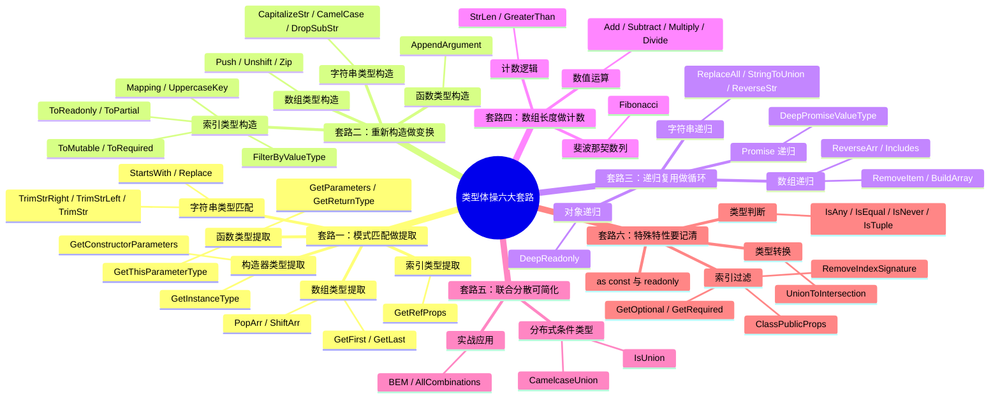

# 类型体操六大套路

> 类型体操是 TypeScript 类型编程的核心实践，通过六大套路可以系统化地解决绝大多数类型编程问题。

## 知识架构



## 本章概览

| 套路 | 核心思路 | 典型应用 |
|------|----------|----------|
| 模式匹配做提取 | `extends` + `infer` 类比正则捕获组，从类型中提取子类型 | GetParameters、GetReturnType、StartsWith |
| 重新构造做变换 | 类型不可变，需要重新构造产生新类型 | Push、CapitalizeStr、ToReadonly、FilterByValueType |
| 递归复用做循环 | 类型系统不支持循环，通过递归实现循环效果 | DeepPromiseValueType、ReverseArr、ReplaceAll |
| 数组长度做计数 | 利用数组 `length` 属性实现计数和算术运算 | Add、Subtract、StrLen、Fibonacci |
| 联合分散可简化 | 分布式条件类型将联合类型拆开分别处理再合并 | CamelcaseUnion、IsUnion、BEM |
| 特殊特性要记清 | TypeScript 中特殊行为特性需要特别记忆 | IsAny、IsEqual、IsNever、UnionToIntersection |

---

## 一、套路一：模式匹配做提取

> 就像字符串可以通过正则匹配提取子组一样，TypeScript 类型也可以通过匹配一个模式类型来提取部分类型到 `infer` 声明的局部变量中返回。

**核心概念**：TypeScript 类型的模式匹配是通过 `extends` 对类型参数做匹配，结果保存到通过 `infer` 声明的局部类型变量里，如果匹配就能从该局部变量里拿到提取出的类型。

先看一个最基础的例子 -- 提取 Promise 中的 value 类型：

```typescript
type p = Promise<'guang'>;

// 提取 Promise 中的 value 类型
type GetValueType<P> = P extends Promise<infer Value> ? Value : never;

type Result = GetValueType<Promise<'guang'>>; // 结果：'guang'
```

通过 `extends` 对传入的类型参数 P 做模式匹配，其中值的类型是需要提取的，通过 `infer` 声明一个局部变量 Value 来保存，如果匹配就返回匹配到的 Value，否则返回 never。

⚠️ **any 和 unknown 的区别**：any 和 unknown 都代表任意类型，但是 unknown 只能接收任意类型的值，而 any 除了可以接收任意类型的值，也可以赋值给任意类型（除了 never）。类型体操中经常用 unknown 接受和匹配任何类型，而很少把任何类型赋值给某个类型变量。

### 1.1 数组类型提取

#### GetFirst -- 提取数组第一个元素

```typescript
type GetFirst<Arr extends unknown[]> =
    Arr extends [infer First, ...unknown[]] ? First : never;

type FirstResult1 = GetFirst<[1, 2, 3]>;  // 结果：1
type FirstResult2 = GetFirst<[]>;          // 结果：never
```

类型参数 Arr 通过 `extends` 约束为只能是数组类型，数组元素是 unknown 也就是可以是任何值。对 Arr 做模式匹配，把第一个元素的类型放到 `infer` 声明的 First 局部变量里，后面的元素可以是任何类型用 unknown 接收，然后返回 First。

#### GetLast -- 提取数组最后一个元素

```typescript
type GetLast<Arr extends unknown[]> =
    Arr extends [...unknown[], infer Last] ? Last : never;

type LastResult = GetLast<[1, 2, 3]>;  // 结果：3
```

修改模式类型，把 `infer` 放在最后即可提取最后一个元素。

#### PopArr -- 去掉最后一个元素

```typescript
type PopArr<Arr extends unknown[]> =
    Arr extends [] ? []
        : Arr extends [...infer Rest, unknown] ? Rest : never;

type PopResult1 = PopArr<[1, 2, 3]>;  // 结果：[1, 2]
type PopResult2 = PopArr<[]>;          // 结果：[]
```

如果是空数组就直接返回，否则匹配剩余的元素放到 `infer` 声明的局部变量 Rest 里，返回 Rest。

#### ShiftArr -- 去掉第一个元素

```typescript
type ShiftArr<Arr extends unknown[]> =
    Arr extends [] ? []
        : Arr extends [unknown, ...infer Rest] ? Rest : never;

type ShiftResult = ShiftArr<[1, 2, 3]>;  // 结果：[2, 3]
```

### 1.2 字符串类型匹配

#### StartsWith -- 判断字符串前缀

```typescript
type StartsWith<Str extends string, Prefix extends string> =
    Str extends `${Prefix}${string}` ? true : false;

type StartsWithResult1 = StartsWith<'abcde', 'abc'>;  // 结果：true
type StartsWithResult2 = StartsWith<'abcde', 'def'>;  // 结果：false
```

用 Str 去匹配一个模式类型，模式类型的前缀是 Prefix，后面是任意的 string，如果匹配返回 true，否则返回 false。

#### ReplaceStr -- 字符串替换

```typescript
type ReplaceStr<
    Str extends string,
    From extends string,
    To extends string
> = Str extends `${infer Prefix}${From}${infer Suffix}`
        ? `${Prefix}${To}${Suffix}` : Str;

type ReplaceResult1 = ReplaceStr<'guang and dong', 'and', 'or'>;  // 结果：'guang or dong'
type ReplaceResult2 = ReplaceStr<'guang and dong', 'not', 'or'>;  // 结果：'guang and dong'
```

用 Str 去匹配模式串，模式串由 From 和之前之后的字符串构成，把之前之后的字符串放到 `infer` 声明的局部变量 Prefix、Suffix 里。用 Prefix、Suffix 加上替换到的字符串 To 构造成新的字符串类型返回。

#### TrimStrRight -- 去掉右侧空白

```typescript
type TrimStrRight<Str extends string> =
    Str extends `${infer Rest}${' ' | '\n' | '\t'}`
        ? TrimStrRight<Rest> : Str;

type TrimRightResult = TrimStrRight<'guang   '>;  // 结果：'guang'
```

如果 Str 匹配字符串 + 空白字符（空格、换行、制表符），就把字符串放到 `infer` 声明的局部变量 Rest 里，把 Rest 作为类型参数递归 TrimStrRight，直到不匹配。

#### TrimStrLeft -- 去掉左侧空白

```typescript
type TrimStrLeft<Str extends string> =
    Str extends `${' ' | '\n' | '\t'}${infer Rest}`
        ? TrimStrLeft<Rest> : Str;

type TrimLeftResult = TrimStrLeft<'   guang'>;  // 结果：'guang'
```

#### TrimStr -- 去掉两侧空白

```typescript
type TrimStr<Str extends string> = TrimStrRight<TrimStrLeft<Str>>;

type TrimResult = TrimStr<'   guang   '>;  // 结果：'guang'
```

TrimRight 和 TrimLeft 结合就是 Trim。

### 1.3 函数类型提取

#### GetParameters -- 提取函数参数类型

```typescript
type GetParameters<Func extends Function> =
    Func extends (...args: infer Args) => unknown ? Args : never;

type ParamsResult = GetParameters<(name: string, age: number) => string>;
// 结果：[string, number]
```

Func 和模式类型做匹配，参数类型放到用 `infer` 声明的局部变量 Args 里，返回值可以是任何类型用 unknown。

#### GetReturnType -- 提取函数返回值类型

```typescript
type GetReturnType<Func extends Function> =
    Func extends (...args: any[]) => infer ReturnType
        ? ReturnType : never;

type ReturnResult = GetReturnType<(name: string, age: number) => string>;
// 结果：string
```

⚠️ **参数类型用 any[] 而非 unknown[]**：这里不能用 unknown，涉及到参数的逆变性质。具体原因在协变与逆变章节解释，参见 [协变与逆变](../02-类型系统/06-协变与逆变.md)。

#### GetThisParameterType -- 提取函数 this 类型

方法里可以调用 this，可以在方法声明时指定 this 的类型：

```typescript
class Dong {
    name: string;

    constructor() {
        this.name = "dong";
    }

    hello(this: Dong) {
        return 'hello, I\'m ' + this.name;
    }
}
```

提取 this 的类型：

```typescript
type GetThisParameterType<T> =
    T extends (this: infer ThisType, ...args: any[]) => any
        ? ThisType
        : unknown;

type ThisResult = GetThisParameterType<typeof Dong.prototype.hello>;
// 结果：Dong
```

### 1.4 构造器类型提取

构造器和函数的区别是，构造器是用于创建对象的，所以可以被 new。

#### GetInstanceType -- 提取构造器实例类型

```typescript
interface Person {
    name: string;
}

interface PersonConstructor {
    new(name: string): Person;
}

type GetInstanceType<
    ConstructorType extends new (...args: any) => any
> = ConstructorType extends new (...args: any) => infer InstanceType
        ? InstanceType
        : any;

type InstanceResult = GetInstanceType<PersonConstructor>;  // 结果：Person
```

#### GetConstructorParameters -- 提取构造器参数类型

```typescript
type GetConstructorParameters<
    ConstructorType extends new (...args: any) => any
> = ConstructorType extends new (...args: infer ParametersType) => any
    ? ParametersType
    : never;

type ConstructorParamsResult = GetConstructorParameters<PersonConstructor>;
// 结果：[string]
```

### 1.5 索引类型提取

#### GetRefProps -- 提取 ref 属性类型

```typescript
type GetRefProps<Props> =
    'ref' extends keyof Props
        ? Props extends { ref?: infer Value | undefined}
            ? Value
            : never
        : never;

type RefResult1 = GetRefProps<{ ref?: string | undefined }>;  // 结果：string
type RefResult2 = GetRefProps<{ ref?: undefined }>;            // 结果：undefined
type RefResult3 = GetRefProps<{ name: string }>;               // 结果：never
```

⚠️ **兼容性处理**：先判断 `'ref' extends keyof Props`，是因为在 ts3.0 里面如果没有对应的索引，`Obj[Key]` 返回的是 `{}` 而不是 never，所以做下兼容处理。

---

## 二、套路二：重新构造做变换

> TypeScript 的 type、infer、类型参数声明的变量都不能修改，想对类型做各种变换产生新的类型就需要重新构造。

**核心概念**：TypeScript 支持 type、infer、类型参数来保存任意类型，相当于变量的作用。但其实也不能叫变量，因为它们是不可变的。想要变化就需要重新构造新的类型，并且可以在构造新类型的过程中对原类型做一些过滤和变换。

### 2.1 数组类型构造

⚠️ **数组和元组的区别**：数组类型是指任意多个同一类型的元素构成的，比如 `number[]`、`Array<number>`，而元组则是数量固定、类型可以不同的元素构成的，比如 `[1, true, 'guang']`。

#### Push -- 在数组末尾添加元素

```typescript
type Push<Arr extends unknown[], Ele> = [...Arr, Ele];

type PushResult = Push<[1, 2, 3], 4>;  // 结果：[1, 2, 3, 4]
```

返回的是用 Arr 已有的元素加上 Ele 构造的新的元组类型。

#### Unshift -- 在数组开头添加元素

```typescript
type Unshift<Arr extends unknown[], Ele> = [Ele, ...Arr];

type UnshiftResult = Unshift<[1, 2, 3], 0>;  // 结果：[0, 1, 2, 3]
```

#### Zip -- 合并两个元组

固定长度的版本：

```typescript
type Zip<One extends [unknown, unknown], Other extends [unknown, unknown]> =
    One extends [infer OneFirst, infer OneSecond]
        ? Other extends [infer OtherFirst, infer OtherSecond]
            ? [[OneFirst, OtherFirst], [OneSecond, OtherSecond]] : []
                : [];

type ZipResult1 = Zip<[1, 2], ['guang', 'dong']>;
// 结果：[[1, 'guang'], [2, 'dong']]
```

任意长度的递归版本：

```typescript
type Zip2<One extends unknown[], Other extends unknown[]> =
    One extends [infer OneFirst, ...infer OneRest]
        ? Other extends [infer OtherFirst, ...infer OtherRest]
            ? [[OneFirst, OtherFirst], ...Zip2<OneRest, OtherRest>]: []
                : [];

type ZipResult2 = Zip2<[1, 2, 3], ['guang', 'dong', 'dong']>;
// 结果：[[1, 'guang'], [2, 'dong'], [3, 'dong']]
```

每次提取 One 和 Other 的第一个元素，剩余的放到 OneRest、OtherRest 里，用提取的元素构造成新的元组的一个元素，剩余元素继续递归处理。

### 2.2 字符串类型构造

#### CapitalizeStr -- 首字母大写

```typescript
type CapitalizeStr<Str extends string> =
    Str extends `${infer First}${infer Rest}`
        ? `${Uppercase<First>}${Rest}` : Str;

type CapitalizeResult = CapitalizeStr<'guang'>;  // 结果：'Guang'
```

通过 `infer` 提取出首个字符到局部变量 First，提取后面的字符到局部变量 Rest，使用 TypeScript 内置高级类型 `Uppercase` 把首字母转为大写，加上 Rest 构造成新的字符串类型返回。

#### CamelCase -- 下划线转驼峰

```typescript
type CamelCase<Str extends string> =
    Str extends `${infer Left}_${infer Right}${infer Rest}`
        ? `${Left}${Uppercase<Right>}${CamelCase<Rest>}`
        : Str;

type CamelCaseResult = CamelCase<'dong_dong_dong'>;  // 结果：'dongDongDong'
```

提取 `_` 之前和之后的两个字符到 `infer` 声明的局部变量 Left 和 Right，剩下的字符放到 Rest 里。把右边的字符 Right 大写，和 Left 构造成新的字符串，剩余的字符 Rest 继续递归处理。

#### DropSubStr -- 删除子串

```typescript
type DropSubStr<Str extends string, SubStr extends string> =
    Str extends `${infer Prefix}${SubStr}${infer Suffix}`
        ? DropSubStr<`${Prefix}${Suffix}`, SubStr> : Str;

type DropResult = DropSubStr<'guang~~~dong~~~', '~~~'>;  // 结果：'guangdong'
```

通过模式匹配提取 SubStr 之前和之后的字符串到 `infer` 声明的局部变量 Prefix、Suffix 中。如果匹配，用 Prefix、Suffix 构造成新的字符串，然后继续递归删除 SubStr，直到不再匹配。

### 2.3 函数类型构造

#### AppendArgument -- 添加函数参数

```typescript
type AppendArgument<Func extends Function, Arg> =
    Func extends (...args: infer Args) => infer ReturnType
        ? (...args: [...Args, Arg]) => ReturnType : never;

type AppendResult = AppendArgument<(name: string) => number, number>;
// 结果：(name: string, arg: number) => number
```

通过模式匹配提取参数到 `infer` 声明的局部变量 Args 中，提取返回值到局部变量 ReturnType 中。用 Args 数组添加 Arg 构造成新的参数类型，结合 ReturnType 构造成新的函数类型返回。

### 2.4 索引类型构造

索引类型是聚合多个元素的类型，class、对象等都是索引类型。对它的修改和构造新类型涉及到了**映射类型**的语法：

```typescript
type Mapping<Obj extends object> = {
    [Key in keyof Obj]: Obj[Key]
}
```

#### Mapping -- 值变换

```typescript
type Mapping<Obj extends object> = {
    [Key in keyof Obj]: [Obj[Key], Obj[Key], Obj[Key]]
}

type MappingResult = Mapping<{ name: string; age: number }>;
// 结果：{ name: [string, string, string]; age: [number, number, number] }
```

用 `keyof` 取出 Obj 的索引，作为新的索引类型的索引，值的类型可以做变换。

#### UppercaseKey -- 索引转大写（重映射）

```typescript
type UppercaseKey<Obj extends Record<string, any>> = {
    [Key in keyof Obj as Uppercase<Key & string>]: Obj[Key]
}

type UppercaseKeyResult = UppercaseKey<{ name: string; age: number }>;
// 结果：{ NAME: string; AGE: number }
```

使用 `as` 做重映射，通过 `Uppercase` 把索引 Key 转为大写。因为索引可能为 string、number、symbol 类型，而 Uppercase 只能接受 string 类型，所以要 `& string`，也就是取索引中 string 的部分。

> **Record 类型**：TypeScript 提供了内置高级类型 Record 来创建索引类型：
> ```typescript
> type Record<K extends string | number | symbol, T> = { [P in K]: T; }
> ```
> 约束类型参数为 `Record<string, any>` 比 `object` 更语义化。

#### ToReadonly -- 添加 readonly 修饰

```typescript
type ToReadonly<T> = {
    readonly [Key in keyof T]: T[Key];
}

type ReadonlyResult = ToReadonly<{ name: string; age: number }>;
// 结果：{ readonly name: string; readonly age: number }
```

#### ToPartial -- 添加可选修饰

```typescript
type ToPartial<T> = {
    [Key in keyof T]?: T[Key]
}

type PartialResult = ToPartial<{ name: string; age: number }>;
// 结果：{ name?: string; age?: number }
```

#### ToMutable -- 去掉 readonly 修饰

```typescript
type ToMutable<T> = {
    -readonly [Key in keyof T]: T[Key]
}

type MutableResult = ToMutable<{ readonly name: string; readonly age: number }>;
// 结果：{ name: string; age: number }
```

#### ToRequired -- 去掉可选修饰

```typescript
type ToRequired<T> = {
    [Key in keyof T]-?: T[Key]
}

type RequiredResult = ToRequired<{ name?: string; age?: number }>;
// 结果：{ name: string; age: number }
```

#### FilterByValueType -- 按值类型过滤索引

```typescript
type FilterByValueType<
    Obj extends Record<string, any>,
    ValueType
> = {
    [Key in keyof Obj
        as Obj[Key] extends ValueType ? Key : never]
        : Obj[Key]
}

type FilterResult = FilterByValueType<{ name: string; age: number; visible: boolean }, string>;
// 结果：{ name: string }
```

如果原来索引的值 `Obj[Key]` 是 ValueType 类型，索引依然为之前的索引 Key，否则索引设置为 never，never 的索引会在生成新的索引类型时被去掉。

---

## 三、套路三：递归复用做循环

> TypeScript 类型系统不支持循环，但支持递归。当处理数量（个数、长度、层数）不固定的类型的时候，可以只处理一个类型，然后递归的调用自身处理下一个类型，直到结束条件，达到循环的效果。

**核心概念**：递归是把问题分解为一系列相似的小问题，通过函数不断调用自身来解决这一个个小问题，直到满足结束条件。在类型体操中，遇到数量不确定的问题，要条件反射的想到递归。

### 3.1 Promise 递归

#### DeepPromiseValueType -- 提取深层 Promise 的 value 类型

```typescript
type ttt = Promise<Promise<Promise<Record<string, any>>>>;

// 完整版本
type DeepPromiseValueType<P extends Promise<unknown>> =
    P extends Promise<infer ValueType>
        ? ValueType extends Promise<unknown>
            ? DeepPromiseValueType<ValueType>
            : ValueType
        : never;

// 简化版本（不再约束类型参数必须是 Promise，少一层判断）
type DeepPromiseValueType2<T> =
    T extends Promise<infer ValueType>
        ? DeepPromiseValueType2<ValueType>
        : T;

type DeepResult = DeepPromiseValueType<Promise<Promise<Promise<Record<string, any>>>>>;
// 结果：Record<string, any>

type DeepResult2 = DeepPromiseValueType2<Promise<Promise<Promise<Record<string, any>>>>>;
// 结果：Record<string, any>
```

每次只处理一个类型的提取，通过模式匹配提取出 value 的类型到 `infer` 声明的局部变量 ValueType 中。如果 ValueType 依然是 Promise 类型就递归处理，结束条件就是 ValueType 不为 Promise 类型。

### 3.2 数组递归

#### ReverseArr -- 反转数组

固定长度的版本：

```typescript
type ReverseArr<Arr extends unknown[]> =
    Arr extends [infer One, infer Two, infer Three, infer Four, infer Five]
        ? [Five, Four, Three, Two, One]
        : never;

type ReverseFixed = ReverseArr<[1, 2, 3, 4, 5]>;  // 结果：[5, 4, 3, 2, 1]
```

递归版本（处理任意长度）：

```typescript
type ReverseArr<Arr extends unknown[]> =
    Arr extends [infer First, ...infer Rest]
        ? [...ReverseArr<Rest>, First]
        : Arr;

type ReverseResult = ReverseArr<[1, 2, 3, 4, 5]>;  // 结果：[5, 4, 3, 2, 1]
```

每次只处理一个元素的提取，放到 `infer` 声明的局部变量 First 里，剩下的放到 Rest 里。用 First 作为最后一个元素构造新数组，其余元素递归的取。结束条件就是取完所有的元素。

#### Includes -- 查找数组元素

```typescript
type IsEqual<A, B> = (A extends B ? true : false) & (B extends A ? true : false);

type Includes<Arr extends unknown[], FindItem> =
    Arr extends [infer First, ...infer Rest]
        ? IsEqual<First, FindItem> extends true
            ? true
            : Includes<Rest, FindItem>
        : false;

type IncludesResult1 = Includes<[1, 2, 3, 4, 5], 4>;  // 结果：true
type IncludesResult2 = Includes<[1, 2, 3, 4, 5], 6>;  // 结果：false
```

每次提取一个元素，判断是否是要查找的元素（通过 IsEqual 判断），是的话返回 true，否则继续递归判断下一个元素。直到提取不出下一个元素，返回 false。

⚠️ **IsEqual 的判断**：相等的判断是 A 是 B 的子类型并且 B 也是 A 的子类型。但这种写法在 any 场景下不完善，套路六会讲原因。

#### RemoveItem -- 删除数组元素

```typescript
type IsEqual<A, B> = (A extends B ? true : false) & (B extends A ? true : false);

type RemoveItem<
    Arr extends unknown[],
    Item,
    Result extends unknown[] = []
> = Arr extends [infer First, ...infer Rest]
        ? IsEqual<First, Item> extends true
            ? RemoveItem<Rest, Item, Result>
            : RemoveItem<Rest, Item, [...Result, First]>
        : Result;

type RemoveResult = RemoveItem<[1, 2, 3, 4, 5], 3>;  // 结果：[1, 2, 4, 5]
```

通过模式匹配提取数组中的一个元素，如果是 Item 类型就删除（不放入新数组），否则放入新数组。直到处理完所有元素，返回 Result。

#### BuildArray -- 构造指定长度的数组

```typescript
type BuildArray<
    Length extends number,
    Ele = unknown,
    Arr extends unknown[] = []
> = Arr['length'] extends Length
        ? Arr
        : BuildArray<Length, Ele, [...Arr, Ele]>;

type BuildResult = BuildArray<5>;  // 结果：[unknown, unknown, unknown, unknown, unknown]
type BuildResult2 = BuildArray<3, number>;  // 结果：[number, number, number]
```

每次判断 Arr 的长度是否到了 Length，是的话就返回 Arr，否则在 Arr 上加一个元素，然后递归构造。

### 3.3 字符串递归

#### ReplaceAll -- 全局替换

```typescript
type ReplaceAll<
    Str extends string,
    From extends string,
    To extends string
> = Str extends `${infer Left}${From}${infer Right}`
        ? `${Left}${To}${ReplaceAll<Right, From, To>}`
        : Str;

type ReplaceAllResult = ReplaceAll<'guang and dong and dong', 'and', 'or'>;
// 结果：'guang or dong or dong'
```

通过模式匹配提取 From 左右的字符串到 `infer` 声明的局部变量 Left 和 Right 里。用 Left 和 To 构造新的字符串，剩余的 Right 部分继续递归替换。结束条件是不再满足模式匹配。

#### StringToUnion -- 字符串转联合类型

固定长度的版本：

```typescript
type StringToUnion<Str extends string> =
    Str extends `${infer One}${infer Two}${infer Three}${infer Four}`
        ? One | Two | Three | Four
        : never;

type StringUnionFixed = StringToUnion<'dong'>;  // 结果：'d' | 'o' | 'n' | 'g'
```

递归版本（处理任意长度）：

```typescript
type StringToUnion<Str extends string> =
    Str extends `${infer First}${infer Rest}`
        ? First | StringToUnion<Rest>
        : never;

type StringUnionResult = StringToUnion<'dongdong'>;  // 结果：'d' | 'o' | 'n' | 'g'
```

通过模式匹配提取第一个字符到 `infer` 声明的局部变量 First，其余的字符放到 Rest。用 First 构造联合类型，剩余的元素递归取。

#### ReverseStr -- 反转字符串

```typescript
type ReverseStr<
    Str extends string,
    Result extends string = ''
> = Str extends `${infer First}${infer Rest}`
    ? ReverseStr<Rest, `${First}${Result}`>
    : Result;

type ReverseStrResult = ReverseStr<'abcde'>;  // 结果：'edcba'
```

通过模式匹配提取第一个字符到 `infer` 声明的局部变量 First，其余字符放到 Rest。用 First 和之前的 Result 构造成新的字符串，把 First 放到前面，因为递归是从左到右处理，不断往前插就是把右边的放到了左边，完成反转。

### 3.4 对象递归

#### DeepReadonly -- 深层 readonly

```typescript
type DeepReadonly<Obj extends Record<string, any>> =
    Obj extends any
        ? {
            readonly [Key in keyof Obj]:
                Obj[Key] extends object
                    ? Obj[Key] extends Function
                        ? Obj[Key]
                        : DeepReadonly<Obj[Key]>
                    : Obj[Key]
        }
        : never;

type obj = {
    a: {
        b: {
            c: {
                f: () => 'dong',
                d: {
                    e: {
                        guang: string
                    }
                }
            }
        }
    }
}

type DeepReadonlyResult = DeepReadonly<obj>;
// 结果：{ readonly a: { readonly b: { readonly c: { readonly f: () => 'dong'; readonly d: { readonly e: { readonly guang: string } } } } } }
```

索引映射自之前的索引，加上了 readonly 修饰。值要做判断：如果是 object 类型并且还是 Function，就直接取之前的值；如果是 object 类型但不是 Function，就递归处理；否则直接返回之前的值。

⚠️ **触发类型计算**：TypeScript 的类型只有被用到的时候才会做计算。可以在前面加上 `Obj extends any` 来触发计算，同时还能处理联合类型（套路五会解释）。

---

## 四、套路四：数组长度做计数

> TypeScript 类型系统没有加减乘除运算符，但是可以通过构造不同的数组然后取 length 的方式来完成数值计算，把数值的加减乘除转化为对数组的提取和构造。

**核心概念**：数组类型取 `length` 就是数值，而数组类型是可以构造出来的，那么通过构造不同长度的数组然后取 `length`，不就是数值的运算么？

```typescript
type len1 = [unknown, unknown, unknown]['length'];  // 结果：3
type len2 = [unknown, unknown]['length'];            // 结果：2
type len3 = []['length'];                            // 结果：0
```

⚠️ **这是类型体操中最麻烦的一个点**，需要思维做一些转换，把数值运算转化为对数组的提取和构造。

### 4.1 数值运算

#### BuildArray -- 构造指定长度的数组（基础工具）

```typescript
type BuildArray<
    Length extends number,
    Ele = unknown,
    Arr extends unknown[] = []
> = Arr['length'] extends Length
        ? Arr
        : BuildArray<Length, Ele, [...Arr, Ele]>;
```

#### Add -- 加法

构造两个数组，然后合并成一个，取 length：

```typescript
type Add<Num1 extends number, Num2 extends number> =
    [...BuildArray<Num1>, ...BuildArray<Num2>]['length'];

type AddResult = Add<32, 18>;  // 结果：50
```

#### Subtract -- 减法

构造 Num1 长度的数组，通过模式匹配提取出 Num2 长度个元素，剩下的取 length：

```typescript
type Subtract<Num1 extends number, Num2 extends number> =
    BuildArray<Num1> extends [...arr1: BuildArray<Num2>, ...arr2: infer Rest]
        ? Rest['length']
        : never;

type SubtractResult = Subtract<32, 18>;  // 结果：14
```

⚠️ **元组成员命名规则**：元组成员或者全部有名字，或者全部没有。所以 `arr1` 不能省略。

#### Multiply -- 乘法

乘法就是多个加法结果的累加：

```typescript
type Multiply<
    Num1 extends number,
    Num2 extends number,
    ResultArr extends unknown[] = []
> = Num2 extends 0 ? ResultArr['length']
        : Multiply<Num1, Subtract<Num2, 1>, [...BuildArray<Num1>, ...ResultArr]>;

type MultiplyResult = Multiply<3, 4>;  // 结果：12
```

每加一次就把 Num2 减一，直到 Num2 为 0。加的过程就是往 ResultArr 数组中放 Num1 个元素。最后取 ResultArr 的 length 就是乘法的结果。

#### Divide -- 除法

除法就是递归的累减，记录减了几次就是结果：

```typescript
type Divide<
    Num1 extends number,
    Num2 extends number,
    CountArr extends unknown[] = []
> = Num1 extends 0 ? CountArr['length']
        : Divide<Subtract<Num1, Num2>, Num2, [unknown, ...CountArr]>;

type DivideResult = Divide<9, 3>;  // 结果：3
```

如果 Num1 减到了 0，那么减了几次就是除法结果，也就是 `CountArr['length']`。否则继续递归的减，CountArr 多加一个元素代表又减了一次。

### 4.2 计数逻辑

#### StrLen -- 求字符串长度

字符串类型不能取 length，通过递归计数来实现：

```typescript
type StrLen<
    Str extends string,
    CountArr extends unknown[] = []
> = Str extends `${string}${infer Rest}`
    ? StrLen<Rest, [...CountArr, unknown]>
    : CountArr['length']

type StrLenResult = StrLen<'guang dong'>;  // 结果：10
```

每次通过模式匹配提取去掉一个字符之后的剩余字符串，并且往计数数组里多放入一个元素。递归进行取字符和计数，如果模式匹配不满足，返回计数数组的长度。

#### GreaterThan -- 数值比较

往一个数组类型中不断放入元素取长度，如果先到了 A 那就是 B 大，否则是 A 大：

```typescript
type GreaterThan<
    Num1 extends number,
    Num2 extends number,
    CountArr extends unknown[] = []
> = Num1 extends Num2
    ? false
    : CountArr['length'] extends Num2
        ? true
        : CountArr['length'] extends Num1
            ? false
            : GreaterThan<Num1, Num2, [...CountArr, unknown]>;

type GreaterThanResult1 = GreaterThan<3, 4>;  // 结果：false
type GreaterThanResult2 = GreaterThan<6, 4>;  // 结果：true
```

如果 Num1 extends Num2 成立，代表相等，直接返回 false。否则判断计数数组的长度，如果先到了 Num2 那么 Num1 大返回 true，如果先到了 Num1 那么 Num2 大返回 false。

### 4.3 斐波那契数列

Fibonacci 数列是 1、1、2、3、5、8、13、21、34...，当前数是前两个数的和：

F(0) = 1，F(1) = 1，F(n) = F(n-1) + F(n-2)（n >= 2）

```typescript
type FibonacciLoop<
    PrevArr extends unknown[],
    CurrentArr extends unknown[],
    IndexArr extends unknown[] = [],
    Num extends number = 1
> = IndexArr['length'] extends Num
    ? CurrentArr['length']
    : FibonacciLoop<CurrentArr, [...PrevArr, ...CurrentArr], [...IndexArr, unknown], Num>

type Fibonacci<Num extends number> = FibonacciLoop<[1], [], [], Num>;

type FibResult = Fibonacci<8>;  // 结果：21
```

| 参数 | 含义 |
|------|------|
| PrevArr | 代表之前的累加值的数组 |
| CurrentArr | 代表当前数值的数组 |
| IndexArr | 记录 index，每次递归加一 |
| Num | 求数列的第几个数 |

判断当前 index 是否到了 Num，到了就返回当前数值 `CurrentArr['length']`。否则求出当前 index 对应的数值，用之前的数加上当前的数 `[...PrevArr, ...CurrentArr]`，然后继续递归。

---

## 五、套路五：联合分散可简化

> 联合类型在类型编程中是比较特殊的，TypeScript 对它做了专门的处理，写法上可以简化，但也增加了一些认知成本。

### 5.1 核心概念 -- 分布式条件类型

**当类型参数为联合类型，并且在条件类型左边直接引用该类型参数的时候，TypeScript 会把每一个元素单独传入来做类型运算，最后再合并成联合类型，这种语法叫做分布式条件类型。**

```typescript
type Union = 'a' | 'b' | 'c';

// 想把其中的 a 大写
type UppercaseA<Item extends string> =
    Item extends 'a' ? Uppercase<Item> : Item;

type UppercaseAResult = UppercaseA<'a' | 'b' | 'c'>;
// 结果：'A' | 'b' | 'c'
```

TypeScript 会把联合类型的每一个元素单独传入做类型计算，最后合并。这和联合类型遇到字符串时的处理一样：

```typescript
type StrResult = `${'a' | 'b' | 'c'}___`;
// 结果：'a___' | 'b___' | 'c___'
```

联合类型的每个元素都是互不相关的，不像数组、索引、字符串那样元素之间是有关系的，所以设计成了每一个单独处理最后合并。

### 5.2 联合类型简化 -- CamelcaseUnion

对字符串数组做 Camelcase 需要递归处理每一个元素：

```typescript
type Camelcase<Str extends string> =
    Str extends `${infer Left}_${infer Right}${infer Rest}`
    ? `${Left}${Uppercase<Right>}${Camelcase<Rest>}`
    : Str;

type CamelcaseArr<
  Arr extends unknown[]
> = Arr extends [infer Item, ...infer RestArr]
  ? [Camelcase<Item & string>, ...CamelcaseArr<RestArr>]
  : [];

type CamelcaseArrResult = CamelcaseArr<['guang_dong', 'hello_world']>;
// 结果：['guangDong', 'helloWorld']
```

而联合类型不需要递归提取每个元素，TypeScript 内部会把每一个元素传入单独做计算：

```typescript
type CamelcaseUnion<Item extends string> =
  Item extends `${infer Left}_${infer Right}${infer Rest}`
    ? `${Left}${Uppercase<Right>}${CamelcaseUnion<Rest>}`
    : Item;

type CamelcaseUnionResult = CamelcaseUnion<'guang_dong' | 'hello_world'>;
// 结果：'guangDong' | 'helloWorld'
```

对联合类型的处理和对单个类型的处理没什么区别，TypeScript 会把每个单独的类型拆开传入，不需要像数组类型那样需要递归提取每个元素做处理。

### 5.3 联合类型判断 -- IsUnion

```typescript
type IsUnion<A, B = A> =
    A extends A
        ? [B] extends [A]
            ? false
            : true
        : never

type IsUnionResult1 = IsUnion<'a' | 'b' | 'c'>;  // 结果：true
type IsUnionResult2 = IsUnion<'a'>;               // 结果：false
```

这段逻辑看起来很奇怪，但理解了分布式条件类型就清楚了。先看一个辅助理解：

```typescript
type TestUnion<A, B = A> = A extends A ? { a: A, b: B } : never;

type TestUnionResult = TestUnion<'a' | 'b' | 'c'>;
// 结果：{ a: 'a', b: 'a' | 'b' | 'c' } | { a: 'b', b: 'a' | 'b' | 'c' } | { a: 'c', b: 'a' | 'b' | 'c' }
```

A 和 B 都是同一个联合类型，但值不一样。因为条件类型中如果左边的类型是联合类型，会把每个元素单独传入做计算，而右边不会。所以 A 是 'a' 的时候，B 是 'a' | 'b' | 'c'。

⚠️ **两个关键点**：

| 写法 | 含义 |
|------|------|
| `A extends A` | 触发分布式条件类型，让 A 的每个类型单独传入，没别的意义 |
| `[A] extends [A]` | 不触发分布式条件类型，两边都是整个联合类型 |

只有 extends 左边直接是类型参数才会触发分布式条件类型。利用这个特点，A 是单个类型、B 是整个联合类型，`[B] extends [A]` 自然不成立，而其他类型没有这种特殊处理，A 和 B 都是同一个，怎么判断都成立。

### 5.4 实战应用

#### BEM -- CSS 命名规范

bem 是 css 命名规范，用 `block__element--modifier` 的形式来描述样式：

```typescript
type BEM<
    Block extends string,
    Element extends string[],
    Modifiers extends string[]
> = `${Block}__${Element[number]}--${Modifiers[number]}`;

type BEMResult = BEM<'guang', ['aaa', 'bbb'], ['warning', 'success']>;
// 结果：'guang__aaa--warning' | 'guang__aaa--success' | 'guang__bbb--warning' | 'guang__bbb--success'
```

Element 和 Modifiers 通过索引访问 `Element[number]` 变为联合类型，字符串类型中遇到联合类型会每个元素单独传入计算，自动完成所有组合。

#### AllCombinations -- 全组合

传入 'A' | 'B'，返回所有组合 'A' | 'B' | 'BA' | 'AB'：

```typescript
type Combination<A extends string, B extends string> =
    | A
    | B
    | `${A}${B}`
    | `${B}${A}`;

type AllCombinations<A extends string, B extends string = A> =
    A extends A
        ? Combination<A, AllCombinations<Exclude<B, A>>>
        : never;

type AllCombinationsResult = AllCombinations<'A' | 'B'>;
// 结果：'A' | 'B' | 'AB' | 'BA'
```

`A extends A` 取出联合类型中的单个类型，A 的处理就是 A 和 B 中去掉 A 以后的所有类型组合，即 `Combination<A, AllCombinations<Exclude<B, A>>>`。

---

## 六、套路六：特殊特性要记清

> 会了提取、构造、递归、数组长度的计数、联合类型的分散之后，各种类型体操都能写了，只不过有些类型的特性比较特殊，要专门记一下。

**核心概念**：类型的判断要根据它的特性来，比如判断联合类型就要根据它的 distributive 的特性。

### 6.1 IsAny -- 判断 any 类型

**any 类型与任何类型的交叉都是 any**，也就是 `1 & any` 结果是 any：

```typescript
type IsAny<T> = 'dong' extends ('guang' & T) ? true : false;

type IsAnyResult1 = IsAny<any>;     // 结果：true
type IsAnyResult2 = IsAny<string>;  // 结果：false
type IsAnyResult3 = IsAny<never>;   // 结果：false
```

'dong' 和 'guang' 可以换成任意两个不同的类型。

### 6.2 IsEqual -- 判断类型相等

之前的写法在 any 场景下不完善：

```typescript
// 不完善的写法
type IsEqual<A, B> = (A extends B ? true : false) & (B extends A ? true : false);

type IsEqualBad = IsEqual<any, string>;  // 结果：true（期望 false）
```

因为 any 可以是任何类型，任何类型也都是 any，所以判断不出 any 类型。正确的写法：

```typescript
type IsEqual2<A, B> = (<T>() => T extends A ? 1 : 2) extends (<T>() => T extends B ? 1 : 2)
    ? true : false;

type IsEqualResult1 = IsEqual2<any, string>;  // 结果：false
type IsEqualResult2 = IsEqual2<string, string>;  // 结果：true
type IsEqualResult3 = IsEqual2<any, any>;  // 结果：true
```

⚠️ **这是一种 hack 写法**：TS 对这种形式的类型做了特殊处理，解释需要从 TypeScript 源码找答案。

### 6.3 IsNever -- 判断 never 类型

**never 在条件类型中比较特殊**：如果条件类型左边是类型参数，并且传入的是 never，那么直接返回 never：

```typescript
type TestNever<T> = T extends number ? 1 : 2;

type TestNeverResult = TestNever<never>;  // 结果：never（不是 2）
```

所以判断 never 类型不能直接用 `T extends xxx`，要用 `[T]` 包裹：

```typescript
type IsNever<T> = [T] extends [never] ? true : false;

type IsNeverResult1 = IsNever<never>;   // 结果：true
type IsNeverResult2 = IsNever<string>;  // 结果：false
```

⚠️ **any 在条件类型中的特殊行为**：如果类型参数为 any，会直接返回 trueType 和 falseType 的合并：

```typescript
type TestAny<T> = T extends number ? 1 : 2;

type TestAnyResult = TestAny<any>;  // 结果：1 | 2（不是 1 也不是 2）
```

### 6.4 IsTuple -- 判断元组类型

**元组类型的 length 是数字字面量，而数组的 length 是 number**：

```typescript
type TupleLen = [1, 2, 3]['length'];  // 结果：3（数字字面量）
type ArrayLen = number[]['length'];    // 结果：number
```

根据这个特性判断元组类型：

```typescript
type NotEqual<A, B> =
    (<T>() => T extends A ? 1 : 2) extends (<T>() => T extends B ? 1 : 2)
    ? false : true;

type IsTuple<T> =
    T extends [...params: infer Eles]
        ? NotEqual<Eles['length'], number>
        : false

type IsTupleResult1 = IsTuple<[1, 2, 3]>;  // 结果：true
type IsTupleResult2 = IsTuple<number[]>;    // 结果：false
type IsTupleResult3 = IsTuple<string>;      // 结果：false
```

### 6.5 UnionToIntersection -- 联合转交叉

**函数参数处会发生逆变**，如果参数可能是多个类型，参数类型会变成它们的交叉类型：

```typescript
type UnionToIntersection<U> =
    (U extends U ? (x: U) => unknown : never) extends (x: infer R) => unknown
        ? R
        : never

type UnionToIntersectionResult = UnionToIntersection<'a' | 'b' | 'c'>;
// 结果：'a' & 'b' & 'c'
```

`U extends U` 触发联合类型的 distributive 性质，让每个类型单独传入做计算。利用 U 做为参数构造个函数，通过模式匹配取参数的类型，结果就是交叉类型。

⚠️ **函数参数的逆变性质**一般就联合类型转交叉类型会用，记住就行。

### 6.6 可选/必选索引过滤

#### GetOptional -- 提取可选索引

**可选索引的值为 undefined 和值类型的联合类型**，但可选的真正含义是索引可能没有，而不是值可能是 undefined。

过滤可选索引利用的特性：**可选索引可能没有，那 Pick 出来的就可能是 {}**：

```typescript
type GetOptional<Obj extends Record<string, any>> = {
    [
        Key in keyof Obj
            as {} extends Pick<Obj, Key> ? Key : never
    ] : Obj[Key];
}

type GetOptionalResult = GetOptional<{ name: string; age?: number; visible?: boolean }>;
// 结果：{ age?: number; visible?: boolean }
```

> Pick 是 TS 内置高级类型：`type Pick<T, K extends keyof T> = { [P in K]: T[P]; }`

#### GetRequired -- 提取必选索引

反过来就是过滤所有非可选的索引：

```typescript
type isRequired<Key extends keyof Obj, Obj> =
    {} extends Pick<Obj, Key> ? never : Key;

type GetRequired<Obj extends Record<string, any>> = {
    [Key in keyof Obj as isRequired<Key, Obj>]: Obj[Key]
}

type GetRequiredResult = GetRequired<{ name: string; age?: number; visible?: boolean }>;
// 结果：{ name: string }
```

⚠️ **可选不是值可能是 undefined 的意思**：

```typescript
type Obj1 = { a: 'aaa' | undefined };  // a 不是可选索引
type Obj2 = { a?: 'aaa' | undefined };  // a 是可选索引
```

可选的意思是指有没有这个索引，而不是索引值是不是可能 undefined。

### 6.7 索引签名过滤 -- RemoveIndexSignature

索引类型可能有具体的索引，也可能有可索引签名：

```typescript
type Dong = {
  [key: string]: any;   // 可索引签名，代表可以添加任意个 string 类型的索引
  sleep(): void;        // 具体的索引
}
```

**索引签名不能构造成字符串字面量类型，因为它没有名字，而其他索引可以**：

```typescript
type RemoveIndexSignature<Obj extends Record<string, any>> = {
  [
      Key in keyof Obj
          as Key extends `${infer Str}`? Str : never
  ]: Obj[Key]
}

type RemoveIndexSignatureResult = RemoveIndexSignature<{
    [key: string]: any;
    sleep(): void;
    eat(): void;
}>;
// 结果：{ sleep: () => void; eat: () => void }
```

如果索引是字符串字面量类型就保留，否则返回 never 代表过滤掉。

### 6.8 Class public 属性过滤

**keyof 只能拿到 class 的 public 索引，private 和 protected 的索引会被忽略**：

```typescript
class Dong {
  public name: string;
  protected age: number;
  private hobbies: string[];

  constructor() {
    this.name = 'dong';
    this.age = 20;
    this.hobbies = ['sleep', 'eat'];
  }
}

type DongKeys = keyof Dong;  // 结果：'name'（只有 public 的）
```

根据这个特性实现 public 索引的过滤：

```typescript
type ClassPublicProps<Obj extends Record<string, any>> = {
    [Key in keyof Obj]: Obj[Key]
}

type PublicPropsResult = ClassPublicProps<Dong>;
// 结果：{ name: string }
```

### 6.9 as const 与 readonly

TypeScript 默认推导出来的类型并不是字面量类型：

```typescript
// 默认推导
const obj = { name: 'guang' };
// 推导结果：{ name: string }（不是字面量类型）

const arr = [1, 2, 3];
// 推导结果：number[]（不是元组字面量类型）
```

加上 `as const` 可以推导出字面量类型：

```typescript
const obj = { name: 'guang' } as const;
// 推导结果：{ readonly name: 'guang' }

const arr = [1, 2, 3] as const;
// 推导结果：readonly [1, 2, 3]
```

⚠️ **as const 推导出的类型带有 readonly 修饰**：const 是常量的意思，有字面量和 readonly 两重含义。所以加上 as const 会推导出 readonly 的字面量类型，模式匹配提取类型时也要加上 readonly 修饰才行。

```typescript
// 不加 readonly 匹配不出来
type ReverseArr<Arr extends unknown[]> =
    Arr extends [infer First, ...infer Rest]
        ? [...ReverseArr<Rest>, First]
        : Arr;

type ReverseBad = ReverseArr<readonly [1, 2, 3]>;  // 结果：readonly [1, 2, 3]（匹配失败）

// 加上 readonly 才能正常匹配
type ReverseArr2<Arr extends readonly unknown[]> =
    Arr extends readonly [infer First, ...infer Rest]
        ? readonly [...ReverseArr2<Rest>, First]
        : Arr;

type ReverseGood = ReverseArr2<readonly [1, 2, 3]>;  // 结果：readonly [3, 2, 1]
```

---

## 七、类型体操顺口溜

> 为了方便记忆，将类型体操的六大套路总结为顺口溜：

**模式匹配做提取，重新构造做变换。**

**递归复用做循环，数组长度做计数。**

**联合分散可简化，特殊特性要记清。**

**基础扎实套路熟，类型体操可通关。**

逐句解释：

| 顺口溜 | 含义 |
|--------|------|
| 模式匹配做提取 | 就像字符串可以通过正则提取子串一样，TypeScript 类型也可以通过 `extends` 匹配一个模式类型来提取部分类型到 `infer` 声明的局部变量中返回 |
| 重新构造做变换 | TypeScript 类型变量不可修改，想要对类型做变换只能构造一个新的类型，在构造的过程中做过滤和转换 |
| 递归复用做循环 | 遇到数量不确定问题时，条件反射想到递归，每次只处理一个类型，剩下的放到下次递归，直到满足结束条件 |
| 数组长度做计数 | 类型系统没有加减乘除运算符，但可以构造不同的数组再取 `length` 来得到相应的结果，把数值运算转为数组类型的构造和提取 |
| 联合分散可简化 | 联合类型遇到字符串类型或作为类型参数出现在条件类型左边时，会分散成单个类型传入做计算，最后合并 |
| 特殊特性要记清 | 一些特殊类型的判断需要根据它的特性来，如 any 的交叉特性、never 的条件类型特性、元组的 length 特性等 |
| 基础扎实套路熟 | 基础指 TypeScript 类型系统中的各种类型和类型运算逻辑，套路指以上 6 种套路，两者兼备即可通关 |

### 综合实战 -- ParseQueryString

用六大套路实现一个完整的类型体操：解析 query string `a=1&b=2&c=3&d=4` 为索引类型。

```typescript
// 合并值：如果两个值是同一个就返回一个，否则构造数组
type MergeValues<One, Other> =
    One extends Other
        ? One
        : Other extends unknown[]
            ? [One, ...Other]
            : [One, Other];

// 合并两个索引类型
type MergeParams<
    OneParam extends Record<string, any>,
    OtherParam extends Record<string, any>
> = {
  [Key in keyof OneParam | keyof OtherParam]:
    Key extends keyof OneParam
        ? Key extends keyof OtherParam
            ? MergeValues<OneParam[Key], OtherParam[Key]>
            : OneParam[Key]
        : Key extends keyof OtherParam
            ? OtherParam[Key]
            : never
}

// 解析单个 query param（模式匹配做提取 + 重新构造做变换）
type ParseParam<Param extends string> =
    Param extends `${infer Key}=${infer Value}`
        ? {
            [K in Key]: Value
        } : {};

// 递归解析 query string（递归复用做循环）
type ParseQueryString<Str extends string> =
    Str extends `${infer Param}&${infer Rest}`
        ? MergeParams<ParseParam<Param>, ParseQueryString<Rest>>
        : ParseParam<Str>;

type ParseResult = ParseQueryString<'a=1&b=2&c=3&d=4'>;
// 结果：{ a: '1'; b: '2'; c: '3'; d: '4' }

type ParseResult2 = ParseQueryString<'a=1&b=2&a=3'>;
// 结果：{ a: ['1', '3']; b: '2' }
```

这个实现大量用到了**模式匹配做提取**、**重新构造做变换**、**递归复用做循环**这 3 大套路，思路理清之后利用这些套路能够很顺畅地把这个高级类型写出来。

---

## ⚠️ 常见陷阱

| 陷阱 | 说明 | 正确做法 |
|------|------|----------|
| any 在条件类型中 | `any extends number ? 1 : 2` 结果是 `1 \| 2`，不是 1 | 用 `[T] extends [any]` 或 IsAny 判断 |
| never 在条件类型中 | 条件类型左边是裸类型参数且传入 never 时直接返回 never（如 `TestNever<never>` 结果是 never，不是 2） | 用 `[T] extends [never]` 判断 |
| IsEqual 遇到 any | `(A extends B ? true : false) & (B extends A ? true : false)` 对 any 不生效 | 用 `(<T>() => T extends A ? 1 : 2) extends (<T>() => T extends B ? 1 : 2)` |
| as const 带 readonly | `as const` 推导出的类型带 readonly，模式匹配时也要加 readonly | 匹配时用 `readonly [infer ...]` |
| 分布式条件类型误触发 | `A extends A` 会触发分布式条件类型，`[A] extends [A]` 不会 | 根据需要选择是否触发 |
| GetParameters 用 unknown | 提取函数参数时不能用 unknown[]，涉及逆变 | 用 any[] |
| 元组成员命名 | 元组成员要么全部有名字，要么全部没有 | 保持一致 |
| 可选索引误解 | 可选是指索引可能没有，不是值可能是 undefined | 用 `{} extends Pick<Obj, Key>` 判断 |

---

## 🔗 延伸阅读

- [TypeScript 官方文档 - Conditional Types](https://www.typescriptlang.org/docs/handbook/2/conditional-types.html)
- [TypeScript 官方文档 - Mapped Types](https://www.typescriptlang.org/docs/handbook/2/mapped-types.html)
- [TypeScript 官方文档 - Template Literal Types](https://www.typescriptlang.org/docs/handbook/2/template-literal-types.html)
- [TypeScript 官方文档 - Type Inference](https://www.typescriptlang.org/docs/handbook/type-inference.html)
- [Type Challenges - 类型体操练习题](https://github.com/type-challenges/type-challenges)
- [TypeScript 源码 - 条件类型实现原理](https://github.com/microsoft/TypeScript/blob/main/src/compiler/checker.ts)
