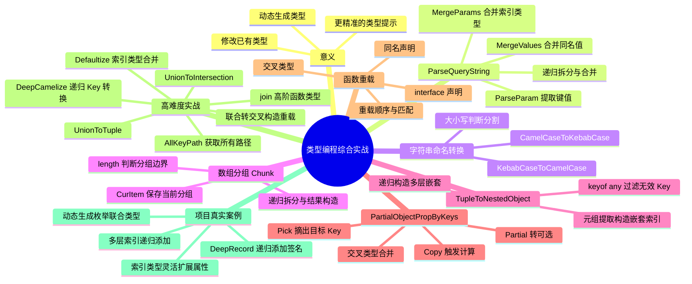
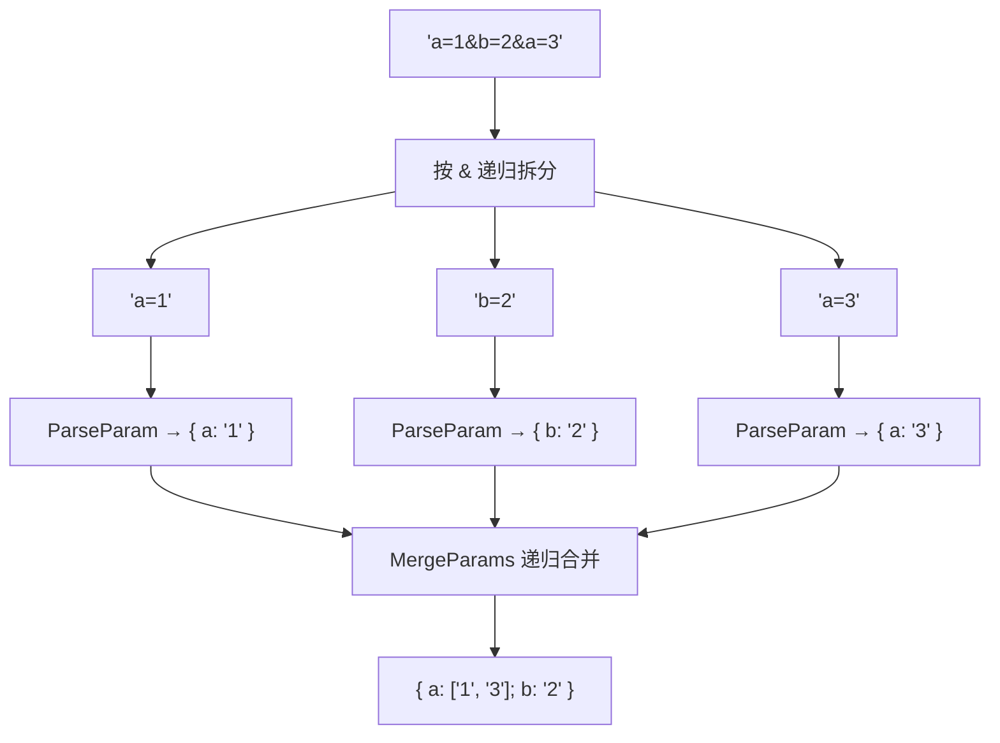

# 类型编程综合实战

> **核心概念**：类型编程的综合价值体现在三个方面——**动态生成类型**（返回值类型依赖参数类型时必须计算）、**修改已有类型**（递归为多层索引添加可扩展签名）、**提供更精准的类型提示**（将 `string` 收窄为具体的字面量类型）。本章通过 ParseQueryString、字符串命名风格转换、Chunk 数组分组、TupleToNestedObject、PartialObjectPropByKeys、函数重载、UnionToTuple、join 高阶函数、DeepCamelize、AllKeyPath、Defaultize、项目真实案例等综合练习，将条件类型、infer、递归、映射类型、模板字符串等套路融会贯通。

## 知识架构



---

## 本章概览

条件类型、infer 模式匹配、递归、映射类型、模板字符串这些"招式"都已就位，本章进入**综合实战**阶段：通过有实际业务意义的案例，将多种套路组合运用，解决真实项目中的类型问题。

**学习目标：**
- 理解类型编程的三层意义：动态生成、修改已有、精准提示
- 掌握 ParseQueryString 的完整实现思路与逐步拆分方法
- 熟练实现字符串命名风格的相互转换
- 掌握数组分组 Chunk 和元组转嵌套对象 TupleToNestedObject
- 掌握 PartialObjectPropByKeys 综合运用内置工具类型
- 理解函数重载的三种写法及其在高级类型中的应用
- 掌握 UnionToTuple 的核心技巧——联合转交叉构造重载
- 掌握 join 高阶函数、DeepCamelize、AllKeyPath、Defaultize 等高难度类型
- 能在项目中识别并解决索引类型扩展、动态类型生成等实际问题

---

## 一、类型编程的意义

### 1.1 动态生成类型

当返回值的类型与参数类型存在关联关系时，必须通过类型编程来"计算"出返回值类型。典型场景如 `Promise.all`、`Promise.race` 和柯里化函数。

```typescript
// Promise.all / Promise.race：返回值类型由参数的 Promise value 类型决定
// （节选自 lib.es2015.promise.d.ts）
interface PromiseConstructor {
  all<T extends readonly unknown[] | []>(
    values: T
  ): Promise<{
    -readonly [P in keyof T]: Awaited<T[P]>; // 提取每个 Promise 的 value 类型
  }>;

  race<T extends readonly unknown[] | []>(
    values: T
  ): Promise<Awaited<T[number]>>; // T[number] 取出所有元素类型的联合
}
```

⚠️ **类型参数约束 `unknown[] | []` 的含义**：`[]` 是为了兼容 `as const` 推导出的 `readonly` 元组类型。不加 `as const` 时推导为基础类型，加上后推导为字面量类型且带 `readonly` 修饰。

```typescript
// 柯里化函数：返回值类型由参数类型递归构造
type CurriedFunc<Params, Return> =
  Params extends [infer Arg, ...infer Rest]
    ? (arg: Arg) => CurriedFunc<Rest, Return>
    : Return;

declare function currying<Func>(fn: Func):
  Func extends (...args: infer Params) => infer Result
    ? CurriedFunc<Params, Result>
    : never;

// 使用：函数参数被逐个拆分为单参函数
const func = (a: string, b: number, c: boolean) => {};
const curried = currying(func);
// curried: (arg: string) => (arg: number) => (arg: boolean) => void
```

### 1.2 对已有类型做修改

当需要对已有类型进行扩展、裁剪或深层修改时，类型编程可以避免手动重复定义。

```typescript
// 给任意层级的索引类型每层加上可索引签名
type DeepRecord<Obj extends Record<string, any>> = {
  [Key in keyof Obj]:
    Obj[Key] extends Record<string, any>
      ? DeepRecord<Obj[Key]> & Record<string, any>  // 递归处理子层级
      : Obj[Key]
} & Record<string, any>;  // 每层都加上可扩展签名
```

### 1.3 提供更精准的类型提示

不用类型编程时，函数返回值可能是 `object` 或 `Record<string, any>`，无法提示具体有哪些属性。用类型编程后，可以推导出精确的字面量类型。

| 方式 | 返回值类型 | 类型提示 |
|------|-----------|----------|
| 不用类型编程 | `Record<string, any>` | 无法提示属性名 |
| 用类型编程 | `{ a: "1"; b: "2"; c: "3" }` | 精确提示每个属性及其值类型 |

---

## 二、ParseQueryString 综合案例

这是一个综合运用**提取、构造、递归**套路的经典案例。目标是将查询字符串 `"a=1&b=2&c=3"` 解析为精确的索引类型 `{ a: "1"; b: "2"; c: "3" }`。

### 2.1 思路分析

整体思路分三步：

1. **拆分**：按 `&` 将字符串递归拆分为单个参数片段
2. **解析**：对每个片段按 `=` 提取 key 和 value，构造成索引类型
3. **合并**：将多个索引类型合并，处理同名参数的情况



### 2.2 逐步实现

**第一步：ParseParam —— 解析单个参数片段**

```typescript
// 将 "a=1" 解析为 { a: "1" }
type ParseParam<Param extends string> =
  Param extends `${infer Key}=${infer Value}`
    ? { [K in Key]: Value }
    : Record<string, any>;  // 无法提取时返回可索引类型，避免取任何属性都报错
```

⚠️ 当传入的不是字面量类型而是 `string` 时，模式匹配会失败走到 else 分支。如果返回 `{}`，取其任何属性都会报错；返回 `Record<string, any>` 则更安全。

**第二步：MergeValues —— 合并同名参数的值**

```typescript
// 同名参数合并：单个值 → 数组
type MergeValues<One, Other> =
  One extends Other
    ? One                                    // 类型相同，直接返回
    : Other extends unknown[]
      ? [One, ...Other]                      // 已有值是数组，追加到数组
      : [One, Other];                        // 已有值不是数组，构造数组
```

**第三步：MergeParams —— 合并两个索引类型**

```typescript
type MergeParams<
  OneParam extends Record<string, any>,
  OtherParam extends Record<string, any>
> = {
  readonly [Key in keyof OneParam | keyof OtherParam]:
    Key extends keyof OneParam
      ? Key extends keyof OtherParam
        ? MergeValues<OneParam[Key], OtherParam[Key]>  // 两者都有，合并值
        : OneParam[Key]                                 // 仅 OneParam 有
      : Key extends keyof OtherParam
        ? OtherParam[Key]                               // 仅 OtherParam 有
        : never
};
```

**第四步：ParseQueryString —— 递归拆分与合并**

```typescript
type ParseQueryString<Str extends string> =
  Str extends `${infer Param}&${infer Rest}`
    ? MergeParams<ParseParam<Param>, ParseQueryString<Rest>>  // 拆分后递归
    : ParseParam<Str>;                                         // 最后一个参数

// 使用函数重载声明类型，实现精准提示
function parseQueryString<Str extends string>(queryStr: Str): ParseQueryString<Str>;
function parseQueryString(queryStr: string) {
  if (!queryStr || !queryStr.length) return {};
  const queryObj: Record<string, any> = {};
  const items = queryStr.split('&');
  items.forEach(item => {
    const [key, value] = item.split('=');
    if (queryObj[key]) {
      if (Array.isArray(queryObj[key])) {
        queryObj[key].push(value);
      } else {
        queryObj[key] = [queryObj[key], value];
      }
    } else {
      queryObj[key] = value;
    }
  });
  return queryObj;
}

// 验证：返回类型精确提示出每个属性
const res = parseQueryString('a=1&b=2&c=3');
// res 的类型: { readonly a: "1"; readonly b: "2"; readonly c: "3" }
```

⚠️ **必须通过函数重载声明类型**，否则返回值可能和 `ParseQueryString<Str>` 的返回值类型匹配不上，需要 `as any` 才行。

---

## 三、字符串命名风格转换

### 3.1 KebabCaseToCamelCase

将 `aaa-bbb-ccc`（中划线分隔）转换为 `aaaBbbCcc`（驼峰命名）。核心是**提取 + 构造 + 递归**。

```typescript
// 中划线风格 → 驼峰风格
type KebabCaseToCamelCase<Str extends string> =
  Str extends `${infer Item}-${infer Rest}`
    ? `${Item}${KebabCaseToCamelCase<Capitalize<Rest>>}`
    // 提取 - 前的部分，后面首字母大写后递归处理
    : Str;

// 验证
type Result1 = KebabCaseToCamelCase<'guang-and-dong'>;
// "guangAndDong"
```

**实现要点**：
- 模式匹配提取 `-` 前后的 `Item` 和 `Rest`
- 第一个单词不大写，后续单词通过 `Capitalize<Rest>` 首字母大写
- 递归处理直到不包含 `-`

### 3.2 CamelCaseToKebabCase

将 `aaaBbbCcc`（驼峰命名）转换为 `aaa-bbb-ccc`（中划线分隔）。驼峰命名没有分隔符，需要**通过大小写判断分割位置**。

```typescript
// 驼峰风格 → 中划线风格
type CamelCaseToKebabCase<Str extends string> =
  Str extends `${infer First}${infer Rest}`
    ? First extends Lowercase<First>        // 当前字符是小写
      ? `${First}${CamelCaseToKebabCase<Rest>}`                  // 不转换，继续递归
      : `-${Lowercase<First>}${CamelCaseToKebabCase<Rest>}`      // 大写字母前加 -，然后转小写
    : Str;

// 验证
type Result2 = CamelCaseToKebabCase<'guangAndDong'>;
// "guang-and-dong"
```

**实现要点**：
- 逐字符提取，通过 `First extends Lowercase<First>` 判断大小写
- 大写字母是分割点，前面加 `-` 并将字母转为小写
- 小写字母直接保留，继续递归

| 转换方向 | 分割标志 | 关键内置类型 | 递归终止条件 |
|---------|---------|------------|------------|
| Kebab → Camel | `-` 中划线 | `Capitalize` | 不含 `-` |
| Camel → Kebab | 大写字母 | `Lowercase` | 字符串为空 |

---

## 四、数组分组 Chunk

对数组做分组，比如 `[1, 2, 3, 4, 5]` 的数组，每两个为 1 组，可以分为 `[1, 2]`、`[3, 4]`、`[5]` 三个 Chunk。这是对数组类型的提取和构造，元素数量不确定需要递归处理，并通过构造出的数组的 `length` 来作为 chunk 拆分的标志。

```typescript
type Chunk<
  Arr extends unknown[],
  ItemLen extends number,
  CurItem extends unknown[] = [],
  Res extends unknown[] = []
> = Arr extends [infer First, ...infer Rest]
      ? CurItem['length'] extends ItemLen
        ? Chunk<Rest, ItemLen, [First], [...Res, CurItem]>  // 当前分组已满，开启新分组
        : Chunk<Rest, ItemLen, [...CurItem, First], Res>    // 继续构造当前分组
      : [...Res, CurItem];  // 递归结束，将当前分组加入结果

// 验证
type Result = Chunk<[1, 2, 3, 4, 5], 2>;
// [[1, 2], [3, 4], [5]]
```

**实现要点**：
- 类型参数 `Arr` 为待处理的数组类型，`ItemLen` 是每个分组的长度
- `CurItem` 保存当前分组，`Res` 保存结果数组，都是默认值 `[]`
- 通过 `CurItem['length']` 判断当前分组是否达到要求长度
- 达到长度时，将 `CurItem` 加入 `Res`，开启新分组 `[First]`
- 未达到时，继续构造当前分组 `[...CurItem, First]`
- 递归结束时，将剩余的 `CurItem` 也加入结果

---

## 五、元组转嵌套对象 TupleToNestedObject

根据元组类型 `['a', 'b', 'c']` 和值的类型 `'xxx'`，构造出嵌套的索引类型：

```typescript
{
  a: {
    b: {
      c: 'xxx'
    }
  }
}
```

这是对数组类型做提取，构造索引类型，然后递归地一层层处理。

```typescript
type TupleToNestedObject<Tuple extends unknown[], Value> =
  Tuple extends [infer First, ...infer Rest]
    ? {
        [Key in First as Key extends keyof any ? Key : never]:
          Rest extends unknown[]
            ? TupleToNestedObject<Rest, Value>
            : Value
      }
    : Value;

// 验证
type Result = TupleToNestedObject<['a', 'b', 'c'], 'xxx'>;
// { a: { b: { c: 'xxx' } } }
```

**实现要点**：
- 通过模式匹配提取首个元素 `First`，剩余的放到 `Rest`
- 用 `First` 作为 Key 构造新的索引类型
- `as Key extends keyof any ? Key : never` 是重映射，过滤掉 `null`、`undefined` 等不能作为索引 key 的类型
- 如果 `Rest` 还有元素就递归构造下一层，否则返回 `Value`
- `keyof any` 动态返回索引支持的类型（`string | number | symbol` 或仅 `string`）

---

## 六、部分属性可选 PartialObjectPropByKeys

把一个索引类型的某些 Key 转为可选的，其余的 Key 不变。综合运用 `Pick`、`Omit`、`Partial`、`Extract`、`Exclude` 等内置高级类型。

```typescript
interface Dong {
  name: string;
  age: number;
  address: string;
}

// 把 name 和 age 变为可选后：
interface Dong2 {
  name?: string;
  age?: number;
  address: string;
}
```

**思路**：
1. 把目标 Key 摘出来构造新的索引类型
2. 把剩余 Key 摘出来构造另一个索引类型
3. 第一个转为 `Partial`，第二个不变，取交叉类型

```typescript
// 交叉类型不会立即计算，需要映射类型触发
type Copy<Obj extends Record<string, any>> = {
  [Key in keyof Obj]: Obj[Key];
};

type PartialObjectPropByKeys<
  Obj extends Record<string, any>,
  Key extends keyof any = keyof Obj
> = Copy<Partial<Pick<Obj, Extract<keyof Obj, Key>>> & Omit<Obj, Key>>;

// 验证
interface Obj {
  name: string;
  age: number;
  address: string;
}

type Result = PartialObjectPropByKeys<Obj, 'name' | 'age'>;
// { name?: string; age?: number; address: string }
```

**实现要点**：
- `Extract<keyof Obj, Key>` 从 Obj 的所有索引里取出 Key 对应的索引，过滤掉 Obj 没有的索引
- `Partial<Pick<Obj, ...>>` 把目标 Key 的属性转为可选
- `Omit<Obj, Key>` 保留剩余 Key 的属性不变
- 交叉类型合并两部分，`Copy` 触发类型计算

---

## 七、函数重载的三种写法

TypeScript 支持函数重载，同名函数可以有多种类型定义。共有三种写法：

### 7.1 同名声明

最常用的写法，声明多个同名函数类型：

```typescript
// 声明多个同名函数
declare function func(name: string): string;
declare function func(name: number): number;

// 带实现的重载
function add(a: number, b: number): number;
function add(a: string, b: string): string;
function add(a: any, b: any) {
  return a + b;
}
```

### 7.2 interface 声明

函数类型可以用 interface 的方式声明，同样支持重载：

```typescript
interface Func {
  (name: string): string;
  (name: number): number;
}

declare const func: Func;
```

### 7.3 交叉类型

函数类型取交叉类型，也表示多种类型都可以，等效于函数重载：

```typescript
type Func = ((name: string) => string) & ((name: number) => number);

declare const func: Func;
```

三种写法的对比：

| 写法 | 语法形式 | 适用场景 |
|------|---------|---------|
| 同名声明 | `function f(...): T; function f(...): U;` | 带实现的函数、最直观 |
| interface | `interface F { (...): T; (...): U; }` | 需要复用函数类型时 |
| 交叉类型 | `((...) => T) & ((...) => U)` | 类型编程中动态构造重载 |

⚠️ **关键特性**：取重载函数的 `ReturnType` 返回的是**最后一个重载的返回值类型**。这个特性是实现 `UnionToTuple` 的核心基础。

⚠️ **重载匹配顺序**：重载函数的类型是从上到下依次匹配，**只要匹配到一个就应用**。设计重载时需注意顺序——更具体的类型放前面，更宽泛的类型放后面。

---

## 八、高难度类型实战

### 8.1 UnionToTuple

将联合类型 `'a' | 'b' | 'c'` 转为元组类型 `['a', 'b', 'c']`。这是类型编程中难度最高的案例之一，核心思路是利用**联合转交叉构造重载函数 + 取最后一个重载的返回值类型**。

**前置知识：联合转交叉**

```typescript
// 利用函数参数的逆变特性实现联合转交叉
type UnionToIntersection<U> =
  (U extends U ? (x: U) => unknown : never) extends (x: infer R) => unknown
    ? R
    : never;
```

**核心思路**：

1. 将联合类型的每个元素构造成函数类型（触发分布式条件类型）
2. 通过 `UnionToIntersection` 将这些函数转为交叉类型，等效于函数重载
3. 用 `ReturnType` 取重载函数的返回值，得到联合类型的**最后一个**类型
4. 用 `Exclude` 从联合类型中移除该类型，递归处理剩余部分

```typescript
// 第一步：联合转交叉 + 构造函数重载
type UnionToFuncIntersection<T> =
  UnionToIntersection<T extends any ? () => T : never>;

// 第二步：递归提取，构造元组
type UnionToTuple<T> =
  UnionToFuncIntersection<T> extends () => infer ReturnType
    ? [...UnionToTuple<Exclude<T, ReturnType>>, ReturnType]
    : [];

// 验证
type Result = UnionToTuple<'a' | 'b' | 'c'>;
// ['a', 'b', 'c']
```

**完整推导过程**：

```typescript
// 1. T = 'a' | 'b' | 'c'
// 2. T extends any 触发分布式条件类型，每个类型单独计算
//    → (() => 'a') | (() => 'b') | (() => 'c')
// 3. UnionToIntersection 转为交叉类型
//    → (() => 'a') & (() => 'b') & (() => 'c')
//    等效于函数重载
// 4. ReturnType 取最后一个重载的返回值 → 'c'
// 5. Exclude<'a' | 'b' | 'c', 'c'> → 'a' | 'b'
// 6. 递归处理 'a' | 'b'，最终构造 ['a', 'b', 'c']
```

⚠️ **联合类型的处理之所以麻烦，是因为不能直接 `infer` 取其中的某个类型**。利用取重载函数返回值类型拿到最后一个重载的返回值这个特性，把联合类型转成交叉类型来构造重载函数，再取返回值类型的方式取到最后一个类型，配合递归实现全部提取。

### 8.2 join 高阶函数类型定义

实现一个 `join` 高阶函数的精准类型定义：第一次调用传入分隔符，第二次传入多个字符串，返回 join 之后的结果。

```typescript
const res = join('-')('guang', 'and', 'dong');
// res: "guang-and-dong"
```

**类型定义**：

```typescript
// 去掉开头多余的分隔符
type RemoveFirstDelimiter<Str extends string> =
  Str extends `${infer _}${infer Rest}` ? Rest : Str;

// 递归构造 join 后的字符串
type JoinType<
  Items extends any[],
  Delimiter extends string,
  Result extends string = ''
> = Items extends [infer Cur, ...infer Rest]
      ? JoinType<Rest, Delimiter, `${Result}${Delimiter}${Cur & string}`>
      : RemoveFirstDelimiter<Result>;

// 高阶函数类型声明
declare function join<Delimiter extends string>(
  delimiter: Delimiter
): <Items extends string[]>(
  ...parts: Items
) => JoinType<Items, Delimiter>;

// 验证
const res = join('-')('guang', 'and', 'dong');
// res 的类型: "guang-and-dong"
```

**实现要点**：
- `join` 是高阶函数，第一次调用返回的函数也有类型参数 `Items`
- `JoinType` 通过模式匹配提取元组首元素，递归构造字符串
- `Cur & string` 将 `unknown` 转为 `string` 类型（模式匹配提取的元素类型为 `unknown`）
- 递归构造时每次都加上分隔符，最后用 `RemoveFirstDelimiter` 去掉开头多余的分隔符

### 8.3 DeepCamelize 递归索引类型 Key 转换

在 KebabCase 转 CamelCase 的基础上，递归地把索引类型的所有 Key 都转成 CamelCase 形式。

```typescript
// 输入
type Obj = {
  aaa_bbb: string;
  bbb_ccc: [
    { ccc_ddd: string; },
    { ddd_eee: string; eee_fff: { fff_ggg: string; } }
  ]
};

// 输出
type DeepCamelizeRes = {
  aaaBbb: string;
  bbbCcc: [{ cccDdd: string; }, { dddEee: string; eeeFff: { fffGgg: string; }; }];
};
```

```typescript
// 处理数组类型：递归处理每个元素
type CamelizeArr<Arr> = Arr extends [infer First, ...infer Rest]
  ? [First extends Record<string, any> ? DeepCamelize<First> : First, ...CamelizeArr<Rest>]
  : [];

// 递归处理索引类型的 Key 转换
type DeepCamelize<Obj extends Record<string, any>> =
  Obj extends unknown[]
    ? CamelizeArr<Obj>
    : {
        [Key in keyof Obj
          as Key extends `${infer First}_${infer Rest}`
            ? `${First}${Capitalize<Rest>}`
            : Key
        ]: DeepCamelize<Obj[Key]>
      };

// 验证
type Obj = {
  aaa_bbb: string;
  bbb_ccc: [
    { ccc_ddd: string; },
    { ddd_eee: string; eee_fff: { fff_ggg: string; } }
  ]
};

type Result = DeepCamelize<Obj>;
// Key 全部转为 CamelCase，嵌套层级递归处理
```

**实现要点**：
- 先判断是否为数组类型，是则用 `CamelizeArr` 递归处理每个元素
- `CamelizeArr` 中先用 `First extends Record<string, any>` 守卫，非索引类型原样保留，才能满足 `DeepCamelize` 的约束
- 索引类型用映射类型 + `as` 重映射转换 Key
- `Key extends `${infer First}_${infer Rest}`` 提取 `_` 前后部分，构造 `${First}${Capitalize<Rest>}`
- 值的类型 `Obj[Key]` 递归调用 `DeepCamelize` 处理嵌套层级

### 8.4 AllKeyPath 获取所有 Key 路径

获取一个索引类型的所有 key 的路径，包括嵌套层级的路径。

```typescript
// 输入
type Obj = {
  a: {
    b: { b1: string; b2: string; }
    c: { c1: string; c2: string; }
  }
};

// 期望输出
// 'a' | 'a.b' | 'a.b.b1' | 'a.b.b2' | 'a.c' | 'a.c.c1' | 'a.c.c2'
```

```typescript
type AllKeyPath<Obj extends Record<string, any>> = {
  [Key in keyof Obj]:
    Key extends string
      ? Obj[Key] extends Record<string, any>
        ? Key | `${Key}.${AllKeyPath<Obj[Key]>}`
        : Key
      : never
}[keyof Obj];

// 验证
type Obj = {
  a: {
    b: { b1: string; b2: string; }
    c: { c1: string; c2: string; }
  }
};

type Result = AllKeyPath<Obj>;
// 'a' | 'a.b' | 'a.b.b1' | 'a.b.b2' | 'a.c' | 'a.c.c1' | 'a.c.c2'
```

**实现要点**：
- 用映射类型遍历 Key，在 value 部分根据每个 Key 构造以它为开头的 path
- `Key extends string` 将 `Key` 从 `unknown` 收窄为 `string`，才能用于模板字符串
- 如果 `Obj[Key]` 仍是索引类型，递归构造 `${Key}.${AllKeyPath<Obj[Key]>}`，否则返回当前 `Key`
- `[keyof Obj]` 取所有 value 的联合类型，得到最终结果

### 8.5 Defaultize 合并两个索引类型

对 A、B 两个索引类型做合并：只有 A 中有的不变，A、B 都有的变为可选，只有 B 中有的也变为可选。

```typescript
// A = { aaa: string; bbb: number }
// B = { bbb: number; ccc: boolean }
// 结果 = { aaa: string; bbb?: number; ccc?: boolean }
```

**思路**：索引类型处理可以 Pick 出每一部分单独处理，最后取交叉类型合并。

```typescript
type Defaultize<A, B> =
  & Pick<A, Exclude<keyof A, keyof B>>           // 只有 A 有的，不变
  & Partial<Pick<A, Extract<keyof A, keyof B>>>   // A、B 都有的，变可选
  & Partial<Pick<B, Exclude<keyof B, keyof A>>>;  // 只有 B 有的，变可选

// 验证
type A = { aaa: string; bbb: number };
type B = { bbb: number; ccc: boolean };

type Result = Defaultize<A, B>;
// { aaa: string; bbb?: number; ccc?: boolean }
```

**实现要点**：
- `Pick<A, Exclude<keyof A, keyof B>>` 取出只有 A 有的部分，保持不变
- `Partial<Pick<A, Extract<keyof A, keyof B>>>` 取出 A、B 都有的部分，转为可选
- `Partial<Pick<B, Exclude<keyof B, keyof A>>>` 取出只有 B 有的部分，转为可选
- 三部分取交叉类型合并到一起
- 如果交叉类型未立即计算，可用 `Copy` 映射类型触发计算

⚠️ **处理索引类型的常用套路**：Pick 出每一部分单独做处理，最后取交叉类型把结果合并到一起。

---

## 九、项目真实案例

### 9.1 索引类型灵活扩展属性

**问题**：项目中定义了接口返回数据的类型，但需要在每层灵活扩展额外属性。

```typescript
// 原始类型：不允许添加额外属性
interface Response {
  name: string;
  age: number;
  address: {
    city: string;
    street: string;
  };
}

// 添加可索引签名，允许扩展
interface ResponseExt {
  name: string;
  age: number;
  address: {
    city: string;
    street: string;
  };
  [key: string]: any;  // 可索引签名，允许添加任意 string key 的属性
}

// 或用交叉类型：与 Record<string, any> 取交叉
type ResponseExt2 = Response & Record<string, any>;
```

### 9.2 多层索引类型递归添加

单层可以用可索引签名或交叉 `Record<string, any>`，但多层类型需要递归处理每一层。

```typescript
// 递归为每一层都加上 Record<string, any>
type DeepRecord<Obj extends Record<string, any>> = {
  [Key in keyof Obj]:
    Obj[Key] extends Record<string, any>
      ? DeepRecord<Obj[Key]> & Record<string, any>  // 子层级递归 + 加签名
      : Obj[Key]                                     // 非索引类型直接返回
} & Record<string, any>;  // 当前层加签名

// 验证
type Original = {
  name: string;
  address: {
    city: string;
    detail: {
      street: string;
    };
  };
};

type Extensible = DeepRecord<Original>;
// 每层都可以添加额外属性，且已有属性仍保留类型检查
```

⚠️ **可索引签名让索引类型扩展任意数量的符合签名的索引，如果想给任意层级的索引每层都加上可索引签名就要递归处理。** 不用类型编程就需要手动重写整个索引类型、逐层添加签名，既繁琐又不通用。

### 9.3 动态生成枚举联合类型

**问题**：需要定义一个类型——当某个属性为 `'desc' | 'asc'` 时，其他属性都为 `false`。手动枚举所有组合在属性多时极难维护。

```typescript
// 手动枚举：属性越多，组合爆炸
type SortType1 = { a: 'desc' | 'asc'; b: false; c: false }
               | { a: false; b: 'desc' | 'asc'; c: false }
               | { a: false; b: false; c: 'desc' | 'asc' };
```

用类型编程动态生成：

```typescript
// 动态生成：任意数量的属性都能自动处理
type GenerateType<Keys extends keyof any> = {
  [Key in Keys]: {
    [Key2 in Key]: 'desc' | 'asc'        // 当前 key 为排序值
  } & {
    [Key3 in Exclude<Keys, Key>]: false   // 其余 key 为 false
  }
}[Keys];  // 取所有 value 的联合类型

// 验证
type SortType = GenerateType<'a' | 'b' | 'c'>;
// { a: 'desc' | 'asc'; b: false; c: false }
// | { a: false; b: 'desc' | 'asc'; c: false }
// | { a: false; b: false; c: 'desc' | 'asc' }

// 更多的属性也自动生成
type SortType4 = GenerateType<'a' | 'b' | 'c' | 'd'>;
// 自动生成 4 种组合
```

⚠️ **`keyof any` 比 `string` 更好**：`keyof any` 动态返回索引支持的类型（默认 `string | number | symbol`，开启 `keyofStringsOnly` 后为 `string`），比写死 `string` 更灵活。

| 方式 | 维护成本 | 可扩展性 | 通用性 |
|------|---------|---------|--------|
| 手动枚举 | 每加一个属性需手动增加组合 | 差 | 无 |
| 类型编程生成 | 零维护，自动生成 | 任意属性数 | 高 |

---

## ⚠️ 实战注意事项

| 注意事项 | 描述 | 建议 |
|---------|------|------|
| **函数重载与类型编程配合** | 类型编程生成的返回值类型可能与实现不匹配 | 使用函数重载声明类型，避免 `as any` |
| **重载声明顺序** | 重载函数从上到下依次匹配，匹配到即应用 | 更具体的类型放前面，宽泛类型放后面 |
| **`as const` 与 `readonly`** | `as const` 推导出 `readonly` 字面量类型，可能不匹配 `unknown[]` | 类型参数约束加 `readonly`，或用 `Mutable` 工具类型去掉 `readonly` |
| **模式匹配失败时的兜底** | 传入非字面量类型时模式匹配失败 | 返回 `Record<string, any>` 而非 `{}`，避免取属性报错 |
| **交叉类型不立即计算** | `A & B` 形式的交叉类型不会立即展开 | 用映射类型 `Copy<Obj>` 包一层触发计算 |
| **递归深度限制** | TypeScript 递归类型有深度限制 | 实际使用中控制递归层数，避免栈溢出 |
| **类型编程 vs 手动维护** | 并非所有场景都需要类型编程 | 类型关联必须用；精准提示可选但推荐；简单类型手动声明即可 |

**去除 readonly 修饰的工具类型**：

```typescript
// 内置的 Readonly 只能加修饰，没有提供去除的工具类型
type Mutable<Obj> = {
  -readonly [Key in keyof Obj]: Obj[Key];  // -readonly 去除只读修饰
};
```

**触发交叉类型计算的工具类型**：

```typescript
// 交叉类型不会被立即计算，需要映射类型触发
type Copy<Obj extends Record<string, any>> = {
  [Key in keyof Obj]: Obj[Key];
};

// 示例：Partial + Omit 的交叉类型需要 Copy 才能展开
type PartialObjectPropByKeys<
  Obj extends Record<string, any>,
  Key extends keyof any = keyof Obj
> = Copy<Partial<Pick<Obj, Extract<keyof Obj, Key>>> & Omit<Obj, Key>>;
```

---

## 🔗 延伸阅读

- [条件类型与 infer](01-条件类型与%20infer.md) — 类型编程的核心控制流与模式匹配
- [内置工具类型基础](02-内置工具类型基础.md) — Partial、Pick、Omit、Record 等标准工具类型
- [内置工具类型进阶](03-内置工具类型进阶.md) — Extract、Exclude、Awaited 等深层工具类型
- [模板字符串类型](04-模板字符串类型.md) — 类型层面的字符串操作基础
- [模板字符串工具类型进阶](05-模板字符串工具类型进阶.md) — 字符串类型的高级构造与转换
- [类型编程实践](06-类型编程实践.md) — 类型编程的边界、权衡与实战模式
