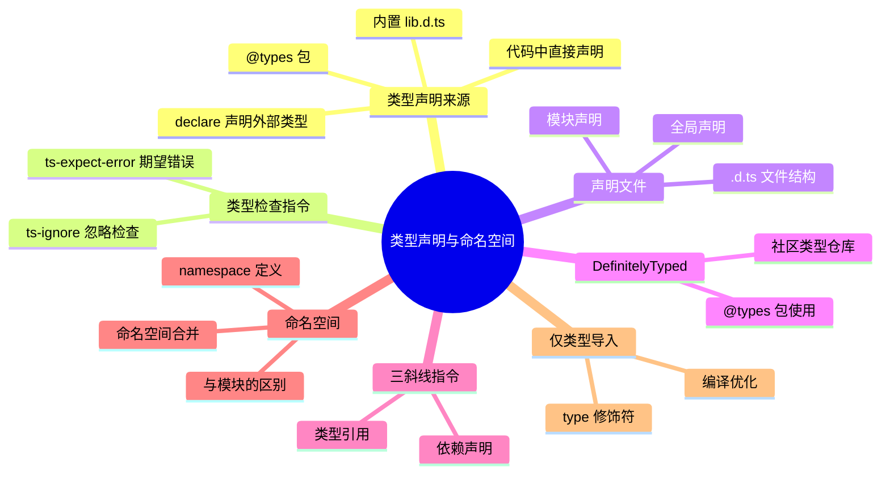

# 类型声明与命名空间

## 知识架构



我们已经结束了 TypeScript 类型能力的学习，这一节将进入 TypeScript 的实战应用篇。实战篇主要包括了工程能力、框架集成、ECMAScript 语法、TSConfig 解析以及 Node API 开发这五个部分。

在这一节，我们主要介绍 TypeScript 的工程能力基础，包括类型指令、类型声明、命名空间这么几个部分。这些概念不仅可以帮助你了解到 TypeScript 工程能力的核心理念，也是接下来实战篇内容的前置基础。

## 本章概要

本章将系统讲解 TypeScript 工程化实践中的核心概念：

- **类型检查指令**：快速处理类型错误的临时方案
- **类型声明文件**：为 JavaScript 代码补充类型信息
- **DefinitelyTyped**：社区类型定义生态
- **三斜线指令**：声明文件间的依赖管理
- **命名空间**：代码组织的传统方式
- **仅类型导入**：优化编译产物

## 前置知识

学习本章前，你需要掌握以下内容：

- TypeScript 基础类型系统（原始类型、对象类型、函数类型等）
- 接口（Interface）与类型别名（Type Alias）
- 泛型的基本使用
- 模块化开发基础（ES Modules）

## 学习目标

完成本章学习后，你将能够：

1. 合理使用类型检查指令处理特殊场景
2. 为第三方库和非代码文件编写类型声明
3. 理解 DefinitelyTyped 生态的工作原理
4. 使用三斜线指令管理声明文件依赖
5. 使用命名空间组织复杂类型结构
6. 编写规范的导入语句，优化代码可维护性

---

## 类型声明的三种来源

TypeScript 中的类型声明有三种来源，理解它们有助于厘清类型从何而来。

### 1. 代码中直接声明

在 TypeScript 代码中通过 interface、type、class、enum 等语法直接声明类型：

```typescript
// interface 声明
interface User {
    name: string;
    age: number;
}

// type 声明
type ID = string | number;

// class 声明（class 既是值也是类型）
class Person {
    name: string;
    age: number;
}

// enum 声明（enum 既是值也是类型）
enum Direction {
    Up,
    Down,
    Left,
    Right
}
```

### 2. declare 声明外部类型

对于没有 TypeScript 代码的第三方库或全局变量，使用 `declare` 关键字声明类型：

```typescript
// 声明全局变量
declare var jQuery: (selector: string) => HTMLElement;

// 声明全局函数
declare function greet(name: string): void;

// 声明全局类
declare class Animal {
    name: string;
    constructor(name: string);
    speak(): void;
}

// 声明模块
declare module 'lodash' {
    export function debounce<T extends (...args: any[]) => any>(
        func: T,
        wait?: number
    ): T;
}

// 声明文件（.d.ts）
// 如 jquery.d.ts
declare module 'jquery' {
    export default function jQuery(selector: string): HTMLElement;
}
```

### 3. @types 包

DefinitelyTyped 社区维护了海量第三方库的类型声明包，统一以 `@types/` 为前缀发布到 npm：

```bash
# 安装 jQuery 的类型声明
npm install @types/jquery --save-dev

# 安装 Node.js 的类型声明
npm install @types/node --save-dev

# 安装 Express 的类型声明
npm install @types/express --save-dev
```

> 💡 TypeScript 会自动从 `node_modules/@types/` 目录加载类型声明包，无需手动配置引用。可通过 `tsconfig.json` 的 `typeRoots` 和 `types` 字段自定义加载行为。

### TypeScript 内置类型声明

⚠️ TypeScript 自身也内置了 JavaScript 标准 API 的类型声明（`lib.d.ts`），随 TypeScript 版本更新：

```json
// tsconfig.json 中可配置加载哪些内置声明
{
    "compilerOptions": {
        "lib": ["ES2020", "DOM"],  // 加载 ES2020 + DOM API 类型
        // 不设置 lib 时，target 为 ES5 则默认加载 ES5 + DOM
        // target 为 ES6+ 则默认加载对应版本 + DOM
    }
}
```

| 来源 | 适用场景 | 示例 |
|------|---------|------|
| **代码中声明** | 自己的 TypeScript 代码 | `interface User {}` |
| **declare 声明** | 全局变量、未提供类型的 JS 库 | `declare var $: any` |
| **@types 包** | 有社区维护类型的第三方库 | `npm i @types/lodash` |
| **内置 lib.d.ts** | JavaScript 标准 API | `Array.prototype.map` 的类型 |

---

## 类型检查指令

在前端世界的许多工具中，其实都提供了 **行内注释（Inline Comments）** 的能力，用于支持在某一处特定代码**使用特殊的配置来覆盖掉全局配置**。最常见的即是 ESLint 与 Prettier 提供的禁用检查能力，如 `/* eslint-disable-next-line */`、`<!-- prettier-ignore -->` 等。TypeScript 中同样提供了数个行内注释（这里我们称为类型指令），来进行单行代码或单文件级别的配置能力。这些指令均以 `// @ts-` 开头 ，我们依次来介绍。

### 指令总览

TypeScript 提供了以下四种类型检查指令：

| 指令               | 作用范围 | 使用场景               | 风险等级 |
| ------------------ | -------- | ---------------------- | -------- |
| `@ts-ignore`       | 单行     | 禁用下一行的类型检查   | ⚠️ 高    |
| `@ts-expect-error` | 单行     | 期望下一行有类型错误   | ✅ 低    |
| `@ts-check`        | 整个文件 | 为 JS 文件启用类型检查 | ✅ 低    |
| `@ts-nocheck`      | 整个文件 | 禁用整个文件的类型检查 | ⚠️ 高    |

> **最佳实践**：优先使用 `@ts-expect-error` 而非 `@ts-ignore`，优先使用 `@ts-check` 而非 `@ts-nocheck`。

### ts-ignore 与 ts-expect-error

`ts-ignore` 应该是使用最为广泛的一个类型指令了，它的作用就是直接禁用掉对下一行代码的类型检查：

```typescript
// @ts-ignore
const name: string = 599
```

基本上所有的类型报错都可以通过这个指令来解决，但由于它本质是上 ignore 而不是 disable，也就意味着如果下一行代码并没有问题，那使用 ignore 反而就是一个错误了。因此 TypeScript 随后又引入了一个更严格版本的 ignore，即 `ts-expect-error`，它只有在**下一行代码真的存在错误时**才能被使用，否则它会给出一个错误：

```typescript
// @ts-expect-error
const name: string = 599

// @ts-expect-error 错误使用此指令，报错
const age: number = 599
```

在这里第二个 expect-error 指令会给出一个报错：**无意义的 expect-error 指令**。

#### 两者的区别对比

```typescript
// 场景：实际存在类型错误
// @ts-ignore       ✅ 正常工作，错误被忽略
// @ts-expect-error ✅ 正常工作，错误被忽略
const wrong: string = 123

// 场景：不存在类型错误
// @ts-ignore       ✅ 正常工作（但这是危险的）
// @ts-expect-error ❌ 报错：无意义的 expect-error 指令
const correct: number = 123
```

那这两个功能相同的指令应该如何取舍？我的建议是**在所有地方都不要使用 ts-ignore**，直接把这个指令打入冷宫封存起来。原因在上面我们也说了，对于这类 ignore 指令，本来就应当确保**下一行真的存在错误时**才去使用。

### ts-check 与 ts-nocheck

这两个指令可以对整个文件生效。我们首先来看 ts-nocheck，你可以把它理解为一个作用于整个文件的 ignore 指令，使用了 ts-nocheck 指令的 TS 文件将不再接受类型检查：

```typescript
// @ts-nocheck 以下代码均不会抛出错误
const name: string = 599
const age: number = "linbudu"
```

那么 `ts-check` 呢？这看起来是一个多余的指令，因为默认情况下 TS 文件不是就会被检查吗？实际上，这两个指令还可以用在 JS 文件中。要明白这一点，首先我们要知道，TypeScript 并不是只能检查 TS 文件，对于 JS 文件它也可以通过类型推导与 JSDoc 的方式进行不完全的类型检查。

```javascript
// JavaScript 文件
let myAge = 18

// 使用 JSDoc 标注变量类型
/** @type {string} */
let myName

class Foo {
  prop = 599
}
```

在上面的代码中，声明了初始值的 myAge 与 `Foo.prop` 都能被推导出其类型，而无初始值的 myName 也可以通过 JSDoc 标注的方式来显式地标注类型。

但我们知道 JavaScript 是弱类型语言，表现之一即是变量可以**被赋值为与初始值类型不一致的值**，比如上面的例子进一步改写：

```javascript
let myAge = 18
myAge = "90" // 与初始值类型不同

/** @type {string} */
let myName
myName = 599 // 与 JSDoc 标注类型不同
```

我们的赋值操作在类型层面显然是不成立的，但我们是在 JavaScript 文件中，因此这里并不会有类型报错。如果希望在 JS 文件中也能享受到类型检查，此时 `ts-check` 指令就可以登场了：

```javascript
// @ts-check
/** @type {string} */
const myName = 599 // 报错！

let myAge = 18
myAge = "200" // 报错！
```

这里我们的 `ts-check` 指令为 JavaScript 文件也带来了类型检查，而我们同时还可以使用 `ts-expect-error` 指令来忽略掉单行的代码检查：

```javascript
// @ts-check
/** @type {string} */
// @ts-expect-error
const myName = 599 // OK

let myAge = 18
// @ts-expect-error
myAge = "200" // OK
```

而 `ts-nocheck` 在 JS 文件中的作用和 TS 文件其实也一致，即禁用掉对当前文件的检查。如果我们希望开启对所有 JavaScript 文件的检查，只是忽略掉其中少数呢？此时我们在 TSConfig 中启用 `checkJs` 配置，来开启**对所有包含的 JS 文件的类型检查**，然后使用 `ts-nocheck` 来忽略掉其中少数的 JS 文件。

### 使用场景与最佳实践

#### 适用场景

| 场景              | 推荐指令           | 说明                       |
| ----------------- | ------------------ | -------------------------- |
| 正在迁移 JS 到 TS | `@ts-check`        | 渐进式启用类型检查         |
| 临时绕过类型错误  | `@ts-expect-error` | 明确标记需要后续修复的问题 |
| 第三方库类型问题  | `@ts-expect-error` | 等待库更新或自行贡献类型   |
| 原型开发阶段      | `@ts-nocheck`      | 快速迭代，后续补充类型     |

#### 不推荐的做法

```typescript
// ❌ 错误：使用 ts-ignore 掩盖问题
// @ts-ignore
someFunction(wrongArgument)

// ❌ 错误：长期保留 expect-error 而不修复
// @ts-expect-error TODO: 修复这个类型问题
legacyCode()

// ✅ 正确：明确标注原因和后续计划
// @ts-expect-error 第三方库类型定义缺失，已提 issue #123
externalLibrary.untypedMethod()
```

---

## 类型声明

在此前我们其实就已经接触到了类型声明，它实际上就是 `declare` 语法。类型声明（Type Declaration）是 TypeScript 工程化的核心能力之一，用于为 JavaScript 代码补充类型信息。

### declare 关键字基础

`declare` 关键字用于告诉 TypeScript 编译器某个变量、函数、类等已经存在于全局作用域或模块中。它的主要作用是：

1. **声明全局变量**：为运行时已存在的全局变量提供类型
2. **声明模块**：为没有类型定义的第三方库提供类型支持
3. **扩展类型定义**：为已有的类型声明补充新的属性

```typescript
// 声明全局变量
declare var f1: () => void

// 声明接口
declare interface Foo {
  prop: string
}

// 声明函数
declare function foo(input: Foo): Foo

// 声明类
declare class Foo {}
```

我们可以直接访问这些声明：

```typescript
// 直接使用声明的类型
declare let otherProp: Foo["prop"]
```

但需要注意，**声明语句不能包含实际的实现或初始值**：

```typescript
// × 不允许在环境上下文中使用初始值（编译报错）
// declare let result = foo();

// √ 正确：只声明类型，不赋值
declare let result: ReturnType<typeof foo>;
```

### 类型声明文件（.d.ts）

类型声明文件是以 `.d.ts` 为扩展名的文件，它只包含类型声明，不包含实际的代码逻辑。TypeScript 会自动加载这些文件，为对应的 JavaScript 代码提供类型信息。

#### 声明文件的生成

当你的 TypeScript 代码编译时，可以自动生成对应的声明文件。在 `tsconfig.json` 中启用 `declaration` 选项：

```json
{
  "compilerOptions": {
    "declaration": true,
    "declarationMap": true,
    "outDir": "./dist"
  }
}
```

**示例：从源代码生成声明文件**

```typescript
// source.ts
const handler = (input: string): boolean => {
  return input.length > 5
}

interface Foo {
  name: string
  age: number
}

const foo: Foo = {
  name: "林不渡",
  age: 18
}

class FooCls {
  prop!: string
}
```

编译后会生成 `source.js` 和 `source.d.ts` 两个文件：

```typescript
// source.d.ts
declare const handler: (input: string) => boolean

interface Foo {
  name: string
  age: number
}

declare const foo: Foo

declare class FooCls {
  prop: string
}
```

这样，其他项目或文件在导入这段代码时，就能获得完整的类型提示。

#### 声明文件的加载位置

TypeScript 会从以下位置自动加载声明文件：

```
┌─────────────────────────────────────────────────────────────┐
│                    类型声明文件加载顺序                        │
├─────────────────────────────────────────────────────────────┤
│  1. node_modules/@types/     ← DefinitelyTyped 社区类型      │
│  2. 项目内的 .d.ts 文件       ← 自定义类型声明                │
│  3. tsconfig.json 指定文件   ← 通过 include/files 配置       │
│  4. 内置 lib.*.d.ts          ← TypeScript 内置类型           │
└─────────────────────────────────────────────────────────────┘
```

---

## 让类型定义全面覆盖你的项目

在实际开发中，我们经常会遇到以下几种类型覆盖不足的场景：

### 常见场景与解决方案

| 场景            | 问题描述                                     | 解决方案                                  |
| --------------- | -------------------------------------------- | ----------------------------------------- |
| 无类型的 npm 包 | 老旧的 npm 包没有 TypeScript 类型定义        | 使用 `declare module` 或安装 `@types/xxx` |
| 非代码文件导入  | 导入 `.css`、`.png` 等文件时类型报错         | 声明模块类型                              |
| 全局变量注入    | 运行时注入的全局变量（如 window.customProp） | 扩展全局接口                              |
| 内置类型扩展    | 需要扩展第三方库的类型定义                   | 使用声明合并                              |

这些问题都可以通过类型声明来解决，这也是它的核心能力：**通过额外的类型声明文件，在核心代码文件以外去提供对类型的进一步补全**。

### 场景一：为 npm 包声明类型

当使用没有类型定义的 npm 包时，可以通过 `declare module` 为其提供类型支持：

#### 基础用法

```typescript
// custom-declarations.d.ts
declare module "some-old-package" {
  export function handler(): boolean
  export const version: string
}

// 使用
import { handler, version } from "some-old-package"

const result = handler() // 类型为 boolean
const ver = version // 类型为 string
```

#### 带默认导出的声明

```typescript
declare module "another-package" {
  const handler: () => boolean
  export default handler
}

// 使用
import bar from "another-package"
bar() // 类型为 () => boolean
```

#### 声明模块的多种方式

**方式一：精确声明（推荐）**

```typescript
declare module "specific-package" {
  export interface Config {
    apiKey: string
    timeout?: number
  }
  export function init(config: Config): void
}
```

**方式二：宽泛声明（临时方案）**

```typescript
// 将模块声明为 any 类型，适用于快速原型开发
declare module "legacy-package"
```

> **最佳实践**：尽量避免使用宽泛声明，因为它会丢失所有类型安全性。应该优先为常用的函数和类型编写精确的声明。

### 场景二：为非代码文件声明类型

在现代前端项目中，经常会导入各种非代码文件（如图片、CSS、JSON 等），TypeScript 需要知道这些文件的类型信息。

#### 图片文件声明

```typescript
// images.d.ts
declare module "*.png" {
  const src: string
  export default src
}

declare module "*.jpg" {
  const src: string
  export default src
}

declare module "*.svg" {
  const content: string
  export default content
}

// 使用
import logo from "./logo.png"
import icon from "./icon.svg"

const img: HTMLImageElement = document.createElement("img")
img.src = logo // 类型安全
```

#### CSS/样式文件声明

```typescript
// styles.d.ts
declare module '*.css' {
  const styles: { [className: string]: string };
  export default styles;
}

declare module '*.module.css' {
  const classes: { [className: string]: string };
  export default classes;
}

declare module '*.scss' {
  const styles: { [className: string]: string };
  export default styles;
}

// 使用
import styles from './Button.module.css';
import './global.css';

<button className={styles.primary}>Click me</button>
```

#### 其他资源文件

```typescript
// assets.d.ts
declare module "*.md" {
  const content: string
  export default content
}

declare module "*.json" {
  const value: any
  export default value
}

declare module "*.txt" {
  const content: string
  export default content
}

declare module "*.pdf" {
  const url: string
  export default url
}

// 使用
import readme from "./README.md"
import config from "./config.json"
```

> **提示**：实际项目中，建议创建一个统一的 `global.d.ts` 或 `assets.d.ts` 文件来集中管理所有非代码文件的类型声明。

### 场景三：扩展全局类型定义

当需要在全局对象上添加自定义属性时（如通过 CDN 引入的库或运行时注入的变量），可以扩展 TypeScript 的内置类型定义。

#### 扩展 Window 接口

```typescript
// global.d.ts
interface Window {
  errorReporter: (error: Error) => void
  userTracker: (event: string, data?: any) => Promise<void>
  customConfig: {
    apiUrl: string
    version: string
  }
}

// 使用
window.errorReporter(new Error("Something went wrong"))
window.userTracker("click", { button: "submit" })
console.log(window.customConfig.apiUrl)
```

#### 扩展 NodeJS.Global 接口

```typescript
// global.d.ts
declare namespace NodeJS {
  interface Global {
    myGlobalVar: string
  }
}

// 使用
global.myGlobalVar = "value"
```

> **注**：`NodeJS.Global` 接口在较新版本的 `@types/node`（v20+）中已被移除，新版项目应改用 `declare global { var myGlobalVar: string }` 的方式扩展 `globalThis`。

#### 扩展第三方库的类型

```typescript
// 扩展 Express 的 Request 接口
declare module "express" {
  interface Request {
    user?: {
      id: string
      name: string
    }
  }
}

// 使用
import { Request, Response } from "express"

app.get("/profile", (req: Request, res: Response) => {
  console.log(req.user?.name)
})
```

---

## DefinitelyTyped 生态系统

### 什么是 DefinitelyTyped？

[DefinitelyTyped](https://github.com/DefinitelyTyped/DefinitelyTyped) 是 TypeScript 官方维护的类型定义仓库，专门为 JavaScript 库提供类型声明。所有以 `@types/` 为前缀的 npm 包都来自这个仓库。

### 为什么需要 @types 包？

某些 JavaScript 库没有内置 TypeScript 类型定义，原因包括：

1. **库发布时间较早**：如 jQuery、Lodash 等，当时 TypeScript 还未普及
2. **使用其他类型系统**：如 React 使用 Flow 类型系统
3. **减小包体积**：类型定义文件会增加包大小，影响 JavaScript 用户

### 常见的 @types 包

| 包名             | 说明                  |
| ---------------- | --------------------- |
| `@types/node`    | Node.js 类型定义      |
| `@types/react`   | React 类型定义        |
| `@types/lodash`  | Lodash 工具库类型定义 |
| `@types/express` | Express 框架类型定义  |
| `@types/jest`    | Jest 测试框架类型定义 |

### 自动加载机制

TypeScript 会自动加载 `node_modules/@types` 下的类型定义。你可以在 `tsconfig.json` 中配置：

```json
{
  "compilerOptions": {
    "typeRoots": ["./node_modules/@types", "./custom-types"],
    "types": ["node", "react", "jest"]
  }
}
```

- **typeRoots**：指定类型定义文件的根目录
- **types**：明确指定要加载的类型包（不设置则加载所有 @types 包）

### 类型声明的实现方式

不同库的类型声明方式有所不同：

```typescript
// @types/node - 使用 declare module
declare module "fs" {
  export function readFileSync(path: string, encoding: string): string
}

// @types/react - 使用 declare namespace
declare namespace React {
  function useState<S>(initialState: S): [S, Dispatch<SetStateAction<S>>]
}
```

---

## 三斜线指令

三斜线指令（Triple-Slash Directives）是 TypeScript 中用于声明文件间依赖关系的特殊注释语法。它们只能出现在文件的最顶部，用于告诉编译器当前文件依赖哪些其他文件。

### 语法格式

三斜线指令以 `///` 开头，常见的有以下几种：

```typescript
/// <reference path="..." />   // 引用其他声明文件
/// <reference types="..." />  // 引用 @types 包
/// <reference lib="..." />    // 引用内置库
```

### reference path 指令

`path` 指令用于声明对另一个声明文件的依赖：

```typescript
// types/utils.d.ts
interface Utils {
  format(input: string): string
}

// types/main.d.ts
/// <reference path="./utils.d.ts" />

declare const utils: Utils
```

**使用场景**：

- 手动管理多个声明文件之间的依赖
- 确保编译器按正确顺序加载文件

### reference types 指令

`types` 指令用于声明对 `@types` 包的依赖：

```typescript
/// <reference types="node" />
/// <reference types="react" />

declare function readConfig(): Buffer

declare const Component: React.FC
```

注意：三斜线指令只能出现在**文件顶部**（任何语句之前），写在文件中间的指令不会生效。

**与 tsconfig.json 中 types 配置的区别**：

| 配置方式                        | 作用范围 | 使用场景               |
| ------------------------------- | -------- | ---------------------- |
| `tsconfig.json` 中的 `types`    | 全局     | 项目级别的类型控制     |
| `/// <reference types="..." />` | 单文件   | 声明文件的精确依赖声明 |

### reference lib 指令

`lib` 指令用于引用 TypeScript 内置库：

```typescript
/// <reference lib="es2020.promise" />
/// <reference lib="dom" />

declare function asyncOperation(): Promise<void>

declare function getElement(): HTMLElement
```

### 使用注意事项

```typescript
// ❌ 错误：指令前不能有其他代码
import { Foo } from "./foo"
/// <reference path="./types.d.ts" />

// ✅ 正确：指令必须在文件最顶部
/// <reference path="./types.d.ts" />
import { Foo } from "./foo"
```

### 现代开发中的地位

```
┌─────────────────────────────────────────────────────────────┐
│                    三斜线指令使用建议                         │
├─────────────────────────────────────────────────────────────┤
│  ✅ 推荐使用场景：                                           │
│     • 编写库的类型声明文件                                    │
│     • 手动管理声明文件依赖                                    │
│     • 需要精确控制类型加载顺序                                 │
│                                                             │
│  ❌ 不推荐使用场景：                                          │
│     • 普通业务代码（使用 import/export 代替）                 │
│     • 现代 npm 包开发（package.json types 字段代替）          │
└─────────────────────────────────────────────────────────────┘
```

> **提示**：在现代 TypeScript 项目中，推荐使用 ES Modules 的 `import/export` 语法来管理依赖，三斜线指令主要用于编写 `.d.ts` 声明文件。

---

## 命名空间

命名空间（Namespace）是 TypeScript 提供的一种代码组织方式，用于将相关的类型、接口、类等组织在一起，避免全局命名冲突。虽然现代开发中更推荐使用 ES Modules，但命名空间在声明文件和某些特定场景中仍然有用。

### 基本语法

```typescript
namespace Utils {
  export function format(input: string): string {
    return input.trim().toLowerCase()
  }

  export interface Config {
    delimiter: string
  }

  export const version = "1.0.0"
}

// 使用
const formatted = Utils.format("  HELLO  ")
const config: Utils.Config = { delimiter: "," }
console.log(Utils.version)
```

### 命名空间的嵌套

命名空间支持嵌套，形成层级结构：

```typescript
namespace App {
  export namespace Models {
    export interface User {
      id: string
      name: string
    }

    export interface Product {
      id: string
      price: number
    }
  }

  export namespace Services {
    export function fetchUser(id: string): Models.User {
      return { id, name: "Unknown" }
    }
  }
}

// 使用
const user: App.Models.User = App.Services.fetchUser("123")
```

### 命名空间与声明文件

命名空间在声明文件中广泛使用，用于组织类型定义：

```typescript
// jquery.d.ts
declare namespace JQuery {
  interface Ajax {
    url: string
    method: string
    data?: any
  }

  interface Event {
    type: string
    target: HTMLElement
  }
}

declare const $: {
  ajax(options: JQuery.Ajax): Promise<any>
  (selector: string): {
    on(event: string, handler: (e: JQuery.Event) => void): void
  }
}
```

### 命名空间的编译产物

理解 namespace 的最佳方式是看编译后的代码。namespace 编译后就是在全局对象上挂载属性：

```typescript
// 源码
namespace Guang {
    export interface Person {
        name: string;
        age?: number;
    }

    const name = 'guang';
    const age = 20;

    export const guang: Person = {
        name,
        age
    }
    export function add(a: number, b: number): number {
        return a + b;
    }
}

// 编译产物
var Guang;
(function (Guang) {
    const name = 'guang';
    const age = 20;
    Guang.guang = { name: name, age: age };
    function add(a, b) { return a + b; }
    Guang.add = add;
})(Guang || (Guang = {}));
```

可以看到，namespace 就是把所有 `export` 的成员挂到一个全局对象上，而未导出的成员（如这里的 `name`、`age`）仍然只是 IIFE 内部的局部变量。

### module 关键字

TypeScript 还支持 `module` 关键字来声明 CommonJS 模块，常见于 `@types/node` 等类型声明中：

```typescript
// @types/node 中的典型用法
declare module 'fs' {
    export function readFileSync(path: string, encoding: string): string;
    export function writeFileSync(path: string, data: string): void;
}

declare module 'path' {
    export function join(...paths: string[]): string;
    export function resolve(...pathSegments: string[]): string;
}
```

`module` 和 `namespace` 在 AST 层面是完全相同的结构，区别仅在于 `module` 后面一般接模块路径字符串，而 `namespace` 后面接命名空间名字。两者的语法和功能本质上是同一种东西。

### 全局类型声明 vs 模块类型声明

在 `.d.ts` 声明文件中，一个关键规则决定了类型声明的作用域：

**如果 `.d.ts` 文件中没有任何 `import` 或 `export` 语法，则所有类型声明都是全局的；否则，所有类型声明都被视为模块内的，不再是全局可用。**

```typescript
// global.d.ts —— 无 import/export，所有声明都是全局的
declare function greet(name: string): void;
declare const version: string;
// 在项目任何文件中都可以直接使用 greet 和 version

// module.d.ts —— 有 import/export，声明变成模块内的
import { Something } from './types';
declare function process(input: Something): void;
// process 不再是全局的，必须显式导出或 declare global
```

当需要在含有 `import`/`export` 的声明文件中声明全局类型时，需要使用 `declare global`：

```typescript
// global-with-import.d.ts
import { Request } from 'express';

declare global {
    // 这些类型在全局可用
    interface Window {
        customConfig: Record<string, unknown>;
    }
    function debug(message: string): void;
}

// 模块内部的类型
declare module 'express' {
    interface Request {
        userId?: string;
    }
}
```

此外，使用 `/// <reference types="..." />` 三斜线指令引入其他类型声明文件时，不会导致当前文件的类型声明变为模块内的，这比直接使用 `import` 更安全：

```typescript
// 推荐方式：引入类型声明但保持全局
/// <reference types="node" />

declare function readFile(path: string): Buffer;
// readFile 仍然是全局的

// 不推荐：import 会导致类型声明变为模块内的
// import { Buffer } from 'buffer';  // 这会让所有声明变为模块内的
```

### 命名空间与模块的对比

| 特性         | 命名空间         | ES Modules    |
| ------------ | ---------------- | ------------- |
| 文件作用域   | 跨文件共享       | 每个文件独立  |
| 依赖管理     | 三斜线指令       | import/export |
| Tree-shaking | 不支持           | 支持          |
| 运行时支持   | 需要编译         | 原生支持      |
| 适用场景     | 声明文件、全局库 | 现代应用开发  |

### 跨文件命名空间

命名空间可以跨多个文件拆分：

```typescript
// utils/string.ts
namespace Utils {
  export function trim(input: string): string {
    return input.trim()
  }
}

// utils/number.ts
namespace Utils {
  export function round(input: number): number {
    return Math.round(input)
  }
}

// main.ts
/// <reference path="utils/string.ts" />
/// <reference path="utils/number.ts" />

Utils.trim("  hello  ")
Utils.round(3.14)
```

### declare namespace

`declare namespace` 用于声明全局命名空间，常用于类型声明文件：

```typescript
// global.d.ts
declare namespace NodeJS {
  interface ProcessEnv {
    NODE_ENV: "development" | "production"
    API_URL: string
  }
}

// 使用
const env = process.env.NODE_ENV
const apiUrl = process.env.API_URL
```

### 最佳实践

```typescript
// ✅ 推荐：在声明文件中使用命名空间
declare namespace MyLibrary {
  interface Options {
    debug: boolean
  }
}

// ✅ 推荐：为全局库声明命名空间
declare namespace $ {
  function ajax(options: any): void
}

// ❌ 不推荐：在应用代码中使用命名空间（使用 ES Modules 代替）
namespace App {
  export const config = {}
}

// ✅ 推荐：使用 ES Modules
export const config = {}
```

---

## 仅类型导入

TypeScript 3.8 引入了 `type` 修饰符，用于明确标识仅用于类型标注的导入。这有助于编译器在编译时移除这些导入，优化生成的 JavaScript 代码。

### 基本语法

```typescript
// 仅导入类型
import type { User, Config } from "./types"

// 混合导入：值和类型
import { format, type User } from "./utils"

// 仅导入类型（默认导出）
import type MyType from "./types"
```

### 使用场景

#### 场景一：纯类型导入

```typescript
// types.ts
export interface User {
  id: string
  name: string
}

export function createUser(name: string): User {
  return { id: crypto.randomUUID(), name }
}

// main.ts
import type { User } from "./types"

function greet(user: User): string {
  return `Hello, ${user.name}!`
}
```

编译后的 JavaScript：

```javascript
// main.js - type 导入被完全移除
function greet(user) {
  return `Hello, ${user.name}!`
}
```

#### 场景二：混合导入

```typescript
import { createUser, type User } from "./types"

const user: User = createUser("Alice")
```

编译后：

```javascript
import { createUser } from "./types"

const user = createUser("Alice")
```

### type 导入与普通导入的区别

```typescript
// ❌ 错误：type 导入不能作为值使用
import type { User } from "./types"
const user = User // Error: 'User' is a type and cannot be used as a value

// ✅ 正确：type 导入仅用于类型标注
import type { User } from "./types"
function process(user: User): void {}

// ✅ 正确：普通导入可以同时用于类型和值
import { User } from "./types"
const u: User = { id: "1", name: "Test" }
```

### 导出类型

同样，`export type` 用于导出纯类型：

```typescript
// types.ts
export type UserID = string

export interface User {
  id: UserID
  name: string
}

export type { User as UserType }
```

### 重导出类型

```typescript
// barrel.ts
export type { User, Config } from "./types"
export type { default as UserService } from "./service"
```

### 内联类型导入

TypeScript 4.5 支持在内联类型导入中使用 `type`：

```typescript
let config: import("./types").Config

function process(user: import("./types").User): void {}
```

### 对编译产物的影响

```
┌─────────────────────────────────────────────────────────────┐
│                    编译产物对比                              │
├─────────────────────────────────────────────────────────────┤
│  源代码：                                                    │
│  import { User, createUser } from './types';               │
│                                                             │
│  编译后：                                                    │
│  import { User, createUser } from './types';               │
│  （User 可能被保留，因为无法确定是否仅用于类型）              │
├─────────────────────────────────────────────────────────────┤
│  源代码：                                                    │
│  import { type User, createUser } from './types';          │
│                                                             │
│  编译后：                                                    │
│  import { createUser } from './types';                     │
│  （User 被明确移除）                                         │
└─────────────────────────────────────────────────────────────┘
```

### 最佳实践

```typescript
// ✅ 推荐：明确区分类型导入和值导入
import { render, type ComponentProps } from "react"
import { formatDate, type DateFormat } from "./utils"

// ✅ 推荐：纯类型文件使用 type 导入
import type { Config, Options, Result } from "./types"

// ❌ 不推荐：不区分类型和值
import { Config, Options, Result } from "./types" // 全是类型却被当作值导入
```

---

## 常见问题解答

### Q1: @ts-ignore 和 @ts-expect-error 有什么区别？

**A**: 两者都能忽略下一行的类型错误，但 `@ts-expect-error` 更安全：

- 如果下一行没有错误，`@ts-ignore` 静默通过，`@ts-expect-error` 会报错
- 推荐始终使用 `@ts-expect-error`，它能防止"忽略了一个不存在的问题"

```typescript
// @ts-expect-error - 如果这行代码被修复，会立即得到提醒
const wrong: string = 123
```

### Q2: 如何为没有类型的第三方库添加类型？

**A**: 有三种方式，按推荐程度排序：

1. **安装 @types 包**（首选）

   ```bash
   npm install @types/lodash
   ```

2. **创建本地声明文件**

   ```typescript
   // types/my-library.d.ts
   declare module "my-library" {
     export function doSomething(input: string): number
   }
   ```

3. **使用宽泛声明**（临时方案）
   ```typescript
   declare module "my-library"
   ```

### Q3: .d.ts 文件应该放在哪里？

**A**: 推荐的组织方式：

```
project/
├── src/
│   └── index.ts
├── types/                    # 自定义类型声明
│   ├── global.d.ts          # 全局类型扩展
│   ├── assets.d.ts          # 静态资源类型
│   └── modules/             # 第三方库类型补充
│       └── some-lib.d.ts
└── tsconfig.json
```

在 `tsconfig.json` 中配置（`types/` 目录下的自定义声明通过 `include` 自动包含，无需写入 `typeRoots`——`typeRoots` 仅用于 `@types` 风格的包目录）：

```json
{
  "compilerOptions": {
    "typeRoots": ["./node_modules/@types"]
  },
  "include": ["src", "types"]
}
```

### Q4: 命名空间和 ES Modules 应该用哪个？

**A**: 推荐使用 ES Modules：

| 场景       | 推荐方案              |
| ---------- | --------------------- |
| 应用代码   | ES Modules            |
| 库开发     | ES Modules            |
| 声明文件   | 命名空间或 ES Modules |
| 全局库声明 | 命名空间              |

### Q5: import type 什么时候应该使用？

**A**: 当导入的内容仅用于类型标注时：

```typescript
// ✅ 使用 import type - 仅用于类型标注
import type { User } from "./types"
function process(user: User): void {}

// ❌ 不需要 type - 运行时需要使用
import { validateUser } from "./types"
validateUser(userData)
```

### Q6: 如何扩展第三方库的类型？

**A**: 使用声明合并：

```typescript
// 扩展 express
declare module "express" {
  interface Request {
    user?: { id: string; role: string }
  }
}

// 扩展 window
declare global {
  interface Window {
    myCustomProperty: string
  }
}
```

---

## 最佳实践总结

### 类型指令使用原则

```
┌─────────────────────────────────────────────────────────────┐
│                    类型指令决策树                            │
├─────────────────────────────────────────────────────────────┤
│                                                             │
│  需要忽略类型错误？                                          │
│       │                                                     │
│       ├── 是 → 是否确定存在错误？                            │
│       │          │                                          │
│       │          ├── 是 → 使用 @ts-expect-error             │
│       │          │                                          │
│       │          └── 否 → 重新审视代码，修复类型问题          │
│       │                                                     │
│       └── 否 → 正常开发                                     │
│                                                             │
│  需要为 JS 文件启用检查？                                    │
│       │                                                     │
│       ├── 单个文件 → 使用 @ts-check                         │
│       │                                                     │
│       └── 所有文件 → tsconfig.json 中设置 "checkJs": true   │
│                                                             │
└─────────────────────────────────────────────────────────────┘
```

### 类型声明文件组织

```
project/
├── src/
├── types/
│   ├── global.d.ts        # 全局类型扩展（Window、NodeJS 等）
│   ├── assets.d.ts        # 静态资源类型（图片、CSS 等）
│   ├── modules/           # 第三方库类型补充
│   │   ├── lodash.d.ts
│   │   └── custom-lib.d.ts
│   └── env.d.ts           # 环境变量类型
└── tsconfig.json
```

### 导入语句规范

```typescript
// 1. 第三方库导入在前
import { useState, useEffect } from "react"
import type { ReactNode } from "react"

// 2. 项目内部导入在后
import { Button } from "@/components"
import type { ButtonProps } from "@/components"

// 3. 类型导入与值导入分离
import { formatDate, formatNumber } from "./utils"
import type { DateFormat, NumberFormat } from "./utils"
```

### 声明文件编写规范

```typescript
// ✅ 好的实践
declare module "my-library" {
  // 导出明确的类型
  export interface Config {
    apiUrl: string
    timeout?: number
  }

  // 导出函数签名
  export function init(config: Config): void
  export function destroy(): void
}

// ❌ 不好的实践
declare module "my-library" // 过于宽泛，丢失类型安全
```

---

## 参考资料

- [TypeScript 官方文档 - Type Declarations](https://www.typescriptlang.org/docs/handbook/2/type-declarations.html)
- [TypeScript 官方文档 - Triple-Slash Directives](https://www.typescriptlang.org/docs/handbook/triple-slash-directives.html)
- [TypeScript 官方文档 - Namespaces](https://www.typescriptlang.org/docs/handbook/namespaces.html)
- [DefinitelyTyped GitHub](https://github.com/DefinitelyTyped/DefinitelyTyped)
- [tsd 类型测试库](https://github.com/SamVerschueren/tsd)
