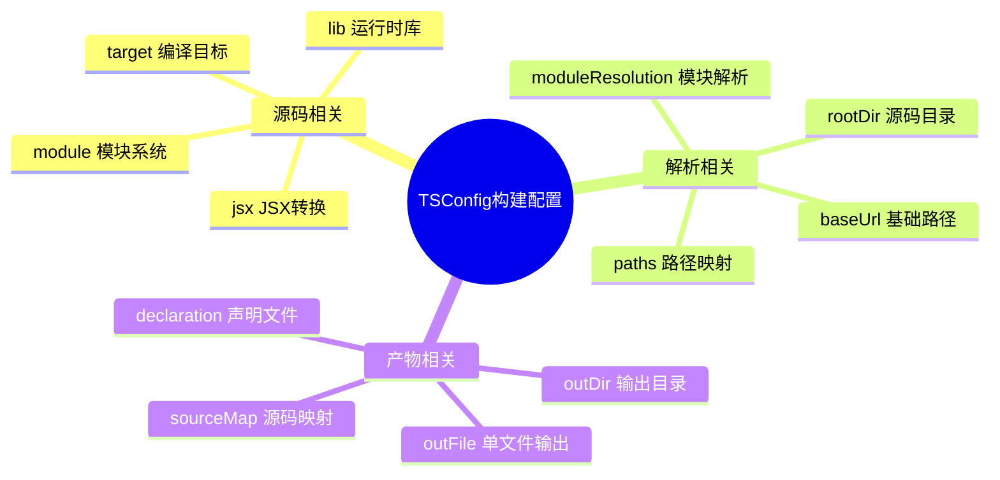

# TSConfig 配置详解 - 构建相关

## 知识架构



## 文档概述

在前面的内容中，我们已经学习了 TypeScript 在工程中的许多实践，包括类型声明、TypeScript 与 React、ESLint 的结合使用以及装饰器等。这些实践更像是上层建筑，默认是在一个已经基本配置完环境的 TypeScript 项目中进行的。这一节，我们深入下层基础，来了解 TypeScript 工程中最基础的一部分：TSConfig 配置。

**为什么选择现在才讲配置？** 因为在前面的工程实践中，我们并不需要自己去修改 TSConfig，脚手架已经帮我们处理好了。有了实践经验，再来讲解这些配置效果会更好。

## 配置分类总览

为了避免罗列配置这种填鸭式教学，我将 TSConfig 分为三个大类：**构建相关**、**类型检查相关**以及**工程相关**。这其实也对应着我们的开发流程：使用工程能力进行项目开发，检查源码是否符合配置约束，然后才是输出产物。

```
┌─────────────────────────────────────────────────────────────┐
│                    TSConfig 配置架构                         │
├─────────────────────────────────────────────────────────────┤
│                                                             │
│  ┌─────────────┐    ┌─────────────┐    ┌─────────────┐     │
│  │  构建相关   │ →  │ 类型检查相关 │ →  │  工程相关   │     │
│  └─────────────┘    └─────────────┘    └─────────────┘     │
│        │                  │                  │              │
│        ▼                  ▼                  ▼              │
│  ┌─────────────┐    ┌─────────────┐    ┌─────────────┐     │
│  │ 源码解析    │    │ 严格检查    │    │ 项目引用    │     │
│  │ 编译转换    │    │ 逻辑检查    │    │ 增量构建    │     │
│  │ 产物输出    │    │ 交互检查    │    │ 配置继承    │     │
│  └─────────────┘    └─────────────┘    └─────────────┘     │
│                                                             │
└─────────────────────────────────────────────────────────────┘
```

| 配置大类         | 主要职责                         | 核心配置项                              |
| ---------------- | -------------------------------- | --------------------------------------- |
| **构建相关**     | 控制代码输入、编译转换、产物输出 | target, module, outDir, jsx, rootDir    |
| **类型检查相关** | 控制类型检查严格程度             | strict, noImplicitAny, strictNullChecks |
| **工程相关**     | 项目引用、增量构建、兼容性       | references, incremental, extends        |

每一个大类又可以划分为几个小类，比如构建相关又可以分为**构建源码相关**、**构建解析相关**与**构建产物相关**等等，我们会按照这些分类的方式进行聚合地讲解。

> 💡 **使用建议**：本文档可作为工具书使用。当你在实际项目开发遗忘了某一项具体配置的作用，或者发现某一配置表现不符合预期，都可以回到这里来寻找答案。

---

## 一、构建相关配置

### 1.1 构建源码相关配置

#### 1.1.1 特殊语法相关

##### experimentalDecorators 与 emitDecoratorMetadata

**配置说明**

这两个选项都和装饰器有关：

- `experimentalDecorators`：启用装饰器的 `@` 语法（实验性特性）
- `emitDecoratorMetadata`：为装饰器生成元数据，用于在运行时获取类型信息

**配置示例**

```json
{
  "compilerOptions": {
    "experimentalDecorators": true,
    "emitDecoratorMetadata": true
  }
}
```

**实际应用场景**

当你使用 NestJS、TypeORM、Class Transformer 等依赖装饰器元数据的框架时，必须启用这两个配置：

```typescript
// NestJS 示例
@Controller("users")
export class UserController {
  @Get()
  findAll() {
    return "This action returns all users"
  }
}
```

**编译产物对比**

启用 `emitDecoratorMetadata` 后，编译产物会包含类型元数据：

```javascript
var __metadata =
  (this && this.__metadata) ||
  function (k, v) {
    if (typeof Reflect === "object" && typeof Reflect.metadata === "function")
      return Reflect.metadata(k, v)
  }

__decorate([Prop(), __metadata("design:type", String)], Foo.prototype, "prop", void 0)

__decorate(
  [
    Method(),
    __param(0, Param()),
    __metadata("design:type", Function),
    __metadata("design:paramtypes", [String]),
    __metadata("design:returntype", void 0)
  ],
  Foo.prototype,
  "handler",
  null
)
```

> ⚠️ **注意**：这两个配置是实验性的，装饰器规范仍在演进中。TypeScript 5.0+ 支持新的装饰器标准，建议关注官方文档更新。

##### jsx、jsxFactory、jsxFragmentFactory 与 jsxImportSource

**配置说明**

这部分配置主要涉及 JSX/TSX 相关的语法特性。

**jsx 配置值对比表**

| 配置值         | 输出文件 | 转换方式                        | 适用场景                        |
| -------------- | -------- | ------------------------------- | ------------------------------- |
| `react`        | `.js`    | `React.createElement`           | React 16/17 前的项目            |
| `react-jsx`    | `.js`    | `_jsx` (来自 react/jsx-runtime) | React 17+ 项目（推荐）          |
| `react-jsxdev` | `.js`    | `_jsxDEV` (开发模式)            | React 17+ 开发环境              |
| `preserve`     | `.jsx`   | 保留 JSX                        | 由其他工具（Babel等）进一步处理 |
| `react-native` | `.js`    | 保留 JSX                        | React Native 项目               |

**不同 jsx 配置的编译结果对比**

```jsx
// 源代码
export const helloWorld = () => <h1>Hello world</h1>

// react 模式
import React from "react"
export const helloWorld = () => React.createElement("h1", null, "Hello world")

// preserve / react-native 模式
import React from "react"
export const helloWorld = () => <h1>Hello world</h1>

// react-jsx 模式（React 17+）
import { jsx as _jsx } from "react/jsx-runtime"
export const helloWorld = () => _jsx("h1", { children: "Hello world" })

// react-jsxdev 模式（开发环境，包含调试信息）
import { jsxDEV as _jsxDEV } from "react/jsx-dev-runtime"
const _jsxFileName = "/path/to/file.tsx"
export const helloWorld = () =>
  _jsxDEV(
    "h1",
    { children: "Hello world" },
    void 0,
    false,
    { fileName: _jsxFileName, lineNumber: 9, columnNumber: 32 },
    this
  )
```

**其他 JSX 相关配置**

| 配置项               | 说明                      | 默认值                | 使用场景                                           |
| -------------------- | ------------------------- | --------------------- | -------------------------------------------------- |
| `jsxFactory`         | 指定 JSX 工厂函数         | `React.createElement` | 使用 Preact 等其他框架时设置为 `h`                 |
| `jsxFragmentFactory` | 指定 Fragment 组件        | `React.Fragment`      | 使用 Preact 等框架时设置为 `Fragment`              |
| `jsxImportSource`    | 指定 jsx-runtime 导入路径 | `react`               | 使用 Preact（`preact`）、Solid（`solid-js`）等框架 |

**使用 Preact 的配置示例**

```json
{
  "compilerOptions": {
    "jsx": "react-jsx",
    "jsxImportSource": "preact"
  }
}
```

编译结果：

```jsx
import { jsx as _jsx } from "preact/jsx-runtime"
const HelloWorld = () => _jsx("div", { children: "Hello" })
```

> 💡 **最佳实践**：React 17+ 项目推荐使用 `react-jsx`，无需在每个文件导入 React，产物更简洁。

##### target 与 lib、noLib

**target 配置说明**

`target` 决定了构建代码使用的 ECMAScript 语法版本。

| 配置值           | 支持的主要特性               | 推荐场景                 |
| ---------------- | ---------------------------- | ------------------------ |
| `es5`            | 基础 ES5 语法                | 需要兼容旧浏览器（IE11） |
| `es6` / `es2015` | 箭头函数、Class、Promise 等  | Node.js 6+               |
| `es2018`         | 异步迭代、Promise.finally 等 | **现代项目推荐**         |
| `es2020`         | 可选链、空值合并、BigInt     | Node.js 14+              |
| `es2022`         | Top-level await、Array.at()  | 最新特性支持             |
| `esnext`         | 最新 ES 特性                 | 实验性项目               |

**lib 配置说明**

`lib` 决定了可用的 API 类型声明，与运行环境相关。

| lib 值           | 提供的类型声明                    | 使用场景                    |
| ---------------- | --------------------------------- | --------------------------- |
| `ES2021`         | ES2021 所有 API                   | target 为 ES2021 时自动包含 |
| `ES2021.String`  | 仅 String 的新方法                | 按需加载                    |
| `DOM`            | 浏览器 API（window, document 等） | Web 项目                    |
| `DOM.Iterable`   | DOM 迭代器方法                    | Web 项目（需配合 DOM）      |
| `ES2015.Promise` | Promise 类型                      | 仅需 Promise 时             |
| `ScriptHost`     | Windows Script Host               | 特殊环境                    |

**target 与 lib 的关系**

```typescript
// 示例：使用 ES2021 的 replaceAll 方法
"linbudu".replaceAll("d", "dd")
```

- `target: "es2021"` → 自动加载 ES2021 lib，无需额外配置
- `target: "es2018"` → 需手动添加 `"lib": ["ES2021.String"]` 才能使用

**常见配置组合**

```json
// Web 项目推荐配置
{
  "compilerOptions": {
    "target": "ES2018",
    "lib": ["ES2018", "DOM", "DOM.Iterable"]
  }
}

// Node.js 项目推荐配置
{
  "compilerOptions": {
    "target": "ES2020",
    "lib": ["ES2020"],
    "types": ["node"]
  }
}

// 需要兼容 IE11
{
  "compilerOptions": {
    "target": "ES5",
    "lib": ["ES5", "DOM", "ScriptHost"]
  }
}
```

> ⚠️ **注意**：target 控制语法降级，lib 控制类型声明。两者需要配合使用，避免运行时错误。

**noLib 配置**

启用 `noLib` 后，TypeScript 不会加载任何内置类型声明，需要手动提供所有类型定义。

```json
{
  "compilerOptions": {
    "noLib": true
  }
}
```

使用场景：运行环境对内置对象做了大量修改，需要自定义类型声明。

---

### 1.2 构建解析相关配置

这部分配置主要控制源码解析，包括从何处开始收集要构建的文件，如何解析别名路径等等。

#### 1.2.1 files、include 与 exclude

**配置对比表**

| 配置项    | 类型       | 支持的模式                  | 使用场景           |
| --------- | ---------- | --------------------------- | ------------------ |
| `files`   | 字符串数组 | 完整文件路径                | 小型项目，精确控制 |
| `include` | 字符串数组 | glob 模式、文件夹、文件路径 | 大中型项目（推荐） |
| `exclude` | 字符串数组 | glob 模式、文件夹、文件路径 | 排除不需要的文件   |

**files 配置示例**

```json
{
  "files": ["src/index.ts", "src/handler.ts"]
}
```

**include 配置示例**

```json
{
  "include": ["src/**/*", "generated/*.ts", "internal/*"]
}
```

**Glob 模式说明**

| 模式   | 含义                             | 示例                            |
| ------ | -------------------------------- | ------------------------------- |
| `*`    | 匹配任意文件名（不含路径分隔符） | `*.ts` 匹配所有 .ts 文件        |
| `**/`  | 匹配任意层级的目录               | `src/**/*` 匹配 src 下所有文件  |
| `**/*` | 匹配任意层级目录下的任意文件     | `**/*.test.ts` 匹配所有测试文件 |

**合法文件类型**（不指定扩展名时）：

- `.ts` / `.tsx` / `.d.ts`（默认包含）
- `.js` / `.jsx`（需要启用 `allowJs`）

**exclude 配置示例**

```json
{
  "include": ["src/**/*"],
  "exclude": ["src/**/*.test.ts", "src/**/*.spec.ts", "src/file-excluded", "node_modules"]
}
```

> ⚠️ **重要**：`exclude` 只能剔除**已经被 include 包含的文件**。默认情况下 `node_modules`、`bower_components`、`jspm_packages` 会被排除。

**文件包含流程图**

```
┌─────────────────────────────────────────────────────────────┐
│                    文件包含解析流程                          │
├─────────────────────────────────────────────────────────────┤
│                                                             │
│  ┌──────────┐    ┌──────────┐    ┌──────────┐             │
│  │  files   │ →  │ include  │ →  │ exclude  │ → 编译文件   │
│  └──────────┘    └──────────┘    └──────────┘             │
│       │               │               │                    │
│       ▼               ▼               ▼                    │
│   精确指定        glob 匹配        排除过滤                 │
│   最高优先        批量包含        最终确定                  │
│                                                             │
│  默认排除：node_modules, bower_components, jspm_packages   │
│                                                             │
└─────────────────────────────────────────────────────────────┘
```

#### 1.2.2 baseUrl

**配置说明**

定义模块解析的基准目录，用于：

1. 相对路径导入的基准
2. paths 别名的基准路径

**目录结构示例**

```text
project
├── out.ts
├── src
│   └── core.ts
└── tsconfig.json
```

**配置示例**

```json
{
  "compilerOptions": {
    "baseUrl": "./"
  }
}
```

此时根目录为 `project`，可以在 `out.ts` 中使用基于根目录的导入：

```typescript
// out.ts
import "src/core" // 解析为 ./src/core.ts
```

> 💡 **最佳实践**：使用 paths 别名时建议配置 baseUrl（TypeScript 4.1+ 起也可省略，此时映射相对于 tsconfig.json 所在目录解析）。

#### 1.2.3 rootDir

**配置说明**

`rootDir` 决定了项目源码的根目录，影响构建产物的目录结构。

**自动推断规则**

- 默认值：所有被包含的 `.ts` 文件的最长公共路径
- 不包括 `.d.ts` 文件

**示例 1：单一源码目录**

```text
PROJECT
├── src
│   ├── index.ts
│   ├── app.ts
│   └── utils
│       └── helpers.ts
├── declare.d.ts
└── tsconfig.json
```

`rootDir` 自动推断为 `src`，构建产物：

```text
PROJECT
├── dist
│   ├── index.js
│   ├── app.js
│   └── utils
│       └── helpers.js
```

**示例 2：多个源码目录**

```text
PROJECT
├── env
│   ├── env.dev.ts
│   └── env.prod.ts
├── app
│   └── index.ts
├── declare.d.ts
└── tsconfig.json
```

`rootDir` 自动推断为 `.`，构建产物：

```text
PROJECT
├── dist
│   ├── env
│   │   ├── env.dev.js
│   │   └── env.prod.js
│   └── app
│       └── index.js
```

**显式指定 rootDir**

```json
{
  "compilerOptions": {
    "rootDir": "src",
    "outDir": "dist"
  }
}
```

> ⚠️ **注意**：显式指定 `rootDir` 时，必须确保所有被包含的文件都在 rootDir 内，否则会报错。

#### 1.2.4 rootDirs

**配置说明**

`rootDirs` 是 `rootDir` 的复数形式，允许指定多个根目录，用于虚拟目录合并。

**使用场景**

源码和生成代码分离，但需要相互引用：

```text
PROJECT
├── src
│   └── locales
│       ├── zh.locale.ts
│       ├── en.locale.ts
│       └── jp.locale.ts
├── generated
│   └── messages
│       ├── main.mapper.ts
│       └── info.mapper.ts
└── tsconfig.json
```

**配置示例**

```json
{
  "compilerOptions": {
    "rootDirs": ["src/locales", "generated/messages"]
  }
}
```

**效果**

在 `zh.locale.ts` 中可以直接使用相对路径导入：

```typescript
// zh.locale.ts
import { mainMapper } from "./main.mapper" // 类型检查通过
```

虽然实际路径为 `../../generated/messages/main.mapper.ts`，但 TypeScript 会将其视为同一目录。

> 💡 **说明**：`rootDirs` 仅影响类型检查和模块解析，不影响实际构建产物。

#### 1.2.5 types 与 typeRoots

**types 配置**

默认情况下，TypeScript 会加载 `node_modules/@types/` 下的所有声明文件。使用 `types` 可以限制只加载指定的类型包：

```json
{
  "compilerOptions": {
    "types": ["node", "jest", "react"]
  }
}
```

**效果对比**

| 情况                | 全局声明  | 自动导入提示          |
| ------------------- | --------- | --------------------- |
| 在 `types` 列表中   | ✅ 可用   | ✅ 可用               |
| 不在 `types` 列表中 | ❌ 不可用 | ✅ 可用（显式导入后） |

**typeRoots 配置**

自定义类型声明的加载路径：

```json
{
  "compilerOptions": {
    "typeRoots": ["./node_modules/@types", "./node_modules/@team-types", "./typings"],
    "types": ["react"],
    "skipLibCheck": true
  }
}
```

加载顺序：

1. `./node_modules/@types/react`
2. `./node_modules/@team-types/react`
3. `./typings/react`

> ⚠️ **注意**：加载多个声明文件可能导致冲突，建议启用 `skipLibCheck`。

#### 1.2.6 moduleResolution

**配置说明**

指定模块解析策略。

| 配置值                | 说明             | 推荐场景         |
| --------------------- | ---------------- | ---------------- |
| `node`                | Node.js 解析规则 | **默认推荐**     |
| `classic`             | 旧版解析规则     | 仅用于向后兼容   |
| `node16` / `nodenext` | Node.js ESM 解析 | Node.js ESM 项目 |
| `bundler`             | 打包工具式解析（支持扩展名省略与 package.json `exports`） | TS 5.0+，配合 Vite/Webpack/esbuild 等打包工具 |

**Node 解析模式详解**

**相对路径导入**（`import foo from "./foo"`）：

1. 检查 `foo.ts`、`foo.tsx`、`foo.d.ts` 是否存在
2. 检查 `foo/` 是否为文件夹
   - 检查 `foo/package.json` 的 `types` 或 `main` 字段
   - 尝试 `foo/index.ts`、`foo/index.tsx`、`foo/index.d.ts`

**绝对路径导入**（`import foo from "foo"`）：

从当前目录开始，逐级向上查找 `node_modules`：

```text
/<project>/src/node_modules/foo.ts
/<project>/src/node_modules/foo.tsx
/<project>/src/node_modules/foo.d.ts
/<project>/node_modules/foo.ts
...
/node_modules/foo.ts
```

> 💡 **建议**：始终使用 `node` 模式，`classic` 模式仅用于兼容旧代码。

#### 1.2.7 moduleSuffixes

**配置说明**（TypeScript 4.7+）

自定义模块后缀名解析顺序，主要用于 React Native 多平台构建。

**配置示例**

```json
{
  "compilerOptions": {
    "moduleSuffixes": [".ios", ".native", ""]
  }
}
```

**解析顺序**

导入 `import foo from "./foo"` 时，按以下顺序查找：

1. `./foo.ios.ts`
2. `./foo.native.ts`
3. `./foo.ts`

**使用场景**

```text
src/
├── utils.ios.ts     // iOS 平台实现
├── utils.android.ts // Android 平台实现
├── utils.native.ts  // 其他原生平台实现
└── utils.ts         // Web 平台实现
```

```typescript
import { utils } from "./utils"
// iOS: 加载 utils.ios.ts
// Android: 加载 utils.android.ts
// Web: 加载 utils.ts
```

#### 1.2.8 noResolve

**配置说明**

禁用自动解析导入的文件。启用后，只编译 `files` 或 `include` 中明确指定的文件。

**配置示例**

```json
{
  "compilerOptions": {
    "noResolve": true
  }
}
```

```typescript
// 即使这个文件存在，也不会被包含在编译中
import { foo } from "./other"

/// <reference path="./other.d.ts" />  // 三斜线指令也会被忽略
```

> ⚠️ **注意**：启用此配置后，需要手动管理所有依赖文件。

#### 1.2.9 paths

**配置说明**

配置模块路径别名，类似 Webpack 的 alias。

**配置示例**

```json
{
  "compilerOptions": {
    "baseUrl": "./",
    "paths": {
      "@/*": ["src/*"],
      "@/utils/*": ["src/utils/*", "src/shared/utils/*"],
      "@components/*": ["src/components/*"]
    }
  }
}
```

**使用示例**

```typescript
// 原路径
import { helper } from "../../../utils/helper"

// 使用别名
import { helper } from "@/utils/helper"
```

**多路径回退**

```json
{
  "compilerOptions": {
    "baseUrl": "./",
    "paths": {
      "@/utils/*": ["src/utils/*", "src/legacy/utils/*"]
    }
  }
}
```

TypeScript 会依次尝试：

1. `src/utils/*`
2. `src/legacy/utils/*`

> ⚠️ **重要**：`paths` 建议配合 `baseUrl` 使用（TS 4.1+ 起可省略 baseUrl，映射相对于 tsconfig.json 所在目录解析）。另外，`paths` 仅影响类型检查，运行时需要配置打包工具（Webpack、Vite 等）的别名。

#### 1.2.10 resolveJsonModule

**配置说明**

允许导入 JSON 文件并获得类型推导。

**配置示例**

```json
{
  "compilerOptions": {
    "resolveJsonModule": true
  }
}
```

**使用示例**

`settings.json`：

```json
{
  "repo": "TypeScript",
  "dry": false,
  "debug": false
}
```

```typescript
import settings from "./settings.json"

settings.debug // 类型为 boolean
settings.repo // 类型为 "TypeScript"（字面量类型）

settings.dry === 2 // ❌ 类型错误
```

---

### 1.3 构建产物相关配置

#### 1.3.1 构建输出相关

##### outDir 与 outFile

**outDir 配置**

指定构建产物的输出目录：

```json
{
  "compilerOptions": {
    "outDir": "./dist"
  }
}
```

**目录结构示例**

源码：

```text
src
├── core
│   └── handler.ts
└── index.ts
```

构建产物：

```text
dist
├── core
│   ├── handler.js
│   └── handler.d.ts
├── index.js
└── index.d.ts
```

**outFile 配置**

将所有产物打包为单个文件，仅支持以下模块类型：

- `None`
- `System`
- `AMD`

```json
{
  "compilerOptions": {
    "module": "AMD",
    "outFile": "./dist/bundle.js"
  }
}
```

> 💡 **建议**：现代项目推荐使用 Webpack、Rollup、Vite 等打包工具，而非 `outFile`。另外，TypeScript 7 起 `module: "AMD"`、`"System"` 已被移除，`outFile` 的适用面进一步收窄。

##### module

**配置说明**

指定生成代码的模块系统。

**module 配置值对比**

| 配置值           | 输出格式                     | 适用场景             |
| ---------------- | ---------------------------- | -------------------- |
| `commonjs`       | Node.js 模块                 | Node.js 项目（target ≤ ES5 时的默认值） |
| `amd`            | AMD 模块                     | 浏览器 AMD 加载器    |
| `system`         | SystemJS 模块                | SystemJS 加载器      |
| `umd`            | UMD 模块                     | 通用模块定义         |
| `es6` / `es2015` | ES Modules                   | 现代浏览器、打包工具 |
| `es2020`         | ES Modules + 动态导入        | 支持 import() 的环境 |
| `es2022`         | ES Modules + top-level await | 最新 ES 特性         |
| `esnext`         | 最新 ES 模块特性             | 实验性项目           |
| `none`           | 无模块系统                   | 简单脚本             |

**编译结果对比**

```typescript
// 源代码
export const name = "TypeScript"
export function greet() {
  return "Hello"
}
```

```javascript
// commonjs
"use strict"
Object.defineProperty(exports, "__esModule", { value: true })
exports.name = void 0
exports.greet = greet
exports.name = "TypeScript"
function greet() {
  return "Hello"
}

// es6 / es2015 / es2020 / es2022 / esnext
export const name = "TypeScript"
export function greet() {
  return "Hello"
}

// amd
define(["require", "exports"], function (require, exports) {
  "use strict"
  Object.defineProperty(exports, "__esModule", { value: true })
  exports.greet = exports.name = void 0
  exports.name = "TypeScript"
  function greet() {
    return "Hello"
  }
  exports.greet = greet
})

// umd
;(function (factory) {
  if (typeof module === "object" && typeof module.exports === "object") {
    var v = factory(require, exports)
    if (v !== undefined) module.exports = v
  } else if (typeof define === "function" && define.amd) {
    define(["require", "exports"], factory)
  }
})(function (require, exports) {
  "use strict"
  Object.defineProperty(exports, "__esModule", { value: true })
  exports.greet = exports.name = void 0
  exports.name = "TypeScript"
  function greet() {
    return "Hello"
  }
  exports.greet = greet
})
```

**推荐配置组合**

```json
// Node.js 项目
{
  "compilerOptions": {
    "target": "ES2020",
    "module": "CommonJS"
  }
}

// 浏览器项目（配合打包工具）
{
  "compilerOptions": {
    "target": "ES2020",
    "module": "ESNext"
  }
}

// Node.js ESM 项目
{
  "compilerOptions": {
    "target": "ES2020",
    "module": "NodeNext",
    "moduleResolution": "NodeNext"
  }
}
```

##### preserveConstEnums

**配置说明**

保留常量枚举的运行时定义，而非内联其值。

**默认行为**（内联）

```typescript
const enum Direction {
  Up = "UP",
  Down = "DOWN"
}

console.log(Direction.Up)
```

编译为：

```javascript
console.log("UP" /* Direction.Up */)
```

**启用 preserveConstEnums**

```json
{
  "compilerOptions": {
    "preserveConstEnums": true
  }
}
```

编译为：

```javascript
var Direction
;(function (Direction) {
  Direction["Up"] = "UP"
  Direction["Down"] = "DOWN"
})(Direction || (Direction = {}))

console.log(Direction.Up)
```

**使用场景**

- 需要在运行时遍历枚举值
- 需要反向查找枚举

##### noEmit 与 noEmitOnError

**noEmit 配置**

不生成输出文件，只进行类型检查：

```json
{
  "compilerOptions": {
    "noEmit": true
  }
}
```

**常见使用场景**

```bash
# 使用 ESBuild 构建代码，tsc 仅做类型检查
tsc --noEmit
esbuild src/index.ts --bundle --outfile=dist/bundle.js
```

**noEmitOnError 配置**

仅在编译出错时不生成输出文件：

```json
{
  "compilerOptions": {
    "noEmitOnError": true
  }
}
```

#### 1.3.2 声明文件相关

##### declaration

**配置说明**

自动生成 `.d.ts` 类型声明文件。

**配置示例**

```json
{
  "compilerOptions": {
    "declaration": true,
    "declarationDir": "./dist/types"
  }
}
```

**源代码与生成结果**

```typescript
// src/index.ts
export interface User {
  id: string
  name: string
}

export function createUser(name: string): User {
  return { id: crypto.randomUUID(), name }
}
```

生成的 `dist/types/index.d.ts`：

```typescript
export interface User {
  id: string
  name: string
}
export declare function createUser(name: string): User
```

##### declarationMap

**配置说明**

为声明文件生成 source map，支持"转到定义"功能。

```json
{
  "compilerOptions": {
    "declaration": true,
    "declarationMap": true
  }
}
```

**效果**

当用户使用你的库并点击类型定义时，IDE 会跳转到源 `.ts` 文件而非 `.d.ts` 文件。

##### emitDeclarationOnly

**配置说明**

只生成声明文件，不生成 JavaScript 文件。

```json
{
  "compilerOptions": {
    "declaration": true,
    "emitDeclarationOnly": true
  }
}
```

**使用场景**

配合其他构建工具（如 ESBuild、Babel）处理 JavaScript 编译：

```bash
# tsc 生成声明文件
tsc --emitDeclarationOnly

# ESBuild 编译 JavaScript
esbuild src/index.ts --outfile=dist/index.js
```

#### 1.3.3 Source Map 相关

##### sourceMap、inlineSourceMap 与 inlineSources

**sourceMap 配置**

生成独立的 `.map` 文件：

```json
{
  "compilerOptions": {
    "sourceMap": true
  }
}
```

生成的文件：

```text
dist/
├── index.js
└── index.js.map
```

**inlineSourceMap 配置**

将 source map 内联到 JavaScript 文件中：

```json
{
  "compilerOptions": {
    "inlineSourceMap": true
  }
}
```

生成的文件：

```javascript
// dist/index.js
console.log("Hello")
//# sourceMappingURL=data:application/json;base64,...
```

**inlineSources 配置**

将源代码也内联到 source map 中：

```json
{
  "compilerOptions": {
    "sourceMap": true,
    "inlineSources": true
  }
}
```

**配置对比**

| 配置                        | 产物文件                    | 调试体验 | 适用场景           |
| --------------------------- | --------------------------- | -------- | ------------------ |
| `sourceMap`                 | `.js` + `.js.map`           | ✅ 好    | 生产环境           |
| `inlineSourceMap`           | 仅 `.js`                    | ✅ 好    | 单文件部署         |
| `sourceMap + inlineSources` | `.js` + `.js.map`（含源码） | ✅ 最佳  | 需要在其他机器调试 |

#### 1.3.4 其他产物配置

##### removeComments

**配置说明**

移除代码中的注释。

```json
{
  "compilerOptions": {
    "removeComments": true
  }
}
```

**效果对比**

```typescript
// 源代码
/** 计算两数之和 */
function add(a: number, b: number): number {
  return a + b
}

// 输出（removeComments: true）
function add(a, b) {
  return a + b
}
```

> ⚠️ **注意**：JSDoc 注释被移除后，类型提示会丢失。库开发不建议启用此选项。

##### importHelpers

**配置说明**

从 `tslib` 导入辅助函数，而非在每个文件中内联生成。

```json
{
  "compilerOptions": {
    "importHelpers": true
  }
}
```

**效果对比**

```typescript
// 源代码
class Foo {
  @decorator
  method() {}
}
```

```javascript
// 未启用 importHelpers（每个文件都有辅助函数）
var __decorate =
  (this && this.__decorate) ||
  function (decorators, target, key, desc) {
    // ... 大量代码
  }
class Foo {
  method() {}
}
Foo = __decorate([decorator], Foo)

// 启用 importHelpers（从 tslib 导入）
var tslib_1 = require("tslib")
class Foo {
  method() {}
}
Foo = tslib_1.__decorate([decorator], Foo)
```

**优势**

- 减小产物体积
- 多文件共享辅助函数

**需要安装 tslib**

```bash
npm install tslib
```

##### downlevelIteration

**配置说明**

为旧版本 ES 目标提供完整的迭代器支持。

```json
{
  "compilerOptions": {
    "target": "ES5",
    "downlevelIteration": true
  }
}
```

**效果对比**

```typescript
// 源代码
const arr = [1, 2, 3]
for (const item of arr) {
  console.log(item)
}
const copy = [...arr]
```

```javascript
// 未启用 downlevelIteration
var arr = [1, 2, 3]
for (var _i = 0, arr_1 = arr; _i < arr_1.length; _i++) {
  var item = arr_1[_i]
  console.log(item)
}
var copy = arr.slice()

// 启用 downlevelIteration（支持自定义迭代器）
var __values =
  (this && this.__values) ||
  function (o) {
    // ... 迭代器辅助函数
  }
var arr = [1, 2, 3]
try {
  for (var arr_1 = __values(arr), arr_1_1 = arr_1.next(); !arr_1_1.done; arr_1_1 = arr_1.next()) {
    var item = arr_1_1.value
    console.log(item)
  }
} catch (e_1) {
  /* ... */
}
var copy = __spreadArray([], __read(arr), false)
```

**使用场景**

- 需要在 ES5 环境中使用自定义迭代器
- 需要正确处理 `Set`、`Map` 等可迭代对象

##### newLine

**配置说明**

指定输出文件的换行符。

```json
{
  "compilerOptions": {
    "newLine": "lf" // 或 "crlf"
  }
}
```

| 配置值 | 换行符 | 适用系统         |
| ------ | ------ | ---------------- |
| `lf`   | `\n`   | Unix/Linux/macOS |
| `crlf` | `\r\n` | Windows          |

---

## 二、配置速查表

### 2.1 常用配置速查

#### Web 项目推荐配置

```json
{
  "compilerOptions": {
    "target": "ES2020",
    "module": "ESNext",
    "lib": ["ES2020", "DOM", "DOM.Iterable"],
    "moduleResolution": "bundler",
    "jsx": "react-jsx",
    "strict": true,
    "esModuleInterop": true,
    "skipLibCheck": true,
    "forceConsistentCasingInFileNames": true,
    "resolveJsonModule": true,
    "declaration": true,
    "declarationMap": true,
    "sourceMap": true,
    "outDir": "./dist",
    "rootDir": "./src",
    "baseUrl": ".",
    "paths": {
      "@/*": ["src/*"]
    }
  },
  "include": ["src/**/*"],
  "exclude": ["node_modules", "dist"]
}
```

#### Node.js 项目推荐配置

```json
{
  "compilerOptions": {
    "target": "ES2020",
    "module": "CommonJS",
    "lib": ["ES2020"],
    "moduleResolution": "node",
    "strict": true,
    "esModuleInterop": true,
    "skipLibCheck": true,
    "forceConsistentCasingInFileNames": true,
    "resolveJsonModule": true,
    "declaration": true,
    "outDir": "./dist",
    "rootDir": "./src",
    "types": ["node"]
  },
  "include": ["src/**/*"],
  "exclude": ["node_modules", "dist"]
}
```

#### 库开发推荐配置

```json
{
  "compilerOptions": {
    "target": "ES2018",
    "module": "ESNext",
    "lib": ["ES2018"],
    "moduleResolution": "node",
    "strict": true,
    "esModuleInterop": true,
    "skipLibCheck": true,
    "forceConsistentCasingInFileNames": true,
    "declaration": true,
    "declarationMap": true,
    "sourceMap": true,
    "outDir": "./dist",
    "rootDir": "./src",
    "importHelpers": true
  },
  "include": ["src/**/*"],
  "exclude": ["node_modules", "dist", "**/*.test.ts"]
}
```

### 2.2 配置项快速索引

| 配置项              | 分类     | 说明              |
| ------------------- | -------- | ----------------- |
| `target`            | 构建源码 | 编译目标 ES 版本  |
| `module`            | 构建产物 | 模块系统类型      |
| `lib`               | 构建源码 | 可用 API 类型声明 |
| `jsx`               | 构建源码 | JSX 编译方式      |
| `outDir`            | 构建产物 | 输出目录          |
| `rootDir`           | 构建解析 | 源码根目录        |
| `baseUrl`           | 构建解析 | 模块解析基准路径  |
| `paths`             | 构建解析 | 路径别名          |
| `strict`            | 类型检查 | 启用所有严格检查  |
| `declaration`       | 构建产物 | 生成类型声明文件  |
| `sourceMap`         | 构建产物 | 生成 source map   |
| `esModuleInterop`   | 构建产物 | ES 模块互操作性   |
| `skipLibCheck`      | 工程     | 跳过声明文件检查  |
| `resolveJsonModule` | 构建解析 | 允许导入 JSON     |

---

## 三、常见问题解答

### Q1: target 和 module 有什么区别？

**A**: `target` 控制语法降级，`module` 控制模块系统。

```typescript
// 源代码
export const fn = async () => {
  await Promise.resolve()
}
```

| 配置                               | 编译结果                                                             |
| ---------------------------------- | -------------------------------------------------------------------- |
| `target: ES5, module: CommonJS`    | 箭头函数转为普通函数，async/await 转为 Generator，使用 CommonJS 导出 |
| `target: ES2020, module: CommonJS` | 保留箭头函数和 async/await，使用 CommonJS 导出                       |
| `target: ES2020, module: ESNext`   | 保留箭头函数和 async/await，使用 ES Modules 导出                     |

### Q2: 为什么配置了 paths 别名后运行时报错？

**A**: `paths` 只影响 TypeScript 类型检查，不影响运行时模块解析。需要同时配置打包工具：

```javascript
// vite.config.js
export default {
  resolve: {
    alias: {
      "@": "/path/to/src"
    }
  }
}

// webpack.config.js
module.exports = {
  resolve: {
    alias: {
      "@": path.resolve(__dirname, "src")
    }
  }
}
```

### Q3: declaration 和 declarationMap 有什么区别？

**A**:

- `declaration`：生成 `.d.ts` 类型声明文件
- `declarationMap`：生成 `.d.ts.map`，让 IDE 从 `.d.ts` 跳转到源 `.ts` 文件

库开发建议同时启用两个选项。

### Q4: 什么时候应该使用 noEmit？

**A**: 当使用其他工具（如 ESBuild、Babel、Vite）处理编译时：

```json
{
  "compilerOptions": {
    "noEmit": true
  }
}
```

此时 TypeScript 只负责类型检查，不生成任何文件。

### Q5: sourceMap 和 inlineSourceMap 应该选哪个？

**A**:

- **sourceMap**：生成独立的 `.map` 文件，适合生产环境，便于调试
- **inlineSourceMap**：内联到 JS 文件中，适合单文件部署或简单项目

### Q6: 为什么我的枚举值在编译后消失了？

**A**: `const enum` 默认会被内联。如果需要在运行时访问枚举对象：

```typescript
// 方案一：使用普通枚举
enum Direction {
  Up,
  Down
}

// 方案二：启用 preserveConstEnums
const enum Direction {
  Up,
  Down
}
// tsconfig.json: "preserveConstEnums": true
```

---

## 四、最佳实践总结

### 4.1 配置原则

```
┌─────────────────────────────────────────────────────────────┐
│                    TSConfig 配置原则                         │
├─────────────────────────────────────────────────────────────┤
│                                                             │
│  1. 渐进式严格                                              │
│     • 新项目：直接启用 strict: true                         │
│     • 老项目：逐步启用 noImplicitAny 等选项                 │
│                                                             │
│  2. 环境匹配                                                │
│     • Web 项目：target 和 module 配合打包工具               │
│     • Node.js 项目：使用 CommonJS 或 NodeNext               │
│                                                             │
│  3. 开发体验                                                │
│     • 启用 sourceMap 便于调试                               │
│     • 启用 declaration 便于类型提示                         │
│                                                             │
│  4. 性能优化                                                │
│     • 启用 skipLibCheck 加速编译                            │
│     • 使用 incremental 增量编译                             │
│                                                             │
└─────────────────────────────────────────────────────────────┘
```

### 4.2 常见错误配置

```json
{
  "compilerOptions": {
    // ❌ 错误：target 和 lib 不匹配
    "target": "ES5",
    "lib": ["ES2020"]  // ES5 目标无法使用 ES2020 API

    // ❌ 错误：module 和 outFile 不兼容
    "module": "CommonJS",
    "outFile": "./dist/bundle.js"  // CommonJS 不支持 outFile

    // ⚠️ 注意：paths 可以不配置 baseUrl（TS 4.1+，映射相对于 tsconfig.json 解析），
    // 但团队内建议显式声明 baseUrl，避免解析基准不直观
    "paths": {
      "@/*": ["src/*"]
    }
  }
}
```

### 4.3 配置检查清单

- [ ] `target` 与运行环境兼容
- [ ] `module` 与打包工具/运行环境匹配
- [ ] `lib` 包含必要的类型声明（DOM、ES2020 等）
- [ ] `strict` 已启用（新项目）
- [ ] `paths` 配置了 `baseUrl`
- [ ] `include`/`exclude` 正确设置
- [ ] `declaration` 已启用（库项目）
- [ ] `sourceMap` 已启用（需要调试）

---

## 参考资料

- [TypeScript 官方文档 - TSConfig Reference](https://www.typescriptlang.org/tsconfig)
- [TypeScript 官方文档 - Compiler Options](https://www.typescriptlang.org/docs/handbook/compiler-options.html)
- [TypeScript Deep Dive - tsconfig.json](https://basarat.gitbook.io/typescript/project/compilation-context)

在下一节，我们会介绍检查相关与工程相关的配置项，其中检查部分包括了类型检查、逻辑检查等，而工程配置则包括了一系列兼容性与工程能力的配置。
