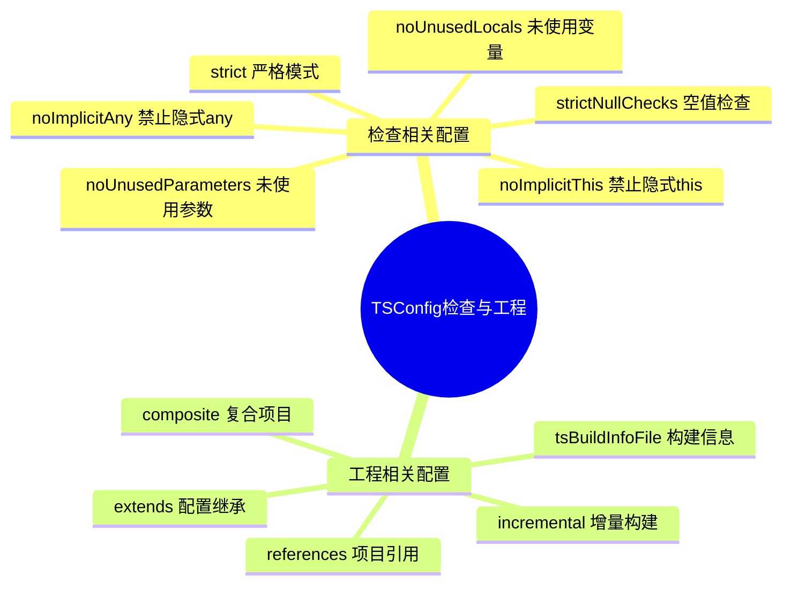

# TSConfig 配置详解 - 检查与工程

## 知识架构



## 文档概述

上一节我们介绍了构建相关的 TSConfig 配置，包括源码相关、解析相关、产物相关等几个部分，这一节我们会接着来介绍类型检查与工程相关的 TSConfig。

> 本节代码见：[Project References](https://link.juejin.cn/?target=https%3A%2F%2Fgithub.com%2Flinbudu599%2FTypeScript-Tiny-Book%2Ftree%2Fmain%2Fpackages%2F22-project-references%2F)

## 配置分类总览

检查相关配置主要控制 TypeScript 对代码的类型检查严格程度，这是导致 TypeScript 项目质量差异巨大的主要原因。工程相关配置则提供了项目管理、增量构建、兼容性等高级能力。

```
┌─────────────────────────────────────────────────────────────┐
│                    检查与工程配置架构                         │
├─────────────────────────────────────────────────────────────┤
│                                                             │
│  ┌─────────────────────────────────────────────────────┐   │
│  │                   检查相关配置                        │   │
│  ├─────────────────────────────────────────────────────┤   │
│  │  允许类    │  禁止类    │  严格检查   │  其他检查    │   │
│  │  allowXxx  │  noXxx     │  strict     │  skipLib    │   │
│  └─────────────────────────────────────────────────────┘   │
│                                                             │
│  ┌─────────────────────────────────────────────────────┐   │
│  │                   工程相关配置                        │   │
│  ├─────────────────────────────────────────────────────┤   │
│  │  项目引用  │  增量构建  │  配置继承   │  兼容性      │   │
│  │  references│ incremental│  extends   │  interop    │   │
│  └─────────────────────────────────────────────────────┘   │
│                                                             │
└─────────────────────────────────────────────────────────────┘
```

| 配置大类       | 主要职责                      | 核心配置项                              | 推荐程度   |
| -------------- | ----------------------------- | --------------------------------------- | ---------- |
| **检查相关**   | 控制类型和逻辑检查严格度      | strict, noImplicitAny, strictNullChecks | ⭐⭐⭐⭐⭐ |
| **工程相关**   | 项目引用、增量构建、兼容性    | references, incremental, extends        | ⭐⭐⭐⭐   |
| **兼容性相关** | 模块系统兼容、JavaScript 支持 | esModuleInterop, allowJs                | ⭐⭐⭐     |

**配置推荐级别说明**：

- ⭐⭐⭐⭐⭐：强烈推荐，任何规模项目都应启用
- ⭐⭐⭐⭐：推荐，中大型项目应启用
- ⭐⭐⭐：可选，根据实际需要启用

---

## 一、检查相关配置

这部分的配置主要控制对源码中语法与类型检查的严格程度，这也是导致 TypeScript 项目下限与上限差异巨大的主要原因，检查全开与全关下的 TypeScript 简直就是两门不同的语言。

> 💡 **建议**：不是说检查越严格越好，更好的方式是依据实际需要来调整检查的严格程度。比如小型 demo 就不需要太严格检查，而生产项目建议开启全部严格检查。

### 1.1 允许类配置

这一部分的配置关注的语法通常是有害的，且默认情况下为禁用或者给出警告，因此需要显式通过配置来允许这些有害语法，它们的名称均为 `allowXXX` 这种形式。

#### 1.1.1 allowUmdGlobalAccess

**配置说明**

允许在模块文件中直接访问 UMD 全局变量，而无需显式导入。

**配置示例**

```json
{
  "compilerOptions": {
    "allowUmdGlobalAccess": true
  }
}
```

**使用场景**

```html
<!-- 通过 CDN 引入 jQuery -->
<script src="https://code.jquery.com/jquery-3.6.0.min.js"></script>
```

```typescript
// 无需导入，直接使用
// 默认情况会报错，启用 allowUmdGlobalAccess 后可用
$(() => {
  console.log("jQuery is ready!")
})
```

**UMD 模块格式示例**

```javascript
;(function (global, factory) {
  // 尝试使用 CommonJS
  if (typeof module === "object" && typeof module.exports === "object") {
    var v = factory(require, exports)
    if (v !== void 0) module.exports = v
  }
  // 尝试使用 AMD
  else if (typeof define === "function" && define.amd) {
    define(["require", "exports"], factory)
  }
  // 兜底，使用全局变量挂载
  else {
    ;((global = global || self), (global.jquery = factory()))
  }
})(function (require, exports) {
  "use strict"
  // 模块实现
})
```

> ⚠️ **注意**：仅在确定运行环境一定存在全局变量时使用，否则可能导致运行时错误。

#### 1.1.2 allowUnreachableCode

**配置说明**

控制是否允许存在无法执行到的代码（Dead Code）。

**配置值**

| 值                  | 行为                     |
| ------------------- | ------------------------ |
| `undefined`（默认） | 给出警告，不阻止编译     |
| `true`              | 完全允许，不给出任何提示 |
| `false`             | 报错，阻止编译           |

**示例**

```typescript
function foo() {
  return 599
  console.log("Dead Code") // Unreachable code
}

function bar() {
  throw new Error("Oops!")
  console.log("Dead Code") // Unreachable code
}

function baz() {
  process.exit(0)
  console.log("Dead Code") // Unreachable code
}
```

**推荐配置**

```json
{
  "compilerOptions": {
    "allowUnreachableCode": false
  }
}
```

> 💡 **最佳实践**：生产项目建议设置为 `false`，避免 Dead Code 污染代码库。

#### 1.1.3 allowUnusedLabels

**配置说明**

控制是否允许声明但未使用的 Label 标记。

**Label 语法简介**

```typescript
someLabel: {
  statement
}
```

**配置值**

| 值                  | 行为     |
| ------------------- | -------- |
| `undefined`（默认） | 给出警告 |
| `true`              | 完全允许 |
| `false`             | 报错     |

**常见错误场景**

```typescript
function verifyAge(age: number) {
  if (age > 18) {
    // 本意是返回对象，但忘记了 return
    // 导致这里被解析为 Label
    verified: true // Unused label
  }
}
```

**推荐配置**

```json
{
  "compilerOptions": {
    "allowUnusedLabels": false
  }
}
```

---

### 1.2 禁止类配置

这部分配置的关注点除了类型，也包括实际的代码逻辑，它们主要关注未被妥善处理的逻辑代码与无类型信息的部分。

#### 1.2.1 类型检查类

##### noImplicitAny

**配置说明** ⭐⭐⭐⭐⭐

禁止隐式 any 类型，当 TypeScript 无法推断类型时会报错，而不是默认为 any。

**配置示例**

```json
{
  "compilerOptions": {
    "noImplicitAny": true
  }
}
```

**示例对比**

```typescript
// ❌ 启用 noImplicitAny 后报错
function fn(s) {
  // Parameter 's' implicitly has an 'any' type.
  console.log(s.includes("linbudu"))
}

// ✅ 显式标注类型
function fn(s: string) {
  console.log(s.includes("linbudu"))
}

// ✅ 显式标注为 any（不推荐）
function fn(s: any) {
  console.log(s.includes("linbudu"))
}
```

**实际应用场景**

```typescript
// ❌ 隐式 any
export function parseConfig(config) {
  return JSON.parse(config)
}

// ✅ 明确类型
interface AppConfig {
  apiUrl: string
  timeout: number
}

export function parseConfig(config: string): AppConfig {
  return JSON.parse(config)
}
```

> 💡 **强烈推荐**：任何规模的项目都应启用此配置，是 TypeScript 类型安全的基础。

##### useUnknownInCatchVariables

**配置说明** ⭐⭐⭐⭐

将 try/catch 中 catch 的 error 参数类型从 any 改为 unknown。

**配置示例**

```json
{
  "compilerOptions": {
    "useUnknownInCatchVariables": true
  }
}
```

**示例对比**

```typescript
// 默认行为（error 为 any）
try {
  // ...
} catch (err) {
  console.log(err.message) // ✅ 可以访问任意属性
  console.log(err.foo) // ✅ 不会报错
}

// 启用 useUnknownInCatchVariables 后（error 为 unknown）
try {
  // ...
} catch (err: unknown) {
  console.log(err.message) // ❌ 'err' is of type 'unknown'

  // ✅ 需要先进行类型收窄
  if (err instanceof Error) {
    console.log(err.message)
  }

  if (err instanceof NetworkError) {
    console.log(err.code)
  }

  // ✅ 使用类型断言
  console.log((err as Error).message)
}
```

**自定义错误类示例**

```typescript
class NetworkError extends Error {
  constructor(
    message: string,
    public code: number
  ) {
    super(message)
  }
}

class AuthError extends Error {
  constructor(
    message: string,
    public statusCode: number
  ) {
    super(message)
  }
}

try {
  // ...
} catch (err: unknown) {
  if (err instanceof NetworkError) {
    console.error(`Network error: ${err.code}`)
  } else if (err instanceof AuthError) {
    console.error(`Auth error: ${err.statusCode}`)
  } else if (err instanceof Error) {
    console.error(`Unknown error: ${err.message}`)
  } else {
    console.error("An unknown error occurred")
  }
}
```

> 💡 **建议**：推荐启用，配合 instanceof 进行类型安全的错误处理。

#### 1.2.2 逻辑检查类

##### noFallthroughCasesInSwitch

**配置说明** ⭐⭐⭐⭐

防止 switch 语句中的 case 穿透（缺少 break/return）。

**配置示例**

```json
{
  "compilerOptions": {
    "noFallthroughCasesInSwitch": true
  }
}
```

**示例**

```typescript
const a: number = 0

switch (a) {
  case 0:
    console.log("zero")
  // ❌ Fallthrough case in switch
  case 1:
    console.log("one")
  // ❌ Fallthrough case in switch
  case 2:
    console.log("two")
    break
}

// ✅ 正确写法
switch (a) {
  case 0:
    console.log("zero")
    break
  case 1:
    console.log("one")
    break
  case 2:
    console.log("two")
    break
}
```

**穿透的正确用法**

```typescript
// 使用 // falls through 注释表明有意为之
switch (a) {
  case 0:
  case 1:
  case 2:
    console.log("0, 1, or 2")
    break
}

// 或使用 // falls through
switch (a) {
  case 0:
    console.log("zero")
  // falls through
  case 1:
    console.log("one")
    break
}
```

##### noImplicitOverride

**配置说明** ⭐⭐⭐

要求派生类覆盖基类方法时必须使用 `override` 关键字。

**配置示例**

```json
{
  "compilerOptions": {
    "noImplicitOverride": true
  }
}
```

**示例**

```typescript
class Base {
  print() {
    console.log("Base")
  }
}

class Derived extends Base {
  // ❌ 错误：需要使用 override 关键字
  print() {
    console.log("Derived")
  }
}

class DerivedCorrect extends Base {
  // ✅ 正确
  override print() {
    console.log("DerivedCorrect")
  }
}
```

**使用场景**

防止意外覆盖基类方法：

```typescript
class BaseService {
  getData() {
    return fetch("/api/data")
  }
}

class UserService extends BaseService {
  // 如果基类中没有 getData 方法，这里会报错
  // 避免拼写错误或基类方法被删除
  override getData() {
    return fetch("/api/users")
  }
}
```

##### noImplicitReturns

**配置说明** ⭐⭐⭐

确保函数的所有代码路径都有 return 语句（返回值类型不包括 undefined 时）。

**配置示例**

```json
{
  "compilerOptions": {
    "noImplicitReturns": true
  }
}
```

**示例**

```typescript
// ❌ 错误：Not all code paths return a value
function handle(color: "blue" | "black"): string {
  if (color === "blue") {
    return "beats"
  } else {
    ;("bose") // 忘记 return
  }
}

// ✅ 正确
function handle(color: "blue" | "black"): string {
  if (color === "blue") {
    return "beats"
  } else {
    return "bose"
  }
}

// ✅ 提前返回
function validateAge(age: number): boolean {
  if (age < 0) {
    return false
  }
  if (age > 150) {
    return false
  }
  return true
}
```

##### noImplicitThis

**配置说明** ⭐⭐⭐⭐

要求在使用 this 时必须明确其类型。

**配置示例**

```json
{
  "compilerOptions": {
    "noImplicitThis": true
  }
}
```

**示例**

```typescript
// ❌ 错误：'this' implicitly has type 'any'
function foo(name: string) {
  this.name = name // this 类型不明确
}

// ✅ 显式声明 this 类型
function foo(this: any, name: string) {
  this.name = name
}

// ✅ 更好的做法：使用具体类型
interface Person {
  name: string
  setName(name: string): void
}

const person: Person = {
  name: "",
  setName(this: Person, name: string) {
    this.name = name
  }
}
```

**箭头函数中的 this**

```typescript
class Handler {
  private value = 42

  // ✅ 箭头函数自动绑定 this
  method = () => {
    console.log(this.value)
  }

  // ✅ 类方法中 this 类型自动为 Handler，无需显式声明
  method2() {
    console.log(this.value)
  }
}

// ❌ 独立函数中 this 类型不明确（noImplicitThis 下报错）
// 'this' implicitly has type 'any'
function standalone() {
  console.log(this.value)
}
```

##### noPropertyAccessFromIndexSignature 与 noUncheckedIndexedAccess

**配置说明** ⭐⭐⭐

这两个配置增强了对索引签名类型的访问安全性。

**noPropertyAccessFromIndexSignature**

禁止通过点语法访问索引签名类型的属性，强制使用括号语法。

```json
{
  "compilerOptions": {
    "noPropertyAccessFromIndexSignature": true
  }
}
```

```typescript
interface AllStringTypes {
  name: string // 已知属性
  [key: string]: string // 索引签名
}

const obj: AllStringTypes = { name: "TypeScript" }

// ✅ 访问已知属性
obj.name

// ❌ 错误：不能通过点语法访问索引签名属性
obj.unknownProp

// ✅ 使用括号语法（提醒这是未知属性）
obj["unknownProp"]
```

**noUncheckedIndexedAccess**

为索引签名类型的属性访问结果添加 `undefined` 类型。

```json
{
  "compilerOptions": {
    "noUncheckedIndexedAccess": true
  }
}
```

```typescript
interface StringArray {
  [index: number]: string
}

const arr: StringArray = ["a", "b", "c"]

// 默认情况
const item1: string = arr[0] // ✅ 类型为 string

// 启用 noUncheckedIndexedAccess 后
const item2 = arr[0] // 类型为 string | undefined
const item3 = arr[99] // 类型为 string | undefined

// ✅ 需要先检查
if (arr[0] !== undefined) {
  console.log(arr[0].toUpperCase())
}

// ✅ 使用非空断言（确定存在时）
console.log(arr[0]!.toUpperCase())
```

**数组访问示例**

```typescript
const list = ["linbudu", "599"]

// 启用 noUncheckedIndexedAccess 后
const first = list[0] // string | undefined
const hundredth = list[99] // string | undefined

// ✅ 更安全的访问
const safeFirst = list.at(0) // string | undefined（使用 at 方法）

// 需要空值检查
if (first) {
  console.log(first.toUpperCase())
}
```

##### noUnusedLocals 与 noUnusedParameters

**配置说明** ⭐⭐⭐⭐

检查声明但未使用的变量和函数参数。

**配置示例**

```json
{
  "compilerOptions": {
    "noUnusedLocals": true,
    "noUnusedParameters": true
  }
}
```

**示例**

```typescript
// ❌ 'unusedVar' is declared but its value is never read
const unusedVar = 42

// ❌ 'unusedParam' is declared but its value is never read
function foo(unusedParam: string, usedParam: number) {
  console.log(usedParam)
}

// ✅ 使用下划线前缀表示有意忽略
function foo(_unusedParam: string, usedParam: number) {
  console.log(usedParam)
}

// ✅ 解构时忽略某些属性
const { value, ...rest } = obj
console.log(rest)

// ✅ 使用下划线前缀
const { value, ..._rest } = obj
console.log(value)
```

---

### 1.3 严格检查配置

#### exactOptionalPropertyTypes

**配置说明** ⭐⭐

对可选属性启用更严格的类型检查，不允许赋值 `undefined`（除非显式声明）。

**配置示例**

```json
{
  "compilerOptions": {
    "exactOptionalPropertyTypes": true
  }
}
```

**示例**

```typescript
interface ITheme {
  prefer?: "dark" | "light"
}

declare const theme: ITheme

// 默认情况：可选属性类型为 "dark" | "light" | undefined
theme.prefer = "dark" // ✅
theme.prefer = "light" // ✅
theme.prefer = undefined // ✅

// 启用 exactOptionalPropertyTypes 后
theme.prefer = "dark" // ✅
theme.prefer = "light" // ✅
theme.prefer = undefined // ❌ Type 'undefined' is not assignable to type '"dark" | "light"'

// ✅ 显式声明 undefined
interface IThemeStrict {
  prefer?: "dark" | "light" | undefined
}

declare const themeStrict: IThemeStrict

themeStrict.prefer = undefined // ✅
```

> ⚠️ **注意**：此配置较严格，可能与某些第三方库的类型定义冲突。

#### alwaysStrict

**配置说明**

确保所有文件都在严格模式下运行，生成的 JS 文件包含 `'use strict'`。

```json
{
  "compilerOptions": {
    "alwaysStrict": true
  }
}
```

> 💡 **说明**：启用 `strict` 时会自动启用此配置。

#### strict

**配置说明** ⭐⭐⭐⭐⭐

`strict` 是一组严格检查配置的总开关，启用后会自动启用以下配置：

| 配置项                         | 说明                        |
| ------------------------------ | --------------------------- |
| `alwaysStrict`                 | 使用严格模式                |
| `strictBindCallApply`          | 严格的 bind/call/apply 检查 |
| `strictFunctionTypes`          | 严格的函数类型检查          |
| `strictNullChecks`             | 严格的 null/undefined 检查  |
| `strictPropertyInitialization` | 严格的类属性初始化检查      |
| `noImplicitAny`                | 禁止隐式 any                |
| `noImplicitThis`               | 禁止隐式 this               |
| `useUnknownInCatchVariables`   | catch 参数为 unknown        |

**配置示例**

```json
{
  "compilerOptions": {
    "strict": true
  }
}
```

> 💡 **强烈推荐**：所有生产项目都应启用 strict 配置。

#### strictBindCallApply

**配置说明**

确保使用 bind、call、apply 时参数类型正确。

**示例**

```typescript
function fn(x: string): number {
  return parseInt(x)
}

// ✅ 正确
const n1 = fn.call(undefined, "10")

// ❌ 类型 'boolean' 的参数不能赋给类型 'string' 的参数
const n2 = fn.call(undefined, false)

// ❌ 类型 'number' 的参数不能赋给类型 'string' 的参数
const n3 = fn.apply(undefined, [10])
```

#### strictFunctionTypes

**配置说明**

对函数参数启用逆变检查，确保函数类型安全。

**示例**

```typescript
function fn(x: string) {
  console.log("Hello, " + x.toLowerCase())
}

type StringOrNumberFunc = (ns: string | number) => void

// ❌ 不能将类型 'string | number' 分配给类型 'string'
let func: StringOrNumberFunc = fn
```

> ⚠️ **注意**：此检查仅适用于函数类型的属性声明，不适用于方法声明。

#### strictNullChecks

**配置说明** ⭐⭐⭐⭐⭐

这是最重要的配置之一，确保对 null 和 undefined 进行严格检查。

**配置示例**

```json
{
  "compilerOptions": {
    "strictNullChecks": true
  }
}
```

**示例**

```typescript
// ❌ 关闭 strictNullChecks 时
const tmp1: string = null // ✅ 不报错（危险）
const tmp2: string = undefined // ✅ 不报错（危险）

// ✅ 启用 strictNullChecks 后
const tmp3: string = null // ❌ 报错
const tmp4: string = undefined // ❌ 报错

// ✅ 正确的类型标注
const tmp5: string | null = null
const tmp6: string | undefined = undefined
```

**实际案例**

```typescript
const matcher: string = "budu"
const list = ["linbudu", "599"]

// find 返回 string | undefined
const target = list.find((u) => u.includes(matcher))

// ❌ 启用 strictNullChecks 后报错
console.log(target.replace("budu", "wuhu"))
// 对象可能为"未定义"。

// ✅ 正确的处理方式
if (target) {
  console.log(target.replace("budu", "wuhu"))
}

// 或使用可选链
console.log(target?.replace("budu", "wuhu"))

// 或使用非空断言（确定存在时）
console.log(target!.replace("budu", "wuhu"))
```

> 💡 **强烈推荐**：任何规模的项目都应启用此配置，避免运行时错误。

#### strictPropertyInitialization

**配置说明**

确保类的属性在构造函数中被初始化。

**示例**

```typescript
class Foo {
  prop1: number = 599
  prop2: number
  // ❌ 属性 'prop3' 没有初始化表达式，且未在构造函数中明确赋值
  prop3: number

  constructor(public prop4: number) {
    this.prop2 = prop4
  }
}

// ✅ 正确写法
class FooCorrect {
  prop1: number = 599
  prop2: number
  prop3: number

  constructor(public prop4: number) {
    this.prop2 = prop4
    this.prop3 = 0
  }
}
```

**特殊情况处理**

```typescript
class Foo {
  prop1: number = 599
  prop2: number
  prop3: number // ❌ 报错

  constructor(public prop4: number) {
    this.prop2 = prop4
    this.init() // 在其他方法中初始化
  }

  init() {
    this.prop3 = 599
  }
}

// ✅ 解决方案 1：使用非空断言
class Foo1 {
  prop3!: number // 确定会被初始化
}

// ✅ 解决方案 2：使用可选属性
class Foo2 {
  prop3?: number // 可选，允许 undefined
}

// ✅ 解决方案 3：显式声明 undefined
class Foo3 {
  prop3: number | undefined
}
```

### 1.4 skipLibCheck 与 skipDefaultLibCheck

**配置说明**

跳过对类型声明文件的检查，可以：

1. 加快编译速度
2. 避免不同声明文件之间的冲突

**配置示例**

```json
{
  "compilerOptions": {
    "skipLibCheck": true
  }
}
```

**skipDefaultLibCheck**

仅跳过标记为默认库的声明文件：

```typescript
/// <reference no-default-lib="true"/>
```

> 💡 **建议**：推荐启用 `skipLibCheck`，可以显著提升大型项目的编译速度。

---

## 二、工程相关配置

### 2.1 Project References

**配置说明** ⭐⭐⭐⭐

Project References 允许将 TypeScript 项目拆分成多个部分，定义它们的依赖关系，实现增量构建和更好的代码组织。

**使用场景**

- Monorepo 项目
- 前后端共享代码
- 分离 UI 组件库和业务代码
- 分离核心逻辑和工具函数

**项目结构示例**

```text
PROJECT
├── app
│   ├── index.ts
│   └── tsconfig.json
├── core
│   ├── index.ts
│   └── tsconfig.json
├── ui
│   ├── index.ts
│   └── tsconfig.json
├── utils
│   ├── index.ts
│   └── tsconfig.json
└── tsconfig.base.json
```

**依赖关系图**

```
┌─────────────────────────────────────────────────────────────┐
│                    项目依赖关系                              │
├─────────────────────────────────────────────────────────────┤
│                                                             │
│                      ┌─────┐                               │
│                      │ app │                               │
│                      └──┬──┘                               │
│                         │                                   │
│            ┌────────────┼────────────┐                     │
│            │            │            │                     │
│            ▼            ▼            ▼                     │
│        ┌─────┐     ┌─────┐     ┌─────┐                   │
│        │ ui  │     │ core│     │utils│                   │
│        └──┬──┘     └──┬──┘     └─────┘                   │
│           │            │                                  │
│           └─────┬──────┘                                  │
│                 │                                          │
│                 ▼                                          │
│             ┌─────┐                                       │
│             │utils│                                       │
│             └─────┘                                       │
│                                                             │
└─────────────────────────────────────────────────────────────┘
```

**配置示例**

```json
// app/tsconfig.json
{
  "extends": "../tsconfig.base.json",
  "compilerOptions": {
    "outDir": "../dist/app",
    "rootDir": "."
  },
  "references": [
    { "path": "../core" },
    { "path": "../ui" },
    { "path": "../utils" }
  ]
}

// core/tsconfig.json
{
  "extends": "../tsconfig.base.json",
  "compilerOptions": {
    "outDir": "../dist/core",
    "rootDir": "."
  },
  "references": [
    { "path": "../utils" }
  ]
}

// utils/tsconfig.json
{
  "extends": "../tsconfig.base.json",
  "compilerOptions": {
    "outDir": "../dist/utils",
    "rootDir": "."
  }
  // 无 references，因为它是基础依赖
}
```

**必须配置 composite**

被引用的项目必须启用 `composite` 配置：

```json
// utils/tsconfig.json
{
  "compilerOptions": {
    "composite": true,
    "declaration": true,
    "declarationMap": true
  }
}
```

**构建命令**

```bash
# 构建所有项目
tsc -b

# 构建特定项目
tsc -b app

# 强制重新构建
tsc -b --force

# 增量构建（仅构建变更的项目）
tsc -b
```

**优势**

| 特性         | 说明                   |
| ------------ | ---------------------- |
| **增量构建** | 只重新编译变更的项目   |
| **依赖管理** | 明确定义项目间依赖关系 |
| **类型隔离** | 每个项目独立的类型检查 |
| **并行构建** | 支持多项目并行编译     |

### 2.2 extends

**配置说明**

允许 tsconfig.json 继承另一个配置文件，实现配置复用。

**基础配置示例**

```json
// tsconfig.base.json
{
  "compilerOptions": {
    "strict": true,
    "esModuleInterop": true,
    "skipLibCheck": true,
    "forceConsistentCasingInFileNames": true,
    "target": "ES2020",
    "module": "ESNext",
    "moduleResolution": "node"
  }
}
```

**继承配置**

```json
// tsconfig.json
{
  "extends": "./tsconfig.base.json",
  "compilerOptions": {
    "outDir": "./dist",
    "rootDir": "./src"
  },
  "include": ["src/**/*"]
}

// packages/shared/tsconfig.json
{
  "extends": "../../tsconfig.base.json",
  "compilerOptions": {
    "outDir": "./dist",
    "declaration": true
  }
}
```

**继承 node_modules 中的配置**

```json
{
  "extends": "@tsconfig/recommended/tsconfig.json"
}
```

**常用社区配置包**

| 包名                     | 说明              |
| ------------------------ | ----------------- |
| `@tsconfig/recommended`  | 推荐配置          |
| `@tsconfig/node16`       | Node.js 16 配置   |
| `@tsconfig/node18`       | Node.js 18 配置   |
| `@tsconfig/react-native` | React Native 配置 |
| `@tsconfig/svelte`       | Svelte 配置       |

**安装使用**

```bash
npm install -D @tsconfig/node18
```

```json
{
  "extends": "@tsconfig/node18/tsconfig.json"
}
```

### 2.3 incremental

**配置说明**

启用增量编译，TypeScript 会生成 `.tsbuildinfo` 文件存储编译状态，加速后续编译。

**配置示例**

```json
{
  "compilerOptions": {
    "incremental": true,
    "tsBuildInfoFile": "./dist/.tsbuildinfo"
  }
}
```

**编译产物**

```text
dist/
├── index.js
├── index.d.ts
└── .tsbuildinfo    # 增量编译信息
```

**性能对比**（示意数据，实际提升幅度取决于项目规模与硬件）：

| 场景                   | 无增量编译 | 有增量编译 |
| ---------------------- | ---------- | ---------- |
| 首次编译               | 10s        | 10s        |
| 修改一个文件后重新编译 | 10s        | 0.5s       |
| 无修改重新编译         | 10s        | 0.1s       |

**与 Project References 配合**

```json
{
  "compilerOptions": {
    "composite": true, // 自动启用 incremental
    "incremental": true
  }
}
```

> 💡 **建议**：大型项目强烈推荐启用增量编译，可显著提升开发体验。

### 2.4 tsBuildInfoFile

**配置说明**

指定增量编译信息文件的输出路径。

```json
{
  "compilerOptions": {
    "incremental": true,
    "tsBuildInfoFile": "./build/.tsbuildinfo"
  }
}
```

---

## 三、兼容性相关配置

### 3.1 esModuleInterop

**配置说明** ⭐⭐⭐⭐

启用 ES 模块与 CommonJS 模块之间的互操作性。

**配置示例**

```json
{
  "compilerOptions": {
    "esModuleInterop": true
  }
}
```

**解决的问题**

```typescript
// CommonJS 模块导出方式
// react/index.js
module.exports = React

// 默认情况下导入
import React from "react" // ❌ 不可用
import * as React from "react" // ✅ 可用

// 启用 esModuleInterop 后
import React from "react" // ✅ 可用
```

**编译产物对比**

```javascript
// 未启用 esModuleInterop
var react_1 = require("react")
console.log(react_1.default) // undefined

// 启用 esModuleInterop
var __importDefault =
  (this && this.__importDefault) ||
  function (mod) {
    return mod && mod.__esModule ? mod : { default: mod }
  }
var react_1 = __importDefault(require("react"))
console.log(react_1.default) // React 对象
```

**自动启用的配置**

启用 `esModuleInterop` 会自动启用：

- `allowSyntheticDefaultImports`

> 💡 **强烈推荐**：现代项目应始终启用此配置。

### 3.2 allowSyntheticDefaultImports

**配置说明**

允许从没有默认导出的模块中默认导入。

```json
{
  "compilerOptions": {
    "allowSyntheticDefaultImports": true
  }
}
```

**示例**

```typescript
// utils.ts - 没有默认导出
export const foo = "foo"
export const bar = "bar"

// main.ts
// 未启用时：❌ 错误
// 启用后：✅ 允许（仅类型检查，运行时仍需处理）
import utils from "./utils"
```

> ⚠️ **注意**：此配置仅影响类型检查，不影响运行时行为。通常配合 `esModuleInterop` 使用。

### 3.3 allowJs

**配置说明**

允许 TypeScript 项目中导入 JavaScript 文件。

```json
{
  "compilerOptions": {
    "allowJs": true
  }
}
```

**使用场景**

```typescript
// legacy.js
module.exports = {
  oldFunction: function () {
    return "legacy"
  }
}

// main.ts
import { oldFunction } from "./legacy" // ✅ 允许导入
```

**配合 checkJs**

```json
{
  "compilerOptions": {
    "allowJs": true,
    "checkJs": true // 对 JS 文件也进行类型检查
  }
}
```

### 3.4 checkJs

**配置说明**

对 JavaScript 文件进行类型检查。

```json
{
  "compilerOptions": {
    "allowJs": true,
    "checkJs": true
  }
}
```

**使用 JSDoc 提供类型**

```javascript
// utils.js
/**
 * @param {string} name
 * @returns {string}
 */
function greet(name) {
  return `Hello, ${name}`
}

// 错误检测
greet(123) // ❌ 类型错误
```

### 3.5 maxNodeModuleJsDepth

**配置说明**

控制从 node_modules 中加载 JavaScript 文件的深度。

```json
{
  "compilerOptions": {
    "allowJs": true,
    "maxNodeModuleJsDepth": 1
  }
}
```

**使用场景**

需要从 node_modules 中加载 JavaScript 源码进行类型推导时。

---

## 四、配置速查表

### 4.1 检查配置速查

| 配置项                       | 默认值 | 推荐值 | 说明             |
| ---------------------------- | ------ | ------ | ---------------- |
| `strict`                     | false  | true   | 启用所有严格检查 |
| `noImplicitAny`              | false  | true   | 禁止隐式 any     |
| `strictNullChecks`           | false  | true   | 严格的 null 检查 |
| `noUnusedLocals`             | false  | true   | 检查未使用的变量 |
| `noUnusedParameters`         | false  | true   | 检查未使用的参数 |
| `noImplicitReturns`          | false  | true   | 检查所有路径返回 |
| `noFallthroughCasesInSwitch` | false  | true   | 防止 switch 穿透 |
| `skipLibCheck`               | false  | true   | 跳过声明文件检查 |

### 4.2 工程配置速查

| 配置项                         | 默认值 | 推荐值 | 说明             |
| ------------------------------ | ------ | ------ | ---------------- |
| `incremental`                  | false  | true   | 增量编译         |
| `esModuleInterop`              | false  | true   | ES 模块互操作    |
| `allowSyntheticDefaultImports` | false  | true   | 允许合成默认导入 |
| `skipLibCheck`                 | false  | true   | 跳过库检查       |

---

## 五、常见问题解答

### Q1: strict 配置应该全部启用吗？

**A**: 对于新项目，强烈推荐启用 `strict: true`。对于老项目，可以逐步启用：

```json
{
  "compilerOptions": {
    "strict": false,
    "noImplicitAny": true, // 第一步
    "strictNullChecks": true // 第二步
  }
}
```

### Q2: skipLibCheck 会影响类型安全吗？

**A**: 一般不会。`skipLibCheck` 只跳过对 `.d.ts` 文件的检查，不影响你自己代码的类型检查。启用后可以：

- 显著提升编译速度
- 避免不同库之间的类型冲突

### Q3: esModuleInterop 和 allowSyntheticDefaultImports 有什么区别？

**A**:

- `esModuleInterop`：影响**编译产物**，生成辅助代码处理模块导入
- `allowSyntheticDefaultImports`：仅影响**类型检查**，不改变编译产物

推荐同时启用，或只启用 `esModuleInterop`（会自动启用另一个）。

### Q4: 如何为老项目渐进式启用严格检查？

**A**: 推荐的渐进式启用顺序：

```
1. noImplicitAny      → 消除隐式 any
2. strictNullChecks   → 处理 null/undefined
3. noUnusedLocals     → 清理未使用变量
4. noUnusedParameters → 清理未使用参数
5. strict             → 全部启用
```

### Q5: Project References 适合什么规模的项目？

**A**:

- 小型项目（< 50 个文件）：不需要
- 中型项目（50-200 个文件）：可选
- 大型项目（> 200 个文件）：推荐使用

### Q6: incremental 和 composite 有什么关系？

**A**:

- `composite: true` 会自动启用 `incremental`
- `composite` 用于被引用的项目
- `incremental` 可独立使用，用于加速单个项目的编译

---

## 六、最佳实践总结

### 6.1 配置推荐模板

#### 新项目推荐配置

```json
{
  "compilerOptions": {
    "strict": true,
    "skipLibCheck": true,
    "esModuleInterop": true,
    "forceConsistentCasingInFileNames": true,
    "noUnusedLocals": true,
    "noUnusedParameters": true,
    "noFallthroughCasesInSwitch": true,
    "noImplicitReturns": true,
    "incremental": true
  }
}
```

#### 老项目迁移配置

```json
{
  "compilerOptions": {
    "strict": false,
    "noImplicitAny": true,
    "skipLibCheck": true,
    "esModuleInterop": true,
    "incremental": true
  }
}
```

#### Monorepo 项目配置

```json
// tsconfig.base.json
{
  "compilerOptions": {
    "strict": true,
    "skipLibCheck": true,
    "esModuleInterop": true,
    "composite": true,
    "incremental": true,
    "declaration": true,
    "declarationMap": true
  }
}

// packages/core/tsconfig.json
{
  "extends": "../../tsconfig.base.json",
  "compilerOptions": {
    "outDir": "./dist",
    "rootDir": "./src"
  },
  "include": ["src/**/*"]
}
```

### 6.2 配置决策树

```
┌─────────────────────────────────────────────────────────────┐
│                    检查配置决策树                            │
├─────────────────────────────────────────────────────────────┤
│                                                             │
│  项目类型？                                                  │
│       │                                                     │
│       ├── 新项目 → strict: true                             │
│       │                                                     │
│       └── 老项目 → 渐进式启用                                │
│               │                                             │
│               ├── 第一步：noImplicitAny                     │
│               ├── 第二步：strictNullChecks                  │
│               ├── 第三步：noUnusedLocals/Parameters         │
│               └── 最终：strict: true                        │
│                                                             │
│  项目规模？                                                  │
│       │                                                     │
│       ├── 大型项目 → Project References + incremental       │
│       │                                                     │
│       └── 中小型项目 → incremental                          │
│                                                             │
└─────────────────────────────────────────────────────────────┘
```

### 6.3 配置检查清单

- [ ] `strict` 已启用（新项目）
- [ ] `noImplicitAny` 已启用
- [ ] `strictNullChecks` 已启用
- [ ] `skipLibCheck` 已启用
- [ ] `esModuleInterop` 已启用
- [ ] `incremental` 已启用（大型项目）
- [ ] `noUnusedLocals` 已启用
- [ ] `noUnusedParameters` 已启用

---

## Project Reference 与增量编译

当项目规模变大时，tsc 的全量编译会越来越慢。TypeScript 3.0 引入了 **Project Reference** 机制，通过将项目拆分为多个子项目，实现增量编译和依赖隔离。

### 基本配置

```json
// tsconfig.base.json — 公共基础配置
{
    "compilerOptions": {
        "target": "ES2020",
        "module": "commonjs",
        "strict": true,
        "composite": true  // ⚠️ 必须开启，标记此项目可被引用
    }
}

// packages/core/tsconfig.json — 子项目配置
{
    "extends": "../../tsconfig.base.json",
    "compilerOptions": {
        "outDir": "./dist",
        "rootDir": "./src"
    },
    "include": ["src"]
}

// packages/app/tsconfig.json — 引用其他子项目
{
    "extends": "../../tsconfig.base.json",
    "compilerOptions": {
        "outDir": "./dist",
        "rootDir": "./src"
    },
    "include": ["src"],
    "references": [
        { "path": "../core" }  // 声明对 core 项目的依赖
    ]
}
```

### composite 选项

⚠️ 当一个 tsconfig 被 `references` 引用时，必须设置 `"composite": true`，它会强制以下约束：

| 约束 | 说明 |
|------|------|
| `rootDir` 未显式设置时 | 默认为 tsconfig 所在目录 |
| 所有源文件必须被 `include`/`files` 包含 | 确保所有文件都在项目中 |
| `declaration` 必须为 true | 生成 `.d.ts` 声明文件供引用方使用 |

### .tsbuildinfo 缓存文件

开启 `composite` 后，tsc 会生成 `.tsbuildinfo` 文件，记录编译信息以支持增量编译：

```bash
# 增量编译：只重新编译变更的部分
tsc --build packages/core    # 首次编译，生成 .tsbuildinfo
tsc --build packages/core    # 无变更，跳过编译（毫秒级）

# 修改 core/src/index.ts 后
tsc --build packages/core    # 增量编译，只处理变更文件

# 强制全量重新编译
tsc --build packages/core --force

# 清理构建产物
tsc --build packages/core --clean
```

**`.tsbuildinfo` 文件的作用**：

```json
// tsconfig.json 中控制 buildinfo
{
    "compilerOptions": {
        "incremental": true,              // 启用增量编译
        "tsBuildInfoFile": "./.tsbuildinfo" // 指定缓存文件路径（默认在 outDir 中）
    }
}
```

### --build 模式

⚠️ 使用 Project Reference 时，必须用 `tsc --build`（或 `tsc -b`）替代普通的 `tsc` 命令：

```bash
# ❌ 普通编译不会处理 references
tsc -p packages/app/tsconfig.json

# ✅ 使用 --build 模式
tsc --build packages/app

# --build 模式的行为：
# 1. 自动找到对应目录下的 tsconfig.json
# 2. 按依赖顺序构建所有引用的项目
# 3. 只重新编译有变更的项目
# 4. 生成 .d.ts 和 .tsbuildinfo 文件
```

| 命令 | 说明 |
|------|------|
| `tsc -b packages/app` | 构建项目及其依赖 |
| `tsc -b packages/app --force` | 强制全量重新构建 |
| `tsc -b packages/app --clean` | 清理构建产物 |
| `tsc -b packages/app --watch` | 监听模式增量构建 |
| `tsc -b packages/app --verbose` | 详细输出构建过程 |

### 实际项目结构示例

```
monorepo/
├── tsconfig.base.json
├── packages/
│   ├── core/
│   │   ├── tsconfig.json     # composite: true
│   │   ├── src/
│   │   └── dist/
│   ├── utils/
│   │   ├── tsconfig.json     # composite: true, references: [../core]
│   │   ├── src/
│   │   └── dist/
│   └── app/
│       ├── tsconfig.json     # references: [../core, ../utils]
│       ├── src/
│       └── dist/
└── tsconfig.json             # 顶层配置，references 引用所有子项目
```

**顶层 tsconfig.json**：

```json
{
    "files": [],
    "references": [
        { "path": "packages/core" },
        { "path": "packages/utils" },
        { "path": "packages/app" }
    ]
}
```

> 💡 Project Reference 特别适合 monorepo 场景，与 Turborepo/Nx/Lerna 等工具配合使用效果更佳。

---

## 参考资料

- [TypeScript 官方文档 - TSConfig Reference](https://www.typescriptlang.org/tsconfig)
- [TypeScript 官方文档 - Project References](https://www.typescriptlang.org/docs/handbook/project-references.html)
- [TypeScript 官方文档 - Strict Mode](https://www.typescriptlang.org/docs/handbook/2/basic-types.html#strictness)

在下一节，我们会进入完全的实战环节，使用 TypeScript + NestJs + Prisma 开发一个博客 API，从项目搭建、基本语法、数据库与 ORM、请求链路到部署，让你拥有一个完整的，属于自己的 API 服务。
