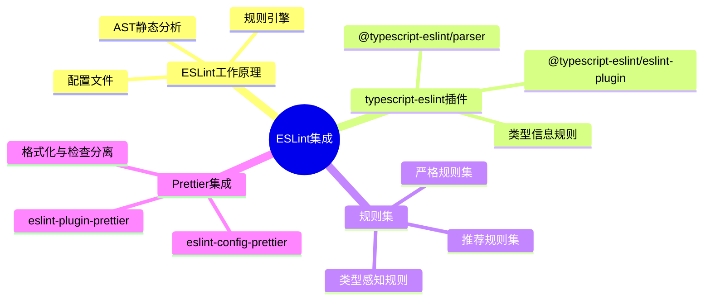

# TypeScript ESLint 集成实践指南

## 知识架构



## 概述

ESLint 是现代前端工程化体系中不可或缺的代码质量保障工具。它通过静态分析识别代码中的问题，并提供自动修复能力，确保代码风格的统一性和代码质量的可靠性。

### ESLint 的核心价值

| 维度         | 作用                   | 示例                             |
| ------------ | ---------------------- | -------------------------------- |
| **风格统一** | 统一代码格式和书写习惯 | 单双引号、缩进、分号等           |
| **代码优化** | 提升代码简洁性和严谨性 | 禁用未使用变量、要求显式类型标注 |
| **错误预防** | 提前发现潜在问题       | 禁止隐式 any、强制空值检查       |
| **团队协作** | 建立统一的代码规范     | 通过配置文件强制执行规范         |

### ESLint 与 TypeScript 的关系

TypeScript 编译器主要负责类型检查，而 ESLint 则专注于代码质量和风格规范。二者协同工作，提供完整的代码质量保障：

```
┌─────────────────────────────────────────────────────────────┐
│                    代码质量保障体系                          │
├─────────────────────────┬───────────────────────────────────┤
│      TypeScript         │            ESLint                 │
├─────────────────────────┼───────────────────────────────────┤
│  ✓ 类型检查             │  ✓ 代码风格检查                   │
│  ✓ 编译错误             │  ✓ 最佳实践建议                   │
│  ✓ 类型推导             │  ✓ 潜在错误识别                   │
│  ✓ 语法转换             │  ✓ 自动修复能力                   │
└─────────────────────────┴───────────────────────────────────┘
```

### 工具链架构图

```
┌─────────────────────────────────────────────────────────────┐
│                    ESLint 工具链架构                         │
├─────────────────────────────────────────────────────────────┤
│                                                             │
│  ┌─────────────┐    ┌─────────────┐    ┌─────────────┐    │
│  │   Parser    │───▶│    Rules    │───▶│   Report    │    │
│  │  解析器     │    │   规则集    │    │   报告      │    │
│  └─────────────┘    └─────────────┘    └─────────────┘    │
│         │                  │                  │            │
│         ▼                  ▼                  ▼            │
│  ┌─────────────┐    ┌─────────────┐    ┌─────────────┐    │
│  │   AST       │    │  Plugins    │    │   Fix       │    │
│  │  语法树     │    │   插件      │    │   自动修复  │    │
│  └─────────────┘    └─────────────┘    └─────────────┘    │
│                                                             │
│  ┌─────────────────────────────────────────────────────┐   │
│  │                   辅助工具                           │   │
│  ├─────────────────────────────────────────────────────┤   │
│  │  Prettier  │  Husky  │  Lint-Staged  │  Editor     │   │
│  │  格式化    │  钩子   │  暂存检查     │  编辑器集成  │   │
│  └─────────────────────────────────────────────────────┘   │
│                                                             │
└─────────────────────────────────────────────────────────────┘
```

> 本节代码见：[ESLint Ruleset](https://link.juejin.cn/?target=https%3A%2F%2Fgithub.com%2Flinbudu599%2FTypeScript-Tiny-Book%2Fblob%2Fmain%2Fpackages%2F19-eslint-config-ts-ruleset%2Findex.js)

---

## ESLint 核心概念

### 工作原理

ESLint 的工作流程包含以下核心步骤：

```
源代码 → 解析器(AST) → 规则检查 → 问题报告 → 自动修复(可选)
```

1. **解析器(Parser)**：将源代码解析为抽象语法树(AST)
2. **规则(Rules)**：基于 AST 进行检查的逻辑单元
3. **插件(Plugins)**：规则集合的封装
4. **配置(Configs)**：规则启用的预设方案

### 核心组件说明

| 组件       | 说明         | 常用示例                                |
| ---------- | ------------ | --------------------------------------- |
| **Parser** | 代码解析器   | `@typescript-eslint/parser`             |
| **Plugin** | 规则插件包   | `@typescript-eslint/eslint-plugin`      |
| **Config** | 预设配置     | `plugin:@typescript-eslint/recommended` |
| **Rule**   | 单条检查规则 | `@typescript-eslint/no-explicit-any`    |

---

## 快速开始

> ⚠️ **版本提示**：自 ESLint 9（2024 年发布）起，推荐使用 flat config（`eslint.config.js`），`.eslintrc.*` 配置文件与 `--ext` 等 CLI 参数已进入废弃流程（legacy 模式仍可通过 `ESLINT_USE_FLAT_CONFIG=false` 使用）。本文以下示例基于 `.eslintrc` 体系，适用于 ESLint 8 及兼容模式；若使用 ESLint 9+，等价的 flat config 如下：
>
> ```javascript
> // eslint.config.js（flat config，ESLint 9+）
> import eslint from "@eslint/js"
> import tseslint from "typescript-eslint"
>
> export default tseslint.config(
>   { ignores: ["dist/**", "build/**"] },
>   eslint.configs.recommended,
>   ...tseslint.configs.recommended
> )
> ```

### 方式一：自动初始化（推荐新手）

使用 ESLint 官方提供的初始化工具，通过交互式问答自动生成配置：

```bash
# npm
npm init @eslint/config

# 或使用 npx
npx eslint --init
```

**交互式配置流程：**

```
? How would you like to use ESLint?
  ❯ To check syntax only
    To check syntax and find problems
    To check syntax, find problems, and enforce code style

? What type of modules does your project use?
  ❯ JavaScript modules (import/export)
    CommonJS (require/exports)
    None of these

? Which framework does your project use?
  ❯ React
    Vue.js
    None of these

? Does your project use TypeScript? › Yes

? Where does your code run?
  ◉ Browser
  ◯ Node
```

**自动安装的依赖包：**

```
- eslint                    # ESLint 核心
- @typescript-eslint/parser # TypeScript 解析器
- @typescript-eslint/eslint-plugin # TypeScript 规则插件
- eslint-plugin-react       # React 相关规则（如果选择了 React）
```

### 方式二：手动配置（推荐有经验者）

#### 步骤 1：安装依赖

```bash
# npm
npm install --save-dev eslint @typescript-eslint/parser @typescript-eslint/eslint-plugin

# yarn
yarn add --dev eslint @typescript-eslint/parser @typescript-eslint/eslint-plugin

# pnpm
pnpm add --save-dev eslint @typescript-eslint/parser @typescript-eslint/eslint-plugin
```

#### 步骤 2：创建配置文件

在项目根目录创建 `.eslintrc.js`：

```javascript
module.exports = {
  root: true,
  env: {
    browser: true,
    es2021: true,
    node: true
  },
  parser: "@typescript-eslint/parser",
  parserOptions: {
    ecmaVersion: "latest",
    sourceType: "module",
    project: "./tsconfig.json"
  },
  plugins: ["@typescript-eslint"],
  extends: [
    "eslint:recommended",
    "plugin:@typescript-eslint/recommended",
    "plugin:@typescript-eslint/recommended-requiring-type-checking"
  ],
  rules: {}
}
```

#### 步骤 3：创建忽略文件

创建 `.eslintignore` 文件：

```ini
# 依赖目录
node_modules/

# 构建产物
dist/
build/
out/

# 配置文件
*.config.js
*.json

# 其他文件
*.html
*.css
*.svg
```

#### 步骤 4：添加 NPM 脚本

在 `package.json` 中添加：

```json
{
  "scripts": {
    "lint": "eslint src --ext .js,.jsx,.ts,.tsx",
    "lint:fix": "eslint src --ext .js,.jsx,.ts,.tsx --fix",
    "lint:ci": "eslint src --ext .js,.jsx,.ts,.tsx --max-warnings 0"
  }
}
```

**执行检查：**

```bash
# 仅检查
npm run lint

# 检查并自动修复
npm run lint:fix

# CI 环境严格检查（任何警告都视为错误）
npm run lint:ci
```

---

## 配置详解

### 配置文件类型对比

| 文件类型         | 优点               | 缺点              | 推荐场景 |
| ---------------- | ------------------ | ----------------- | -------- |
| `.eslintrc.js`   | 可编程、支持注释   | 需要 Node.js 环境 | 复杂配置 |
| `.eslintrc.json` | 标准 JSON 格式     | 不支持注释        | 简单配置 |
| `.eslintrc.yaml` | 格式清晰、可读性好 | 需要 YAML 解析    | 团队协作 |
| `package.json`   | 集中管理           | 结构嵌套深        | 小型项目 |

### 核心配置项说明

#### 1. Parser 配置

```javascript
module.exports = {
  parser: "@typescript-eslint/parser",

  parserOptions: {
    ecmaVersion: 2022,
    sourceType: "module",
    project: "./tsconfig.json",
    tsconfigRootDir: __dirname
  }
}
```

#### 2. Extends 继承配置

```javascript
module.exports = {
  extends: [
    "eslint:recommended",
    "plugin:@typescript-eslint/recommended",
    "plugin:@typescript-eslint/recommended-requiring-type-checking",
    "prettier"
  ]
}
```

**extends 加载顺序：** 从上到下依次加载，后面的配置会覆盖前面的。

#### 3. Rules 规则配置

规则配置语法：

```javascript
rules: {
  'rule-name': 'off' | 'warn' | 'error' | [level, options]
}
```

**规则等级说明：**

| 等级             | 含义     | 退出码 |
| ---------------- | -------- | ------ |
| `'off'` 或 `0`   | 关闭规则 | -      |
| `'warn'` 或 `1`  | 警告     | 0      |
| `'error'` 或 `2` | 错误     | 1      |

**配置示例：**

```javascript
module.exports = {
  rules: {
    "no-console": "warn",

    "@typescript-eslint/explicit-function-return-type": [
      "error",
      {
        allowExpressions: true,
        allowTypedFunctionExpressions: true
      }
    ],

    indent: "off",
    "@typescript-eslint/indent": ["error", 2],

    quotes: "off",
    "@typescript-eslint/quotes": ["error", "single"],

    semi: "off",
    "@typescript-eslint/semi": ["error", "always"]
  }
}
```

#### 4. Plugins 插件配置

```javascript
module.exports = {
  plugins: ["@typescript-eslint", "react", "import"]
}
```

#### 5. Environments 环境配置

```javascript
module.exports = {
  env: {
    browser: true,
    node: true,
    es2021: true,
    jest: true,
    mocha: true
  }
}
```

#### 6. Overrides 覆盖配置

针对特定文件或目录应用不同规则：

```javascript
module.exports = {
  overrides: [
    {
      files: ["**/*.test.ts", "**/*.spec.ts"],
      env: {
        jest: true
      },
      rules: {
        "@typescript-eslint/no-explicit-any": "off"
      }
    },
    {
      files: ["*.config.js", "*.config.ts"],
      rules: {
        "@typescript-eslint/no-var-requires": "off"
      }
    }
  ]
}
```

### React 项目完整配置示例

```javascript
module.exports = {
  root: true,
  env: {
    browser: true,
    es2021: true,
    node: true
  },
  extends: [
    "eslint:recommended",
    "plugin:react/recommended",
    "plugin:react-hooks/recommended",
    "plugin:@typescript-eslint/recommended",
    "plugin:import/recommended",
    "plugin:import/typescript",
    "prettier"
  ],
  parser: "@typescript-eslint/parser",
  parserOptions: {
    ecmaVersion: "latest",
    sourceType: "module",
    ecmaFeatures: {
      jsx: true
    },
    project: "./tsconfig.json"
  },
  plugins: ["react", "react-hooks", "@typescript-eslint", "import"],
  settings: {
    react: {
      version: "detect"
    },
    "import/resolver": {
      typescript: {}
    }
  },
  rules: {
    "react/react-in-jsx-scope": "off",
    "react/prop-types": "off",
    "react-hooks/rules-of-hooks": "error",
    "react-hooks/exhaustive-deps": "warn",

    "@typescript-eslint/explicit-module-boundary-types": "off",
    "@typescript-eslint/no-explicit-any": "warn",
    "@typescript-eslint/no-unused-vars": [
      "error",
      { argsIgnorePattern: "^_", varsIgnorePattern: "^_" }
    ],

    "import/order": [
      "error",
      {
        groups: ["builtin", "external", "internal", "parent", "sibling", "index"],
        "newlines-between": "always",
        alphabetize: { order: "asc" }
      }
    ]
  }
}
```

### Vue 项目配置示例

```javascript
module.exports = {
  root: true,
  env: {
    browser: true,
    es2021: true,
    node: true
  },
  extends: [
    "eslint:recommended",
    "plugin:vue/vue3-recommended",
    "plugin:@typescript-eslint/recommended",
    "prettier"
  ],
  parser: "vue-eslint-parser",
  parserOptions: {
    parser: "@typescript-eslint/parser",
    ecmaVersion: "latest",
    sourceType: "module"
  },
  plugins: ["vue", "@typescript-eslint"],
  rules: {
    "vue/multi-word-component-names": "off",
    "vue/no-v-html": "warn",

    "@typescript-eslint/no-explicit-any": "warn"
  }
}
```

---

## Prettier 集成

### ESLint vs Prettier

| 工具         | 核心功能     | 支持文件类型                            | 典型规则                            |
| ------------ | ------------ | --------------------------------------- | ----------------------------------- |
| **ESLint**   | 代码质量检查 | JS, TS, JSX, TSX                        | `no-unused-vars`, `no-explicit-any` |
| **Prettier** | 代码格式化   | JS, TS, CSS, HTML, JSON, Markdown, YAML | `printWidth`, `tabWidth`, `semi`    |

### 为什么需要两者配合使用？

**ESLint 的局限：**

- 格式化能力有限，不够灵活
- 不支持 CSS、HTML、JSON 等非 JS 文件

**Prettier 的优势：**

- 专注格式化，规则更精细
- 支持多种文件类型
- 开箱即用，配置简单

### 安装配置

#### 1. 安装依赖

```bash
# npm
npm install --save-dev prettier eslint-config-prettier eslint-plugin-prettier

# yarn
yarn add --dev prettier eslint-config-prettier eslint-plugin-prettier

# pnpm
pnpm add --save-dev prettier eslint-config-prettier eslint-plugin-prettier
```

**依赖说明：**

| 包名                     | 作用                                     |
| ------------------------ | ---------------------------------------- |
| `prettier`               | Prettier 核心                            |
| `eslint-config-prettier` | 禁用 ESLint 中与 Prettier 冲突的规则     |
| `eslint-plugin-prettier` | 将 Prettier 规则集成到 ESLint 中（可选） |

#### 2. 创建 Prettier 配置文件

创建 `.prettierrc.js`：

```javascript
module.exports = {
  printWidth: 80,
  tabWidth: 2,
  semi: true,
  singleQuote: true,
  quoteProps: "as-needed",
  jsxSingleQuote: false,
  trailingComma: "es5",
  bracketSpacing: true,
  bracketSameLine: false,
  endOfLine: "lf"
}
```

#### 3. 更新 ESLint 配置

```javascript
module.exports = {
  extends: ["plugin:react/recommended", "plugin:@typescript-eslint/recommended", "prettier"]
}
```

#### 4. 创建忽略文件

创建 `.prettierignore`：

```ini
build
dist
out
node_modules
```

#### 5. 添加 NPM 脚本

```json
{
  "scripts": {
    "eslint": "eslint src/** --no-error-on-unmatched-pattern --ext .js,.jsx,.ts,.tsx --cache",
    "eslint:fix": "npm run eslint -- --fix",
    "prettier": "prettier --check .",
    "prettier:fix": "prettier --write .",
    "lint": "npm run eslint && npm run prettier",
    "lint:fix": "npm run eslint:fix && npm run prettier:fix"
  }
}
```

---

## Git Hooks 与 Lint Staged

### 为什么需要 Git Hooks？

即使配置了 ESLint 和 Prettier，还是可能出现每个人提交代码都不一样的情况。这是因为这些 scripts 需要手动执行，非常容易忘记或者绕过去。而如果我们能让所有开发同学每次提交代码时都自动执行一次格式化，就能确保所有人成功提交上去的代码风格一致。

### Git Hooks 简介

Git Hooks 和 React Hooks 可不一样，它更贴近生命周期的概念，即在某一个操作前后执行的额外逻辑。

**常用 Git Hooks：**

| 钩子名称      | 触发时机        | 典型用途              |
| ------------- | --------------- | --------------------- |
| `pre-commit`  | commit 之前     | 代码格式化、lint 检查 |
| `commit-msg`  | commit 信息验证 | 检查 commit 信息规范  |
| `pre-push`    | push 之前       | 运行测试              |
| `pre-receive` | 服务端接收前    | 服务端验证            |

### Husky 配置

Husky 简化了 Git Hooks 的配置过程。

#### 安装

```bash
# npm
npx husky-init && npm install

# yarn
npx husky-init && yarn

# pnpm
pnpm dlx husky-init && pnpm install
```

#### 添加 pre-commit 钩子

```bash
npx husky add .husky/pre-commit 'npx lint-staged'
```

生成的 `.husky/pre-commit` 文件：

```sh
#!/usr/bin/env sh
. "$(dirname -- "$0")/_/husky.sh"

npx lint-staged
```

### Lint Staged 配置

Lint Staged 的作用是**找出你添加到暂存区（git add）的文件，然后执行对应的 lint**。

#### 安装

```bash
npm install --save-dev lint-staged
yarn add --save-dev lint-staged
pnpm install --save-dev lint-staged
```

#### 配置

在 `package.json` 中添加：

```json
{
  "lint-staged": {
    "*.{js,jsx,ts,tsx}": ["eslint --cache --fix", "prettier --write --list-different"],
    "*.{json,md,html,css,scss,sass,less,styl}": ["prettier --write --list-different"]
  }
}
```

**配置说明：**

- 对于暂存区的 JS/TS 文件，先使用 ESLint 格式化，再使用 Prettier 格式化
- 对于其他文件，统一使用 Prettier 进行格式化

### 工作流程图

```
┌─────────────────────────────────────────────────────────────┐
│                    Git Hooks 工作流程                        │
├─────────────────────────────────────────────────────────────┤
│                                                             │
│  git commit                                                 │
│      │                                                      │
│      ▼                                                      │
│  ┌─────────────┐                                           │
│  │ pre-commit  │                                           │
│  │   钩子触发   │                                           │
│  └──────┬──────┘                                           │
│         │                                                   │
│         ▼                                                   │
│  ┌─────────────┐                                           │
│  │ lint-staged │                                           │
│  │  检查暂存区  │                                           │
│  └──────┬──────┘                                           │
│         │                                                   │
│         ▼                                                   │
│  ┌─────────────────────────────────────────┐               │
│  │           对暂存文件执行检查              │               │
│  ├─────────────────────────────────────────┤               │
│  │  *.ts/*.tsx → ESLint → Prettier         │               │
│  │  *.css/*.json → Prettier                │               │
│  └──────────────────┬──────────────────────┘               │
│                     │                                       │
│         ┌───────────┴───────────┐                          │
│         ▼                       ▼                          │
│  ┌─────────────┐         ┌─────────────┐                  │
│  │   检查通过   │         │   检查失败   │                  │
│  └──────┬──────┘         └──────┬──────┘                  │
│         │                       │                          │
│         ▼                       ▼                          │
│  ┌─────────────┐         ┌─────────────┐                  │
│  │ commit 成功 │         │ commit 失败 │                  │
│  └─────────────┘         └─────────────┘                  │
│                                                             │
└─────────────────────────────────────────────────────────────┘
```

---

## TypeScript ESLint 规则集推荐

### 规则分类

TypeScript ESLint 规则主要由四个部分组成：

| 分类         | 说明                 | 示例规则                                                |
| ------------ | -------------------- | ------------------------------------------------------- |
| **语法解析** | 支持 TypeScript 语法 | `indent`, `quotes`, `semi`                              |
| **语法统一** | 统一语法风格         | `array-type`, `consistent-type-assertions`              |
| **类型标注** | 约束类型标注         | `explicit-function-return-type`, `no-explicit-any`      |
| **能力约束** | 限制特定功能使用     | `prefer-nullish-coalescing`, `no-unnecessary-condition` |

### 使用现成配置

安装配置集：

```bash
npm i eslint-config-ts-ruleset --save-dev
yarn add eslint-config-ts-ruleset --save-dev
pnpm i eslint-config-ts-ruleset --save-dev
```

在 ESLint 配置中启用：

```javascript
module.exports = {
  root: true,
  extends: ["plugin:@typescript-eslint/recommended", "prettier", "ts-ruleset", "ts-ruleset/strict"],
  parser: "@typescript-eslint/parser",
  parserOptions: {
    project: "./tsconfig.json"
  },
  plugins: ["react", "@typescript-eslint"],
  rules: {
    "react/react-in-jsx-scope": "off"
  }
}
```

---

### 一般严格组

#### 语法统一约束

##### array-type

**规则说明**

统一数组的定义方式，强制使用 `T[]` 或 `Array<T>` 语法。

**配置选项**

```javascript
'@typescript-eslint/array-type': ['error', {
  default: 'array',           // 默认使用 T[]
  readonly: 'array',          // readonly 使用 T[]
}]
```

**选项值说明**

| 值               | 说明                                    | 示例                                 |
| ---------------- | --------------------------------------- | ------------------------------------ |
| `'array'`        | 使用 `T[]` 语法                         | `string[]`                           |
| `'generic'`      | 使用 `Array<T>` 语法                    | `Array<string>`                      |
| `'array-simple'` | 简单类型用 `T[]`，复杂类型用 `Array<T>` | `string[]`, `Array<{ foo: string }>` |

**示例**

```typescript
// ❌ default: 'array' 时错误
const arr: Array<string> = ["a", "b", "c"]
const readonlyArr: ReadonlyArray<string> = ["a", "b", "c"]

// ✅ 正确
const arr: string[] = ["a", "b", "c"]
const readonlyArr: readonly string[] = ["a", "b", "c"]
```

##### consistent-type-assertions

**规则说明**

统一类型断言的书写方式，强制使用 `as` 语法或尖括号语法。

**配置选项**

```javascript
'@typescript-eslint/consistent-type-assertions': ['error', {
  assertionStyle: 'as',       // 使用 as 语法
  objectLiteralTypeAssertions: 'allow-as-parameter',  // 对象字面量断言
}]
```

**示例**

```typescript
// ❌ assertionStyle: 'as' 时错误
const foo = <string>bar;

// ✅ 正确
const foo = bar as string;

// 特殊情况：在 JSX 中必须使用 as
const elem = <Component foo={bar as string} />;
```

##### consistent-type-definitions

**规则说明**

统一类型定义方式，强制使用 `interface` 或 `type`。

**配置选项**

```javascript
'@typescript-eslint/consistent-type-definitions': ['error', 'interface']
```

**示例**

```typescript
// ❌ 使用 'interface' 时错误
type User = {
  name: string
  age: number
}

// ✅ 正确
interface User {
  name: string
  age: number
}

// ✅ type 仍可用于联合类型、交叉类型等
type Status = "pending" | "approved" | "rejected"
type UserWithRole = User & { role: string }
```

##### prefer-for-of

**规则说明**

在遍历数组时，如果不需要索引，推荐使用 `for...of` 而不是 `for` 循环。

**示例**

```typescript
// ❌ 不推荐
const array = ["a", "b", "c"]
for (let i = 0; i < array.length; i++) {
  console.log(array[i])
}

// ✅ 推荐
const array = ["a", "b", "c"]
for (const item of array) {
  console.log(item)
}

// ✅ 需要索引时仍可使用 for 循环
for (let i = 0; i < array.length; i++) {
  console.log(i, array[i])
}
```

##### prefer-optional-chain

**规则说明**

推荐使用可选链操作符 `?.` 替代 `&&` 链式判断。

**示例**

```typescript
// ❌ 不推荐
const foo = obj && obj.a && obj.a.b && obj.a.b.c

// ✅ 推荐
const foo = obj?.a?.b?.c

// ❌ 不推荐
const bar = obj && obj.method && obj.method()

// ✅ 推荐
const bar = obj?.method?.()
```

---

#### 类型标注约束

##### explicit-function-return-type

**规则说明**

要求函数显式标注返回值类型。

**配置选项**

```javascript
'@typescript-eslint/explicit-function-return-type': ['error', {
  allowExpressions: true,              // 允许表达式函数不标注
  allowTypedFunctionExpressions: true, // 允许已类型的函数表达式不标注
  allowHigherOrderFunctions: true,     // 允许高阶函数不标注
  allowDirectConstAssertionInArrowFunctions: true, // 允许箭头函数 const 断言
}]
```

**示例**

```typescript
// ❌ 错误
function foo() {
  return "bar"
}

// ✅ 正确
function foo(): string {
  return "bar"
}

// ✅ allowExpressions: true 时允许
const result = [1, 2, 3].map((n) => n * 2)

// ✅ 箭头函数作为变量赋值时
const add = (a: number, b: number): number => a + b
```

##### explicit-module-boundary-types

**规则说明**

要求导出的函数和类的公共成员显式标注返回值类型。

**配置选项**

```javascript
'@typescript-eslint/explicit-module-boundary-types': ['error', {
  allowArgumentsExplicitlyTypedAsAny: true,
  allowedNames: ['handler'],  // 允许的函数名
}]
```

**示例**

```typescript
// ❌ 错误：导出的函数需要标注返回类型
export function add(a: number, b: number) {
  return a + b
}

// ✅ 正确
export function add(a: number, b: number): number {
  return a + b
}

// ✅ 内部函数不需要标注
function internalHelper() {
  return "helper"
}
```

##### no-inferrable-types

**规则说明**

禁止在可以自动推断的地方显式标注类型。

**示例**

```typescript
// ❌ 错误：类型可以自动推断
const foo: number = 1
const bar: string = "bar"
const baz: boolean = true

// ✅ 正确
const foo = 1
const bar = "bar"
const baz = true

// ✅ 允许显式标注（用于文档目的）
const config: MyConfig = {
  /* ... */
}
```

---

### 较为严格组

#### 能力约束

##### no-explicit-any

**规则说明**

禁止使用 `any` 类型，强制使用更具体的类型。

**配置选项**

```javascript
'@typescript-eslint/no-explicit-any': ['error', {
  fixToUnknown: true,         // 自动修复为 unknown
  ignoreRestArgs: true,       // 允许剩余参数使用 any
}]
```

**示例**

```typescript
// ❌ 错误
function foo(value: any): any {
  return value
}

// ✅ 正确
function foo<T>(value: T): T {
  return value
}

// ✅ 使用 unknown 进行类型收窄
function process(value: unknown) {
  if (typeof value === "string") {
    return value.toUpperCase()
  }
}

// ✅ ignoreRestArgs: true 时允许
function merge(target: any, ...sources: any[]) {
  return Object.assign(target, ...sources)
}
```

##### no-unnecessary-condition

**规则说明**

禁止不必要的条件判断，这些判断要么总是真，要么总是假。

**示例**

```typescript
// ❌ 错误：const 推断为字面量类型 "foo"，条件总是真
const value = "foo"
if (value) {
  console.log(value)
}

// ❌ 错误：类型推断已确定
function foo(value: "a" | "b") {
  if (value === "a") {
    return 1
  } else if (value === "b") {
    return 2
  } else {
    // ❌ 这里的 value 类型是 never
    return 3
  }
}

// ✅ 正确：必要的类型收窄
function bar(value: string | number) {
  if (typeof value === "string") {
    return value.toUpperCase()
  }
  return value.toFixed(2)
}
```

##### prefer-nullish-coalescing

**规则说明**

推荐使用空值合并操作符 `??` 替代 `||`，避免对 falsy 值的错误处理。

**配置选项**

```javascript
'@typescript-eslint/prefer-nullish-coalescing': ['error', {
  ignoreConditionalTests: true,
  ignoreMixedLogicalExpressions: true,
}]
```

**示例**

```typescript
// ❌ 错误：|| 会过滤掉 0 和 ''
const foo = value || "default"
const bar = count || 10

// ✅ 正确：使用 ??
const foo = value ?? "default"
const bar = count ?? 10

// 区别说明
const a = 0 || "default" // 'default'（0 是 falsy）
const b = 0 ?? "default" // 0（0 不是 null/undefined）

const c = "" || "default" // 'default'（'' 是 falsy）
const d = "" ?? "default" // ''（'' 不是 null/undefined）
```

##### prefer-readonly

**规则说明**

要求将**类中不会被重新赋值的私有成员**标记为 `readonly`（该规则只作用于类成员，不影响类外的普通变量声明）。

**示例**

```typescript
class Cart {
  // ❌ 错误：私有属性没有被重新赋值，应标记 readonly
  private items: number[] = [1, 2, 3]

  // ✅ 正确
  private readonly items: readonly number[] = [1, 2, 3]

  // ✅ 会被重新赋值的成员不需要 readonly
  private total = 0

  add(n: number) {
    this.total += n
  }
}
```

##### strict-boolean-expressions

**规则说明**

强制在条件语句中使用布尔值，避免隐式类型转换。

**配置选项**

```javascript
'@typescript-eslint/strict-boolean-expressions': ['error', {
  allowString: false,    // 不允许字符串隐式转换
  allowNumber: false,    // 不允许数字隐式转换
  allowNullableObject: true,  // 允许可空对象检查
}]
```

**示例**

```typescript
// ❌ 错误：隐式转换
const value: string = "foo"
if (value) {
  console.log(value)
}

// ✅ 正确：显式检查
if (value.length > 0) {
  console.log(value)
}

// ❌ 错误：数字隐式转换
const count: number = 0
if (count) {
  console.log(count)
}

// ✅ 正确：显式检查
if (count > 0) {
  console.log(count)
}

// ✅ allowNullableObject: true 时允许
const obj: string | null = null
if (obj) {
  // 检查 null/undefined
  console.log(obj)
}
```

##### no-floating-promises

**规则说明**

要求 Promise 必须被正确处理（await、catch 或 void）。

**配置选项**

```javascript
'@typescript-eslint/no-floating-promises': ['error', {
  ignoreVoid: true,  // 允许使用 void 忽略
  ignoreIIFE: true,  // 允许 IIFE 形式
}]
```

**示例**

```typescript
// ❌ 错误：Promise 未被处理
async function fetchData() {
  return fetch("/api/data")
}

fetchData() // Promise 被忽略

// ✅ 正确：使用 await
async function main() {
  await fetchData()
}

// ✅ 正确：使用 catch
fetchData().catch(console.error)

// ✅ 正确：使用 void（ignoreVoid: true）
void fetchData()

// ✅ 正确：使用 then
fetchData().then(console.log)
```

##### await-thenable

**规则说明**

只对 Thenable 类型（Promise）使用 await，避免不必要的 await。

**示例**

```typescript
// ❌ 错误：对非 Promise 使用 await
async function foo() {
  const value = await 42
  const text = await "hello"
}

// ✅ 正确
async function foo() {
  const value = 42
  const text = "hello"
}

// ✅ 正确：对 Promise 使用 await
async function bar() {
  const response = await fetch("/api/data")
  const data = await response.json()
}
```

##### no-misused-promises

**规则说明**

禁止在条件语句中使用 Promise，因为 Promise 对象总是 truthy。

**配置选项**

```javascript
'@typescript-eslint/no-misused-promises': ['error', {
  checksConditionals: true,
  checksVoidReturn: true,
}]
```

**示例**

```typescript
// ❌ 错误：Promise 在条件中总是 truthy
async function checkPermission() {
  return true
}

if (checkPermission()) {
  // 忘记 await
  console.log("allowed")
}

// ✅ 正确
if (await checkPermission()) {
  console.log("allowed")
}

// ❌ 错误：Promise 回调不应该是 async
;[1, 2, 3].forEach(async (item) => {
  await processItem(item)
})

// ✅ 正确：使用 for...of
for (const item of [1, 2, 3]) {
  await processItem(item)
}
```

---

## 规则速查表

### 基础规则

| 规则                                             | 说明              | 推荐等级   |
| ------------------------------------------------ | ----------------- | ---------- |
| `@typescript-eslint/array-type`                  | 统一数组定义方式  | ⭐⭐⭐     |
| `@typescript-eslint/consistent-type-assertions`  | 统一类型断言方式  | ⭐⭐⭐⭐   |
| `@typescript-eslint/consistent-type-definitions` | 统一类型定义方式  | ⭐⭐⭐     |
| `@typescript-eslint/prefer-for-of`               | 推荐使用 for...of | ⭐⭐⭐     |
| `@typescript-eslint/prefer-optional-chain`       | 推荐使用可选链    | ⭐⭐⭐⭐⭐ |

### 严格规则

| 规则                                            | 说明               | 推荐等级   |
| ----------------------------------------------- | ------------------ | ---------- |
| `@typescript-eslint/no-explicit-any`            | 禁止 any 类型      | ⭐⭐⭐⭐⭐ |
| `@typescript-eslint/no-unnecessary-condition`   | 禁止不必要条件     | ⭐⭐⭐⭐   |
| `@typescript-eslint/prefer-nullish-coalescing`  | 推荐空值合并       | ⭐⭐⭐⭐   |
| `@typescript-eslint/strict-boolean-expressions` | 严格布尔检查       | ⭐⭐⭐     |
| `@typescript-eslint/no-floating-promises`       | Promise 必须处理   | ⭐⭐⭐⭐⭐ |
| `@typescript-eslint/await-thenable`             | 只对 Promise await | ⭐⭐⭐⭐   |
| `@typescript-eslint/no-misused-promises`        | 禁止误用 Promise   | ⭐⭐⭐⭐⭐ |

---

## 常见问题解答

### Q1: ESLint 和 TypeScript 编译器的检查有什么区别？

**A**:

- **TypeScript 编译器**：专注于类型检查和语法转换
- **ESLint**：专注于代码风格、最佳实践和潜在错误

两者互补，建议同时使用。

### Q2: 如何解决 ESLint 和 Prettier 的规则冲突？

**A**: 使用 `eslint-config-prettier` 禁用冲突规则：

```javascript
module.exports = {
  extends: [
    "plugin:@typescript-eslint/recommended",
    "prettier" // 必须放在最后
  ]
}
```

### Q3: 如何在 CI/CD 中集成 ESLint？

**A**: 添加 CI 脚本：

```json
{
  "scripts": {
    "lint:ci": "eslint . --ext .js,.jsx,.ts,.tsx --max-warnings 0"
  }
}
```

`--max-warnings 0` 确保任何警告都会导致 CI 失败。

### Q4: 如何临时禁用某条规则？

**A**: 使用注释：

```typescript
// eslint-disable-next-line @typescript-eslint/no-explicit-any
const value: any = JSON.parse(data)

/* eslint-disable @typescript-eslint/no-explicit-any */
const a: any = 1
const b: any = 2
/* eslint-enable @typescript-eslint/no-explicit-any */
```

### Q5: 如何处理第三方库没有类型定义的情况？

**A**:

1. 安装 `@types/package-name`
2. 创建本地声明文件 `declarations.d.ts`：

```typescript
declare module "untyped-package" {
  const value: any
  export default value
}
```

### Q6: 为什么有些规则需要 `parserOptions.project`？

**A**: 某些规则（如 `no-floating-promises`）需要类型信息才能工作。这些规则被称为"类型感知规则"。

```javascript
parserOptions: {
  project: './tsconfig.json',
}
```

### Q7: 如何在 monorepo 中共享 ESLint 配置？

**A**: 创建共享配置包：

```javascript
// packages/eslint-config/index.js
module.exports = {
  extends: ["plugin:@typescript-eslint/recommended", "prettier"],
  rules: {
    // 共享规则
  }
}

// packages/app/.eslintrc.js
module.exports = {
  extends: ["@my-org/eslint-config"]
}
```

---

## 最佳实践总结

### 配置推荐模板

#### 新项目推荐配置

```javascript
// .eslintrc.js
module.exports = {
  root: true,
  env: {
    browser: true,
    es2021: true,
    node: true
  },
  extends: [
    "eslint:recommended",
    "plugin:@typescript-eslint/recommended",
    "plugin:@typescript-eslint/recommended-requiring-type-checking",
    "prettier"
  ],
  parser: "@typescript-eslint/parser",
  parserOptions: {
    ecmaVersion: "latest",
    sourceType: "module",
    project: "./tsconfig.json"
  },
  plugins: ["@typescript-eslint"],
  rules: {
    "@typescript-eslint/no-explicit-any": "error",
    "@typescript-eslint/no-unused-vars": [
      "error",
      {
        argsIgnorePattern: "^_"
      }
    ],
    "@typescript-eslint/explicit-function-return-type": "warn",
    "@typescript-eslint/no-floating-promises": "error",
    "@typescript-eslint/await-thenable": "error"
  }
}
```

#### 渐进式启用策略

```
┌─────────────────────────────────────────────────────────────┐
│                    规则启用策略                              │
├─────────────────────────────────────────────────────────────┤
│                                                             │
│  第一阶段：基础规则                                          │
│  ├── plugin:@typescript-eslint/recommended                  │
│  └── 解决所有 error 级别问题                                 │
│                                                             │
│  第二阶段：类型感知规则                                      │
│  ├── 添加 parserOptions.project                             │
│  ├── plugin:@typescript-eslint/recommended-requiring-type   │
│  └── 解决类型相关问题                                        │
│                                                             │
│  第三阶段：严格规则                                          │
│  ├── no-explicit-any: error                                 │
│  ├── no-floating-promises: error                            │
│  └── 其他团队约定规则                                        │
│                                                             │
└─────────────────────────────────────────────────────────────┘
```

### 编辑器集成

#### VS Code 配置

```json
// .vscode/settings.json
{
  "editor.codeActionsOnSave": {
    "source.fixAll.eslint": "explicit"
  },
  "editor.formatOnSave": true,
  "editor.defaultFormatter": "esbenp.prettier-vscode",
  "eslint.validate": ["javascript", "javascriptreact", "typescript", "typescriptreact"]
}
```

#### 推荐扩展

```json
// .vscode/extensions.json
{
  "recommendations": [
    "dbaeumer.vscode-eslint",
    "esbenp.prettier-vscode",
    "editorconfig.editorconfig"
  ]
}
```

### 配置检查清单

- [ ] ESLint 核心依赖已安装
- [ ] TypeScript 解析器已配置
- [ ] Prettier 已集成并配置
- [ ] Git Hooks 已配置（Husky）
- [ ] Lint Staged 已配置
- [ ] 编辑器集成已完成
- [ ] CI/CD 已集成
- [ ] 团队规则已文档化

---

## 参考资料

- [ESLint 官方文档](https://eslint.org/docs/latest/)
- [TypeScript ESLint 官方文档](https://typescript-eslint.io/)
- [Prettier 官方文档](https://prettier.io/docs/en/index.html)
- [Husky 官方文档](https://typicode.github.io/husky/)
- [Lint Staged 官方文档](https://github.com/okonet/lint-staged)

> 最后更新时间：2026-02-15
