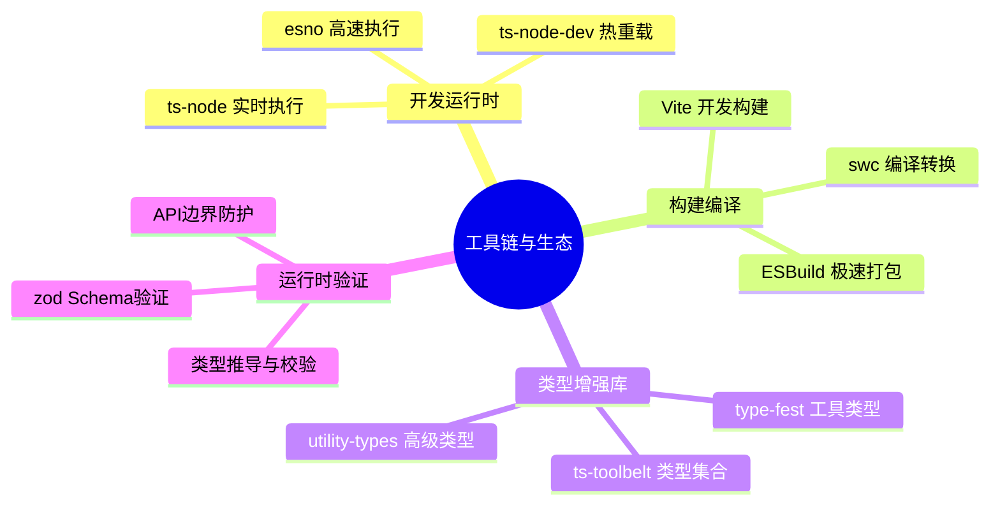

# 全链路 TypeScript 工具库：从开发到部署的全方位指南

## 知识架构



在现代 Web 开发中，TypeScript 已成为提升代码质量与开发效率的关键。然而，要充分发挥其潜力，开发者需要一个强大的工具生态系统来支持。本文将全面梳理从开发、校验、构建到类型增强等各个环节的优秀 TypeScript 工具库，帮助你构建高效、可靠的全链路开发流程。

本文旨在成为你的 TypeScript 工具库"军火库"，无论你是寻求提升开发体验、保障代码质量，还是优化构建性能，都能在这里找到合适的解决方案。

## 工具链架构总览

```
┌─────────────────────────────────────────────────────────────┐
│                  TypeScript 工具链全景图                     │
├─────────────────────────────────────────────────────────────┤
│                                                             │
│  ┌─────────────────────────────────────────────────────┐   │
│  │                   开发阶段                           │   │
│  ├─────────────────────────────────────────────────────┤   │
│  │  ts-node  │ ts-node-dev  │ tsc-watch  │ esno       │   │
│  │  实时执行  │  热重载      │  文件监听   │ 高速执行   │   │
│  └─────────────────────────────────────────────────────┘   │
│                           ↓                                 │
│  ┌─────────────────────────────────────────────────────┐   │
│  │                   类型增强                           │   │
│  ├─────────────────────────────────────────────────────┤   │
│  │  type-fest  │ utility-types  │ ts-toolbelt         │   │
│  │  工具类型   │  高级类型      │  类型集合            │   │
│  └─────────────────────────────────────────────────────┘   │
│                           ↓                                 │
│  ┌─────────────────────────────────────────────────────┐   │
│  │                   校验阶段                           │   │
│  ├─────────────────────────────────────────────────────┤   │
│  │  tsc  │ typescript-eslint  │ zod  │ class-validator │   │
│  │  编译  │ 代码检查           │ 运行时 │ 装饰器校验    │   │
│  └─────────────────────────────────────────────────────┘   │
│                           ↓                                 │
│  ┌─────────────────────────────────────────────────────┐   │
│  │                   构建阶段                           │   │
│  ├─────────────────────────────────────────────────────┤   │
│  │  ESBuild  │ swc  │ Vite  │ tsup  │ dts-bundle      │   │
│  │  打包     │ 编译  │ 构建工具 │ 库打包 │ 类型打包    │   │
│  └─────────────────────────────────────────────────────┘   │
│                                                             │
└─────────────────────────────────────────────────────────────┘
```

## 本文结构

本文将按照工具在开发流程中的不同应用场景进行分类介绍，具体结构如下：

| 阶段         | 核心工具                                          | 主要功能                 |
| ------------ | ------------------------------------------------- | ------------------------ |
| **开发阶段** | ts-node, esno, tsc-watch                          | 提升日常开发效率         |
| **代码生成** | typescript-json-schema, json-schema-to-typescript | 自动化生成代码           |
| **类型增强** | type-fest, utility-types, ts-toolbelt             | 增强类型系统能力         |
| **校验阶段** | tsc, typescript-eslint, zod                       | 保障代码质量与运行时安全 |
| **构建阶段** | ESBuild, swc, Vite, tsup                          | 优化项目构建与打包       |

> **持续更新**：本文内容将持续迭代，欢迎补充你喜爱的工具，共同完善这份 TypeScript 工具指南。

---

## 一、开发阶段

### 1.1 实时执行与热重载

在开发过程中，能够实时看到代码变更的效果至关重要。以下工具提供了强大的实时执行与热重载功能，可大幅提升开发效率。

#### ts-node

**功能说明**

允许你直接在 Node.js 环境中执行 TypeScript 文件，无需预先编译。

**安装与使用**

```bash
# 安装 ts-node
npm install -D ts-node

# 直接运行 .ts 文件
npx ts-node your-script.ts

# 使用 ESM 模式
npx ts-node --esm your-script.ts
```

**配置示例**

```json
// tsconfig.json
{
  "ts-node": {
    "compilerOptions": {
      "module": "CommonJS",
      "moduleResolution": "node"
    },
    "transpileOnly": true, // 跳过类型检查，提升速度
    "files": true // 加载 tsconfig.json 中的 files
  }
}
```

**适用场景**

- 快速原型设计
- 脚本编写
- 运行项目中的构建脚本

#### ts-node-dev

**功能说明**

在 `ts-node` 的基础上增加了文件监听和开发服务器功能，实现了高效的热重载。

**安装与使用**

```bash
# 安装 ts-node-dev
npm install -D ts-node-dev

# 启动开发服务器并监听文件变更
npx ts-node-dev --respawn src/index.ts

# 指定监听目录
npx ts-node-dev --respawn --watch src src/index.ts

# 忽略特定目录
npx ts-node-dev --respawn --ignore node_modules src/index.ts
```

**常用选项**

| 选项               | 说明               |
| ------------------ | ------------------ |
| `--respawn`        | 文件变更时自动重启 |
| `--watch`          | 指定监听目录       |
| `--ignore`         | 忽略监听的目录     |
| `--transpile-only` | 跳过类型检查       |
| `--clear`          | 重启时清屏         |

**适用场景**

- Node.js 后端服务开发
- 需要频繁调试的场景

#### tsc-watch

**功能说明**

一个更灵活的文件监听工具，允许你在编译成功或失败时执行自定义命令。

**安装与使用**

```bash
# 安装
npm install -D tsc-watch

# 编译成功后启动应用
npx tsc-watch --onSuccess "node ./dist/server.js"

# 编译失败时输出提示
npx tsc-watch --onFailure "echo '编译失败，请检查代码！'"

# 完整示例
npx tsc-watch --onSuccess "npm start" --onFailure "npm run notify"
```

**package.json 配置**

```json
{
  "scripts": {
    "dev": "tsc-watch --onSuccess \"npm start\"",
    "start": "node dist/index.js"
  }
}
```

**适用场景**

- 需要将编译与后续任务集成的复杂开发流程
- 服务器重启、测试执行等场景

#### esno

**功能说明**

由 `antfu` 开发，基于 ESBuild 的 `ts-node` 替代品，具有极快的执行速度。

**安装与使用**

```bash
# 安装 esno
npm install -D esno

# 使用 esno 运行 .ts 文件
npx esno index.ts
```

> **注**：esno 已停止维护，作者推荐使用继任工具 **tsx**（同样基于 esbuild，体验更佳）：`npx tsx index.ts`。

**性能对比**（示意数据，实际耗时取决于脚本规模与硬件）：

| 工具                    | 启动时间 | 内存占用 |
| ----------------------- | -------- | -------- |
| ts-node                 | ~1.5s    | 较高     |
| ts-node (transpileOnly) | ~0.8s    | 中等     |
| esno                    | ~0.2s    | 较低     |

**适用场景**

- 追求极致开发效率
- 快速启动时间需求

### 1.2 类型与依赖管理

在 TypeScript 项目中，管理类型定义和依赖关系同样重要。以下工具可以帮助你简化这一过程。

#### typed-install

**功能说明**

自动检测并安装缺失的 `@types` 包。

**安装与使用**

```bash
# 安装 typed-install
npm install -g typed-install

# 使用 typed-install 安装依赖
typed-install lodash
# 自动安装 lodash 和 @types/lodash

# 安装多个依赖
typed-install express axios lodash
```

**适用场景**

- 所有 TypeScript 项目
- 简化依赖管理流程

#### suppress-ts-error

**功能说明**

一键为项目中的 TypeScript 错误添加忽略注释。

**安装与使用**

```bash
# 运行 suppress-ts-errors
npx suppress-ts-errors

# 指定使用 @ts-expect-error
npx suppress-ts-errors --ts-expect-error

# 指定项目路径
npx suppress-ts-errors --project ./packages/core
```

**处理效果**

```typescript
// 处理前
const foo: string = 123 // 类型错误

// 处理后
// @ts-expect-error
const foo: string = 123
```

**适用场景**

- 大型项目重构
- 版本升级时临时禁用类型检查
- 处理暂时无法修复的类型错误

#### ts-error-translator

**功能说明**

将 TypeScript 编译器报错信息翻译成更易于理解的自然语言。

**适用场景**

- TypeScript 初学者
- 希望更直观理解错误信息

---

## 二、代码生成

自动化代码生成是现代开发流程中的重要一环，能够极大减少重复性工作。以下工具专注于在 TypeScript 与其他数据结构定义之间进行转换。

### 2.1 TypeScript → JSON Schema

#### typescript-json-schema

**功能说明**

从 TypeScript 接口或类型生成 JSON Schema。

**安装与使用**

```bash
# 安装
npm install -D typescript-json-schema

# 生成 JSON Schema
npx typescript-json-schema src/types.ts MyInterface -o schema.json
```

**示例**

```typescript
// input.ts
export interface User {
  /**
   * 用户名，最少3个字符
   * @minimum 3
   */
  username: string

  /**
   * 年龄
   * @minimum 0
   * @maximum 150
   */
  age: number

  /**
   * 邮箱地址
   * @format email
   */
  email: string

  /** 角色 */
  role: "admin" | "user" | "guest"
}
```

生成的 JSON Schema：

```json
{
  "$ref": "#/definitions/User",
  "$schema": "http://json-schema.org/draft-07/schema#",
  "definitions": {
    "User": {
      "properties": {
        "username": {
          "description": "用户名，最少3个字符",
          "minLength": 3,
          "type": "string"
        },
        "age": {
          "description": "年龄",
          "maximum": 150,
          "minimum": 0,
          "type": "number"
        },
        "email": {
          "description": "邮箱地址",
          "format": "email",
          "type": "string"
        },
        "role": {
          "description": "角色",
          "enum": ["admin", "user", "guest"],
          "type": "string"
        }
      },
      "required": ["username", "age", "email", "role"],
      "type": "object"
    }
  }
}
```

### 2.2 JSON Schema → TypeScript

#### json-schema-to-typescript

**功能说明**

从 JSON Schema 生成 TypeScript 接口定义。

**安装与使用**

```bash
# 安装
npm install -D json-schema-to-typescript

# 生成 TypeScript
npx json2ts -i schema.json -o types.ts
```

**示例**

```json
// input.json
{
  "title": "User",
  "type": "object",
  "properties": {
    "firstName": { "type": "string" },
    "lastName": { "type": "string" },
    "age": { "type": "integer", "minimum": 0 },
    "tags": {
      "type": "array",
      "items": { "type": "string" }
    }
  },
  "required": ["firstName", "lastName"]
}
```

生成的 TypeScript 接口：

```typescript
export interface User {
  firstName: string
  lastName: string
  age?: number
  tags?: string[]
}
```

> **什么是 JSON Schema？**
>
> JSON Schema 是一种用于描述 JSON 数据结构的规范。它类似于 TypeScript 的类型定义，但独立于任何编程语言，专注于定义数据的结构、约束和元数据。由于其语言无关的特性，JSON Schema 成为不同系统间进行数据交换和校验的理想选择。

### 2.3 代码生成工具对比

| 工具                          | 方向             | 优势             | 适用场景           |
| ----------------------------- | ---------------- | ---------------- | ------------------ |
| **typescript-json-schema**    | TS → JSON Schema | 支持 JSDoc 注释  | API 文档、表单验证 |
| **json-schema-to-typescript** | JSON Schema → TS | 自动推断类型     | API 优先开发       |
| **quicktype**                 | 多格式互转       | 支持多种语言     | 跨语言项目         |
| **openapi-typescript**        | OpenAPI → TS     | 支持 OpenAPI 3.0 | REST API 客户端    |

---

## 三、类型增强与测试

TypeScript 的核心优势在于其强大的类型系统。以下工具库旨在进一步增强类型编程能力，并为复杂的类型逻辑提供测试保障。

### 3.1 类型检查工具

#### tsc

**功能说明**

TypeScript 官方编译器，提供完整的类型检查。

**常用配置**

```json
// tsconfig.json
{
  "compilerOptions": {
    "strict": true,
    "noImplicitAny": true,
    "strictNullChecks": true,
    "noUnusedLocals": true,
    "noUnusedParameters": true,
    "noFallthroughCasesInSwitch": true,
    "noEmit": true,
    "incremental": true
  }
}
```

**NPM 脚本**

```json
{
  "scripts": {
    "typecheck": "tsc --noEmit",
    "typecheck:watch": "tsc --noEmit --watch"
  }
}
```

#### typescript-eslint

**功能说明**

TypeScript 官方 ESLint 插件，提供 TypeScript 特有的 lint 规则。

**配置示例**

```javascript
// eslint.config.js（ESLint 9+ flat config）
import js from "@eslint/js"
import ts from "typescript-eslint"

export default ts.config(
  js.configs.recommended,
  ...ts.configs.recommended,
  ...ts.configs.recommendedTypeChecked,
  {
    languageOptions: {
      parserOptions: {
        project: true,
        tsconfigRootDir: import.meta.dirname
      }
    },
    rules: {
      "@typescript-eslint/no-unused-vars": ["error", { argsIgnorePattern: "^_" }],
      "@typescript-eslint/no-explicit-any": "warn",
      "@typescript-eslint/no-floating-promises": "error",
      "@typescript-eslint/no-misused-promises": "error"
    }
  }
)
```

### 3.2 工具类型库

这些库提供了大量预设的工具类型，能够简化复杂的类型操作。

#### type-fest

**功能说明**

目前最流行和全面的工具类型库，由 Sindre Sorhus 开发。

**安装**

```bash
npm install type-fest
```

**常用类型示例**

```typescript
import type {
  SetRequired,
  SetOptional,
  Merge,
  OmitIndexSignature,
  CamelCase,
  SnakeCase,
  Jsonify,
  PartialDeep,
  ReadonlyDeep
} from "type-fest"

// SetRequired - 将指定属性设为必选
interface User {
  name?: string
  age?: number
  email?: string
}
type RequiredUser = SetRequired<User, "name" | "email">
// { name: string; age?: number; email: string; }

// Merge - 合并两个类型
type Merged = Merge<{ a: string }, { b: number }>
// { a: string; b: number; }

// CamelCase - 转换为驼峰命名
type Camel = CamelCase<"foo-bar-baz">
// 'fooBarBaz'

// Jsonify - 转换为可 JSON 序列化的类型
class User {
  name!: string
  birthDate = new Date()
}
type JsonUser = Jsonify<User>
// { name: string; birthDate: string; }

// PartialDeep - 深层 Partial
interface Config {
  server: {
    host: string
    port: number
  }
}
type PartialConfig = PartialDeep<Config>
// { server?: { host?: string; port?: number; } }
```

#### utility-types

**功能说明**

一个轻量级但功能强大的工具类型库。

**安装**

```bash
npm install utility-types
```

**常用类型示例**

```typescript
import type {
  DeepPartial,
  DeepReadonly,
  DeepRequired,
  PickByValue,
  OmitByValue
} from "utility-types"

// DeepPartial - 深层可选
interface Settings {
  theme: {
    primary: string
    secondary: string
  }
}
type PartialSettings = DeepPartial<Settings>
// { theme?: { primary?: string; secondary?: string; } }

// DeepReadonly - 深层只读
type ReadonlySettings = DeepReadonly<Settings>
// { readonly theme: { readonly primary: string; readonly secondary: string; }; }

// PickByValue - 按值类型选取属性
interface User {
  name: string
  age: number
  email: string
  isActive: boolean
}
type StringProps = PickByValue<User, string>
// { name: string; email: string; }
```

#### ts-toolbelt

**功能说明**

一个功能极其丰富的工具类型库，号称"TypeScript 的 Lodash"。

**安装**

```bash
npm install ts-toolbelt
```

**常用类型示例**

```typescript
import type { Object, List, String, Number } from "ts-toolbelt"

// Object 操作
type Update = Object.Update<{ a: 1; b: 2 }, "a", 3>
// { a: 3; b: 2; }

// List 操作
type Take = List.Take<[1, 2, 3, 4, 5], 3>
// [1, 2, 3]

// String 操作
type Split = String.Split<"a-b-c", "-">
// ['a', 'b', 'c']
```

### 3.3 工具类型库对比

| 库名              | 类型数量 | 包大小 | 特点             |
| ----------------- | -------- | ------ | ---------------- |
| **type-fest**     | 100+     | 8KB    | 最流行、文档完善 |
| **utility-types** | 30+      | 4KB    | 轻量级、专注实用 |
| **ts-toolbelt**   | 200+     | 15KB   | 功能最全面       |

### 3.4 类型测试

在编写复杂的工具类型时，确保其行为符合预期至关重要。

#### tsd

**功能说明**

用于对 TypeScript 类型定义进行单元测试的工具。

**安装**

```bash
npm install -D tsd
```

**使用示例**

```typescript
// src/utils.ts
export type DeepPartial<T> = {
  [P in keyof T]?: T[P] extends object ? DeepPartial<T[P]> : T[P]
}

// test/utils.test-d.ts
import { expectType, expectError } from "tsd"
import type { DeepPartial } from "../src/utils"

interface Config {
  name: string
  options: {
    debug: boolean
    timeout: number
  }
}

// 测试类型推断
expectType<DeepPartial<Config>>({
  name: "test"
})

expectType<DeepPartial<Config>>({
  options: {
    debug: true
  }
})

// 测试错误情况
expectError<DeepPartial<Config>>({
  name: 123 // 应该报错
})
```

**package.json 配置**

```json
{
  "scripts": {
    "test:types": "tsd"
  }
}
```

#### conditional-type-checks

**功能说明**

一个轻量级的类型测试工具，利用 TypeScript 的条件类型进行断言。

**安装**

```bash
npm install -D conditional-type-checks
```

**使用示例**

```typescript
import { assert, IsExact, IsNullable } from "conditional-type-checks"

type MyType = string | number

// 断言类型相等
assert<IsExact<MyType, string | number>>(true)

// 断言类型可空
assert<IsNullable<string | null>>(true)
assert<IsNullable<string>>(false)
```

---

## 四、运行时校验与类型防护

虽然 TypeScript 在编译时提供了强大的类型检查，但在与外部数据（如 API 响应、用户输入）交互时，运行时的数据校验同样不可或缺。

### 4.1 Schema 校验

#### zod

**功能说明**

一个以 TypeScript 为核心的 Schema 校验库，具有强大的类型推断能力。

**安装**

```bash
npm install zod
```

**基础使用**

```typescript
import { z } from "zod"

// 定义 Schema
const UserSchema = z.object({
  username: z.string().min(3, "用户名至少需要 3 个字符"),
  email: z.string().email("无效的邮箱地址"),
  age: z.number().int().positive().optional(),
  role: z.enum(["admin", "user", "guest"]).default("user")
})

// 从 Schema 推断类型
type User = z.infer<typeof UserSchema>
// { username: string; email: string; age?: number; role: 'admin' | 'user' | 'guest' }

// 校验数据
const result = UserSchema.safeParse({
  username: "john",
  email: "john@example.com"
})

if (result.success) {
  console.log(result.data) // 类型安全的访问
} else {
  console.log(result.error.errors) // 详细错误信息
}
```

**高级用法**

```typescript
// 嵌套对象
const ConfigSchema = z.object({
  server: z.object({
    host: z.string(),
    port: z.number().default(3000)
  }),
  database: z.object({
    url: z.string(),
    pool: z.number().optional()
  })
})

// 联合类型
const ResultSchema = z.discriminatedUnion("status", [
  z.object({ status: z.literal("success"), data: z.string() }),
  z.object({ status: z.literal("error"), error: z.string() })
])

// 异步校验
const AsyncSchema = z.object({
  email: z
    .string()
    .email()
    .refine(
      async (email) => {
        const exists = await checkEmailExists(email)
        return !exists
      },
      { message: "邮箱已存在" }
    )
})

// 变换
const TrimmedString = z.string().trim()
const DateFromString = z.string().transform((val) => new Date(val))
```

**与框架集成**

```typescript
// Next.js API Route
import { z } from "zod"

const RequestSchema = z.object({
  name: z.string(),
  email: z.string().email()
})

export async function POST(request: Request) {
  const body = await request.json()
  const result = RequestSchema.safeParse(body)

  if (!result.success) {
    return Response.json({ errors: result.error.errors }, { status: 400 })
  }

  // result.data 类型安全
  return Response.json({ success: true, data: result.data })
}
```

#### class-validator

**功能说明**

一个基于装饰器的校验库，与 `class-transformer` 配合使用功能强大。

**安装**

```bash
npm install class-validator class-transformer
```

**使用示例**

```typescript
import { IsString, IsEmail, IsInt, Min, Max, MinLength, MaxLength, validate, validateOrReject } from "class-validator"

export class User {
  @IsString()
  @MinLength(3)
  @MaxLength(20)
  username!: string

  @IsEmail()
  email!: string

  @IsInt()
  @Min(0)
  @Max(150)
  age!: number
}

// 校验实例
const user = new User()
user.username = "jo" // 太短
user.email = "invalid-email"
user.age = -1

const errors = await validate(user)
if (errors.length > 0) {
  console.log("校验失败:", errors)
}

// 或使用 reject 模式
try {
  await validateOrReject(user)
} catch (errors) {
  console.log("校验失败:", errors)
}
```

**NestJS 集成**

```typescript
import { Controller, Post, Body } from "@nestjs/common"
import { IsString, IsEmail } from "class-validator"

class CreateUserDto {
  @IsString()
  name!: string

  @IsEmail()
  email!: string
}

@Controller("users")
export class UsersController {
  @Post()
  create(@Body() createUserDto: CreateUserDto) {
    // 自动校验
    return { success: true }
  }
}
```

#### superstruct

**功能说明**

一个简单、可组合的运行时数据校验库。

**安装**

```bash
npm install superstruct
```

**使用示例**

```typescript
import { object, string, number, optional, assert, is } from "superstruct"

// 定义结构
const UserStruct = object({
  name: string(),
  email: string(),
  age: optional(number())
})

// 校验数据
const data = { name: "John", email: "john@example.com" }

if (is(data, UserStruct)) {
  console.log(data.name) // 类型安全
}

// 或使用 assert
try {
  assert(data, UserStruct)
} catch (error) {
  console.log("校验失败:", error)
}
```

### 4.2 运行时校验工具对比

| 工具                | 类型推断 | 包大小 | 性能 | 装饰器支持 | 适用场景             |
| ------------------- | -------- | ------ | ---- | ---------- | -------------------- |
| **zod**             | 极好     | 11KB   | 快   | 无         | 通用校验、全栈应用   |
| **class-validator** | 无       | 25KB   | 中   | 有         | NestJS、基于类的架构 |
| **superstruct**     | 好       | 6KB    | 快   | 无         | 轻量级需求           |
| **yup**             | 好       | 14KB   | 中   | 无         | 表单校验             |
| **io-ts**           | 极好     | 8KB    | 快   | 无         | 函数式编程           |
| **valibot**         | 极好     | 0.8KB  | 极快 | 无         | 极小包体积           |
| **ArkType**         | 极好     | 5KB    | 极快 | 无         | 高性能需求           |

> **选型建议**：
>
> - 追求类型安全与开发体验：选择 **zod**
> - 使用 NestJS 或基于类架构：选择 **class-validator**
> - 追求极致性能和小体积：选择 **valibot** 或 **ArkType**
> - 函数式编程偏好：选择 **io-ts**

### 4.3 类型覆盖率

#### typescript-coverage-report

**功能说明**

生成项目中类型覆盖率的报告。

**安装与使用**

```bash
# 安装
npm install -D typescript-coverage-report

# 生成报告
npx typescript-coverage-report

# 指定阈值
npx typescript-coverage-report --threshold 95
```

**CI 集成**

```yaml
# .github/workflows/type-coverage.yml
name: Type Coverage
on: [push, pull_request]

jobs:
  coverage:
    runs-on: ubuntu-latest
    steps:
      - uses: actions/checkout@v4
      - uses: actions/setup-node@v4
      - run: npm ci
      - run: npx typescript-coverage-report --threshold 95
```

---

## 五、API 文档生成

### 5.1 TypeDoc

**功能说明**

TypeScript 官方推荐的 API 文档生成器。

**安装与使用**

```bash
# 安装
npm install -D typedoc

# 生成文档
npx typedoc src/index.ts
```

**配置示例**

```json
// typedoc.json
{
  "entryPoints": ["src/index.ts"],
  "out": "docs",
  "plugin": ["typedoc-plugin-markdown"],
  "readme": "none",
  "gitRevision": "main",
  "excludePrivate": true,
  "excludeProtected": false,
  "theme": "default"
}
```

**JSDoc 注释示例**

````typescript
/**
 * 用户服务类
 *
 * @example
 * ```typescript
 * const userService = new UserService();
 * const user = await userService.findById(1);
 * ```
 */
export class UserService {
  /**
   * 根据ID查找用户
   *
   * @param id - 用户ID
   * @returns 用户对象，如果未找到则返回 null
   * @throws {NotFoundError} 当用户不存在时抛出
   *
   * @example
   * ```typescript
   * const user = await userService.findById(1);
   * console.log(user.name);
   * ```
   */
  async findById(id: number): Promise<User | null> {
    // ...
  }
}
````

### 5.2 API Extractor

**功能说明**

Microsoft 官方工具，用于管理 API 文档和类型声明。

**安装与使用**

```bash
# 安装
npm install -D @microsoft/api-extractor

# 初始化配置
npx api-extractor init

# 运行
npx api-extractor run
```

**配置示例**

```json
// api-extractor.json
{
  "$schema": "https://developer.microsoft.com/json-schemas/api-extractor/v7/api-extractor.schema.json",
  "mainEntryPointFilePath": "./dist/index.d.ts",
  "dtsRollup": {
    "enabled": true,
    "untrimmedFilePath": "./dist/<unscopedPackageName>.d.ts"
  },
  "apiReport": {
    "enabled": true,
    "reportFolder": "./temp/"
  },
  "docModel": {
    "enabled": true,
    "apiJsonFilePath": "./temp/<unscopedPackageName>.api.json"
  }
}
```

---

## 六、构建与打包

构建是开发流程的最后一环，负责将 TypeScript 代码转换为可在生产环境运行的 JavaScript。

### 6.1 高性能编译器

#### ESBuild

**功能说明**

一个用 Go 编写的 JavaScript 打包器和压缩器，以其惊人的速度而闻名。

**安装与使用**

```bash
# 安装
npm install -D esbuild

# 直接编译
npx esbuild src/index.ts --bundle --outfile=dist/bundle.js

# 监听模式
npx esbuild src/index.ts --bundle --outfile=dist/bundle.js --watch

# 压缩
npx esbuild src/index.ts --bundle --outfile=dist/bundle.js --minify
```

**API 使用**

```javascript
import * as esbuild from "esbuild"

// 一次性构建
await esbuild.build({
  entryPoints: ["src/index.ts"],
  bundle: true,
  outfile: "dist/bundle.js",
  minify: true,
  sourcemap: true,
  platform: "node",
  target: "node18",
  external: ["fs", "path"]
})

// 增量构建
const ctx = await esbuild.context({
  entryPoints: ["src/index.ts"],
  bundle: true,
  outfile: "dist/bundle.js"
})

await ctx.watch()
await ctx.dispose()
```

**性能对比**（示意数据，量级参考 esbuild 官方 benchmark，实际因项目而异）：

| 工具    | 构建时间 | 压缩后大小 |
| ------- | -------- | ---------- |
| Webpack | 10s      | 150KB      |
| Rollup  | 8s       | 145KB      |
| ESBuild | 0.5s     | 148KB      |

**限制**

- 对装饰器的支持有限
- 不做类型检查

#### swc

**功能说明**

一个用 Rust 编写的 JavaScript/TypeScript 编译器，旨在替代 Babel。

**安装与使用**

```bash
# 安装
npm install -D @swc/core @swc/cli

# 编译
npx swc src -d dist

# 监听模式
npx swc src -d dist --watch
```

**配置示例**

```javascript
// .swcrc
{
  "jsc": {
    "parser": {
      "syntax": "typescript",
      "decorators": true,
      "dynamicImport": true
    },
    "transform": {
      "legacyDecorator": true,
      "decoratorMetadata": true
    },
    "target": "es2020",
    "loose": false,
    "externalHelpers": true
  },
  "module": {
    "type": "es6"
  },
  "minify": {
    "compress": true,
    "mangle": true
  }
}
```

**与框架集成**

```javascript
// Next.js
// next.config.js
module.exports = {
  swcMinify: true
}

// Vite
// vite.config.ts
import { defineConfig } from "vite"

export default defineConfig({
  esbuild: false,
  plugins: [
    {
      name: "swc",
      transform(code, id) {
        if (id.endsWith(".ts") || id.endsWith(".tsx")) {
          return swc.transform(code, {
            jsc: {
              parser: { syntax: "typescript" }
            }
          })
        }
      }
    }
  ]
})
```

### 6.2 Webpack 集成

#### fork-ts-checker-webpack-plugin

**功能说明**

在独立的进程中运行 TypeScript 类型检查，避免阻塞 Webpack 的编译流程。

**安装与使用**

```bash
npm install -D fork-ts-checker-webpack-plugin
```

**Webpack 配置**

```javascript
const ForkTsCheckerWebpackPlugin = require("fork-ts-checker-webpack-plugin")

module.exports = {
  module: {
    rules: [
      {
        test: /\.tsx?$/,
        loader: "ts-loader",
        options: {
          transpileOnly: true // 跳过类型检查
        }
      }
    ]
  },
  plugins: [
    new ForkTsCheckerWebpackPlugin({
      typescript: {
        diagnosticOptions: {
          semantic: true,
          syntactic: true
        },
        mode: "write-references"
      },
      eslint: {
        files: "./src/**/*.{ts,tsx}"
      }
    })
  ]
}
```

### 6.3 库打包工具

#### tsup

**功能说明**

基于 ESBuild 的零配置库打包工具。

**安装与使用**

```bash
# 安装
npm install -D tsup

# 打包
npx tsup src/index.ts

# 多入口
npx tsup src/index.ts src/cli.ts
```

**配置示例**

```typescript
// tsup.config.ts
import { defineConfig } from "tsup"

export default defineConfig({
  entry: ["src/index.ts"],
  format: ["cjs", "esm", "iife"],
  dts: true, // 生成类型声明
  sourcemap: true,
  clean: true,
  minify: true,
  splitting: false,
  external: ["react", "react-dom"],
  treeshake: true,
  outDir: "dist",
  target: "es2020"
})
```

**package.json 配置**

```json
{
  "name": "my-lib",
  "main": "./dist/index.js",
  "module": "./dist/index.mjs",
  "types": "./dist/index.d.ts",
  "exports": {
    ".": {
      "require": "./dist/index.js",
      "import": "./dist/index.mjs",
      "types": "./dist/index.d.ts"
    }
  },
  "files": ["dist"],
  "scripts": {
    "build": "tsup"
  }
}
```

#### dts-bundle-generator

**功能说明**

将多个 `.d.ts` 文件打包成单个文件。

**安装与使用**

```bash
# 安装
npm install -D dts-bundle-generator

# 生成单个 d.ts 文件
npx dts-bundle-generator -o dist/index.d.ts src/index.ts
```

**配置示例**

```javascript
// dts-config.js
module.exports = {
  entries: [
    {
      filePath: "./src/index.ts",
      outFilePath: "./dist/index.d.ts",
      noCheck: false,
      output: {
        sortNodes: true,
        noBanner: true
      }
    }
  ]
}
```

### 6.4 构建工具对比

| 工具        | 类型     | 速度 | 适用场景              |
| ----------- | -------- | ---- | --------------------- |
| **ESBuild** | 打包器   | 极快 | 应用打包、Vite 底层   |
| **swc**     | 编译器   | 极快 | 代码转换、Next.js     |
| **Vite**    | 构建工具 | 快   | 现代前端应用          |
| **tsup**    | 库打包   | 快   | npm 库打包            |
| **Rollup**  | 打包器   | 中   | 库打包、Vite 生产构建 |
| **Webpack** | 打包器   | 慢   | 复杂企业应用          |

---

## 七、工具选型指南

### 7.1 按项目类型选型

```
┌─────────────────────────────────────────────────────────────┐
│                    工具选型决策树                            │
├─────────────────────────────────────────────────────────────┤
│                                                             │
│  项目类型？                                                  │
│       │                                                     │
│       ├── 前端应用                                          │
│       │       │                                             │
│       │       ├── React/Vue → Vite + zod + type-fest       │
│       │       └── 大型企业应用 → Webpack + ESLint          │
│       │                                                     │
│       ├── 后端服务                                          │
│       │       │                                             │
│       │       ├── NestJS → class-validator + swc           │
│       │       └── Express/Fastify → zod + ts-node-dev      │
│       │                                                     │
│       ├── npm 库                                            │
│       │       │                                             │
│       │       └── tsup + dts-bundle-generator + tsd        │
│       │                                                     │
│       └── Monorepo                                          │
│               │                                             │
│               └── Turborepo + pnpm + 共享 ESLint 配置       │
│                                                             │
└─────────────────────────────────────────────────────────────┘
```

### 7.2 按功能需求选型

| 需求         | 推荐工具      | 备选方案                |
| ------------ | ------------- | ----------------------- |
| 快速原型开发 | ts-node, esno | ts-node-dev             |
| 类型安全校验 | zod           | io-ts, valibot          |
| 工具类型     | type-fest     | ts-toolbelt             |
| 高性能构建   | ESBuild, swc  | Vite                    |
| 库打包       | tsup          | Rollup                  |
| API 文档     | TypeDoc       | API Extractor           |
| 类型测试     | tsd           | conditional-type-checks |

---

## 八、常见问题解答

### Q1: ts-node 和 esno 该选哪个？

**A**:

- **ts-node**：功能完整，支持所有 TypeScript 特性，适合复杂项目
- **esno**：速度更快，适合简单脚本和追求效率的场景

```bash
# 需要完整类型检查
npx ts-node script.ts

# 追求速度
npx esno script.ts
```

### Q2: zod 和 class-validator 如何选择？

**A**:

- **zod**：函数式风格，类型推断强大，适合现代全栈应用
- **class-validator**：装饰器风格，与 NestJS 完美集成

```typescript
// zod - 函数式
const Schema = z.object({ name: z.string() })

// class-validator - 装饰器
class User {
  @IsString() name!: string
}
```

### Q3: 如何在 monorepo 中共享 TypeScript 配置？

**A**: 创建共享配置包：

```json
// packages/tsconfig/base.json
{
  "compilerOptions": {
    "strict": true,
    "esModuleInterop": true,
    "skipLibCheck": true
  }
}

// packages/app/tsconfig.json
{
  "extends": "@my-org/tsconfig/base.json",
  "compilerOptions": {
    "outDir": "./dist"
  }
}
```

### Q4: 如何处理第三方库缺少类型声明的情况？

**A**:

```typescript
// 方案1：安装 @types 包
npm install -D @types/lodash

// 方案2：创建本地声明文件
// src/types/unknown-lib.d.ts
declare module 'unknown-lib' {
  export function doSomething(input: string): number;
}

// 方案3：快速临时方案（不推荐）
import legacy from 'legacy-lib'; // @ts-ignore
```

### Q5: Vite 项目中如何配置路径别名？

**A**:

```typescript
// vite.config.ts
import { defineConfig } from 'vite';
import path from 'path';

export default defineConfig({
  resolve: {
    alias: {
      '@': path.resolve(__dirname, './src'),
      '@components': path.resolve(__dirname, './src/components')
    }
  }
});

// tsconfig.json 同步配置
{
  "compilerOptions": {
    "baseUrl": ".",
    "paths": {
      "@/*": ["src/*"],
      "@components/*": ["src/components/*"]
    }
  }
}
```

### Q6: 如何提升 TypeScript 编译速度？

**A**:

```json
// tsconfig.json
{
  "compilerOptions": {
    "incremental": true, // 增量编译
    "skipLibCheck": true, // 跳过库检查
    "noEmit": true, // 仅类型检查
    "tsBuildInfoFile": ".tsbuildinfo"
  }
}
```

```bash
# 使用 swc 替代 tsc 进行代码转换
npx swc src -d dist

# 类型检查单独运行
npx tsc --noEmit
```

---

## 九、最佳实践总结

### 9.1 推荐工具组合

#### 前端应用

```json
{
  "devDependencies": {
    "typescript": "^5.0.0",
    "vite": "^5.0.0",
    "esbuild": "^0.20.0",
    "zod": "^3.22.0",
    "type-fest": "^4.0.0",
    "@typescript-eslint/eslint-plugin": "^7.0.0",
    "prettier": "^3.0.0"
  }
}
```

#### 后端服务

```json
{
  "devDependencies": {
    "typescript": "^5.0.0",
    "ts-node-dev": "^2.0.0",
    "@swc/core": "^1.3.0",
    "class-validator": "^0.14.0",
    "class-transformer": "^0.5.0",
    "@typescript-eslint/eslint-plugin": "^7.0.0"
  }
}
```

#### npm 库

```json
{
  "devDependencies": {
    "typescript": "^5.0.0",
    "tsup": "^8.0.0",
    "dts-bundle-generator": "^9.0.0",
    "tsd": "^0.30.0",
    "type-fest": "^4.0.0"
  }
}
```

### 9.2 工具链配置检查清单

- [ ] TypeScript 版本已更新到最新稳定版
- [ ] tsconfig.json 已配置 strict 模式
- [ ] ESLint 已配置 TypeScript 规则
- [ ] Prettier 已配置并集成
- [ ] 运行时校验工具已选择并配置
- [ ] 构建工具已优化性能
- [ ] 类型覆盖率检查已集成到 CI
- [ ] API 文档生成已配置

### 9.3 性能优化建议

以下提升幅度为经验性估算，实际效果因项目规模与硬件而异：

| 优化项       | 建议                | 预期提升 |
| ------------ | ------------------- | -------- |
| 增量编译     | 启用 `incremental`  | 50-80%   |
| 跳过库检查   | 启用 `skipLibCheck` | 20-40%   |
| 使用 swc     | 替代 tsc 转换       | 10-20x   |
| 类型检查分离 | `noEmit` + 单独检查 | 30-50%   |
| 项目引用     | 大型项目拆分        | 40-60%   |

---

## 参考资料

- [TypeScript 官方文档](https://www.typescriptlang.org/docs/)
- [ESBuild 官方文档](https://esbuild.github.io/)
- [swc 官方文档](https://swc.rs/)
- [zod 官方文档](https://zod.dev/)
- [type-fest GitHub](https://github.com/sindresorhus/type-fest)
- [TypeDoc 官方文档](https://typedoc.org/)

> 最后更新时间：2026-02-15
