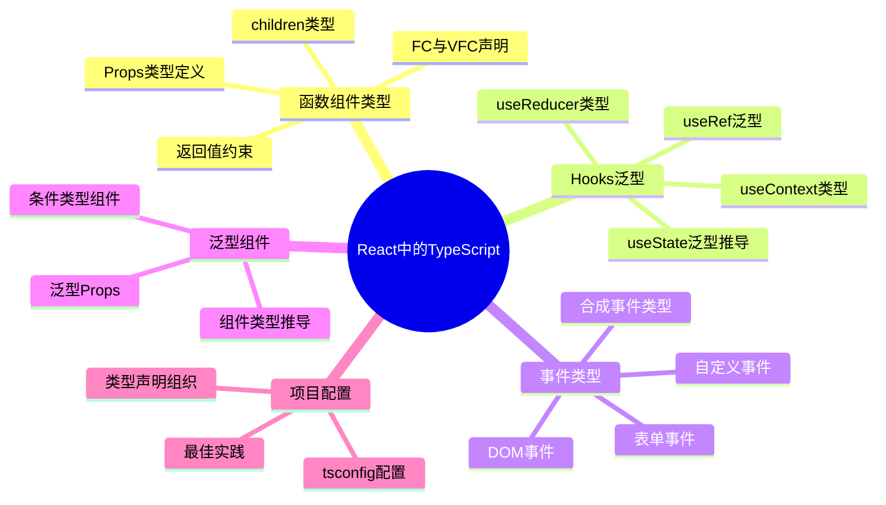

# React 中的 TypeScript

## 知识架构



## 概述

本文档详细介绍 React 项目中 TypeScript 的集成与应用，涵盖组件声明、泛型坑位、内置类型定义及工程实践规范。React 与 TypeScript 能够紧密协作，`.tsx` 文件本质上是 TypeScript 文件的扩展，可直接享受类型检查能力。

### 核心内容

| 模块 | 说明 |
|------|------|
| **组件声明** | 函数组件声明方式、属性类型检查、返回值约束 |
| **泛型坑位** | React Hooks 中的泛型参数及其类型推导 |
| **内置类型** | 事件类型、元素类型、工具类型等 |
| **工程实践** | 项目配置、类型组织、最佳实践 |

### 适用人群

- 具备 TypeScript 基础知识的开发者
- 希望在 React 项目中应用类型安全的团队
- 需要提升代码质量和可维护性的项目

> **注意**：本文档仅介绍函数式组件，不涉及 Class 组件。示例代码关注类型定义，实际运行请参考配套仓库。

> **配套代码**：[React TypeScript Demo](https://link.juejin.cn/?target=https%3A%2F%2Fgithub.com%2Flinbudu599%2FTypeScript-Tiny-Book%2Ftree%2Fmain%2Fpackages%2F18-react-ts)

---

## 一、项目初始化

### 1.1 使用 Vite 创建项目

推荐使用 Vite 进行项目搭建：

```bash
npx create-vite
```

按提示输入项目名，选择 `react-ts` 模板即可。

**项目结构**：

```
project/
├── index.html
├── package.json
├── src/
│   ├── App.css
│   ├── App.tsx
│   ├── index.css
│   ├── main.tsx
│   └── vite-env.d.ts
├── tsconfig.json
├── tsconfig.node.json
└── vite.config.ts
```

### 1.2 其他脚手架工具

#### Create React App

```bash
npm install create-react-app -g
create-react-app your-project --template=typescript
```

#### Parcel

参考模板：[Parcel-Tsx-Template](https://link.juejin.cn/?target=https%3A%2F%2Fgithub.com%2FLinbuduLab%2FParcel-Tsx-Template)

#### 工具对比

| 工具 | 特点 | 适用场景 |
|------|------|----------|
| **Vite** | 基于 ESM，启动快，热更新迅速 | 现代项目首选 |
| **Create React App** | 功能全面，配置完善 | 传统 React 项目 |
| **Parcel** | 零配置，开箱即用 | 快速原型开发 |

---

## 二、项目配置详解

### 2.1 类型定义包

Vite 模板自动安装 `@types/react` 与 `@types/react-dom`，TypeScript 会自动加载 `node_modules/@types` 下的类型定义。

**从 React 导入类型**：

```typescript
// 值导入
import { FC } from "react";

// 类型导入（推荐）
import type { FC } from "react";
```

### 2.2 环境声明文件

`vite-env.d.ts` 文件通过三斜线指令引入 Vite 客户端类型：

```typescript
/// <reference types="vite/client" />
```

**`vite/client` 包含的类型定义**：

```typescript
/// <reference lib="dom" />
/// <reference path="./types/importMeta.d.ts" />

// CSS Modules
type CSSModuleClasses = { readonly [key: string]: string }

declare module '*.module.css' {
  const classes: CSSModuleClasses
  export default classes
}

// CSS 文件
declare module '*.css' {
  const css: string
  export default css
}

// 图片资源
declare module '*.jpg' {
  const src: string
  export default src
}

// 字体文件
declare module '*.woff' {
  const src: string
  export default src
}
```

这些声明确保导入非代码文件（CSS、图片、字体等）时能获得类型提示。

### 2.3 替代方案

使用 `import` 替代三斜线指令：

```typescript
// vite-env.d.ts
import * as ViteClientEnv from 'vite/client';
// 或使用 type-only 导入
import type * as ViteClientEnv from 'vite/client';
```

---

## 三、组件声明

### 3.1 声明方式对比

React 函数组件主要有两种声明方式：

#### 方式一：简单函数声明

```tsx
// 无 props
const Container = () => {
  return <p>林不渡！</p>;
};

// 有 props
export interface IContainerProps {
  visible: boolean;
  controller: () => void;
}

const Container = (props: IContainerProps) => {
  return <p>林不渡！</p>;
};

// 带默认值
const Container = ({
  visible = false,
  controller = () => {},
}: IContainerProps) => {
  return <p>林不渡！</p>;
};
```

**特点**：
- TypeScript 可推导返回值为 `() => JSX.Element`
- 需要显式标注返回值类型才能约束组件合法性
- 支持组件泛型

#### 方式二：FC 类型标注

```tsx
import React from 'react';

export interface IContainerProps {
  visible: boolean;
  controller: () => void;
}

const Container: React.FC<IContainerProps> = ({
  visible = false,
  controller = () => {},
}) => {
  return <p>林不渡！</p>;
};
```

**特点**：
- FC 是 `FunctionComponent` 的缩写
- 自动包含 `children` 属性（React 18 之前）
- 无法使用组件泛型

### 3.2 声明方式对比表

| 特性 | 简单函数 | FC 类型 |
|------|----------|---------|
| 返回值约束 | 需显式标注 | 自动约束 |
| 组件泛型 | ✅ 支持 | ❌ 不支持 |
| children 属性 | 需手动声明 | 自动包含（React 18前） |
| 类型简洁度 | 较简洁 | 需要导入 FC |
| 灵活性 | 高 | 较低 |
| 推荐程度 | ⭐⭐⭐⭐⭐ | ⭐⭐⭐ |

### 3.3 FC 类型定义解析

```typescript
// @types/react 19（React 19）中的定义
interface FunctionComponent<P = {}> {
  (props: P): ReactNode | Promise<ReactNode>;
  /** Ignored by React. @deprecated 仅为向后兼容保留 */
  propTypes?: any;
  displayName?: string | undefined;
}

// React 18 及之前的定义:props 会被 PropsWithChildren 包装
// （React 18 起已移除这一隐式 children）
type PropsWithChildren<P> = P & { children?: ReactNode | undefined };
```

**关键点**：
- 泛型参数 `P` 表示组件属性类型
- React 18 起 `FC` 不再自动包含 `children`，需要时须显式声明
- React 19 起返回类型放宽为 `ReactNode | Promise<ReactNode>`（支持异步组件），并移除了 `defaultProps`、`contextTypes` 等静态属性类型

### 3.4 组件泛型

当组件属性需要泛型约束时，只能使用简单函数声明：

```tsx
import { PropsWithChildren } from 'react';

interface ICellProps<TData> {
  field: keyof TData;
}

const Cell = <T extends Record<string, any>>(
  props: PropsWithChildren<ICellProps<T>>
) => {
  return <p></p>;
};

// 使用示例
interface IDataStruct {
  name: string;
  age: number;
}

const App = () => {
  return (
    <>
      {/* field 只能是 'name' 或 'age' */}
      <Cell<IDataStruct> field='name' />
      <Cell<IDataStruct> field='age' />
    </>
  );
};
```

**应用场景**：
- 表格组件的列定义
- 表单组件的字段约束
- 数据展示组件的类型推导

> **示例来源**：[Geist-UI](https://link.juejin.cn/?target=https%3A%2F%2Fgeist-ui.dev%2Fzh-cn%2Fcomponents%2Ftable%23typescript-%E7%A4%BA%E4%BE%8B)

---

## 四、泛型坑位

### 4.1 useState

#### 基础用法

```tsx
const Container = () => {
  // 隐式推导：string 类型
  const [state1, setState1] = useState('linbudu');
  
  // 显式泛型 + 无初始值：string | undefined
  const [state2, setState2] = useState<string>();
  
  // 显式泛型 + 初始值：string
  const [state3, setState3] = useState<string>('linbudu');
};
```

#### 类型定义

```typescript
// 提供初始值
function useState<S>(initialState: S | (() => S)): [S, Dispatch<SetStateAction<S>>];

// 无初始值
function useState<S = undefined>(): [S | undefined, Dispatch<SetStateAction<S | undefined>>];
```

#### 常见场景

**空对象状态**：

```typescript
interface IData {
  name: string;
  age: number;
}

// ❌ 不推荐：类型断言会丢失检查
const [data, setData] = useState<IData>({} as IData);

// ✅ 推荐：使用 Partial 标记可选
const [data, setData] = useState<Partial<IData>>({});

// 使用时需要判空
if (data.name && data.age) {
  console.log(data.name, data.age);
}
```

**获取返回值类型**：

```typescript
// 方式一：ReturnType
type State = ReturnType<typeof useState<number>>;

// 方式二：直接提取
type StateType = [number, React.Dispatch<React.SetStateAction<number>>];
```

### 4.2 useCallback 与 useMemo

#### useCallback

```typescript
const Container = () => {
  // 隐式推导
  const handler1 = useCallback((input: number) => {
    return input > 599;
  }, []);
  // 类型：(input: number) => boolean

  // 显式泛型
  const handler2 = useCallback<(input: number, compare: boolean) => boolean>(
    (input) => {
      return input > 599;
    },
    []
  );
  // 注意：显式泛型可能与实际参数不匹配，需谨慎使用
};
```

#### useMemo

```typescript
const Container = () => {
  // 隐式推导
  const result1 = useMemo(() => {
    return 'some-expensive-process';
  }, []);
  // 类型：string

  // 显式泛型约束返回值
  const result2 = useMemo<{ name?: string }>(() => {
    return {};
  }, []);
  // 类型：{ name?: string }
};
```

**最佳实践**：
- `useCallback` 通常无需显式泛型，依赖类型推导
- `useMemo` 在需要约束返回值类型时显式声明泛型

### 4.3 useReducer

`useReducer` 是更复杂的 `useState`，通过 reducer 函数处理状态变化。

#### 完整示例

```typescript
import { useReducer } from 'react';

// 状态定义
const initialState = { count: 0 };

// Action 类型（使用可辨识联合类型）
type Actions =
  | {
      type: 'inc';
      payload: {
        count: number;
        max?: number;
      };
    }
  | {
      type: 'dec';
      payload: {
        count: number;
        min?: number;
      };
    };

// Reducer 函数
function reducer(state: typeof initialState, action: Actions) {
  switch (action.type) {
    case 'inc':
      return {
        count: action.payload.max
          ? Math.min(state.count + action.payload.count, action.payload.max)
          : state.count + action.payload.count,
      };
    case 'dec':
      return {
        count: action.payload.min
          ? Math.max(state.count - action.payload.count, action.payload.min)
          : state.count - action.payload.count,
      };
    default:
      throw new Error('Unexpected Action Received.');
  }
}

function Counter() {
  const [state, dispatch] = useReducer(reducer, initialState);
  
  return (
    <>
      Count: {state.count}
      <button
        onClick={() =>
          dispatch({ type: 'dec', payload: { count: 5, min: 0 } })
        }
      >
        -(min: 0)
      </button>
      <button
        onClick={() =>
          dispatch({
            type: 'inc',
            payload: { count: 5, max: 100 },
          })
        }
      >
        +(max: 100)
      </button>
    </>
  );
}
```

#### 类型定义

```typescript
type Reducer<S, A> = (prevState: S, action: A) => S;
type ReducerState<R extends Reducer<any, any>> = 
  R extends Reducer<infer S, any> ? S : never;

function useReducer<R extends Reducer<any, any>>(
  reducer: R,
  initialState: ReducerState<R>,
): [ReducerState<R>, Dispatch<ReducerAction<R>>];
```

**关键点**：
- 使用可辨识联合类型定义 Action
- `type` 字段作为辨识属性
- Reducer 函数自动推导状态类型

### 4.4 useRef

`useRef` 有两种使用场景：存储 DOM 引用和持久化值。

#### 使用示例

```typescript
const Container = () => {
  // DOM 引用（RefObject）
  const domRef = useRef<HTMLDivElement>(null);
  
  // 值引用（MutableRefObject）
  const valueRef = useRef<number>(0);

  const operateRef = () => {
    // DOM 操作
    domRef.current?.getBoundingClientRect();
    
    // 值修改
    valueRef.current += 1;
  };

  return (
    <div ref={domRef}>
      <p>林不渡</p>
    </div>
  );
};
```

#### 类型定义

```typescript
// @types/react 19（React 19）中的重载
// 有初始值：返回 RefObject<T>，current 可写
function useRef<T>(initialValue: T): RefObject<T>;

// 初始值为 null（DOM 引用常用）：返回 RefObject<T | null>
function useRef<T>(initialValue: T | null): RefObject<T | null>;

// 初始值为 undefined：返回 RefObject<T | undefined>
function useRef<T>(initialValue: T | undefined): RefObject<T | undefined>;
```

> **React 19 类型变化**：`useRef` 必须显式传入初始值（无参调用报编译错误 TS2554）；三种重载统一返回 `RefObject`，且 `current` 均为可写。React 18 及之前"`RefObject` 只读 / `MutableRefObject` 可写"的区分已取消，`MutableRefObject` 已标记为过时。

#### 类型对比

| 场景 | 初始值 | 返回类型 | 说明 |
|------|--------|----------|------|
| DOM 引用 | `null` | `RefObject<T \| null>` | current 初始为 null，挂载后指向元素，使用前需判空 |
| 值引用 | 非空值 | `RefObject<T>` | current 可写 |
| 值引用 | `undefined` | `RefObject<T \| undefined>` | React 19 需显式写 `useRef<T \| undefined>(undefined)` |

#### 常见 DOM 元素类型

```typescript
useRef<HTMLInputElement>(null);      // input 元素
useRef<HTMLDivElement>(null);       // div 元素
useRef<HTMLButtonElement>(null);    // button 元素
useRef<HTMLTextAreaElement>(null);  // textarea 元素
useRef<HTMLCanvasElement>(null);    // canvas 元素
```

> **提示**：使用精确的元素类型而非 `HTMLElement`，可获得更具体的属性和方法提示。

### 4.5 useImperativeHandle

`useImperativeHandle` 用于将子组件方法暴露给父组件。

#### 完整示例

```typescript
import {
  useRef,
  useImperativeHandle,
  forwardRef,
} from 'react';

// 定义暴露给父组件的方法
interface IRefPayload {
  controller: () => void;
}

// 父组件
const Parent = () => {
  const childRef = useRef<IRefPayload>(null);

  const invokeController = () => {
    childRef.current?.controller();
  };

  return (
    <>
      <Child ref={childRef} />
      <button onClick={invokeController}>调用子组件方法</button>
    </>
  );
};

// 子组件
interface IChildProps {}

const Child = forwardRef<IRefPayload, IChildProps>((props, ref) => {
  const internalController = () => {
    console.log('子组件方法被调用');
  };

  useImperativeHandle(ref, () => ({
    controller: internalController,
  }));

  return <p>子组件</p>;
});
```

#### 类型参数说明

```typescript
// forwardRef 泛型参数
forwardRef<RefType, PropsType>

// useImperativeHandle 泛型参数
useImperativeHandle<RefType, HandleType>
```

**参数解析**：
- `RefType`：ref 对象的类型
- `PropsType`：组件属性类型
- `HandleType`：暴露方法的类型

> **React 19 变化**：函数组件可以直接把 `ref` 作为普通 prop 接收，不再需要 `forwardRef`；上述写法仍然受支持，但在新项目中可优先使用 ref-as-prop 写法。

### 4.6 Hooks 泛型参数速查表

| Hook | 泛型参数 | 说明 |
|------|----------|------|
| `useState<T>` | `T` | 状态类型 |
| `useCallback<T>` | `T` | 函数类型签名 |
| `useMemo<T>` | `T` | 返回值类型 |
| `useReducer<R>` | `R` | Reducer 函数类型 |
| `useRef<T>` | `T` | 引用值类型 |
| `forwardRef<R, P>` | `R`, `P` | ref 类型、props 类型 |
| `useImperativeHandle<R, H>` | `R`, `H` | ref 类型、handle 类型 |

---

## 五、内置类型定义

### 5.1 事件类型

#### 常用事件类型

```typescript
import { useState } from 'react';
import type { 
  ChangeEvent, 
  MouseEvent, 
  KeyboardEvent,
  FormEvent,
  FocusEvent 
} from 'react';

const Container = () => {
  const [value, setValue] = useState('');

  // ChangeEvent：表单值变化
  const handleChange = (event: ChangeEvent<HTMLInputElement>) => {
    setValue(event.target.value);
  };

  // MouseEvent：鼠标事件
  const handleClick = (event: MouseEvent<HTMLButtonElement>) => {
    console.log('点击位置:', event.clientX, event.clientY);
  };

  // KeyboardEvent：键盘事件
  const handleKeyDown = (event: KeyboardEvent<HTMLInputElement>) => {
    if (event.key === 'Enter') {
      console.log('回车键按下');
    }
  };

  // FormEvent：表单提交
  const handleSubmit = (event: FormEvent<HTMLFormElement>) => {
    event.preventDefault();
    console.log('表单提交');
  };

  // FocusEvent：焦点事件
  const handleFocus = (event: FocusEvent<HTMLInputElement>) => {
    console.log('获得焦点');
  };

  return (
    <form onSubmit={handleSubmit}>
      <input 
        value={value} 
        onChange={handleChange}
        onKeyDown={handleKeyDown}
        onFocus={handleFocus}
      />
      <button onClick={handleClick}>提交</button>
    </form>
  );
};
```

#### 事件类型速查表

| 事件类型 | 适用场景 | 泛型参数 |
|----------|----------|----------|
| `ChangeEvent<T>` | input、textarea 值变化 | 元素类型 |
| `MouseEvent<T>` | 点击、悬停等鼠标操作 | 元素类型 |
| `KeyboardEvent<T>` | 键盘按键操作 | 元素类型 |
| `FormEvent<T>` | 表单提交 | 表单元素类型 |
| `FocusEvent<T>` | 焦点获取/丢失 | 元素类型 |
| `DragEvent<T>` | 拖拽操作 | 元素类型 |
| `TouchEvent<T>` | 触摸操作 | 元素类型 |

#### 函数类型签名

除了为参数声明类型，还可以使用函数类型签名：

```typescript
import type { ChangeEventHandler, MouseEventHandler } from 'react';

// 使用函数类型签名
const handleChange: ChangeEventHandler<HTMLInputElement> = (e) => {
  // e 自动推导为 ChangeEvent<HTMLInputElement>
};

const handleClick: MouseEventHandler<HTMLButtonElement> = (e) => {
  // e 自动推导为 MouseEvent<HTMLButtonElement>
};
```

#### 完整事件类型定义

```typescript
type ChangeEventHandler<T = Element> = (event: ChangeEvent<T>) => void;
type MouseEventHandler<T = Element> = (event: MouseEvent<T>) => void;
type KeyboardEventHandler<T = Element> = (event: KeyboardEvent<T>) => void;
type FormEventHandler<T = Element> = (event: FormEvent<T>) => void;
type FocusEventHandler<T = Element> = (event: FocusEvent<T>) => void;
```

> **注意**：`InputEvent` 并非在所有浏览器都支持，推荐使用 `KeyboardEvent` 或 `ChangeEvent` 替代。

### 5.2 CSSProperties

`CSSProperties` 描述所有 CSS 属性及其类型，用于样式属性的类型检查。

```typescript
import type { CSSProperties } from 'react';

export interface IContainerProps {
  style: CSSProperties;
}

// 样式对象
const styles: CSSProperties = {
  display: 'flex',
  alignItems: 'center',
  justifyContent: 'center',
  backgroundColor: '#fff',
  padding: '16px',
};

const Container = ({ style }: IContainerProps) => {
  return <p style={style}>林不渡！</p>;
};
```

### 5.3 ComponentProps

`ComponentProps` 用于提取组件或 HTML 元素的所有属性类型。

#### 提取原生元素属性

```typescript
import type { ComponentProps } from 'react';

interface IButtonProps extends ComponentProps<'button'> {
  size?: 'small' | 'large';
  variant?: 'primary' | 'secondary';
}

const Button = (props: IButtonProps) => {
  return <button {...props}>{props.children}</button>;
};

// 使用时可传入所有 button 原生属性
<Button 
  size="large" 
  variant="primary"
  onClick={() => {}}
  disabled={false}
  type="submit"
>
  按钮
</Button>
```

#### 提取组件属性

```typescript
import { Button } from "ui-lib";
import type { ComponentProps } from 'react';

// 提取第三方组件的属性类型
interface IEnhancedButtonProps extends ComponentProps<typeof Button> {
  loading?: boolean;
}

const EnhancedButton = (props: IEnhancedButtonProps) => {
  return <Button {...props} />;
};
```

#### 变体类型

```typescript
// 包含 ref
type PropsWithRef = ComponentPropsWithRef<'input'>;

// 不包含 ref
type PropsWithoutRef = ComponentPropsWithoutRef<'input'>;

// 自动判断
type Props = ComponentProps<'input'>;
```

### 5.4 ReactElement 与 ReactNode

#### 类型定义

```typescript
// @types/react 19（React 19）中的定义
// ReactElement：有效的 JSX 元素
interface ReactElement<
  P = unknown,
  T extends string | JSXElementConstructor<any> = string | JSXElementConstructor<any>
> {
  type: T;
  props: P;
  key: string | null;
}

// ReactNode：更宽泛的可渲染内容
type ReactNode =
  | ReactElement
  | string
  | number
  | bigint
  | Iterable<ReactNode>
  | ReactPortal
  | boolean
  | null
  | undefined;
```

#### 使用场景对比

| 类型 | 包含内容 | 使用场景 |
|------|----------|----------|
| `ReactElement` | JSX 元素 | 组件返回值类型 |
| `ReactNode` | JSX、字符串、数字、null、undefined | children 属性类型 |
| `JSX.Element` | ReactElement 的别名 | 返回值类型标注 |

```typescript
// PropsWithChildren 使用 ReactNode
type PropsWithChildren<P> = P & { children?: ReactNode | undefined };

// FC 返回 ReactElement 或 null
interface FunctionComponent<P = {}> {
  (props: PropsWithChildren<P>, context?: any): ReactElement<any, any> | null;
}
```

---

## 六、工程实践

### 6.1 类型文件组织

推荐的项目类型文件结构：

```
PROJECT/
├── src/
│   ├── types/
│   │   ├── shared.ts      # 共享基础类型
│   │   ├── user.ts        # 用户模块类型
│   │   ├── product.ts     # 产品模块类型
│   │   ├── request.ts     # 请求相关类型
│   │   └── utils.ts       # 工具类型
│   └── typings.d.ts       # 全局类型声明
└── tsconfig.json
```

#### 文件职责说明

**shared.ts** - 共享基础类型

```typescript
// 基础联合类型
export type Status = 'pending' | 'success' | 'error';

// 通用工具类型
export type Nullable<T> = T | null;

// 通用分页参数
export interface IPaginationParams {
  page: number;
  pageSize: number;
}
```

**[biz].ts** - 业务类型定义

```typescript
// user.ts
import type { Status } from './shared';

export interface IUserProfile {
  id: string;
  name: string;
  email: string;
  status: Status;
}

export interface IUserListParams {
  keyword?: string;
  status?: Status;
}
```

**request.ts** - 请求相关类型

```typescript
import type { Status } from './shared';

// 通用响应结构
export interface IApiResponse<TData = never> {
  status: Status;
  code: number;
  message: string;
  data: TData;
}

// 分页响应结构
export interface IPaginatedResponse<TData = never> {
  status: Status;
  data: TData[];
  pagination: {
    page: number;
    pageSize: number;
    total: number;
  };
}
```

**实际使用**：

```typescript
// api/user.ts
import type { IApiResponse, IPaginatedResponse } from '@/types/request';
import type { IUserProfile, IUserListParams } from '@/types/user';

export function fetchUserDetail(id: string): Promise<IApiResponse<IUserProfile>> {
  return fetch(`/api/users/${id}`).then(res => res.json());
}

export function fetchUserList(params: IUserListParams): Promise<IPaginatedResponse<IUserProfile>> {
  return fetch('/api/users', { 
    method: 'POST',
    body: JSON.stringify(params) 
  }).then(res => res.json());
}
```

**typings.d.ts** - 全局声明

```typescript
// 非 JS 模块声明
declare module '*.svg' {
  const content: string;
  export default content;
}

// 全局变量声明
declare global {
  interface Window {
    __APP_CONFIG__: {
      apiBaseUrl: string;
    };
  }
}

// 第三方库声明
declare module 'some-untyped-lib' {
  export function init(options: { apiKey: string }): void;
}
```

### 6.2 组件类型共享

当父子组件需要共享类型时，推荐将类型定义在父组件中：

```typescript
// Parent.tsx
import { ChildA } from './ChildA';
import { ChildB } from './ChildB';

// 被多个子组件共享的类型
export interface ISharedData {
  id: string;
  value: number;
}

const Parent = () => {
  const data: ISharedData = { id: '1', value: 100 };

  return (
    <>
      <ChildA data={data} />
      <ChildB data={data} />
    </>
  );
};

// ChildA.tsx
import type { ISharedData } from './Parent';

interface IChildAProps {
  data: ISharedData;
}

export const ChildA = ({ data }: IChildAProps) => {
  return <div>{data.id}</div>;
};

// ChildB.tsx
import type { ISharedData } from './Parent';

interface IChildBProps {
  data: ISharedData;
}

export const ChildB = ({ data }: IChildBProps) => {
  return <div>{data.value}</div>;
};
```

**关键点**：
- 子组件使用 `import type` 仅导入类型
- 类型空间与值空间隔离，不存在循环引用问题

---

## 七、常见问题解答（FAQ）

### Q1: 为什么不推荐使用 FC？

**回答**：

| 问题 | 说明 |
|------|------|
| 隐式 children | React 18 前自动包含 children，可能导致类型不准确 |
| 无法使用泛型 | 不支持组件泛型，限制了灵活性 |
| 额外导入 | 需要导入 FC 类型，增加代码量 |

**推荐做法**：

```typescript
// ✅ 推荐：简单函数 + 返回值标注
// 注：React 19 类型移除了全局 JSX 命名空间,
// 需使用 React.JSX.Element 或 import type { JSX } from 'react'
const Container = (props: IProps): React.JSX.Element => {
  return <div>{props.name}</div>;
};

// ❌ 不推荐：FC 类型
const Container: FC<IProps> = (props) => {
  return <div>{props.name}</div>;
};
```

### Q2: useState 初始值为空对象如何处理？

**回答**：

```typescript
interface IData {
  name: string;
  age: number;
}

// ❌ 不推荐：类型断言
const [data, setData] = useState<IData>({} as IData);

// ✅ 推荐方案一：Partial
const [data, setData] = useState<Partial<IData>>({});

// ✅ 推荐方案二：可空类型
const [data, setData] = useState<IData | null>(null);

// ✅ 推荐方案三：提供完整默认值
const [data, setData] = useState<IData>({
  name: '',
  age: 0,
});
```

### Q3: 如何为 useRef 指定正确的类型？

**回答**：

```typescript
// DOM 引用（推荐）
const inputRef = useRef<HTMLInputElement>(null);
const divRef = useRef<HTMLDivElement>(null);

// 值引用
const countRef = useRef<number>(0);
const timerRef = useRef<NodeJS.Timeout | null>(null);

// 类实例引用
class MyService {}
const serviceRef = useRef<MyService>(new MyService());

// 使用时的类型守卫
if (inputRef.current) {
  inputRef.current.focus(); // 类型安全
}
```

### Q4: 事件处理函数如何正确标注类型？

**回答**：

```typescript
// 方式一：参数类型标注（推荐）
const handleChange = (e: ChangeEvent<HTMLInputElement>) => {
  setValue(e.target.value);
};

// 方式二：函数类型签名
const handleChange: ChangeEventHandler<HTMLInputElement> = (e) => {
  setValue(e.target.value);
};

// 方式三：内联标注（简单场景）
<input onChange={(e: ChangeEvent<HTMLInputElement>) => {
  console.log(e.target.value);
}} />
```

### Q5: 如何提取第三方组件的属性类型？

**回答**：

```typescript
import { Button } from 'antd';
import type { ComponentProps } from 'react';

// 提取属性类型
type AntdButtonProps = ComponentProps<typeof Button>;

// 扩展属性
interface ICustomButtonProps extends AntdButtonProps {
  loading?: boolean;
}

const CustomButton = ({ loading, ...props }: ICustomButtonProps) => {
  return (
    <>
      {loading && <Spinner />}
      <Button {...props} />
    </>
  );
};
```

### Q6: forwardRef 如何正确标注类型？

**回答**：

```typescript
import { forwardRef } from 'react';

interface IInputProps {
  label: string;
}

// forwardRef<RefType, PropsType>
const CustomInput = forwardRef<HTMLInputElement, IInputProps>(
  ({ label, ...props }, ref) => {
    return (
      <div>
        <label>{label}</label>
        <input ref={ref} {...props} />
      </div>
    );
  }
);

// 使用
const App = () => {
  const inputRef = useRef<HTMLInputElement>(null);
  return <CustomInput ref={inputRef} label="用户名" />;
};
```

---

## 八、最佳实践

### 8.1 类型导入规范

```typescript
// ✅ 推荐：type-only 导入
import type { FC, ChangeEvent, CSSProperties } from 'react';
import type { IUserProfile } from '@/types/user';

// ✅ 推荐：混合导入时分离
import { useState, useEffect } from 'react';
import type { ChangeEvent } from 'react';

// ❌ 不推荐：混合导入
import { useState, ChangeEvent } from 'react';
```

### 8.2 组件返回值标注

```typescript
// ✅ 推荐：显式标注返回值
const Container = (): React.JSX.Element => {
  return <div>内容</div>;
};

// ✅ 推荐：带 props 的组件
const Container = ({ name }: IProps): React.JSX.Element => {
  return <div>{name}</div>;
};

// ✅ 推荐：可能返回 null
const Container = ({ show }: IProps): React.JSX.Element | null => {
  if (!show) return null;
  return <div>内容</div>;
};
```

### 8.3 事件处理最佳实践

```typescript
// ✅ 推荐：提取事件处理函数
const Container = () => {
  const handleClick = (e: MouseEvent<HTMLButtonElement>): void => {
    e.preventDefault();
    console.log('点击');
  };

  return <button onClick={handleClick}>按钮</button>;
};

// ❌ 不推荐：复杂的内联处理
const Container = () => {
  return (
    <button onClick={(e: MouseEvent<HTMLButtonElement>) => {
      // 大量逻辑...
    }}>
      按钮
    </button>
  );
};
```

### 8.4 类型复用策略

```typescript
// 基础类型
interface IBaseEntity {
  id: string;
  createdAt: Date;
  updatedAt: Date;
}

// 继承扩展
interface IUser extends IBaseEntity {
  name: string;
  email: string;
}

// 泛型工具类型
type ApiResponse<T> = {
  data: T;
  status: 'success' | 'error';
};

// 条件类型
type NonNullable<T> = T extends null | undefined ? never : T;
type Name = NonNullable<string | null>;  // string
```

---

## 九、类型速查表

### 9.1 组件相关类型

| 类型 | 说明 | 示例 |
|------|------|------|
| `FC<P>` | 函数组件类型 | `const C: FC<IProps> = ...` |
| `VFC<P>` | 无 children 的组件（已废弃） | - |
| `PropsWithChildren<P>` | 包含 children 的属性 | `PropsWithChildren<IProps>` |
| `ComponentProps<T>` | 提取组件/元素属性 | `ComponentProps<'button'>` |
| `ComponentPropsWithRef<T>` | 提取属性（含 ref） | `ComponentPropsWithRef<'input'>` |
| `ComponentPropsWithoutRef<T>` | 提取属性（不含 ref） | `ComponentPropsWithoutRef<'input'>` |

### 9.2 事件相关类型

| 类型 | 说明 |
|------|------|
| `ChangeEvent<T>` | 表单值变化事件 |
| `MouseEvent<T>` | 鼠标事件 |
| `KeyboardEvent<T>` | 键盘事件 |
| `FormEvent<T>` | 表单事件 |
| `FocusEvent<T>` | 焦点事件 |
| `DragEvent<T>` | 拖拽事件 |
| `TouchEvent<T>` | 触摸事件 |
| `ClipboardEvent<T>` | 剪贴板事件 |

### 9.3 渲染相关类型

| 类型 | 说明 |
|------|------|
| `ReactElement` | JSX 元素 |
| `ReactNode` | 可渲染内容（包含 null、undefined 等） |
| `React.JSX.Element` | JSX 元素类型（React 19 前可直接写 `JSX.Element`） |
| `CSSProperties` | CSS 属性对象 |

---

## 十、总结

本文档系统介绍了 React 中 TypeScript 的应用，核心要点如下：

### 关键收获

1. **组件声明**：推荐使用简单函数 + 返回值标注，支持组件泛型
2. **泛型坑位**：掌握 Hooks 的泛型参数使用，正确处理类型推导
3. **内置类型**：熟悉事件类型、元素类型的正确使用方式
4. **工程实践**：合理组织类型文件，保持类型定义的清晰和可维护性

### 学习建议

- 循序渐进：先掌握基础类型标注，再学习高级类型技巧
- 实践为主：在实际项目中应用，加深理解
- 持续优化：定期重构类型定义，提升代码质量

### 扩展阅读

- [React TypeScript Cheatsheet](https://react-typescript-cheatsheet.netlify.app/)
- [TypeScript 官方文档](https://www.typescriptlang.org/docs/)
- [React 官方文档 - TypeScript](https://react.dev/learn/typescript)

---

## 附录：扩展阅读

### A. FC 的局限性详解

在组件声明部分我们了解了两种声明方式的差异，这里深入分析 FC 的局限性。

#### 问题一：隐式 children

React 18 之前，FC 自动包含 children 属性：

```typescript
// React 18 之前
const Container: FC<IProps> = (props) => {
  return <div>{props.children}</div>; // children 存在但未声明
};

// React 18 之后
const Container: FC<IProps> = (props) => {
  return <div>{props.children}</div>; // ❌ 报错：children 不存在
};
```

React 18 后需要显式声明：

```typescript
interface IProps {
  children?: ReactNode;
}

const Container: FC<IProps> = ({ children }) => {
  return <div>{children}</div>;
};
```

#### 问题二：命名空间组件

使用组件作为命名空间（如 `Table.Column`）：

```typescript
// 使用 FC 需要交叉类型
const Table: React.FC<{}> & {
  Column: React.FC<IColumnProps>;
} = () => {
  return <></>;
};

// 使用简单函数更直接
const Table = (): React.JSX.Element => {
  return <></>;
};
Table.Column = Column;
```

### B. VFC 已废弃

`VoidFunctionComponent`（VFC）在 React 18 后不再推荐使用，因为 FC 不再隐式包含 children：

```typescript
// 已废弃
interface VoidFunctionComponent<P = {}> {
  (props: P, context?: any): ReactElement<any, any> | null;
}

// 使用 FC + 显式 children 或使用简单函数
```

### C. 类型推导与显式标注选择

| 场景 | 推荐 | 原因 |
|------|------|------|
| 组件返回值 | 显式标注 | 确保返回有效组件 |
| useState 初始值 | 类型推导 | 简洁明了 |
| useState 无初始值 | 显式泛型 | 明确类型意图 |
| useCallback | 类型推导 | 避免类型不匹配 |
| useMemo 返回值 | 视情况 | 复杂类型时可显式标注 |
| 事件处理函数 | 显式标注 | 获得完整类型提示 |

---

## 十一、Context 类型定义

### 7.1 createContext 基础

React Context 提供了跨组件传递数据的能力，TypeScript 中需要正确标注 Context 的类型。

#### 基本用法

```typescript
import React, { createContext, useContext } from 'react';

interface IThemeContext {
  theme: 'light' | 'dark';
  toggleTheme: () => void;
}

const ThemeContext = createContext<IThemeContext | undefined>(undefined);

const ThemeProvider: React.FC<{ children: React.ReactNode }> = ({ children }) => {
  const [theme, setTheme] = React.useState<'light' | 'dark'>('light');

  const toggleTheme = () => {
    setTheme(prev => prev === 'light' ? 'dark' : 'light');
  };

  return (
    <ThemeContext.Provider value={{ theme, toggleTheme }}>
      {children}
    </ThemeContext.Provider>
  );
};

const useTheme = () => {
  const context = useContext(ThemeContext);
  if (!context) {
    throw new Error('useTheme must be used within a ThemeProvider');
  }
  return context;
};

const ThemedButton = () => {
  const { theme, toggleTheme } = useTheme();
  return (
    <button
      onClick={toggleTheme}
      style={{ background: theme === 'light' ? '#fff' : '#333' }}
    >
      Toggle Theme
    </button>
  );
};
```

### 7.2 提供默认值

#### 方式一：提供完整默认值

```typescript
interface IUserContext {
  user: { name: string } | null;
  login: (name: string) => void;
  logout: () => void;
}

const defaultUserContext: IUserContext = {
  user: null,
  login: () => {},
  logout: () => {},
};

const UserContext = createContext<IUserContext>(defaultUserContext);
```

#### 方式二：使用类型断言

```typescript
const UserContext = createContext<IUserContext>({} as IUserContext);
```

#### 方式三：空值检查模式（推荐）

```typescript
const UserContext = createContext<IUserContext | null>(null);

const useUser = () => {
  const context = useContext(UserContext);
  if (!context) {
    throw new Error('useUser must be used within a UserProvider');
  }
  return context;
};
```

### 7.3 Context 最佳实践

```typescript
import React, { createContext, useContext, useReducer } from 'react';
import type { ReactNode } from 'react';

interface State {
  count: number;
}

type Action =
  | { type: 'increment' }
  | { type: 'decrement' }
  | { type: 'reset'; payload: number };

interface ICounterContext {
  state: State;
  dispatch: React.Dispatch<Action>;
}

const initialState: State = { count: 0 };

function reducer(state: State, action: Action): State {
  switch (action.type) {
    case 'increment':
      return { count: state.count + 1 };
    case 'decrement':
      return { count: state.count - 1 };
    case 'reset':
      return { count: action.payload };
    default:
      return state;
  }
}

const CounterContext = createContext<ICounterContext | undefined>(undefined);

interface CounterProviderProps {
  children: ReactNode;
}

export const CounterProvider: React.FC<CounterProviderProps> = ({ children }) => {
  const [state, dispatch] = useReducer(reducer, initialState);

  return (
    <CounterContext.Provider value={{ state, dispatch }}>
      {children}
    </CounterContext.Provider>
  );
};

export const useCounter = () => {
  const context = useContext(CounterContext);
  if (!context) {
    throw new Error('useCounter must be used within a CounterProvider');
  }
  return context;
};
```

---

## 十二、自定义 Hooks 类型

### 8.1 基本自定义 Hook

```typescript
import { useState, useEffect } from 'react';

interface IUseFetchResult<T> {
  data: T | null;
  loading: boolean;
  error: Error | null;
  refetch: () => Promise<void>;
}

function useFetch<T>(url: string): IUseFetchResult<T> {
  const [data, setData] = useState<T | null>(null);
  const [loading, setLoading] = useState(true);
  const [error, setError] = useState<Error | null>(null);

  const fetchData = async () => {
    setLoading(true);
    try {
      const response = await fetch(url);
      const json = await response.json();
      setData(json);
      setError(null);
    } catch (err) {
      setError(err instanceof Error ? err : new Error('Unknown error'));
    } finally {
      setLoading(false);
    }
  };

  useEffect(() => {
    fetchData();
  }, [url]);

  return { data, loading, error, refetch: fetchData };
}

interface IUser {
  id: number;
  name: string;
  email: string;
}

const UserProfile = () => {
  const { data: user, loading, error } = useFetch<IUser>('/api/user/1');

  if (loading) return <div>Loading...</div>;
  if (error) return <div>Error: {error.message}</div>;
  return <div>{user?.name}</div>;
};
```

### 8.2 带参数的 Hook

```typescript
interface IUseLocalStorageOptions<T> {
  serializer?: (value: T) => string;
  deserializer?: (value: string) => T;
}

function useLocalStorage<T>(
  key: string,
  initialValue: T,
  options?: IUseLocalStorageOptions<T>
): [T, (value: T | ((prev: T) => T)) => void] {
  const serializer = options?.serializer ?? JSON.stringify;
  const deserializer = options?.deserializer ?? JSON.parse;

  const [storedValue, setStoredValue] = useState<T>(() => {
    try {
      const item = window.localStorage.getItem(key);
      return item ? deserializer(item) : initialValue;
    } catch {
      return initialValue;
    }
  });

  const setValue = (value: T | ((prev: T) => T)) => {
    const valueToStore = value instanceof Function ? value(storedValue) : value;
    setStoredValue(valueToStore);
    window.localStorage.setItem(key, serializer(valueToStore));
  };

  return [storedValue, setValue];
}

const ThemeToggle = () => {
  const [theme, setTheme] = useLocalStorage<'light' | 'dark'>('theme', 'light');

  return (
    <button onClick={() => setTheme(t => t === 'light' ? 'dark' : 'light')}>
      Current: {theme}
    </button>
  );
};
```

### 8.3 带回调的 Hook

```typescript
interface IUseDebounceOptions {
  delay?: number;
  leading?: boolean;
}

function useDebounce<T extends (...args: any[]) => any>(
  callback: T,
  options: IUseDebounceOptions = {}
): T {
  const { delay = 300, leading = false } = options;
  const timeoutRef = useRef<ReturnType<typeof setTimeout> | null>(null);
  const leadingRef = useRef(true);

  const debouncedCallback = useCallback(
    (...args: Parameters<T>) => {
      if (leading && leadingRef.current) {
        callback(...args);
        leadingRef.current = false;
      }

      if (timeoutRef.current) {
        clearTimeout(timeoutRef.current);
      }

      timeoutRef.current = setTimeout(() => {
        if (!leading) {
          callback(...args);
        }
        leadingRef.current = true;
      }, delay);
    },
    [callback, delay, leading]
  ) as T;

  useEffect(() => {
    return () => {
      if (timeoutRef.current) {
        clearTimeout(timeoutRef.current);
      }
    };
  }, []);

  return debouncedCallback;
}

const SearchInput = () => {
  const [query, setQuery] = useState('');

  const handleSearch = useDebounce((value: string) => {
    console.log('Searching for:', value);
  }, { delay: 500 });

  return (
    <input
      value={query}
      onChange={(e) => {
        setQuery(e.target.value);
        handleSearch(e.target.value);
      }}
    />
  );
};
```

### 8.4 常用自定义 Hooks 类型速查

| Hook | 类型参数 | 返回类型 |
|------|----------|----------|
| `useFetch<T>` | `T`: 响应数据类型 | `{ data, loading, error }` |
| `useLocalStorage<T>` | `T`: 存储值类型 | `[T, (value: T) => void]` |
| `useDebounce<T>` | `T`: 函数类型 | `T` |
| `useToggle` | 无 | `[boolean, () => void]` |
| `usePrevious<T>` | `T`: 值类型 | `T \| undefined` |

---

## 十三、常见问题解答

### Q1: useState 初始值为 null 时如何处理？

```typescript
interface IUser {
  id: number;
  name: string;
}

const Component = () => {
  const [user, setUser] = useState<IUser | null>(null);

  if (!user) {
    return <div>Loading...</div>;
  }

  return <div>{user.name}</div>;
};
```

### Q2: 如何为 children 属性定义类型？

```typescript
import { ReactNode } from 'react';

interface ICardProps {
  children: ReactNode;
  title: string;
}

const Card = ({ children, title }: ICardProps) => {
  return (
    <div className="card">
      <h2>{title}</h2>
      {children}
    </div>
  );
};
```

### Q3: useRef 的类型如何选择？

```typescript
const inputRef = useRef<HTMLInputElement>(null);

useEffect(() => {
  if (inputRef.current) {
    inputRef.current.focus();
  }
}, []);

return <input ref={inputRef} />;
```

**原因**: React 19 起 `useRef` 必须显式传入初始值（如 DOM 引用传 `null`），对应返回 `RefObject<HTMLInputElement | null>`，因此使用 `current` 前需要判空。注意 React 18 及之前"初始值为 null 时返回只读 `RefObject`"的区分在 React 19 类型中已取消——现在三种重载都返回 `RefObject` 且 `current` 可写，只是类型上会带上 `null | undefined`。如果只是存储可变值，使用非空初始值即可：

```typescript
const countRef = useRef<number>(0);
countRef.current = 1;
```

### Q4: 如何处理事件处理函数的类型？

```typescript
import type { ChangeEvent, FormEvent } from 'react';

const handleSubmit = (e: FormEvent<HTMLFormElement>) => {
  e.preventDefault();
  const formData = new FormData(e.currentTarget);
  console.log(formData.get('username'));
};

const handleChange = (e: ChangeEvent<HTMLInputElement>) => {
  console.log(e.target.value);
};

<form onSubmit={handleSubmit}>
  <input name="username" onChange={handleChange} />
</form>
```

### Q5: 如何提取组件 props 类型？

```typescript
import type { ComponentProps } from 'react';

interface IButtonProps extends ComponentProps<'button'> {
  variant?: 'primary' | 'secondary';
}

const Button = ({ variant = 'primary', ...props }: IButtonProps) => {
  return (
    <button
      className={`btn btn-${variant}`}
      {...props}
    />
  );
};

type MyButtonProps = ComponentProps<typeof Button>;
```

### Q6: 如何处理可选 props 与默认值？

```typescript
interface IGreetingProps {
  name?: string;
  count?: number;
}

const Greeting = ({ name = 'Guest', count = 1 }: IGreetingProps) => {
  return (
    <div>
      Hello, {name}! (Visit #{count})
    </div>
  );
};
```

### Q7: 泛型组件如何定义？

```typescript
interface ITableProps<T> {
  data: T[];
  columns: {
    key: keyof T;
    title: string;
    render?: (value: T[keyof T], record: T) => ReactNode;
  }[];
}

function Table<T extends Record<string, any>>({ data, columns }: ITableProps<T>) {
  return (
    <table>
      <thead>
        <tr>
          {columns.map(col => <th key={String(col.key)}>{col.title}</th>)}
        </tr>
      </thead>
      <tbody>
        {data.map((row, idx) => (
          <tr key={idx}>
            {columns.map(col => (
              <td key={String(col.key)}>
                {col.render ? col.render(row[col.key], row) : String(row[col.key])}
              </td>
            ))}
          </tr>
        ))}
      </tbody>
    </table>
  );
}

interface IUser {
  id: number;
  name: string;
  email: string;
}

<Table<IUser>
  data={users}
  columns={[
    { key: 'name', title: 'Name' },
    { key: 'email', title: 'Email' },
  ]}
/>
```

### Q8: 如何处理第三方组件的类型扩展？

```typescript
import { Button } from 'antd';
import type { ButtonProps } from 'antd';

interface IExtendedButtonProps extends ButtonProps {
  loading?: boolean;
  confirmText?: string;
}

const ExtendedButton = ({ loading, confirmText, ...props }: IExtendedButtonProps) => {
  return (
    <Button {...props} loading={loading}>
      {loading ? 'Loading...' : props.children}
    </Button>
  );
};
```

### Q9: 如何正确使用 forwardRef？

```typescript
import { forwardRef } from 'react';

interface IInputProps extends React.InputHTMLAttributes<HTMLInputElement> {
  label?: string;
}

const Input = forwardRef<HTMLInputElement, IInputProps>(
  ({ label, ...props }, ref) => {
    return (
      <div>
        {label && <label>{label}</label>}
        <input ref={ref} {...props} />
      </div>
    );
  }
);

Input.displayName = 'Input';

const Form = () => {
  const inputRef = useRef<HTMLInputElement>(null);
  return <Input ref={inputRef} label="Username" />;
};
```

### Q10: 如何处理动态组件的类型？

```typescript
import { ComponentType, lazy, Suspense } from 'react';

interface IComponentMap {
  header: ComponentType<{ title: string }>;
  footer: ComponentType<{ links: string[] }>;
  sidebar: ComponentType<{ items: string[] }>;
}

const components: IComponentMap = {
  header: ({ title }) => <header>{title}</header>,
  footer: ({ links }) => <footer>{links.join(', ')}</footer>,
  sidebar: ({ items }) => <aside>{items.map(i => <p key={i}>{i}</p>)}</aside>,
};

type ComponentName = keyof IComponentMap;

const DynamicComponent = <N extends ComponentName>({
  name,
  ...props
}: { name: N } & React.ComponentProps<IComponentMap[N]>) => {
  const Component = components[name];
  return <Component {...props as any} />;
};

<DynamicComponent name="header" title="My App" />
```

---

## 十四、最佳实践总结

### 10.1 类型定义原则

| 原则 | 说明 | 示例 |
|------|------|------|
| **避免 any** | 使用具体类型或 unknown | `unknown` 替代 `any` |
| **使用类型推断** | 让 TypeScript 自动推断 | `useState('hello')` |
| **显式复杂类型** | 复杂对象显式定义 | `useState<IUser>(...)` |
| **复用类型** | 提取公共类型定义 | `interface IBaseEntity` |
| **导出类型** | 便于其他模块使用 | `export type { IUser }` |

### 10.2 组件设计模式

```typescript
interface IBaseComponentProps {
  className?: string;
  style?: React.CSSProperties;
  children?: React.ReactNode;
}

interface IClickableProps {
  onClick?: () => void;
  disabled?: boolean;
}

type ButtonBaseProps = IBaseComponentProps & IClickableProps;

interface IButtonProps extends ButtonBaseProps {
  variant?: 'primary' | 'secondary' | 'danger';
  size?: 'small' | 'medium' | 'large';
}
```

### 10.3 类型组织结构

```
src/
├── types/
│   ├── index.ts          # 统一导出
│   ├── common.ts         # 通用类型
│   ├── api.ts            # API 响应类型
│   └── components/       # 组件类型
│       ├── button.ts
│       └── form.ts
├── components/
│   └── Button/
│       ├── index.tsx
│       ├── Button.tsx
│       └── types.ts      # 组件私有类型
```

---

## 参考资源

- [React TypeScript Cheatsheet](https://react-typescript-cheatsheet.netlify.app/)
- [React 官方文档 - TypeScript](https://react.dev/learn/typescript)
- [TypeScript Handbook](https://www.typescriptlang.org/docs/handbook/)
