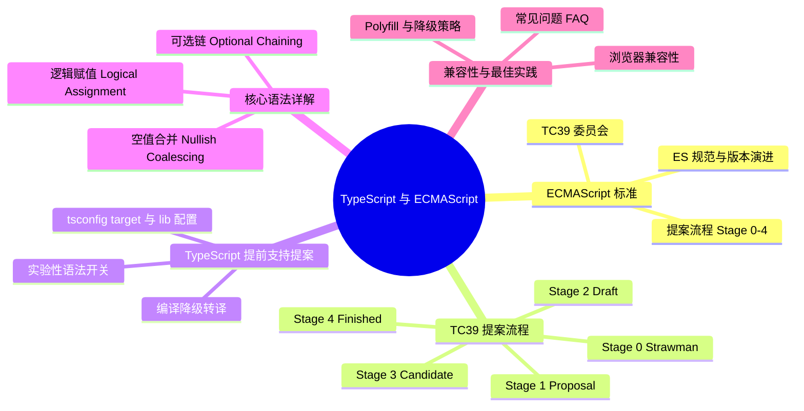

# TypeScript 与 ECMAScript

这一节，我们来讲解 TypeScript 与 ECMAScript 之间的关系，以及 TypeScript 如何提前支持 ECMAScript 提案语法。

## 知识架构



## 核心概念

首先，我们来理清经常看到的 ES / ECMAScript / TC39 等等概念到底是个啥。然后，一起看看 TypeScript 都提前实现了哪些 ECMAScript 语法，它们怎么用，到底有多好用。最后，在扩展阅读中，我们会聊到更多有趣的、正在进行中的 TC39 提案。要相信，未来的 JavaScript 一定会变得越来越好。

> 本节代码见：[ECMAScript](https://link.juejin.cn/?target=https%3A%2F%2Fgithub.com%2Flinbudu599%2FTypeScript-Tiny-Book%2Ftree%2Fmain%2Fpackages%2F20-ecmascript)

### 术语对照表

| 术语 | 全称 | 说明 |
|------|------|------|
| ES | ECMAScript | JavaScript 语言规范 |
| ES6 | ECMAScript 2015 | 2015年发布的 ECMAScript 版本 |
| ESNext | ECMAScript Next | 下一版本 ECMAScript 的代称 |
| TC39 | Technical Committee 39 | ECMAScript 标准制定的技术委员会 |
| Babel | - | JavaScript 编译器，用于语法转换 |
| Polyfill | - | 用于实现浏览器原生不支持的 API |

### ECMAScript 与 TC39

首先是 ECMAScript 这个单词，虽然 JavaScript 和 Java 没有关系，但 ECMAScript 和 ECMA （正确发音近似于**诶可码**（Script））确实是有关系的。ECMA 的全称是 [European Computer Manufacturers Association](https://link.juejin.cn/?target=https%3A%2F%2Fwww.ecma-international.org%2F)，即**欧洲计算机制造商协会**。它并不是为了卖货而生的，这一国际组织的存在主要是维护各种计算机的相关标准，从硬件到软件到编程语言等等。

最初创建 JavaScript 这门语言的公司是网景（Netscape），主推产品即为网景浏览器。由于在和微软 IE 的竞争中落得下风，为了避免从此 Web 脚本的主导权从此落入微软手中，在 1996 年，网景将 JavaScript 的标准制定权交给了 ECMA 协会，因此有了 ECMAScript —— 也就是 JavaScript 的语言规范。**而 ECMAScript 并不是一门语言，而是一门规范。** 我们说的 ES5 / ES6 / ESNext 等等概念，实际上指的都是 JavaScript 这门语言规范的新版本。

ECMA 维护着数百条规范，这些规范的领域差异非常大。因此 ECMA 采用技术小组（**Technical Committee，也称为技术委员会**）的方式来管理这个规范，ECMAScript 对应的技术小组即是 TC39。目前 TC39 委员会的绝大部分成员来自于浏览器引擎厂商、互联网巨头公司等等，并且定期召开会议来讨论各个提案的进展。

### TC39 提案流程

那么，提案又是什么？首先，ECMAScript 中的新语法并不是委员会成员坐下来开个简单的会就决定引入到 JavaScript 中的。一个新语法必须先从草稿，也就是从提案开始。你可以把新语法想象成一条新法律，得要有人首先提出这条法律能解决目前的某一问题，然后法律专家、法院、国家都要通过，它才能最终被写到法律条文中。在 ECMAScript 中，一个提案被纳入规范要经历 5 个阶段：

#### 提案阶段流程图

```
┌─────────────────────────────────────────────────────────────────┐
│                    TC39 提案演进流程                              │
└─────────────────────────────────────────────────────────────────┘

Stage 0             Stage 1           Stage 2           Stage 3           Stage 4
Strawman            Proposal          Draft             Candidate         Finished
(草稿)              (提案)            (草案)            (候选)            (完成)

  │                   │                 │                 │                 │
  │  TC39成员         │  Champion      │  规范初稿       │  完善规范       │  测试用例
  │  提交想法         │  负责推进       │  描述语法       │  编辑审核       │  正式合并
  │                   │                 │                 │                 │
  │                   │                 │                 │                 │
  ▼                   ▼                 ▼                 ▼                 ▼
┌──────┐          ┌──────┐          ┌──────┐          ┌──────┐          ┌──────┐
│ 任意 │─ ─ ─ ─ ─▶│ 正式 │─ ─ ─ ─ ─▶│ 初稿 │─ ─ ─ ─ ─▶│ 审核 │─ ─ ─ ─ ─▶│ 标准 │
│ 提交 │          │ 提案 │          │ 完成 │          │ 通过 │          │ 发布 │
└──────┘          └──────┘          └──────┘          └──────┘          └──────┘

不可用              不可用            不推荐使用        可试用(需编译)    官方支持
```

#### 各阶段详细说明

| 阶段 | 名称 | 要求 | 稳定性 | 使用建议 |
|------|------|------|--------|----------|
| **Stage 0** | Strawman（草稿） | 任何 TC39 成员都可以提交 | 极不稳定 | ❌ 不建议使用 |
| **Stage 1** | Proposal（提案） | 需要一位 Champion 负责，详细描述场景与API | 不稳定 | ❌ 不建议使用 |
| **Stage 2** | Draft（草案） | 需要完成标准文本初稿 | 较稳定 | ⚠️ 可实验性使用 |
| **Stage 3** | Candidate（候选） | 需要完善的规范文档，官方编辑签署同意 | 稳定 | ✅ 可使用（需编译工具支持） |
| **Stage 4** | Finished（完成） | 需要完成测试用例，合并到 ecma262 仓库 | 非常稳定 | ✅ 推荐使用 |

**阶段详细说明：**

- **Stage 0（strawman）**：任何 TC39 的成员都可以提交。
- **Stage 1（proposal）**：进入此阶段就意味着这一提案被认为是**正式**的了，需要对此提案的场景与API进行详尽描述。要想进入 Stage 1，需要一位 TC39 成员作为负责人（champion）对这个提案具体的**语法、语义和现有语法的冲突风险**都进行详细讨论分析。
- **Stage 2（draft）**：要进入 Stage 2，需要完成**包含提案所有内容的标准文本的初稿**。理论上来说，这一阶段的提案，如果能最终被纳入规范，这之后的阶段中就不会被大改了，只接受增量修改。因为如果要大改，往往需要废弃掉整个提案，让 V2 版本从 Stage 0 开始重新来一遍（有点像删号重开）。
- **Stage 3（candidate）**：这一阶段的提案只有在遇到了重大问题才会修改，需要撰写非常完善的规范文档。进入 Stage 3 的前提条件是在规范文档的基础上，ECMAScript 官方的编辑以及指定 TC39 委员会成员签署了同意意见。通常来说提案进入这一阶段后，我们就能通过 Babel 插件或者各种 Polyfill 等提前试用上。
- **Stage 4（finished）**：这一阶段的提案将会被纳入到 ES 每年发布的规范之中，正式与大家见面。想要完成这最后一步，需要完成所有对应到提案内容的测试用例（用来给引擎产商们检查实现的兼容程度），以及官方编辑同意将其合并到 [tc39/ecma262](https://link.juejin.cn/?target=https%3A%2F%2Fgithub.com%2Ftc39%2Fecma262) 仓库。

#### ECMAScript 版本历史

目前 TC39 会议的频率大概是两月一次，并且由于疫情的原因也从线上、线下结合改成了完全线上的模式。上面我们提到的 ecma262，这里的 262 意为 ECMAScript 是 ECMA 维护的第 262 条标准。

| 版本 | 发布年份 | 重要特性 |
|------|----------|----------|
| ES5 | 2009 | 严格模式、JSON、数组方法 |
| ES6/ES2015 | 2015 | let/const、箭头函数、class、Promise、模块化 |
| ES2016 | 2016 | includes、指数运算符 |
| ES2017 | 2017 | async/await、Object.entries |
| ES2018 | 2018 | 异步迭代、rest/spread |
| ES2019 | 2019 | flat、fromEntries |
| ES2020 | 2020 | 可选链、空值合并、BigInt |
| ES2021 | 2021 | 逻辑赋值、replaceAll、数字分隔符 |
| ES2022 | 2022 | 顶层await、class私有字段、.at() |
| ES2023 | 2023 | 从后向前查找数组、Hashbang语法 |
| ES2024 | 2024 | Array/Object.groupBy、Promise.withResolvers、可调整大小的 ArrayBuffer |
| ES2025 | 2025 | Set 方法（union/intersection 等）、迭代器辅助方法、导入属性、重复命名捕获组 |

截至 2026 年 9 月，最新发布的年度版本是 [ES2025（第 16 版）](https://262.ecma-international.org/16.0/)。当然，各位同学最熟悉的肯定还是 2015 年发布的 ES2015，即 ES6 这一版本。网上很多说法是将 ES2015 后的版本统称为 ES6，我不太认同的原因也就在于此。

如果你想了解更多历史故事，我推荐阅读雪碧老师的作品：[JavaScript 二十年](https://link.juejin.cn/?target=https%3A%2F%2Fcn.history.js.org%2Fpart-1.html)。

### TypeScript 与 ECMAScript 的关系

那么，ECMAScript 和 TypeScript 的关系又是啥？知道了 ECMAScript 的具体意义就比较好懂了。上面说到一个新语法从提出到最终成为 ECMAScript 的一部分，需要走完漫长的 Stage 0-4，如果这个语法真的究极无敌好用（比如我们下面要说的可选链、空值合并以及装饰器），实在是等不及想用怎么办？

聪明的你一定会想到 Babel，它能够将 ECMAScript 未纳入标准的语法进行降级（或将标准语法按照运行时环境降级），这样我们就可以放心使用未来的新语法，Babel 会帮我们编译好的。而 TypeScript 也支持这么个功能，或者说这就是它的核心功能之一。正如我们在开篇说的那样，TypeScript 其实就是类型能力加上一些新语法，而这些新语法绝大部分都来自于 ECMAScript，并且是在这些语法提案还没正式进入标准时，TypeScript 就对其进行了支持。在编译时，类型标注会直接被抹除，而这些新语法也会按照我们在 `tsconfig` 中的 `target` 配置进行对应降级。

#### TypeScript 编译流程图

```
TypeScript 代码
     │
     ├─── 类型标注 ──→ 编译时擦除
     │
     └─── 新语法 ──→ 根据 target 配置降级
                        │
                        ├── target: ES3 ──→ 降级为 ES3 代码
                        ├── target: ES5 ──→ 降级为 ES5 代码
                        ├── target: ES6 ──→ 降级为 ES6 代码
                        └── target: ESNext ──→ 保持原样
```

## 核心语法详解

目前在 TypeScript 中，已经合入的 ECMAScript 语法主要有这么几个：

| 语法名称 | 操作符 | 引入版本 | ES版本 | 用途 |
|----------|--------|----------|--------|------|
| 可选链 | `?.` | TS 3.7 | ES2020 | 安全访问嵌套属性 |
| 空值合并 | `??` | TS 3.7 | ES2020 | 提供默认值 |
| 逻辑赋值 | `||=`, `&&=`, `??=` | TS 4.0 | ES2021 | 条件赋值 |
| 装饰器 | `@decorator` | TS 5.0 | 提案中 | 元编程支持 |
| 私有字段 | `#field` | TS 3.8 | ES2022 | 类私有属性 |
| 新增方法 | `replaceAll`等 | TS 4.2+ | 各版本 | 扩展功能 |

这篇文章中我们并不关注新增的方法以及 Class 相关语法，因为它们真的就是看一下文档的事。对于这些新增的方法，TypeScript 中可以通过在 `tsconfig` 的 `compilerOptions.lib` 配置中新增 `es2021`（对应的 es 版本）/`esnext` 来启用这些新的语法，而在 JavaScript 中想要使用则需要运行时支持或者使用 Polyfill（CoreJs，ES-Shims 等）。

对于可选链、空值合并以及逻辑赋值，前两者在 TS 3.7 版本引入，逻辑赋值则在 4.0 版本被引入，它们早在 ECMAScript 2020/2021 就被正式吸收，你现在甚至可以在浏览器控制台使用这几个语法。而装饰器就是比较特殊的一位了，我们会在下一节装饰器一章详细地聊聊它的演进历史。

接下来，我们就来讲一讲可选链、空值合并以及逻辑赋值这三个语法，感受一下这些语法糖到底有多甜。

### 可选链 Optional Chaining

在 JavaScript 中，如果访问一个嵌套多层的属性，为了避免出现 `Cannot read property of undefined` 这样的错误，我们通常会使用**逻辑与** `&&` 语法来确保在某一层出现空值时及时短路掉访问：

#### 传统方式的问题

```javascript
const inner = obj && obj.data && obj.data.innerProperty;
```

这种写法虽然丑陋，但它确实能在一定程度上避免对空值的读取，但也只是一定程度上，为什么这么说？

上面的代码看起来很安全，但在某一步访问出现空值时，它返回的是上一步的值，而在属性的读取过程中，我们通常希望的是如果某一环节短路了，那返回一个 undefined 给我就好。否则，如果下面还存在对 `inner` 进行真值假值判断（`if(inner)`）的话，反而容易引发 Bug。

另外，逻辑与短路在属性嵌套过深时简直就是噩梦，使用可选链的 `?.` 语法，我们可以把它改写成这样：

```javascript
const inner = obj?.data?.innerProperty;
```

#### 可选链示意图

```
传统方式：obj && obj.data && obj.data.innerProperty
                    ↓
可选链方式：obj?.data?.innerProperty
                    ↓
         ┌──────────┴──────────┐
         │                     │
    obj 存在？              obj 不存在
         │                     │
    访问 data              返回 undefined
         │                     │
    ┌────┴────┐                │
    │         │                │
data存在  data不存在            │
    │         │                │
访问属性   返回 undefined       │
    │         │                │
    └─────────┴────────────────┘
```

除了更简洁的写法以外，可选链也更符合我们的预期：**它会在短路时返回一个 undefined**。可选链不仅能应用在属性访问，也可以用在计算属性访问以及方法调用上：

#### 使用场景

**1. 静态属性访问**

```typescript
interface User {
  profile?: {
    name: string;
    age: number;
  };
}

const user: User = {};
const name = user?.profile?.name; // 类型为 string | undefined
```

**2. 动态属性访问**

```typescript
const key = 'name';
const value = obj?.[key]; // 动态属性访问
const element = arr?.[0]; // 数组访问

// 更复杂的示例
obj?.[expr];      // 表达式作为属性
obj?.[++a];       // 会在短路时不执行 ++a
```

**3. 方法调用**

```typescript
interface Api {
  fetchData?(): Promise<unknown>;
}

const api: Api = {};
const result = await api?.fetchData?.(); // 如果方法不存在，返回 undefined

// 对应到旧写法
// const result = api && api.fetchData && api.fetchData();
```

**4. 函数调用与可选链结合**

```typescript
// 回调函数可选调用
type Callback = (() => void) | null | undefined;

let callback: Callback = null;
callback?.(); // 安全调用，如果 callback 为空则不执行

// 结合事件监听
element.addEventListener('click', (event) => {
  const target = event.target as HTMLElement | null;
  target?.click(); // 如果 target 存在则点击
});
```

**重要特性：短路行为**

在所有情况下，如果 `?.` 的左侧发生了短路，那么就会直接停止后续操作：

```typescript
let a = 0;
const obj = null;

// ++a 不会执行
obj?.[++a]; // a 仍然是 0

// 函数不会调用
obj?.method?.(); // method 不会被调用
```

### 空值合并 Nullish Coalescing

如果说可选链是为了取代**逻辑与**（`&&`），那么空值合并就是为了取代**逻辑或**（`||`）。而逻辑或的主要使用场景之一就是提供默认值：

#### 逻辑或的问题

```javascript
const foo = someValue || fallbackValue;
```

逻辑或会在 `||` 左边被判断为 false 时，执行右边的逻辑，在这里即是赋值行为。看起来一切好像都很美好，但别忘了，由于 JavaScript 中无处不在的隐式转换，如果 `||` 左边是 `""`/ `0` / `false`，都会被视为 false（false 虽然是 false，但它也是个值！），而我们希望的是**仅在左边为 undefined 或 null 时，才去应用默认值**。

#### 空值合并的正确使用

大部分情况下我们可以直接使用 `??` 代替 `||`：

```javascript
const foo = someValue ?? fallbackValue;
```

#### 对比示例

| 表达式 | `value` 的值 | `\|\|` 结果 | `??` 结果 | 说明 |
|--------|--------------|-------------|-----------|------|
| `value \|\| 'default'` | `undefined` | `'default'` | `'default'` | 都使用默认值 |
| `value \|\| 'default'` | `null` | `'default'` | `'default'` | 都使用默认值 |
| `value \|\| 'default'` | `0` | `'default'` | `0` | `??` 保留原值 ✓ |
| `value \|\| 'default'` | `''` | `'default'` | `''` | `??` 保留原值 ✓ |
| `value \|\| 'default'` | `false` | `'default'` | `false` | `??` 保留原值 ✓ |

#### 使用场景

**1. 函数参数默认值**

```typescript
function greet(name?: string) {
  // ❌ 错误：空字符串也会使用默认值
  // const displayName = name || 'Guest';
  
  // ✅ 正确：只有 null/undefined 才使用默认值
  const displayName = name ?? 'Guest';
  
  console.log(`Hello, ${displayName}!`);
}

greet(''); // 使用 ||: Hello, Guest!  / 使用 ??: Hello, !
```

**2. 配置项合并**

```typescript
interface Config {
  timeout?: number;
  retries?: number;
  enabled?: boolean;
}

function createConfig(userConfig?: Config): Required<Config> {
  return {
    timeout: userConfig?.timeout ?? 3000,        // 允许 timeout 为 0
    retries: userConfig?.retries ?? 3,           // 允许 retries 为 0
    enabled: userConfig?.enabled ?? true,        // 允许 enabled 为 false
  };
}

createConfig({ timeout: 0, enabled: false });
// { timeout: 0, retries: 3, enabled: false } ✓ 正确保留了 0 和 false
```

**3. 配合可选链使用**

```javascript
const bar = obj?.a?.b?.c() ?? fallbackValue;
```

空值合并就如它的名字一样，只会对真正意义上的空值（null 与 undefined）进行处理。

**4. API 响应处理**

```typescript
interface ApiResponse {
  data?: {
    items: string[];
    count: number;
  };
  error?: string;
}

function handleResponse(response: ApiResponse) {
  // 获取数据，如果不存在则使用空数组
  const items = response?.data?.items ?? [];
  
  // 获取计数，如果不存在则使用 0
  const count = response?.data?.count ?? 0;
  
  // 注意：如果 count 可能是 0，使用 ?? 更安全
  // 如果使用 ||，count 为 0 时会被认为是假值
  
  return { items, count };
}
```

### 逻辑赋值 Logical Assignment

实际上,逻辑赋值是在复合赋值的基础上演进而来（或者说关系一致）的，都是将一个操作符和赋值符号结合在一起。

#### 复合赋值回顾

```javascript
a = a + b;
a += b;

a = a - b;
a -= b;

a = a * b;
a *= b;
```

复合赋值其实就是先执行操作，再将操作结果赋值给左边的变量。如 `a += b` 就是执行 `a + b`，然后将结果赋值给 `a`。

#### 逻辑赋值语法

```javascript
a = a || b;
a ||= b;

a = a && b;
a &&= b;

a = a ?? b;
a ??= b;
```

类比一下，逻辑赋值就是**先执行逻辑操作，然后将结果赋值给左边的变量**。

#### 三种逻辑赋值对比

| 操作符 | 名称 | 行为 | 等价写法 | 应用场景 |
|--------|------|------|----------|----------|
| `\|\|=` | 或赋值 | 左侧为假值时赋值 | `a = a \|\| b` | 初始化 |
| `&&=` | 与赋值 | 左侧为真值时赋值 | `a = a && b` | 条件更新 |
| `??=` | 空值赋值 | 左侧为 null/undefined 时赋值 | `a = a ?? b` | 懒初始化 |

#### 使用场景

**1. 或赋值 `||=` - 对象属性初始化**

```typescript
const options: { timeout?: number } = {};

// 传统方式
if (!options.timeout) {
  options.timeout = 3000;
}

// 或赋值方式
options.timeout ||= 3000;

// 实际应用：DOM 元素初始化
function initElement(id: string) {
  const element = document.getElementById(id);
  element.style.display ||= 'block'; // 如果未设置则初始化为 block
}
```

**2. 与赋值 `&&=` - 条件更新**

```typescript
let config = { debug: true };

// 只有当 config.debug 为真时才更新
config.debug &&= false; // config.debug 现在为 false

// 实际应用：条件清理
function cleanup(resources: { active?: boolean }) {
  resources.active &&= false; // 如果 active 为真，则设置为 false
}
```

**3. 空值赋值 `??=` - 懒初始化（推荐）**

```typescript
class Cache {
  private data: Map<string, any> | null = null;
  
  get(key: string) {
    // 懒初始化：只有在首次使用时才创建
    this.data ??= new Map();
    return this.data.get(key);
  }
}

// 数组懒初始化
let arr: string[] | undefined;
(arr ??= []).push("linbudu");

// 等价于以下这段
arr = arr ?? []; // 假设 arr 有可能在多处被初始化
arr.push("linbudu");
```

**4. 实际应用示例**

```typescript
interface User {
  id: string;
  name: string;
}

interface Config {
  endpoint?: string;
}

class UserService {
  private cache: Map<string, User> | null = null;
  private config: Config | null = null;
  
  // 两个依赖方法的示意实现
  private async loadConfig(): Promise<Config> {
    return {};
  }
  
  private async fetchUser(id: string, config: Config): Promise<User> {
    return { id, name: 'Unknown' };
  }
  
  async getUser(id: string): Promise<User> {
    // 懒初始化缓存
    this.cache ??= new Map();
    
    // 如果缓存存在，直接返回
    if (this.cache.has(id)) {
      return this.cache.get(id)!;
    }
    
    // 获取配置（如果未初始化则使用默认值）
    this.config ??= await this.loadConfig();
    
    // 获取用户数据
    let user = await this.fetchUser(id, this.config);
    
    // 更新缓存（只有当 user 有效时才缓存）
    user &&= this.cache.set(id, user).get(id)!;
    
    return user;
  }
}
```

#### 性能优势

逻辑赋值的一个重要优势是**避免重复计算**：

```typescript
// 传统方式：每次都会计算 getDefaultValue()
if (!obj.value) {
  obj.value = getDefaultValue(); // 只有在需要时才调用
}

// 或赋值方式：同样只有在需要时才计算
obj.value ||= getDefaultValue();

// 错误示例：总是计算右侧
obj.value = obj.value || getDefaultValue(); // 总是会调用 getDefaultValue()
```

同样，秉持着"一点一点精通 TypeScript"的思路，我仍然推荐你在学习完本节后，使用可选链、空值合并以及短路赋值来替换部分老项目中的代码，并且在未来遇到短路与默认值场景时首先考虑这三位新同学。

## 配置说明

### tsconfig.json 配置详解

要在 TypeScript 项目中正确使用 ECMAScript 新特性，需要合理配置 `tsconfig.json`。

#### 核心配置项

```json
{
  "compilerOptions": {
    /* 目标编译版本 */
    "target": "ES2020",
    // 可选值：ES3, ES5, ES6/ES2015, ES2016-ES2024, ESNext
    // 控制编译输出的 JavaScript 版本
    
    /* 指定使用的内置 API */
    "lib": ["ES2020", "DOM", "DOM.Iterable"],
    // 根据目标环境添加需要的类型定义
    // ES2020: 包含可选链、空值合并等
    // DOM: 包含浏览器 API
    
    /* 模块系统 */
    "module": "ESNext",
    // CommonJS, AMD, ESNext 等
    
    /* 启用严格模式 */
    "strict": true,
    // 开启所有严格类型检查选项
    
    /* 允许 JS 文件 */
    "allowJs": true,
    // 允许在 TypeScript 项目中导入 JS 文件
    
    /* 输出目录 */
    "outDir": "./dist",
    
    /* 模块解析策略 */
    "moduleResolution": "node"
  },
  "include": ["src/**/*"],
  "exclude": ["node_modules", "dist"]
}
```

#### target 配置详解

| target 值 | 支持的特性 | 降级行为 | 推荐场景 |
|-----------|-----------|----------|----------|
| `ES3` | 最基础特性 | 所有新语法降级 | 旧浏览器兼容 |
| `ES5` | ES5 特性 | 箭头函数、let/const 降级 | IE11 兼容 |
| `ES6`/`ES2015` | ES6 特性 | async/await 降级 | 现代浏览器 |
| `ES2020` | ES2020 特性 | 可选链、空值合并保持 | Node.js 14+ |
| `ES2021` | ES2021 特性 | 逻辑赋值保持 | Node.js 16+ |
| `ESNext` | 最新特性 | 最少降级 | 最新环境 |

#### lib 配置详解

`lib` 配置决定了 TypeScript 知道哪些内置 API：

```json
{
  "compilerOptions": {
    "lib": [
      "ES2020",           // ES2020 特性：可选链、空值合并、BigInt
      "ES2020.Promise",   // Promise 相关特性
      "ES2020.String",    // String 新方法
      "DOM",              // 浏览器 DOM API
      "DOM.Iterable",     // DOM 可迭代对象
      "ScriptHost"        // Windows Script Host
    ]
  }
}
```

#### 常见配置场景

**1. Web 应用（现代浏览器）**

```json
{
  "compilerOptions": {
    "target": "ES2020",
    "lib": ["ES2020", "DOM", "DOM.Iterable"],
    "module": "ESNext",
    "moduleResolution": "node"
  }
}
```

**2. Node.js 应用**

```json
{
  "compilerOptions": {
    "target": "ES2020",
    "lib": ["ES2020"],
    "module": "CommonJS",
    "moduleResolution": "node",
    "types": ["node"]
  }
}
```

**3. 需要兼容旧浏览器**

```json
{
  "compilerOptions": {
    "target": "ES5",
    "lib": ["ES5", "DOM"],
    "module": "CommonJS",
    "downlevelIteration": true  // 支持ES5中的迭代器
  }
}
```

## 兼容性与最佳实践

### 浏览器兼容性

以下是三大核心语法的浏览器支持情况：

| 特性 | Chrome | Firefox | Safari | Edge | Node.js |
|------|--------|---------|--------|------|---------|
| 可选链 `?.` | 80+ | 74+ | 13.1+ | 80+ | 14+ |
| 空值合并 `??` | 80+ | 72+ | 13.1+ | 80+ | 14+ |
| 逻辑赋值 `\|\|=` 等 | 85+ | 79+ | 14+ | 85+ | 15+ |

> 完整兼容性信息可查看：[MDN Web Docs](https://developer.mozilla.org/) 或 [Can I Use](https://caniuse.com/)

#### 兼容性处理方案

**方案一：TypeScript 编译降级**

```json
// tsconfig.json
{
  "compilerOptions": {
    "target": "ES5",  // 降级到 ES5
    "lib": ["ES2020", "DOM"]
  }
}
```

**方案二：Babel + Polyfill**

```bash
npm install --save-dev @babel/core @babel/preset-env
npm install core-js
```

```javascript
// babel.config.js
module.exports = {
  presets: [
    ['@babel/preset-env', {
      targets: {
        chrome: '60',
        firefox: '60',
        safari: '11',
        edge: '17'
      },
      useBuiltIns: 'usage',
      corejs: 3
    }]
  ]
};
```

**方案三：浏览器原生支持（现代浏览器）**

```html
<!-- 使用 module/nomodule 模式 -->
<script type="module" src="modern.js"></script>
<script nomodule src="legacy.js"></script>
```

### 最佳实践建议

#### 1. 可选链最佳实践

```typescript
// ✅ 推荐：多层嵌套访问
const name = user?.profile?.personalInfo?.name;

// ✅ 推荐：方法调用
const result = obj?.method?.();

// ✅ 推荐：数组访问
const first = arr?.[0];

// ❌ 避免：过度使用
const x = obj?.a; // 如果 obj 一定存在，不需要 ?.

// ❌ 避免：赋值操作
obj?.property = value; // 语法错误，可选链不能用于赋值

// ⚠️ 注意：与 delete 结合
delete obj?.property; // 可行，但如果 obj 为空，delete 不会执行
```

#### 2. 空值合并最佳实践

```typescript
// ✅ 推荐：保留假值（0, '', false）
const timeout = config.timeout ?? 3000;
const name = user.name ?? 'Anonymous';
const enabled = config.enabled ?? true;

// ❌ 避免：与 || 混淆
const count = items.length || 10;     // 如果 length 是 0，会使用 10
const count = items.length ?? 10;     // 如果 length 是 0，保持 0

// ✅ 推荐：配合可选链
const value = obj?.property ?? defaultValue;

// ⚠️ 注意：优先级
const x = a ?? b || c;  // 语法错误
const x = (a ?? b) || c; // 正确：使用括号明确优先级
```

#### 3. 逻辑赋值最佳实践

```typescript
// ✅ 推荐：懒初始化
class Service {
  private cache?: Map<string, any>;
  
  getCache() {
    return this.cache ??= new Map();
  }
}

// ✅ 推荐：配置默认值
function initConfig(config: Config) {
  config.timeout ??= 3000;
  config.retries ??= 3;
  config.debug ??= false;
  return config;
}

// ✅ 推荐：DOM 操作
function ensureElement(id: string) {
  let element = document.getElementById(id);
  element ||= document.createElement('div');
  return element;
}

// ❌ 避免：混淆使用
let x = 0;
x ??= 1; // x 仍然是 0，因为 0 不是 null/undefined

let y = 0;
y ||= 1; // y 变成 1，因为 0 是假值
```

#### 4. 综合最佳实践

```typescript
// API 调用示例
interface User {
  id: string;
  name: string;
  email: string;
}

interface ApiResponse<T> {
  data?: T;
  error?: {
    code: number;
    message: string;
  };
}

async function fetchUser(id: string): Promise<User> {
  const response: ApiResponse<User> = await fetch(`/api/users/${id}`).then(r => r.json());
  
  // 处理错误
  if (response.error) {
    throw new Error(response.error.message);
  }
  
  // 使用空值合并提供默认值
  const user = response.data ?? {
    id,
    name: 'Unknown',
    email: ''
  };
  
  return user;
}

// 配置合并示例
interface AppConfig {
  apiUrl?: string;
  timeout?: number;
  retries?: number;
  debug?: boolean;
}

function createAppConfig(userConfig: AppConfig = {}): Required<AppConfig> {
  return {
    apiUrl: userConfig.apiUrl ?? 'https://api.example.com',
    timeout: userConfig.timeout ?? 5000,
    retries: userConfig.retries ?? 3,
    debug: userConfig.debug ?? false
  };
}
```

### 常见问题 FAQ

#### Q1: 可选链和空值合并不工作怎么办？

**A:** 检查以下几点：

1. **TypeScript 版本**：确保 TS >= 3.7
2. **target 配置**：如果 target < ES2020，需要确保降级配置正确
3. **Babel 配置**：如果使用 Babel，需要添加相应插件

```bash
# 检查 TypeScript 版本
npx tsc --version

# Babel 插件（如果需要）
npm install --save-dev @babel/plugin-proposal-optional-chaining
npm install --save-dev @babel/plugin-proposal-nullish-coalescing-operator
```

#### Q2: `||` 和 `??` 应该使用哪个？

**A:** 根据场景选择：

- 需要**保留假值**（0, '', false）时使用 `??`
- 需要**过滤所有假值**时使用 `||`

```typescript
// 用户输入：可能为空字符串
const searchTerm = input || undefined; // ✅ 空字符串转为 undefined

// 计数器：可能为 0
const count = counter ?? 0; // ✅ 保留 0

// 布尔配置：可能为 false
const enabled = config.enabled ?? true; // ✅ 保留 false
```

#### Q3: 可选链能用于赋值吗？

**A:** 不能。可选链只能用于**读取**，不能用于**赋值**。

```typescript
// ❌ 错误：语法错误
obj?.property = value;

// ✅ 正确：先检查再赋值
if (obj) {
  obj.property = value;
}

// ✅ 正确：使用可选链读取
const value = obj?.property;
```

#### Q4: 逻辑赋值的性能如何？

**A:** 逻辑赋值有一个重要优势：**短路求值**。

```typescript
// 总是计算右侧
obj.value = obj.value || expensiveFunction();

// 只有在需要时才计算
obj.value ||= expensiveFunction();
```

#### Q5: 如何在老项目中渐进式引入这些语法？

**A:** 建议按以下步骤：

1. **更新 TypeScript 配置**
2. **添加 Polyfill**（如需要）
3. **逐步替换关键代码**
4. **编写单元测试验证**

```typescript
// 第一步：替换简单的可选链
// 旧代码
if (obj && obj.data) {
  const value = obj.data.value;
}

// 新代码
const value = obj?.data?.value;

// 第二步：替换默认值逻辑
// 旧代码
const timeout = config.timeout !== undefined ? config.timeout : 3000;

// 新代码
const timeout = config.timeout ?? 3000;
```

#### Q6: `target` 和 `lib` 配置有什么区别？

**A**: 两者的作用不同：

| 配置 | 作用 | 影响 |
|------|------|------|
| `target` | 指定编译后的 JavaScript 版本 | 影响语法降级行为 |
| `lib` | 指定可用的 API 类型声明 | 影响类型检查和智能提示 |

```json
{
  "compilerOptions": {
    "target": "ES5",           // 编译为 ES5 语法
    "lib": ["ES2020", "DOM"]   // 但可以使用 ES2020 的 API（需要 polyfill）
  }
}
```

#### Q7: 可选链和空值合并可以链式使用吗？

**A**: 可以，这是非常常见的模式：

```typescript
interface Config {
  server?: {
    port?: number;
    host?: string;
  };
}

const config: Config = {};

// 链式使用
const port = config?.server?.port ?? 3000;
const host = config?.server?.host ?? 'localhost';

// 更复杂的链式调用
interface ApiResponse {
  data?: {
    items?: Array<{ id: number; name: string }>;
  };
}

const response: ApiResponse = {};

const firstItemName = response?.data?.items?.[0]?.name ?? 'Unknown';
```

#### Q8: TypeScript 如何支持最新的 ECMAScript 提案？

**A**: TypeScript 对不同阶段的提案有不同的支持策略：

| Stage | 支持方式 | 配置要求 |
|-------|----------|----------|
| Stage 0-1 | 通常不支持 | - |
| Stage 2 | 可能需要特殊配置 | 特定编译选项 |
| Stage 3 | 通常支持 | 可能需要 `lib` 配置 |
| Stage 4 | 完整支持 | 无需特殊配置 |

```json
{
  "compilerOptions": {
    "lib": ["ESNext"]  // 启用最新特性支持
  }
}
```

## 总结与预告

这一节，我们了解了让人傻傻分不清楚的 ECMAScript、TypeScript、TC39 等概念之间的联系与实际意义，认识了三位对你来说或许是首次见面的新朋友：可选链、空值合并以及短路赋值。从现在开始，你可以在接下来的项目开发中不断提醒自己去使用它们，毕竟，兼得更简洁的语法以及更安全的逻辑，有谁会拒绝呢？

### 关键要点回顾

- **ECMAScript** 是规范，**JavaScript** 是实现，**TypeScript** 是超集
- **TC39** 通过五个阶段的流程管理提案
- **TypeScript** 提前支持 Stage 3+ 的提案语法
- **可选链** `?.` 安全访问嵌套属性
- **空值合并** `??` 只对 null/undefined 使用默认值
- **逻辑赋值** `??=` 等实现条件赋值

在下一节，我们会用很长的篇幅来聊聊 TypeScript 中的装饰器，从演进到了解、从原理到熟悉，最后来写一个你自己的依赖注入容器，让这些高大上的概念彻底为你所用。

## 扩展阅读

### 演进中的 TC39 提案

除了我们上面讲到的可选链、空值合并，以及大家都至少听说过的装饰器以外，还有许多演进中的 TC39 提案，我们可以简单归类为语法糖、新的内置方法、新的 API等。在了解完本篇的核心内容以后，我们不妨来瞅几个有意思的提案，看看未来的 JavaScript 可能会是什么样的？

> 提案状态会持续更新，最新信息请查看 [TC39 Proposals](https://github.com/tc39/proposals)

#### 已正式纳入标准的提案

##### Temporal（Stage 4，预计纳入 ES2027）

解决 Date 对象痛点的现代日期时间 API。Temporal 已于 2026 年 3 月达到 Stage 4，截至 2026 年 9 月尚未进入已发布的年度版本，但可以开始在支持的环境中试用：

```javascript
// 旧的 Date API
const date = new Date('2024-01-01T00:00:00Z');
console.log(date.getMonth()); // 时区问题！

// 新的 Temporal API
const instant = Temporal.Instant.from('2024-01-01T00:00:00Z');
const zonedDateTime = instant.toZonedDateTimeISO('Asia/Shanghai');
console.log(zonedDateTime.month); // 1，更直观
```

##### Array.prototype.group（ES2024）

数组分组的原生支持：

```javascript
const inventory = [
  { name: 'asparagus', type: 'vegetables', quantity: 5 },
  { name: 'bananas', type: 'fruit', quantity: 0 },
  { name: 'goat', type: 'meat', quantity: 23 },
];

const result = Object.groupBy(inventory, ({ type }) => type);
/*
{
  vegetables: [{ name: 'asparagus', type: 'vegetables', quantity: 5 }],
  fruit: [{ name: 'bananas', type: 'fruit', quantity: 0 }],
  meat: [{ name: 'goat', type: 'meat', quantity: 23 }]
}
*/
```

##### Import Attributes（ES2025）

支持导入 JSON 和其他类型：

```javascript
import data from './data.json' with { type: 'json' };

// 动态导入
const module = await import('./module.wasm', { with: { type: 'wasm' } });
```

##### Set Methods（ES2025）

原生的 Set 操作方法：

```javascript
const a = new Set([1, 2, 3]);
const b = new Set([2, 3, 4]);

a.union(b);        // Set {1, 2, 3, 4}
a.intersection(b); // Set {2, 3}
a.difference(b);   // Set {1}
a.symmetricDifference(b); // Set {1, 4}
a.isSubsetOf(b);   // false
a.isSupersetOf(b); // false
```

#### Stage 3 候选提案

##### Decorators（装饰器）

最新的装饰器提案已经到达 Stage 3（截至 2026 年 9 月仍处于该阶段，另有一个 Decorator Metadata 提案同样处于 Stage 3）：

```typescript
// 类装饰器
@logged
class Example {
  @field
  x = 0;
  
  @method
  greet() {
    return 'hello';
  }
}
```

#### Stage 2 草案提案

##### Record 和 Tuple：内置的不可变数据类型

Record 与 Tuple 为 JavaScript 中引入了两个新的**原始**数据类型，分别对应到对象与数组（差异仅仅是声明时多了个 `#`）：

```javascript
// Record
const proposal = #{
  id: 1234,
  title: "Record & Tuple proposal",
  contents: `...`,
  keywords: #["ecma", "tc39", "proposal", "record", "tuple"],
};

// Tuple
const measures = #[42, 12, 67, "measure error: foo happened"];
```

注意，它们是原始类型，也就是说是按值比较而非对象那样按引用地址比较的。即 `#[1,2,3] === #[1,2,3]`，`#{ foo: "bar" } === #{ foo: "bar" }` 都是成立的。

#### Stage 1 提案

##### 面向表达式的 Do Expression 与 Throw Expression

这一提案的理念背景是函数式编程中的面向表达式（Expression-Oriented）语法：

```javascript
// do expression
let x = do {
  let tmp = f();
  tmp * tmp + 1
};

let y = do {
  if (foo()) { f() }
  else if (bar()) { g() }
  else { h() }
};

// throw expression
function getEncoder(encoding) {
  const encoder = encoding === "utf8" ? new UTF8Encoder() 
                : encoding === "utf16le" ? new UTF16Encoder(false) 
                : encoding === "utf16be" ? new UTF16Encoder(true) 
                : throw new Error("Unsupported encoding");
}
```

##### Pipeline Operator（管道操作符）

引入 `|>` 语法实现数据流编程：

```javascript
// 传统写法
const result = capitalize(
  trim(
    String(user?.name ?? 'Anonymous')
  )
);

// 管道操作符
const result = user?.name ?? 'Anonymous'
  |> String(%)
  |> trim(%)
  |> capitalize(%);
```

##### 响应式编程与 Observable

如果你了解过 RxJs，那么肯定马上就 get 到了这个提案想要干啥。这一提案尝试引入原生的 Observable 支持：

```javascript
function listen(element, eventName) {
    return new Observable(observer => {
        let handler = event => observer.next(event);
        element.addEventListener(eventName, handler, true);
        return () => {
            element.removeEventListener(eventName, handler, true);
        };
    });
}
```

#### 函数式理念的进一步发展

##### Function Pipe/Flow

类似于 Pipeline Operator，这一提案引入了两个 Function 对象上的系列方法：`pipe`/`pipeAsync` 与 `flow`/`flowAsync`。

```javascript
const { pipe } = Function;

pipe(5, f0, f1, f2); // 等同于 f2(f1(f0(5)))

const { flow } = Function;
const f = flow(f0, f1, f2);
// 等同于 f = (...args) => f2(f1(f0(...args)))
f(5, 7); 
```

这两个提案都代表了数据流编程的理念，**数据流编程（Dataflow Programming）** 将程序拆分为数个独立的操作单元，而数据在操作单元间以有向图的形式流转。

##### Pattern Matching（模式匹配）

更强大的模式匹配（目前处于 Stage 1）：

```javascript
// 提案中的语法（目前不可用）
const result = match (value) {
  when { type: 'success', data }: return data;
  when { type: 'error', code }: throw new Error(code);
  default: return null;
}
```

### TC39 中的类型提案

在 2022 年 3 月会议中，由 TypeScript 团队推进的 [Type Annotations](https://link.juejin.cn/?target=https%3A%2F%2Fgithub.com%2Ftc39%2Fproposal-type-annotations) 也成功进入到 Stage 1，目前处于 Stage 1 阶段。这一提案的目的是引入和 TypeScript 中一样，会在编译时被擦除的类型标注：

```typescript
import type { Foo } from "foo";
import type * as Bar from "bar";

let x: string;
x = "hello";
x = 100; // 类型错误

function equals(x: number, y?: number): boolean {
    return x === y;
}

interface Person {
    name: string;
    age: number;
}

export type CoolBool = boolean;
```

这一提案的特点：

1. **编译时擦除**：类型标注只在开发时存在
2. **可选性**：类型标注是可选的
3. **TypeScript 兼容**：语法与 TypeScript 基本一致
4. **渐进式采用**：可以逐步在现有 JavaScript 项目中引入

**优势：**

- 无需额外的编译步骤（运行时支持）
- JavaScript 和 TypeScript 可以更好地融合
- 降低 TypeScript 的使用门槛

**限制：**

- 不包括运行时类型检查
- 不支持涉及运行时的功能（enum、namespace 等）

随着浏览器等运行时对 ECMAScript 语法的支持越来越好，语法降级功能不再是刚需，如果这一提案能够持续推进，将成为 JavaScript 生态的重要里程碑。同时，关注 TC39 的提案进展，也可以帮助你提前了解 JavaScript 语言的发展方向。

### 相关资源链接

- [TC39 官方仓库](https://github.com/tc39)
- [ECMAScript 规范](https://tc39.es/ecma262/)
- [TypeScript 官方文档](https://www.typescriptlang.org/docs/)
- [MDN Web Docs](https://developer.mozilla.org/)
- [JavaScript 二十年](https://cn.history.js.org/)
- [Babel 官方文档](https://babeljs.io/docs/)

## 最佳实践建议

### 1. 选择合适的 target 配置

```json
{
  "compilerOptions": {
    "target": "ES2020"
  }
}
```

**建议**：
- 现代浏览器项目：使用 `ES2020` 或更高版本
- Node.js 项目：根据 Node.js 版本选择，Node.js 14+ 支持 `ES2020`
- 需要广泛兼容的项目：使用 `ES5` 并配合 `@babel/preset-env`

### 2. 合理使用 lib 配置

```json
{
  "compilerOptions": {
    "lib": ["ES2020", "DOM", "DOM.Iterable"]
  }
}
```

**配置策略**：
- Web 项目：添加 `DOM` 和 `DOM.Iterable`
- Node.js 项目：添加 `ES2020` 或对应版本
- 跨平台项目：根据目标环境组合配置

### 3. Polyfill 策略

```typescript
// 推荐使用 core-js 按需引入
import 'core-js/stable/Array/includes';
import 'core-js/stable/Promise';

// 或使用 @babel/preset-env 自动注入
// .babelrc
{
  "presets": [
    ["@babel/preset-env", {
      "useBuiltIns": "usage",
      "corejs": 3
    }]
  ]
}
```

### 4. 新语法使用时机

| 语法 | Stage | 使用建议 |
|------|-------|----------|
| 可选链 `?.` | Stage 4 (ES2020) | ✅ 推荐使用 |
| 空值合并 `??` | Stage 4 (ES2020) | ✅ 推荐使用 |
| 逻辑赋值 `||=` 等 | Stage 4 (ES2021) | ✅ 推荐使用 |
| 装饰器 | Stage 3 | ✅ TS 5.0+ 默认支持标准装饰器（传统写法需 `experimentalDecorators`） |
| 私有字段 `#` | Stage 4 (ES2022) | ✅ 推荐使用 |

这些新语法能够显著提升代码的可读性和健壮性，建议在项目中积极采用已经进入 Stage 4 的特性。
