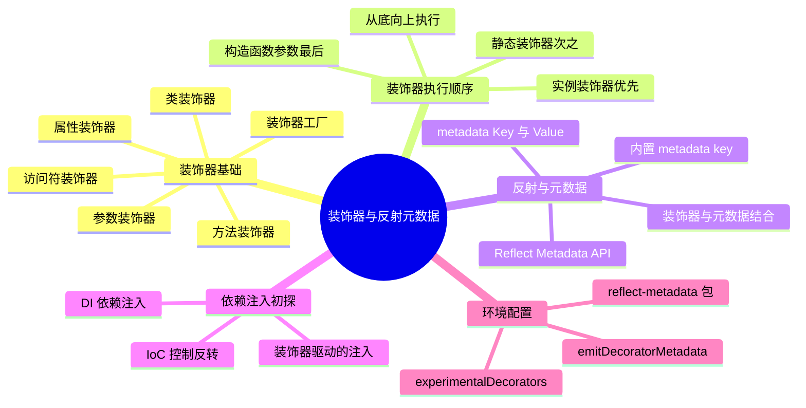

# 装饰器与反射元数据

上一节我们了解了 TypeScript 与 ECMAScript 的关系，以及可选链与空值合并这两个 TypeScript 中的 ECMAScript 提案。其实，还有一个 ECMAScript 提案也已经成为 TypeScript 中相当重要的一部分，它就是装饰器。

装饰器语法在 Python、Java 等语言中都能见到，但在 JavaScript 中并没有被大量使用。一方面是因为，装饰器其实还不能被称为 JavaScript 的一部分，另一方面则是它对应用场景有着一定要求，比如只能使用在 Class 上，而 Class 并不是 JavaScript 中大量使用的语法。

至于为什么说装饰器还不是 JavaScript 的一部分，我们会在扩展阅读中介绍更多。这一节我们只关注 TypeScript 中的装饰器，从基础语法到不同种类的装饰器，从反射到反射元数据，再到基于这些概念实现依赖注入、IoC 容器等等。

## 知识架构



> 本节代码见：[Decorators](https://link.juejin.cn/?target=https%3A%2F%2Fgithub.com%2Flinbudu599%2FTypeScript-Tiny-Book%2Ftree%2Fmain%2Fpackages%2F21-decorators)

## 概述

首先我们需要明确的是，**装饰器的本质其实就是一个函数**，只不过它的入参是提前确定好的。同时，TypeScript 中的装饰器目前**只能在类以及类成员上使用**。

装饰器通过 `@` 语法来使用：

```typescript
function Deco() { }

@Deco
class Foo {}
```

这样的装饰器只能起到固定的功能，我们实际上使用更多的是装饰器工厂的形式。

### 装饰器工厂

装饰器工厂（Decorator Factory）是一个返回装饰器函数的函数，它允许我们通过参数来灵活地调整装饰器的作用：

```typescript
function Deco() { 
  return () => {}
}

@Deco()
class Foo {}
```

在这种情况下，程序执行时会先执行 `Deco()`，再用内部返回的函数作为装饰器的实际逻辑。这样，我们就可以通过入参来灵活地调整装饰器的作用。

接下来，我们就来学习一下 TypeScript 中的装饰器是如何使用的，它们分别有什么作用？

## 环境配置

在使用装饰器之前，需要在 TypeScript 项目中进行相应的配置。TypeScript 5.0+ 支持两种装饰器模式：**TC39 标准装饰器**（推荐）和**旧版实验性装饰器**。

### TC39 标准装饰器（TypeScript 5.0+ 推荐）

TypeScript 5.0 开始支持 ECMAScript Stage 3 标准装饰器，无需额外配置即可使用：

```json
{
  "compilerOptions": {
    "target": "ES2022",
    "module": "ES2022",
    "lib": ["ES2022", "DOM"]
  }
}
```

> **注意**：不设置 `experimentalDecorators` 即默认使用 TC39 标准装饰器。

### 旧版实验性装饰器（兼容模式）

如果项目需要兼容旧版装饰器（如使用 NestJS、TypeORM 等框架），需要显式启用：

```json
{
  "compilerOptions": {
    "experimentalDecorators": true,
    "emitDecoratorMetadata": true,
    "target": "ES2015",
    "module": "commonjs"
  }
}
```

### 配置说明

| 配置项 | 说明 | 默认值 | 适用版本 |
|--------|------|--------|----------|
| `experimentalDecorators` | 启用旧版实验性装饰器 | `false` | TS < 5.0 必需 |
| `emitDecoratorMetadata` | 在装饰器中启用元数据反射支持 | `false` | 仅旧版装饰器 |

> **迁移建议**：新项目推荐使用 TC39 标准装饰器。旧项目可逐步迁移，两种模式不可混用。

### 安装依赖

如果需要使用反射元数据功能，需要安装 `reflect-metadata`：

```bash
# npm
npm install reflect-metadata

# yarn
yarn add reflect-metadata

# pnpm
pnpm add reflect-metadata
```

然后在入口文件顶部引入：

```typescript
import 'reflect-metadata';
```

## 装饰器基础

TypeScript 中的装饰器可以分为**类装饰器**、**方法装饰器**、**访问符装饰器**、**属性装饰器**以及**参数装饰器**五种，最常见的主要还是类装饰器、方法装饰器以及属性装饰器。接下来，我们会依次介绍这几种装饰器的具体使用。

### 类装饰器

类装饰器是直接作用在类上的装饰器，它在执行时的入参只有一个，那就是这个类本身（而不是类的原型对象）。因此，我们可以通过类装饰器来覆盖类的属性与方法，如果你在类装饰器中返回一个新的类，它甚至可以篡改掉整个类的实现。

#### 类型签名

```typescript
type ClassDecorator = <TFunction extends Function>(
  target: TFunction
) => TFunction | void;
```

#### 参数说明

| 参数 | 类型 | 说明 |
|------|------|------|
| `target` | `Function` | 类的构造函数 |

#### 基本使用

```typescript
@AddProperty('linbudu')
@AddMethod()
class Foo {
  a = 1;
}

function AddMethod(): ClassDecorator {
  return (target: any) => {
    target.prototype.newInstanceMethod = () => {
      console.log("Let's add a new instance method!");
    };
    target.newStaticMethod = () => {
      console.log("Let's add a new static method!");
    };
  };
}

function AddProperty(value: string): ClassDecorator {
  return (target: any) => {
    target.prototype.newInstanceProperty = value;
    target.newStaticProperty = `static ${value}`;
  };
}
```

这里，我们通过 TypeScript 内置的 `ClassDecorator` 类型定义来进行类型标注，由于类装饰器只有一个参数，我们也不想使用过多的类型代码，这里我就直接 any 了。我们的函数返回了一个 `ClassDecorator`，因此这个装饰器就是一个装饰器工厂，在实际执行时需要以 `@Deco()` 的形式调用。

在 `AddMethod` 与 `AddProperty` 方法中，我们分别在 `target`、`target.prototype` 上添加了方法与属性，还记得 ES6 中 Class 的本质仍然是基于原型的吗？在这里 target 上的属性实际上是**静态成员**，也就是其实例上不会获得的方法，而 `target.prototype` 上的属性才是会随着继承与实例化过程被传递的**实例成员**。

我们来调用一下看看：

```typescript
const foo: any = new Foo();

foo.newInstanceMethod();
(<any>Foo).newStaticMethod();

console.log(foo.newInstanceProperty);
console.log((<any>Foo).newStaticProperty);
// Let's add a new instance method!
// Let's add a new static method!
// linbudu
// static linbudu
```

我们在这里调用的方法并没有直接在 Foo 中定义，而是通过装饰器来强行添加！

#### 替换类实现

我们也可以在装饰器中返回一个子类来完全替换原有的类实现：

```typescript
const OverrideBar = (target: any) => {
  return class extends target {
    print() {}
    overridedPrint() {
      console.log('This is Overrided Bar!');
    }
  };
};

@OverrideBar
class Bar {
  print() {
    console.log('This is Bar!');
  }
}

// 被覆盖了，现在是一个空方法
new Bar().print();

// This is Overrided Bar!
(<any>new Bar()).overridedPrint();
```

#### 实际应用场景

在 React Class 组件时代，有许多功能也是通过装饰器实现的：

- **Mobx**: `@observer` 与 `@observable`
- **React-Redux**: `@connect`
- **NestJS**: `@Controller`、`@Injectable`、`@Module`
- **TypeORM**: `@Entity`、`@Column`、`@PrimaryGeneratedColumn`

### 方法装饰器

方法装饰器的入参包括**类的原型**、**方法名**以及**方法的属性描述符**（PropertyDescriptor），而通过属性描述符你可以控制这个方法的内部实现（即 value）、可变性（即 writable）等信息。

#### 类型签名

```typescript
type MethodDecorator = <T>(
  target: Object,
  propertyKey: string | symbol,
  descriptor: TypedPropertyDescriptor<T>
) => TypedPropertyDescriptor<T> | void;
```

#### 参数说明

| 参数 | 类型 | 说明 |
|------|------|------|
| `target` | `Object` | 类的原型对象（对于静态方法则是类的构造函数） |
| `propertyKey` | `string \| symbol` | 方法名称 |
| `descriptor` | `TypedPropertyDescriptor` | 方法的属性描述符 |

#### 基本使用

能拿到原本实现，也就意味着，我们可以在执行原本方法的同时，插入一段新的逻辑，比如计算这个方法的执行耗时：

```typescript
class Foo {
  @ComputeProfiler()
  async fetch() {
    return new Promise((resolve, reject) => {
      setTimeout(() => {
        resolve('RES');
      }, 3000);
    });
  }
}

function ComputeProfiler(): MethodDecorator {
  return (
    _target,
    methodIdentifier,
    descriptor: TypedPropertyDescriptor<any>
  ) => {
    const originalMethodImpl = descriptor.value!;
    descriptor.value = async function (...args: unknown[]) {
      const start = new Date();
      const res = await originalMethodImpl.apply(this, args); // 执行原本的逻辑
      const end = new Date();
      console.log(
        `${String(methodIdentifier)} Time: `,
        end.getTime() - start.getTime()
      );
      return res;
    };
  };
}

(async () => {
  console.log(await new Foo().fetch());
})();
// fetch Time:  3003
// RES
```

> ⚠️ **注意**：方法装饰器的 target 是**类的原型而非类本身**。对于静态方法，target 是类的构造函数。

#### 常见应用场景

```typescript
// 1. 日志记录
function Log(): MethodDecorator {
  return (target, propertyKey, descriptor) => {
    const original = descriptor.value as Function;
    descriptor.value = function (...args: any[]) {
      console.log(`Calling ${String(propertyKey)} with args:`, args);
      return original.apply(this, args);
    };
  };
}

// 2. 只读方法
function Readonly(): MethodDecorator {
  return (target, propertyKey, descriptor) => {
    descriptor.writable = false;
    return descriptor;
  };
}

// 3. 废弃警告
function Deprecated(message?: string): MethodDecorator {
  return (target, propertyKey, descriptor) => {
    const original = descriptor.value as Function;
    descriptor.value = function (...args: any[]) {
      console.warn(`Method ${String(propertyKey)} is deprecated. ${message ?? ''}`);
      return original.apply(this, args);
    };
  };
}
```

### 访问符装饰器

访问符装饰器并不常见，甚至访问符对于部分同学来说也是陌生的，但它其实就是 `get value(){}` 与 `set value(v)=>{}` 这样的方法，其中 getter 在你访问这个属性 `value` 时触发，而 setter 在你对 `value` 进行赋值时触发。访问符装饰器本质上仍然是方法装饰器，它们使用的类型定义也相同。

> ⚠️ **重要**：访问符装饰器只能同时应用在一对 getter / setter 的其中一个，即要么装饰 getter 要么装饰 setter。这是因为，不论你是装饰哪一个，装饰器入参中的属性描述符都会包括 getter 与 setter 方法。

```typescript
class Foo {
  _value!: string;

  get value() {
    return this._value;
  }

  @HijackSetter('LIN_BU_DU')
  set value(input: string) {
    this._value = input;
  }
}

function HijackSetter(val: string): MethodDecorator {
  return (target, methodIdentifier, descriptor: any) => {
    const originalSetter = descriptor.set;
    descriptor.set = function (newValue: string) {
      const composed = `Raw: ${newValue}, Actual: ${val}-${newValue}`
      originalSetter.call(this, composed);
      console.log(`HijackSetter: ${composed}`);
    };
    // 篡改 getter，使得这个值无视 setter 的更新，返回一个固定的值
    // descriptor.get = function () {
    //   return val;
    // };
  };
}

const foo = new Foo();
foo.value = 'LINBUDU'; // HijackSetter: Raw: LINBUDU, Actual: LIN_BU_DU-LINBUDU
```

在这个例子中，我们通过装饰器劫持了 setter，在执行原本的 setter 方法修改了其参数。同时，我们也可以在这里去劫持 getter（`descriptor.get`），这样一来在读取这个值时，会直接返回一个我们固定好的值，而非其实际的值（如被 setter 更新过的）。

### 属性装饰器

属性装饰器在独立使用时能力非常有限，它的入参只有**类的原型**与**属性名称**，返回值会被忽略，但你仍然可以通过**直接在类的原型上赋值**来修改属性。

#### 类型签名

```typescript
type PropertyDecorator = (
  target: Object,
  propertyKey: string | symbol
) => void;
```

#### 参数说明

| 参数 | 类型 | 说明 |
|------|------|------|
| `target` | `Object` | 类的原型对象（对于静态属性则是类的构造函数） |
| `propertyKey` | `string \| symbol` | 属性名称 |

#### 基本使用

```typescript
class Foo {
  @ModifyNickName()
  nickName!: string;
  constructor() {}
}

function ModifyNickName(): PropertyDecorator {
  return (target: any, propertyIdentifier) => {
    target[propertyIdentifier] = '林不渡!';
    target['otherName'] = '别名林不渡!';
  };
}

console.log(new Foo().nickName);
// @ts-expect-error
console.log(new Foo().otherName);
// 林不渡!
// 别名林不渡!
```

我们在原型对象上强行写入了属性，但这种方法实际上过于 hack，在后面我们会了解如何通过委托的方式来为一个属性注入值。

> 💡 **提示**：属性装饰器无法访问属性的值，因为属性在装饰器应用时还未初始化。如需注入值，建议使用反射元数据配合类装饰器实现。

### 参数装饰器

参数装饰器包括了构造函数的参数装饰器与方法的参数装饰器，它的入参包括**类的原型**、**方法名**与**参数在函数参数中的索引值（即第几个参数）**，如果只是单独使用，它的作用同样非常有限。

#### 类型签名

```typescript
type ParameterDecorator = (
  target: Object,
  propertyKey: string | symbol | undefined,
  parameterIndex: number
) => void;
```

#### 参数说明

| 参数 | 类型 | 说明 |
|------|------|------|
| `target` | `Object` | 类的原型对象（构造函数参数则是类本身） |
| `propertyKey` | `string \| symbol \| undefined` | 方法名称（构造函数参数时为 `undefined`） |
| `parameterIndex` | `number` | 参数在参数列表中的索引位置 |

#### 基本使用

```typescript
class Foo {
  handler(@CheckParam() input: string) {
    console.log(input);
  }
}

function CheckParam(): ParameterDecorator {
  return (target, paramIdentifier, index) => {
    console.log(target, paramIdentifier, index);
  };
}

// {} handler 0
new Foo().handler('linbudu');
```

后面我们会了解如何基于参数装饰器进行参数的默认值注入与校验。

## 装饰器类型速查表

以下是五种装饰器的快速对比：

| 装饰器类型 | target 参数 | 其他参数 | 返回值 | 主要用途 |
|------------|-------------|----------|--------|----------|
| **类装饰器** | 类的构造函数 | 无 | 新的类或 void | 修改/替换类定义，添加静态成员 |
| **方法装饰器** | 类的原型对象 | 方法名、属性描述符 | 属性描述符或 void | 修改方法行为、添加日志/缓存 |
| **访问符装饰器** | 类的原型对象 | 访问符名、属性描述符 | 属性描述符或 void | 劫持 getter/setter |
| **属性装饰器** | 类的原型对象 | 属性名 | 无（被忽略） | 注册元数据（需配合反射） |
| **参数装饰器** | 类的原型对象 | 方法名、参数索引 | 无 | 参数验证、依赖注入标记 |

### target 参数对比图

```
┌─────────────────────────────────────────────────────────────────────┐
│                          装饰器 target 参数                          │
├─────────────────────────────────────────────────────────────────────┤
│                                                                     │
│  实例成员（属性/方法/访问符/参数）                                    │
│  ┌─────────────────────┐                                            │
│  │   target = 原型对象  │  ← MyClass.prototype                       │
│  └─────────────────────┘                                            │
│                                                                     │
│  静态成员（属性/方法/访问符/参数）                                    │
│  ┌─────────────────────┐                                            │
│  │   target = 构造函数  │  ← MyClass                                 │
│  └─────────────────────┘                                            │
│                                                                     │
│  类装饰器                                                           │
│  ┌─────────────────────┐                                            │
│  │   target = 构造函数  │  ← MyClass                                 │
│  └─────────────────────┘                                            │
│                                                                     │
│  构造函数参数装饰器                                                   │
│  ┌─────────────────────┐                                            │
│  │   target = 构造函数  │  ← MyClass                                 │
│  └─────────────────────┘                                            │
│                                                                     │
└─────────────────────────────────────────────────────────────────────┘
```

## 装饰器的执行机制

装饰器的执行机制中主要包括**执行时机**、**执行原理**以及**执行顺序**这三个概念。

### 执行时机与原理

首先是执行时机，还记得我们在最开始说的吗？装饰器的本质就是一个函数，因此只要在类上定义了它，即使不去实例化这个类或者读取静态成员，它也会正常执行。很多时候，其实我们也并不会实例化具有装饰器的类，而是通过反射元数据的能力来消费，这一点我们后面会讲到。

而装饰器的执行原理，我们可以通过编译后的代码来了解：

```typescript
@Cls()
class Foo {
  constructor(@Param() init?: string) { }

  @Prop()
  prop!: string

  @Method()
  handler(@Param() input: string) {

  }
}
```

这一段代码编译的产物会是这样的（经过简化）：

```javascript
"use strict";
var __decorate = (this && this.__decorate) || function (decorators, target, key, desc) {
   // ...
};
var __param = (this && this.__param) || function (paramIndex, decorator) {
    return function (target, key) { decorator(target, key, paramIndex); }
};

let Foo = class Foo {
    constructor(init) { }
    handler(input) {
    }
};
__decorate([
    Prop(),
], Foo.prototype, "prop", void 0);
__decorate([
    Method(),
    __param(0, Param()),
], Foo.prototype, "handler", null);
Foo = __decorate([
    Cls(),
    __param(0, Param()),
], Foo);
```

> 完整的代码见：[Playground](https://link.juejin.cn/?target=https%3A%2F%2Fwww.typescriptlang.org%2Fplay%3F%23code%2FGYVwdgxgLglg9mABAYQDYGcAUBKAXC1AQ3XQBEBTCOAJ0KhsQG8AoRRa8qEapTKQ6gHNO2RAF4AfE0QBfZnOahIsBIgCynABZwAJjnwao2nRSq161Jq3aduvfkJHipjWfOaLw0eEgAK1OAAHfUR-IPJqKABPUxo6BhY2Di4eRD4BYShRSSs2OQUlb1VfAUIAWxCS2jLOCNjzBOtkuzSHTOyXNwUAATQsbGYIIhJEADE4OFzEKjB0KGoQaBpMbqrynEQYMBgoAH58OeotwVFXBTZVgOCBtkCrg-nj8UQAclQtgCMQHRAXjwuwtdrHM6DAIIgQbAIICHkcwIJni9IWDEO8wF8fn9rN1DMYcNZNIQwDpUBEVmsKqItoEQFBYcdTv83Njcbp8WxkeDOQAJIkksmrUqUzZgGl0iGPeGM6z5DyDBBzRDACbPMDkADuYwmOAA3EA)

这里的 `__decorate` 方法，其实就是通过实际入参来判断当前到底执行的是哪种装饰器，然后执行对应的装饰逻辑。而观察这个方法调用时的入参，我们会再次观察到这些装饰器的不同入参：**方法与属性装饰器是类的原型对象**，而**类装饰器才能获得这个类本身作为入参**。而属性装饰器应用时，这个属性还未被初始化（属性需要实例化才会有值），这也是为什么它无法像方法装饰器那样获取到值。

### 执行顺序

在 TypeScript 官方文档中对应用顺序给出了详细的定义：

```
┌─────────────────────────────────────────────────────────────────────┐
│                        装饰器应用顺序                                │
├─────────────────────────────────────────────────────────────────────┤
│                                                                     │
│  1. 实例成员                                                        │
│     ├── 参数装饰器 → 方法装饰器/访问符装饰器/属性装饰器              │
│     └── 按定义顺序依次应用                                          │
│                                                                     │
│  2. 静态成员                                                        │
│     ├── 参数装饰器 → 方法装饰器/访问符装饰器/属性装饰器              │
│     └── 按定义顺序依次应用                                          │
│                                                                     │
│  3. 构造函数参数装饰器                                               │
│                                                                     │
│  4. 类装饰器                                                        │
│                                                                     │
└─────────────────────────────────────────────────────────────────────┘
```

具体规则：

1. *参数装饰器*，然后依次是*方法装饰器*，*访问符装饰器*，或*属性装饰器*应用到每个实例成员。
2. *参数装饰器*，然后依次是*方法装饰器*，*访问符装饰器*，或*属性装饰器*应用到每个静态成员。
3. *参数装饰器*应用到构造函数。
4. *类装饰器*应用到类。

#### 执行顺序 vs 应用顺序

> 关于执行顺序与应用顺序，执行是**装饰器求值得到最终装饰器表达式**的过程，而应用则是**最终装饰器逻辑代码执行**的过程：
>
> ```typescript
> function deco() {
>   // 执行（工厂函数调用）
>   return () => {
>     // 应用（装饰器逻辑执行）
>   }
> }
> ```

实际上，对于实例与静态的属性、方法装饰器而言，它们的执行与应用顺序其实**取决于它们定义的位置**，你可以在上面的例子里把方法定义在属性之前，就会发现执行顺序变成了**方法**-**方法参数**-**属性**，即先定义先执行。

#### 执行顺序示例

我们通过一个完整的例子来更深刻地了解执行顺序与应用顺序：

```typescript
function Deco(identifier: string): any {
  console.log(`${identifier} 执行`);
  return function () {
    console.log(`${identifier} 应用`);
  };
}

@Deco('类装饰器')
class Foo {
  constructor(@Deco('构造函数参数装饰器') name: string) {}

  @Deco('实例属性装饰器')
  prop?: number;

  @Deco('实例方法装饰器')
  handler(@Deco('实例方法参数装饰器') args: any) {}
}
```

以上的代码输出是这样的：

```text
实例属性装饰器 执行
实例属性装饰器 应用
实例方法装饰器 执行
实例方法参数装饰器 执行
实例方法参数装饰器 应用
实例方法装饰器 应用
类装饰器 执行
构造函数参数装饰器 执行
构造函数参数装饰器 应用
类装饰器 应用
```

执行顺序就不再赘述，这里我们主要关注应用顺序。顺序大致是**实例属性-实例方法参数-构造函数参数-类**，好像不对，不是说参数装饰器先应用吗？这是因为在这个例子中，我们是先定义属性和属性装饰器的，因此属性装饰器会先应用。如果方法在前，可不就是方法参数装饰器先应用？

你会发现，类装饰器是最后应用的。也就是说，如果我们在方法装饰器中标记某些信息，最终的类装饰器是可以消费到，并且基于此信息对类或类的实例进行某些操作的。如标记为 `@Deprecated` 的方法，我们在最终的类装饰器中可以将这些方法实现替换为一个报错！而标记这些信息的方法则有很多，最简单的如，在全局声明一个 Map，类作为 Key，这些信息作为 Value 也是可以的。当然，后面我们会说到如何使用更好的方式实现。

### 多个同类装饰器的执行顺序

另外，我们也可以使用多个同种装饰器，比如一个类上可以有好多个类装饰器：

```typescript
@Deprecated()
@User()
@Internal
@Provide()
class Foo {}
```

这种情况下，这些装饰器的执行顺序又是怎样的？其顺序分为两步。首先，**由上至下**依次对装饰器的表达式求值，得到装饰器的实现，`@Internal` 中实现即为 Internal 方法，而 `@Provide()` 中实现则需要进行一次求值。

然后，这些装饰器的具体实现才会**从下往上**调用，如这里是 Provide、Internal、User、Deprecated 的顺序。从这个角度来看，甚至有点像洋葱模型：

```
┌─────────────────────────────────────────────────────────────────────┐
│                     多个装饰器的执行流程                              │
├─────────────────────────────────────────────────────────────────────┤
│                                                                     │
│  装饰器定义位置：                                                    │
│                                                                     │
│    @Deprecated()    ← 1. 第一个求值                                  │
│    @User()          ← 2. 第二个求值                                  │
│    @Internal        ← 3. 第三个求值                                  │
│    @Provide()       ← 4. 第四个求值                                  │
│    class Foo {}                                                     │
│                                                                     │
│  求值顺序（由上至下）：Deprecated → User → Internal → Provide        │
│                                                                     │
│  应用顺序（由下至上）：Provide → Internal → User → Deprecated        │
│                                                                     │
│  ┌─────────────────────────────────────────────────────────────┐    │
│  │  Deprecated 应用                                              │    │
│  │  ┌───────────────────────────────────────────────────────┐    │    │
│  │  │  User 应用                                              │    │    │
│  │  │  ┌───────────────────────────────────────────────────┐│    │    │
│  │  │  │  Internal 应用                                      ││    │    │
│  │  │  │  ┌───────────────────────────────────────────────┐││    │    │
│  │  │  │  │  Provide 应用                                  │││    │    │
│  │  │  │  │  ┌─────────────────────────────────────────┐  │││    │    │
│  │  │  │  │  │              class Foo                  │  │││    │    │
│  │  │  │  │  └─────────────────────────────────────────┘  │││    │    │
│  │  │  │  └───────────────────────────────────────────────┘││    │    │
│  │  │  └───────────────────────────────────────────────────┘│    │    │
│  │  └───────────────────────────────────────────────────────┘    │    │
│  └─────────────────────────────────────────────────────────────┘    │
│                                                                     │
└─────────────────────────────────────────────────────────────────────┘
```

```typescript
function Foo(): MethodDecorator {
  console.log('foo in');
  return (target, propertyKey, descriptor) => {
    console.log('foo out');
  };
}

function Bar(): MethodDecorator {
  console.log('bar in');
  return (target, propertyKey, descriptor) => {
    console.log('bar out');
  };
}

const Baz: MethodDecorator = () => {
  console.log('baz apply');
};

class User {
  @Foo()
  @Bar()
  @Baz
  method() {}
}

// foo in
// bar in
// baz apply
// bar out
// foo out
```

类似的，如果一个方法中的多个参数均存在装饰器，那么同样是 `Param1 in` - `Param2 in` - `Param2 out` - `Param1 out` 的顺序，也就是**后面参数的装饰器逻辑**反而先执行。

**但我们通常不会在同种装饰器中进行存在依赖关系的操作。** 对于属性、参数装饰器来说，我们通常只进行信息注册，委托别人处理。对于方法装饰器来说，我们最多只进行方法执行前后的逻辑注入。而这些过程都应当是彼此独立的。

那么，这里的委托又如何实现呢？这时候我们就要介绍一位新朋友了：**反射（Reflect）**。你可能很早就认识，但没怎么接触过。

## 反射 Reflect

Reflect 在 ES6 中被首次引入，它主要是为了配合 Proxy 保留一份方法原始的实现逻辑，如以下来自阮一峰老师的 ES6 标准入门中 [Reflect](https://link.juejin.cn/?target=https%3A%2F%2Fes6.ruanyifeng.com%2F%23docs%2Freflect) 一节的代码：

```js
Proxy(target, {
  set: function(target, name, value, receiver) {
    var success = Reflect.set(target, name, value, receiver);
    if (success) {
      console.log('property ' + name + ' on ' + target + ' set to ' + value);
    }
    return success;
  }
});
```

Proxy 将修改这个对象的 set 方法，但我们可以通过 `Reflect.set` 方法获得原本的默认实现（不会被修改），先执行完默认实现逻辑再添加自己的额外逻辑。

Proxy 上的这些方法会一一对应到 Reflect 中（或者说 Reflect 中只有 Proxy 上方法的对应实现），如 `defineProperty`、`deleteProperty`、`apply`、`get`、`set`、`has` 等等。这些方法其实也可以在别的对象上找到，如 `Object.defineProperty`、`Function.prototype.apply` 等等，因此 Reflect 其实也起到了方法收拢的作用。

如果你有 Java、Go 等语言的基础，一定会反驳说反射才不是用来干这个的呢。别急，我们才刚要开始介绍。

上面的 Proxy 对象的 set 方法是运行时才实际执行的，也就是说我们通过反射，在**运行时去修改了程序的行为**。这就是反射的核心要素：**在程序运行时去检查以及修改程序行为**，比如在代码运行时通过 `Reflect.construct` 实例化一个类，通过 `Reflect.setPrototypeOf` 修改对象原型指向，这些其实都属于反射 API。

> 此前 JavaScript 中的反射 API 散落在各个顶级对象的命名空间下，因此我们需要 Reflect 来进行一次统一。

### Reflect API 参考

| 方法 | 说明 |
|------|------|
| `Reflect.get(target, propertyKey, receiver?)` | 获取对象属性 |
| `Reflect.set(target, propertyKey, value, receiver?)` | 设置对象属性 |
| `Reflect.has(target, propertyKey)` | 检查属性是否存在 |
| `Reflect.deleteProperty(target, propertyKey)` | 删除属性 |
| `Reflect.apply(target, thisArgument, argumentsList)` | 调用函数 |
| `Reflect.construct(target, argumentsList, newTarget?)` | 构造实例 |
| `Reflect.defineProperty(target, propertyKey, attributes)` | 定义属性 |
| `Reflect.getOwnPropertyDescriptor(target, propertyKey)` | 获取属性描述符 |
| `Reflect.getPrototypeOf(target)` | 获取原型 |
| `Reflect.setPrototypeOf(target, proto)` | 设置原型 |
| `Reflect.isExtensible(target)` | 检查是否可扩展 |
| `Reflect.preventExtensions(target)` | 阻止扩展 |
| `Reflect.ownKeys(target)` | 获取所有自有属性键 |

比如通过反射来实例化一个类：

```typescript
// 普通情况
const foo = new Foo()
foo.hello()

// 基于反射
const foo = Reflect.construct(Foo)
const hello = Reflect.get(foo, 'hello')
Reflect.apply(hello, foo, [])
```

我们的主要内容和反射并没有太大的关系，下面要介绍的反射元数据才是本节的重量级角色。但你仍然需要铭记反射的核心理念：**在程序运行时去检查以及修改程序行为**。

## 反射元数据 Reflect Metadata

不同于反射，**反射元数据（Reflect Metadata）** 这一提案虽然同样很早就被提出，但至今都未真正的成为 ECMAScript 的一部分，原因在于元数据和装饰器提案的联系非常紧密，随着装饰器提案迟迟不能推进，元数据当然也无法独自向前。因此，想要使用反射元数据，你还需要安装 [reflect-metadata](https://link.juejin.cn/?target=https%3A%2F%2Fgithub.com%2Frbuckton%2Freflect-metadata)，并在入口文件中的顶部 `import "reflect-metadata"`。

反射元数据提案（即 `"reflect-metadata"` 包）为顶级对象 Reflect 新增了一批专用于元数据读写的 API，如 `Reflect.defineMetadata`、`Reflect.getMetadata` 等。那么元数据又是什么？你可以将元数据理解为**用于描述数据的数据**，如某个方法的参数信息、返回值信息就可称为该方法的元数据。

### 元数据存储机制

那么元数据又存储在哪里？提案中专门说明了这一点，为类或类属性添加了元数据后，构造函数（或是构造函数的原型，根据静态成员还是实例成员决定）会具有 `[[Metadata]]` 属性，该属性内部包含一个 Map 结构，键为属性键，值为元数据键值对。

```
┌─────────────────────────────────────────────────────────────────────┐
│                        元数据存储位置                                │
├─────────────────────────────────────────────────────────────────────┤
│                                                                     │
│  ┌─────────────────────────────────────────────────────────────┐    │
│  │                    类（构造函数）                             │    │
│  │  [[Metadata]]: Map {                                         │    │
│  │    "class:key" => "class metadata",                          │    │
│  │    // 静态成员的元数据也存储在这里                            │    │
│  │  }                                                           │    │
│  └─────────────────────────────────────────────────────────────┘    │
│                              │                                      │
│                              ▼ prototype                            │
│  ┌─────────────────────────────────────────────────────────────┐    │
│  │                    原型对象                                   │    │
│  │  [[Metadata]]: Map {                                         │    │
│  │    "prop" => Map { "prop:key" => "prop metadata" },          │    │
│  │    "method" => Map { "method:key" => "method metadata" },    │    │
│  │    // 实例成员的元数据存储在这里                              │    │
│  │  }                                                           │    │
│  └─────────────────────────────────────────────────────────────┘    │
│                                                                     │
└─────────────────────────────────────────────────────────────────────┘
```

也就是说：
- **静态成员的元数据信息存储于构造函数**
- **实例成员的元数据信息存储于构造函数的原型上**

### 基本使用

我们来简单使用下元数据的注册与提取：

```typescript
import 'reflect-metadata';

class Foo {
  handler() {}
}

Reflect.defineMetadata('class:key', 'class metadata', Foo);
Reflect.defineMetadata('method:key', 'handler metadata', Foo, 'handler');
Reflect.defineMetadata(
  'proto:method:key',
  'proto handler metadata',
  Foo.prototype,
  'handler'
);
```

`defineMetadata` 的入参包括元数据 Key、元数据 Value、目标类 Target 以及一个可选的属性，在这里我们的三个调用分别是在 Foo、Foo.handler 以及 Foo.prototype 上注册元数据。而提取则可以通过 `getMetadata` 方法：

```typescript
// [ 'class:key' ]
console.log(Reflect.getMetadataKeys(Foo));
// ['method:key']
console.log(Reflect.getMetadataKeys(Foo, 'handler'));
// ['proto:method:key'];
console.log(Reflect.getMetadataKeys(Foo.prototype, 'handler'));

// class metadata
console.log(Reflect.getMetadata('class:key', Foo));
// handler metadata
console.log(Reflect.getMetadata('method:key', Foo, 'handler'));
// proto handler metadata
console.log(Reflect.getMetadata('proto:method:key', Foo.prototype, 'handler'));
```

实际上，反射元数据正是我们实现属性装饰器中提到的"委托"能力的基础。我们在属性装饰器中去注册一个元数据，然后在真正实例化这个类时，就可以拿到类原型上的元数据，以此对实例化完毕的类再进行额外操作。比如说，我先通过元数据说明，这个属性需要获得变量 a 的值，在实例化时，我们发现有这个元数据，就会对应进行赋值操作。

### 装饰器形式

正是考虑到这一点，反射元数据中直接就内置了基于装饰器的调用方式：

```typescript
@Reflect.metadata('class:key', 'METADATA_IN_CLASS')
class Foo {
  @Reflect.metadata('prop:key', 'METADATA_IN_PROPERTY')
  public prop: string = 'linbudu';

  @Reflect.metadata('method:key', 'METADATA_IN_METHOD')
  public handler(): void {}
}
```

`@Reflect.metadata` 装饰器会基于应用的位置进行实际的逻辑调用，如在类上装饰时以类作为 target 进行注册，而在静态成员与实例成员中分别使用构造函数、构造函数原型。

```typescript
const foo = new Foo();

// METADATA_IN_CLASS
console.log(Reflect.getMetadata('class:key', Foo));
// undefined
console.log(Reflect.getMetadata('class:key', Foo.prototype));

// METADATA_IN_METHOD
console.log(Reflect.getMetadata('method:key', Foo.prototype, 'handler'));
// METADATA_IN_METHOD
console.log(Reflect.getMetadata('method:key', foo, 'handler'));

// METADATA_IN_PROPERTY
console.log(Reflect.getMetadata('prop:key', Foo.prototype, 'prop'));
// METADATA_IN_PROPERTY
console.log(Reflect.getMetadata('prop:key', foo, 'prop'));
```

### 内置类型元数据

看起来我们现在拥有了实现委托的基本能力，但实际上这还不够。所有的元数据都需要我们提前定义好，如果我们希望直接用一些已有的信息作为元数据呢？比如下面这个例子：

```typescript
class UserService {
  @InjectModel()
  userModel: UserModel;
}
```

我希望将 userModel 属性的类型 UserModel 作为一个元数据信息注入，同时我不会为 `@InjectModel()` 装饰器提供任何信息，那我们就束手无策了吗？

还记得我们在介绍反射概念时说的，**反射允许程序去检视自身**，而属性类型作为程序的一部分，也应当是能被反射收集的。为了实现这一目的，反射元数据提案中还内置了基于类型的元数据，你可以通过 `design:type`、`design:paramtypes` 以及 `design:returntype` 这三个内置的元数据 Key，获取到类与类成员的类型、参数类型、返回值类型：

| 内置元数据 Key | 说明 | 适用场景 |
|----------------|------|----------|
| `design:type` | 属性/方法的类型 | 属性装饰器、方法装饰器 |
| `design:paramtypes` | 参数类型列表 | 方法装饰器、构造函数 |
| `design:returntype` | 返回值类型 | 方法装饰器 |

```typescript
import 'reflect-metadata';

function DefineType(type: Object) {
  return Reflect.metadata('design:type', type);
}
function DefineParamTypes(...types: Object[]) {
  return Reflect.metadata('design:paramtypes', types);
}
function DefineReturnType(type: Object) {
  return Reflect.metadata('design:returntype', type);
}

@DefineParamTypes(String, Number)
class Foo {
  @DefineType(String)
  get name() {
    return 'linbudu';
  }

  @DefineType(Function)
  @DefineParamTypes(Number, Number)
  @DefineReturnType(Number)
  add(source: number, input: number): number {
    return source + input;
  }
}

const foo = new Foo();
// [ [Function: Number], [Function: Number] ]
const paramTypes = Reflect.getMetadata('design:paramtypes', foo, 'add');
// [Function: Number]
const returnTypes = Reflect.getMetadata('design:returntype', foo, 'add');
// [Function: String]
const type = Reflect.getMetadata('design:type', foo, 'name');
```

> ⚠️ **注意**：这些内置元数据取出的值是**装箱类型对象**，如 `String`、`Number`、`Boolean` 等，而非字符串 `"string"` 或数字。对于自定义类，返回的是类的构造函数本身。

#### TypeScript 对类型元数据的支持

需要注意的是，这一提案实际上并不依赖 TypeScript，这些类型信息来自于运行时，而非我们的类型标注。TypeScript 为其进行了额外的支持，启用 `emitDecoratorMetadata` 配置后，我们才可以获取到类型标注所对应的元数据：

```typescript
class Bar {
  prop!: Foo;
}

const bar = new Bar();
// [class Foo]
const type2 = Reflect.getMetadata('design:type', bar, 'prop');
```

这也是为什么我们需要启用 `emitDecoratorMetadata` 配置的原因之一。上面的装饰器执行机制代码中我们看到了编译后的装饰器代码，而启用 `emitDecoratorMetadata` 后，产物中会多出这些代码：

```js
var __metadata = (this && this.__metadata) || function (k, v) {
    if (typeof Reflect === "object" && typeof Reflect.metadata === "function") return Reflect.metadata(k, v);
};

__decorate([
    Prop(),
    __metadata("design:type", String) // 新增
], Foo.prototype, "prop", void 0);

__decorate([
    Method(),
    __param(0, Param()),
    __metadata("design:type", Function), // 新增
    __metadata("design:paramtypes", [String]), // 新增
    __metadata("design:returntype", void 0) // 新增
], Foo.prototype, "handler", null);

Foo = __decorate([
    Cls(),
    __param(0, Param()),
    __metadata("design:paramtypes", [String]) // 新增
], Foo);
```

### API 参考

以下是 `reflect-metadata` 提供的主要 API：

#### 定义元数据

```typescript
// 在目标对象上定义元数据
Reflect.defineMetadata(metadataKey, metadataValue, target);

// 在目标对象的属性上定义元数据
Reflect.defineMetadata(metadataKey, metadataValue, target, propertyKey);
```

#### 获取元数据

```typescript
// 获取目标对象上的元数据
Reflect.getMetadata(metadataKey, target);

// 获取目标对象属性上的元数据
Reflect.getMetadata(metadataKey, target, propertyKey);

// 获取目标对象上的所有元数据键
Reflect.getMetadataKeys(target);

// 获取目标对象属性上的所有元数据键
Reflect.getMetadataKeys(target, propertyKey);
```

#### 获取自有元数据

```typescript
// 仅获取目标对象自身定义的元数据（不包含原型链继承的）
Reflect.getOwnMetadata(metadataKey, target);
Reflect.getOwnMetadata(metadataKey, target, propertyKey);
Reflect.getOwnMetadataKeys(target);
Reflect.getOwnMetadataKeys(target, propertyKey);
```

#### 检查元数据是否存在

```typescript
Reflect.hasMetadata(metadataKey, target);
Reflect.hasMetadata(metadataKey, target, propertyKey);
Reflect.hasOwnMetadata(metadataKey, target);
Reflect.hasOwnMetadata(metadataKey, target, propertyKey);
```

#### 删除元数据

```typescript
Reflect.deleteMetadata(metadataKey, target);
Reflect.deleteMetadata(metadataKey, target, propertyKey);
```

#### 装饰器形式

```typescript
// 类装饰器
@Reflect.metadata(metadataKey, metadataValue)
class Foo {}

// 属性装饰器
class Bar {
  @Reflect.metadata(metadataKey, metadataValue)
  prop: string;
}
```

## 实战应用

有了装饰器、反射元数据以及内置的基于类型的元数据信息，我们就可以实现"委托"的能力了。下面我们来看几个实际的应用场景。

### 属性校验

以看似平平无奇的属性装饰器为例，我们使用元数据来实现基于装饰器的属性校验。

在这个例子里，我们会实现两种校验逻辑，对必填属性（Required）与属性类型的校验（String / Number / Boolean），其基本使用方式如下：

```typescript
class User {
  @Required()
  name!: string;

  @ValueType(TypeValidation.Number)
  age!: number;
}

const user = new User();
// @ts-expect-error
user.age = '18';
```

我们会将 user 实例传递给校验方法，在这里应当给出两处错误：没有提供必填属性 name，以及 age 属性的类型不符。

如果理解了元数据的作用，那我们的思路就很明确了，装饰器将元数据附加到属性或类上，然后校验方法中遍历属性读取这些元数据，再对比类型是否匹配即可。

#### 实现 Required 装饰器

首先是 Required，我们肯定下意识是这么写：

```typescript
function Required(): PropertyDecorator {
  return (target, prop) => {
    Reflect.defineMetadata("required", true, target, prop);
  };
}
```

也就是在这个属性上定义了一个名为 required 的元数据。但你是否想过，如果实例中根本就没有这个属性呢？就像上面的 user 一样，那这里的元数据不就丢失了？

要解决这一问题，其实只需要将元数据定义在类上即可。我们用一个专门描述必填属性的元数据，存储这个类内部所有的必填属性即可：

```typescript
const requiredMetadataKey = Symbol('requiredKeys');

function Required(): PropertyDecorator {
  return (target, prop) => {
    const existRequiredKeys: string[] =
      Reflect.getMetadata(requiredMetadataKey, target) ?? [];

    Reflect.defineMetadata(
      requiredMetadataKey,
      [...existRequiredKeys, prop],
      target
    );
  };
}
```

#### 实现类型校验装饰器

而对于属性的校验其实就简单了，由于对类型的校验逻辑可以归到一起，我们就使用**装饰器工厂 + 入参**的形式来注入对应的元数据信息，这次我们只需要在属性层面注入元数据即可：

```typescript
enum TypeValidation {
  String = 'string',
  Number = 'number',
  Boolean = 'boolean',
}

const validationMetadataKey = Symbol('expectedType');

function ValueType(type: TypeValidation): PropertyDecorator {
  return (target, prop) => {
    Reflect.defineMetadata(validationMetadataKey, type, target, prop);
  };
}
```

#### 实现校验器

然后就是校验逻辑了，我们需要一个额外的 validator 方法：

```typescript
function validator(entity: any) {
  const clsName = entity.constructor.name;
  const messages: string[] = [];
  
  // 先检查所有必填属性
  const requiredKeys: string[] = Reflect.getMetadata(
    requiredMetadataKey,
    entity
  );

  // 基于反射拿到所有存在的属性
  const existKeys = Reflect.ownKeys(entity);

  for (const key of requiredKeys) {
    if (!existKeys.includes(key)) {
      messages.push(`${clsName}.${String(key)} should be required.`);
    }
  }

  // 接着基于定义在属性上的元数据校验属性类型
  for (const key of existKeys) {
    const expectedType: string = Reflect.getMetadata(
      validationMetadataKey,
      entity,
      key
    );

    if (!expectedType) continue;

    if (Object.values(TypeValidation).includes(expectedType)) {
      const actualType = typeof entity[key];
      if (actualType !== expectedType) {
        messages.push(
          `expect ${clsName}.${String(key)} to be ${expectedType}, but got ${actualType}.`
        );
      }
    }
  }
  
  return messages;
}

console.log(validator(user));
// ['User.name should be required.', 'expect User.age to be number, but got string.']
```

除了这两种校验，你也可以通过元数据的帮助来实现更复杂的校验逻辑。如 MinLength、MaxLength、Min、Max 甚至 Email、IP 这样，对属性值内容的校验。思路仍然还是那么简单明了：**注册元数据，消费元数据**。

### 依赖注入

依赖注入（Dependency Injection，简称 DI）是装饰器和反射元数据的一个重要应用场景，也是 NestJS、TypeORM 等框架的核心机制。

#### 基本概念

依赖注入是一种设计模式，它将依赖的创建和管理从类内部转移到外部容器。这样可以：
- 降低代码耦合度
- 提高代码可测试性
- 便于管理复杂的依赖关系

#### 简单实现

下面是一个简单的依赖注入容器实现：

```typescript
import 'reflect-metadata';

// 元数据键
const INJECTABLE_KEY = Symbol('injectable');
const INJECT_KEY = Symbol('inject');

// 标记类为可注入
function Injectable(): ClassDecorator {
  return (target) => {
    Reflect.defineMetadata(INJECTABLE_KEY, true, target);
  };
}

// 标记需要注入的参数
function Inject(token?: string): ParameterDecorator {
  return (target, propertyKey, parameterIndex) => {
    const existingTokens: (string | undefined)[] = 
      Reflect.getOwnMetadata(INJECT_KEY, target, propertyKey as string) || [];
    existingTokens[parameterIndex] = token;
    Reflect.defineMetadata(INJECT_KEY, existingTokens, target, propertyKey as string);
  };
}

// 简单的 DI 容器
class Container {
  private instances = new Map<Function, any>();
  private providers = new Map<string | Function, Function>();

  // 注册提供者
  register(token: string | Function, provider: Function) {
    this.providers.set(token, provider);
  }

  // 解析依赖
  resolve<T>(target: Function): T {
    // 如果已有实例，直接返回
    if (this.instances.has(target)) {
      return this.instances.get(target);
    }

    // 获取构造函数参数类型
    const paramTypes = Reflect.getMetadata('design:paramtypes', target) || [];
    
    // 解析所有参数依赖
    const dependencies = paramTypes.map((paramType: Function, index: number) => {
      const tokens = Reflect.getOwnMetadata(INJECT_KEY, target);
      const token = tokens?.[index];
      
      // 如果有自定义 token，使用 token 解析
      if (token && this.providers.has(token)) {
        return this.resolve(this.providers.get(token)!);
      }
      
      // 否则使用参数类型解析
      return this.resolve(paramType);
    });

    // 创建实例
    const instance = new (target as any)(...dependencies);
    this.instances.set(target, instance);
    
    return instance;
  }
}

// 使用示例
@Injectable()
class DatabaseService {
  query(sql: string) {
    console.log(`Executing: ${sql}`);
    return [{ id: 1, name: 'test' }];
  }
}

@Injectable()
class UserService {
  constructor(
    @Inject() private db: DatabaseService
  ) {}

  getUser(id: number) {
    return this.db.query(`SELECT * FROM users WHERE id = ${id}`);
  }
}

// 容器使用
const container = new Container();
container.register(DatabaseService, DatabaseService);
container.register(UserService, UserService);

const userService = container.resolve<UserService>(UserService);
userService.getUser(1); // Executing: SELECT * FROM users WHERE id = 1
```

#### IoC 容器模式

上面的例子展示了最基础的依赖注入实现。在实际应用中，IoC（Inversion of Control，控制反转）容器会更加复杂，通常包括：

1. **生命周期管理**
   - Singleton：单例，整个应用共享一个实例
   - Transient：瞬态，每次请求创建新实例
   - Request：请求作用域，每个请求一个实例

2. **循环依赖检测**

3. **异步初始化支持**

4. **模块化组织**

```typescript
// 带生命周期的注册选项
interface ProviderOptions {
  token: string | Function;
  useClass?: Function;
  useValue?: any;
  useFactory?: (...args: any[]) => any;
  scope: 'singleton' | 'transient' | 'request';
}

// NestJS 风格的模块系统示例
@Module({
  providers: [DatabaseService, UserService],
  exports: [UserService],
})
class UserModule {}
```

## 最佳实践

### 1. 使用 Symbol 作为元数据键

避免元数据键冲突，推荐使用 Symbol：

```typescript
// ❌ 不推荐：字符串键可能冲突
Reflect.defineMetadata('required', true, target, prop);

// ✅ 推荐：使用 Symbol
const REQUIRED_KEY = Symbol('required');
Reflect.defineMetadata(REQUIRED_KEY, true, target, prop);
```

### 2. 类型安全

尽量为装饰器添加类型注解：

```typescript
// ✅ 使用内置类型
function Log(): MethodDecorator {
  return (target, propertyKey, descriptor) => {
    // ...
  };
}

// ✅ 自定义类型
type AsyncMethodDecorator = (
  target: Object,
  propertyKey: string | symbol,
  descriptor: TypedPropertyDescriptor<(...args: any[]) => Promise<any>>
) => TypedPropertyDescriptor<(...args: any[]) => Promise<any>> | void;
```

### 3. 避免过度使用

装饰器虽然强大，但不应滥用：

```typescript
// ❌ 过度使用
@Logged
@Cached
@Validated
@Timed
@Deprecated
@Authorized
@Retry(3)
class UserService {
  // ...
}

// ✅ 适度使用，保持代码清晰
@Injectable()
@Logged()
class UserService {
  // 核心业务逻辑
}
```

### 4. 注意执行顺序

理解装饰器的执行顺序对于调试和设计非常重要：

```typescript
// 装饰器执行顺序：由上至下求值，由下至上应用
@DecoratorA()  // 第一个求值，最后一个应用
@DecoratorB()  // 第二个求值，第二个应用
@DecoratorC    // 第三个求值，第一个应用
class Foo {}
```

### 5. 元数据存储位置

根据需求选择正确的存储位置：

```typescript
// 类级别的元数据 → 存储在构造函数上
Reflect.defineMetadata('role', 'admin', target);

// 实例成员元数据 → 存储在原型上
Reflect.defineMetadata('validation', rules, target, propertyName);

// 静态成员元数据 → 存储在构造函数上
Reflect.defineMetadata('config', config, target, staticPropertyName);
```

### 6. 性能考虑

装饰器在类定义时执行，而非实例化时：

```typescript
// ❌ 避免在装饰器中执行耗时操作
function SlowDeco(): ClassDecorator {
  return (target) => {
    // 这会在模块加载时执行
    heavyComputation(); 
  };
}

// ✅ 延迟执行耗时逻辑
function LazyDeco(): ClassDecorator {
  return (target) => {
    // 只注册元数据，不执行耗时操作
    Reflect.defineMetadata('lazy', true, target);
  };
}
```

### 7. 组合使用

将多个简单装饰器组合成复杂功能：

```typescript
// 基础装饰器
function Log() { /* ... */ }
function Validate() { /* ... */ }
function Cache() { /* ... */ }

// 组合装饰器
function SmartMethod() {
  return (target: any, key: string, descriptor: PropertyDescriptor) => {
    Log()(target, key, descriptor);
    Validate()(target, key, descriptor);
    Cache()(target, key, descriptor);
  };
}

class Service {
  @SmartMethod()
  async getData() {}
}
```

## 常见问题解答

### Q1: 装饰器能用在普通函数上吗？

**不能**。目前 TypeScript 的装饰器只能在类及其成员上使用。如果需要装饰函数，可以考虑高阶函数模式：

```typescript
// 使用高阶函数替代
function logged<T extends (...args: any[]) => any>(fn: T): T {
  return ((...args: any[]) => {
    console.log(`Calling with args:`, args);
    return fn(...args);
  }) as T;
}

const myFunc = logged((x: number) => x * 2);
```

### Q2: 为什么属性装饰器无法获取属性值？

属性装饰器在类定义时执行，此时属性还未初始化。要注入默认值，应该：

1. 使用类装饰器配合元数据
2. 在实例化后通过元数据注入值

```typescript
function DefaultValue(value: any): PropertyDecorator {
  return (target, prop) => {
    // 注册元数据
    Reflect.defineMetadata('default', value, target, prop);
  };
}

function ApplyDefaults(): ClassDecorator {
  return (target) => {
    return class extends target {
      constructor(...args: any[]) {
        super(...args);
        // 应用默认值
        const keys = Reflect.getMetadataKeys(target.prototype);
        for (const key of keys) {
          if (Reflect.hasMetadata('default', target.prototype, key)) {
            (this as any)[key] = Reflect.getMetadata('default', target.prototype, key);
          }
        }
      }
    };
  };
}
```

### Q3: TypeScript 装饰器与 ECMAScript 装饰器有什么区别？

它们是完全不同的实现：

| 特性 | TypeScript 装饰器 | ECMAScript 装饰器（Stage 3） |
|------|-------------------|------------------------------|
| 提案阶段 | 基于旧版提案（Stage 1） | Stage 3（2022年） |
| 类装饰器参数 | `(target)` | `{ addInitializer, metadata }` |
| 方法装饰器参数 | `(target, key, descriptor)` | `(value, context)` |
| 元数据 | 需要 `reflect-metadata` | 内置支持 |
| 兼容性 | 广泛使用 | 新项目推荐 |

TypeScript 5.0+ 支持通过配置选择使用新版装饰器。

两种模式在配置与能力上的差异：

| 特性 | 旧版 (`experimentalDecorators`) | 新版 (TC39 标准) |
|------|--------------------------------|------------------|
| 配置 | `experimentalDecorators: true` | 无需配置 |
| 参数装饰器 | ✅ 支持 | ❌ 不支持 |
| 返回值 | 自由定义 | 标准化结构 |
| 元数据 | `emitDecoratorMetadata` | 需要额外处理 |

```typescript
// 旧版装饰器
function OldDeco(target: any, key: string, descriptor: PropertyDescriptor) {
  // ...
}

// 新版装饰器
function NewDeco(value: any, context: ClassMethodDecoratorContext) {
  // context 包含：kind, name, private, static, access 等
}
```

### Q4: 如何处理装饰器的异步操作？

装饰器本身不能是异步的，但可以在装饰器内部处理异步逻辑：

```typescript
function Retry(attempts: number): MethodDecorator {
  return (target, key, descriptor) => {
    const original = descriptor.value as Function;
    descriptor.value = async function (...args: any[]) {
      for (let i = 0; i < attempts; i++) {
        try {
          return await original.apply(this, args);
        } catch (error) {
          if (i === attempts - 1) throw error;
          await new Promise(r => setTimeout(r, 1000));
        }
      }
    };
  };
}
```

### Q5: `design:type` 的局限性？

`design:type` 有一些重要的局限：

```typescript
class Example {
  // ✅ 可以正确获取类型
  @Reflect.metadata('test', true)
  name: string;  // design:type = String
  
  // ❌ 无法区分具体类型，都是 Array
  list: Array<string>;  // design:type = Array
  items: string[];      // design:type = Array
  
  // ❌ 接口类型会丢失
  user: IUser;  // design:type = Object
  
  // ❌ 泛型类型信息丢失
  map: Map<string, number>;  // design:type = Map
}
```

解决方案：
- 使用自定义元数据传递类型信息
- 使用字符串 token 标识类型

```typescript
function Type(type: unknown): PropertyDecorator {
  return (target, prop) => {
    Reflect.defineMetadata('custom:type', type, target, prop);
  };
}

class Example {
  // 传入自定义的类型描述值(如字符串),而非把类型标注当作值使用
  @Type('string[]')
  list: string[];
}
```

### Q6: 如何在装饰器中访问 this？

使用普通函数而非箭头函数：

```typescript
function Log(): MethodDecorator {
  return (target, key, descriptor) => {
    const original = descriptor.value!;
    
    // ❌ 箭头函数会丢失 this
    // descriptor.value = (...args: any[]) => {
    //   console.log(this); // 错误的 this
    //   return original(...args);
    // };
    
    // ✅ 普通函数保留 this
    descriptor.value = function (...args: any[]) {
      console.log(this); // 正确的实例
      return original.apply(this, args);
    };
  };
}
```

### Q7: reflect-metadata 是必需的吗？

**A**: 取决于使用场景：

| 场景 | 是否必需 |
|------|----------|
| 简单装饰器（日志、缓存） | ❌ 不需要 |
| 依赖注入 | ✅ 需要 |
| 路由注册 | ✅ 需要 |
| 属性验证 | ✅ 需要 |

### Q8: 如何调试装饰器？

**A**: 使用以下技巧：

```typescript
function Debug(): MethodDecorator {
  return (target, key, descriptor) => {
    console.log('Target:', target.constructor.name);
    console.log('Key:', String(key));
    console.log('Descriptor:', descriptor);
    console.log('Original value:', descriptor.value);
    
    // 查看已有元数据
    const keys = Reflect.getOwnMetadataKeys(target, key);
    console.log('Metadata keys:', keys);
  };
}
```

## 总结与预告

这一节，我们了解了装饰器的基本概念，包括 TypeScript 中的五种装饰器，以及这些装饰器的入参、使用场景、执行顺序等等。另外我们还掌握了反射元数据的使用，目前看起来它好像并没有什么特别之处？那么在下一节，我们就会在反射元数据的基础上，去了解一个新的概念：控制反转，并基于装饰器与反射元数据深入实现完整的 IoC 容器、依赖注入框架与路由系统。

### 核心要点回顾

1. **装饰器本质**：装饰器是一个特殊函数，在类定义时自动执行
2. **五种类型**：类、方法、访问符、属性、参数装饰器
3. **执行顺序**：实例成员 → 静态成员 → 构造函数 → 类装饰器
4. **反射元数据**：通过元数据实现跨装饰器通信和依赖注入
5. **实战应用**：属性校验、依赖注入、AOP 编程

### 装饰器能力速查

```
┌─────────────────────────────────────────────────────────────────┐
│                      装饰器能力图谱                              │
├─────────────────────────────────────────────────────────────────┤
│                                                                 │
│  类装饰器        ┌─────────────────────────────────────────┐    │
│  ────────────    │ ✅ 修改/替换类定义                        │    │
│                  │ ✅ 添加静态属性/方法                       │    │
│                  │ ✅ 注册到容器                             │    │
│                  └─────────────────────────────────────────┘    │
│                                                                 │
│  方法装饰器      ┌─────────────────────────────────────────┐    │
│  ────────────    │ ✅ 修改方法行为（日志、缓存、计时）         │    │
│                  │ ✅ 修改方法实现                           │    │
│                  │ ✅ 注册路由/中间件                        │    │
│                  └─────────────────────────────────────────┘    │
│                                                                 │
│  属性装饰器      ┌─────────────────────────────────────────┐    │
│  ────────────    │ ⚠️ 能力有限（无属性描述符）               │    │
│                  │ ✅ 注册元数据（配合反射）                  │    │
│                  │ ✅ 标记依赖注入点                         │    │
│                  └─────────────────────────────────────────┘    │
│                                                                 │
│  参数装饰器      ┌─────────────────────────────────────────┐    │
│  ────────────    │ ⚠️ 能力有限（无返回值）                   │    │
│                  │ ✅ 注册参数元数据                         │    │
│                  │ ✅ 标记注入参数                           │    │
│                  └─────────────────────────────────────────┘    │
│                                                                 │
└─────────────────────────────────────────────────────────────────┘
```

## 扩展阅读

### 装饰器的坎坷进程

正如我们在开头提到的，装饰器从被作为一个提案提出开始，很是经历了一番风雨，下面我们就来具体介绍一下它到底都经历了些什么。

首先需要明确的是，目前 JavaScript（ECMAScript）中的装饰器，和我们这节学习的 TypeScript 装饰器基本是两件完全不同的事物。[装饰器提案](https://link.juejin.cn/?target=https%3A%2F%2Fgithub.com%2Ftc39%2Fproposal-decorators) 距离最开始提出已经过去了数年，在这期间提案内容，也就是语法、作用与运行时机制等，已经迭代了四个版本。

第四个版本在 2022 年 3 月份的 TC39 会议中终于如愿进入 Stage 3，也就意味着这一版本的实现基本上就是未来最终落地的版本。此前的版本都在 Stage 2 就胎死腹中，而 TypeScript 与 Babel 中的装饰器则是基于第一版的提案实现的，虽然语法都还是 `@`，但这两个版本的装饰器实际上差异非常之大。

> 如果你有兴趣了解新版装饰器的具体语义，可以阅读我此前发表的 [2022 年 3 月 TC39 会议报告](https://link.juejin.cn/?target=https%3A%2F%2Fmp.weixin.qq.com%2Fs%2F6PTcjJQTED3WpJH8ToXInw) 来了解更多。另外，在 ECMAScript 装饰器进入 Stage 4，或已经有可用的编译支持（Babel / TypeScript）后，我也会更新关于新版装饰器的使用说明。

通常来说，TypeScript 只会对已经到达 Stage 3 的提案进行提前的支持，如可选链、空值合并、逻辑赋值等。当 TypeScript 最初引入装饰器时大概是在 2015 年，此时装饰器提案位于 Stage 1 阶段。

促使 TS 提前引入的一个重要原因是，当时存在一门 TS 的超集语言（也就是 JS 的超集的超集？）[AtScript](https://link.juejin.cn/?target=https%3A%2F%2Fen.wikipedia.org%2Fwiki%2FAtScript)，它在 TS 的基础上去支持了装饰器语法，来供 Angular 框架使用。TS 团队与 Angular 团队在某种契机下达成一致，决定将装饰器以及相关的注解能力直接引入 TypeScript 中，而 Angular 团队不再维护 AtScript，这实际上避免了未来可能出现的竞争与社区生态分裂问题。

虽然这两个版本的装饰器确实差异很大，但你其实无需担心出现未来需要面对断崖式的更新，目前新版装饰器的能力基本上能完全覆盖旧版所能提供的能力，因此升级成本对于用户或者框架开发者来说都不会太高。而如果还想继续使用旧版装饰器怎么办？我猜 TypeScript 会通过引入一个新的 Compiler Option 来控制实际表现与编译产物。

### TypeScript 5.0+ 新版装饰器

TypeScript 5.0 开始支持 ECMAScript Stage 3 装饰器。要启用新版装饰器：

```json
{
  "compilerOptions": {
    "experimentalDecorators": false  // 禁用旧版装饰器，使用新版
  }
}
```

新版装饰器示例：

```typescript
// 新版装饰器签名
function logged(
  value: Function,
  context: ClassMethodDecoratorContext
) {
  const name = String(context.name);
  return function (this: any, ...args: any[]) {
    console.log(`Calling ${name}`);
    return value.apply(this, args);
  };
}

class Example {
  @logged
  greet(name: string) {
    return `Hello, ${name}`;
  }
}
```

### Reflect.decorate

如果你去观察了装饰器的编译代码，会发现 `__decorate` 方法中有一段代码是检查 `Reflect.decorate` 方法是否存在。这一方法其实也来自于 Reflect Metadata，见 [L115](https://link.juejin.cn/?target=https%3A%2F%2Fgithub.com%2Frbuckton%2Freflect-metadata%2Fblob%2Fmaster%2FReflect.ts%23L115)。这一方法的作用就是，通过反射的方式来进行装饰，如：

```typescript
class Foo {}

Reflect.decorate([/** ...一组装饰器 */], Foo)
```

这也就意味着，你甚至可以**在方法内部去装饰某一个类或其成员**，而不是仅仅只能依赖需要提前定义好的装饰器。

### 框架中的装饰器应用

#### NestJS

```typescript
@Controller('users')
@UseGuards(AuthGuard)
export class UserController {
  constructor(private readonly userService: UserService) {}

  @Get()
  @ApiOperation({ summary: '获取用户列表' })
  findAll(): Promise<User[]> {
    return this.userService.findAll();
  }

  @Post()
  @ApiOperation({ summary: '创建用户' })
  create(@Body() createUserDto: CreateUserDto) {
    return this.userService.create(createUserDto);
  }
}
```

#### TypeORM

```typescript
@Entity('users')
export class User {
  @PrimaryGeneratedColumn()
  id: number;

  @Column({ length: 100 })
  @IsString()
  @IsNotEmpty()
  name: string;

  @Column({ unique: true })
  @IsEmail()
  email: string;

  @CreateDateColumn()
  createdAt: Date;
}
```

#### MobX

```typescript
import { observable, action, computed, makeObservable } from 'mobx';

class Store {
  @observable
  count = 0;

  @computed
  get double() {
    return this.count * 2;
  }

  @action
  increment() {
    this.count++;
  }
}
```

### 相关资源

- [TypeScript 装饰器官方文档](https://www.typescriptlang.org/docs/handbook/decorators.html)
- [reflect-metadata GitHub](https://github.com/rbuckton/reflect-metadata)
- [TC39 装饰器提案](https://github.com/tc39/proposal-decorators)
- [NestJS 依赖注入](https://docs.nestjs.com/fundamentals/custom-providers)
- [TypeORM 实体装饰器](https://typeorm.io/entities)
- [InversifyJS](https://github.com/inversify/InversifyJS) - 强大的 IoC 容器
- [tsyringe](https://github.com/microsoft/tsyringe) - Microsoft 的轻量级 DI 容器
- [依赖注入模式](https://martinfowler.com/articles/injection.html)

