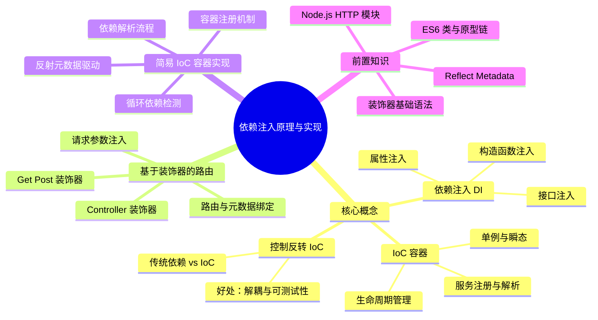

# 依赖注入原理与实现

上一节学习了装饰器与反射元数据的基本使用后，这一节我们将在其基础上深入了解**控制反转（IoC）**、**依赖注入（DI）**等概念，使用装饰器配合反射元数据实现这一设计模式，以及实现基于装饰器的路由体系与一个简单的控制反转容器。

## 知识架构



> **前置知识**：阅读本节前，需要掌握以下内容：
> - TypeScript 装饰器基础语法
> - 反射元数据（Reflect Metadata）的基本使用
> - ES6 类与原型链基础
> - Node.js HTTP 模块基础

> 本节代码见：[Decorators](https://link.juejin.cn/?target=https%3A%2F%2Fgithub.com%2Flinbudu599%2FTypeScript-Tiny-Book%2Ftree%2Fmain%2Fpackages%2F21-decorators)

## 核心概念

### 控制反转与依赖注入

#### 什么是控制反转？

**控制反转（Inversion of Control，IoC）** 是面向对象编程中的一种设计模式，用于实现代码的松耦合。

> 由于控制反转出现的时间较晚，因而没有被包括在四人组的设计模式一书当中，但它仍然是一种设计模式。

#### 传统依赖管理的问题

假设我们存在多个具有依赖关系的类，可能会这样写：

```typescript
import { A } from './modA';
import { B } from './modB';

class C {
  a: A;
  b: B;
  
  constructor() {
    this.a = new A();
    this.b = new B();
  }
}
```

**问题**：当类的数量与依赖关系复杂度暴涨时，C 依赖 A B，D 依赖 A C，F 依赖 B C D...，再加上每个类需要实例化的参数可能不同，此时手动维护这些依赖关系与实例化过程将成为灾难。

#### 控制反转的解决方案

控制反转引入了一个**容器**的概念，内部自动维护这些类的依赖关系：

```typescript
class F {
  d: D;
  
  constructor() {
    this.d = Container.get(D);
  }
}
```

此时，实例 D 已经完成了对 A、C 的依赖填充，C 也完成了 A、B 的依赖填充，所有复杂的依赖关系都被自动处理完毕。

#### 控制反转 vs 控制正转

| 模式 | 说明 | 类比 |
|------|------|------|
| **控制正转** | 手动维护依赖关系 | 在交友平台一个一个找对象，择偶条件由自己决定 |
| **控制反转** | 将依赖控制权交给容器 | 把个人信息上传到婚恋网站，让系统自动匹配 |

#### IoC 的两种实现方式

控制反转的实现方式主要有两种：**依赖查找（Dependency Lookup）** 与 **依赖注入（Dependency Injection）**。

##### 1. 依赖查找

将实例化的过程放到一个 Factory 方法中：

```typescript
class Factory {
  private static instances: Map<string, any> = new Map();
  
  static produce(key: string) {
    if (!this.instances.has(key)) {
      // 根据key创建实例
      const instance = this.createInstance(key);
      this.instances.set(key, instance);
    }
    return this.instances.get(key);
  }
  
  private static createInstance(key: string) {
    // 实例化逻辑
  }
}

class F {
  d: D;
  
  constructor() {
    this.d = Factory.produce("D");
  }
}
```

##### 2. 依赖注入

不需要手动赋值，只需声明属性并用装饰器标明需要注入的值：

```typescript
@Provide()
class F {
  @Inject()
  d!: D;
}
```

**对比**：

| 特性 | 依赖查找 | 依赖注入 |
|------|----------|----------|
| 使用方式 | 需要调用 Factory 方法 | 装饰器自动注入 |
| 代码量 | 较多 | 极少 |
| 依赖逻辑 | 相对透明 | 相对黑盒 |
| 灵活性 | 较高 | 中等 |

#### 装饰器实现依赖注入的原理

装饰器通过**元数据**来实现依赖注入：
1. 在属性中通过 `@Inject` 装饰器注册元数据
2. 告诉容器哪些属性需要被注入
3. 容器在内部存储的类中对应地进行查找和注入

#### 框架应用

在 Angular、NestJS、MidwayJS 等前端框架中大量使用了基于装饰器的依赖注入体系。以 NestJS 为例：

```typescript
@Controller('/user')
class UserController {
  constructor(private readonly userService: UserService) {}
  
  @Get('/list')
  async userList() {
    return this.userService.findAll();
  }

  @Post('/add')
  async addUser() {}
}
```

### 系统架构图

#### 依赖注入流程图

```
┌─────────────────────────────────────────────────────────────────┐
│                        依赖注入工作流程                           │
└─────────────────────────────────────────────────────────────────┘

  ┌──────────┐    注册     ┌──────────────┐
  │  @Provide │ ────────> │   Container   │
  │  装饰器   │           │   (容器)      │
  └──────────┘           │  ┌─────────┐  │
                         │  │ services│  │
  ┌──────────┐    声明    │  │  Map    │  │
  │  @Inject │ ────────> │  └─────────┘  │
  │  装饰器   │           │  ┌─────────┐  │
  └──────────┘           │  │registry │  │
                         │  │  Map    │  │
  ┌──────────┐    获取    │  └─────────┘  │
  │Container.│ ────────> └──────────────┘
  │  get()   │                  │
  └──────────┘                  │ 自动注入
                                ▼
                         ┌──────────────┐
                         │  实例化对象   │
                         │ (依赖已注入)  │
                         └──────────────┘
```

#### IoC 容器结构图

```
┌────────────────────────────────────────────────────────────┐
│                     IoC Container                          │
├────────────────────────────────────────────────────────────┤
│                                                            │
│  services: Map<ServiceKey, ClassStruct>                   │
│  ┌─────────────────────────────────────────────────────┐  │
│  │  'DriverService' → Driver                           │  │
│  │  'Car'           → Car                              │  │
│  │  Driver          → Driver                           │  │
│  │  Car             → Car                              │  │
│  └─────────────────────────────────────────────────────┘  │
│                                                            │
│  propertyRegistry: Map<string, string>                     │
│  ┌─────────────────────────────────────────────────────┐  │
│  │  'Car:driver'     → 'DriverService'                 │  │
│  │  'Car:fuel'       → Fuel                            │  │
│  │  'Bus:driver'     → 'DriverService'                 │  │
│  └─────────────────────────────────────────────────────┘  │
│                                                            │
├────────────────────────────────────────────────────────────┤
│  Methods:                                                  │
│  + set(key, value): void                                   │
│  + get<T>(key): T | undefined                              │
│  + has(key): boolean                                       │
│  + clear(): void                                           │
└────────────────────────────────────────────────────────────┘
```

---

## 实践一：基于依赖注入的路由实现

### 目标

实现基于装饰器的路由能力，并启动 Node Server 承接路由请求：

```typescript
@Controller('/user')
class UserController {
  @Get('/list')
  async userList() {}

  @Post('/add')
  async addUser() {}
}
```

### 实现步骤

#### 1. 定义元数据键

```typescript
export enum METADATA_KEY {
  METHOD = 'ioc:method',
  PATH = 'ioc:path',
  MIDDLEWARE = 'ioc:middleware',
}

export enum REQUEST_METHOD {
  GET = 'ioc:get',
  POST = 'ioc:post',
  PUT = 'ioc:put',
  DELETE = 'ioc:delete',
}
```

#### 2. 实现方法装饰器工厂

```typescript
export const methodDecoratorFactory = (method: string) => {
  return (path: string): MethodDecorator => {
    return (_target, _key, descriptor) => {
      // 在方法实现上注册元数据
      Reflect.defineMetadata(METADATA_KEY.METHOD, method, descriptor.value!);
      Reflect.defineMetadata(METADATA_KEY.PATH, path, descriptor.value!);
    };
  };
};

export const Get = methodDecoratorFactory(REQUEST_METHOD.GET);
export const Post = methodDecoratorFactory(REQUEST_METHOD.POST);
export const Put = methodDecoratorFactory(REQUEST_METHOD.PUT);
export const Delete = methodDecoratorFactory(REQUEST_METHOD.DELETE);
```

**工作原理**：`@Get("/list")` 注册了 `ioc:method - ioc:get` 和 `ioc:path - "list"` 两对元数据。

#### 3. 实现 Controller 装饰器

```typescript
export const Controller = (path?: string): ClassDecorator => {
  return (target) => {
    Reflect.defineMetadata(METADATA_KEY.PATH, path ?? '', target);
  };
};
```

#### 4. 实现路由信息收集器

```typescript
type AsyncFunc = (...args: any[]) => Promise<any>;

interface ICollected {
  path: string;
  requestMethod: string;
  requestHandler: AsyncFunc;
}

export const routerFactory = <T extends object>(ins: T): ICollected[] => {
  const prototype = Reflect.getPrototypeOf(ins) as any;
  
  // 获取根路径
  const rootPath = <string>(
    Reflect.getMetadata(METADATA_KEY.PATH, prototype.constructor)
  );

  // 获取所有方法名（排除 constructor）
  const methods = <string[]>(
    Reflect.ownKeys(prototype).filter((item) => item !== 'constructor')
  );

  // 收集路由信息
  const collected = methods.map((m) => {
    const requestHandler = prototype[m];
    const path = <string>Reflect.getMetadata(METADATA_KEY.PATH, requestHandler);
    const requestMethod = <string>(
      Reflect.getMetadata(METADATA_KEY.METHOD, requestHandler).replace('ioc:', '')
    );

    return {
      path: `${rootPath}${path}`,
      requestMethod,
      requestHandler,
    };
  });
  
  return collected;
};
```

**收集结果示例**：

```json
[
  {
    "path": "/user/list",
    "requestMethod": "get",
    "requestHandler": "[AsyncFunction: userList]"
  },
  {
    "path": "/user/add",
    "requestMethod": "post",
    "requestHandler": "[AsyncFunction: addUser]"
  }
]
```

#### 5. 启动 HTTP 服务

```typescript
import http from 'http';

// 创建 Controller 实例并收集路由信息
const collected = routerFactory(new UserController());

http
  .createServer((req, res) => {
    for (const info of collected) {
      if (
        req.url === info.path &&
        req.method === info.requestMethod.toLocaleUpperCase()
      ) {
        info.requestHandler().then((data) => {
          res.writeHead(200, { 'Content-Type': 'application/json' });
          res.end(JSON.stringify(data));
        });
        return;
      }
    }
    
    // 404 处理
    res.writeHead(404, { 'Content-Type': 'application/json' });
    res.end(JSON.stringify({ error: 'Not Found' }));
  })
  .listen(3000)
  .on('listening', () => {
    console.log('Server ready at http://localhost:3000');
    console.log('GET  http://localhost:3000/user/list');
    console.log('POST http://localhost:3000/user/add');
  });
```

#### 6. 完整使用示例

```typescript
@Controller('/user')
class UserController {
  @Get('/list')
  async userList() {
    return {
      success: true,
      code: 10000,
      data: [
        { name: 'linbudu', age: 18 },
        { name: '林不渡', age: 28 },
      ],
    };
  }

  @Post('/add')
  async addUser() {
    return {
      success: true,
      code: 10000,
    };
  }
}
```

---

## 实践二：实现简易 IoC 容器

### 目标

实现一个支持自动依赖注入的 IoC 容器：

```typescript
@Provide()
class Driver {
  adapt(consumer: string) {
    console.log(`驱动已生效于 ${consumer}！`);
  }
}

@Provide()
class Car {
  @Inject()
  driver!: Driver;

  run() {
    this.driver.adapt('Car');
  }
}

const car = Container.get(Car);
car.run(); // 驱动已生效于 Car！
```

### 实现步骤

#### 第一步：基于字符串标识符实现

首先使用字符串作为标识符来理解核心概念。

##### 1. 定义容器基础结构

```typescript
type ClassStruct<T = any> = new (...args: any[]) => T;

class Container {
  // 存储注册的服务
  private static services: Map<string, ClassStruct> = new Map();
  
  // 存储属性注入信息
  public static propertyRegistry: Map<string, string> = new Map();
  
  // 注册服务
  public static set(key: string, value: ClassStruct): void {
    Container.services.set(key, value);
  }

  // 获取服务实例
  public static get<T = any>(key: string): T | undefined {
    return this.resolve(key);
  }
  
  // 检查服务是否存在
  public static has(key: string): boolean {
    return Container.services.has(key);
  }
  
  // 清空容器
  public static clear(): void {
    Container.services.clear();
    Container.propertyRegistry.clear();
  }

  private constructor() {}
}
```

##### 2. 实现 Provide 装饰器

```typescript
function Provide(key: string): ClassDecorator {
  return (Target) => {
    Container.set(key, Target as unknown as ClassStruct);
  };
}
```

##### 3. 实现 Inject 装饰器

```typescript
function Inject(key: string): PropertyDecorator {
  return (target, propertyKey) => {
    // 注册：'类名:属性名' -> '服务标识符'
    Container.propertyRegistry.set(
      `${target.constructor.name}:${String(propertyKey)}`,
      key
    );
  };
}
```

##### 4. 实现实例解析逻辑

```typescript
class Container {
  // ... 其他代码

  private static resolve<T = any>(key: string): T | undefined {
    // 1. 检查是否注册
    const Cons = Container.services.get(key);
    if (!Cons) {
      return undefined;
    }

    // 2. 实例化
    const ins = new Cons();

    // 3. 遍历属性注册表，注入依赖
    for (const [injectKey, serviceKey] of Container.propertyRegistry) {
      const [classKey, propKey] = injectKey.split(':');

      // 只处理当前类的属性
      if (classKey !== Cons.name) continue;

      // 递归获取依赖实例
      const target = Container.resolve(serviceKey);

      if (target) {
        (ins as any)[propKey] = target;
      }
    }

    return ins;
  }
}
```

##### 5. 使用示例

```typescript
@Provide('DriverService')
class Driver {
  adapt(consumer: string) {
    console.log(`\n=== 驱动已生效于 ${consumer}！===\n`);
  }
}

@Provide('Car')
class Car {
  @Inject('DriverService')
  driver!: Driver;

  run() {
    this.driver.adapt('Car');
  }
}

const car = Container.get<Car>('Car')!;
car.run(); // === 驱动已生效于 Car！===
```

#### 第二步：基于内置元数据实现

使用 TypeScript 的内置元数据自动获取类型信息，无需手动传入字符串标识符。

##### 1. 升级类型定义

```typescript
type ServiceKey<T = any> = string | ClassStruct<T> | Function;

class Container {
  private static services: Map<ServiceKey, ClassStruct> = new Map();
  
  public static propertyRegistry: Map<string, ServiceKey> = new Map();

  public static set(key: ServiceKey, value: ClassStruct): void {
    Container.services.set(key, value);
  }

  public static get<T = any>(key: ServiceKey): T | undefined {
    return this.resolve(key);
  }
  
  private constructor() {}
}
```

##### 2. 升级 Provide 装饰器

```typescript
function Provide(key?: string): ClassDecorator {
  return (Target) => {
    // 使用传入的 key 或类名注册
    Container.set(key ?? Target.name, Target as unknown as ClassStruct);
    // 同时使用类本身作为 key 注册一份，支持通过类获取
    Container.set(Target, Target as unknown as ClassStruct);
  };
}
```

##### 3. 升级 Inject 装饰器

```typescript
function Inject(key?: string): PropertyDecorator {
  return (target, propertyKey) => {
    // 如果没有传入 key，使用内置元数据获取类型
    const serviceKey = key ?? Reflect.getMetadata('design:type', target, propertyKey);
    
    Container.propertyRegistry.set(
      `${target.constructor.name}:${String(propertyKey)}`,
      serviceKey
    );
  };
}
```

> **注意**：本节的代码并没有在类型上进行十分精确的处理，这主要是为了避免增加额外的代码复杂度，主要目的是**理解依赖注入**而不是类型。

##### 4. 使用示例

```typescript
@Provide('DriverService')
class Driver {
  adapt(consumer: string) {
    console.log(`\n=== 驱动已生效于 ${consumer}！===\n`);
  }
}

@Provide()
class Fuel {
  fill(consumer: string) {
    console.log(`\n=== 燃料已填充完毕 ${consumer}！===\n`);
  }
}

@Provide()
class Car {
  @Inject()           // 自动使用 Driver 类作为标识符
  driver!: Driver;

  @Inject()           // 自动使用 Fuel 类作为标识符
  fuel!: Fuel;

  run() {
    this.fuel.fill('Car');
    this.driver.adapt('Car');
  }
}

@Provide()
class Bus {
  @Inject('DriverService')  // 也可以显式指定字符串标识符
  driver!: Driver;

  @Inject('Fuel')
  fuel!: Fuel;

  run() {
    this.fuel.fill('Bus');
    this.driver.adapt('Bus');
  }
}

// 测试
const car = Container.get(Car)!;
const bus = Container.get(Bus)!;

car.run();
bus.run();
```

**输出结果**：

```
=== 燃料已填充完毕 Car！===
=== 驱动已生效于 Car！===
=== 燃料已填充完毕 Bus！===
=== 驱动已生效于 Bus！===
```

---

## 完整实现代码

### 完整的 IoC 容器实现

```typescript
import 'reflect-metadata';

// ==================== 类型定义 ====================

type ClassStruct<T = any> = new (...args: any[]) => T;
type ServiceKey<T = any> = string | ClassStruct<T> | Function;
type AsyncFunc = (...args: any[]) => Promise<any>;

// ==================== 元数据键定义 ====================

export enum METADATA_KEY {
  METHOD = 'ioc:method',
  PATH = 'ioc:path',
  MIDDLEWARE = 'ioc:middleware',
}

export enum REQUEST_METHOD {
  GET = 'ioc:get',
  POST = 'ioc:post',
  PUT = 'ioc:put',
  DELETE = 'ioc:delete',
}

// ==================== IoC 容器 ====================

export class Container {
  private static services: Map<ServiceKey, ClassStruct> = new Map();
  public static propertyRegistry: Map<string, ServiceKey> = new Map();

  /**
   * 注册服务到容器
   */
  public static set(key: ServiceKey, value: ClassStruct): void {
    Container.services.set(key, value);
  }

  /**
   * 从容器获取服务实例
   */
  public static get<T = any>(key: ServiceKey): T | undefined {
    return this.resolve<T>(key);
  }

  /**
   * 检查服务是否已注册
   */
  public static has(key: ServiceKey): boolean {
    return Container.services.has(key);
  }

  /**
   * 清空容器
   */
  public static clear(): void {
    Container.services.clear();
    Container.propertyRegistry.clear();
  }

  /**
   * 解析并创建服务实例
   */
  private static resolve<T = any>(key: ServiceKey): T | undefined {
    const Cons = Container.services.get(key);
    if (!Cons) return undefined;

    const ins = new Cons();

    // 注入属性依赖
    for (const [injectKey, serviceKey] of Container.propertyRegistry) {
      const [className, propName] = injectKey.split(':');
      
      if (className === Cons.name) {
        const dependency = Container.resolve(serviceKey);
        if (dependency) {
          (ins as any)[propName] = dependency;
        }
      }
    }

    return ins;
  }

  private constructor() {}
}

// ==================== 装饰器 ====================

/**
 * 类装饰器：将类注册到容器
 */
export function Provide(key?: string): ClassDecorator {
  return (Target) => {
    const classStruct = Target as unknown as ClassStruct;
    Container.set(key ?? Target.name, classStruct);
    Container.set(Target, classStruct);
  };
}

/**
 * 属性装饰器：标记需要注入的属性
 */
export function Inject(key?: string): PropertyDecorator {
  return (target, propertyKey) => {
    const serviceKey = key ?? Reflect.getMetadata('design:type', target, propertyKey);
    Container.propertyRegistry.set(
      `${target.constructor.name}:${String(propertyKey)}`,
      serviceKey
    );
  };
}

/**
 * Controller 装饰器
 */
export const Controller = (path?: string): ClassDecorator => {
  return (target) => {
    Reflect.defineMetadata(METADATA_KEY.PATH, path ?? '', target);
  };
};

/**
 * 方法装饰器工厂
 */
export const methodDecoratorFactory = (method: string) => {
  return (path: string): MethodDecorator => {
    return (_target, _key, descriptor) => {
      Reflect.defineMetadata(METADATA_KEY.METHOD, method, descriptor.value!);
      Reflect.defineMetadata(METADATA_KEY.PATH, path, descriptor.value!);
    };
  };
};

export const Get = methodDecoratorFactory(REQUEST_METHOD.GET);
export const Post = methodDecoratorFactory(REQUEST_METHOD.POST);
export const Put = methodDecoratorFactory(REQUEST_METHOD.PUT);
export const Delete = methodDecoratorFactory(REQUEST_METHOD.DELETE);

// ==================== 路由工厂 ====================

export interface ICollected {
  path: string;
  requestMethod: string;
  requestHandler: AsyncFunc;
}

export const routerFactory = <T extends object>(ins: T): ICollected[] => {
  const prototype = Reflect.getPrototypeOf(ins) as any;
  const rootPath = Reflect.getMetadata(METADATA_KEY.PATH, prototype.constructor) ?? '';
  const methods = Reflect.ownKeys(prototype).filter((item) => item !== 'constructor');

  return methods.map((m) => {
    const requestHandler = prototype[m];
    const path = Reflect.getMetadata(METADATA_KEY.PATH, requestHandler) ?? '';
    const requestMethod = (Reflect.getMetadata(METADATA_KEY.METHOD, requestHandler) ?? '').replace('ioc:', '');

    return {
      path: `${rootPath}${path}`,
      requestMethod,
      requestHandler,
    };
  });
};
```

---

## API 参考

### Container 类

| 方法 | 参数 | 返回值 | 说明 |
|------|------|--------|------|
| `set(key, value)` | `key: ServiceKey`, `value: ClassStruct` | `void` | 注册服务到容器 |
| `get<T>(key)` | `key: ServiceKey` | `T \| undefined` | 获取服务实例 |
| `has(key)` | `key: ServiceKey` | `boolean` | 检查服务是否已注册 |
| `clear()` | - | `void` | 清空容器所有内容 |

### 装饰器

| 装饰器 | 类型 | 参数 | 说明 |
|--------|------|------|------|
| `@Provide(key?)` | ClassDecorator | `key?: string` | 将类注册到容器 |
| `@Inject(key?)` | PropertyDecorator | `key?: string` | 标记需要注入的属性 |
| `@Controller(path?)` | ClassDecorator | `path?: string` | 定义控制器路由前缀 |
| `@Get(path)` | MethodDecorator | `path: string` | 定义 GET 路由 |
| `@Post(path)` | MethodDecorator | `path: string` | 定义 POST 路由 |
| `@Put(path)` | MethodDecorator | `path: string` | 定义 PUT 路由 |
| `@Delete(path)` | MethodDecorator | `path: string` | 定义 DELETE 路由 |

### 类型定义

```typescript
// 类构造函数类型
type ClassStruct<T = any> = new (...args: any[]) => T;

// 服务标识符类型
type ServiceKey<T = any> = string | ClassStruct<T> | Function;

// 异步函数类型
type AsyncFunc = (...args: any[]) => Promise<any>;

// 路由信息接口
interface ICollected {
  path: string;
  requestMethod: string;
  requestHandler: AsyncFunc;
}
```

---

## 最佳实践

### 1. 服务注册建议

```typescript
// ✅ 推荐：使用类名作为标识符
@Provide()
class UserService {
  // ...
}

// ✅ 推荐：使用接口+实现类模式
interface ILogger {
  log(message: string): void;
}

@Provide('Logger')
class ConsoleLogger implements ILogger {
  log(message: string) {
    console.log(message);
  }
}

// ✅ 使用时通过接口注入
@Provide()
class AppController {
  @Inject('Logger')
  private logger!: ILogger;
}

// ❌ 避免：过度使用字符串标识符
@Provide('service.user')  // 不推荐
class UserService {}
```

### 2. 循环依赖处理

```typescript
// ❌ 避免：循环依赖
@Provide()
class A {
  @Inject() b!: B;
}

@Provide()
class B {
  @Inject() a!: A;  // 循环依赖！
}

// ✅ 解决方案：使用延迟注入或重构依赖关系
@Provide()
class A {
  private _b?: B;
  
  @Inject()
  get b(): B {
    if (!this._b) {
      this._b = Container.get(B);
    }
    return this._b;
  }
}
```

### 3. 单例模式实现

```typescript
class Container {
  private static instances: Map<ServiceKey, any> = new Map();

  private static resolve<T = any>(key: ServiceKey): T | undefined {
    // 检查是否已有实例
    if (Container.instances.has(key)) {
      return Container.instances.get(key);
    }

    const Cons = Container.services.get(key);
    if (!Cons) return undefined;

    const ins = new Cons();
    Container.instances.set(key, ins);  // 缓存实例

    // ... 注入依赖

    return ins;
  }
}
```

### 4. 生命周期管理

```typescript
enum Lifecycle {
  TRANSIENT,  // 每次获取都创建新实例
  SINGLETON,  // 单例模式
}

class Container {
  private static lifecycle: Map<ServiceKey, Lifecycle> = new Map();
  private static instances: Map<ServiceKey, any> = new Map();

  public static register<T>(
    key: ServiceKey,
    value: ClassStruct<T>,
    lifecycle: Lifecycle = Lifecycle.TRANSIENT
  ): void {
    Container.services.set(key, value);
    Container.lifecycle.set(key, lifecycle);
  }
}
```

### 5. 类型安全注入

```typescript
// 使用泛型确保类型安全
function Inject<T>(): PropertyDecorator {
  return (target, propertyKey) => {
    const type = Reflect.getMetadata('design:type', target, propertyKey);
    Container.propertyRegistry.set(
      `${target.constructor.name}:${String(propertyKey)}`,
      type
    );
  };
}

@Provide()
class UserService {
  // TypeScript 会自动推断 driver 的类型
  @Inject<Driver>()
  driver!: Driver;
}
```

### 6. 服务标识符策略

```typescript
// ✅ 推荐：使用接口 + Symbol 作为标识符
const TYPES = {
  UserService: Symbol.for('UserService'),
  DatabaseService: Symbol.for('DatabaseService'),
  CacheService: Symbol.for('CacheService'),
};

// 注意：使用 Symbol 标识符时，ServiceKey 以及
// Provide / Inject 的 key 参数需要同步扩展为 string | symbol

interface IUserService {
  findById(id: string): Promise<User>;
}

@Provide(TYPES.UserService)
class UserServiceImpl implements IUserService {
  // ...
}

// 使用时
@Provide()
class UserController {
  @Inject(TYPES.UserService)
  userService!: IUserService;
}
```

### 7. 类型安全的容器

```typescript
// 定义服务注册表类型
// 作为接口计算属性键的 Symbol 必须是 unique symbol（const 声明的 Symbol()）
const UserServiceToken = Symbol('UserService');
const DatabaseServiceToken = Symbol('DatabaseService');
const CacheServiceToken = Symbol('CacheService');

interface ServiceRegistry {
  [UserServiceToken]: IUserService;
  [DatabaseServiceToken]: IDatabaseService;
  [CacheServiceToken]: ICacheService;
}

// 类型安全的 get 方法
class Container {
  static get<K extends keyof ServiceRegistry>(
    key: K
  ): ServiceRegistry[K] | undefined {
    return this.resolve(key);
  }
}

// 使用时有完整的类型提示
const userService = Container.get(UserServiceToken);  // IUserService | undefined
```

### 8. 测试友好设计

```typescript
// 支持测试时替换服务
class Container {
  static replace<K extends keyof ServiceRegistry>(
    key: K,
    factory: () => ServiceRegistry[K]
  ): void {
    this.factories.set(key, factory);
    this.instances.delete(key);  // 清除缓存实例
  }
}

// 测试代码
describe('UserController', () => {
  beforeEach(() => {
    // 替换为 Mock 服务
    Container.replace(UserServiceToken, () => mockUserService);
  });

  afterEach(() => {
    Container.clear();
  });

  it('should get user list', async () => {
    const controller = Container.get(UserController);
    // ...
  });
});
```

---

## 常见问题

### Q1: 依赖注入的执行顺序是什么？

**A**: 依赖注入的执行顺序如下：

1. **类加载阶段**：装饰器执行，`@Provide` 注册类，`@Inject` 记录注入信息
2. **获取实例阶段**：调用 `Container.get()` 时
3. **实例化**：创建目标类的实例
4. **依赖解析**：递归解析所有依赖项
5. **属性注入**：将依赖实例赋值给属性
6. **返回实例**：返回完整装配好的实例

### Q2: 如何处理可选依赖？

```typescript
// 方式一：使用条件检查
@Provide()
class Service {
  @Inject()
  optionalDependency?: OptionalService;

  doSomething() {
    if (this.optionalDependency) {
      this.optionalDependency.doWork();
    }
  }
}

// 方式二：使用默认值
@Provide()
class Service {
  private logger = Container.get('Logger') ?? new ConsoleLogger();
}

// 方式三：使用 @Optional() 装饰器标记可选依赖
function Optional(): PropertyDecorator {
  return (target, propertyKey) => {
    // 标记为可选
    Reflect.defineMetadata('optional', true, target, propertyKey);
  };
}

// 在容器解析时，标记为可选的依赖未注册时返回 undefined 而非报错
@Provide()
class Service {
  @Inject()
  @Optional()
  cache?: CacheService;  // 如果 CacheService 未注册，不会报错
}
```

### Q3: 为什么注入的属性是 undefined？

**可能原因**：
1. 忘记使用 `@Provide()` 注册服务
2. 标识符不匹配（字符串不一致或类型引用错误）
3. 循环依赖导致初始化失败
4. 未启用 `emitDecoratorMetadata` 配置

**解决方案**：

```json
// tsconfig.json
{
  "compilerOptions": {
    "experimentalDecorators": true,
    "emitDecoratorMetadata": true
  }
}
```

### Q4: 如何实现构造函数注入？

```typescript
function Injectable(): ClassDecorator {
  return (target) => {
    // 获取构造函数参数类型
    const paramTypes = Reflect.getMetadata('design:paramtypes', target) || [];
    // 存储参数类型信息
    Reflect.defineMetadata('design:injectparams', paramTypes, target);
    Container.set(target, target as any);
  };
}

@Provide()
class DatabaseService {}

@Injectable()
class UserService {
  constructor(private db: DatabaseService) {}
}

// 容器解析时需要处理构造函数参数
class Container {
  private static resolve<T>(key: ServiceKey): T | undefined {
    const Cons = Container.services.get(key);
    if (!Cons) return undefined;

    // 获取构造函数参数
    const paramTypes = Reflect.getMetadata('design:injectparams', Cons) || [];
    const params = paramTypes.map((type: any) => Container.resolve(type));

    return new Cons(...params);
  }
}
```

### Q5: 依赖注入有什么性能影响？

**性能考量**：

| 方面 | 影响 | 建议 |
|------|------|------|
| 启动时间 | 装饰器执行有额外开销 | 可忽略，只执行一次 |
| 内存占用 | 容器缓存实例 | 单例模式下注意内存 |
| 运行时性能 | 几乎无影响 | 反射只在启动时使用 |

**优化建议**：
- 使用单例模式减少实例创建
- 避免不必要的装饰器使用
- 生产环境考虑预编译

### Q6: 如何实现多例（每次获取新实例）？

**A**: 在容器中支持不同的生命周期：

```typescript
// 扩展 Provide 以支持生命周期选项（示意）
@Provide({ lifetime: 'transient' })
class RequestHandler {
  // 每次获取都是新实例
}

// 容器实现
class Container {
  private static lifetimes: Map<ServiceKey, 'singleton' | 'transient'> = new Map();
  private static singletons: Map<ServiceKey, any> = new Map();

  static get<T>(key: ServiceKey): T {
    const lifetime = this.lifetimes.get(key);
    
    if (lifetime === 'transient') {
      return this.createInstance(key);
    }
    
    // 单例模式
    if (!this.singletons.has(key)) {
      this.singletons.set(key, this.createInstance(key));
    }
    return this.singletons.get(key);
  }
}
```

### Q7: 如何处理异步依赖初始化？

**A**: 使用异步工厂模式：

```typescript
interface AsyncInitializable {
  init(): Promise<void>;
}

class Container {
  static async getAsync<T>(key: ServiceKey): Promise<T> {
    const instance = this.get<T>(key);
    
    if (instance && typeof (instance as any).init === 'function') {
      await (instance as AsyncInitializable).init();
    }
    
    return instance!;
  }
}

// 使用
@Provide()
class DatabaseService implements AsyncInitializable {
  private connection!: Connection;
  
  async init(): Promise<void> {
    this.connection = await createConnection();
  }
}

// 获取时
const db = await Container.getAsync(TYPES.DatabaseService);
```

### Q8: 如何实现条件注入？

**A**: 使用条件工厂：

```typescript
function ConditionalInject(
  condition: () => boolean,
  trueKey: ServiceKey,
  falseKey?: ServiceKey
): PropertyDecorator {
  return (target, propertyKey) => {
    const key = condition() ? trueKey : falseKey;
    if (key) {
      Container.propertyRegistry.set(
        `${target.constructor.name}:${String(propertyKey)}`,
        key
      );
    }
  };
}

// 使用
@Provide()
class PaymentService {
  @ConditionalInject(
    () => process.env.NODE_ENV === 'production',
    'RealPaymentGateway',
    'MockPaymentGateway'
  )
  gateway!: IPaymentGateway;
}
```

### Q9: 容器性能如何优化？

**A**: 以下是一些优化策略：

```typescript
class Container {
  // 1. 使用 WeakMap 避免内存泄漏
  private static instances: WeakMap<object, any> = new WeakMap();
  
  // 2. 缓存反射结果
  private static metadataCache: Map<string, any> = new Map();
  
  // 3. 延迟初始化
  static getLazy<T>(key: ServiceKey): () => T {
    let instance: T;
    return () => {
      if (!instance) {
        instance = this.get<T>(key)!;
      }
      return instance;
    };
  }
  
  // 4. 批量注册
  static registerBatch(services: ServiceDescriptor[]): void {
    services.forEach(s => this.register(s));
  }
}
```

---

## 总结与扩展

### 核心知识点回顾

通过本节学习，我们掌握了：

1. **控制反转（IoC）**：将依赖关系的控制权从代码内部转移到外部容器
2. **依赖注入（DI）**：通过装饰器和元数据实现自动化的依赖管理
3. **装饰器路由**：使用元数据注册和提取路由信息
4. **IoC 容器**：实现服务的注册、解析和依赖注入

### 扩展阅读

#### 类型严格的装饰器

标准的装饰器类型定义较为宽泛：

```typescript
declare type ClassDecorator = <TFunction extends Function>(
  target: TFunction
) => TFunction | void;

declare type PropertyDecorator = (
  target: Object,
  propertyKey: string | symbol
) => void;
```

我们可以通过约束类型实现更严格的装饰器：

##### 限制类装饰器应用范围

```typescript
type ClassStruct<T = any> = new (...args: any[]) => T;

type RestrictedClassDecorator<TClass extends object> = (
  target: ClassStruct<TClass>
) => ClassStruct<TClass> | void;

function OnlyFoo(): RestrictedClassDecorator<Foo> {
  return (target: ClassStruct<Foo>) => {};
}

@OnlyFoo()  // ✅ 正确
class Foo {
  foo!: string;
}

@OnlyFoo()  // ❌ 类型错误
class Bar {
  bar!: string;
}
```

##### 限制方法装饰器只能用于异步函数

```typescript
type AsyncFunc = (...args: any[]) => Promise<any>;

type OnlyAsyncMethodDecorator = (
  target: Object,
  propertyKey: string | symbol,
  descriptor: TypedPropertyDescriptor<AsyncFunc>
) => void;

function OnlyAsyncFunc(): OnlyAsyncMethodDecorator {
  return (target, propKey, descriptor) => {};
}

class Example {
  @OnlyAsyncFunc()
  async asyncHandler() {}  // ✅ 正确

  @OnlyAsyncFunc()
  handler() {}  // ❌ 类型错误
}
```

##### 限制属性装饰器只能用于特定类型

```typescript
type PickByValueType<T, Value> = {
  [Key in keyof T]: T[Key] extends Value ? Key : never;
}[keyof T];

type StringTypePropertyDecorator = <T extends object>(
  target: T,
  propertyKey: PickByValueType<T, string>
) => void;

function OnlyStringTypeProperty(): StringTypePropertyDecorator {
  return (target, propertyKey) => {};
}

class Example {
  @OnlyStringTypeProperty()
  str!: string;  // ✅ 正确

  @OnlyStringTypeProperty()
  bool: boolean = true;  // ❌ 类型错误
}
```

### 进一步学习

- 深入学习 NestJS、MidwayJS 等框架的依赖注入实现
- 了解 TypeScript 5.0 新的装饰器提案
- 学习依赖注入的高级模式（工厂模式、提供者模式等）
- 研究依赖注入在测试中的应用（Mock 注入）

### 预告

在接下来两节，我们将投入另一个方面的实战：TSConfig 配置解析。我们将在下面两节全面解析大部分配置，包括每一条配置的作用、表现以及与它关联的配置们。

### 架构总览

```
┌─────────────────────────────────────────────────────────────────┐
│                     依赖注入架构全景                              │
└─────────────────────────────────────────────────────────────────┘

┌─────────────────────────────────────────────────────────────────┐
│                         应用层                                   │
│  ┌─────────────┐  ┌─────────────┐  ┌─────────────┐             │
│  │ Controller  │  │  Service    │  │ Repository  │             │
│  │ @Controller │  │ @Provide    │  │ @Provide    │             │
│  └──────┬──────┘  └──────┬──────┘  └──────┬──────┘             │
│         │                │                │                     │
│         │    @Inject     │    @Inject     │                     │
│         └────────────────┼────────────────┘                     │
│                          │                                      │
└──────────────────────────┼──────────────────────────────────────┘
                           │
┌──────────────────────────┼──────────────────────────────────────┐
│                          ▼                                      │
│  ┌────────────────────────────────────────────────────────────┐ │
│  │                    IoC Container                            │ │
│  │  ┌─────────────┐  ┌─────────────┐  ┌─────────────┐        │ │
│  │  │  Registry   │  │  Resolver   │  │  Factory    │        │ │
│  │  │  服务注册表  │  │  依赖解析器  │  │  实例工厂   │        │ │
│  │  └─────────────┘  └─────────────┘  └─────────────┘        │ │
│  └────────────────────────────────────────────────────────────┘ │
│                         容器层                                   │
└─────────────────────────────────────────────────────────────────┘
                           │
┌──────────────────────────┼──────────────────────────────────────┐
│                          ▼                                      │
│  ┌────────────────────────────────────────────────────────────┐ │
│  │                 Reflect Metadata                            │ │
│  │  ┌─────────────┐  ┌─────────────┐  ┌─────────────┐        │ │
│  │  │ design:type │  │design:param │  │ design:ret  │        │ │
│  │  │  类型元数据  │  │  参数元数据  │  │ 返回值元数据 │        │ │
│  │  └─────────────┘  └─────────────┘  └─────────────┘        │ │
│  └────────────────────────────────────────────────────────────┘ │
│                        基础设施层                                │
└─────────────────────────────────────────────────────────────────┘
```

### 主流 DI 框架对比

| 框架 | 特点 | 适用场景 |
|------|------|----------|
| **InversifyJS** | 功能最全，学习曲线陡峭 | 大型企业应用 |
| **tsyringe** | Microsoft 出品，轻量级 | 中小型项目 |
| **NestJS DI** | 与框架深度集成 | NestJS 项目 |
| **Awilix** | 支持函数式注册 | 灵活场景 |

### 相关资源

- [InversifyJS 官方文档](https://inversify.io/)
- [tsyringe GitHub](https://github.com/microsoft/tsyringe)
- [Martin Fowler - IoC 容器](https://martinfowler.com/articles/injection.html)
- [NestJS 依赖注入](https://docs.nestjs.com/fundamentals/custom-providers)
