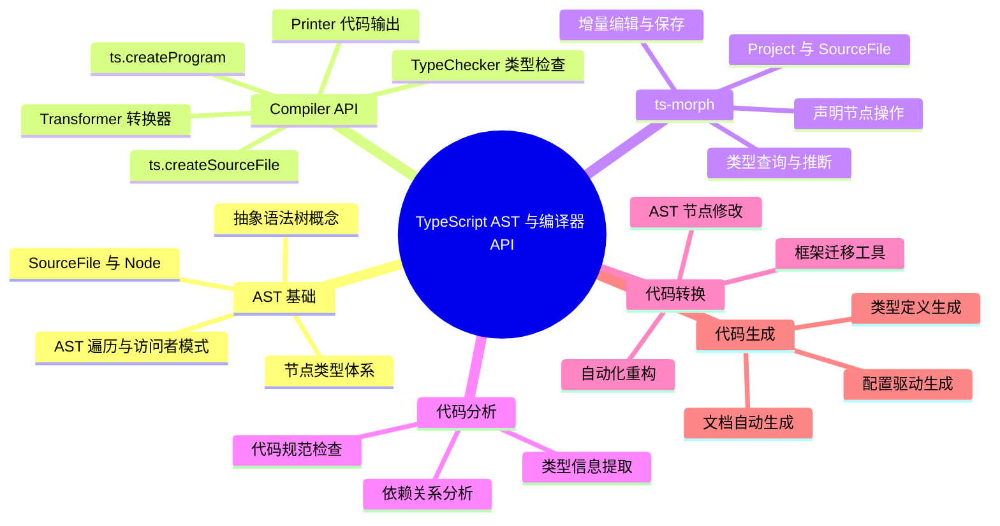

# TypeScript AST 与编译器 API

本章将深入探讨 TypeScript 的抽象语法树（AST）操作，帮助你掌握使用 TypeScript Compiler API 和 ts-morph 进行代码分析、转换和生成的核心技术。

## 知识架构



## 概述

TypeScript AST（Abstract Syntax Tree，抽象语法树）是 TypeScript 编译器将源代码解析成的一种树形数据结构。通过操作 AST，我们可以实现：

- **代码检查**：验证代码符合特定规范和约束
- **代码转换**：自动重构和代码迁移
- **代码生成**：从配置或数据结构自动生成类型定义
- **工具开发**：构建自定义的代码分析工具和插件

### 适用场景

| 场景 | 典型应用 |
|------|---------|
| 代码迁移 | 框架升级、API 变更自动化迁移 |
| 代码规范检查 | 业务逻辑约束、架构规则验证 |
| 自动化重构 | 批量修改导入、添加装饰器 |
| 类型生成 | JSON Schema 转 TypeScript 类型 |
| 文档生成 | 从代码结构提取文档 |

## 编译原理基础

### 编译器工作流程

典型的编译器工作流程包括三个核心阶段：

```
源代码 → 词法分析 → 语法分析 → AST → 语义分析 → 中间代码 → 目标代码
         ↓           ↓                    ↓
       Token流     AST节点树           类型检查
```

**注意**：本章不要求你具备编译原理专业背景，我们将从实用角度出发，帮助你快速上手 AST 操作。

### Babel 的编译流程

作为前端工程师，你可能已经接触过 Babel。了解 Babel 的工作流程有助于理解 TypeScript 编译器的设计思路。

Babel 的核心功能是**语法降级**，将高版本 JavaScript 代码转换为向后兼容的版本。它的名字来源于圣经中的巴别塔，象征着**让不同版本的 JavaScript 代码都能在同一环境中运行**。

#### Babel 核心架构

Babel 的源码架构分为两大模块：

**1. 核心编译流程**

```
源代码 → Parser(@babel/parser) → AST → Transformer(@babel/traverse) → AST → Generator(@babel/generator) → 目标代码
```

- **Parser（解析器）**：将源代码转换为 AST
- **Transformer（转换器）**：遍历并修改 AST 节点
- **Generator（生成器）**：将 AST 转换回代码

**AST（抽象语法树）** 是贯穿整个编译流程的核心数据结构，它将代码分解为树形结构，每个节点代表代码中的一个构造（变量、函数、表达式等）。

**可视化工具**：
- [AST Explorer](https://astexplorer.net/) - 支持 50+ 种语言的 AST 可视化
- [TS AST Viewer](https://ts-ast-viewer.com/) - 专门针对 TypeScript 的 AST 查看器

**2. 插件系统**

Babel 通过插件机制扩展功能，例如：
- `@babel/plugin-transform-arrow-functions` - 转换箭头函数
- `@babel/plugin-proposal-decorators` - 支持装饰器语法
- `babel-preset-env` - 根据目标环境自动选择插件

#### Babel vs TypeScript Compiler

虽然 Babel 也能处理 TypeScript，但两者有本质区别：

| 特性 | Babel | TypeScript Compiler |
|------|-------|---------------------|
| 类型检查 | ❌ 不支持 | ✅ 完整支持 |
| 编译方式 | 单文件编译 | 项目级编译 |
| 类型信息 | 擦除类型 | 保留类型信息 |
| 适用场景 | 语法降级 | 类型安全 + 语法降级 |

---

## TypeScript Compiler API

TypeScript 编译器不仅是一个命令行工具，还暴露了完整的 Compiler API，允许你编程式地操作 TypeScript 代码。

### 为什么使用 TypeScript Compiler API

相比 Babel，TypeScript Compiler API 提供了更贴近 `tsc` 行为的编译能力：
- 完整的类型系统访问
- 更准确的语义分析
- 与 TypeScript 语言服务深度集成

### 核心 API 模块

TypeScript Compiler API 主要包含以下模块：

```typescript
import ts from 'typescript';

// 核心模块
ts.createSourceFile()      // 创建源文件节点
ts.createProgram()         // 创建编译程序
ts.factory.createXxx()     // 创建 AST 节点的工厂方法
ts.createPrinter()         // AST → 代码生成器
```

### 示例：编程式生成函数

以下示例展示如何使用 Compiler API 从零构建一个阶乘函数：

> **前置要求**：安装 TypeScript
> ```bash
> npm install typescript @types/node
> ```

```typescript
import ts from 'typescript';

function makeFactorialFunction() {
  // 1. 创建标识符节点
  const functionName = ts.factory.createIdentifier('factorial');
  const paramName = ts.factory.createIdentifier('n');
  
  // 2. 创建参数类型节点
  const paramType = ts.factory.createKeywordTypeNode(
    ts.SyntaxKind.NumberKeyword
  );

  // 3. 创建参数声明（TS 5.x 起工厂方法签名移除了 decorators 参数）
  const parameter = ts.factory.createParameterDeclaration(
    undefined,        // 修饰符
    undefined,        // 点号标记（剩余参数）
    paramName,        // 参数名
    undefined,        // 问号标记
    paramType         // 类型节点
  );

  // 4. 创建条件表达式：n <= 1
  const condition = ts.factory.createBinaryExpression(
    paramName,
    ts.SyntaxKind.LessThanEqualsToken,
    ts.factory.createNumericLiteral(1)
  );

  // 5. 创建 if 语句体
  const ifBody = ts.factory.createBlock(
    [ts.factory.createReturnStatement(ts.factory.createNumericLiteral(1))],
    true  // 多行
  );

  // 6. 创建递归表达式：n * factorial(n - 1)
  const decrementedArg = ts.factory.createBinaryExpression(
    paramName,
    ts.SyntaxKind.MinusToken,
    ts.factory.createNumericLiteral(1)
  );

  const recurse = ts.factory.createBinaryExpression(
    paramName,
    ts.SyntaxKind.AsteriskToken,
    ts.factory.createCallExpression(functionName, undefined, [decrementedArg])
  );

  // 7. 组装函数体
  const statements = [
    ts.factory.createIfStatement(condition, ifBody),
    ts.factory.createReturnStatement(recurse),
  ];

  // 8. 创建函数声明（TS 5.x 起工厂方法签名移除了 decorators 参数）
  return ts.factory.createFunctionDeclaration(
    [ts.factory.createToken(ts.SyntaxKind.ExportKeyword)], // 修饰符
    undefined,                                          // 星号标记
    functionName,                                       // 函数名
    undefined,                                          // 类型参数
    [parameter],                                        // 参数列表
    ts.factory.createKeywordTypeNode(ts.SyntaxKind.NumberKeyword), // 返回类型
    ts.factory.createBlock(statements, true)            // 函数体
  );
}

// 创建虚拟源文件并打印结果
const resultFile = ts.createSourceFile(
  './source.ts',
  '',
  ts.ScriptTarget.Latest,
  false,
  ts.ScriptKind.TS
);

const printer = ts.createPrinter({ newLine: ts.NewLineKind.LineFeed });
const result = printer.printNode(
  ts.EmitHint.Unspecified,
  makeFactorialFunction(),
  resultFile
);

console.log(result);
```

**输出结果**：

```typescript
export function factorial(n: number): number {
  if (n <= 1) {
    return 1;
  }
  return n * factorial(n - 1);
}
```

### Compiler API vs Babel vs jscodeshift

三种工具的设计理念对比：

| 工具 | API 风格 | 优势 | 适用场景 |
|------|---------|------|---------|
| TypeScript Compiler API | 组合式 | 类型安全、语义准确 | 精确控制、复杂转换 |
| Babel | 声明式（Visitor 模式） | 生态丰富、插件成熟 | 语法降级、代码转换 |
| jscodeshift | 命令式（链式调用） | 简单易用 | 快速重构、代码迁移 |

**Babel 示例**（声明式）：

```typescript
import { declare } from "@babel/helper-plugin-utils";

// 检测对函数的重新赋值
const noFuncAssignLint = declare((api) => {
  api.assertVersion(7);
  
  return {
    visitor: {
      AssignmentExpression(path) {
        const assignTarget = path.get("left").toString();
        const binding = path.scope.getBinding(assignTarget);
        
        if (binding?.path.isFunctionDeclaration() || 
            binding?.path.isFunctionExpression()) {
          throw path.buildCodeFrameError("Cannot reassign to function");
        }
      },
    },
  };
});
```

**jscodeshift 示例**（命令式）：

```typescript
module.exports = function (fileInfo, api) {
  return api
    .jscodeshift(fileInfo.source)
    .findVariableDeclarators("foo")
    .renameTo("bar")
    .toSource();
};
```

### Compiler API 的挑战

使用原生 Compiler API 需要掌握：
- AST 节点类型（Statement、Expression、Declaration 等）
- TypeScript 特有节点（Interface、TypeAlias、Decorator 等）
- 节点间的组合关系

学习成本较高，这也是我们引入 ts-morph 的原因。

---

## ts-morph 库

### ts-morph 简介

[ts-morph](https://www.npmjs.com/package/ts-morph)（原名 `ts-simple-ast`）是对 TypeScript Compiler API 的高层封装，旨在**让 AST 操作更简单直观**。

**核心优势**：
- 🎯 **低学习成本**：屏蔽底层 AST 细节，提供直观的 API
- 🛠️ **完整功能**：支持创建、读取、更新、删除（CRUD）操作
- 📦 **类型安全**：完整的 TypeScript 类型定义
- 🔧 **项目级支持**：支持多文件、跨文件的 AST 操作

### 安装与配置

```bash
npm install ts-morph
# 或
yarn add ts-morph
# 或
pnpm add ts-morph
```

### 快速开始

```typescript
import path from 'path';
import { Project, ScriptTarget } from 'ts-morph';

// 1. 创建项目实例
const project = new Project({
  tsConfigFilePath: path.resolve(__dirname, './tsconfig.json'),
  // 或手动配置
  compilerOptions: {
    target: ScriptTarget.ES2020,
  }
});

// 2. 添加源文件
const sourceFile = project.addSourceFileAtPath(
  path.resolve(__dirname, './source.ts')
);

// 3. 操作 AST
// ... 见下文示例

// 4. 保存修改
sourceFile.saveSync();
```

### 核心 API 示例

#### 接口操作

```typescript
// 创建接口
const interfaceDec = sourceFile.addInterface({
  name: 'IUser',
  isExported: true,
  properties: [
    { name: 'id', type: 'number' },
    { name: 'name', type: 'string' },
  ],
});

// 添加属性
interfaceDec.addProperty({
  name: 'email',
  type: 'string',
  hasQuestionToken: true, // 可选属性
});

// 添加泛型
interfaceDec.addTypeParameter({
  name: 'T',
  constraint: 'Record<string, any>',
  default: 'Record<string, unknown>',
});

// 添加 JSDoc
interfaceDec.addJsDoc({
  description: '用户信息接口',
  tags: [
    { tagName: 'author', text: 'Linbudu' },
    { tagName: 'since', text: '1.0.0' },
  ],
});

// 添加继承
interfaceDec.addExtends('IBaseEntity');

// 获取接口信息
console.log(interfaceDec.getName());         // 'IUser'
console.log(interfaceDec.getProperties());   // PropertyDeclaration[]
```

#### 导入语句操作

```typescript
// 添加导入声明
const importDec = sourceFile.addImportDeclaration({
  moduleSpecifier: 'fs',
  namedImports: ['readFileSync', 'writeFileSync'],
});

// 添加默认导入
importDec.setDefaultImport('fs');

// 添加命名空间导入
importDec.setNamespaceImport('fsPromises');

// 获取导入信息
console.log(importDec.getModuleSpecifierValue()); // 'fs'
console.log(importDec.getNamedImports());         // ImportSpecifier[]

// 修改导入
importDec.addNamedImport('appendFileSync');
importDec.removeNamedImport('writeFileSync');
```

#### 类操作

```typescript
// 创建类
const classDec = sourceFile.addClass({
  name: 'UserService',
  isExported: true,
  extends: 'BaseService',
  implements: ['IUserService'],
});

// 添加属性
classDec.addProperty({
  name: 'apiClient',
  type: 'HttpClient',
  scope: Scope.Private, // Scope 从 ts-morph 导入
});

// 添加方法
const method = classDec.addMethod({
  name: 'getUser',
  returnType: 'Promise<User>',
  isAsync: true,
  parameters: [
    { name: 'id', type: 'number' },
  ],
});

// 添加装饰器
method.addDecorator({
  name: 'Log',
  arguments: ['"UserService.getUser"'],
});
```

### 工作流程

使用 ts-morph 的典型工作流程：

```
1. 分析目标 → 使用 TS AST Viewer 查看代码结构
     ↓
2. 定位节点 → 使用 getXxx() 方法查找目标节点
     ↓
3. 执行操作 → 使用 add/update/remove 方法修改 AST
     ↓
4. 保存结果 → 调用 saveSync() 或 getText()
```

### 辅助工具

#### TS AST Viewer

[TS AST Viewer](https://ts-ast-viewer.com/) 是开发 AST 工具的必备神器：

**功能特性**：
- 🔍 实时查看 AST 结构
- 📝 自动生成 Compiler API 代码
- 🎨 可视化节点关系
- ⚙️ 支持切换 TypeScript 版本

**使用方法**：
1. 在左侧编辑器输入代码
2. 中间面板查看 AST 树形结构
3. 右侧面板查看节点详细信息
4. 左下角面板查看生成的 Compiler API 代码

#### 常用的节点定位方法

```typescript
// 1. 按类型获取节点
sourceFile.getClasses();
sourceFile.getInterfaces();
sourceFile.getFunctions();
sourceFile.getImportDeclarations();

// 2. 按名称查找
sourceFile.getClass('UserService');
sourceFile.getInterface('IUser');
sourceFile.getFunction('init');

// 3. 使用 SyntaxKind 深度查找
sourceFile.getFirstChildByKind(SyntaxKind.ClassDeclaration);
sourceFile.getChildrenOfKind(SyntaxKind.MethodDeclaration);

// 4. 条件过滤
sourceFile.getClasses(c => c.getName()?.startsWith('Base'));
```

### ts-morph 的限制

虽然 ts-morph 大大简化了 AST 操作，但仍有一些限制：

**不支持的场景**：
- 函数体内部逻辑的细粒度操作
- 复杂表达式的深度转换
- 需要类型推断的高级操作

**解决方案**：
- 简单场景：直接写入代码字符串
- 复杂场景：结合原生 Compiler API

```typescript
// 方案一：直接写入字符串
const method = classDec.addMethod({
  name: 'process',
  statements: `console.log('processing...'); return data;`,
});

// 方案二：混合使用 Compiler API
const methodBody = method.getBody();
if (Node.isBlock(methodBody)) {
  // 使用原生 Compiler API 操作方法体
  const statements = methodBody.getStatements();
  // ...
}
```

---

## 实战案例

本节通过一系列实际场景，演示如何运用 ts-morph 解决具体问题。这些案例分为两大类：

**AST Checker**：只读检查，不修改代码（如规范检查、过期代码检测）  
**CodeMod**：代码转换，批量修改源码（如框架迁移、重构自动化）

### 案例1：导入语句迁移（CodeMod）

**场景描述**：将 Node.js 的同步 API 迁移到异步 Promise API，并检查必需的 polyfill 导入。

**技术要点**：
- 导入语句的查找与替换
- 具名导入的修改
- 条件检查与错误抛出

我们的源码如下：

```typescript
import { readFileSync } from 'fs';
import 'some_required_polyfill';
```

操作后的代码如下：

```typescript
import 'some_required_polyfill';
import { readFile } from "fs/promises";
```

在这个例子中，我们希望进行两种操作：

- 将来自于 fs 的 sync api 导入，更换为来自 `fs/promise` 的 async api，如 `import { readFile } from 'fs/promises'`
- 检查是否存在对 `some_required_polyfill` 的导入

首先第一步，一定是分析源代码的 AST 结构：


整理一下思路：

- 将 fs 更改为 fs/promises
- 将来自 fs 的，以 Sync 结尾的导入进行更改
- 检查是否存在以 `some_required_polyfill` 为导入名的导入声明

直接看具体实现：

```typescript
import path from 'path';
import { Project, SyntaxKind, SourceFile, ImportDeclaration } from 'ts-morph';
import { uniq } from 'lodash';

const p = new Project();

const source = p.addSourceFileAtPath(path.resolve(__dirname, './source.ts'));

// 获取所有导入声明中的模块名
export function getImportModuleSpecifiers(source: SourceFile): string[] {
  return uniq(
    source.getImportDeclarations().map((i) => i.getModuleSpecifierValue())
  );
}

const REQUIRED = ['some_required_polyfill'];

const allDeclarations = source.getImportDeclarations();

const allSpecifiers = getImportModuleSpecifiers(source);

if (!REQUIRED.every((i) => allSpecifiers.includes(i))) {
  throw new Error('missing required polyfill');
}

// 设计一个通用的替换模式
const FORBIDDEN = [
  {
    // 要被替换的导入路径
    moduleSpecifier: 'fs',
    // 替换为这个值
    replacement: 'fs/promises',
    // 原本的导入如何更新
    namedImportsReplacement: (raw: string) =>
      raw.endsWith('Sync') ? raw.slice(0, -4) : raw,
  },
];

const FORBIDDEN_SPECIFIERS = FORBIDDEN.map((i) => i.moduleSpecifier);

for (const specifier of allSpecifiers) {
  if (FORBIDDEN_SPECIFIERS.includes(specifier)) {
    const target = allDeclarations.find(
      (i) =>
        // 检查是否是要被替换的模块
        i.getModuleSpecifierValue() === specifier
    );

    // 找到要被替换的导入声明
    const replacementMatch = FORBIDDEN.find(
      (i) => i.moduleSpecifier === specifier
    );

    // 收集原本的具名导入
    const namedImports = target?.getNamedImports() ?? [];

    // 替换为新的具名导入
    const namedImportsReplacement = namedImports.map((i) =>
      replacementMatch?.namedImportsReplacement(i.getText())
    );

    // 移除原本的导入
    target?.remove();

    // 增加新的导入
    source.addImportDeclaration({
      moduleSpecifier: replacementMatch?.replacement!,
      namedImports: namedImportsReplacement.map((i) => ({
        name: i!,
      })),
    });
  }
}

console.log(source.getText());
```

这里我们使用的 API 主要包括：

- `source.getImportDeclarations()`，获取源码的所有导入声明
- `source.addImportDeclaration`，源码新增导入声明语句
- `i.getModuleSpecifierValue`，获取导入声明的模块名（或者说导入路径）
- `target?.getNamedImports`，获取导入声明的具名导入

扩展：如何处理默认导入、命名空间导入的形式？

### 案例2：批量添加装饰器（CodeMod）

**场景描述**：为实现了特定接口的类方法批量添加性能监控装饰器。

**技术要点**：
- 类继承关系的判断
- 方法装饰器的添加
- 批量处理多个类

```typescript
abstract class Handler {
  abstract handle(input: unknown): void;
}

class NotHandler {}

class EventHandler implements Handler {
  handle(input: unknown): void {
    // ...
  }
}

class MessageHandler implements Handler {
  handle(input: unknown): void {
    // ...
  }
}
```

其处理结果应当是这样的：

```typescript
abstract class Handler {
  abstract handle(input: unknown): void;
}

class NotHandler {}

class EventHandler implements Handler {
    @PerformanceMark()
    handle(input: unknown): void {
    // ...
  }
}

class MessageHandler implements Handler {
    @PerformanceMark()
    handle(input: unknown): void {
    // ...
  }
}
```

这里我们使用抽象类来区分目标 Class，即只有实现了某一抽象类的 Class 才需要进行处理。

首先分析 AST 结构：


整理一下实现思路：

- 拿到所有实现了 Handler 抽象类的 Class 声明
- 为这些声明内部的 handle 方法添加 `@PerformanceMark` 装饰器

完整实现如下：

```typescript
import path from 'path';
import { Project, ClassDeclaration } from 'ts-morph';

const p = new Project();

const source = p.addSourceFileAtPath(path.resolve(__dirname, './source.ts'));

const IMPLS = ['Handler'];

// 获取所有目标 Class 声明
const filteredClassDeclarations: ClassDeclaration[] = source
  .getClasses()
  .filter((cls) => {
    const impls = cls.getImplements().map((impl) => impl.getText());
    return IMPLS.some((impl) => impls.includes(impl));
  });

const METHODS = ['handle'];

for (const cls of filteredClassDeclarations) {
  // 拿到所有方法
  const methods = cls.getMethods().map((method) => method.getName());
  for (const method of methods) {
    if (METHODS.includes(method)) {
      // 拿到目标方法声明
      const methodDeclaration = cls.getMethod(method)!;
      methodDeclaration.addDecorator({
        name: 'PerformanceMark',
        arguments: [],
      });
    }
  }
}

console.log(source.getText());
```

我们主要使用了这么几个 API：

- `source.getClasses`，获取源码中所有的 Class 声明
- `cls.getImplements`，获取 Class 声明实现的抽象类
- `cls.getMethods` 与 `cls.getMethod`，获取 Class 声明中的方法声明
- `methodDeclaration.addDecorator`，为方法声明新增装饰器

扩展：试试给方法的参数也添加方法参数装饰器？

### 案例3：React 组件优化（CodeMod）

**场景描述**：为 React 函数组件自动添加 `React.memo` 优化。

**技术要点**：
- 导入语句的修改
- 默认导出的修改
- 表达式节点的操作

我们的源码是这样的：

```typescript
import { useState } from 'react';

const Comp = () => {
  return <></>;
};

export default Comp;
```

处理后的结果则是这样的：

```typescript
import { memo, useState } from 'react';

const Comp = () => {
  return <></>;
};

export default memo(Comp);
```

也就是说，我们需要添加具名导入，以及修改默认导出表达式两个步骤。

首先分析 AST 结构：


可以看到，我们需要处理的两处分别为 NamedImports 与 ExportAssignment ，接下来就简单了：

```typescript
import path from 'path';
import { Project, SyntaxKind, SourceFile } from 'ts-morph';

const p = new Project();

const source = p.addSourceFileAtPath(path.resolve(__dirname, './source.tsx'));

// 获取默认导出
const exportDefaultAssignment = source
  .getFirstChildByKind(SyntaxKind.SyntaxList)!
  .getFirstChildByKind(SyntaxKind.ExportAssignment)!;

// 获取原本的导出语句的组件名
const targetIdentifier = exportDefaultAssignment
  ?.getFirstChildByKind(SyntaxKind.Identifier)
  ?.getText()!;

// 获取 react 对应的导入声明
const reactImport = source.getImportDeclaration(
  (imp) => imp.getModuleSpecifierValue() === 'react'
)!;

// 新增一个具名导入
reactImport.insertNamedImport(0, 'memo');

// 新增 memo 包裹
!targetIdentifier.startsWith('memo') &&
 exportDefaultAssignment.setExpression(`memo(${targetIdentifier})`);

console.log(source.getText());
```

我们主要调用了这些 API：

- `source.getFirstChildByKind(SyntaxKind.SyntaxList)`，获取一个 AST 结点下首个目标类型的子结点，在上面我们都是直接使用 `source.getClasses()` 形式获取目标类型，而这里则是另外一种方式，`source.getFirstChildByKind(SyntaxKind.SyntaxList).getFirstChildByKind(SyntaxKind.ExportAssignment)` 即意味着拿到源码中的第一个导出语句。需要注意的是，使用这种方式必须首先拿到 `SyntaxKind.SyntaxList` 类型的子结点。
- `source.getImportDeclaration`，获取源码中所有的导入声明
- `imp.getModuleSpecifierValue`，获取导入的模块名
- `import.insertNamedImport`，为导入声明插入一个具名导入
- `exportDefaultAssignment.setExpression`，修改导出语句的表达式

扩展：上面我们直接将默认导出语句作为了组件，然后通过修改它的表达式来实现添加 memo。不妨试试如何支持 `export const` 形式的组件导出？

### 案例4：JSON 转 TypeScript 类型（代码生成）

**场景描述**：从 JSON 数据自动生成 TypeScript 接口定义。

**技术要点**：
- 递归遍历 JSON 结构
- 类型推断与接口生成
- 复杂类型（联合类型、数组）的处理

我们输入的 json 是这样的：

```json
{
  "name": "linbudu",
  "age": 22,
  "sex": "male",
  "favors": [
    "execrise",
    "writting",
    999
  ],
  "job": {
    "name": "programmer",
    "stack": "javascript",
    "company": "alibaba"
  },
  "pets": [
    {
      "id": 1,
      "type": "dog"
    },
    {
      "id": 2,
      "type": "cat"
    }
  ]
}
```

最终输出的类型定义是这样的：

```typescript
export interface IStruct {
    name: string;
    age: number;
    sex: string;
    favors: (string | number)[];
    IJob: IJob;
    pets: IStructPets[];
}

export interface IJob {
    name: string;
    stack: string;
    company: string;
}

export interface IStructPets {
    id: number;
    type: string;
}
```

具体实现其实并不复杂，由于 JSON 的限制，我们无需处理函数之类的类型，但也无法实现字面量类型与枚举这样精确的定义。然而绝大部分情况下，JSON 中的值类型其实还是字符串、数字、布尔值以及对象与数组这五位。

我们来整理一下思路：

- 遍历 JSON
- 对于原始类型元素，直接使用 typeof （注意，是 JavaScript 中的 typeof，不是类型查询操作符）的值作为类型，调用 `interfaceDeclaration.addProperty` 方法新增属性
- 对于对象类型，遍历此对象类型，将此对象类型生成的接口也调用 `source.addInterface` 方法添加到源码中，并将其名称调用 `interfaceDeclaration.addProperty` 添加到顶层的对象中
- 对于数组类型，如果其中是原始类型，提取所有原始类型值的类型，合并为联合类型，如果其中是对象类型，则遍历其中的对象类型，类似上一步。

来看完整的代码：

```typescript
import path from 'path';
import fs from 'fs-extra';
import { Project } from 'ts-morph';
import { capitalize, uniq } from 'lodash';

import json from './source.json';

const p = new Project();

const filePath = path.resolve(__dirname, './source.ts');

fs.rmSync(filePath);
fs.ensureFileSync(filePath);

const source = p.addSourceFileAtPath(filePath);

function objectToInterfaceStruct(
  identifier: string,
  input: Record<string, unknown>
) {
  const interfaceDeclaration = source.addInterface({
    name: identifier,
    isExported: true,
  });

  for (const [key, value] of Object.entries(input)) {
    // 最简单的情况，直接添加属性
    if (['string', 'number', 'boolean'].includes(typeof value)) {
      interfaceDeclaration.addProperty({
        name: key,
        type: typeof value,
      });
    }

    // 简单起见，不处理混合或者更复杂的情况
    if (Array.isArray(value)) {
      // 对象类型元素
      const objectElement = value.filter((v) => typeof v === 'object');
      // 原始类型元素
      const primitiveElement = value.filter((v) =>
        ['string', 'number', 'boolean'].includes(typeof v)
      );

      const primitiveElementTypes = uniq(primitiveElement.map((v) => typeof v));

      // 对对象类型元素，只取第一个来提取类型
      if (objectElement.length > 0) {
        // 再次遍历此方法
        const objectType = objectToInterfaceStruct(
          `${identifier}${capitalize(key)}`,
          objectElement[0]
        );
        interfaceDeclaration.addProperty({
          name: key,
          type: `${objectType.getName()}[]`,
        });
      } else {
        interfaceDeclaration.addProperty({
          name: key,
          // 使用联合类型 + 数组作为此属性的类型
          type: `(${primitiveElementTypes.join(' | ')})[]`,
        });
      }

      continue;
    }

    // 对于对象类型，再次遍历
    if (typeof value === 'object') {
      const nestedStruct = objectToInterfaceStruct(
        `I${capitalize(key)}`,
        value as Record<string, unknown>
      );

      interfaceDeclaration.addProperty({
        name: key,
        // 使用从接口结构得到的接口名称
        type: nestedStruct.getName(),
      });
    }
  }

  return interfaceDeclaration;
}

objectToInterfaceStruct('IStruct', json);

source.saveSync();

console.log(source.getText());
```

在这一部分，我们主要使用两个 API ：

- `source.addInterface`，在源码中新增一个接口声明，如：
- `interfaceDeclaration.addProperty`，为接口声明新增一个属性，如：

扩展：上面的处理逻辑并没有很好地处理掉对象类型与数组类型中的复杂情况，比如数组中既有原始类型也有对象类型，不妨试着完善一下这部分逻辑？

### 案例5：过期代码检测（AST Checker）

**场景描述**：基于 JSDoc 标记检测过期的临时代码，防止遗忘清理。

**技术要点**：
- JSDoc 注释的解析
- 时间对比与过期检测
- 错误报告与作者定位

```typescript
/**
 * @expires 2022-08-01
 * @author linbudu
 * @description 这是一个临时的 bugfix，需要在下次更新时删除
 */
function tempFix() {}

/**
 * @expires 2022-01-01
 * @author linbudu
 * @description 这是一个临时的兼容
 */
function tempSolution() {}

/**
 * 工具方法
 */
function utils() {}
```

由于 TS AST Viewer 目前不支持 JSDoc 的解析，这里我们直接来整理一下实现思路：

- 检查所有函数的 JSDoc 区域
- 如果发现了 `@expires`，对比其标注的过期时间与当前的时间
- 如果过期，抛出错误，并指出 `@author` 标记的作者

直接来看实现：

```typescript
import path from 'path';
import chalk from 'chalk';
import { Project, SyntaxKind, SourceFile, FunctionDeclaration } from 'ts-morph';

const p = new Project();

const source = p.addSourceFileAtPath(path.resolve(__dirname, './source.ts'));

// 收集所有的函数声明
export function getAllFunctionDeclarations(
  source: SourceFile
): FunctionDeclaration[] {
  const functionDeclarationList = source
    .getFirstChildByKind(SyntaxKind.SyntaxList)!
    .getChildrenOfKind(SyntaxKind.FunctionDeclaration);

  return functionDeclarationList;
}

// 收集所有存在 JSDoc 的函数声明
const filteredFuncDeclarations = getAllFunctionDeclarations(source).filter(
  (func) => func.getJsDocs().length > 0
);

for (const func of filteredFuncDeclarations) {
  const jsdocContent = func.getJsDocs()[0];

  const tags = jsdocContent.getTags();

  const expireTag = tags.find((tag) => tag.getTagName() === 'expires');

  // 如果不存在 @expires 标签，则跳过
  if (!expireTag) continue;

  // 将其值处理为可解析的字符串
  const [, expireDesc] = expireTag.getText().replace(/\*|\n/g, '').split(' ');

  const expireDate = new Date(expireDesc).getTime();
  const now = new Date().getTime();

  // 对比时间
  if (expireDate < now) {
    const authorTag = tags.find((tag) => tag.getTagName() === 'author');
    const [, author] = authorTag
      ? authorTag.getText().replace(/\*|\n/g, '').split(' ')
      : 'unknown';

    console.log(
      chalk.red(
        `Function ${chalk.yellow(
          func.getName()
        )} is expired, author: ${chalk.white(author)}`
      )
    );
  }
}
```

使用效果是这样的：


扩展：上面的例子只能基于硬编码的日期进行处理，而另外一种可能的情况是基于版本来做检查，比如某一部分代码应该在 `package.json` 中的 `version` 到达 `1.0.0` 以前被再次优化一遍，不妨来试一下支持这种情况？

以上的示例应该能帮助你领会到，使用 ts-morph 来进行源码检查与操作的窍门。同时你可能注意到了，上面的示例我们封装了不少方法，如 `getAllFunctionDeclarations`、`getClassDeclarations`、`getImportDeclarations` 等，这也是我比较推荐的一种方式：在 ts-morph 上进一步封装 AST 方法，让 AST 操作就像调用 Lodash 方法一样简单。

### 案例6：接口转类型别名（CodeMod）

**场景描述**：将项目中的所有 Interface 声明转换为 Type 别名。

**技术要点**：
- 遍历所有接口声明
- 提取接口属性和泛型参数
- 生成对应的类型别名

```typescript
import { Project, InterfaceDeclaration, TypeAliasDeclaration } from 'ts-morph';

const project = new Project({
  tsConfigFilePath: './tsconfig.json',
});

// 获取所有源文件
const sourceFiles = project.getSourceFiles();

for (const sourceFile of sourceFiles) {
  const interfaces = sourceFile.getInterfaces();
  
  for (const interfaceDec of interfaces) {
    // 获取接口信息
    const name = interfaceDec.getName();
    const isExported = interfaceDec.isExported();
    const typeParameters = interfaceDec.getTypeParameters();
    const extendsList = interfaceDec.getExtends();
    const properties = interfaceDec.getProperties();
    
    // 构建类型别名
    let typeContent = '{\n';
    for (const prop of properties) {
      const propName = prop.getName();
      const propType = prop.getType().getText();
      const isOptional = prop.hasQuestionToken();
      const isReadonly = prop.isReadonly();
      
      typeContent += `  `;
      if (isReadonly) typeContent += 'readonly ';
      typeContent += propName;
      if (isOptional) typeContent += '?';
      typeContent += `: ${propType};\n`;
    }
    typeContent += '}';
    
    // 创建类型别名
    const typeAlias = sourceFile.addTypeAlias({
      name,
      type: typeContent,
      isExported,
      typeParameters: typeParameters.map(tp => tp.getName()),
    });
    
    // 删除原接口
    interfaceDec.remove();
  }
  
  sourceFile.saveSync();
}
```

### 案例7：代码规范检查（AST Checker）

**场景描述**：检查项目中是否存在未导出的公共 API。

**技术要点**：
- 分析导出语句
- 检测未导出的类/函数/变量
- 生成报告

```typescript
import { Project, SyntaxKind, Node } from 'ts-morph';

const project = new Project({
  tsConfigFilePath: './tsconfig.json',
});

interface CheckResult {
  file: string;
  line: number;
  name: string;
  kind: string;
}

const results: CheckResult[] = [];

for (const sourceFile of project.getSourceFiles()) {
  // 跳过 node_modules 和声明文件
  if (sourceFile.getFilePath().includes('node_modules') || 
      sourceFile.getFilePath().endsWith('.d.ts')) {
    continue;
  }
  
  // 检查类声明
  const classes = sourceFile.getClasses();
  for (const cls of classes) {
    if (!cls.isExported() && cls.getName()?.startsWith('Public')) {
      results.push({
        file: sourceFile.getFilePath(),
        line: cls.getStartLineNumber(),
        name: cls.getName()!,
        kind: 'class',
      });
    }
  }
  
  // 检查函数声明
  const functions = sourceFile.getFunctions();
  for (const func of functions) {
    if (!func.isExported() && func.getName()?.startsWith('public')) {
      results.push({
        file: sourceFile.getFilePath(),
        line: func.getStartLineNumber(),
        name: func.getName()!,
        kind: 'function',
      });
    }
  }
}

console.log('未导出的公共 API:');
console.table(results);
```

### 案例8：自动生成类型定义（Code Generator）

**场景描述**：从 JSON Schema 自动生成 TypeScript 类型定义。

**技术要点**：
- 解析 JSON Schema 结构
- 递归生成类型定义
- 处理嵌套对象和数组

```typescript
import { Project, PropertySignatureStructure, OptionalKind } from 'ts-morph';

interface JsonSchema {
  type: string;
  properties?: Record<string, JsonSchema>;
  items?: JsonSchema;
  required?: string[];
  enum?: string[];
  $ref?: string;
}

function schemaToType(schema: JsonSchema): string {
  switch (schema.type) {
    case 'string':
      if (schema.enum) {
        return schema.enum.map(e => `'${e}'`).join(' | ');
      }
      return 'string';
    case 'number':
    case 'integer':
      return 'number';
    case 'boolean':
      return 'boolean';
    case 'array':
      return schema.items ? `${schemaToType(schema.items)}[]` : 'any[]';
    case 'object':
      return 'object';
    default:
      return 'any';
  }
}

function generateInterface(
  project: Project,
  name: string,
  schema: JsonSchema
) {
  const sourceFile = project.createSourceFile(
    `${name}.ts`,
    '',
    { overwrite: true }
  );
  
  const properties: OptionalKind<PropertySignatureStructure>[] = [];
  
  for (const [propName, propSchema] of Object.entries(schema.properties || {})) {
    properties.push({
      name: propName,
      type: schemaToType(propSchema),
      hasQuestionToken: !schema.required?.includes(propName),
    });
  }
  
  sourceFile.addInterface({
    name,
    isExported: true,
    properties,
  });
  
  sourceFile.saveSync();
}

// 使用示例
const userSchema: JsonSchema = {
  type: 'object',
  required: ['id', 'name'],
  properties: {
    id: { type: 'number' },
    name: { type: 'string' },
    email: { type: 'string' },
    role: { 
      type: 'string',
      enum: ['admin', 'user', 'guest']
    },
    tags: { 
      type: 'array',
      items: { type: 'string' }
    },
  },
};

const project = new Project();
generateInterface(project, 'User', userSchema);
```

## 总结

在这一节，我们主要学习了如何使用 TypeScript 的 Compiler API 和 ts-morph 来对 TS 源码进行操作，就像数据库的 CRUD 一样，对源码的常见操作其实也可以被归类为检查、变更、新增这么几类。

对没有系统学习过编译原理的同学，其实更推荐使用 ts-morph 来简化这些 AST 操作。原因上面我们也已经了解到了，ts-morph 通过更符合直觉的 API 封装掉了很多底层的操作，能够大大地简化使用成本与理解负担。

当然，由于封装带来了黑盒的底层实现与各种不确定性，如果你对操作的稳定性要求高，最好的方式还是使用原生的 Compiler API 或 Babel 一点点进行实现。

而通过 TS AST Viewer 的帮助，我们还可以更进一步简化操作。检查 AST 结构、确定目标 AST 结构、执行操作以及保存，就能完成一次处理。

最后，除了本节给到的操作示例，你还可以根据自身的实际需要来探索更多有趣的例子，试着来感受"换一种方式使用 TypeScript"的乐趣吧！

## 扩展阅读

### AST Checker 与 ESLint

在上面的介绍中，听起来 AST Checker 和 ESLint 很相似，都是检查代码是否符合规则，并且 ESLint 也是通过 AST 来进行检查，如 AST Explorer 中使用 TypeScript ESLint Parser：


然而二者的差异实际上非常大。首先， Lint 不会涉及业务逻辑的检查，比如我们要求对某个 polyfill 的导入必须存在，或者要求必须调用某个全局的顶级方法，此时就应该是 AST Checker 的工作范畴，而非 Lint。Lint 更多关注的是纯粹的、完全不涉及业务逻辑的规则。

另外，Lint 规则的维度通常更高，比如我要求团队内的所有代码库都必须遵守一系列规则。而 AST Checker 的规则通常只是项目维度的，比如只在几个项目内要求遵守这条规则，这也就意味着 AST Checker 的规则不具备或很难具备可推广性。

---

## API 参考

### ts-morph 核心 API

#### Project 类

项目级别的 AST 管理容器。

```typescript
import { Project, ScriptTarget } from 'ts-morph';

// 创建项目实例
const project = new Project({
  // 方式1：使用 tsconfig.json
  tsConfigFilePath: './tsconfig.json',
  
  // 方式2：手动配置
  compilerOptions: {
    target: ScriptTarget.ES2020,
    strict: true,
  },
  
  // 方式3：文件系统操作
  useInMemoryFileSystem: false, // 默认 false，使用真实文件系统
});

// 添加文件
const sourceFile = project.addSourceFileAtPath('./src/index.ts');
const sourceFile2 = project.createSourceFile('./src/new.ts', 'export const x = 1;');

// 保存所有修改
project.saveSync();
```

**常用方法**：

| 方法 | 说明 | 返回值 |
|------|------|--------|
| `addSourceFileAtPath(path)` | 添加已存在的文件 | `SourceFile` |
| `createSourceFile(path, content)` | 创建新文件 | `SourceFile` |
| `getSourceFile(path)` | 获取文件 | `SourceFile \| undefined` |
| `getSourceFiles()` | 获取所有文件 | `SourceFile[]` |
| `saveSync()` | 同步保存所有修改 | `void` |
| `getProgram()` | 获取 TypeScript 程序 | `Program` |

#### SourceFile 类

表示单个源文件。

```typescript
// 获取文件信息
sourceFile.getFilePath();          // 文件路径
sourceFile.getBaseName();          // 文件名（含扩展名）
sourceFile.getBaseNameWithoutExtension(); // 文件名（不含扩展名）
sourceFile.getExtension();         // 扩展名
sourceFile.getText();              // 文件内容

// 获取节点
sourceFile.getClasses();           // 所有类声明
sourceFile.getInterfaces();        // 所有接口声明
sourceFile.getFunctions();         // 所有函数声明
sourceFile.getImportDeclarations(); // 所有导入声明
sourceFile.getExportDeclarations(); // 所有导出声明
sourceFile.getVariableDeclarations(); // 所有变量声明
sourceFile.getTypeAliases();       // 所有类型别名
sourceFile.getEnums();             // 所有枚举

// 按名称查找
sourceFile.getClass('UserService');
sourceFile.getInterface('IUser');
sourceFile.getFunction('init');

// 添加节点
sourceFile.addClass({ name: 'NewClass' });
sourceFile.addInterface({ name: 'INew' });
sourceFile.addFunction({ name: 'newFunc' });
sourceFile.addImportDeclaration({ moduleSpecifier: 'fs' });
sourceFile.addExportDeclaration({ namedExports: ['x'] });

// 保存
sourceFile.saveSync();
sourceFile.delete();
```

#### 节点通用方法

所有 AST 节点共享的方法：

```typescript
// 节点信息
node.getKind();              // 节点类型（SyntaxKind）
node.getKindName();          // 节点类型名称（字符串）
node.getText();              // 节点文本
node.getWidth();             // 节点宽度
node.getFullWidth();         // 完整宽度（含注释）
node.getStart();             // 起始位置
node.getEnd();               // 结束位置

// 父子关系
node.getParent();            // 获取父节点
node.getChildren();          // 获取所有子节点
node.getChildCount();        // 子节点数量
node.getFirstChild();        // 第一个子节点
node.getLastChild();         // 最后一个子节点

// 类型查找
node.getFirstChildByKind(SyntaxKind.ClassDeclaration);
node.getChildrenOfKind(SyntaxKind.MethodDeclaration);

// 修改
node.replaceWithText('new code');
node.remove();

// 格式化
node.formatText();
```

#### ClassDeclaration

```typescript
const classDec = sourceFile.getClass('MyClass');

// 获取信息
classDec.getName();                 // 类名
classDec.getTypeParameters();       // 泛型参数
classDec.getExtends();              // 继承的类
classDec.getImplements();           // 实现的接口
classDec.getConstructors();         // 构造函数
classDec.getProperties();           // 属性
classDec.getMethods();              // 方法
classDec.getDecorators();           // 装饰器

// 添加成员
classDec.addProperty({
  name: 'id',
  type: 'number',
  scope: Scope.Private, // Scope 从 ts-morph 导入
});

classDec.addMethod({
  name: 'getId',
  returnType: 'number',
  statements: 'return this.id;',
});

classDec.addDecorator({
  name: 'Entity',
  arguments: ['"users"'],
});

// 修改
classDec.rename('NewClassName');
classDec.setExtends('BaseClass');
classDec.addImplements('ISerializable');
```

#### InterfaceDeclaration

```typescript
const interfaceDec = sourceFile.getInterface('IUser');

// 获取信息
interfaceDec.getName();              // 接口名
interfaceDec.getProperties();        // 属性
interfaceDec.getMethods();           // 方法
interfaceDec.getTypeParameters();    // 泛型参数
interfaceDec.getExtends();           // 继承的接口

// 添加成员
interfaceDec.addProperty({
  name: 'id',
  type: 'number',
  hasQuestionToken: true,  // 可选属性
  isReadonly: true,        // 只读属性
});

interfaceDec.addMethod({
  name: 'getName',
  returnType: 'string',
});

// 修改
interfaceDec.rename('IUserInfo');
interfaceDec.addExtends('IBaseEntity');
```

#### MethodDeclaration

```typescript
const method = classDec.getMethod('myMethod');

// 获取信息
method.getName();                    // 方法名
method.getReturnType();              // 返回类型
method.getParameters();              // 参数列表
method.getTypeParameters();          // 泛型参数
method.getBody();                    // 方法体
method.getDecorators();              // 装饰器

// 添加参数
method.addParameter({
  name: 'options',
  type: 'Options',
  hasQuestionToken: true,
});

// 添加装饰器
method.addDecorator({
  name: 'Log',
  arguments: ['"myMethod"'],
});

// 设置方法体
method.setBodyText('return this.value;');

// 添加语句
method.addStatements('console.log("called");');
```

### TypeScript Compiler API 核心

#### factory 对象

创建 AST 节点的工厂方法集合。

```typescript
import ts from 'typescript';

// 创建标识符
ts.factory.createIdentifier('name');

// 创建类型节点
ts.factory.createKeywordTypeNode(ts.SyntaxKind.StringKeyword);
ts.factory.createTypeReferenceNode('MyType');
ts.factory.createArrayTypeNode(elementType);

// 创建声明
ts.factory.createFunctionDeclaration(...);
ts.factory.createClassDeclaration(...);
ts.factory.createInterfaceDeclaration(...);
ts.factory.createVariableDeclaration(...);

// 创建语句
ts.factory.createReturnStatement(expression);
ts.factory.createIfStatement(expression, thenStatement, elseStatement);
ts.factory.createForStatement(...);

// 创建表达式
ts.factory.createCallExpression(expression, typeArguments, argumentsArray);
ts.factory.createBinaryExpression(left, operator, right);
ts.factory.createPropertyAccessExpression(expression, name);
```

#### createSourceFile

创建虚拟源文件。

```typescript
const sourceFile = ts.createSourceFile(
  fileName: string,          // 文件名
  sourceText: string,        // 源码内容
  scriptTarget: ScriptTarget, // 目标版本
  setParentNodes?: boolean,  // 是否设置父节点引用
  scriptKind?: ScriptKind    // 脚本类型
);
```

#### createPrinter

将 AST 转换为代码。

```typescript
const printer = ts.createPrinter({
  newLine: ts.NewLineKind.LineFeed,
  removeComments: false,
  omitTrailingSemicolon: false,
});

const code = printer.printNode(
  hint: EmitHint,
  node: Node,
  sourceFile: SourceFile
);
```

---

#### createProgram

```typescript
const program = ts.createProgram(
  ['./src/index.ts'],     // 文件列表
  {
    target: ts.ScriptTarget.ES2020,
    module: ts.ModuleKind.CommonJS,
  }
);

const typeChecker = program.getTypeChecker();
```

## 常见问题

### Q1: ts-morph 和原生 Compiler API 该如何选择？

**推荐选择策略**：

| 场景 | 推荐方案 | 原因 |
|------|---------|------|
| 快速原型开发 | ts-morph | 开发效率高，API 简单 |
| 简单的代码生成 | ts-morph | 封装完善，不易出错 |
| 复杂的 AST 转换 | Compiler API | 更精确的控制 |
| 对性能要求极高 | Compiler API | 避免封装开销 |
| 需要访问类型信息 | 混合使用 | ts-morph 获取类型，Compiler API 操作 |

### Q2: 如何处理 JSX 文件？

```typescript
import { Project, JsxEmit } from 'ts-morph';

const project = new Project({
  compilerOptions: {
    jsx: JsxEmit.React,
  }
});

// 使用 .tsx 扩展名
const sourceFile = project.addSourceFileAtPath('./Component.tsx');
```

### Q3: 如何获取类型信息？

```typescript
import { Project } from 'ts-morph';

const project = new Project();
const sourceFile = project.addSourceFileAtPath('./source.ts');

const variable = sourceFile.getVariableDeclaration('x');
const type = variable?.getType();

console.log(type?.getText());       // 类型字符串
console.log(type?.isString());      // 是否是 string 类型
console.log(type?.isArray());       // 是否是数组类型
console.log(type?.getProperties()); // 获取所有属性
```

### Q4: AST 操作失败，节点找不到怎么办？

**排查步骤**：

1. **使用 TS AST Viewer 查看结构**

   先在 AST Viewer 中查看代码的实际结构，确定目标节点的层级关系。

2. **检查节点类型**

   ```typescript
   // 错误示例：直接查找子节点
   sourceFile.getFirstChildByKind(SyntaxKind.ClassDeclaration); // 可能返回 undefined
   
   // 正确示例：先查找 SyntaxList
   sourceFile
     .getFirstChildByKind(SyntaxKind.SyntaxList)
     ?.getFirstChildByKind(SyntaxKind.ClassDeclaration);
   ```

3. **打印所有子节点**

   ```typescript
   sourceFile.getChildren().forEach(child => {
     console.log(child.getKindName(), child.getText().slice(0, 50));
   });
   ```

### Q5: 如何批量处理多个文件？

```typescript
import { Project } from 'ts-morph';

const project = new Project({
  tsConfigFilePath: './tsconfig.json',
});

// 方式1：遍历所有文件
project.getSourceFiles().forEach(sourceFile => {
  sourceFile.getClasses().forEach(cls => {
    // 处理每个类
  });
});

// 方式2：使用 glob 模式
project.addSourceFilesAtPaths('src/**/*.ts');

// 方式3：条件过滤
const tsFiles = project.getSourceFiles()
  .filter(sf => sf.getExtension() === '.ts');
```

### Q6: 如何处理动态代码（eval、动态导入）？

**局限性说明**：
- AST 操作只能处理静态代码
- 无法分析 `eval()` 中的代码
- 无法处理动态 `import()` 的具体内容

**解决方案**：
```typescript
// 对于动态代码，考虑使用字符串模板
const dynamicCode = `
  export function dynamicFunc() {
    return ${someValue};
  }
`;

sourceFile.addStatements(dynamicCode);
```

### Q7: 如何保持代码格式？

```typescript
import { Project } from 'ts-morph';

const project = new Project({
  manipulationSettings: {
    indentationText: IndentationText.TwoSpaces,
    newLineKind: NewLineKind.LineFeed,
    insertSpaceAfterOpeningAndBeforeClosingNonemptyBraces: true,
    quoteKind: QuoteKind.Single,
  }
});

// 或者对单个节点格式化
sourceFile.formatText();
```

### Q8: 如何处理大型项目？

**性能优化建议**：

1. **使用内存文件系统**（适合一次性处理）

   ```typescript
   const project = new Project({
     useInMemoryFileSystem: true,
   });
   ```

2. **延迟加载**

   ```typescript
   // 只添加需要处理的文件
   project.addSourceFileAtPath('./target-file.ts');
   ```

3. **批量操作后统一保存**

   ```typescript
   // 不要在循环中频繁保存
   project.getSourceFiles().forEach(sf => {
     sf.getClasses().forEach(cls => {
       // 修改操作
     });
   });
   
   // 最后统一保存
   project.saveSync();
   ```

---

### Q9: 如何处理跨文件的引用？

**A**: 使用 Project 级别的操作：

```typescript
// 获取导入的模块
const importDec = sourceFile.getImportDeclaration('lodash');
const moduleSourceFile = importDec.getModuleSpecifierSourceFile();

// 获取被引用的位置
const classDec = sourceFile.getClass('MyClass');
const references = classDec.findReferences();

for (const ref of references) {
  for (const reference of ref.getReferences()) {
    console.log(reference.getSourceFile().getFilePath());
    console.log(reference.getStartLineNumber());
  }
}

// 重命名会自动更新所有引用
classDec.rename('NewClassName');
```

### Q10: 如何调试 AST 结构？

**A**: 使用以下工具和方法：

```typescript
// 1. 使用 TS AST Viewer
// https://ts-ast-viewer.com/

// 2. 打印节点信息
function printNode(node: ts.Node, indent = 0) {
  const kindName = ts.SyntaxKind[node.kind];
  console.log(' '.repeat(indent) + kindName);
  
  node.forEachChild(child => {
    printNode(child, indent + 2);
  });
}

// 3. ts-morph 调试方法
const node = sourceFile.getClass('MyClass');
console.log(node.getKindName());     // ClassDeclaration
console.log(node.getText());         // 源代码文本
console.log(node.getFullText());     // 包含注释的完整文本
console.log(node.getStructure());    // 结构化信息
```

### Q11: 如何处理语法错误？

**A**: 使用诊断信息：

```typescript
// TypeScript Compiler API
const program = ts.createProgram(['./src/index.ts'], {});
const diagnostics = ts.getPreEmitDiagnostics(program);

for (const diagnostic of diagnostics) {
  const message = ts.flattenDiagnosticMessageText(
    diagnostic.messageText,
    '\n'
  );
  
  if (diagnostic.file) {
    const { line, character } = diagnostic.file.getLineAndCharacterOfPosition(
      diagnostic.start!
    );
    console.log(`${diagnostic.file.fileName} (${line + 1},${character + 1}): ${message}`);
  } else {
    console.log(message);
  }
}

// ts-morph
const project = new Project({
  tsConfigFilePath: './tsconfig.json',
});

const preEmitDiagnostics = project.getPreEmitDiagnostics();
console.log(preEmitDiagnostics.map(d => d.getMessageText()));
```

### Q12: 如何生成声明文件？

**A**: 使用 TypeScript Compiler API：

```typescript
import ts from 'typescript';

const program = ts.createProgram(['./src/index.ts'], {
  declaration: true,
  emitDeclarationOnly: true,
  declarationDir: './dist/types',
});

program.emit();
```

## 最佳实践

### 1. 封装常用操作

将常用的 AST 操作封装为工具函数：

```typescript
// utils/ast-helpers.ts
import { SourceFile, ClassDeclaration } from 'ts-morph';

export function findClassesByDecorator(
  sourceFile: SourceFile,
  decoratorName: string
): ClassDeclaration[] {
  return sourceFile.getClasses().filter(cls => 
    cls.getDecorator(decoratorName) !== undefined
  );
}

export function addImportIfMissing(
  sourceFile: SourceFile,
  moduleSpecifier: string,
  namedImport: string
): void {
  const importDec = sourceFile.getImportDeclaration(
    imp => imp.getModuleSpecifierValue() === moduleSpecifier
  );
  
  if (importDec) {
    const namedImports = importDec.getNamedImports();
    if (!namedImports.some(ni => ni.getName() === namedImport)) {
      importDec.addNamedImport(namedImport);
    }
  } else {
    sourceFile.addImportDeclaration({
      moduleSpecifier,
      namedImports: [namedImport],
    });
  }
}
```

### 2. 错误处理

```typescript
import { Project, SyntaxKind } from 'ts-morph';

function safeGetClass(sourceFile: SourceFile, className: string) {
  const cls = sourceFile.getClass(className);
  
  if (!cls) {
    throw new Error(
      `Class "${className}" not found in ${sourceFile.getFilePath()}`
    );
  }
  
  return cls;
}

// 使用 try-catch
try {
  const cls = safeGetClass(sourceFile, 'UserService');
  // 操作...
} catch (error) {
  console.error('AST 操作失败:', error.message);
}
```

### 3. 测试驱动开发

为 AST 操作编写单元测试：

```typescript
import { Project } from 'ts-morph';
import { describe, it, expect } from 'vitest';

describe('AST Operations', () => {
  it('should add memo to component', () => {
    const project = new Project({ useInMemoryFileSystem: true });
    const sourceFile = project.createSourceFile(
      'test.tsx',
      `
        import { useState } from 'react';
        const Comp = () => <div />;
        export default Comp;
      `
    );
    
    // 执行操作
    addMemoToComponent(sourceFile);
    
    // 验证结果
    expect(sourceFile.getText()).toContain('memo(Comp)');
    expect(sourceFile.getText()).toContain('import { memo, useState }');
  });
});
```

### 4. 版本控制

对 AST 操作进行版本管理：

```typescript
// 建议创建 CHANGELOG 记录每次批量修改
// 保留操作前的备份

import fs from 'fs-extra';

async function backupAndTransform(filePath: string) {
  // 备份
  await fs.copy(filePath, `${filePath}.backup`);
  
  try {
    // 执行转换
    // ...
    
    // 成功后删除备份
    await fs.remove(`${filePath}.backup`);
  } catch (error) {
    // 失败后恢复备份
    await fs.move(`${filePath}.backup`, filePath, { overwrite: true });
    throw error;
  }
}
```

---

## 扩展资源

### 官方文档

- [TypeScript Compiler API](https://github.com/microsoft/TypeScript/wiki/Using-the-Compiler-API)
- [ts-morph 官方文档](https://ts-morph.com/)
- [TypeScript AST Viewer](https://ts-ast-viewer.com/)

### 开源项目参考

- [ts-morph 代码库](https://github.com/dsherret/ts-morph)
- [TypeScript ESLint Parser](https://github.com/typescript-eslint/typescript-eslint)
- [ts-node](https://github.com/TypeStrong/ts-node)

### 相关工具

| 工具 | 用途 | 链接 |
|------|------|------|
| AST Explorer | 多语言 AST 可视化 | https://astexplorer.net/ |
| TS AST Viewer | TypeScript AST 查看器 | https://ts-ast-viewer.com/ |
| Babel | JavaScript 编译器 | https://babeljs.io/ |
| jscodeshift | Facebook 代码迁移工具 | https://github.com/facebook/jscodeshift |

---

### 延伸学习

与 AST 无直接关联、但同样属于 TypeScript 进阶主题的类型系统内部机制——分布式条件类型、`IsEqual` 的实现原理、`never` 与 `any` 在条件类型中的边界行为等，见 [类型系统层级](../02-类型系统/05-类型系统层级.md) 与 [泛型](../02-类型系统/02-泛型.md)。

## 总结

### 本章要点

1. **编译原理基础**：理解了编译器工作流程和 AST 的作用
2. **TypeScript Compiler API**：掌握了底层 API 的使用方法
3. **ts-morph 库**：学会了使用高层 API 进行 AST 操作
4. **实战案例**：通过多个案例掌握了代码转换和检查的技巧

### 工具选择指南

```
┌─────────────────────────────────────────────────────────────────┐
│                     AST 工具选择决策树                            │
└─────────────────────────────────────────────────────────────────┘

                        你的需求是什么？
                             │
          ┌──────────────────┼──────────────────┐
          ▼                  ▼                  ▼
      代码转换/重构      代码检查/分析       类型生成
          │                  │                  │
          ▼                  ▼                  ▼
    ┌───────────┐      ┌───────────┐      ┌───────────┐
    │ ts-morph  │      │ ts-morph  │      │ Compiler  │
    │ (推荐)    │      │ 或 ESLint │      │   API     │
    └───────────┘      └───────────┘      └───────────┘
          │                  │                  │
          ▼                  ▼                  ▼
    简单场景直接用    复杂规则用 ESLint    需要类型推断
    复杂场景混合      简单检查用 ts-morph  使用 TypeChecker
    Compiler API
```

### 相关资源

#### 官方文档

- [TypeScript Compiler API](https://github.com/microsoft/TypeScript/wiki/Using-the-Compiler-API)
- [ts-morph 官方文档](https://ts-morph.com/)
- [TypeScript AST Viewer](https://ts-ast-viewer.com/)

#### 开源项目

- [ts-morph](https://github.com/dsherret/ts-morph) - TypeScript AST 操作库
- [ts-node](https://github.com/TypeStrong/ts-node) - TypeScript 执行引擎
- [ts-loader](https://github.com/TypeStrong/ts-loader) - Webpack TypeScript 加载器

#### 学习资源

- [AST Explorer](https://astexplorer.net/) - 多语言 AST 可视化
- [TypeScript Compiler 内部原理](https://github.com/microsoft/TypeScript/blob/main/doc/compiler-architecture.md)
- [Babel 插件开发指南](https://github.com/jamiebuilds/babel-handbook)