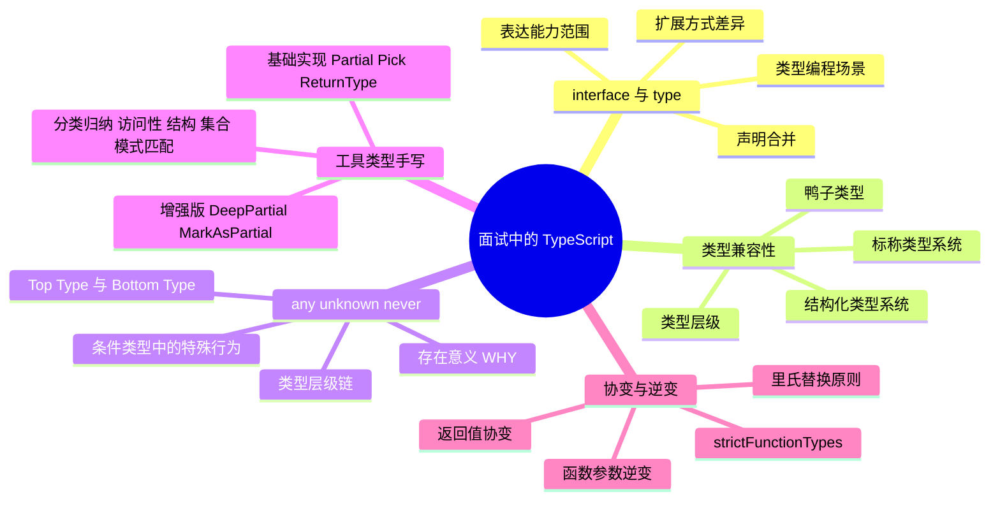

# 面试中的 TypeScript

> TypeScript 在前端领域的重要性正在不断提升，面试中对 TypeScript 技能的考察也逐渐上升到和 Vue / React 技能同等的地位。本章将从面试视角出发，针对几个高频考点，逐一演示从"及格线"到"优秀回答"的进阶思路。

## 知识架构



## 本章概览

面试中的 TypeScript 考题通常不会超出日常进阶使用的范围，但它们能有效筛选出具有实际深度使用经验的候选人。本章覆盖五个高频考点：

1. **interface 与 type 异同点** —— 最经典的 TS 面试题
2. **类型兼容性** —— 考察对类型系统底层工作原理的理解
3. **any、unknown 与 never** —— 对 Top Type / Bottom Type 的认知
4. **工具类型手写** —— 实操能力与类型编程深度
5. **协变与逆变** —— 函数类型兼容性的深层逻辑

> 本章不会包含过于基础的内容，如基础类型字面量、类型断言语法等。

## 一、interface 与 type 异同点

这可能是最经典的一道 TS 面试题，也是考察候选人是否真正深入使用过 TypeScript 的试金石。

### 1.1 及格线回答

以下概念是基本要求：

- **扩展方式**：interface 使用 `extends` 关键字，type 使用交叉类型（`&`）
- **声明合并**：同名的 interface 会自动合并，合并时要求兼容原接口结构；type 不支持声明合并
- **表达能力**：interface 与 type 都可以描述对象类型、函数类型、Class 类型，但 interface 无法像 type 那样表达元组、联合类型等
- **类型编程**：interface 无法使用映射类型等类型工具，类型编程场景应使用 type

```typescript
// 扩展方式差异
interface Animal {
  name: string;
}
interface Dog extends Animal {
  breed: string;
}

type AnimalType = {
  name: string;
};
type DogType = AnimalType & {
  breed: string;
};

// 声明合并：interface 支持，type 不支持
interface Config {
  host: string;
}
interface Config {
  // 合并时必须兼容已有结构
  port: number;
}
// Config 现在包含 host 与 port

// type 不允许重复声明
// type ConfigType = { host: string; }
// type ConfigType = { port: number; } // ❌ 报错：重复标识符

// 表达能力差异：type 可以表示元组、联合类型
type TupleType = [string, number];
type UnionType = string | number | boolean;
// interface 无法直接表达这些
```

### 1.2 优秀回答

仅罗列概念定义容易像在背书，优秀回答应当穿插工程实践经验与深层理解：

**1. 工程实践中的分工**

```typescript
// interface：描述对象对外暴露的接口，不应具有复杂的类型逻辑
interface UserService {
  getUser(id: string): Promise<User>;
  updateUser(id: string, data: Partial<User>): Promise<User>;
}

// type：处理函数签名、联合类型、工具类型等复杂类型编程
type AsyncFunction<T> = (...args: any[]) => Promise<T>;
type Result<T> = { success: true; data: T } | { success: false; error: string };
```

**核心观点**：interface 是描述对象对外暴露的接口，其复杂度应局限于泛型约束与索引类型层面；type alias 则用于类型重命名与复杂类型编程。

**2. 性能差异**

在官方 Wiki 中特别说明了对象扩展时，interface 继承比交叉类型性能更好：

```typescript
// 接口继承：编译器只需检查新增属性
interface Base {
  foo: string;
}
interface Extended extends Base {
  bar: number;
}

// 交叉类型：编译器需要合并所有属性，深层嵌套时性能差距明显
type BaseType = {
  foo: string;
};
type ExtendedType = BaseType & {
  bar: number;
};
```

### 1.3 对比总结表格

| 维度 | interface | type |
|------|-----------|------|
| 扩展方式 | `extends` 继承 | 交叉类型 `&` |
| 声明合并 | ✅ 支持（同名自动合并） | ❌ 不支持 |
| 描述对象类型 | ✅ | ✅ |
| 描述函数类型 | ✅ | ✅ |
| 表达元组 | ❌ | ✅ |
| 表达联合类型 | ❌ | ✅ |
| 映射类型 | ❌ | ✅ |
| 条件类型 | ❌ | ✅ |
| 模板字符串类型 | ❌ | ✅ |
| 性能（对象扩展） | ⚠️ 更优 | 较差（深层合并） |
| 推荐场景 | 对象接口定义 | 类型编程、联合类型、工具类型 |

## 二、类型兼容性

这一问题主要考察你是否了解 TypeScript 类型系统的基本工作原理，以及使用的深入程度。通常只有具有一定经验的使用者才会了解类型兼容性规则，而掌握这些规则意味着至少能独立解决相当一部分类型报错。

### 2.1 及格线回答

TypeScript 使用鸭子类型，即**结构化类型系统**进行类型兼容性比较：对于两个属性完全一致的类型，就认为它们属于同一种类型；对于 A 类型与 A + B 类型，认为后者属于前者的子类型。

```typescript
// 结构化类型：只看结构，不问出处
class Cat {
  eat() {}
}
class Dog {
  eat() {}
}

function feedCat(cat: Cat) {}

// 通过！Dog 与 Cat 结构一致
feedCat(new Dog());

// 子类型关系：更多属性的类型是更少属性类型的子类型
interface Point2D {
  x: number;
  y: number;
}
interface Point3D {
  x: number;
  y: number;
  z: number;
}

const point3D: Point3D = { x: 1, y: 2, z: 3 };
const point2D: Point2D = point3D; // ✅ Point3D 是 Point2D 的子类型
```

此外，TypeScript 中还存在一些特殊规则，如 `object`、`{}` 以及 Top Type 等。

### 2.2 优秀回答

在及格线基础上，可从以下方向扩展：

**1. 从结构化类型到标称类型**

```typescript
// 结构化类型的问题：不同语义但结构相同的类型可以互换
type USD = number;
type CNY = number;

const price: USD = 100;
const cost: CNY = price; // ⚠️ 通过！但语义上美元和人民币不应互换

// 使用品牌类型模拟标称类型系统
type Brand<T, B> = T & { __brand: B };
type USDBrand = Brand<number, "USD">;
type CNYBrand = Brand<number, "CNY">;

const usdPrice: USDBrand = 100 as USDBrand;
const cnyCost: CNYBrand = usdPrice; // ❌ 报错！类型不兼容
```

**2. 类型层级视角**

类型兼容性的比较本质上是在类型层级中比较——一个类型能够兼容其子类型。可以扩展讲述 TypeScript 的类型层级：

```typescript
// 类型层级（自底向上）
// never ⊂ 字面量类型 ⊂ 对应基础类型 ⊂ 联合类型 ⊂ unknown
//                                                ↑ any（特殊：双向兼容）

// 示例：
type T1 = "hello" extends string ? true : false;   // true
type T2 = string extends "hello" ? true : false;   // false
type T3 = string extends unknown ? true : false;    // true
type T4 = never extends string ? true : false;      // true
```

> 详细内容参见 [结构化类型系统](../02-类型系统/04-结构化类型系统.md)

## 三、any、unknown 与 never

这一部分考察对内置 Top Type、Bottom Type 的理解，属于相对少见的考察，因此通常也不会要求过高。

### 3.1 及格线回答

`any` 与 `unknown` 在 TypeScript 类型层级中属于最顶层的 **Top Type**，意味着所有类型都是它们的子类型。`never` 则相反，作为 **Bottom Type** 它是所有类型的子类型。

```typescript
// Top Type：所有类型都可以赋值给它
let anyVal: any = "hello";
anyVal = 42;
anyVal = { foo: "bar" };

let unknownVal: unknown = "hello";
unknownVal = 42;
unknownVal = { foo: "bar" };

// Bottom Type：可以赋值给任何类型
function throwError(msg: string): never {
  throw new Error(msg);
}

const num: number = throwError("error"); // ✅ never 可赋值给 number

// any vs unknown 的关键区别
let a: any = "hello";
a.toUpperCase(); // ✅ 不报错（但运行时可能出错）

let b: unknown = "hello";
// b.toUpperCase(); // ❌ 报错：unknown 类型上不存在 toUpperCase
if (typeof b === "string") {
  b.toUpperCase(); // ✅ 收窄后可使用
}
```

### 3.2 优秀回答

面试的重要原则之一是 **WHY** —— 在回答知识点的同时讲述其背后的存在原因：

**1. 为什么需要 Top Type 与 Bottom Type？**

```typescript
// Top Type：无法对所有地方都精确描述类型时，需要一个兜底
// 比如第三方库的类型不完整、JSON.parse 的返回值等
const data: unknown = JSON.parse(input);

// Bottom Type：两个不存在交集的类型强行交集运算的结果
type Intersection = string & number; // never —— 不存在的类型

// 条件类型中的分支收窄
type StrOrNum<T> = T extends string
  ? string
  : T extends number
    ? number
    : never; // 不可能走到这里，用 never 表示
```

**2. 类型层级链**

能从 Bottom 向上到 Top 讲一遍完整的类型链，是对 TypeScript 理解深度的有力证明：

```typescript
// 类型层级链（自底向上）
// never → 字面量类型 → 基础类型 → 对象/联合类型 → unknown
//                                               any（双向往来）

// 验证层级
type IsNeverSubsetOfNumber = never extends number ? true : false;   // true
type IsStringSubsetOfUnknown = string extends unknown ? true : false; // true
type IsUnknownTopType = unknown extends string ? true : false;       // false
```

**3. 条件类型中的特殊行为**

`any` 与 `never` 在条件类型中存在特殊规则，这是深层理解的加分项：

```typescript
// any 在条件类型中：既成立又不成立（分布式行为）
type AnyInConditional = any extends string ? true : false; // boolean（true | false）

// never 在条件类型中：直接返回 never（空集的分布式结果）
type NeverInConditional = never extends string ? true : false; // never

// 对比普通类型
type StringInConditional = string extends "hello" ? true : false; // false
```

> 详细内容参见 [any、unknown、never](../02-类型系统/03-any-unknown-never.md)

## 四、工具类型手写

这一部分有可能需要现场手写，是考察类型编程实操能力的直接方式。

### 4.1 及格线回答

基础工具类型手写包括 Partial / Required、Pick / Omit、ReturnType / Parameters 等：

```typescript
// Partial：将属性变为可选
type MyPartial<T> = {
  [K in keyof T]?: T[K];
};

// Required：将属性变为必选
type MyRequired<T> = {
  [K in keyof T]-?: T[K];
};

// Pick：选取部分属性
type MyPick<T, K extends keyof T> = {
  [P in K]: T[P];
};

// Omit：排除部分属性
type MyOmit<T, K extends keyof T> = Pick<T, Exclude<keyof T, K>>;

// ReturnType：获取函数返回值类型
type MyReturnType<T extends (...args: any) => any> =
  T extends (...args: any) => infer R ? R : never;

// Parameters：获取函数参数类型（元组）
type MyParameters<T extends (...args: any) => any> =
  T extends (...args: infer P) => any ? P : never;
```

### 4.2 优秀回答

在完成基础手写后，主动扩展可以展示更深的能力：

**1. 增强版工具类型**

```typescript
// DeepPartial：递归地将所有嵌套属性变为可选
type DeepPartial<T> = {
  [K in keyof T]?: T[K] extends object
    ? T[K] extends Function
      ? T[K]          // 函数类型不递归
      : DeepPartial<T[K]>  // 对象类型递归处理
    : T[K];
};

// 使用示例
interface Config {
  database: {
    host: string;
    port: number;
    options: {
      ssl: boolean;
      timeout: number;
    };
  };
}

type PartialConfig = DeepPartial<Config>;
// database?, database.host?, database.options.ssl? 等全部可选

// MarkAsPartial：将指定属性标记为可选
type MarkAsPartial<T, K extends keyof T> = Omit<T, K> & Partial<Pick<T, K>>;

// PickByType：按值的类型选取属性
type PickByType<T, ValueType> = {
  [K in keyof T as T[K] extends ValueType ? K : never]: T[K];
};

interface User {
  name: string;
  age: number;
  email: string;
  active: boolean;
}

type StringProps = PickByType<User, string>;
// { name: string; email: string }
```

**2. 工具类型分类归纳**

| 分类 | 典型工具类型 | 核心技术 |
|------|-------------|---------|
| 访问性修饰 | Partial、Required、Readonly | `+?` / `-?` / `+readonly` 修饰符 |
| 结构处理 | Pick、Omit、Record | `keyof` + 映射类型 |
| 集合工具 | Extract、Exclude | 条件类型 + 分布式 |
| 模式匹配 | ReturnType、Parameters | `infer` 推断 |

> 详细内容参见 [条件类型与 infer](../03-类型编程/01-条件类型与%20infer.md) 和 [内置工具类型](../03-类型编程/02-内置工具类型基础.md)

## 五、协变与逆变

协变与逆变是函数类型兼容性的核心理论，也是面试中较有区分度的考点。

### 5.1 面试角度

**基础回答**：函数返回值类型是协变的（子类型关系保持一致方向），函数参数类型是逆变的（子类型关系方向反转）。

```typescript
// 协变：返回值类型方向一致
type Animal = { name: string };
type Dog = { name: string; breed: string };

// Dog 是 Animal 的子类型
// () => Dog 也是 () => Animal 的子类型 —— 协变
type AnimalGetter = () => Animal;
type DogGetter = () => Dog;

let getAnimal: AnimalGetter = () => ({ name: "cat" });
let getDog: DogGetter = () => ({ name: "rex", breed: "husky" });

getAnimal = getDog; // ✅ 协变：DogGetter 可以赋值给 AnimalGetter
// getDog = getAnimal; // ❌ 反方向不行：AnimalGetter 不能赋值给 DogGetter
```

```typescript
// 逆变：参数类型方向反转
type LogAnimal = (animal: Animal) => void;
type LogDog = (dog: Dog) => void;

let logAnimal: LogAnimal = (a) => console.log(a.name);
let logDog: LogDog = (d) => console.log(d.name, d.breed);

// 逆变：LogAnimal 可以赋值给 LogDog（参数类型方向反转）
logDog = logAnimal; // ✅ 严格模式下（strictFunctionTypes: true）
// logAnimal = logDog; // ❌ 反方向不行
```

**深层理解**：逆变的安全性可以通过里氏替换原则来解释——如果 `logDog` 期望接收 `Dog`，那么传入的函数必须能处理所有 `Dog`。`logAnimal` 能处理所有 `Animal`，自然能处理所有 `Dog`（因为 Dog 是 Animal 的子类型），所以赋值安全。

**⚠️ strictFunctionTypes 配置**

```typescript
// strictFunctionTypes: false（默认宽松模式）—— 双变
// 函数参数既允许协变也允许逆变，检查更宽松但不够安全

// strictFunctionTypes: true（推荐）—— 逆变
// 函数参数严格按逆变检查，类型更安全

// 方法 vs 函数属性的区别
interface Example {
  // 方法语法：不受 strictFunctionTypes 影响（双变）
  method(arg: Dog): void;
  // 函数属性语法：受 strictFunctionTypes 影响（逆变）
  property: (arg: Dog) => void;
}
```

> 详细内容参见 [协变与逆变](../02-类型系统/06-协变与逆变.md)

## ⚠️ 面试注意事项

| 要点 | 说明 |
|------|------|
| **回答 WHY** | 不仅回答"是什么"，更要回答"为什么"——存在意义是加分项 |
| **穿插实践** | 纯概念罗列像在背书，结合工程实践案例更可信 |
| **主动扩展** | 在完成基本回答后主动展示深度，如增强版工具类型、标称类型模拟等 |
| **类型层级** | 能从 never 向上讲到 unknown 的完整类型链，是深度的有力证明 |
| **避免绝对化** | interface 与 type 各有适用场景，不要说"永远只用其中一个" |
| **条件类型** | 注意 any / never 在条件类型中的特殊行为，这是区分深度使用者的关键 |
| **理解而非记忆** | 逆变的安全性要从里氏替换原则推导，而非死记硬背规则方向 |

## 🔗 延伸阅读

- [结构化类型系统](../02-类型系统/04-结构化类型系统.md) —— 类型兼容性的底层规则
- [any、unknown、never](../02-类型系统/03-any-unknown-never.md) —— Top Type 与 Bottom Type 详解
- [协变与逆变](../02-类型系统/06-协变与逆变.md) —— 函数类型兼容性的深层逻辑
- [条件类型与 infer](../03-类型编程/01-条件类型与%20infer.md) —— 条件类型中 any / never 的特殊行为
- [内置工具类型基础](../03-类型编程/02-内置工具类型基础.md) —— 工具类型实现原理
- [内置工具类型进阶](../03-类型编程/03-内置工具类型进阶.md) —— 增强版工具类型与分类归纳
