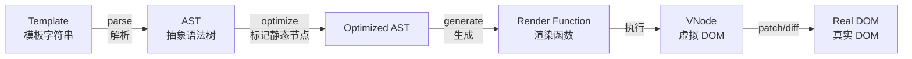

# 模板语法

## 概述

Vue.js 使用基于 HTML 的模板语法，允许开发者声明式地将 DOM 绑定至底层 Vue 实例的数据。所有 Vue.js 的模板都是合法的 HTML，能被遵循规范的浏览器和 HTML 解析器正确解析。

### 核心原理

在底层实现上，Vue 将模板编译成虚拟 DOM 渲染函数。结合响应式系统，Vue 能够智能地计算出最少需要重新渲染多少组件，并把 DOM 操作次数减到最少。



### 设计理念

- **声明式渲染**: 描述"是什么"，而非"怎么做"
- **响应式更新**: 数据变化自动驱动视图更新
- **最小化渲染**: 通过虚拟 DOM diff 算法优化性能

## 插值

### 文本插值

数据绑定最常见的形式就是使用 "Mustache" 语法（双大括号）的文本插值：

```html
<span>Message: {{ msg }}</span>
```

```javascript
new Vue({
  data: {
    msg: 'Hello Vue!'
  }
})
```

**特点**：
- Mustache 标签会被替换为对应数据对象上 `msg` 属性的值
- 当 `msg` 属性值发生变化时，插值处的内容会自动更新
- 支持所有 JavaScript 表达式

### 一次性插值

通过使用 `v-once` 指令执行一次性插值，当数据改变时，插值处的内容不会更新：

```html
<span v-once>这个将不会改变: {{ msg }}</span>
```

**注意事项**：
- `v-once` 会影响该节点上的所有数据绑定
- 适用于静态内容，可提升性能
- 避免在需要动态更新的元素上使用

### 原始 HTML（v-html）

双大括号会将数据解释为普通文本而非 HTML 代码。为输出真正的 HTML，需要使用 `v-html` 指令：

```html
<template>
  <div>
    <p>使用文本插值: {{ rawHtml }}</p>
    <p>使用 v-html: <span v-html="rawHtml"></span></p>
  </div>
</template>

<script>
export default {
  data() {
    return {
      rawHtml: '<strong style="color: red;">这是红色的粗体文字</strong>'
    }
  }
}
</script>
```

**渲染结果**：
```
使用文本插值: <strong style="color: red;">这是红色的粗体文字</strong>
使用 v-html: 这是红色的粗体文字（红色显示）
```

**重要说明**：
- `span` 内容会被替换为 `rawHtml` 的值，直接作为 HTML 渲染
- 会忽略解析 property 值中的数据绑定（Vue 模板语法不会生效）
- 不能使用 `v-html` 来复合局部模板

::: warning 安全警告
动态渲染的任意 HTML 可能会导致 **XSS 攻击**。请只对可信内容使用 HTML 插值，**绝不要**对用户提供的内容使用插值。
:::

### 绑定 HTML 属性（v-bind）

Mustache 语法不能作用在 HTML 属性上，遇到这种情况应该使用 `v-bind` 指令：

```html
<template>
  <div>
    <!-- 绑定普通属性 -->
    <div v-bind:id="dynamicId">动态 ID</div>
    
    <!-- 绑定 class -->
    <div v-bind:class="activeClass">动态 Class</div>
    
    <!-- 绑定 style -->
    <div v-bind:style="{ color: activeColor, fontSize: fontSize + 'px' }">
      动态 Style
    </div>
  </div>
</template>

<script>
export default {
  data() {
    return {
      dynamicId: 'my-container',
      activeClass: 'active',
      activeColor: 'red',
      fontSize: 16
    }
  }
}
</script>
```

#### 布尔属性

对于布尔 attribute（它们只要存在就意味着值为 `true`），`v-bind` 工作方式略有不同：

```html
<template>
  <div>
    <button v-bind:disabled="isButtonDisabled">按钮</button>
    <button v-bind:disabled="false">始终可点击</button>
    <button v-bind:disabled="true">始终禁用</button>
  </div>
</template>

<script>
export default {
  data() {
    return {
      isButtonDisabled: false
    }
  }
}
</script>
```

**渲染规则**：
- 如果值为 `null`、`undefined` 或 `false`，该属性不会被包含在渲染结果中
- 如果值为其他真值，属性会被渲染

#### 对象语法批量绑定

```html
<template>
  <!-- 绑定多个属性 -->
  <div v-bind="objectOfAttrs"></div>
</template>

<script>
export default {
  data() {
    return {
      objectOfAttrs: {
        id: 'container',
        class: 'wrapper active',
        style: 'background: #f0f0f0;'
      }
    }
  }
}
</script>
```

### JavaScript 表达式

对于所有的数据绑定，Vue.js 都提供了完全的 JavaScript 表达式支持：

```html
<template>
  <div>
    <!-- 算术运算 -->
    <span>{{ number + 1 }}</span>
    
    <!-- 三元表达式 -->
    <span>{{ ok ? 'YES' : 'NO' }}</span>
    
    <!-- 字符串操作 -->
    <span>{{ message.split('').reverse().join('') }}</span>
    
    <!-- 属性绑定中的表达式 -->
    <div v-bind:id="'list-' + id"></div>
    
    <!-- 方法调用 -->
    <span>{{ formatDate(date) }}</span>
  </div>
</template>

<script>
export default {
  data() {
    return {
      number: 10,
      ok: true,
      message: 'Hello',
      id: 123,
      date: new Date()
    }
  },
  methods: {
    formatDate(date) {
      return date.toLocaleDateString()
    }
  }
}
</script>
```

#### 表达式限制

每个绑定只能包含**单个表达式**，以下写法**不会生效**：

```html
<!-- ❌ 这是语句，不是表达式 -->
{{ var a = 1 }}

<!-- ❌ 流控制语句，请使用三元表达式 -->
{{ if (ok) { return message } }}

<!-- ❌ 多个表达式 -->
{{ message; console.log(message) }}
```

#### 沙盒限制

模板表达式被放在沙盒中，只能访问全局变量的白名单：

```javascript
// src/core/instance/proxy.js - 表达式沙盒实现原理
const allowedGlobals = makeMap(
  'Infinity,undefined,NaN,isFinite,isNaN,' +
  'parseFloat,parseInt,decodeURI,decodeURIComponent,' +
  'encodeURI,encodeURIComponent,' +
  'Math,Number,Date,Array,Object,' +
  'Boolean,String,RegExp,Map,Set,JSON,Intl,' +
  'require'  // for Webpack/Browserify
)
```

**沙盒实现原理：** Vue 2 使用 `new Function()` 编译出渲染函数，并用 `with(this){...}` 将模板表达式的作用域绑定到组件实例。实例上不存在的变量由代理的 `has` 钩子拦截，仅放行白名单中的全局变量：

```javascript
// src/core/instance/proxy.js（has 钩子拦截，简化原理）
// Vue 通过代理对象限制表达式可访问的全局变量：
// 1. 使用 with(proxy) 或 Object.defineProperty 将组件实例属性映射到表达式作用域
// 2. 表达式中的变量名先查找组件实例属性，再查白名单全局变量
// 3. window、document 等非白名单对象不可访问（除非通过 computed/methods 间接暴露）
```

**最佳实践**：
- 不应该在模板表达式中访问用户定义的全局变量
- 复杂逻辑应放在计算属性或方法中
- 保持表达式简单可读

## 指令

### 指令概述

指令（Directives）是带有 `v-` 前缀的特殊属性。指令的值预期是**单个 JavaScript 表达式**（`v-for` 是例外情况）。指令的职责是：当表达式的值改变时，将其产生的连带影响，响应式地作用于 DOM。

```html
<p v-if="seen">现在你看到我了</p>
```

### 指令分类

| 指令类型 | 指令名称 | 用途 | 示例 |
|---------|---------|------|------|
| 条件渲染 | v-if, v-else-if, v-else, v-show | 条件性地渲染内容 | `<div v-if="seen">...</div>` |
| 列表渲染 | v-for | 基于数组渲染列表 | `<li v-for="item in items">...</li>` |
| 属性绑定 | v-bind | 动态绑定一个或多个属性 | `` |
| 事件处理 | v-on | 监听 DOM 事件 | `<button v-on:click="doSomething">` |
| 双向绑定 | v-model | 表单输入和应用状态之间的双向绑定 | `<input v-model="message">` |
| 其他 | v-text, v-html, v-once, v-pre, v-cloak | 文本渲染、性能优化等 | `<span v-text="msg"></span>` |

### 指令参数

一些指令能够接收一个"参数"，在指令名称之后以冒号表示：

```html
<template>
  <div>
    <!-- v-bind 参数：属性名 -->
    <a v-bind:href="url">链接</a>
    
    <!-- v-on 参数：事件名 -->
    <button v-on:click="doSomething">点击</button>
    
    <!-- v-slot 参数：插槽名 -->
    <template v-slot:header>
      <h1>页面标题</h1>
    </template>
  </div>
</template>

<script>
export default {
  data() {
    return {
      url: 'https://vuejs.org'
    }
  },
  methods: {
    doSomething() {
      alert('点击了按钮')
    }
  }
}
</script>
```

### 动态参数

从 2.6.0 开始，可以用方括号括起来的 JavaScript 表达式作为一个指令的参数：

```html
<template>
  <div>
    <!-- 动态属性绑定 -->
    <a v-bind:[attributeName]="url">动态属性链接</a>
    
    <!-- 动态事件绑定 -->
    <button v-on:[eventName]="doSomething">动态事件按钮</button>
    
    <!-- 动态参数的缩写形式 -->
    <a :[key]="url">缩写形式</a>
    <button @[event]="doSomething">缩写形式</button>
  </div>
</template>

<script>
export default {
  data() {
    return {
      attributeName: 'href',
      eventName: 'click',
      key: 'href',
      event: 'click',
      url: 'https://vuejs.org'
    }
  },
  methods: {
    doSomething() {
      console.log('事件触发')
    }
  }
}
</script>
```

#### 动态参数的约束

**对动态参数值的约束**：

- 动态参数预期会求出一个字符串
- 异常情况下值为 `null`，可用于显式移除绑定
- 任何其他非字符串类型的值都会触发警告

```html
<!-- ✅ 正确：字符串值 -->
<a v-bind:[attributeName]="url">...</a>

<!-- ✅ 正确：null 值移除绑定 -->
<a v-bind:[attributeName]="null">...</a>

<!-- ❌ 错误：非字符串值会触发警告 -->
<a v-bind:[123]="url">...</a>
```

**对动态参数表达式的约束**：

某些字符（如空格和引号）放在 HTML attribute 名里是无效的：

```html
<!-- ❌ 错误：包含引号，会触发编译警告 -->
<a v-bind:['foo' + bar]="value">...</a>

<!-- ❌ 错误：包含空格，会触发编译警告 -->
<a v-bind:[foo + bar]="value">...</a>
```

**解决方案**：使用计算属性替代复杂表达式

```html
<template>
  <a v-bind:[computedAttr]="value">...</a>
</template>

<script>
export default {
  computed: {
    computedAttr() {
      return this.foo + this.bar
    }
  }
}
</script>
```

**大小写约束**：

在 DOM 中使用模板时（直接在 HTML 文件里撰写模板），需要避免在动态参数中使用大写字符，因为浏览器会把 attribute 名全部强制转为小写：

```html
<!--
  ❌ 在 DOM 模板中会被转换为 v-bind:[someattr]
  除非实例中有一个名为 "someattr" 的属性，否则代码不会工作
-->
<a v-bind:[someAttr]="value">...</a>

<!-- ✅ 正确：使用小写 -->
<a v-bind:[someattr]="value">...</a>
```

### 修饰符

修饰符（Modifiers）是以半角句号 `.` 指明的特殊后缀，用于指出一个指令应该以特殊方式绑定。

#### 事件修饰符

```html
<template>
  <div>
    <!-- .prevent 阻止默认行为 -->
    <form v-on:submit.prevent="onSubmit">
      <button type="submit">提交</button>
    </form>
    
    <!-- .stop 阻止事件冒泡 -->
    <div v-on:click="doThis">
      <button v-on:click.stop="doThat">点击</button>
    </div>
    
    <!-- .capture 使用事件捕获模式 -->
    <div v-on:click.capture="doThis">...</div>
    
    <!-- .self 只当事件在该元素本身触发时触发回调 -->
    <div v-on:click.self="doThat">...</div>
    
    <!-- .once 事件只触发一次 -->
    <button v-on:click.once="doThis">只触发一次</button>
    
    <!-- .passive 提升移动端滚动性能 -->
    <div v-on:scroll.passive="onScroll">...</div>
  </div>
</template>
```

#### 按键修饰符

```html
<template>
  <div>
    <!-- 按键码修饰符（keyCode 用法已废弃，仅为兼容保留） -->
    <input v-on:keyup.13="submit">
    
    <!-- 按键别名 -->
    <input v-on:keyup.enter="submit">
    <input v-on:keyup.tab="nextInput">
    <input v-on:keyup.delete="deleteItem">
    <input v-on:keyup.esc="cancel">
    <input v-on:keyup.space="addSpace">
    <input v-on:keyup.up="moveUp">
    <input v-on:keyup.down="moveDown">
    <input v-on:keyup.left="moveLeft">
    <input v-on:keyup.right="moveRight">
    
    <!-- 系统修饰键 -->
    <input v-on:keyup.ctrl="doSomething">
    <input v-on:keyup.alt="doSomething">
    <input v-on:keyup.shift="doSomething">
    <input v-on:keyup.meta="doSomething">
    
    <!-- 组合使用 -->
    <input v-on:keyup.ctrl.enter="submit">
  </div>
</template>
```

#### 表单修饰符

```html
<template>
  <div>
    <!-- .lazy 在 change 事件后同步更新 -->
    <input v-model.lazy="msg">
    
    <!-- .number 自动将输入值转为数值类型 -->
    <input v-model.number="age" type="number">
    
    <!-- .trim 自动过滤首尾空格 -->
    <input v-model.trim="msg">
  </div>
</template>
```

#### 常用修饰符汇总表

| 修饰符 | 适用指令 | 说明 |
|--------|---------|------|
| `.stop` | v-on | 阻止事件冒泡 |
| `.prevent` | v-on | 阻止默认事件 |
| `.capture` | v-on | 使用事件捕获模式 |
| `.self` | v-on | 只当事件在该元素本身触发 |
| `.once` | v-on | 事件只触发一次 |
| `.passive` | v-on | 提升移动端滚动性能 |
| `.native` | v-on | 监听组件根元素的原生事件 |
| `.lazy` | v-model | 在 change 事件后同步 |
| `.number` | v-model | 自动转数值类型 |
| `.trim` | v-model | 自动过滤首尾空格 |
| `.sync` | v-bind | 双向绑定的语法糖 |

## 其他指令

### v-text

更新元素的 `textContent`。与 `{{ }}` 插值等效，但会覆盖元素内已有内容：

```html
<span v-text="msg"></span>
<!-- 等价于 -->
<span>{{ msg }}</span>
```

### v-pre

跳过该元素及其子元素的编译过程，用于显示原始 Mustache 标签或加速静态内容：

```html
<span v-pre>{{ 这里不会被编译 }}</span>
<!-- 输出：{{ 这里不会被编译 }} -->
```

### v-cloak

保持在元素上直到关联实例结束编译。配合 CSS 规则 `[v-cloak] { display: none }`，可隐藏未编译的 Mustache 标签直到 Vue 实例就绪：

```html
<style>
  [v-cloak] { display: none; }
</style>
<div v-cloak>{{ message }}</div>
<!-- 编译前不可见，编译后正常显示 -->
```

> 对于大型应用，v-cloak 可有效防止页面闪烁（FOUC），特别是在 CDN 引入场景下非常实用。

## 缩写

`v-` 前缀作为一种视觉提示，用来识别模板中 Vue 特定的 attribute。对于一些频繁用到的指令来说，使用完整语法会感到繁琐。同时，在构建由 Vue 管理所有模板的单页面应用程序（SPA）时，`v-` 前缀也变得没那么重要了。因此，Vue 为 `v-bind` 和 `v-on` 这两个最常用的指令提供了特定简写。

### v-bind 缩写

```html
<!-- 完整语法 -->
<a v-bind:href="url">链接</a>

<!-- 缩写 -->
<a :href="url">链接</a>

<!-- 动态参数的缩写 (2.6.0+) -->
<a :[key]="url">动态属性</a>

<!-- 批量绑定 -->
<div v-bind="objectOfAttrs"></div>
```

### v-on 缩写

```html
<!-- 完整语法 -->
<button v-on:click="doSomething">点击</button>

<!-- 缩写 -->
<button @click="doSomething">点击</button>

<!-- 动态参数的缩写 (2.6.0+) -->
<button @[event]="doSomething">动态事件</button>

<!-- 带修饰符 -->
<form @submit.prevent="onSubmit">...</form>
```

**说明**：
- `:` 与 `@` 对于 attribute 名来说都是合法字符
- 在所有支持 Vue 的浏览器中都能被正确解析
- 缩写语法不会出现在最终渲染的 HTML 中
- 可以根据个人偏好选择使用完整语法或缩写

## 最佳实践

### 1. 保持表达式简洁

```html
<!-- ❌ 不推荐：复杂表达式 -->
<div>{{ items.filter(item => item.active).map(item => item.name).join(', ') }}</div>

<!-- ✅ 推荐：使用计算属性 -->
<div>{{ activeItemNames }}</div>
```

```javascript
export default {
  computed: {
    activeItemNames() {
      return this.items
        .filter(item => item.active)
        .map(item => item.name)
        .join(', ')
    }
  }
}
```

### 2. 合理使用 v-once

```html
<!-- ✅ 适合使用 v-once：静态内容 -->
<div v-once>
  <h1>{{ pageTitle }}</h1>
  <p>{{ staticDescription }}</p>
</div>

<!-- ❌ 不适合使用 v-once：动态内容 -->
<div v-once>
  <p>{{ currentTime }}</p>  <!-- 这将不会更新 -->
</div>
```

### 3. 避免在模板中定义复杂逻辑

```html
<!-- ❌ 不推荐 -->
<div>{{ price > 100 ? price * 0.9 : price > 50 ? price * 0.95 : price }}</div>

<!-- ✅ 推荐 -->
<div>{{ discountedPrice }}</div>
```

```javascript
export default {
  computed: {
    discountedPrice() {
      if (this.price > 100) return this.price * 0.9
      if (this.price > 50) return this.price * 0.95
      return this.price
    }
  }
}
```

### 4. 正确使用 v-html

```html
<!-- ❌ 危险：直接渲染用户输入 -->
<div v-html="userInput"></div>

<!-- ✅ 安全：只渲染可信内容 -->
<div v-html="trustedHtmlContent"></div>
```

### 5. 动态参数使用计算属性

```html
<!-- ❌ 不推荐：复杂的动态参数表达式 -->
<a v-bind:[item.type + '-' + item.id]="value">...</a>

<!-- ✅ 推荐：使用计算属性 -->
<a v-bind:[itemKey]="value">...</a>
```

```javascript
export default {
  computed: {
    itemKey() {
      return `${this.item.type}-${this.item.id}`
    }
  }
}
```

### 6. 使用对象/数组语法绑定多个值

```html
<!-- ❌ 不推荐：重复绑定 -->
<div v-bind:id="id" v-bind:class="className" v-bind:style="styleObj">...</div>

<!-- ✅ 推荐：对象语法 -->
<div v-bind="divAttrs">...</div>
```

```javascript
export default {
  data() {
    return {
      divAttrs: {
        id: 'container',
        class: 'wrapper active',
        style: { color: 'red', fontSize: '14px' }
      }
    }
  }
}
```

## 性能优化建议

### 1. 使用 v-once 优化静态内容

对于不需要更新的内容，使用 `v-once` 可以跳过虚拟 DOM 的 diff 过程：

```html
<div v-once>
  <h1>页面标题</h1>
  <p>静态描述信息</p>
</div>
```

### 2. 合理使用 v-show 和 v-if

```html
<!-- 频繁切换：使用 v-show -->
<div v-show="isVisible">频繁切换的内容</div>

<!-- 条件很少改变：使用 v-if -->
<div v-if="shouldRender">条件渲染的内容</div>
```

### 3. 使用计算属性缓存

```javascript
export default {
  computed: {
    // 计算属性会缓存结果，只有依赖变化时才重新计算
    formattedDate() {
      return this.date.toLocaleDateString()
    }
  },
  methods: {
    // 方法每次调用都会执行
    formatDate(date) {
      return date.toLocaleDateString()
    }
  }
}
```

### 4. 避免 v-for 和 v-if 同时使用

```html
<!-- ❌ 不推荐：v-for 和 v-if 同级使用 -->
<div v-for="item in items" v-if="item.active" :key="item.id">
  {{ item.name }}
</div>

<!-- ✅ 推荐：使用计算属性过滤 -->
<div v-for="item in activeItems" :key="item.id">
  {{ item.name }}
</div>
```

```javascript
export default {
  computed: {
    activeItems() {
      return this.items.filter(item => item.active)
    }
  }
}
```

### 5. 为 v-for 添加 key

```html
<!-- ❌ 不推荐：使用索引作为 key -->
<div v-for="(item, index) in items" :key="index">
  {{ item.name }}
</div>

<!-- ✅ 推荐：使用唯一 id 作为 key -->
<div v-for="item in items" :key="item.id">
  {{ item.name }}
</div>
```

## 常见问题

### Q1: 为什么 Mustache 语法不能用在 HTML 属性中？

**A**: HTML 属性的值会被浏览器解析，如果使用 Mustache 语法，会被解析为普通字符串而非 Vue 表达式。因此需要使用 `v-bind` 指令。

```html
<!-- ❌ 不会生效 -->
<div id="{{ dynamicId }}"></div>

<!-- ✅ 正确写法 -->
<div v-bind:id="dynamicId"></div>
```

### Q2: v-html 中可以使用 Vue 模板语法吗？

**A**: 不可以。`v-html` 会直接将内容作为 HTML 插入，Vue 模板语法不会被解析。

```html
<!-- ❌ Vue 模板语法不会生效 -->
<div v-html="'<span>{{ message }}</span>'"></div>

<!-- ✅ 如果需要响应式内容，使用组件 -->
<template>
  <div>
    <span>{{ message }}</span>
  </div>
</template>
```

### Q3: 如何在模板中使用全局变量？

**A**: Vue 2.x 默认只能访问白名单中的全局变量。如需访问自定义全局变量，可以通过以下方式：

```javascript
// 方法 1：挂载到 Vue.prototype
Vue.prototype.$globalVar = globalVar

// 方法 2：在组件中通过计算属性访问
export default {
  computed: {
    myGlobalVar() {
      return window.myGlobalVar
    }
  }
}
```

### Q4: 动态参数中可以使用表达式吗？

**A**: 可以，但有约束。动态参数应该是简单的标识符或属性访问，避免使用复杂的表达式。

```html
<!-- ✅ 简单表达式 -->
<a v-bind:[attrName]="url">...</a>

<!-- ❌ 包含引号的复杂表达式 -->
<a v-bind:['data-' + type]="value">...</a>

<!-- ✅ 使用计算属性替代 -->
<a v-bind:[computedAttr]="value">...</a>
```

### Q5: 为什么在 DOM 模板中动态参数需要使用小写？

**A**: 当在 HTML 文件中直接编写模板时（非字符串模板），浏览器会将所有 HTML 属性名转为小写。因此动态参数如果包含大写字母，会导致匹配失败。

```html
<!-- 在 DOM 模板中 -->
<a v-bind:[someAttr]="value"></a>
<!-- 会被浏览器转为 -->
<a v-bind:[someattr]="value"></a>

<!-- ✅ 解决方案：统一使用小写 -->
<a v-bind:[someattr]="value"></a>
```

### Q6: 如何调试模板中的表达式？

**A**: 可以使用以下方法调试：

```html
<template>
  <div>
    <!-- 方法 1：直接显示 -->
    <div>{{ myObject }}</div>
    
    <!-- 方法 2：使用 JSON.stringify -->
    <div>{{ JSON.stringify(myObject) }}</div>
    
    <!-- 方法 3：使用 console.log（不推荐生产环境） -->
    <div>{{ debug(myObject) }}</div>
  </div>
</template>

<script>
export default {
  methods: {
    debug(obj) {
      console.log('Debug:', obj)
      return JSON.stringify(obj, null, 2)
    }
  }
}
</script>
```

## 相关内容

- [计算属性和侦听器](../03-数据与交互/01-计算属性.md)
- [条件渲染](02-条件渲染.md)
- [列表渲染](03-列表渲染.md)
- [事件处理](../03-数据与交互/03-事件处理.md)
- [表单输入绑定](../03-数据与交互/04-表单输入绑定.md)

---
