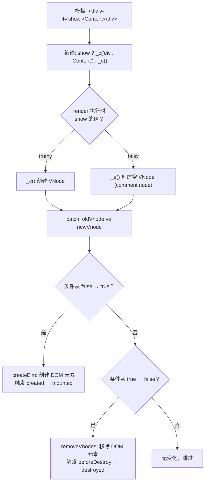
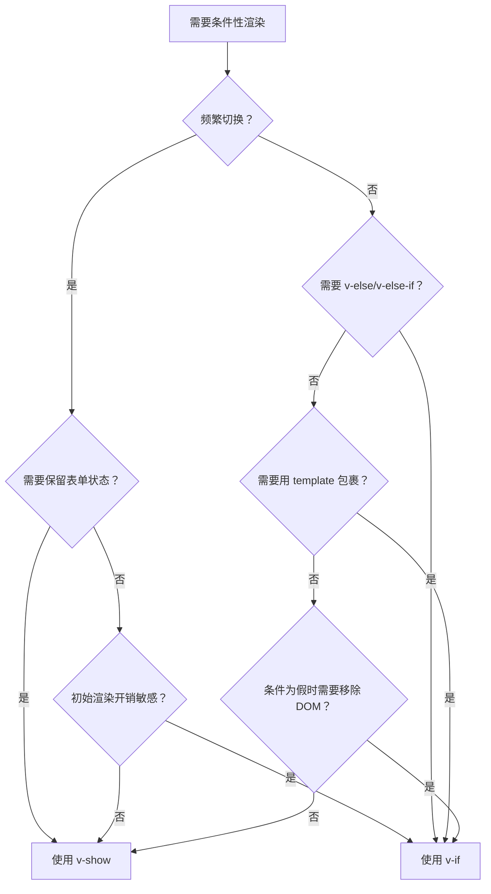

# 条件渲染

## 概述

Vue.js 提供了多种方式根据条件动态渲染内容。条件渲染是前端开发中的常见需求，用于根据应用状态显示或隐藏界面元素。

### 核心指令

| 指令 | 说明 | 特点 | 适用场景 |
|------|------|------|---------|
| `v-if` | 条件性地渲染内容 | 真正的条件渲染，惰性加载 | 运行时条件很少改变 |
| `v-else-if` | v-if 的 else-if 块 | 必须紧跟 v-if 或 v-else-if | 多条件分支 |
| `v-else` | v-if 的 else 块 | 必须紧跟 v-if 或 v-else-if | 条件的默认分支 |
| `v-show` | 切换元素的 display 属性 | 始终渲染，只是切换显示 | 频繁切换显示状态 |

### 渲染机制对比

```
v-if:
条件为真 → 创建元素 → 插入 DOM
条件为假 → 销毁元素 → 从 DOM 移除

v-show:
条件为真 → display: block (或原始值)
条件为假 → display: none
```

## v-if 指令

### 基本用法

`v-if` 指令用于条件性地渲染一块内容。这块内容只会在指令的表达式返回 truthy 值时被渲染。

### v-if 的底层实现原理

`v-if` 在编译阶段被转换为三元表达式，在 VNode 层面通过 patch 实现 DOM 的创建和销毁：



**关键源码（简化）：**

```javascript
// src/compiler/codegen/index.js
// v-if 编译为条件表达式
function genIf(el) {
  return `(${el.if}) ? ${genElement(el)} : ${genElse(el)}`
}
// genElse 递归处理 v-else-if / v-else 链

// src/core/vdom/patch.js
// 条件变化时的 DOM 操作
function removeVnodes(vnodes, startIdx, endIdx) {
  for (; startIdx <= endIdx; ++startIdx) {
    const ch = vnodes[startIdx]
    invokeDestroyHook(ch)  // 触发 beforeDestroy/destroyed
    removeNode(ch.elm)     // 从 DOM 中移除
  }
}
```

```html
<!-- 基础用法示例 -->
<template>
  <div>
    <h1 v-if="awesome">Vue is awesome!</h1>
    <h1 v-else>Oh no 😢</h1>
  </div>
</template>

<script>
export default {
  data() {
    return {
      awesome: true
    }
  }
}
</script>
```

### 在 template 元素上使用

`v-if` 是一个指令，必须将它添加到一个元素上。如果想切换多个元素，可以把一个 `<template>` 元素当做不可见的包裹元素，并在上面使用 `v-if`。最终的渲染结果将不包含 `<template>` 元素：

```html
<template>
  <div>
    <template v-if="ok">
      <h1>标题</h1>
      <p>段落 1</p>
      <p>段落 2</p>
    </template>
  </div>
</template>

<script>
export default {
  data() {
    return {
      ok: true
    }
  }
}
</script>
```

**渲染结果**：

```html
<div>
  <h1>标题</h1>
  <p>段落 1</p>
  <p>段落 2</p>
</div>
```

### v-else 指令

可以使用 `v-else` 来表示 v-if 的"else 块"：

```html
<template>
  <div>
    <div v-if="Math.random() > 0.5">
      大于 0.5
    </div>
    <div v-else>
      小于等于 0.5
    </div>
  </div>
</template>
```

::: warning 注意
`v-else` 元素必须紧跟在带 `v-if` 或 `v-else-if` 的元素后面，否则它将不会被识别。
:::

### v-else-if 指令

`v-else-if` 作为 v-if 的"else if 块"，可以连续使用：

```html
<template>
  <div>
    <div v-if="type === 'A'">A 类型</div>
    <div v-else-if="type === 'B'">B 类型</div>
    <div v-else-if="type === 'C'">C 类型</div>
    <div v-else>不是 A/B/C 类型</div>
  </div>
</template>

<script>
export default {
  data() {
    return {
      type: 'A'
    }
  }
}
</script>
```

::: warning 注意
`v-else-if` 也必须紧跟在带 `v-if` 或 `v-else-if` 的元素之后。
:::

### 用 key 管理可复用的元素

Vue 会尽可能高效地渲染元素，通常会复用已有元素而不是从头开始渲染。这样做可以提高性能：

```html
<template>
  <div>
    <template v-if="loginType === 'username'">
      <label>用户名</label>
      <input placeholder="输入用户名">
    </template>
    
    <template v-else>
      <label>邮箱</label>
      <input placeholder="输入邮箱地址">
    </template>
    
    <button @click="toggleLoginType">切换登录方式</button>
  </div>
</template>

<script>
export default {
  data() {
    return {
      loginType: 'username'
    }
  },
  methods: {
    toggleLoginType() {
      this.loginType = this.loginType === 'username' ? 'email' : 'username'
    }
  }
}
</script>
```

**问题**：切换 `loginType` 时，用户已输入的内容不会被清除。因为两个模板使用了相同的 `<input>` 元素，`<input>` 不会被替换掉——仅仅是替换了它的 `placeholder`。

**解决方案**：添加具有唯一值的 `key` attribute，告诉 Vue 这两个元素是完全独立的：

```html
<template>
  <div>
    <template v-if="loginType === 'username'">
      <label>用户名</label>
      <input placeholder="输入用户名" key="username-input">
    </template>
    
    <template v-else>
      <label>邮箱</label>
      <input placeholder="输入邮箱地址" key="email-input">
    </template>
  </div>
</template>
```

**效果**：
- 每次切换时，输入框都会被重新渲染
- `<label>` 元素仍然会被复用，因为没有添加 `key` attribute

### 完整示例：用户权限控制

```html
<template>
  <div class="user-panel">
    <!-- 未登录状态 -->
    <div v-if="!isLoggedIn" class="login-form">
      <h2>请登录</h2>
      <input v-model="username" placeholder="用户名">
      <input v-model="password" type="password" placeholder="密码">
      <button @click="login">登录</button>
    </div>
    
    <!-- 已登录状态 -->
    <div v-else class="user-info">
      <h2>欢迎，{{ username }}</h2>
      
      <!-- 根据用户角色显示不同内容 -->
      <div v-if="userRole === 'admin'" class="admin-panel">
        <h3>管理员面板</h3>
        <button>管理用户</button>
        <button>系统设置</button>
      </div>
      
      <div v-else-if="userRole === 'vip'" class="vip-panel">
        <h3>VIP 会员中心</h3>
        <button>专属优惠</button>
        <button>会员特权</button>
      </div>
      
      <div v-else class="normal-panel">
        <h3>用户中心</h3>
        <button>个人设置</button>
        <button>升级 VIP</button>
      </div>
      
      <button @click="logout">退出登录</button>
    </div>
  </div>
</template>

<script>
export default {
  data() {
    return {
      isLoggedIn: false,
      username: '',
      password: '',
      userRole: 'normal'
    }
  },
  methods: {
    login() {
      // 模拟登录
      this.isLoggedIn = true
      this.userRole = 'admin'
    },
    logout() {
      this.isLoggedIn = false
      this.username = ''
      this.password = ''
      this.userRole = 'normal'
    }
  }
}
</script>

<style scoped>
.user-panel {
  border: 1px solid #ddd;
  padding: 20px;
  border-radius: 4px;
}

.login-form input {
  display: block;
  margin: 10px 0;
  padding: 8px;
  width: 200px;
}

button {
  margin: 5px;
  padding: 8px 16px;
}
</style>
```

## v-show 指令

### 基本用法

另一个用于根据条件展示元素的选项是 `v-show` 指令：

```html
<template>
  <div>
    <h1 v-show="ok">Hello!</h1>
    <button @click="toggle">切换显示</button>
  </div>
</template>

<script>
export default {
  data() {
    return {
      ok: true
    }
  },
  methods: {
    toggle() {
      this.ok = !this.ok
    }
  }
}
</script>
```

### v-show 的特点

- 带有 `v-show` 的元素始终会被渲染并保留在 DOM 中
- `v-show` 只是简单地切换元素的 CSS 属性 `display`
- 不支持 `<template>` 元素
- 不支持 `v-else`

### 完整示例：标签页切换

```html
<template>
  <div class="tabs">
    <div class="tab-header">
      <button 
        v-for="tab in tabs" 
        :key="tab.id"
        :class="{ active: currentTab === tab.id }"
        @click="currentTab = tab.id"
      >
        {{ tab.name }}
      </button>
    </div>
    
    <div class="tab-content">
      <div v-show="currentTab === 'home'">
        <h2>首页内容</h2>
        <p>这是首页的内容区域</p>
      </div>
      
      <div v-show="currentTab === 'profile'">
        <h2>个人资料</h2>
        <p>这是个人资料的内容区域</p>
      </div>
      
      <div v-show="currentTab === 'settings'">
        <h2>设置</h2>
        <p>这是设置的内容区域</p>
      </div>
    </div>
  </div>
</template>

<script>
export default {
  data() {
    return {
      currentTab: 'home',
      tabs: [
        { id: 'home', name: '首页' },
        { id: 'profile', name: '个人资料' },
        { id: 'settings', name: '设置' }
      ]
    }
  }
}
</script>

<style scoped>
.tabs {
  border: 1px solid #ddd;
  border-radius: 4px;
}

.tab-header {
  display: flex;
  background: #f5f5f5;
  border-bottom: 1px solid #ddd;
}

.tab-header button {
  padding: 10px 20px;
  border: none;
  background: transparent;
  cursor: pointer;
}

.tab-header button.active {
  background: white;
  border-bottom: 2px solid #1890ff;
  color: #1890ff;
}

.tab-content {
  padding: 20px;
}
</style>
```

## v-if vs v-show

### 核心区别

| 特性 | v-if | v-show |
|------|------|--------|
| **渲染方式** | 条件为真时才渲染到 DOM | 始终渲染到 DOM |
| **切换方式** | 创建和销毁元素 | 切换 CSS display 属性 |
| **初始渲染开销** | 低（惰性加载） | 高（始终渲染） |
| **切换开销** | 高（销毁和重建） | 低（仅改变样式） |
| **支持 template** | ✅ 支持 | ❌ 不支持 |
| **支持 v-else** | ✅ 支持 | ❌ 不支持 |
| **生命周期钩子** | 条件变化时触发 | 不触发 |
| **适用场景** | 条件很少改变 | 频繁切换 |

### 性能对比示例

```html
<template>
  <div>
    <!-- v-if：适合不频繁切换的场景 -->
    <div v-if="showPanel">
      <heavy-component></heavy-component>
    </div>
    
    <!-- v-show：适合频繁切换的场景 -->
    <div v-show="showModal">
      <modal-content></modal-content>
    </div>
  </div>
</template>
```

### 选择指南



## v-if 与 v-for 一起使用

### 不推荐一起使用

**不推荐**在同一元素上使用 `v-if` 和 `v-for`：

```html
<!-- ❌ 不推荐：v-if 和 v-for 同级使用 -->
<ul>
  <li 
    v-for="user in users" 
    v-if="user.isActive" 
    :key="user.id"
  >
    {{ user.name }}
  </li>
</ul>
```

**问题**：
- `v-for` 的优先级比 `v-if` 更高
- 这意味着 v-if 将分别重复运行于每个 v-for 循环中
- 性能开销大

### 替代方案

#### 方案 1：使用计算属性（推荐）

```html
<template>
  <ul>
    <li v-for="user in activeUsers" :key="user.id">
      {{ user.name }}
    </li>
  </ul>
</template>

<script>
export default {
  data() {
    return {
      users: [
        { id: 1, name: '张三', isActive: true },
        { id: 2, name: '李四', isActive: false },
        { id: 3, name: '王五', isActive: true }
      ]
    }
  },
  computed: {
    activeUsers() {
      return this.users.filter(user => user.isActive)
    }
  }
}
</script>
```

**优点**：
- 过滤后的列表只计算一次
- 模板更清晰
- 性能更好

#### 方案 2：将 v-if 移动到容器元素

```html
<template>
  <!-- ✅ 推荐：将 v-if 移动到外层 -->
  <ul v-if="users.length">
    <li v-for="user in users" :key="user.id">
      {{ user.name }}
    </li>
  </ul>
  <p v-else>暂无用户</p>
</template>
```

#### 方案 3：使用嵌套 template

```html
<template>
  <template v-for="user in users">
    <li v-if="user.isActive" :key="user.id">
      {{ user.name }}
    </li>
  </template>
</template>
```

### 特殊情况：过滤后的渲染

如果意图是**有条件地跳过循环的执行**，可以将 v-if 置于外层元素（或 template）：

```html
<template>
  <!-- ✅ 正确：根据条件决定是否渲染列表 -->
  <ul v-if="shouldShowUsers">
    <li v-for="user in users" :key="user.id">
      {{ user.name }}
    </li>
  </ul>
</template>
```

## 最佳实践

### 1. 合理选择 v-if 和 v-show

```html
<template>
  <div>
    <!-- ✅ 使用 v-if：条件很少改变 -->
    <div v-if="isLoggedIn">
      用户信息面板
    </div>
    
    <!-- ✅ 使用 v-show：频繁切换 -->
    <div v-show="isExpanded">
      可折叠内容
    </div>
  </div>
</template>
```

### 2. 使用计算属性优化复杂条件

```html
<template>
  <!-- ❌ 不推荐：模板中复杂的条件判断 -->
  <div v-if="user && user.isActive && user.role === 'admin' && !user.isSuspended">
    管理员面板
  </div>
  
  <!-- ✅ 推荐：使用计算属性 -->
  <div v-if="canShowAdminPanel">
    管理员面板
  </div>
</template>

<script>
export default {
  computed: {
    canShowAdminPanel() {
      return this.user && 
             this.user.isActive && 
             this.user.role === 'admin' && 
             !this.user.isSuspended
    }
  }
}
</script>
```

### 3. 使用 key 强制重新渲染

```html
<template>
  <div>
    <!-- ✅ 使用 key 确保组件完全重新渲染 -->
    <user-profile 
      v-if="showProfile" 
      :user="currentUser"
      :key="currentUser.id"
    />
  </div>
</template>
```

### 4. 避免在 v-if/v-else 中重复代码

```html
<template>
  <!-- ❌ 不推荐：重复的代码结构 -->
  <div v-if="isLoading">
    <div class="card">
      <div class="card-header">标题</div>
      <div class="card-body">加载中...</div>
    </div>
  </div>
  
  <div v-else>
    <div class="card">
      <div class="card-header">标题</div>
      <div class="card-body">{{ content }}</div>
    </div>
  </div>
  
  <!-- ✅ 推荐：提取公共部分 -->
  <div class="card">
    <div class="card-header">标题</div>
    <div class="card-body">
      <span v-if="isLoading">加载中...</span>
      <span v-else>{{ content }}</span>
    </div>
  </div>
</template>
```

### 5. 使用 template 包裹多个元素

```html
<template>
  <div>
    <!-- ✅ 使用 template 包裹多个元素，不产生额外 DOM -->
    <template v-if="showSection">
      <h2>标题</h2>
      <p>段落 1</p>
      <p>段落 2</p>
    </template>
    
    <!-- ❌ 避免：使用 div 会产生额外的 DOM 节点 -->
    <div v-if="showSection">
      <h2>标题</h2>
      <p>段落 1</p>
      <p>段落 2</p>
    </div>
  </div>
</template>
```

### 6. 确保 v-else 紧跟 v-if

```html
<template>
  <div>
    <!-- ❌ 错误：v-else 没有紧跟 v-if -->
    <div v-if="condition">内容 A</div>
    <p>其他内容</p>
    <div v-else>内容 B</div>  <!-- 不会被识别 -->
    
    <!-- ✅ 正确：v-else 紧跟 v-if -->
    <div v-if="condition">内容 A</div>
    <div v-else>内容 B</div>
  </div>
</template>
```

## 性能优化建议

### 1. 避免频繁切换大型组件

```html
<template>
  <div>
    <!-- ❌ 性能差：v-if 切换大型组件 -->
    <heavy-component v-if="show"></heavy-component>
    
    <!-- ✅ 性能好：v-show 切换 -->
    <heavy-component v-show="show"></heavy-component>
  </div>
</template>
```

### 2. 使用计算属性减少模板复杂度

```javascript
export default {
  computed: {
    // 计算属性会缓存结果
    showDetails() {
      return this.hasData && this.user.hasPermission && !this.isCollapsed
    }
  }
}
```

### 3. 条件渲染时考虑组件状态

```html
<template>
  <div>
    <!-- ✅ 使用 v-show 保留组件状态 -->
    <form v-show="showForm">
      <input v-model="formData.name">
      <input v-model="formData.email">
    </form>
    
    <!-- ⚠️ v-if 会丢失表单状态 -->
    <form v-if="showForm">
      <input v-model="formData.name">
      <input v-model="formData.email">
    </form>
  </div>
</template>
```

### 4. 分组条件渲染

```html
<template>
  <div>
    <!-- ✅ 分组条件渲染，减少 DOM 操作 -->
    <div v-if="status === 'loading'">
      <loading-spinner />
    </div>
    
    <div v-else-if="status === 'error'">
      <error-message :error="error" />
    </div>
    
    <div v-else>
      <content-view :data="data" />
    </div>
  </div>
</template>
```

### 5. 避免深层嵌套的条件渲染

```html
<template>
  <!-- ❌ 不推荐：深层嵌套难以维护 -->
  <div v-if="condition1">
    <div v-if="condition2">
      <div v-if="condition3">
        内容
      </div>
    </div>
  </div>
  
  <!-- ✅ 推荐：使用计算属性简化 -->
  <div v-if="shouldShowContent">
    内容
  </div>
</template>

<script>
export default {
  computed: {
    shouldShowContent() {
      return this.condition1 && this.condition2 && this.condition3
    }
  }
}
</script>
```

## 常见问题

### Q1: v-if 和 v-show 可以在同一元素上使用吗？

**A**: 可以但不推荐。`v-if` 决定元素是否存在于 DOM，`v-show` 在元素存在的前提下切换 `display`，两者各自生效、并不冲突；但同一元素叠加两套条件逻辑会降低可读性，建议按场景拆分。

```html
<!-- ❌ 不推荐：v-if 和 v-show 同时使用 -->
<div v-if="condition1" v-show="condition2">
  内容
</div>

<!-- ✅ 推荐：分开使用 -->
<div v-if="condition1">
  <div v-show="condition2">
    内容
  </div>
</div>
```

### Q2: 为什么 v-else 不生效？

**A**: `v-else` 必须紧跟在 `v-if` 或 `v-else-if` 元素后面，中间不能有其他元素：

```html
<!-- ❌ 错误：中间有其他元素 -->
<div v-if="condition">A</div>
<p>其他内容</p>
<div v-else>B</div>  <!-- 不生效 -->

<!-- ✅ 正确：紧跟 v-if -->
<div v-if="condition">A</div>
<div v-else>B</div>
```

### Q3: v-show 支持 template 元素吗？

**A**: 不支持。`v-show` 不能用于 `<template>` 元素：

```html
<!-- ❌ 不支持 -->
<template v-show="condition">
  <div>内容 1</div>
  <div>内容 2</div>
</template>

<!-- ✅ 改用 v-if 或包裹在 div 中 -->
<template v-if="condition">
  <div>内容 1</div>
  <div>内容 2</div>
</template>
```

### Q4: 如何强制重新渲染组件？

**A**: 可以使用 `key` 属性：

```html
<template>
  <!-- 使用 key 强制组件重新渲染 -->
  <my-component v-if="show" :key="componentKey" />
  
  <button @click="forceRerender">强制重新渲染</button>
</template>

<script>
export default {
  data() {
    return {
      show: true,
      componentKey: 0
    }
  },
  methods: {
    forceRerender() {
      this.componentKey += 1
    }
  }
}
</script>
```

### Q5: v-if 中的组件生命周期钩子何时触发？

**A**: 当条件从假变为真时，组件被创建，触发 `created`、`mounted` 等钩子；当条件从真变为假时，组件被销毁，触发 `beforeDestroy`、`destroyed` 钩子：

```html
<template>
  <my-component v-if="show" />
</template>

<script>
export default {
  // MyComponent 组件
  created() {
    console.log('组件创建')
  },
  mounted() {
    console.log('组件挂载')
  },
  beforeDestroy() {
    console.log('组件即将销毁')
  },
  destroyed() {
    console.log('组件已销毁')
  }
}
</script>
```

### Q6: v-show 切换时组件会重新创建吗？

**A**: 不会。`v-show` 只是切换 CSS `display` 属性，组件不会重新创建：

```html
<template>
  <!-- 组件只会创建一次，不会因 v-show 切换而重新创建 -->
  <my-component v-show="show" />
</template>
```

### Q7: 如何在 v-if 和 v-else 之间传递数据？

**A**: 使用 data 或计算属性保存共享数据：

```html
<template>
  <div>
    <!-- 共享数据保存在 data 中 -->
    <div v-if="editMode">
      <input v-model="formData.name">
    </div>
    <div v-else>
      <p>{{ formData.name }}</p>
    </div>
  </div>
</template>

<script>
export default {
  data() {
    return {
      editMode: true,
      formData: {
        name: ''
      }
    }
  }
}
</script>
```

### Q8: 如何实现动画过渡效果？

**A**: 使用 `<transition>` 组件包裹 v-if 的内容：

```html
<template>
  <transition name="fade">
    <div v-if="show">内容</div>
  </transition>
</template>

<style>
.fade-enter-active, .fade-leave-active {
  transition: opacity 0.5s;
}
.fade-enter, .fade-leave-to {
  opacity: 0;
}
</style>
```

## 相关内容

- [列表渲染](03-列表渲染.md)
- [事件处理](../03-数据与交互/03-事件处理.md)
- [Class 与 Style 绑定](../03-数据与交互/02-样式绑定.md)
- [过渡动画](../../02-进阶原理/06-过渡动画/01-过渡.md)

---
