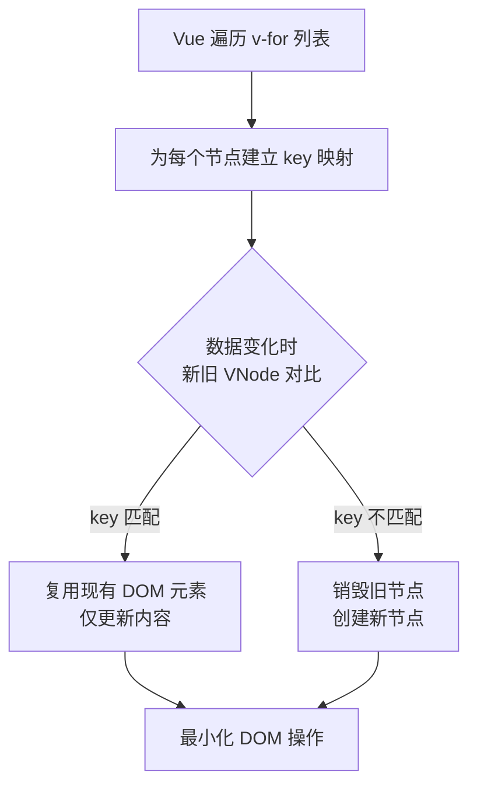
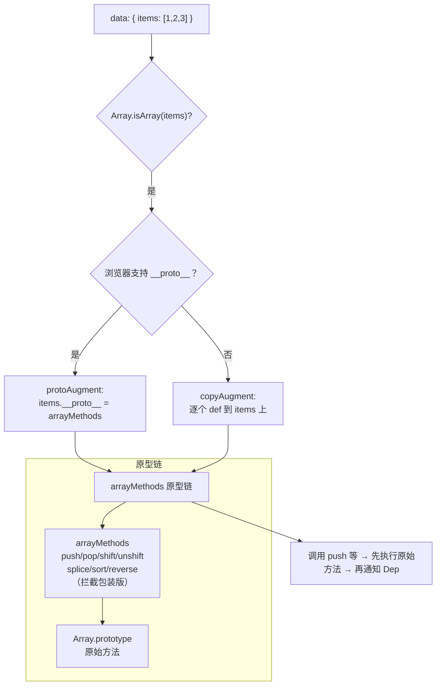

# 列表渲染

## 概述

在 Vue.js 应用中，列表渲染是最常见的需求之一。`v-for` 指令是 Vue 提供的强大工具，用于基于数据源动态渲染列表。它支持数组、对象、数字等多种数据类型，并且能够智能地追踪列表项的变化，实现高效的 DOM 更新。

### 核心概念

- **v-for 指令**：基于数据源重复渲染元素或模板块
- **key 属性**：为每个列表项提供唯一标识，优化渲染性能
- **响应式更新**：自动追踪数组变化并更新视图

### v-for 语法概览

| 数据类型 | 语法格式                                | 参数说明                              |
| -------- | --------------------------------------- | ------------------------------------- |
| 数组     | `v-for="(item, index) in items"`        | item: 数组元素, index: 索引           |
| 对象     | `v-for="(value, key, index) in object"` | value: 属性值, key: 键名, index: 索引 |
| 数字     | `v-for="n in 10"`                       | n: 从1开始的整数                      |
| 字符串   | `v-for="char in 'hello'"`               | char: 每个字符                        |

## 渲染数组

### 基础用法

用 `v-for` 指令基于一个数组来渲染一个列表。`v-for` 指令需要使用 `item in items` 形式的特殊语法，其中 `items` 是源数据数组，而 `item` 则是被迭代的数组元素的**别名**。`v-for` 还支持一个可选的第二个参数，**即当前项的索引**。

```html
<!DOCTYPE html>
<html>
  <head>
    <title>My first Vue app</title>
    <script src="https://unpkg.com/vue@2"></script>
  </head>
  <body>
    <ul id="example-2">
      <li v-for="(item, index) in items">{{ parentMessage }} - {{ index }} - {{ item.message }}</li>
    </ul>

    <script>
      var example2 = new Vue({
        el: "#example-2",
        data: {
          parentMessage: "Parent",
          items: [{ message: "Foo" }, { message: "Bar" }]
        }
      })
    </script>
  </body>
</html>
```

### 使用 of 分隔符

还可以用 `of` 替代 `in` 作为分隔符，因为它更接近 JavaScript 迭代器的语法：

```html
<div v-for="item of items"></div>
```

**推荐使用场景：**

- `in` 分隔符：Vue 传统语法，更常用
- `of` 分隔符：更接近 ES6 语法，适合习惯 JavaScript 迭代器的开发者

### 完整语法示例

```html
<div id="app">
  <ul>
    <li v-for="(item, index) in items" :key="item.id">
      {{ index }} - {{ item.name }} - {{ item.price }}
    </li>
  </ul>
</div>

<script>
  new Vue({
    el: "#app",
    data: {
      items: [
        { id: 1, name: "iPhone", price: 6999 },
        { id: 2, name: "iPad", price: 3999 },
        { id: 3, name: "MacBook", price: 12999 }
      ]
    }
  })
</script>
```

## 渲染对象

### 基础用法

用 `v-for` 来遍历一个对象的 property，第二个的参数为 property 名称（也就是键名）、第三个参数作为索引：

```html
<!DOCTYPE html>
<html>
  <head>
    <title>My first Vue app</title>
    <script src="https://unpkg.com/vue@2"></script>
  </head>
  <body>
    <div id="v-for-object">
      <div v-for="(value, name, index) in object">{{ index }}. {{ name }}: {{ value }}</div>
    </div>

    <script>
      new Vue({
        el: "#v-for-object",
        data: {
          object: {
            title: "How to do lists in Vue",
            author: "Jane Doe",
            publishedAt: "2016-04-10"
          }
        }
      })
    </script>
  </body>
</html>
```

**输出结果：**

```
0. title: How to do lists in Vue
1. author: Jane Doe
2. publishedAt: 2016-04-10
```

### 对象遍历顺序

在遍历对象时会按 `Object.keys()` 的结果遍历，但是**不能**保证它的结果在不同的 JavaScript 引擎下都一致。

**遍历顺序规则：**

- 整数键：按数字升序排列
- 字符串键：按创建顺序排列
- Symbol 键：按创建顺序排列

```javascript
new Vue({
  data: {
    object: {
      2: "second",
      1: "first",
      a: "a",
      b: "b"
    }
  }
})

// 遍历顺序：1, 2, a, b
```

## 维护状态

### key 属性的重要性

**当 Vue 正在更新使用 `v-for` 渲染的元素列表时，它默认使用"就地更新"的策略。如果数据项的顺序被改变，Vue 将不会移动 DOM 元素来匹配数据项的顺序，而是就地更新每个元素，并且确保它们在每个索引位置正确渲染。**

这个默认的模式是高效的，但是**只适用于不依赖子组件状态或临时 DOM 状态（例如：表单输入值）的列表渲染输出**。

### 为什么需要 key

为了给 Vue 一个提示，**以便它能跟踪每个节点的身份，从而重用和重新排序现有元素**，你需要为每项提供一个唯一 `key` attribute：

```html
<div v-for="item in items" v-bind:key="item.id">
  <!-- 内容 -->
</div>
```

#### key 属性的作用机制



### key 使用示例对比

**不使用 key（就地更新）：**

```html
<div v-for="item in items">
  <input type="text" :value="item.name" />
</div>

<!-- 当列表顺序改变时，输入框的值不会跟随移动 -->
```

**使用 key（跟踪身份）：**

```html
<div v-for="item in items" :key="item.id">
  <input type="text" :value="item.name" />
</div>

<!-- 当列表顺序改变时，输入框会正确跟随移动 -->
```

### key 使用建议

建议尽可能在使用 `v-for` 时提供 `key` 属性，除非遍历输出的 DOM 内容非常简单，或者是刻意依赖默认行为以获取性能上的提升。

**最佳实践：**

- ✅ 使用唯一标识符（如 id）作为 key
- ✅ 使用字符串或数值类型的值
- ❌ 不要使用对象或数组作为 key
- ❌ 不要使用索引作为 key（除非列表是静态的）

```html
<!-- 推荐 -->
<div v-for="item in items" :key="item.id">{{ item.name }}</div>

<!-- 不推荐：使用索引 -->
<div v-for="(item, index) in items" :key="index">{{ item.name }}</div>

<!-- 错误：使用对象 -->
<div v-for="item in items" :key="item">{{ item.name }}</div>
```

## 数组更新检测

### 变更方法

**Vue 将被侦听的数组的变更方法进行了包裹，所以也将会触发视图更新**。这些被包裹过的方法包括：

| 方法        | 说明                 | 示例                                |
| ----------- | -------------------- | ----------------------------------- |
| `push()`    | 在数组末尾添加元素   | `items.push({ message: 'Baz' })`    |
| `pop()`     | 删除数组最后一个元素 | `items.pop()`                       |
| `shift()`   | 删除数组第一个元素   | `items.shift()`                     |
| `unshift()` | 在数组开头添加元素   | `items.unshift({ message: 'New' })` |
| `splice()`  | 删除/插入/替换元素   | `items.splice(1, 1, newItem)`       |
| `sort()`    | 排序数组             | `items.sort((a, b) => a.id - b.id)` |
| `reverse()` | 反转数组             | `items.reverse()`                   |

**示例：**

```javascript
var example1 = new Vue({
  data: {
    items: [{ message: "Foo" }, { message: "Bar" }]
  }
})

// 在控制台尝试
example1.items.push({ message: "Baz" })
example1.items.pop()
example1.items.reverse()
```

### 数组方法拦截的源码实现

Vue 2 通过**原型链拦截**实现数组方法的响应式包装，而非 `Object.defineProperty`：



**关键源码（简化）：**

```javascript
// src/core/observer/array.js
const arrayProto = Array.prototype
const arrayMethods = Object.create(arrayProto)  // 继承原始方法

const methodsToPatch = [
  'push', 'pop', 'shift', 'unshift',
  'splice', 'sort', 'reverse'
]

methodsToPatch.forEach(method => {
  const original = arrayProto[method]
  def(arrayMethods, method, function mutator(...args) {
    // 1. 执行原始方法
    const result = original.apply(this, args)
    // 2. 获取该数组的 Observer 实例
    const ob = this.__ob__
    // 3. 对 push/unshift/splice 新增的元素做响应式处理
    let inserted
    switch (method) {
      case 'push':
      case 'unshift':
        inserted = args
        break
      case 'splice':
        inserted = args.slice(2)
        break
    }
    if (inserted) ob.observeArray(inserted)  // 递归响应式
    // 4. 通知依赖更新
    ob.dep.notify()
    return result
  })
})

// 替换原型链
function protoAugment(target, src) {
  target.__proto__ = src  // 现代浏览器
}
function copyAugment(target, src, keys) {
  // 兼容不支持 __proto__ 的环境（IE10-），只复制拦截后的 7 个方法
  for (let i = 0, l = keys.length; i < l; i++) {
    def(target, keys[i], src[keys[i]])
  }
}
```

> **关键点**：`filter`/`concat`/`slice` 等**非变更方法**不在拦截列表中。它们返回新数组，需要在模板中用新数组替换旧数组来触发更新。

### 替换数组

变更方法会变更调用了这些方法的原始数组。相比之下，也有非变更方法，例如 `filter()`、`concat()` 和 `slice()`。它们不会变更原始数组，而**总是返回一个新数组**。当使用非变更方法时，可以用新数组替换旧数组：

```javascript
example1.items = example1.items.filter(function (item) {
  return item.message.match(/Foo/)
})
```

你可能认为这将导致 Vue 丢弃现有 DOM 并重新渲染整个列表。幸运的是，事实并非如此。Vue 为了使得 DOM 元素得到最大范围的重用而实现了一些智能的启发式方法，所以用一个含有相同元素的数组去替换原来的数组是非常高效的操作。

### 数组变更方法对比

| 方法类型   | 方法名                                           | 是否修改原数组 | 触发视图更新  | 使用场景         |
| ---------- | ------------------------------------------------ | -------------- | ------------- | ---------------- |
| 变更方法   | push, pop, shift, unshift, splice, sort, reverse | ✅ 是          | ✅ 自动触发   | 直接修改数组     |
| 非变更方法 | filter, concat, slice, map                       | ❌ 否          | ⚠️ 需替换数组 | 过滤、合并、映射 |

### Vue 不能检测的数组变动

**由于 JavaScript 的限制，Vue 不能检测以下数组变动：**

#### 1. 利用索引直接设置一个数组项

```javascript
var vm = new Vue({
  data: {
    items: ["a", "b", "c"]
  }
})

// ❌ Vue 不能检测
vm.items[1] = "x"

// ✅ 解决方案1：使用 Vue.set
Vue.set(vm.items, 1, "x")

// ✅ 解决方案2：使用 splice
vm.items.splice(1, 1, "x")
```

#### 2. 修改数组长度

```javascript
// ❌ Vue 不能检测
vm.items.length = 2

// ✅ 解决方案：使用 splice
vm.items.splice(2)
```

### 对象变更检测注意事项

**Vue 不能检测对象属性的添加或删除：**

```javascript
var vm = new Vue({
  data: {
    user: {
      name: "John"
    }
  }
})

// ❌ Vue 不能检测
vm.user.age = 25

// ✅ 解决方案1：使用 Vue.set
Vue.set(vm.user, "age", 25)

// ✅ 解决方案2：使用 this.$set
this.$set(this.user, "age", 25)

// ✅ 解决方案3：使用 Object.assign 创建新对象
vm.user = Object.assign({}, vm.user, {
  age: 25,
  gender: "male"
})
```

## 显示过滤/排序后的结果

### 使用计算属性

显示一个数组经过过滤或排序后的版本，而不实际变更或重置原始数据。在这种情况下可以创建一个计算属性，来返回过滤或排序后的数组：

```html
<li v-for="n in evenNumbers">{{ n }}</li>

<script>
  new Vue({
    data: {
      numbers: [1, 2, 3, 4, 5]
    },
    computed: {
      evenNumbers: function () {
        return this.numbers.filter(function (number) {
          return number % 2 === 0
        })
      }
    }
  })
</script>
```

### 使用方法

在计算属性不适用的情况下（例如，在嵌套 `v-for` 循环中）你可以使用一个方法：

```html
<ul v-for="set in sets">
  <li v-for="n in even(set)">{{ n }}</li>
</ul>

<script>
  new Vue({
    data: {
      sets: [
        [1, 2, 3, 4, 5],
        [6, 7, 8, 9, 10]
      ]
    },
    methods: {
      even: function (numbers) {
        return numbers.filter(function (number) {
          return number % 2 === 0
        })
      }
    }
  })
</script>
```

### 实际应用示例

#### 示例1：商品列表过滤和排序

```html
<div id="app">
  <div>
    <label>搜索：</label>
    <input v-model="searchQuery" placeholder="输入商品名称" />
  </div>
  <div>
    <label>排序：</label>
    <select v-model="sortBy">
      <option value="name">按名称</option>
      <option value="price">按价格</option>
    </select>
  </div>

  <ul>
    <li v-for="product in filteredProducts" :key="product.id">
      {{ product.name }} - ¥{{ product.price }}
    </li>
  </ul>
</div>

<script>
  new Vue({
    el: "#app",
    data: {
      searchQuery: "",
      sortBy: "name",
      products: [
        { id: 1, name: "iPhone", price: 6999 },
        { id: 2, name: "iPad", price: 3999 },
        { id: 3, name: "MacBook", price: 12999 },
        { id: 4, name: "Apple Watch", price: 2999 }
      ]
    },
    computed: {
      filteredProducts: function () {
        var filtered = this.products.filter((product) => {
          return product.name.toLowerCase().includes(this.searchQuery.toLowerCase())
        })

        return filtered.sort((a, b) => {
          if (this.sortBy === "price") {
            return a.price - b.price
          }
          return a.name.localeCompare(b.name)
        })
      }
    }
  })
</script>
```

#### 示例2：多条件筛选

```html
<div id="app">
  <div>
    <label>分类：</label>
    <select v-model="selectedCategory">
      <option value="">全部</option>
      <option value="fruit">水果</option>
      <option value="vegetable">蔬菜</option>
    </select>
  </div>
  <div>
    <label>价格范围：</label>
    <input type="number" v-model.number="minPrice" placeholder="最低价" />
    <input type="number" v-model.number="maxPrice" placeholder="最高价" />
  </div>

  <ul>
    <li v-for="item in filteredItems" :key="item.id">
      {{ item.name }} - {{ item.category }} - ¥{{ item.price }}
    </li>
  </ul>
</div>

<script>
  new Vue({
    el: "#app",
    data: {
      selectedCategory: "",
      minPrice: null,
      maxPrice: null,
      items: [
        { id: 1, name: "Apple", category: "fruit", price: 5 },
        { id: 2, name: "Banana", category: "fruit", price: 3 },
        { id: 3, name: "Carrot", category: "vegetable", price: 2 },
        { id: 4, name: "Tomato", category: "vegetable", price: 4 }
      ]
    },
    computed: {
      filteredItems: function () {
        return this.items.filter((item) => {
          var categoryMatch = !this.selectedCategory || item.category === this.selectedCategory
          var priceMatch =
            (!this.minPrice || item.price >= this.minPrice) &&
            (!this.maxPrice || item.price <= this.maxPrice)
          return categoryMatch && priceMatch
        })
      }
    }
  })
</script>
```

## 使用值范围

`v-for` 也可以接受整数。在这种情况下，它会把模板重复对应次数：

```html
<div>
  <span v-for="n in 10">{{ n }} </span>
</div>
<!-- 输出：1 2 3 4 5 6 7 8 9 10 -->
```

### 实际应用示例

```html
<div id="app">
  <div>
    <label>评分：</label>
    <span v-for="star in 5" :key="star">
      <span v-if="star <= rating" style="color: gold;">★</span>
      <span v-else style="color: gray;">☆</span>
    </span>
  </div>

  <div>
    <label>分页：</label>
    <button v-for="page in totalPages" :key="page" @click="currentPage = page">{{ page }}</button>
  </div>
</div>

<script>
  new Vue({
    el: "#app",
    data: {
      rating: 3,
      totalPages: 10,
      currentPage: 1
    }
  })
</script>
```

## 在 `<template>` 上使用 `v-for`

类似于 `v-if`，你也可以利用带有 `v-for` 的 `<template>` 来循环渲染一段包含多个元素的内容：

```html
<ul>
  <template v-for="item in items">
    <li>{{ item.msg }}</li>
    <li class="divider" role="presentation"></li>
  </template>
</ul>
```

### 实际应用：表格渲染

```html
<table>
  <template v-for="user in users">
    <tr :key="user.id">
      <td>{{ user.name }}</td>
      <td>{{ user.email }}</td>
    </tr>
    <tr :key="'detail-' + user.id" class="detail-row">
      <td colspan="2">{{ user.description }}</td>
    </tr>
  </template>
</table>
```

## v-for 与 v-if 同时使用

### 不推荐在同一元素上使用

**不**推荐在同一元素上使用 `v-if` 和 `v-for`。

**当它们处于同一节点，`v-for` 的优先级比 `v-if` 更高，这意味着 `v-if` 将分别重复运行于每个 `v-for` 循环中。当你只想为部分项渲染节点时，这种优先级的机制会十分有用，如下：代码将只渲染未完成的 todo：**

```html
<li v-for="todo in todos" v-if="!todo.isComplete">{{ todo }}</li>
```

### 推荐做法

而如果你的目的是有条件地跳过循环的执行，那么可以将 `v-if` 置于外层元素（或 `<template>` 上）：

```html
<ul v-if="todos.length">
  <li v-for="todo in todos">{{ todo }}</li>
</ul>
<p v-else>No todos left!</p>
```

### 使用计算属性替代

更好的做法是使用计算属性预先过滤数据：

```html
<ul>
  <li v-for="todo in activeTodos" :key="todo.id">{{ todo.text }}</li>
</ul>

<script>
  new Vue({
    data: {
      todos: [
        { id: 1, text: "Learn Vue", isComplete: false },
        { id: 2, text: "Build app", isComplete: true },
        { id: 3, text: "Deploy", isComplete: false }
      ]
    },
    computed: {
      activeTodos: function () {
        return this.todos.filter((todo) => !todo.isComplete)
      }
    }
  })
</script>
```

## 在组件上使用 `v-for`

### 基础用法

2.2.0+ 的版本里，当在组件上使用 `v-for` 时，`key` 现在是必须的：

```html
<my-component v-for="item in items" :key="item.id"></my-component>
```

任何数据都不会被自动传递到组件里，因为组件有自己独立的作用域。为了把迭代数据传递到组件里要使用 prop：

```html
<my-component
  v-for="(item, index) in items"
  v-bind:item="item"
  v-bind:index="index"
  v-bind:key="item.id"></my-component>
```

> **不自动将 `item` 注入到组件里的原因是，这会使得组件与 `v-for` 的运作紧密耦合。明确组件数据的来源能够使组件在其他场合重复使用。**

### 完整示例：Todo 列表

```html
<div id="todo-list-example">
  <form v-on:submit.prevent="addNewTodo">
    <label for="new-todo">Add a todo</label>
    <input v-model="newTodoText" id="new-todo" placeholder="E.g. Feed the cat" />
    <button>Add</button>
  </form>
  <ul>
    <li
      is="todo-item"
      v-for="(todo, index) in todos"
      v-bind:key="todo.id"
      v-bind:title="todo.title"
      v-on:remove="todos.splice(index, 1)"></li>
  </ul>
</div>
```

注意这里的 `is="todo-item"` 属性。这种做法在使用 DOM 模板时是十分必要的，因为在 `<ul>` 元素内只有 `<li>` 元素会被看作有效内容。这样做实现的效果与 `<todo-item>` 相同，但是可以避开一些潜在的浏览器解析错误。查看 [组件基础 - 解析 DOM 模板时的注意事项](../04-组件基础/01-组件基础.md#解析-dom-模板时的注意事项) 了解更多。

```javascript
Vue.component("todo-item", {
  template:
    "\
    <li>\
      {{ title }}\
      <button v-on:click=\"$emit('remove')\">Remove</button>\
    </li>\
  ",
  props: ["title"]
})

new Vue({
  el: "#todo-list-example",
  data: {
    newTodoText: "",
    todos: [
      {
        id: 1,
        title: "Do the dishes"
      },
      {
        id: 2,
        title: "Take out the trash"
      }
    ],
    nextTodoId: 3
  },
  methods: {
    addNewTodo: function () {
      this.todos.push({
        id: this.nextTodoId++,
        title: this.newTodoText
      })
      this.newTodoText = ""
    }
  }
})
```

### 组件列表最佳实践

```html
<div id="app">
  <!-- 推荐：使用 v-bind 简写 -->
  <product-item
    v-for="product in products"
    :key="product.id"
    :product="product"
    @add-to-cart="addToCart"></product-item>
</div>

<script>
  Vue.component("product-item", {
    template: `
      <div class="product">
        <h3>{{ product.name }}</h3>
        <p>¥{{ product.price }}</p>
        <button @click="$emit('add-to-cart', product)">加入购物车</button>
      </div>
    `,
    props: {
      product: {
        type: Object,
        required: true
      }
    }
  })

  new Vue({
    el: "#app",
    data: {
      products: [
        { id: 1, name: "iPhone", price: 6999 },
        { id: 2, name: "iPad", price: 3999 }
      ],
      cart: []
    },
    methods: {
      addToCart: function (product) {
        this.cart.push(product)
      }
    }
  })
</script>
```

## 最佳实践

### 1. 始终提供 key 属性

```html
<!-- 推荐 -->
<div v-for="item in items" :key="item.id">{{ item.name }}</div>

<!-- 不推荐：无 key -->
<div v-for="item in items">{{ item.name }}</div>

<!-- 不推荐：使用索引作为 key -->
<div v-for="(item, index) in items" :key="index">{{ item.name }}</div>
```

### 2. 避免在 v-for 中使用 v-if

```html
<!-- 不推荐 -->
<div v-for="item in items" v-if="item.active" :key="item.id">{{ item.name }}</div>

<!-- 推荐：使用计算属性 -->
<div v-for="item in activeItems" :key="item.id">{{ item.name }}</div>

<script>
  export default {
    computed: {
      activeItems: function () {
        return this.items.filter(item => item.active)
      }
    }
  }
</script>
```

### 3. 使用计算属性处理复杂逻辑

```html
<!-- 不推荐：模板中复杂逻辑 -->
<div v-for="item in items.filter(i => i.price > 100).sort((a, b) => a.price - b.price)">
  {{ item.name }}
</div>

<!-- 推荐：使用计算属性 -->
<div v-for="item in expensiveItems">{{ item.name }}</div>

<script>
  export default {
    computed: {
      expensiveItems: function () {
        return this.items
          .filter(i => i.price > 100)
          .sort((a, b) => a.price - b.price)
      }
    }
  }
</script>
```

### 4. 大列表性能优化

#### 虚拟滚动

对于大列表，使用虚拟滚动只渲染可见区域：

```html
<!-- 使用 vue-virtual-scroller 的 RecycleScroller -->
<recycle-scroller :items="largeList" :item-size="50">
  <template v-slot="{ item }">
    <div>{{ item.name }}</div>
  </template>
</recycle-scroller>
```

#### 分页加载

```html
<div id="app">
  <ul>
    <li v-for="item in displayedItems" :key="item.id">{{ item.name }}</li>
  </ul>
  <button v-if="hasMore" @click="loadMore">加载更多</button>
</div>

<script>
  new Vue({
    data: {
      allItems: [],
      displayedItems: [],
      pageSize: 20,
      currentPage: 0
    },
    computed: {
      hasMore: function () {
        return this.displayedItems.length < this.allItems.length
      }
    },
    methods: {
      loadMore: function () {
        this.currentPage++
        var start = (this.currentPage - 1) * this.pageSize
        var end = start + this.pageSize
        this.displayedItems = this.displayedItems.concat(this.allItems.slice(start, end))
      }
    }
  })
</script>
```

### 5. 正确使用数组变异方法

```javascript
// 添加元素
this.items.push(newItem)
this.items.unshift(newItem)
this.items.splice(index, 0, newItem)

// 删除元素
this.items.pop()
this.items.shift()
this.items.splice(index, 1)

// 替换元素
this.items.splice(index, 1, newItem)

// 清空数组
this.items.splice(0)

// 批量操作
this.items.push(...newItems)
```

## 常见问题解答（FAQ）

### Q1: 为什么不能使用索引作为 key？

**A:** 使用索引作为 key 会导致以下问题：

- 列表顺序改变时，key 值会变化，导致不必要的 DOM 重新渲染
- 可能导致状态错乱（如输入框的值错位）
- 影响性能，无法有效复用 DOM

```html
<!-- 错误示例 -->
<div v-for="(item, index) in items" :key="index">
  <input v-model="item.text" />
</div>

<!-- 当删除第一个元素时，输入框的值会错位 -->
```

### Q2: 如何检测数组长度变化？

**A:** Vue 不能检测直接设置数组长度的变化，需要使用 splice：

```javascript
// ❌ 不能检测
this.items.length = 2

// ✅ 正确方法
this.items.splice(2)
```

### Q3: 如何给对象添加新属性？

**A:** 使用 Vue.set 或 Object.assign：

```javascript
// ❌ 不能检测
this.user.age = 25

// ✅ 方法1：Vue.set
Vue.set(this.user, "age", 25)

// ✅ 方法2：this.$set
this.$set(this.user, "age", 25)

// ✅ 方法3：Object.assign
this.user = Object.assign({}, this.user, { age: 25 })
```

### Q4: v-for 和 v-if 哪个优先级更高？

**A:** 在 Vue 2 中，v-for 优先级更高；在 Vue 3 中，v-if 优先级更高。不推荐在同一元素上同时使用，应该使用计算属性或外层元素。

### Q5: 如何实现列表的动画效果？

**A:** 使用 `<transition-group>` 组件：

```html
<transition-group name="list" tag="ul">
  <li v-for="item in items" :key="item.id">{{ item.text }}</li>
</transition-group>

<style>
  .list-enter-active,
  .list-leave-active {
    transition: all 1s;
  }
  .list-enter,
  .list-leave-to {
    opacity: 0;
    transform: translateX(30px);
  }
</style>
```

### Q6: 如何监听数组变化？

**A:** 使用 watch 配合 deep 选项：

```javascript
watch: {
  items: {
    handler: function (newVal, oldVal) {
      console.log('Items changed')
    },
    deep: true
  }
}
```

### Q7: 如何在组件中正确传递列表数据？

**A:** 使用 props 明确传递数据：

```html
<template>
  <item-component
    v-for="item in items"
    :key="item.id"
    :item="item"
    :index="index"
    @click="handleClick"></item-component>
</template>
```

### Q8: 如何优化大列表渲染性能？

**A:** 采用以下策略：

- 使用虚拟滚动（只渲染可见区域）
- 分页加载
- 使用 Object.freeze 冻结不需要响应式的数据
- 避免在 v-for 中使用复杂计算

```javascript
// 冻结数据
this.largeList = Object.freeze(largeDataArray)
```

### Q9: 如何实现列表的拖拽排序？

**A:** 使用第三方库如 vuedraggable：

```html
<draggable v-model="items">
  <div v-for="item in items" :key="item.id">{{ item.name }}</div>
</draggable>
```

### Q10: 如何在 v-for 中访问父作用域的数据？

**A:** 直接访问即可，v-for 会继承父作用域：

```html
<div v-for="item in items">{{ parentMessage }} - {{ item.name }}</div>
```

## API 参考

### v-for 指令语法

```html
<!-- 数组语法 -->
<div v-for="(item, index) in items" :key="item.id"></div>
<div v-for="item of items" :key="item.id"></div>

<!-- 对象语法 -->
<div v-for="(value, key, index) in object" :key="key"></div>

<!-- 整数语法 -->
<div v-for="n in 10" :key="n"></div>

<!-- 字符串语法 -->
<div v-for="char in 'hello'" :key="char"></div>
```

### 数组变异方法

| 方法    | 语法                                              | 说明               |
| ------- | ------------------------------------------------- | ------------------ |
| push    | `array.push(item1, ..., itemX)`                   | 末尾添加元素       |
| pop     | `array.pop()`                                     | 删除最后一个元素   |
| shift   | `array.shift()`                                   | 删除第一个元素     |
| unshift | `array.unshift(item1, ..., itemX)`                | 开头添加元素       |
| splice  | `array.splice(index, howmany, item1, ..., itemX)` | 删除/插入/替换元素 |
| sort    | `array.sort(compareFunction)`                     | 排序               |
| reverse | `array.reverse()`                                 | 反转               |

### Vue.set / this.$set

```javascript
// 设置数组元素
Vue.set(array, index, value)
this.$set(this.array, index, value)

// 设置对象属性
Vue.set(object, key, value)
this.$set(this.object, key, value)
```

## 总结

列表渲染是 Vue.js 中最常用的功能之一，掌握 `v-for` 指令的正确使用方法对于开发高效的 Vue 应用至关重要：

1. **始终使用 key**：为每个列表项提供唯一标识，确保正确的 DOM 复用
2. **理解响应式限制**：了解 Vue 不能检测的数组/对象变化，使用正确的方法更新数据
3. **避免 v-if 和 v-for 混用**：使用计算属性或外层元素替代
4. **性能优化**：对大列表使用虚拟滚动、分页加载等技术
5. **最佳实践**：遵循 Vue 推荐的模式，编写可维护的代码
