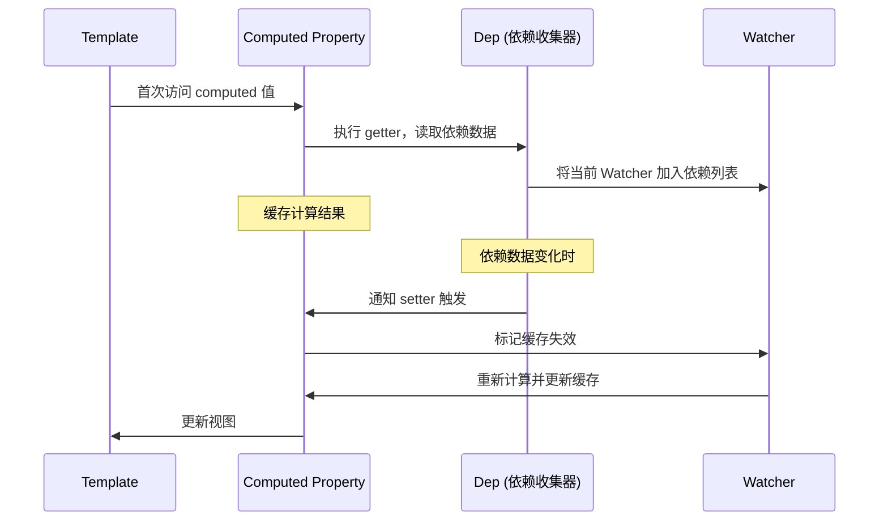
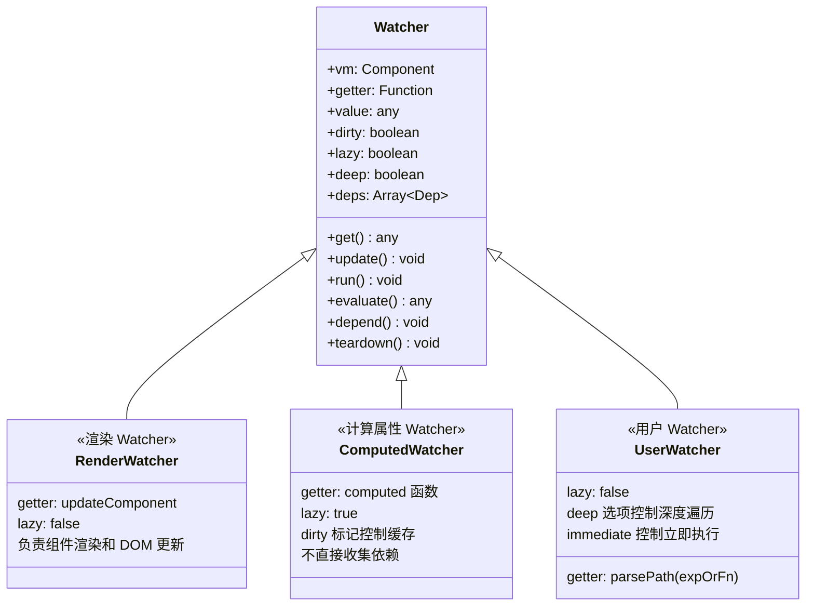
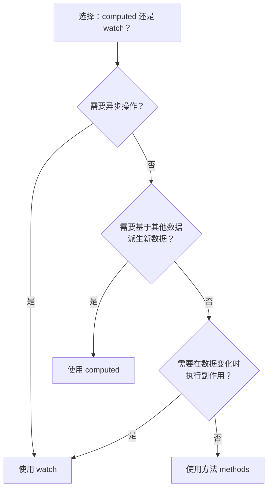

# 计算属性

## 概述

在 Vue.js 应用中，数据的响应式处理是核心特性之一。计算属性（Computed Properties）和侦听器（Watchers）是 Vue 提供的两种重要机制，用于处理数据的变化和派生状态。理解它们的区别和使用场景，对于编写高效、可维护的 Vue 应用至关重要。

### 核心概念

- **计算属性**：基于响应式依赖进行缓存的属性，适用于派生数据的场景
- **侦听器**：用于观察和响应数据变化的通用机制，适用于异步操作或复杂逻辑

## 计算属性

### 基础用法

模板内的表达式非常便利，但是设计的初衷是用于简单运算的。在模板中放入太多的逻辑会让模板过重且难以维护，对于任何复杂逻辑都应当使用**计算属性**。

**不推荐的写法：**

```html
<div id="example">{{ message.split('').reverse().join('') }}</div>
```

**推荐的写法：**

```html
<!DOCTYPE html>
<html>
  <head>
    <title>My first Vue app</title>
    <script src="https://unpkg.com/vue@2"></script>
  </head>
  <body>
    <div id="example">
      <p>Original message: "{{ message }}"</p>
      <p>Computed reversed message: "{{ reversedMessage }}"</p>
    </div>

    <script>
      var vm = new Vue({
        el: "#example",
        data: {
          message: "Hello"
        },
        computed: {
          reversedMessage: function () {
            return this.message.split("").reverse().join("")
          }
        }
      })
    </script>
  </body>
</html>
```

### 工作原理

Vue 知道 `vm.reversedMessage` 依赖于 `vm.message`，当 `vm.message` 发生改变时，所有依赖 `vm.reversedMessage` 的绑定也会更新。而且最妙的是已经以声明的方式创建了这种依赖关系：**计算属性的 getter 函数是没有副作用（side effect）的，这使它更易于测试和理解**。

#### 响应式依赖追踪流程



#### Watcher 的三种类型

Vue 2 内部使用统一的 `Watcher` 类管理三种不同的观察者：



| 类型 | 创建时机 | lazy | 特点 |
|------|---------|------|------|
| **Render Watcher** | `mountComponent` | `false` | 一个组件只有 1 个，负责渲染 |
| **Computed Watcher** | `initComputed` | `true` | 每个 computed 属性 1 个，惰性求值 |
| **User Watcher** | `initWatch` / `$watch` | `false` | 用户定义，支持 deep/immediate |

#### Computed Watcher 的 lazy 求值机制

```javascript
// src/core/observer/watcher.js（简化）
class Watcher {
  constructor(vm, expOrFn, cb, options = {}) {
    this.lazy = options.lazy  // computed watcher 的 lazy = true
    this.dirty = this.lazy    // dirty 标记控制是否重新计算

    if (this.lazy) {
      // lazy watcher 不立即求值
      this.value = undefined
    } else {
      // render/user watcher 立即求值
      this.value = this.get()
    }
  }

  // 计算属性的 getter 用 evaluate 触发求值
  evaluate() {
    this.value = this.get()
    this.dirty = false  // 求值后清除 dirty 标记
  }

  // 依赖变化时，computed watcher 只标记 dirty = true
  update() {
    if (this.lazy) {
      this.dirty = true  // 仅标记失效，不立即重新计算
    } else {
      queueWatcher(this)  // render/user watcher 加入异步更新队列
    }
  }
}
```

> **关键**：计算属性被多次访问时，只要依赖未变化（`dirty === false`），直接返回缓存的 `this.value`，不会重复执行 getter。这就是「缓存机制」的底层实现。

### 计算属性缓存 vs 方法

通过在表达式中调用方法来达到同样的效果，可以将同一函数定义为一个方法而不是一个计算属性。两种方式的最终结果确实是完全相同的。

**方法实现：**

```javascript
<p>Reversed message: "{{ reversedMessage() }}"</p>

// 在组件中
methods: {
  reversedMessage: function () {
    return this.message.split('').reverse().join('')
  }
}
```

**关键区别：**

| 特性         | 计算属性               | 方法                   |
| ------------ | ---------------------- | ---------------------- |
| **缓存机制** | ✅ 基于响应式依赖缓存  | ❌ 无缓存              |
| **性能**     | 依赖不变时直接返回缓存 | 每次调用都执行         |
| **使用方式** | 像属性一样访问         | 需要加括号调用         |
| **适用场景** | 派生数据、复杂计算     | 需要每次重新计算的场景 |

**缓存示例：**

```javascript
computed: {
  now: function () {
    return Date.now()
  }
}
```

上面的计算属性将不再更新，因为 `Date.now()` 不是响应式依赖。相比之下，每当触发重新渲染时，调用方法将总会再次执行函数。

> **为什么需要缓存？** 假设有一个性能开销比较大的计算属性 **A**，它需要遍历一个巨大的数组并做大量的计算。然后可能有其他的计算属性依赖于 **A**。如果没有缓存将不可避免的多次执行 **A** 的 getter！如果你不希望有缓存，请用方法来替代。

### 计算属性 vs 侦听属性

Vue 提供了一种更通用的方式来观察和响应 Vue 实例上的数据变动：**侦听属性**。当有一些数据需要随着其它数据变动而变动时，你很容易滥用 `watch`。通常更好的做法是使用计算属性而不是命令式的 `watch` 回调。

**不推荐：使用 watch**

```javascript
<div id="demo">{{ fullName }}</div>

var vm = new Vue({
  el: "#demo",
  data: {
    firstName: "Foo",
    lastName: "Bar",
    fullName: "Foo Bar"
  },
  watch: {
    firstName: function (val) {
      this.fullName = val + " " + this.lastName
    },
    lastName: function (val) {
      this.fullName = this.firstName + " " + val
    }
  }
})
```

**推荐：使用计算属性**

```javascript
var vm = new Vue({
  el: "#demo",
  data: {
    firstName: "Foo",
    lastName: "Bar"
  },
  computed: {
    fullName: function () {
      return this.firstName + " " + this.lastName
    }
  }
})
```

### 计算属性的 setter

计算属性默认只有 getter，但可以提供 setter。当运行 `vm.fullName = 'John Doe'` 时，setter 会被调用，`vm.firstName` 和 `vm.lastName` 也会相应地被更新。

```javascript
computed: {
  fullName: {
    get: function () {
      return this.firstName + ' ' + this.lastName
    },
    set: function (newValue) {
      var names = newValue.split(' ')
      this.firstName = names[0]
      this.lastName = names[names.length - 1]
    }
  }
}
```

### 实际应用示例

#### 示例1：购物车总价计算

```javascript
new Vue({
  data: {
    cart: [
      { name: "iPhone", price: 6999, quantity: 2 },
      { name: "iPad", price: 3999, quantity: 1 },
      { name: "MacBook", price: 12999, quantity: 1 }
    ],
    discount: 0.9
  },
  computed: {
    subtotal: function () {
      return this.cart.reduce((sum, item) => {
        return sum + item.price * item.quantity
      }, 0)
    },
    total: function () {
      return (this.subtotal * this.discount).toFixed(2)
    },
    itemCount: function () {
      return this.cart.reduce((sum, item) => sum + item.quantity, 0)
    }
  }
})
```

#### 示例2：过滤和排序

```javascript
new Vue({
  data: {
    items: [
      { id: 1, name: "Apple", category: "fruit", price: 5 },
      { id: 2, name: "Banana", category: "fruit", price: 3 },
      { id: 3, name: "Carrot", category: "vegetable", price: 2 }
    ],
    filterCategory: "all",
    sortBy: "name"
  },
  computed: {
    filteredItems: function () {
      var items = this.items
      if (this.filterCategory !== "all") {
        items = items.filter((item) => item.category === this.filterCategory)
      }
      return items.sort((a, b) => {
        if (this.sortBy === "price") {
          return a.price - b.price
        }
        return a.name.localeCompare(b.name)
      })
    }
  }
})
```

## 侦听器

### 基础用法

虽然计算属性在大多数情况下更合适，但有时也需要一个自定义的侦听器。这就是为什么 Vue 通过 `watch` 选项提供了一个更通用的方法，来响应数据的变化。当需要在数据变化时执行异步或开销较大的操作时，这个方式是最有用的。

```html
<div id="watch-example">
  <p>
    Ask a yes/no question:
    <input v-model="question" />
  </p>
  <p>{{ answer }}</p>
</div>

<script src="https://cdn.jsdelivr.net/npm/axios@0.12.0/dist/axios.min.js"></script>
<script src="https://cdn.jsdelivr.net/npm/lodash@4.13.1/lodash.min.js"></script>
<script>
  var watchExampleVM = new Vue({
    el: "#watch-example",
    data: {
      question: "",
      answer: "I cannot give you an answer until you ask a question!"
    },
    watch: {
      question: function (newQuestion, oldQuestion) {
        this.answer = "Waiting for you to stop typing..."
        this.debouncedGetAnswer()
      }
    },
    created: function () {
      this.debouncedGetAnswer = _.debounce(this.getAnswer, 500)
    },
    methods: {
      getAnswer: function () {
        if (this.question.indexOf("?") === -1) {
          this.answer = "Questions usually contain a question mark. ;-)"
          return
        }
        this.answer = "Thinking..."
        var vm = this
        axios
          .get("https://yesno.wtf/api")
          .then(function (response) {
            vm.answer = _.capitalize(response.data.answer)
          })
          .catch(function (error) {
            vm.answer = "Error! Could not reach the API. " + error
          })
      }
    }
  })
</script>
```

使用 `watch` 选项执行异步操作，并在得到最终结果前，设置中间状态。这些都是计算属性无法做到的。

> **除了 `watch` 选项之外，您还可以使用命令式的 `vm.$watch` API。**

### 侦听器配置选项

Vue 提供了多个配置选项来控制侦听器的行为：

#### 1. handler 方法

```javascript
watch: {
  question: {
    handler: function (newVal, oldVal) {
      console.log('Question changed from', oldVal, 'to', newVal)
    }
  }
}
```

#### 2. immediate 选项

立即触发回调，在侦听开始时立即以当前值触发回调。

```javascript
watch: {
  question: {
    handler: function (newVal, oldVal) {
      this.fetchData(newVal)
    },
    immediate: true
  }
}
```

#### 3. deep 选项

深度监听，用于监听对象内部值的变化。

```javascript
watch: {
  user: {
    handler: function (newVal, oldVal) {
      this.saveToDatabase(newVal)
    },
    deep: true
  }
}
```

**深度监听的性能优化：**

如果只监听对象的特定属性，建议使用字符串路径：

```javascript
watch: {
  'user.name': function (newVal, oldVal) {
    console.log('User name changed to', newVal)
  },
  'user.profile.email': function (newVal, oldVal) {
    console.log('Email changed to', newVal)
  }
}
```

### 侦听器完整配置示例

```javascript
new Vue({
  data: {
    searchQuery: "",
    user: {
      name: "John",
      age: 25,
      profile: {
        email: "john@example.com",
        address: "New York"
      }
    }
  },
  watch: {
    searchQuery: {
      handler: "performSearch",
      immediate: true
    },
    user: {
      handler: function (newVal, oldVal) {
        this.saveUser(newVal)
      },
      deep: true
    },
    "user.profile.email": {
      handler: function (newVal, oldVal) {
        this.validateEmail(newVal)
      },
      immediate: false
    }
  },
  methods: {
    performSearch: _.debounce(function (query) {
      if (query.length < 3) return
      console.log("Searching for:", query)
    }, 300),
    saveUser: function (user) {
      console.log("Saving user:", user)
    },
    validateEmail: function (email) {
      const re = /^[^\s@]+@[^\s@]+\.[^\s@]+$/
      console.log("Email valid:", re.test(email))
    }
  }
})
```

### vm.$watch API

除了在 `watch` 选项中定义侦听器，还可以使用 `vm.$watch` API：

```javascript
var vm = new Vue({
  data: {
    a: 1
  }
})

var unwatch = vm.$watch("a", function (newVal, oldVal) {
  console.log("a changed:", oldVal, "->", newVal)
})

vm.a = 2

unwatch()
```

**$watch 完整签名：**

```javascript
vm.$watch(expOrFn, callback, [options])
```

**参数说明：**

| 参数       | 类型               | 说明                          |
| ---------- | ------------------ | ----------------------------- |
| `expOrFn`  | String \| Function | 要监听的表达式或函数          |
| `callback` | Function \| Object | 回调函数或包含 handler 的对象 |
| `options`  | Object             | 可选配置项（deep, immediate） |

**返回值：** 返回一个取消监听的函数。

## 计算属性 vs 侦听器对比

### 使用场景对比表

| 场景                    | 推荐方案       | 原因                       |
| ----------------------- | -------------- | -------------------------- |
| 派生数据（如 fullName） | 计算属性       | 声明式、自动缓存、代码简洁 |
| 异步操作                | 侦听器         | 计算属性不支持异步         |
| 数据变化时执行操作      | 侦听器         | 侦听器适合命令式操作       |
| 性能敏感的计算          | 计算属性       | 缓存机制避免重复计算       |
| 监听对象深层变化        | 侦听器（deep） | 计算属性无法深度监听       |
| 需要中间状态            | 侦听器         | 可以在回调中设置多个状态   |

### 决策流程图



## 最佳实践

### 1. 计算属性最佳实践

#### 避免在计算属性中执行副作用操作

```javascript
computed: {
  bad: function () {
    this.counter++
    return this.counter
  },
  good: function () {
    return this.items.filter(item => item.active).length
  }
}
```

#### 合理使用计算属性的 setter

```javascript
computed: {
  fullName: {
    get: function () {
      return this.firstName + ' ' + this.lastName
    },
    set: function (newValue) {
      var names = newValue.split(' ')
      this.firstName = names[0]
      this.lastName = names[names.length - 1]
    }
  }
}
```

#### 拆分复杂计算属性

```javascript
computed: {
  activeItems: function () {
    return this.items.filter(item => item.active)
  },
  sortedActiveItems: function () {
    // slice() 复制后再排序，避免就地修改 activeItems 的缓存结果
    return this.activeItems.slice().sort((a, b) => a.price - b.price)
  },
  totalPrice: function () {
    return this.activeItems.reduce((sum, item) => sum + item.price, 0)
  }
}
```

### 2. 侦听器最佳实践

#### 使用字符串路径监听深层属性

```javascript
watch: {
  'user.profile.email': function (newVal) {
    this.validateEmail(newVal)
  }
}
```

#### 避免滥用 deep 选项

```javascript
watch: {
  user: {
    handler: 'saveUser',
    deep: true
  }
}
```

#### 使用 immediate 初始化数据

```javascript
watch: {
  userId: {
    handler: 'fetchUserData',
    immediate: true
  }
}
```

#### 结合 lodash 进行防抖和节流

```javascript
watch: {
  searchQuery: {
    handler: _.debounce(function (newVal) {
      this.search(newVal)
    }, 300),
    immediate: true
  }
}
```

### 3. 性能优化建议

#### 计算属性性能优化

1. **避免复杂计算**：将复杂计算拆分为多个计算属性
2. **合理使用缓存**：利用计算属性的缓存特性
3. **避免循环依赖**：计算属性之间不要相互依赖

```javascript
computed: {
  filteredItems: function () {
    return this.items.filter(item => item.active)
  },
  sortedItems: function () {
    return this.filteredItems.slice().sort((a, b) => a.name.localeCompare(b.name))
  }
}
```

#### 侦听器性能优化

1. **避免深度监听大对象**：使用字符串路径监听特定属性
2. **及时取消监听**：使用 `unwatch` 函数取消不需要的监听
3. **合理使用防抖节流**：避免频繁触发回调

```javascript
var unwatch = this.$watch("data", callback, { deep: true })

this.$once("hook:beforeDestroy", function () {
  unwatch()
})
```

## 常见问题解答（FAQ）

### Q1: 计算属性和方法的区别是什么？

**A:** 主要区别在于缓存机制。计算属性基于响应式依赖进行缓存，只有依赖发生变化时才会重新计算；方法每次调用都会执行。对于性能敏感的场景，推荐使用计算属性。

### Q2: 什么时候应该使用侦听器而不是计算属性？

**A:** 以下场景推荐使用侦听器：

- 需要执行异步操作
- 需要在数据变化时执行命令式操作
- 需要监听对象深层变化
- 需要设置中间状态

### Q3: 计算属性可以依赖其他计算属性吗？

**A:** 可以。计算属性可以依赖其他计算属性，Vue 会自动建立依赖关系。

```javascript
computed: {
  fullName: function () {
    return this.firstName + ' ' + this.lastName
  },
  greeting: function () {
    return 'Hello, ' + this.fullName
  }
}
```

### Q4: 如何在计算属性中处理异步操作？

**A:** 计算属性不支持异步操作。如果需要异步操作，应该使用侦听器或方法。

### Q5: 深度监听（deep: true）会影响性能吗？

**A:** 是的，深度监听会遍历对象的每一层属性，对于大对象会影响性能。建议使用字符串路径监听特定属性。

### Q6: 如何取消侦听器？

**A:** 使用 `vm.$watch` 返回的取消函数：

```javascript
var unwatch = this.$watch("data", callback)
unwatch()
```

### Q7: 计算属性的 setter 有什么用？

**A:** setter 允许计算属性支持双向绑定。当设置计算属性的值时，setter 会被调用，可以更新依赖的数据。

### Q8: immediate 选项的作用是什么？

**A:** immediate 选项会在侦听器创建时立即以当前值触发回调，常用于初始化数据。

### Q9: 如何监听数组的变化？

**A:** Vue 可以检测到数组的变化（push、pop、shift、unshift、splice、sort、reverse），直接监听数组即可：

```javascript
watch: {
  items: {
    handler: function (newVal, oldVal) {
      console.log('Items changed')
    },
    deep: true
  }
}
```

### Q10: 计算属性和侦听器可以同时使用吗？

**A:** 可以。在实际项目中，经常需要同时使用计算属性和侦听器，根据不同场景选择合适的方案。

## API 参考

### computed 选项

| 配置项          | 类型               | 说明                                                  |
| --------------- | ------------------ | ----------------------------------------------------- |
| `[key: string]` | Function \| Object | 计算属性定义，可以是 getter 函数或包含 get/set 的对象 |

### watch 选项

| 配置项          | 类型               | 说明                                 |
| --------------- | ------------------ | ------------------------------------ |
| `[key: string]` | Function \| Object | 侦听器定义，可以是回调函数或配置对象 |

**侦听器配置对象：**

| 属性        | 类型     | 默认值 | 说明         |
| ----------- | -------- | ------ | ------------ |
| `handler`   | Function | -      | 回调函数     |
| `immediate` | Boolean  | false  | 是否立即触发 |
| `deep`      | Boolean  | false  | 是否深度监听 |

### vm.$watch 方法

```javascript
vm.$watch(expOrFn, callback, [options])
```

**参数：**

| 参数       | 类型               | 说明                        |
| ---------- | ------------------ | --------------------------- |
| `expOrFn`  | String \| Function | 要监听的表达式或函数        |
| `callback` | Function \| Object | 回调函数或配置对象          |
| `options`  | Object             | 配置选项（deep, immediate） |

**返回值：** Function - 取消监听的函数

## 总结

计算属性和侦听器是 Vue.js 响应式系统的重要组成部分。正确理解和使用它们，可以编写出更高效、更可维护的代码：

1. **计算属性**适用于派生数据和性能敏感场景，具有缓存特性
2. **侦听器**适用于异步操作和命令式操作，提供更灵活的控制
3. 根据具体场景选择合适的方案，避免滥用
4. 注意性能优化，合理使用配置选项

通过本节的学习，你应该能够熟练使用计算属性和侦听器，并在实际项目中做出正确的选择。

---
