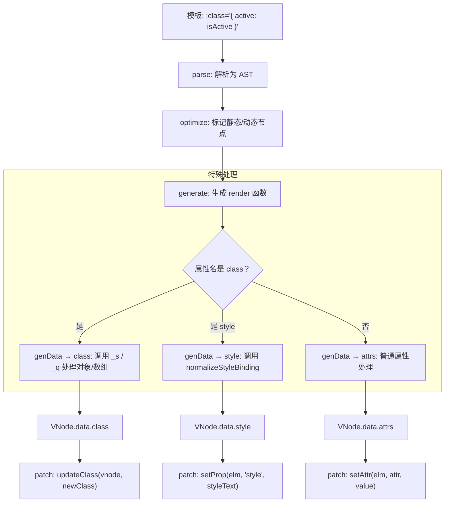

# Class 与 Style 绑定

## 概述

操作元素的 class 列表和内联样式是数据绑定的一个常见需求。虽然它们都是 HTML 属性，可以用 `v-bind` 处理，但如果直接拼接字符串会很麻烦且容易出错。

Vue.js 为 `class` 和 `style` 的 `v-bind` 做了专门的增强。表达式结果的类型除了字符串之外，还可以是**对象**或**数组**，使得动态切换 class 和 style 变得简单直观。

### 核心特性

- **对象语法**：动态切换 class/style 的存在性
- **数组语法**：同时应用多个 class/style
- **自动前缀**：自动为 CSS 属性添加浏览器引擎前缀
- **组件支持**：在自定义组件上同样适用

### 语法对比表

| 绑定类型 | 对象语法 | 数组语法 | 主要用途 |
|---------|---------|---------|---------|
| **Class** | `{ active: isActive }` | `[activeClass, errorClass]` | 条件性添加/移除 class |
| **Style** | `{ color: 'red', fontSize: '14px' }` | `[baseStyles, overridingStyles]` | 动态设置内联样式 |

### 编译原理

Vue 在模板编译阶段对 `class` 和 `style` 进行了特殊处理，使其支持对象/数组语法：



> **源码路径**：`class` 的处理在 `src/platforms/web/runtime/modules/class.js` 的 `genClassForVnode` 中；`style` 的绑定归一化在 `src/platforms/web/util/style.js` 的 `normalizeStyleBinding` 中，应用在 `src/platforms/web/runtime/modules/style.js` 的 `updateStyle` 中。

## 绑定 HTML Class

### 对象语法

可以传给 `v-bind:class` 一个对象，以动态地切换 class：

```html
<template>
  <div>
    <!-- 基础用法：根据条件切换 class -->
    <div v-bind:class="{ active: isActive }">单个 class</div>
    
    <!-- 多个条件 class -->
    <div class="static" v-bind:class="{ active: isActive, 'text-danger': hasError }">
      多个条件 class
    </div>
    
    <!-- 绑定对象 -->
    <div v-bind:class="classObject">对象绑定</div>
    
    <!-- 计算属性 -->
    <div v-bind:class="computedClassObject">计算属性</div>
  </div>
</template>

<script>
export default {
  data() {
    return {
      isActive: true,
      hasError: false,
      classObject: {
        active: true,
        'text-danger': false
      }
    }
  },
  computed: {
    computedClassObject() {
      return {
        active: this.isActive && !this.error,
        'text-danger': this.error && this.error.type === 'fatal'
      }
    }
  }
}
</script>
```

**渲染结果**：

```html
<div class="active">单个 class</div>
<div class="static active">多个条件 class</div>
<div class="active">对象绑定</div>
```

#### 对象语法特点

- 对象中的键是 class 名称
- 对象中的值是条件表达式（truthy 值会添加该 class）
- 可以与普通 class 属性共存
- 可以使用计算属性返回对象

### 数组语法

可以把一个数组传给 `v-bind:class`，以应用一个 class 列表：

```html
<template>
  <div>
    <!-- 基础用法 -->
    <div v-bind:class="[activeClass, errorClass]">数组绑定</div>
    
    <!-- 三元表达式切换 -->
    <div v-bind:class="[isActive ? activeClass : '', errorClass]">
      三元表达式
    </div>
    
    <!-- 数组中使用对象语法 -->
    <div v-bind:class="[{ active: isActive }, errorClass]">
      数组嵌套对象
    </div>
  </div>
</template>

<script>
export default {
  data() {
    return {
      activeClass: 'active',
      errorClass: 'text-danger',
      isActive: true
    }
  }
}
</script>
```

**渲染结果**：

```html
<div class="active text-danger">数组绑定</div>
<div class="active text-danger">三元表达式</div>
<div class="active text-danger">数组嵌套对象</div>
```

#### 数组语法特点

- 数组中的每个元素都会被添加为 class
- 可以使用三元表达式条件性地切换 class
- 可以在数组中使用对象语法，避免复杂的三元表达式

### 用在组件上

当在自定义组件上使用 `class` 属性时，这些 class 将被添加到该组件的**根元素**上。组件根元素上已存在的 class **不会被覆盖**。

```html
<template>
  <div>
    <!-- 普通静态 class -->
    <my-component class="baz boo"></my-component>
    
    <!-- 动态绑定的 class -->
    <my-component v-bind:class="{ active: isActive }"></my-component>
  </div>
</template>

<script>
// 定义组件
Vue.component('my-component', {
  template: '<p class="foo bar">组件内容</p>'
})

export default {
  data() {
    return {
      isActive: true
    }
  }
}
</script>
```

**渲染结果**：

```html
<!-- 静态 class 合并 -->
<p class="foo bar baz boo">组件内容</p>

<!-- 动态 class 合并 -->
<p class="foo bar active">组件内容</p>
```

#### 组件 class 合并的源码规则

```javascript
// src/platforms/web/runtime/modules/class.js（简化）
function genClassForVnode(vnode) {
  let data = vnode.data
  // 1. 获取组件内部模板声明的静态 class（来自 vnode.data.staticClass）
  // 2. 获取组件内部动态 class（来自 vnode.data.class）
  // 3. 获取父组件传入的 class（来自 parentVnode.data.class）
  // 最终合并：concat(staticClass, class, parentClass)
  return renderClass(data.staticClass, data.class)
}

// 合并规则：
// - staticClass（组件内部静态 class）: 始终保留
// - class（组件内部动态 class）: 响应式合并
// - 父组件传入 class: 追加到末尾，不覆盖
// 结果 = [内部静态] + [内部动态] + [外部传入]
```

> **关键**：父组件传入的 class 总是**追加**而非覆盖。这意味着子组件无法阻止父组件添加样式，但父组件也无法移除子组件自身的 class。

#### 组件 class 合并规则

| 场景 | 组件内部 class | 外部传入 class | 最终结果 |
|------|---------------|---------------|---------|
| 静态传入 | `foo bar` | `baz boo` | `foo bar baz boo` |
| 动态绑定 | `foo bar` | `{ active: true }` | `foo bar active` |
| 同时存在 | `foo bar` | `baz { active: true }` | `foo bar baz active` |

### 实际应用场景

#### 场景 1：导航菜单高亮

```html
<template>
  <nav>
    <ul>
      <li 
        v-for="item in menuItems" 
        :key="item.id"
        :class="{ 
          active: currentRoute === item.path,
          disabled: item.disabled 
        }"
        @click="navigate(item)"
      >
        {{ item.text }}
      </li>
    </ul>
  </nav>
</template>

<script>
export default {
  data() {
    return {
      currentRoute: '/home',
      menuItems: [
        { id: 1, text: '首页', path: '/home', disabled: false },
        { id: 2, text: '产品', path: '/products', disabled: false },
        { id: 3, text: '关于', path: '/about', disabled: true }
      ]
    }
  },
  methods: {
    navigate(item) {
      if (!item.disabled) {
        this.currentRoute = item.path
      }
    }
  }
}
</script>

<style>
.active {
  color: #1890ff;
  font-weight: bold;
  border-bottom: 2px solid #1890ff;
}

.disabled {
  color: #ccc;
  cursor: not-allowed;
}
</style>
```

#### 场景 2：表单验证状态

```html
<template>
  <form>
    <div class="form-group">
      <input 
        type="text" 
        v-model="username"
        :class="{
          'is-valid': usernameValid,
          'is-invalid': usernameTouched && !usernameValid
        }"
        @blur="usernameTouched = true"
      >
      <div v-if="usernameTouched && !usernameValid" class="error-message">
        用户名长度必须在 3-20 个字符之间
      </div>
    </div>
  </form>
</template>

<script>
export default {
  data() {
    return {
      username: '',
      usernameTouched: false
    }
  },
  computed: {
    usernameValid() {
      return this.username.length >= 3 && this.username.length <= 20
    }
  }
}
</script>

<style>
.is-valid {
  border-color: #52c41a;
}

.is-invalid {
  border-color: #f5222d;
}

.error-message {
  color: #f5222d;
  font-size: 12px;
}
</style>
```

#### 场景 3：主题切换

```html
<template>
  <div :class="themeClass">
    <div class="container">
      <button @click="toggleTheme">切换主题</button>
      <p>当前主题: {{ theme }}</p>
    </div>
  </div>
</template>

<script>
export default {
  data() {
    return {
      theme: 'light' // 'light' or 'dark'
    }
  },
  computed: {
    themeClass() {
      return {
        'theme-light': this.theme === 'light',
        'theme-dark': this.theme === 'dark'
      }
    }
  },
  methods: {
    toggleTheme() {
      this.theme = this.theme === 'light' ? 'dark' : 'light'
    }
  }
}
</script>

<style>
.theme-light {
  background: #fff;
  color: #333;
}

.theme-dark {
  background: #1a1a1a;
  color: #fff;
}
</style>
```

## 绑定内联样式

### 对象语法

`v-bind:style` 的对象语法非常直观，看起来很像 CSS，但其实是一个 JavaScript 对象。CSS 属性名可以用驼峰式（camelCase）或短横线分隔（kebab-case，需用引号括起来）：

```html
<template>
  <div>
    <!-- 直接使用对象 -->
    <div v-bind:style="{ color: activeColor, fontSize: fontSize + 'px' }">
      直接绑定
    </div>
    
    <!-- 绑定样式对象 -->
    <div v-bind:style="styleObject">对象绑定</div>
    
    <!-- 使用计算属性 -->
    <div v-bind:style="computedStyles">计算属性</div>
    
    <!-- 驼峰式与短横线分隔 -->
    <div v-bind:style="{ 
      backgroundColor: 'red', 
      'font-size': '16px',
      marginTop: '10px'
    }">
      混合命名
    </div>
  </div>
</template>

<script>
export default {
  data() {
    return {
      activeColor: 'red',
      fontSize: 30,
      styleObject: {
        color: 'red',
        fontSize: '13px',
        backgroundColor: '#f0f0f0'
      }
    }
  },
  computed: {
    computedStyles() {
      return {
        color: this.activeColor,
        fontSize: this.fontSize + 'px',
        fontWeight: this.isBold ? 'bold' : 'normal'
      }
    }
  }
}
</script>
```

#### CSS 属性命名规则

| CSS 属性 | 驼峰式（推荐） | 短横线分隔（需引号） |
|---------|--------------|------------------|
| `background-color` | `backgroundColor` | `'background-color'` |
| `font-size` | `fontSize` | `'font-size'` |
| `margin-top` | `marginTop` | `'margin-top'` |
| `z-index` | `zIndex` | `'z-index'` |

**推荐**：使用驼峰式命名，代码更简洁。

### 数组语法

`v-bind:style` 的数组语法可以将多个样式对象应用到同一个元素上：

```html
<template>
  <div>
    <!-- 基础用法 -->
    <div v-bind:style="[baseStyles, overridingStyles]">
      数组绑定
    </div>
    
    <!-- 条件性应用样式 -->
    <div v-bind:style="[baseStyles, isActive ? activeStyles : {}]">
      条件样式
    </div>
    
    <!-- 多个样式对象 -->
    <div v-bind:style="[fontStyles, colorStyles, layoutStyles]">
      多个样式对象
    </div>
  </div>
</template>

<script>
export default {
  data() {
    return {
      baseStyles: {
        color: 'blue',
        fontSize: '14px'
      },
      overridingStyles: {
        color: 'red', // 会覆盖 baseStyles 中的 color
        fontWeight: 'bold'
      },
      isActive: true,
      activeStyles: {
        backgroundColor: 'yellow',
        padding: '10px'
      },
      fontStyles: {
        fontFamily: 'Arial, sans-serif',
        fontSize: '16px'
      },
      colorStyles: {
        color: '#333',
        backgroundColor: '#f5f5f5'
      },
      layoutStyles: {
        padding: '20px',
        margin: '10px 0'
      }
    }
  }
}
</script>
```

**样式覆盖规则**：数组中后面的对象会覆盖前面对象中的同名属性。

### 自动添加前缀

当 `v-bind:style` 使用需要添加浏览器引擎前缀的 CSS 属性时（如 `transform`），Vue.js 会自动侦测并添加相应的前缀：

```html
<template>
  <div v-bind:style="{ transform: rotateValue }">
    自动添加前缀
  </div>
</template>

<script>
export default {
  data() {
    return {
      rotateValue: 'rotate(45deg)'
    }
  }
}
</script>
```

**渲染结果**（根据浏览器自动添加）：

```html
<div style="-webkit-transform: rotate(45deg); transform: rotate(45deg);">
  自动添加前缀
</div>
```

#### 自动添加前缀的 CSS 属性

| CSS 属性 | 可能的前缀 |
|---------|-----------|
| `transform` | `-webkit-`, `-moz-`, `-ms-`, `-o-` |
| `transition` | `-webkit-`, `-moz-`, `-o-` |
| `animation` | `-webkit-`, `-moz-`, `-o-` |
| `flex` | `-webkit-`, `-ms-` |
| `box-shadow` | `-webkit-`, `-moz-` |

### 多重值

从 2.3.0 起，可以为 `style` 绑定中的属性提供一个包含多个值的数组，常用于提供多个带前缀的值：

```html
<template>
  <div v-bind:style="{ display: ['-webkit-box', '-ms-flexbox', 'flex'] }">
    多重值示例
  </div>
</template>
```

**渲染规则**：
- 只会渲染数组中**最后一个被浏览器支持的值**
- 本例中，如果浏览器支持不带前缀的 flexbox，则渲染 `display: flex`
- 如果只支持 `-webkit-box`，则渲染 `display: -webkit-box`

### 实际应用场景

#### 场景 1：动态尺寸调整

```html
<template>
  <div>
    <div 
      class="resizable-box"
      :style="{
        width: width + 'px',
        height: height + 'px',
        backgroundColor: color
      }"
    >
      可调整大小的盒子
    </div>
    
    <div class="controls">
      <label>
        宽度: {{ width }}px
        <input type="range" v-model.number="width" min="100" max="500">
      </label>
      <label>
        高度: {{ height }}px
        <input type="range" v-model.number="height" min="100" max="500">
      </label>
    </div>
  </div>
</template>

<script>
export default {
  data() {
    return {
      width: 200,
      height: 150,
      color: '#1890ff'
    }
  }
}
</script>

<style>
.resizable-box {
  border: 1px solid #ddd;
  display: flex;
  align-items: center;
  justify-content: center;
  transition: all 0.3s;
}
</style>
```

#### 场景 2：进度条

```html
<template>
  <div class="progress-container">
    <div 
      class="progress-bar"
      :style="{
        width: progress + '%',
        backgroundColor: progressColor
      }"
    >
      {{ progress }}%
    </div>
  </div>
  
  <button @click="increase">增加进度</button>
</template>

<script>
export default {
  data() {
    return {
      progress: 30
    }
  },
  computed: {
    progressColor() {
      if (this.progress < 30) return '#ff4d4f'
      if (this.progress < 70) return '#faad14'
      return '#52c41a'
    }
  },
  methods: {
    increase() {
      if (this.progress < 100) {
        this.progress += 10
      }
    }
  }
}
</script>

<style>
.progress-container {
  width: 100%;
  height: 30px;
  background: #f0f0f0;
  border-radius: 4px;
  overflow: hidden;
}

.progress-bar {
  height: 100%;
  display: flex;
  align-items: center;
  justify-content: center;
  color: white;
  transition: width 0.3s ease;
}
</style>
```

#### 场景 3：拖拽定位

```html
<template>
  <div
    class="draggable"
    :style="{ left: position.x + 'px', top: position.y + 'px' }"
    @mousedown="startDrag"
  >拖拽我</div>
</template>
```

> 📖 完整拖拽实现参见：[事件处理 - 拖拽功能](03-事件处理.md#场景-2拖拽功能)

## 最佳实践

### 1. 优先使用对象语法而非三元表达式

```html
<!-- ❌ 不推荐：复杂的三元表达式 -->
<div :class="[isActive ? 'active' : '', hasError ? 'error' : '', isDisabled ? 'disabled' : '']">
  复杂的三元表达式
</div>

<!-- ✅ 推荐：使用对象语法 -->
<div :class="{ active: isActive, error: hasError, disabled: isDisabled }">
  对象语法更清晰
</div>
```

### 2. 使用计算属性组织复杂的 class/style 逻辑

```html
<template>
  <!-- ❌ 不推荐：模板中复杂的逻辑 -->
  <div :class="{
    active: isActive && !isDisabled,
    error: hasError && errorType === 'critical',
    warning: hasError && errorType === 'warning'
  }">
    复杂逻辑
  </div>
  
  <!-- ✅ 推荐：使用计算属性 -->
  <div :class="statusClasses">
    计算属性更清晰
  </div>
</template>

<script>
export default {
  computed: {
    statusClasses() {
      return {
        active: this.isActive && !this.isDisabled,
        error: this.hasError && this.errorType === 'critical',
        warning: this.hasError && this.errorType === 'warning'
      }
    }
  }
}
</script>
```

### 3. 避免在模板中拼接字符串

```html
<!-- ❌ 不推荐：字符串拼接 -->
<div :style="'color: ' + color + '; font-size: ' + fontSize + 'px'">
  字符串拼接
</div>

<!-- ✅ 推荐：使用对象语法 -->
<div :style="{ color: color, fontSize: fontSize + 'px' }">
  对象语法
</div>
```

### 4. 使用数组语法合并多个样式对象

```html
<!-- ❌ 不推荐：重复定义 -->
<div :style="{ 
  color: baseStyle.color, 
  fontSize: baseStyle.fontSize,
  backgroundColor: themeStyle.backgroundColor 
}">
  重复定义
</div>

<!-- ✅ 推荐：使用数组语法 -->
<div :style="[baseStyle, themeStyle]">
  数组合并
</div>
```

### 5. 使用 CSS 类代替内联样式

```html
<!-- ❌ 不推荐：大量内联样式 -->
<div :style="{
  color: 'red',
  fontSize: '14px',
  fontWeight: 'bold',
  lineHeight: '1.5',
  marginTop: '10px',
  marginBottom: '10px'
}">
  内联样式
</div>

<!-- ✅ 推荐：使用 CSS 类 -->
<div class="text-primary text-bold text-spacing">
  CSS 类
</div>
```

### 6. 合理使用短横线分隔的 CSS 属性名

```html
<!-- ✅ 推荐：使用驼峰式 -->
<div :style="{ backgroundColor: 'red', marginTop: '10px' }">
  驼峰式
</div>

<!-- ⚠️ 也可以：使用引号包裹短横线分隔 -->
<div :style="{ 'background-color': 'red', 'margin-top': '10px' }">
  短横线分隔
</div>
```

## 性能优化建议

### 1. 避免频繁更新样式对象

```html
<template>
  <!-- ❌ 不推荐：每次渲染都创建新对象 -->
  <div :style="{ color: activeColor, fontSize: fontSize + 'px' }">
    每次渲染创建新对象
  </div>
  
  <!-- ✅ 推荐：使用计算属性缓存 -->
  <div :style="computedStyle">
    计算属性缓存
  </div>
</template>

<script>
export default {
  computed: {
    computedStyle() {
      return {
        color: this.activeColor,
        fontSize: this.fontSize + 'px'
      }
    }
  }
}
</script>
```

### 2. 使用 CSS 类代替复杂的内联样式

内联样式会触发额外的重排和重绘，对于复杂的样式组合，优先使用 CSS 类：

```html
<!-- ❌ 性能较差 -->
<div :style="{
  width: width + 'px',
  height: height + 'px',
  backgroundColor: bgColor,
  border: '1px solid #ddd',
  borderRadius: '4px',
  boxShadow: '0 2px 8px rgba(0,0,0,0.1)'
}">
  大量内联样式
</div>

<!-- ✅ 性能更好 -->
<div class="card" :style="{ width: width + 'px', height: height + 'px' }">
  最小化内联样式
</div>
```

### 3. 合理使用计算属性

```javascript
export default {
  // ✅ 推荐：计算属性会缓存结果
  computed: {
    buttonClasses() {
      const classes = ['btn']
      if (this.size === 'large') classes.push('btn-lg')
      if (this.type) classes.push(`btn-${this.type}`)
      if (this.disabled) classes.push('btn-disabled')
      return classes
    }
  }
}
```

### 4. 避免在 v-for 中使用内联对象

```html
<template>
  <!-- ❌ 不推荐：每次循环都创建新对象 -->
  <div 
    v-for="item in items" 
    :key="item.id"
    :style="{ color: item.color, fontSize: item.size }"
  >
    {{ item.text }}
  </div>
  
  <!-- ✅ 推荐：使用方法返回样式 -->
  <div 
    v-for="item in items" 
    :key="item.id"
    :style="getItemStyle(item)"
  >
    {{ item.text }}
  </div>
</template>

<script>
export default {
  methods: {
    getItemStyle(item) {
      return {
        color: item.color,
        fontSize: item.size
      }
    }
  }
}
</script>
```

## 常见问题

### Q1: class 和 style 绑定可以同时使用吗？

**A**: 可以。静态 class、动态 class 绑定、静态 style、动态 style 绑定都可以同时使用：

```html
<template>
  <div 
    class="static-class"
    :class="{ active: isActive }"
    style="margin: 10px"
    :style="{ color: textColor }"
  >
    同时使用多种绑定
  </div>
</template>
```

### Q2: 如何绑定带连字符的 class 名？

**A**: 使用引号包裹 class 名：

```html
<template>
  <!-- ✅ 正确：使用引号 -->
  <div :class="{ 'text-danger': hasError, 'btn-primary': isPrimary }">
    带连字符的 class
  </div>
  
  <!-- ❌ 错误：不带引号会导致语法错误 -->
  <div :class="{ text-danger: hasError }">
    语法错误
  </div>
</template>
```

### Q3: 组件上使用 class 会覆盖组件内部的 class 吗？

**A**: 不会。外部传入的 class 会与组件根元素的 class **合并**：

```html
<template>
  <!-- 组件定义 -->
  <my-component class="external-class"></my-component>
</template>

<!-- 组件模板 -->
<template>
  <div class="internal-class">组件内容</div>
</template>

<!-- 渲染结果 -->
<div class="internal-class external-class">组件内容</div>
```

### Q4: 数组语法中如何使用对象语法？

**A**: 在数组中使用对象，可以简化条件 class 的写法：

```html
<template>
  <!-- 使用三元表达式 -->
  <div :class="[isActive ? 'active' : '', hasError ? 'error' : '']">
    三元表达式
  </div>
  
  <!-- 在数组中使用对象，更简洁 -->
  <div :class="[{ active: isActive }, { error: hasError }]">
    数组中使用对象
  </div>
</template>
```

### Q5: style 绑定中的单位需要手动添加吗？

**A**: 是的，数值需要手动添加单位：

```html
<template>
  <!-- ✅ 正确：添加单位 -->
  <div :style="{ fontSize: fontSize + 'px' }">正确</div>
  
  <!-- ❌ 错误：缺少单位 -->
  <div :style="{ fontSize: fontSize }">错误</div>
</template>
```

### Q6: 如何动态绑定多个 class 或 style？

**A**: 使用数组语法或对象展开：

```html
<template>
  <!-- 数组语法 -->
  <div :class="[class1, class2, class3]">数组语法</div>
  
  <!-- 对象展开 -->
  <div :class="{ ...baseClasses, ...dynamicClasses }">对象展开</div>
  
  <!-- 数组合并样式 -->
  <div :style="[style1, style2, style3]">数组合并</div>
</template>
```

### Q7: computed 属性返回的样式对象会缓存吗？

**A**: 会。计算属性基于其依赖进行缓存，只有依赖变化时才会重新计算：

```javascript
export default {
  data() {
    return {
      color: 'red'
    }
  },
  computed: {
    // 只有 color 变化时才会重新计算
    textStyle() {
      console.log('重新计算')
      return { color: this.color }
    }
  }
}
```

### Q8: 如何在 style 中使用 CSS 变量？

**A**: 直接绑定 CSS 变量：

```html
<template>
  <div :style="{ '--main-color': themeColor }">
    <p class="themed-text">使用 CSS 变量</p>
  </div>
</template>

<script>
export default {
  data() {
    return {
      themeColor: '#1890ff'
    }
  }
}
</script>

<style>
.themed-text {
  color: var(--main-color);
}
</style>
```

## 相关内容

- [模板语法](../02-模板与渲染/01-模板语法.md)
- [计算属性和侦听器](01-计算属性.md)
- [条件渲染](../02-模板与渲染/02-条件渲染.md)
- [列表渲染](../02-模板与渲染/03-列表渲染.md)

---
