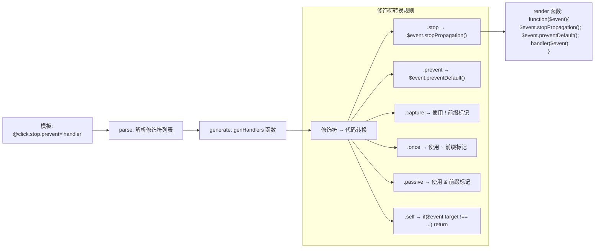
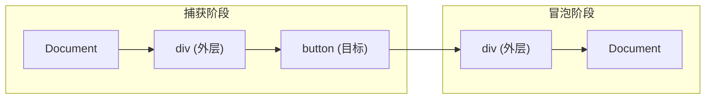
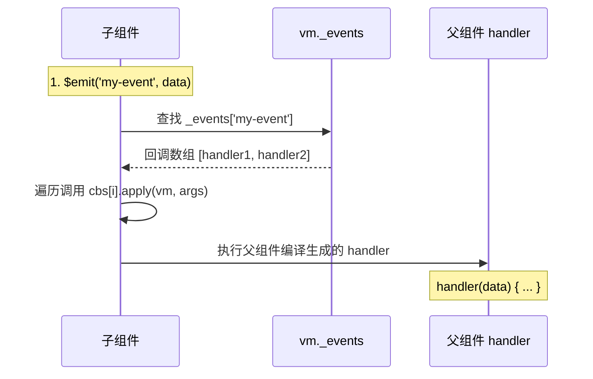

# 事件处理

## 概述

事件处理是前端开发的核心内容之一。Vue.js 提供了 `v-on` 指令（简写为 `@`）用于监听 DOM 事件，并在触发时执行相应的 JavaScript 代码或方法。

### 核心概念

- **事件监听**：使用 `v-on` 指令监听 DOM 事件
- **事件处理**：执行内联语句或调用方法
- **事件修饰符**：简化常见的事件处理操作
- **按键修饰符**：处理键盘事件
- **系统修饰键**：组合键处理

### 事件处理方式对比

| 方式 | 语法 | 特点 | 适用场景 |
|------|------|------|---------|
| **内联语句** | `@click="counter += 1"` | 简单直接 | 简单逻辑，单行代码 |
| **方法绑定** | `@click="handleClick"` | 逻辑清晰 | 复杂逻辑，需要复用 |
| **内联调用** | `@click="handleClick(arg)"` | 可传参 | 需要传递参数 |

### v-on 指令速查表

```html
<!-- 完整语法 -->
<button v-on:click="handleClick">点击</button>

<!-- 简写语法（推荐） -->
<button @click="handleClick">点击</button>

<!-- 动态事件名 (2.6.0+) -->
<button @[event]="handleClick">动态事件</button>

<!-- 带修饰符 -->
<form @submit.prevent="onSubmit">提交</form>

<!-- 带参数 -->
<button @click="handleClick(item)">点击</button>

<!-- 访问原生事件 -->
<button @click="handleClick($event)">点击</button>
```

## 监听事件

### 内联语句处理

用 `v-on` 指令监听 DOM 事件，并在触发时运行一些 JavaScript 代码：

```html
<template>
  <div>
    <button @click="counter += 1">加 1</button>
    <p>按钮被点击了 {{ counter }} 次</p>
  </div>
</template>

<script>
export default {
  data() {
    return {
      counter: 0
    }
  }
}
</script>
```

**适用场景**：
- 非常简单的逻辑
- 只需要修改数据
- 不需要访问事件对象

### 方法绑定

许多事件处理逻辑会更为复杂，直接把 JavaScript 代码写在 `v-on` 指令中是不可行的。因此 `v-on` 还可以接收一个需要调用的方法名称：

```html
<template>
  <div>
    <button @click="greet">问候</button>
    <p>{{ message }}</p>
  </div>
</template>

<script>
export default {
  data() {
    return {
      name: 'Vue.js',
      message: ''
    }
  },
  methods: {
    greet(event) {
      // this 在方法里指向当前 Vue 实例
      this.message = 'Hello ' + this.name + '!'
      
      // event 是原生 DOM 事件
      if (event) {
        console.log('事件目标:', event.target.tagName)
      }
    }
  }
}
</script>
```

### 在内联语句中调用方法

除了直接绑定到一个方法，也可以在内联 JavaScript 语句中调用方法：

```html
<template>
  <div>
    <button @click="say('hi')">说 hi</button>
    <button @click="say('what')">说 what</button>
    <p>{{ message }}</p>
  </div>
</template>

<script>
export default {
  data() {
    return {
      message: ''
    }
  },
  methods: {
    say(message) {
      this.message = message
    }
  }
}
</script>
```

### 访问原生事件对象

需要在内联语句处理器中访问原始的 DOM 事件时，可以用特殊变量 `$event` 把它传入方法：

```html
<template>
  <div>
    <button @click="warn('表单还不能提交。', $event)">提交</button>
  </div>
</template>

<script>
export default {
  methods: {
    warn(message, event) {
      // 访问原生事件对象
      if (event) {
        event.preventDefault()
        console.log('事件类型:', event.type)
        console.log('事件目标:', event.target)
      }
      alert(message)
    }
  }
}
</script>
```

### 多个参数传递

```html
<template>
  <div>
    <button @click="handleClick(item, index, $event)">
      点击第 {{ index }} 项
    </button>
  </div>
</template>

<script>
export default {
  data() {
    return {
      item: { id: 1, name: '测试' },
      index: 0
    }
  },
  methods: {
    handleClick(item, index, event) {
      console.log('数据:', item)
      console.log('索引:', index)
      console.log('事件:', event)
    }
  }
}
</script>
```

## 事件对象详解

### 事件对象属性

当事件处理函数被调用时，会自动接收原生 DOM 事件对象作为参数：

```html
<template>
  <div @click="handleClick">
    <button>点击我</button>
  </div>
</template>

<script>
export default {
  methods: {
    handleClick(event) {
      // 常用属性
      console.log('事件类型:', event.type)         // click
      console.log('触发元素:', event.target)       // button 元素
      console.log('绑定元素:', event.currentTarget) // div 元素
      console.log('时间戳:', event.timeStamp)     // 事件发生的时间
      
      // 鼠标事件
      console.log('鼠标位置:', event.clientX, event.clientY) // 相对于视口
      console.log('鼠标按键:', event.button)      // 0-左键, 1-中键, 2-右键
      
      // 键盘事件
      console.log('按键值:', event.key)           // Enter, Escape 等
      console.log('按键码:', event.keyCode)       // 13, 27 等（已废弃）
      console.log('修饰键:', {
        ctrl: event.ctrlKey,
        shift: event.shiftKey,
        alt: event.altKey,
        meta: event.metaKey
      })
    }
  }
}
</script>
```

### 常用事件方法

```html
<template>
  <div>
    <form @submit="handleSubmit">
      <input type="text" v-model="inputValue">
      <button type="submit">提交</button>
    </form>
    
    <div @click="handleDivClick">
      <button @click="handleButtonClick">点击按钮</button>
    </div>
  </div>
</template>

<script>
export default {
  methods: {
    handleSubmit(event) {
      // 阻止表单默认提交行为
      event.preventDefault()
      console.log('表单数据:', this.inputValue)
    },
    
    handleButtonClick(event) {
      // 阻止事件冒泡
      event.stopPropagation()
      console.log('按钮被点击')
    },
    
    handleDivClick(event) {
      console.log('div 被点击')
    }
  }
}
</script>
```

## 事件修饰符

### 修饰符概述

在事件处理程序中调用 `event.preventDefault()` 或 `event.stopPropagation()` 是非常常见的需求。尽管可以在方法中轻松实现这点，但更好的方式是：方法只有纯粹的数据逻辑，而不是去处理 DOM 事件细节。

Vue.js 为 `v-on` 提供了**事件修饰符**来解决这个问题：

### 修饰符编译原理

修饰符在模板编译阶段被转换为 JavaScript 代码字符串，而非在运行时处理：



**关键源码（简化）：**

```javascript
// src/compiler/codegen/events.js
const modifierCode = {
  stop: '$event.stopPropagation();',
  prevent: '$event.preventDefault();',
  self: 'if($event.target !== $event.currentTarget)return;',
  ctrl: 'if(!$event.ctrlKey)return;',
  shift: 'if(!$event.shiftKey)return;',
  alt: 'if(!$event.altKey)return;',
  meta: 'if(!$event.metaKey)return;',
  left: 'if(\'button\' in $event && $event.button !== 0)return;',
  middle: 'if(\'button\' in $event && $event.button !== 1)return;',
  right: 'if(\'button\' in $event && $event.button !== 2)return;'
}

// 修饰符最终被拼接成 handler 函数的前置代码
// genHandler 函数根据修饰符列表生成包装函数：
// .stop.prevent → 生成 function($event) { $event.stopPropagation(); $event.preventDefault(); return handler.apply(null, arguments) }
// .capture/once/passive → 通过事件名称前缀（!, ~, &）标记，在 addEventListener 时处理
```

### 事件修饰符列表

| 修饰符 | 说明 | 原生方法 |
|--------|------|---------|
| `.stop` | 阻止事件冒泡 | `event.stopPropagation()` |
| `.prevent` | 阻止默认行为 | `event.preventDefault()` |
| `.capture` | 使用事件捕获模式 | `addEventListener(event, fn, true)` |
| `.self` | 只当事件在该元素本身触发 | `event.target === event.currentTarget` |
| `.once` | 事件只触发一次 | 移除监听器 |
| `.passive` | 提升移动端滚动性能 | `{ passive: true }` |
| `.native` | 监听组件根元素的原生事件 | - |

### .stop - 阻止事件冒泡

```html
<template>
  <div>
    <div @click="handleDivClick" class="outer">
      <button @click.stop="handleButtonClick" class="inner">
        点击按钮（不会触发 div 的点击事件）
      </button>
    </div>
  </div>
</template>

<script>
export default {
  methods: {
    handleDivClick() {
      console.log('div 点击')
    },
    handleButtonClick() {
      console.log('button 点击')
      // 不需要手动调用 event.stopPropagation()
    }
  }
}
</script>

<style>
.outer {
  padding: 20px;
  background: #f0f0f0;
}
.inner {
  padding: 10px;
}
</style>
```

### .prevent - 阻止默认行为

```html
<template>
  <div>
    <!-- 阻止表单默认提交 -->
    <form @submit.prevent="onSubmit">
      <input v-model="formData" placeholder="输入内容">
      <button type="submit">提交</button>
    </form>
    
    <!-- 阻止链接默认跳转 -->
    <a href="https://vuejs.org" @click.prevent="handleClick">
      点击链接（不会跳转）
    </a>
  </div>
</template>

<script>
export default {
  data() {
    return {
      formData: ''
    }
  },
  methods: {
    onSubmit() {
      console.log('表单数据:', this.formData)
      // 处理表单提交逻辑
    },
    handleClick() {
      console.log('链接被点击')
    }
  }
}
</script>
```

### .capture - 使用事件捕获模式

```html
<template>
  <div>
    <!-- 事件捕获：从外向内触发 -->
    <div @click.capture="handleDivClick" class="outer">
      <button @click="handleButtonClick" class="inner">
        点击按钮
      </button>
    </div>
    <!-- 执行顺序：handleDivClick -> handleButtonClick -->
  </div>
</template>

<script>
export default {
  methods: {
    handleDivClick() {
      console.log('div 捕获阶段触发')
    },
    handleButtonClick() {
      console.log('button 触发')
    }
  }
}
</script>
```

**事件传播流程**：



> `.capture` 修饰符使监听器在**捕获阶段**触发（从外向内）；默认在**冒泡阶段**触发（从内向外）。

### .self - 只当事件在该元素本身触发

```html
<template>
  <div>
    <div @click.self="handleDivClick" class="outer">
      <button @click="handleButtonClick" class="inner">
        点击按钮（不会触发 div 的点击事件）
      </button>
      <p>点击这段文字（不会触发 div 的点击事件）</p>
    </div>
  </div>
</template>

<script>
export default {
  methods: {
    handleDivClick() {
      // 只有直接点击 div 本身才会触发
      console.log('div 本身被点击')
    },
    handleButtonClick() {
      console.log('button 被点击')
    }
  }
}
</script>
```

### .once - 事件只触发一次

```html
<template>
  <div>
    <button @click.once="handleClick">
      只能点击一次
    </button>
    
    <!-- .once 也可以用于自定义组件事件 -->
    <my-component @custom-event.once="handleCustomEvent" />
  </div>
</template>

<script>
export default {
  methods: {
    handleClick() {
      console.log('按钮被点击')
      // 只会触发一次，之后点击无效
    },
    handleCustomEvent() {
      console.log('自定义事件触发')
    }
  }
}
</script>
```

### .passive - 提升移动端性能

```html
<template>
  <div>
    <!-- 滚动事件的默认行为会立即触发，不等待 onScroll 完成 -->
    <div @scroll.passive="onScroll" class="scroll-container">
      <div class="content">大量内容...</div>
    </div>
  </div>
</template>

<script>
export default {
  methods: {
    onScroll(event) {
      // 即使这里调用 event.preventDefault() 也不会阻止滚动
      console.log('滚动位置:', event.target.scrollTop)
    }
  }
}
</script>
```

::: warning 注意
不要把 `.passive` 和 `.prevent` 一起使用，因为 `.prevent` 将会被忽略。`.passive` 会告诉浏览器你不想阻止事件的默认行为。
:::

### 修饰符串联

修饰符可以串联使用：

```html
<template>
  <div>
    <!-- 修饰符串联 -->
    <a @click.stop.prevent="doThat">阻止冒泡并阻止默认行为</a>
    
    <!-- 只有修饰符 -->
    <form @submit.prevent>
      <button type="submit">提交（阻止默认行为）</button>
    </form>
    
    <!-- 修饰符顺序很重要 -->
    <div @click.prevent.self="doThis">阻止所有点击的默认行为</div>
    <div @click.self.prevent="doThis">只阻止元素自身点击的默认行为</div>
  </div>
</template>
```

**修饰符顺序规则**：
- 修饰符按从左到右的顺序执行
- `.stop.prevent`：先阻止冒泡，再阻止默认行为
- `.prevent.stop`：先阻止默认行为，再阻止冒泡

## 按键修饰符

### 基本用法

在监听键盘事件时，经常需要检查详细的按键。Vue 允许为 `v-on` 在监听键盘事件时添加按键修饰符：

```html
<template>
  <div>
    <!-- 只有按回车键时才触发 -->
    <input 
      v-model="message" 
      @keyup.enter="submit"
      placeholder="按回车提交"
    >
    
    <!-- 监听特定按键 -->
    <input 
      @keyup.page-down="onPageDown"
      placeholder="按 PageDown"
    >
    
    <!-- 任意有效按键名 -->
    <input 
      @keyup.escape="cancel"
      placeholder="按 Escape 取消"
    >
  </div>
</template>

<script>
export default {
  data() {
    return {
      message: ''
    }
  },
  methods: {
    submit() {
      console.log('提交:', this.message)
    },
    onPageDown() {
      console.log('PageDown 按键')
    },
    cancel() {
      this.message = ''
      console.log('已取消')
    }
  }
}
</script>
```

### 按键别名

Vue 为最常用的按键提供了别名：

| 别名 | 按键 | Key 值 |
|------|------|--------|
| `.enter` | 回车键 | Enter |
| `.tab` | Tab 键 | Tab |
| `.delete` | 删除/退格键 | Backspace, Delete |
| `.esc` | Escape 键 | Escape |
| `.space` | 空格键 | Space |
| `.up` | 上方向键 | ArrowUp |
| `.down` | 下方向键 | ArrowDown |
| `.left` | 左方向键 | ArrowLeft |
| `.right` | 右方向键 | ArrowRight |

### 按键码（已废弃）

`keyCode` 的事件用法已被废弃，不建议使用：

```html
<!-- ❌ 不推荐：使用 keyCode -->
<input @keyup.13="submit">

<!-- ✅ 推荐：使用按键别名 -->
<input @keyup.enter="submit">
```

### 自定义按键别名

可以通过全局 `config.keyCodes` 对象自定义按键修饰符别名：

```javascript
// 在 main.js 中配置
import Vue from 'vue'

Vue.config.keyCodes = {
  // 自定义 v-on:keyup.f1
  f1: 112,
  
  // 自定义 v-on:keyup.media-play-pause
  'media-play-pause': 179,
  
  // 多个按键码
  up: [38, 87]  // 上方向键或 W 键
}
```

```html
<template>
  <input @keyup.f1="help" placeholder="按 F1 获取帮助">
</template>
```

### 完整示例：搜索框

```html
<template>
  <div class="search-box">
    <input 
      v-model="searchQuery"
      @keyup.enter="search"
      @keyup.escape="clearSearch"
      @keyup.up="selectPrevious"
      @keyup.down="selectNext"
      placeholder="搜索（回车提交，Esc 清空）"
    >
    <button @click="search">搜索</button>
    
    <ul v-if="results.length" class="results">
      <li 
        v-for="(result, index) in results" 
        :key="result.id"
        :class="{ active: index === selectedIndex }"
      >
        {{ result.name }}
      </li>
    </ul>
  </div>
</template>

<script>
export default {
  data() {
    return {
      searchQuery: '',
      results: [],
      selectedIndex: -1
    }
  },
  methods: {
    search() {
      console.log('搜索:', this.searchQuery)
      // 模拟搜索结果
      this.results = [
        { id: 1, name: '结果 1' },
        { id: 2, name: '结果 2' },
        { id: 3, name: '结果 3' }
      ]
    },
    clearSearch() {
      this.searchQuery = ''
      this.results = []
      this.selectedIndex = -1
    },
    selectPrevious() {
      if (this.selectedIndex > 0) {
        this.selectedIndex--
      }
    },
    selectNext() {
      if (this.selectedIndex < this.results.length - 1) {
        this.selectedIndex++
      }
    }
  }
}
</script>

<style scoped>
.search-box {
  position: relative;
}

.results {
  list-style: none;
  padding: 0;
  margin-top: 5px;
  border: 1px solid #ddd;
}

.results li {
  padding: 10px;
  cursor: pointer;
}

.results li.active {
  background: #1890ff;
  color: white;
}
</style>
```

## 系统修饰键

### 基本用法

可以用如下修饰符来实现仅在按下相应按键时才触发鼠标或键盘事件的监听器：

| 修饰符 | Mac | Windows |
|--------|-----|---------|
| `.ctrl` | Control 键 | Ctrl 键 |
| `.alt` | Option 键 | Alt 键 |
| `.shift` | Shift 键 | Shift 键 |
| `.meta` | Command 键 (⌘) | Windows 徽标键 (⊞) |

```html
<template>
  <div>
    <!-- Ctrl + 回车 -->
    <input 
      @keyup.ctrl.enter="submit"
      placeholder="Ctrl + Enter 提交"
    >
    
    <!-- Alt + C -->
    <input 
      @keyup.alt.67="clear"
      placeholder="Alt + C 清空"
    >
    
    <!-- Ctrl + 点击 -->
    <div 
      @click.ctrl="doSomething"
      class="clickable"
    >
      Ctrl + 点击我
    </div>
    
    <!-- Shift + 点击 -->
    <button @click.shift="handleShiftClick">
      Shift + 点击
    </button>
  </div>
</template>

<script>
export default {
  methods: {
    submit() {
      console.log('Ctrl + Enter 提交')
    },
    clear() {
      console.log('Alt + C 清空')
    },
    doSomething() {
      console.log('Ctrl + 点击')
    },
    handleShiftClick() {
      console.log('Shift + 点击')
    }
  }
}
</script>
```

### 修饰键与 keyup 的注意事项

修饰键与常规按键不同，在和 `keyup` 事件一起用时，事件触发时修饰键必须处于按下状态：

```html
<template>
  <div>
    <!-- ✅ 正确：按住 Ctrl 释放其他键时触发 -->
    <input @keyup.ctrl="handleCtrlKeyUp" placeholder="按住 Ctrl 释放其他键">
    
    <!-- ❌ 错误：单单释放 Ctrl 不会触发 -->
    <input @keyup.ctrl="handleCtrlKeyUp" placeholder="仅释放 Ctrl 不会触发">
    
    <!-- ✅ 如果想要仅释放 Ctrl 就触发，使用 keyCode -->
    <input @keyup.17="handleCtrlRelease" placeholder="释放 Ctrl 触发">
  </div>
</template>

<script>
export default {
  methods: {
    handleCtrlKeyUp(event) {
      // 只有按住 Ctrl 释放其他键才会触发
      console.log('Ctrl + 某个键释放')
    },
    handleCtrlRelease() {
      console.log('Ctrl 键释放')
    }
  }
}
</script>
```

### .exact 修饰符

`.exact` 修饰符允许控制由精确的系统修饰符组合触发的事件：

```html
<template>
  <div>
    <!-- 即使 Alt 或 Shift 被一同按下时也会触发 -->
    <button @click.ctrl="onClick">Ctrl 或 Ctrl+其他键</button>
    
    <!-- 有且只有 Ctrl 被按下的时候才触发 -->
    <button @click.ctrl.exact="onCtrlClick">仅 Ctrl</button>
    
    <!-- 没有任何系统修饰符被按下的时候才触发 -->
    <button @click.exact="onClick">无修饰键</button>
    
    <!-- 精确组合：Ctrl + Shift -->
    <button @click.ctrl.shift.exact="onCtrlShiftClick">Ctrl + Shift</button>
  </div>
</template>

<script>
export default {
  methods: {
    onClick() {
      console.log('普通点击')
    },
    onCtrlClick() {
      console.log('仅 Ctrl 点击')
    },
    onCtrlShiftClick() {
      console.log('Ctrl + Shift 点击')
    }
  }
}
</script>
```

### 组合键完整示例

```html
<template>
  <!-- 按键组合要挂在键盘事件上：click 事件没有 key/keyCode，按键修饰符永远不会匹配 -->
  <div
    class="shortcut-demo"
    tabindex="0"
    @keydown.ctrl.s.prevent="save"
    @keydown.ctrl.a.exact.prevent="selectAll"
    @keydown.ctrl.c="copy"
    @keydown.ctrl.v="paste"
    @keydown.ctrl.z="undo"
  >
    <h3>快捷键演示（点击区域获得焦点，再按组合键）</h3>

    <div class="shortcut-list">
      <div class="shortcut-item">
        <span>保存：</span>
        <button @click="save">Ctrl + S</button>
      </div>

      <div class="shortcut-item">
        <span>全选：</span>
        <button @click="selectAll">Ctrl + A</button>
      </div>

      <div class="shortcut-item">
        <span>复制：</span>
        <button @click="copy">Ctrl + C</button>
      </div>

      <div class="shortcut-item">
        <span>粘贴：</span>
        <button @click="paste">Ctrl + V</button>
      </div>

      <div class="shortcut-item">
        <span>撤销：</span>
        <button @click="undo">Ctrl + Z</button>
      </div>
    </div>
    
    <div class="log">
      <p v-for="(log, index) in logs" :key="index">{{ log }}</p>
    </div>
  </div>
</template>

<script>
export default {
  data() {
    return {
      logs: []
    }
  },
  methods: {
    save() {
      this.addLog('保存操作')
    },
    selectAll() {
      this.addLog('全选操作')
    },
    copy() {
      this.addLog('复制操作')
    },
    paste() {
      this.addLog('粘贴操作')
    },
    undo() {
      this.addLog('撤销操作')
    },
    addLog(message) {
      const time = new Date().toLocaleTimeString()
      this.logs.unshift(`[${time}] ${message}`)
    }
  }
}
</script>

<style scoped>
.shortcut-demo {
  padding: 20px;
  border: 1px solid #ddd;
  border-radius: 4px;
}

.shortcut-item {
  margin: 10px 0;
}

.shortcut-item button {
  margin-left: 10px;
  padding: 5px 15px;
}

.log {
  margin-top: 20px;
  padding: 10px;
  background: #f5f5f5;
  border-radius: 4px;
  max-height: 200px;
  overflow-y: auto;
}
</style>
```

## 鼠标按钮修饰符

这些修饰符会限制处理函数仅响应特定的鼠标按钮：

| 修饰符 | 按键 | button 值 |
|--------|------|-----------|
| `.left` | 左键 | 0 |
| `.right` | 右键 | 2 |
| `.middle` | 中键（滚轮） | 1 |

```html
<template>
  <div>
    <!-- 只响应左键 -->
    <button @click.left="handleLeftClick">左键点击</button>
    
    <!-- 只响应右键 -->
    <button @click.right="handleRightClick">右键点击</button>
    
    <!-- 只响应中键 -->
    <button @click.middle="handleMiddleClick">中键点击</button>
    
    <!-- 阻止右键菜单 -->
    <div @contextmenu.prevent="showCustomMenu">
      右键显示自定义菜单
    </div>
  </div>
</template>

<script>
export default {
  methods: {
    handleLeftClick() {
      console.log('左键点击')
    },
    handleRightClick() {
      console.log('右键点击')
    },
    handleMiddleClick() {
      console.log('中键点击')
    },
    showCustomMenu() {
      console.log('显示自定义菜单')
    }
  }
}
</script>
```

### 右键菜单示例

```html
<template>
  <div>
    <div 
      @contextmenu.prevent="showMenu"
      class="context-area"
    >
      右键点击显示菜单
    </div>
    
    <div 
      v-show="menuVisible"
      :style="{ left: menuX + 'px', top: menuY + 'px' }"
      class="context-menu"
    >
      <div @click="handleAction('copy')">复制</div>
      <div @click="handleAction('paste')">粘贴</div>
      <div @click="handleAction('delete')">删除</div>
    </div>
  </div>
</template>

<script>
export default {
  data() {
    return {
      menuVisible: false,
      menuX: 0,
      menuY: 0
    }
  },
  methods: {
    showMenu(event) {
      this.menuX = event.clientX
      this.menuY = event.clientY
      this.menuVisible = true
    },
    handleAction(action) {
      console.log('执行操作:', action)
      this.menuVisible = false
    }
  },
  mounted() {
    // 点击其他地方关闭菜单
    this.onDocClick = () => {
      this.menuVisible = false
    }
    document.addEventListener('click', this.onDocClick)
  },
  beforeDestroy() {
    // ✅ 及时移除事件监听器
    document.removeEventListener('click', this.onDocClick)
  }
}
</script>

<style scoped>
.context-area {
  width: 100%;
  height: 200px;
  background: #f0f0f0;
  display: flex;
  align-items: center;
  justify-content: center;
  cursor: context-menu;
}

.context-menu {
  position: fixed;
  background: white;
  border: 1px solid #ddd;
  border-radius: 4px;
  box-shadow: 0 2px 8px rgba(0, 0, 0, 0.15);
  z-index: 1000;
}

.context-menu div {
  padding: 8px 16px;
  cursor: pointer;
}

.context-menu div:hover {
  background: #f5f5f5;
}
</style>
```

## 实际应用场景

### 场景 1：表单验证与提交

```html
<template>
  <form @submit.prevent="handleSubmit" class="form">
    <div class="form-item">
      <label>用户名：</label>
      <input 
        v-model="form.username"
        @blur="validateUsername"
        @input="clearError('username')"
        placeholder="请输入用户名"
      >
      <span v-if="errors.username" class="error">{{ errors.username }}</span>
    </div>
    
    <div class="form-item">
      <label>密码：</label>
      <input 
        v-model="form.password"
        type="password"
        @blur="validatePassword"
        @input="clearError('password')"
        @keyup.enter="handleSubmit"
        placeholder="请输入密码"
      >
      <span v-if="errors.password" class="error">{{ errors.password }}</span>
    </div>
    
    <div class="form-actions">
      <button type="submit" :disabled="!isValid">提交</button>
      <button type="button" @click="resetForm">重置</button>
    </div>
  </form>
</template>

<script>
export default {
  data() {
    return {
      form: {
        username: '',
        password: ''
      },
      errors: {}
    }
  },
  computed: {
    isValid() {
      return this.form.username && this.form.password && 
             Object.keys(this.errors).length === 0
    }
  },
  methods: {
    validateUsername() {
      if (!this.form.username) {
        this.$set(this.errors, 'username', '用户名不能为空')
      } else if (this.form.username.length < 3) {
        this.$set(this.errors, 'username', '用户名至少 3 个字符')
      }
    },
    validatePassword() {
      if (!this.form.password) {
        this.$set(this.errors, 'password', '密码不能为空')
      } else if (this.form.password.length < 6) {
        this.$set(this.errors, 'password', '密码至少 6 个字符')
      }
    },
    clearError(field) {
      this.$delete(this.errors, field)
    },
    handleSubmit() {
      this.validateUsername()
      this.validatePassword()
      
      if (this.isValid) {
        console.log('提交表单:', this.form)
      }
    },
    resetForm() {
      this.form = { username: '', password: '' }
      this.errors = {}
    }
  }
}
</script>

<style scoped>
.form {
  max-width: 400px;
}

.form-item {
  margin-bottom: 15px;
}

.form-item label {
  display: block;
  margin-bottom: 5px;
}

.form-item input {
  width: 100%;
  padding: 8px;
  border: 1px solid #ddd;
  border-radius: 4px;
}

.error {
  color: #f5222d;
  font-size: 12px;
}

.form-actions button {
  margin-right: 10px;
  padding: 8px 16px;
}
</style>
```

### 场景 2：拖拽功能

> 📖 拖拽定位的完整实现参见：[Class 与 Style 绑定 - 拖拽定位](02-样式绑定.md#场景-3拖拽定位)

### 场景 3：无限滚动加载

```html
<template>
  <div class="scroll-container" @scroll="handleScroll">
    <div v-for="item in items" :key="item.id" class="item">
      {{ item.title }}
    </div>
    <div v-if="loading" class="loading">加载中...</div>
    <div v-if="noMore" class="no-more">没有更多了</div>
  </div>
</template>

<script>
export default {
  data() {
    return {
      items: [],
      page: 1,
      loading: false,
      noMore: false
    }
  },
  mounted() {
    this.loadItems()
  },
  methods: {
    handleScroll(event) {
      const { scrollTop, scrollHeight, clientHeight } = event.target
      
      // 距离底部 100px 时开始加载
      if (scrollHeight - scrollTop - clientHeight < 100 && 
          !this.loading && !this.noMore) {
        this.loadItems()
      }
    },
    async loadItems() {
      if (this.loading || this.noMore) return
      
      this.loading = true
      
      // 模拟 API 请求
      await new Promise(resolve => setTimeout(resolve, 500))
      
      const newItems = Array.from({ length: 10 }, (_, i) => ({
        id: this.items.length + i + 1,
        title: `项目 ${this.items.length + i + 1}`
      }))
      
      if (newItems.length === 0) {
        this.noMore = true
      } else {
        this.items.push(...newItems)
        this.page++
      }
      
      this.loading = false
    }
  }
}
</script>

<style scoped>
.scroll-container {
  height: 400px;
  overflow-y: auto;
  border: 1px solid #ddd;
  border-radius: 4px;
}

.item {
  padding: 15px;
  border-bottom: 1px solid #f0f0f0;
}

.loading, .no-more {
  padding: 20px;
  text-align: center;
  color: #999;
}
</style>
```

## 最佳实践

### 1. 方法只处理业务逻辑

```html
<template>
  <!-- ❌ 不推荐：方法中处理 DOM 细节 -->
  <form @submit="handleSubmit">
    <button type="submit">提交</button>
  </form>
  
  <!-- ✅ 推荐：使用修饰符处理 DOM 细节 -->
  <form @submit.prevent="handleSubmit">
    <button type="submit">提交</button>
  </form>
</template>

<script>
export default {
  methods: {
    handleSubmit() {
      // 只关注业务逻辑
      console.log('提交表单')
    }
  }
}
</script>
```

### 2. 合理使用内联语句

```html
<template>
  <!-- ✅ 简单逻辑：使用内联语句 -->
  <button @click="count++">{{ count }}</button>
  
  <!-- ✅ 复杂逻辑：使用方法 -->
  <button @click="handleClick">复杂操作</button>
  
  <!-- ✅ 需要传参：内联调用方法 -->
  <button @click="handleClick(item.id)">点击</button>
</template>
```

### 3. 使用事件委托

```html
<template>
  <!-- ❌ 不推荐：为每个元素绑定事件 -->
  <ul>
    <li v-for="item in items" :key="item.id" @click="handleClick(item)">
      {{ item.name }}
    </li>
  </ul>
  
  <!-- ✅ 推荐：使用事件委托 -->
  <ul @click="handleClick">
    <li v-for="item in items" :key="item.id" :data-id="item.id">
      {{ item.name }}
    </li>
  </ul>
</template>

<script>
export default {
  methods: {
    handleClick(event) {
      const id = event.target.dataset.id
      if (id) {
        console.log('点击项目:', id)
      }
    }
  }
}
</script>
```

### 4. 及时清理事件监听器

```html
<script>
export default {
  methods: {
    handleResize() {
      console.log('窗口大小改变')
    }
  },
  mounted() {
    window.addEventListener('resize', this.handleResize)
  },
  beforeDestroy() {
    // ✅ 及时移除事件监听器
    window.removeEventListener('resize', this.handleResize)
  }
}
</script>
```

### 5. 使用 .native 监听组件原生事件

```html
<template>
  <!-- ❌ 不推荐：无法监听到原生事件 -->
  <my-component @click="handleClick"></my-component>
  
  <!-- ✅ 推荐：使用 .native 修饰符 -->
  <my-component @click.native="handleClick"></my-component>
</template>
```

### 6. 避免在模板中写复杂表达式

```html
<template>
  <!-- ❌ 不推荐：复杂表达式 -->
  <button @click="items.filter(i => i.active).map(i => i.id).forEach(id => console.log(id))">
    复杂操作
  </button>
  
  <!-- ✅ 推荐：使用方法 -->
  <button @click="logActiveItemIds">
    复杂操作
  </button>
</template>

<script>
export default {
  methods: {
    logActiveItemIds() {
      this.items
        .filter(i => i.active)
        .map(i => i.id)
        .forEach(id => console.log(id))
    }
  }
}
</script>
```

## 性能优化建议

### 1. 使用 .passive 提升滚动性能

```html
<template>
  <!-- ✅ 使用 .passive 提升移动端滚动性能 -->
  <div @scroll.passive="onScroll">
    大量内容...
  </div>
</template>
```

### 2. 使用 .once 避免重复监听

```html
<template>
  <!-- ✅ 事件只需要触发一次 -->
  <button @click.once="initData">初始化</button>
</template>
```

### 3. 避免频繁触发的事件处理

```html
<template>
  <div>
    <!-- ❌ 频繁触发 -->
    <input @input="search">
    
    <!-- ✅ 使用防抖 -->
    <input @input="debouncedSearch">
  </div>
</template>

<script>
export default {
  data() {
    return {
      searchQuery: ''
    }
  },
  created() {
    this.debouncedSearch = this.debounce(this.search, 300)
  },
  methods: {
    search(event) {
      console.log('搜索:', event.target.value)
    },
    debounce(fn, delay) {
      let timer
      return function(...args) {
        clearTimeout(timer)
        timer = setTimeout(() => fn.apply(this, args), delay)
      }
    }
  }
}
</script>
```

### 4. 使用事件委托减少监听器数量

```html
<template>
  <!-- ✅ 使用事件委托 -->
  <table @click="handleTableClick">
    <tr v-for="row in rows" :key="row.id">
      <td :data-row="row.id" :data-action="edit">编辑</td>
      <td :data-row="row.id" :data-action="delete">删除</td>
    </tr>
  </table>
</template>
```

### 5. 合理使用 .self 修饰符

```html
<template>
  <!-- ✅ 只响应元素自身的事件 -->
  <div @click.self="handleClick" class="container">
    <button>内部按钮</button>
  </div>
</template>
```

## 常见问题

### Q1: 如何在事件处理函数中访问组件实例？

**A**: 在 methods 中定义的方法，`this` 自动绑定到组件实例：

```html
<script>
export default {
  data() {
    return {
      count: 0
    }
  },
  methods: {
    increment() {
      this.count++  // this 指向组件实例
    }
  }
}
</script>
```

### Q2: 内联语句和方法绑定有什么区别？

**A**: 主要区别在于参数传递：

```html
<template>
  <div>
    <!-- 方法绑定：自动接收 event 参数 -->
    <button @click="handleClick">方法绑定</button>
    
    <!-- 内联调用：可以传参，需要手动传递 $event -->
    <button @click="handleClick(item, $event)">内联调用</button>
  </div>
</template>

<script>
export default {
  methods: {
    handleClick(arg, event) {
      if (event && !arg) {
        // 方法绑定时的处理
        console.log('事件对象:', event)
      } else {
        // 内联调用时的处理
        console.log('参数:', arg, '事件:', event)
      }
    }
  }
}
</script>
```

### Q3: 为什么 .native 修饰符不起作用？

**A**: Vue 3 中已移除 `.native` 修饰符。在 Vue 2 中，确保组件根元素确实有对应的事件：

```html
<template>
  <!-- Vue 2：使用 .native -->
  <my-component @click.native="handleClick"></my-component>
  
  <!-- Vue 3：使用 emits 选项声明 -->
  <my-component @click="handleClick"></my-component>
</template>
```

### Q4: 如何阻止事件冒泡和默认行为同时使用？

**A**: 修饰符可以串联：

```html
<template>
  <!-- 同时阻止冒泡和默认行为 -->
  <a @click.stop.prevent="handleClick">链接</a>
</template>
```

### Q5: 如何在动态组件上监听事件？

**A**: 使用 `v-on="eventsObject"` 语法：

```html
<template>
  <component :is="currentComponent" v-on="events"></component>
</template>

<script>
export default {
  data() {
    return {
      currentComponent: 'my-component',
      events: {
        click: this.handleClick,
        submit: this.handleSubmit
      }
    }
  },
  methods: {
    handleClick() {
      console.log('点击')
    },
    handleSubmit() {
      console.log('提交')
    }
  }
}
</script>
```

### Q6: 如何监听组件的自定义事件？

**A**: 子组件使用 `$emit` 触发事件，父组件监听：

```html
<!-- 子组件 Child.vue -->
<template>
  <button @click="handleClick">点击</button>
</template>

<script>
export default {
  methods: {
    handleClick() {
      this.$emit('custom-event', { data: 'value' })
    }
  }
}
</script>

<!-- 父组件 -->
<template>
  <child @custom-event="handleCustomEvent"></child>
</template>

<script>
export default {
  methods: {
    handleCustomEvent(data) {
      console.log('自定义事件:', data)
    }
  }
}
</script>
```

### Q7: 事件修饰符的执行顺序是什么？

**A**: 从左到右依次执行：

```html
<template>
  <!-- 执行顺序：stop → prevent -->
  <a @click.stop.prevent="handleClick">链接</a>
  
  <!-- 执行顺序：prevent → stop -->
  <a @click.prevent.stop="handleClick">链接</a>
</template>
```

### Q8: 如何处理触摸事件？

**A**: Vue 支持所有原生 DOM 事件：

```html
<template>
  <div 
    @touchstart="onTouchStart"
    @touchmove="onTouchMove"
    @touchend="onTouchEnd"
  >
    触摸区域
  </div>
</template>

<script>
export default {
  methods: {
    onTouchStart(event) {
      console.log('触摸开始', event.touches)
    },
    onTouchMove(event) {
      console.log('触摸移动', event.touches)
    },
    onTouchEnd(event) {
      console.log('触摸结束')
    }
  }
}
</script>
```

## 自定义事件系统原理

> 以下内容同时引用于 [自定义事件](../05-组件通信/01-组件通信.md)，此处聚焦源码实现。

Vue 的 `$on`/`$emit`/`$off`/`$once` 是一个基于**发布-订阅模式**的轻量级事件系统：



**关键源码（简化）：**

```javascript
// src/core/instance/events.js
function initEvents(vm) {
  vm._events = Object.create(null)  // 事件中心
}

// $on: 注册事件
Vue.prototype.$on = function(event, fn) {
  const vm = this
  if (Array.isArray(event)) {
    // 支持数组形式：['event1', 'event2']
    for (let e of event) vm.$on(e, fn)
  } else {
    (vm._events[event] || (vm._events[event] = [])).push(fn)
  }
  return vm
}

// $emit: 触发事件
Vue.prototype.$emit = function(event) {
  const vm = this
  let cbs = vm._events[event]
  if (cbs) {
    const args = Array.from(arguments).slice(1)  // 参数列表
    for (let cb of cbs) {
      cb.apply(vm, args)  // 逐个调用，this 指向 vm
    }
  }
  return vm
}

// $off: 移除事件
Vue.prototype.$off = function(event, fn) {
  const vm = this
  if (!arguments.length) {
    vm._events = Object.create(null)  // 无参数：清空所有
    return vm
  }
  const cbs = vm._events[event]
  if (!cbs) return vm
  if (!fn) {
    vm._events[event] = null  // 无回调：清空该事件
    return vm
  }
  // 有特定回调：移除第一个匹配项（$once 包装的回调通过 cb.fn 匹配）
  for (let i = 0; i < cbs.length; i++) {
    const cb = cbs[i]
    if (cb === fn || cb.fn === fn) {
      cbs.splice(i, 1)
      break
    }
  }
  return vm
}

// $once: 一次性事件
Vue.prototype.$once = function(event, fn) {
  const vm = this
  function on() {
    vm.$off(event, on)   // 先移除
    fn.apply(vm, arguments)  // 再执行
  }
  on.fn = fn  // 挂在包装函数上，供 $off 通过 cb.fn 匹配
  vm.$on(event, on)
  return vm
}
```

## 为什么在 HTML 中监听事件

这种事件监听的方式可能违背了关注点分离这个长期以来的优良传统。但不必担心，因为所有的 Vue.js 事件处理方法和表达式都严格绑定在当前视图的 ViewModel 上，它不会导致任何维护上的困难。

### v-on 的优势

1. **代码定位容易**
   - 扫一眼 HTML 模板便能轻松定位在 JavaScript 代码里对应的方法
   - 无须在 JS 中手动绑定事件

2. **代码解耦**
   - ViewModel 代码可以是非常纯粹的逻辑
   - 和 DOM 完全解耦，更易于测试

3. **自动清理**
   - 当一个 ViewModel 被销毁时，所有的事件处理器都会自动被删除
   - 无须担心内存泄漏

## 相关内容

- [模板语法](../02-模板与渲染/01-模板语法.md)
- [计算属性和侦听器](01-计算属性.md)
- [条件渲染](../02-模板与渲染/02-条件渲染.md)
- [表单输入绑定](04-表单输入绑定.md)
- [组件基础](../04-组件基础/01-组件基础.md)

---
