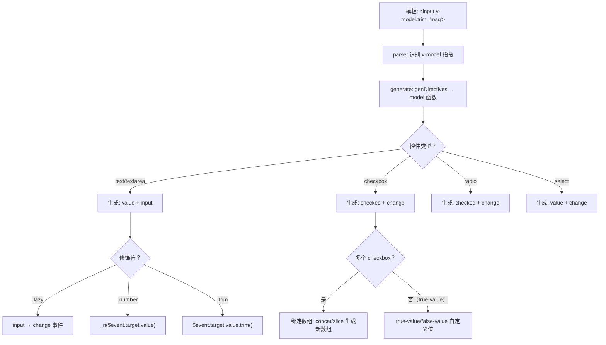
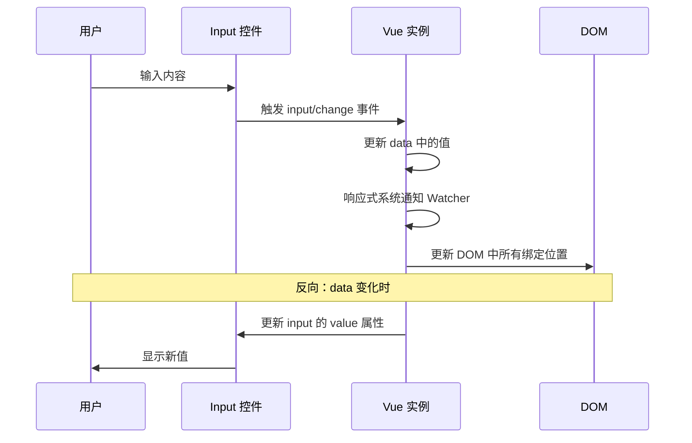

# 表单输入绑定 v-model

## 概述

在前端开发中，表单是用户与应用交互的主要方式。Vue.js 提供了 `v-model` 指令，在表单 `<input>`、`<textarea>` 及 `<select>` 元素上创建**双向数据绑定**。它会根据控件类型自动选取正确的方法来更新元素。

### v-model 的编译原理

`v-model` 在编译阶段根据控件类型和修饰符生成不同的代码：



**关键源码——model 函数（简化）：**

```javascript
// src/compiler/directives/model.js
function model(el, dir) {
  const value = dir.value       // v-model 的表达式
  const modifiers = dir.modifiers  // .lazy/.number/.trim
  const tag = el.tag            // input/select/textarea

  if (tag === 'select') {
    genSelect(el, value, modifiers)
  } else if (tag === 'input' && el.attrsMap['type'] === 'checkbox') {
    genCheckboxModel(el, value, modifiers)
  } else if (tag === 'input' && el.attrsMap['type'] === 'radio') {
    genRadioModel(el, value, modifiers)
  } else {
    genDefaultModel(el, value, modifiers)
    // 生成: addHandler(el, event, `${value}=$event.target.value.trim()`, null, modifiers)
    // .number → `_n($event.target.value)` 包裹 _n 函数
    // .trim  → `$event.target.value.trim()` 字符串方法
  }
}

// _n 函数（toNumber）:
// src/shared/util.js
function toNumber(val) {
  const n = parseFloat(val)
  return isNaN(n) ? val : n  // 解析失败返回原值
}
```

### v-model 的本质

`v-model` 本质上是语法糖，它负责：
- 监听用户的输入事件以更新数据
- 对一些极端场景进行特殊处理
- 根据 input 类型自动选择正确的属性和事件

```html
<!-- v-model 的本质 -->
<input v-model="searchText">

<!-- 等价于 -->
<input
  :value="searchText"
  @input="searchText = $event.target.value"
>
```

::: warning 重要提示
`v-model` 会忽略所有表单元素的 `value`、`checked`、`selected` 属性的初始值，而总是将 Vue 实例的数据作为数据来源。应该在组件的 `data` 选项中声明初始值。
:::

### 表单控件绑定规则

| 表单控件 | 绑定属性 | 触发事件 | 数据类型 |
|---------|---------|---------|---------|
| `<input type="text">` | `value` | `input` | String |
| `<textarea>` | `value` | `input` | String |
| `<input type="checkbox">` | `checked` | `change` | Boolean / Array |
| `<input type="radio">` | `checked` | `change` | String |
| `<select>` | `value` | `change` | String / Array |

### 双向绑定原理



## 基础用法

### 文本输入框

#### 单行文本

```html
<template>
  <div>
    <input v-model="message" placeholder="请输入内容">
    <p>消息内容: {{ message }}</p>
  </div>
</template>

<script>
export default {
  data() {
    return {
      message: ''
    }
  }
}
</script>
```

#### 多行文本

```html
<template>
  <div>
    <span>多行消息:</span>
    <p style="white-space: pre-line;">{{ message }}</p>
    <br>
    <textarea v-model="message" placeholder="输入多行内容"></textarea>
  </div>
</template>

<script>
export default {
  data() {
    return {
      message: ''
    }
  }
}
</script>
```

::: warning 注意
在文本区域插值 (`<textarea>{{text}}</textarea>`) 并不会生效，应该使用 `v-model` 来代替。
:::

### 复选框

#### 单个复选框

单个复选框绑定到布尔值：

```html
<template>
  <div>
    <input type="checkbox" id="checkbox" v-model="checked">
    <label for="checkbox">{{ checked ? '已选中' : '未选中' }}</label>
  </div>
</template>

<script>
export default {
  data() {
    return {
      checked: false
    }
  }
}
</script>
```

#### 多个复选框

多个复选框绑定到同一个数组：

```html
<template>
  <div>
    <input type="checkbox" id="jack" value="Jack" v-model="checkedNames">
    <label for="jack">Jack</label>
    
    <input type="checkbox" id="john" value="John" v-model="checkedNames">
    <label for="john">John</label>
    
    <input type="checkbox" id="mike" value="Mike" v-model="checkedNames">
    <label for="mike">Mike</label>
    
    <br>
    <span>选中的名字: {{ checkedNames }}</span>
  </div>
</template>

<script>
export default {
  data() {
    return {
      checkedNames: []  // 数组类型
    }
  }
}
</script>
```

**渲染结果**：
- 选中 Jack 和 Mike 时，`checkedNames` 为 `['Jack', 'Mike']`
- 取消选中时，值会从数组中移除

#### 复选框完整示例

```html
<template>
  <div class="checkbox-demo">
    <h3>兴趣爱好</h3>
    <div class="checkbox-group">
      <label v-for="hobby in hobbies" :key="hobby.value">
        <input 
          type="checkbox" 
          :value="hobby.value" 
          v-model="selectedHobbies"
        >
        {{ hobby.label }}
      </label>
    </div>
    
    <div class="result">
      <p>已选择: {{ selectedHobbies }}</p>
      <p>共 {{ selectedHobbies.length }} 项</p>
    </div>
  </div>
</template>

<script>
export default {
  data() {
    return {
      selectedHobbies: [],
      hobbies: [
        { label: '阅读', value: 'reading' },
        { label: '音乐', value: 'music' },
        { label: '运动', value: 'sports' },
        { label: '旅行', value: 'travel' },
        { label: '美食', value: 'food' }
      ]
    }
  }
}
</script>

<style scoped>
.checkbox-group label {
  display: inline-block;
  margin: 5px 10px;
  cursor: pointer;
}

.result {
  margin-top: 15px;
  padding: 10px;
  background: #f5f5f5;
  border-radius: 4px;
}
</style>
```

### 单选按钮

```html
<template>
  <div>
    <input type="radio" id="one" value="One" v-model="picked">
    <label for="one">One</label>
    
    <br>
    
    <input type="radio" id="two" value="Two" v-model="picked">
    <label for="two">Two</label>
    
    <br>
    <span>选中: {{ picked }}</span>
  </div>
</template>

<script>
export default {
  data() {
    return {
      picked: ''  // 初始值为空
    }
  }
}
</script>
```

#### 单选按钮完整示例

```html
<template>
  <div class="radio-demo">
    <h3>选择性别</h3>
    <div class="radio-group">
      <label v-for="gender in genders" :key="gender.value">
        <input 
          type="radio" 
          :value="gender.value" 
          v-model="selectedGender"
        >
        {{ gender.label }}
      </label>
    </div>
    
    <p>已选择: {{ selectedGender }}</p>
  </div>
</template>

<script>
export default {
  data() {
    return {
      selectedGender: '',
      genders: [
        { label: '男', value: 'male' },
        { label: '女', value: 'female' },
        { label: '其他', value: 'other' }
      ]
    }
  }
}
</script>

<style scoped>
.radio-group label {
  display: inline-block;
  margin: 5px 15px;
  cursor: pointer;
}
</style>
```

### 选择框

#### 单选选择框

```html
<template>
  <div>
    <select v-model="selected">
      <option disabled value="">请选择</option>
      <option>A</option>
      <option>B</option>
      <option>C</option>
    </select>
    <span>选中: {{ selected }}</span>
  </div>
</template>

<script>
export default {
  data() {
    return {
      selected: ''
    }
  }
}
</script>
```

::: warning iOS 兼容性提示
如果 `v-model` 表达式的初始值未能匹配任何选项，`<select>` 元素将被渲染为"未选中"状态。在 iOS 中这会使用户无法选择第一个选项，因为这样的情况下 iOS 不会触发 change 事件。因此，更推荐提供一个值为空的禁用选项。
:::

#### 多选选择框

多选时绑定到一个数组：

```html
<template>
  <div>
    <select v-model="selected" multiple style="width: 100px; height: 100px;">
      <option>A</option>
      <option>B</option>
      <option>C</option>
    </select>
    <br>
    <span>选中: {{ selected }}</span>
  </div>
</template>

<script>
export default {
  data() {
    return {
      selected: []  // 数组类型
    }
  }
}
</script>
```

#### 动态选项

用 `v-for` 渲染动态选项：

```html
<template>
  <div>
    <select v-model="selected">
      <option 
        v-for="option in options" 
        :value="option.value" 
        :key="option.value"
      >
        {{ option.text }}
      </option>
    </select>
    <span>选中: {{ selected }}</span>
  </div>
</template>

<script>
export default {
  data() {
    return {
      selected: 'A',
      options: [
        { text: '选项一', value: 'A' },
        { text: '选项二', value: 'B' },
        { text: '选项三', value: 'C' }
      ]
    }
  }
}
</script>
```

#### 选择框完整示例

```html
<template>
  <div class="select-demo">
    <h3>城市选择</h3>
    
    <!-- 单选 -->
    <div class="select-item">
      <label>省份：</label>
      <select v-model="selectedProvince" @change="onProvinceChange">
        <option value="">请选择省份</option>
        <option 
          v-for="province in provinces" 
          :value="province.id" 
          :key="province.id"
        >
          {{ province.name }}
        </option>
      </select>
    </div>
    
    <!-- 级联选择 -->
    <div class="select-item">
      <label>城市：</label>
      <select v-model="selectedCity" :disabled="!cities.length">
        <option value="">请选择城市</option>
        <option 
          v-for="city in cities" 
          :value="city.id" 
          :key="city.id"
        >
          {{ city.name }}
        </option>
      </select>
    </div>
    
    <!-- 多选 -->
    <div class="select-item">
      <label>兴趣标签：</label>
      <select v-model="selectedTags" multiple style="height: 120px;">
        <option v-for="tag in tags" :value="tag" :key="tag">
          {{ tag }}
        </option>
      </select>
      <p>已选择: {{ selectedTags.join(', ') }}</p>
    </div>
  </div>
</template>

<script>
export default {
  data() {
    return {
      selectedProvince: '',
      selectedCity: '',
      selectedTags: [],
      provinces: [
        { id: 'bj', name: '北京' },
        { id: 'sh', name: '上海' },
        { id: 'gd', name: '广东' }
      ],
      cityData: {
        bj: [{ id: 'bj-hd', name: '海淀区' }, { id: 'bj-cy', name: '朝阳区' }],
        sh: [{ id: 'sh-pd', name: '浦东新区' }, { id: 'sh-jh', name: '静安区' }],
        gd: [{ id: 'gd-gz', name: '广州' }, { id: 'gd-sz', name: '深圳' }]
      },
      cities: [],
      tags: ['前端', '后端', '移动端', '人工智能', '大数据', '云计算']
    }
  },
  methods: {
    onProvinceChange() {
      this.selectedCity = ''
      this.cities = this.cityData[this.selectedProvince] || []
    }
  }
}
</script>

<style scoped>
.select-item {
  margin: 15px 0;
}

.select-item select {
  padding: 5px 10px;
  min-width: 150px;
}
</style>
```

## 值绑定

对于单选按钮、复选框及选择框的选项，`v-model` 绑定的值通常是静态字符串（对于复选框也可以是布尔值）：

```html
<!-- 当选中时，picked 为字符串 "a" -->
<input type="radio" v-model="picked" value="a">

<!-- toggle 为 true 或 false -->
<input type="checkbox" v-model="toggle">

<!-- 当选中第一个选项时，selected 为字符串 "abc" -->
<select v-model="selected">
  <option value="abc">ABC</option>
</select>
```

但是有时我们可能想把值绑定到 Vue 实例的一个动态 property 上，这时可以用 `v-bind` 实现，并且这个 property 的值可以不是字符串。

### 复选框的值绑定

#### 使用 true-value 和 false-value

```html
<template>
  <div>
    <input 
      type="checkbox"
      v-model="toggle"
      true-value="yes"
      false-value="no"
    >
    <span>状态: {{ toggle }}</span>
  </div>
</template>

<script>
export default {
  data() {
    return {
      toggle: 'no'
    }
  }
}
</script>
```

**效果**：
- 当选中时：`toggle` 的值为 `'yes'`
- 当没有选中时：`toggle` 的值为 `'no'`

::: warning 注意
`true-value` 和 `false-value` attribute 并不会影响输入控件的 `value` attribute，因为浏览器在提交表单时并不会包含未被选中的复选框。如果要确保表单中这两个值中的一个能够被提交（即 "yes" 或 "no"），请换用单选按钮。
:::

#### 绑定动态值

```html
<template>
  <div>
    <input 
      type="checkbox"
      v-model="toggle"
      :true-value="dynamicTrue"
      :false-value="dynamicFalse"
    >
    <span>状态: {{ toggle }}</span>
  </div>
</template>

<script>
export default {
  data() {
    return {
      toggle: 'inactive',
      dynamicTrue: 'active',
      dynamicFalse: 'inactive'
    }
  }
}
</script>
```

#### 绑定对象值

```html
<template>
  <div>
    <input 
      type="checkbox"
      v-model="toggle"
      :true-value="{ status: 'active' }"
      :false-value="{ status: 'inactive' }"
    >
    <span>状态: {{ toggle.status }}</span>
  </div>
</template>

<script>
export default {
  data() {
    return {
      toggle: { status: 'inactive' }
    }
  }
}
</script>
```

### 单选按钮的值绑定

```html
<template>
  <div>
    <input type="radio" v-model="pick" :value="a">
    <label>选项 A</label>
    
    <input type="radio" v-model="pick" :value="b">
    <label>选项 B</label>
    
    <div v-if="pick">
      <p>选中值: {{ pick }}</p>
      <p>名称: {{ pick.name }}</p>
    </div>
  </div>
</template>

<script>
export default {
  data() {
    return {
      pick: null,
      a: { id: 1, name: '选项 A' },
      b: { id: 2, name: '选项 B' }
    }
  }
}
</script>
```

**效果**：当选中时，`pick` 的值等于 `a` 或 `b` 对象。

### 选择框选项的值绑定

```html
<template>
  <div>
    <select v-model="selected">
      <option value="">请选择</option>
      <!-- 绑定对象 -->
      <option :value="{ number: 123 }">123</option>
      <option :value="{ number: 456 }">456</option>
    </select>
    
    <div v-if="selected">
      <p>类型: {{ typeof selected }}</p>
      <p>数值: {{ selected.number }}</p>
    </div>
  </div>
</template>

<script>
export default {
  data() {
    return {
      selected: ''
    }
  }
}
</script>
```

### 值绑定完整示例

```html
<template>
  <div class="value-binding-demo">
    <h3>值绑定示例</h3>
    
    <!-- 复选框：自定义布尔值 -->
    <div class="form-item">
      <label>同意条款：</label>
      <input 
        type="checkbox"
        v-model="agreement"
        true-value="agree"
        false-value="disagree"
      >
      <span>{{ agreement === 'agree' ? '已同意' : '未同意' }}</span>
    </div>
    
    <!-- 单选按钮：对象值 -->
    <div class="form-item">
      <label>选择用户：</label>
      <label v-for="user in users" :key="user.id">
        <input 
          type="radio" 
          v-model="selectedUser" 
          :value="user"
        >
        {{ user.name }}
      </label>
      <p v-if="selectedUser">选中: {{ selectedUser.name }} (ID: {{ selectedUser.id }})</p>
    </div>
    
    <!-- 选择框：对象值 -->
    <div class="form-item">
      <label>选择产品：</label>
      <select v-model="selectedProduct">
        <option value="">请选择</option>
        <option 
          v-for="product in products" 
          :value="product" 
          :key="product.id"
        >
          {{ product.name }} - ¥{{ product.price }}
        </option>
      </select>
      <div v-if="selectedProduct">
        <p>产品: {{ selectedProduct.name }}</p>
        <p>价格: ¥{{ selectedProduct.price }}</p>
      </div>
    </div>
  </div>
</template>

<script>
export default {
  data() {
    return {
      agreement: 'disagree',
      selectedUser: null,
      selectedProduct: null,
      users: [
        { id: 1, name: '张三', role: 'admin' },
        { id: 2, name: '李四', role: 'user' },
        { id: 3, name: '王五', role: 'user' }
      ],
      products: [
        { id: 1, name: '产品 A', price: 99 },
        { id: 2, name: '产品 B', price: 199 },
        { id: 3, name: '产品 C', price: 299 }
      ]
    }
  }
}
</script>

<style scoped>
.form-item {
  margin: 15px 0;
  padding: 10px;
  background: #f9f9f9;
  border-radius: 4px;
}

.form-item label {
  display: inline-block;
  margin-right: 10px;
  font-weight: bold;
}
</style>
```

## 修饰符

### .lazy

在默认情况下，`v-model` 在每次 `input` 事件触发后将输入框的值与数据进行同步（除了输入法组合文字时）。可以添加 `lazy` 修饰符，从而转为在 `change` 事件之后进行同步：

```html
<template>
  <div>
    <p>实时同步:</p>
    <input v-model="msg1" placeholder="输入内容">
    <p>{{ msg1 }}</p>
    
    <p>懒同步:</p>
    <input v-model.lazy="msg2" placeholder="输入内容后失去焦点">
    <p>{{ msg2 }}</p>
  </div>
</template>

<script>
export default {
  data() {
    return {
      msg1: '',
      msg2: ''
    }
  }
}
</script>
```

**对比**：
- 普通 `v-model`：每次输入都更新数据
- `v-model.lazy`：失去焦点或按回车后才更新数据

**适用场景**：
- 表单验证（不需要实时验证）
- 减少不必要的更新
- 性能优化

### .number

如果想自动将用户的输入值转为数值类型，可以给 `v-model` 添加 `number` 修饰符：

```html
<template>
  <div>
    <p>不使用 .number:</p>
    <input v-model="age1" type="number">
    <p>类型: {{ typeof age1 }}, 值: {{ age1 }}</p>
    
    <p>使用 .number:</p>
    <input v-model.number="age2" type="number">
    <p>类型: {{ typeof age2 }}, 值: {{ age2 }}</p>
  </div>
</template>

<script>
export default {
  data() {
    return {
      age1: '',
      age2: ''
    }
  }
}
</script>
```

**效果**：
- 不使用 `.number`：即使 `type="number"`，值仍然是字符串
- 使用 `.number`：值会被转换为数值类型

::: warning 注意
如果值无法被 `parseFloat()` 解析，则会返回原始的值。
:::

**适用场景**：
- 年龄、数量等数值输入
- 需要进行数值计算的字段
- 表单数据提交到后端 API

### .trim

如果要自动过滤用户输入的首尾空白字符，可以给 `v-model` 添加 `trim` 修饰符：

```html
<template>
  <div>
    <p>不使用 .trim:</p>
    <input v-model="msg1" placeholder="输入内容（含空格）">
    <p>长度: {{ msg1.length }}</p>
    
    <p>使用 .trim:</p>
    <input v-model.trim="msg2" placeholder="输入内容（含空格）">
    <p>长度: {{ msg2.length }}</p>
  </div>
</template>

<script>
export default {
  data() {
    return {
      msg1: '',
      msg2: ''
    }
  }
}
</script>
```

**效果**：自动去除首尾空格

**适用场景**：
- 用户名、搜索关键词等
- 避免用户误输入空格
- 数据提交前的清理

### 修饰符组合

修饰符可以组合使用：

```html
<template>
  <div>
    <!-- 组合使用 -->
    <input v-model.lazy.trim="msg">
    <input v-model.number.lazy="age">
  </div>
</template>
```

### 修饰符完整示例

```html
<template>
  <div class="modifiers-demo">
    <h3>修饰符示例</h3>
    
    <!-- .lazy 示例 -->
    <div class="form-item">
      <label>搜索（.lazy）：</label>
      <input 
        v-model.lazy="searchQuery" 
        placeholder="失去焦点时搜索"
        @change="search"
      >
      <p>搜索关键词: {{ searchQuery }}</p>
    </div>
    
    <!-- .number 示例 -->
    <div class="form-item">
      <label>年龄（.number）：</label>
      <input 
        v-model.number="age" 
        type="number" 
        placeholder="输入年龄"
      >
      <p>类型: {{ typeof age }}, 值: {{ age }}</p>
      <p>可以计算: {{ age + 10 }}</p>
    </div>
    
    <!-- .trim 示例 -->
    <div class="form-item">
      <label>用户名（.trim）：</label>
      <input 
        v-model.trim="username" 
        placeholder="输入用户名"
      >
      <p>用户名: "{{ username }}" (长度: {{ username.length }})</p>
    </div>
    
    <!-- 组合使用 -->
    <div class="form-item">
      <label>备注（.lazy.trim）：</label>
      <textarea 
        v-model.lazy.trim="remark" 
        placeholder="输入备注"
      ></textarea>
      <p>备注: "{{ remark }}"</p>
    </div>
  </div>
</template>

<script>
export default {
  data() {
    return {
      searchQuery: '',
      age: '',
      username: '',
      remark: ''
    }
  },
  methods: {
    search() {
      console.log('搜索:', this.searchQuery)
    }
  }
}
</script>

<style scoped>
.form-item {
  margin: 15px 0;
  padding: 10px;
  background: #f9f9f9;
  border-radius: 4px;
}

.form-item input,
.form-item textarea {
  width: 200px;
  padding: 8px;
  margin: 5px 0;
}

.form-item textarea {
  height: 80px;
}
</style>
```

## 在组件上使用 v-model

### 组件 v-model 的原理

Vue 2 的组件 v-model 默认使用 `value` prop 和 `input` 事件：

```html
<template>
  <!-- 父组件 -->
  <custom-input v-model="searchText"></custom-input>
  
  <!-- 等价于 -->
  <custom-input
    :value="searchText"
    @input="searchText = $event"
  ></custom-input>
</template>
```

### 自定义组件实现 v-model

```html
<!-- CustomInput.vue -->
<template>
  <input
    type="text"
    :value="value"
    @input="$emit('input', $event.target.value)"
  >
</template>

<script>
export default {
  props: ['value']  // 接收 value prop
}
</script>
```

```html
<!-- 父组件 -->
<template>
  <div>
    <custom-input v-model="searchText"></custom-input>
    <p>搜索: {{ searchText }}</p>
  </div>
</template>

<script>
import CustomInput from './CustomInput.vue'

export default {
  components: { CustomInput },
  data() {
    return {
      searchText: ''
    }
  }
}
</script>
```

### 自定义 v-model 的 prop 和事件

Vue 2.2.0+ 支持 `model` 选项自定义 prop 和事件：

```html
<!-- CustomCheckbox.vue -->
<template>
  <input
    type="checkbox"
    :checked="checked"
    @change="$emit('change', $event.target.checked)"
  >
</template>

<script>
export default {
  model: {
    prop: 'checked',
    event: 'change'
  },
  props: {
    checked: Boolean
  }
}
</script>
```

```html
<!-- 父组件 -->
<template>
  <div>
    <custom-checkbox v-model="isChecked"></custom-checkbox>
    <p>状态: {{ isChecked }}</p>
  </div>
</template>

<script>
import CustomCheckbox from './CustomCheckbox.vue'

export default {
  components: { CustomCheckbox },
  data() {
    return {
      isChecked: false
    }
  }
}
</script>
```

### 完整的表单组件示例

```html
<!-- FormInput.vue -->
<template>
  <div class="form-input">
    <label v-if="label">{{ label }}</label>
    <input
      :type="type"
      :value="value"
      :placeholder="placeholder"
      :disabled="disabled"
      @input="handleInput"
      @focus="handleFocus"
      @blur="handleBlur"
    >
    <span v-if="error" class="error">{{ error }}</span>
  </div>
</template>

<script>
export default {
  name: 'FormInput',
  props: {
    value: [String, Number],
    type: {
      type: String,
      default: 'text'
    },
    label: String,
    placeholder: String,
    disabled: Boolean,
    error: String
  },
  methods: {
    handleInput(event) {
      this.$emit('input', event.target.value)
    },
    handleFocus(event) {
      this.$emit('focus', event)
    },
    handleBlur(event) {
      this.$emit('blur', event)
    }
  }
}
</script>

<style scoped>
.form-input {
  margin-bottom: 15px;
}

.form-input label {
  display: block;
  margin-bottom: 5px;
  font-weight: bold;
}

.form-input input {
  width: 100%;
  padding: 8px 12px;
  border: 1px solid #ddd;
  border-radius: 4px;
}

.form-input input:focus {
  border-color: #1890ff;
  outline: none;
}

.form-input input:disabled {
  background: #f5f5f5;
  cursor: not-allowed;
}

.error {
  color: #f5222d;
  font-size: 12px;
  margin-top: 5px;
}
</style>
```

```html
<!-- 使用示例 -->
<template>
  <form @submit.prevent="handleSubmit">
    <form-input 
      v-model="form.username" 
      label="用户名"
      placeholder="请输入用户名"
      :error="errors.username"
    />
    
    <form-input 
      v-model="form.email" 
      type="email"
      label="邮箱"
      placeholder="请输入邮箱"
    />
    
    <form-input 
      v-model="form.age" 
      type="number"
      label="年龄"
    />
    
    <button type="submit">提交</button>
  </form>
</template>

<script>
import FormInput from './FormInput.vue'

export default {
  components: { FormInput },
  data() {
    return {
      form: {
        username: '',
        email: '',
        age: ''
      },
      errors: {}
    }
  },
  methods: {
    handleSubmit() {
      if (!this.form.username) {
        this.$set(this.errors, 'username', '用户名不能为空')
        return
      }
      console.log('提交:', this.form)
    }
  }
}
</script>
```

## 实际应用场景

### 场景 1：完整的注册表单

```html
<template>
  <form @submit.prevent="handleSubmit" class="register-form">
    <h2>用户注册</h2>
    
    <!-- 用户名 -->
    <div class="form-group">
      <label>用户名：</label>
      <input 
        v-model.trim="form.username"
        @blur="validateUsername"
        placeholder="3-20 个字符"
      >
      <span v-if="errors.username" class="error">{{ errors.username }}</span>
    </div>
    
    <!-- 邮箱 -->
    <div class="form-group">
      <label>邮箱：</label>
      <input 
        v-model.trim="form.email"
        type="email"
        @blur="validateEmail"
        placeholder="example@email.com"
      >
      <span v-if="errors.email" class="error">{{ errors.email }}</span>
    </div>
    
    <!-- 密码 -->
    <div class="form-group">
      <label>密码：</label>
      <input 
        v-model="form.password"
        type="password"
        @blur="validatePassword"
        placeholder="至少 6 个字符"
      >
      <span v-if="errors.password" class="error">{{ errors.password }}</span>
    </div>
    
    <!-- 确认密码 -->
    <div class="form-group">
      <label>确认密码：</label>
      <input 
        v-model="form.confirmPassword"
        type="password"
        @blur="validateConfirmPassword"
        placeholder="再次输入密码"
      >
      <span v-if="errors.confirmPassword" class="error">{{ errors.confirmPassword }}</span>
    </div>
    
    <!-- 性别 -->
    <div class="form-group">
      <label>性别：</label>
      <label class="radio-label">
        <input type="radio" value="male" v-model="form.gender"> 男
      </label>
      <label class="radio-label">
        <input type="radio" value="female" v-model="form.gender"> 女
      </label>
    </div>
    
    <!-- 爱好 -->
    <div class="form-group">
      <label>爱好：</label>
      <label v-for="hobby in hobbies" :key="hobby.value" class="checkbox-label">
        <input type="checkbox" :value="hobby.value" v-model="form.hobbies">
        {{ hobby.label }}
      </label>
    </div>
    
    <!-- 城市 -->
    <div class="form-group">
      <label>城市：</label>
      <select v-model="form.city">
        <option value="">请选择城市</option>
        <option v-for="city in cities" :value="city.value" :key="city.value">
          {{ city.label }}
        </option>
      </select>
    </div>
    
    <!-- 同意条款 -->
    <div class="form-group">
      <label class="checkbox-label">
        <input 
          type="checkbox"
          v-model="form.agreement"
          true-value="agree"
          false-value="disagree"
        >
        我已阅读并同意《用户协议》
      </label>
    </div>
    
    <!-- 提交按钮 -->
    <button type="submit" :disabled="!isFormValid">注册</button>
  </form>
</template>

<script>
export default {
  data() {
    return {
      form: {
        username: '',
        email: '',
        password: '',
        confirmPassword: '',
        gender: '',
        hobbies: [],
        city: '',
        agreement: 'disagree'
      },
      errors: {},
      hobbies: [
        { label: '阅读', value: 'reading' },
        { label: '音乐', value: 'music' },
        { label: '运动', value: 'sports' }
      ],
      cities: [
        { label: '北京', value: 'beijing' },
        { label: '上海', value: 'shanghai' },
        { label: '广州', value: 'guangzhou' }
      ]
    }
  },
  computed: {
    isFormValid() {
      return this.form.username && 
             this.form.email && 
             this.form.password && 
             this.form.confirmPassword &&
             this.form.agreement === 'agree' &&
             Object.keys(this.errors).length === 0
    }
  },
  methods: {
    validateUsername() {
      if (!this.form.username) {
        this.$set(this.errors, 'username', '用户名不能为空')
      } else if (this.form.username.length < 3) {
        this.$set(this.errors, 'username', '用户名至少 3 个字符')
      } else {
        this.$delete(this.errors, 'username')
      }
    },
    validateEmail() {
      const emailRegex = /^[^\s@]+@[^\s@]+\.[^\s@]+$/
      if (!this.form.email) {
        this.$set(this.errors, 'email', '邮箱不能为空')
      } else if (!emailRegex.test(this.form.email)) {
        this.$set(this.errors, 'email', '邮箱格式不正确')
      } else {
        this.$delete(this.errors, 'email')
      }
    },
    validatePassword() {
      if (!this.form.password) {
        this.$set(this.errors, 'password', '密码不能为空')
      } else if (this.form.password.length < 6) {
        this.$set(this.errors, 'password', '密码至少 6 个字符')
      } else {
        this.$delete(this.errors, 'password')
      }
    },
    validateConfirmPassword() {
      if (this.form.password !== this.form.confirmPassword) {
        this.$set(this.errors, 'confirmPassword', '两次密码不一致')
      } else {
        this.$delete(this.errors, 'confirmPassword')
      }
    },
    handleSubmit() {
      // 验证所有字段
      this.validateUsername()
      this.validateEmail()
      this.validatePassword()
      this.validateConfirmPassword()
      
      if (this.isFormValid) {
        console.log('提交表单:', this.form)
        // 调用 API
      }
    }
  }
}
</script>

<style scoped>
.register-form {
  max-width: 400px;
  margin: 0 auto;
  padding: 20px;
}

.form-group {
  margin-bottom: 15px;
}

.form-group label {
  display: block;
  margin-bottom: 5px;
}

.radio-label,
.checkbox-label {
  display: inline-block;
  margin-right: 15px;
  font-weight: normal;
}

input[type="text"],
input[type="email"],
input[type="password"],
select {
  width: 100%;
  padding: 8px;
  border: 1px solid #ddd;
  border-radius: 4px;
}

.error {
  color: #f5222d;
  font-size: 12px;
}

button[type="submit"] {
  width: 100%;
  padding: 10px;
  background: #1890ff;
  color: white;
  border: none;
  border-radius: 4px;
  cursor: pointer;
}

button[type="submit"]:disabled {
  background: #ccc;
  cursor: not-allowed;
}
</style>
```

### 场景 2：搜索过滤

> 📖 搜索过滤的完整实现包含分类、价格、标签等多维度筛选，参见：[列表渲染 - 商品列表过滤](../02-模板与渲染/03-列表渲染.md#示例1商品列表过滤和排序)

## 最佳实践

### 1. 初始化表单数据

```html
<script>
export default {
  data() {
    return {
      // ✅ 推荐：在 data 中初始化所有表单字段
      form: {
        username: '',
        email: '',
        age: null
      }
    }
  }
}
</script>
```

### 2. 使用修饰符优化输入

```html
<template>
  <div>
    <!-- 用户名：去除空格 -->
    <input v-model.trim="username">
    
    <!-- 年龄：转为数字 -->
    <input v-model.number="age" type="number">
    
    <!-- 搜索：延迟更新 -->
    <input v-model.lazy="searchQuery">
  </div>
</template>
```

### 3. 表单验证时机

```html
<template>
  <form @submit.prevent="handleSubmit">
    <!-- 失去焦点时验证，输入时清除错误 -->
    <input
      v-model.trim="form.username"
      @blur="validateField('username')"
      @input="clearError('username')"
    >
    <button type="submit">提交</button>
  </form>
</template>
```

### 4. 合理使用值绑定

```html
<template>
  <div>
    <!-- 需要布尔值以外的值时，使用 true-value/false-value -->
    <input 
      type="checkbox"
      v-model="status"
      true-value="active"
      false-value="inactive"
    >
    
    <!-- 需要绑定对象时，使用 v-bind -->
    <input 
      type="radio"
      v-model="selected"
      :value="item"
    >
  </div>
</template>
```

### 5. 提供默认选项

```html
<template>
  <div>
    <!-- ✅ 推荐：提供空的默认选项 -->
    <select v-model="selected">
      <option disabled value="">请选择</option>
      <option>A</option>
      <option>B</option>
    </select>
  </div>
</template>
```

### 6. 使用计算属性处理复杂逻辑

```html
<template>
  <div>
    <input v-model="inputValue">
    <p>{{ formattedValue }}</p>
  </div>
</template>

<script>
export default {
  computed: {
    formattedValue() {
      // 复杂的格式化逻辑
      return this.inputValue.toUpperCase()
    }
  }
}
</script>
```

## 常见问题

### Q1: v-model 和 v-bind:value 有什么区别？

**A**: `v-model` 是双向绑定，`v-bind:value` 是单向绑定：

```html
<template>
  <div>
    <!-- v-model：双向绑定 -->
    <input v-model="message">
    <!-- 等价于 -->
    <input :value="message" @input="message = $event.target.value">
    
    <!-- v-bind：单向绑定 -->
    <input :value="message">
    <!-- 数据变化会更新输入框，但输入框变化不会更新数据 -->
  </div>
</template>
```

### Q2: 为什么表单元素的初始值不生效？

**A**: `v-model` 会忽略表单元素的初始值，应该以 Vue 实例的数据为准：

```html
<template>
  <!-- ❌ 错误：初始值会被忽略 -->
  <input v-model="username" value="默认值">
  
  <!-- ✅ 正确：在 data 中设置初始值 -->
  <input v-model="username">
</template>

<script>
export default {
  data() {
    return {
      username: '默认值'
    }
  }
}
</script>
```

### Q3: 如何处理输入法（IME）输入问题？

**A**: 使用输入法时，`v-model` 不会在组合过程中更新。可以使用 `@input` 事件：

```html
<template>
  <input 
    :value="text"
    @input="handleInput"
  >
</template>

<script>
export default {
  data() {
    return {
      text: ''
    }
  },
  methods: {
    handleInput(event) {
      // 这里可以在输入法组合过程中得到更新
      this.text = event.target.value
    }
  }
}
</script>
```

### Q4: 多个复选框如何绑定到数组？

**A**: 将多个复选框绑定到同一个数组，每个复选框的 `value` 会自动添加到数组或从数组中移除：

```html
<template>
  <div>
    <input type="checkbox" value="A" v-model="selected">
    <input type="checkbox" value="B" v-model="selected">
    <input type="checkbox" value="C" v-model="selected">
    <p>选中: {{ selected }}</p>
  </div>
</template>

<script>
export default {
  data() {
    return {
      selected: []  // 必须是数组
    }
  }
}
</script>
```

### Q5: 如何在组件上使用 v-model？

**A**: 组件需要接收 `value` prop 并触发 `input` 事件：

```html
<!-- 子组件 -->
<template>
  <input :value="value" @input="$emit('input', $event.target.value)">
</template>

<script>
export default {
  props: ['value']
}
</script>

<!-- 父组件 -->
<template>
  <my-input v-model="text"></my-input>
</template>
```

### Q6: .number 修饰符在什么情况下不生效？

**A**: 如果输入值无法被 `parseFloat()` 解析，则会返回原始字符串：

```html
<template>
  <input v-model.number="value">
</template>

<script>
export default {
  data() {
    return {
      value: ''
    }
  },
  watch: {
    value(newVal) {
      console.log(typeof newVal)
      // 输入 "123" → number
      // 输入 "abc" → string
    }
  }
}
</script>
```

### Q7: 如何实现表单重置功能？

**A**: 保存初始数据，重置时恢复：

```html
<template>
  <form>
    <input v-model="form.username">
    <input v-model="form.email">
    <button type="button" @click="resetForm">重置</button>
  </form>
</template>

<script>
const initialForm = {
  username: '',
  email: ''
}

export default {
  data() {
    return {
      form: { ...initialForm }
    }
  },
  methods: {
    resetForm() {
      this.form = { ...initialForm }
    }
  }
}
</script>
```

### Q8: 如何防止表单重复提交？

**A**: 使用 `disabled` 状态：

```html
<template>
  <form @submit.prevent="handleSubmit">
    <button type="submit" :disabled="submitting">
      {{ submitting ? '提交中...' : '提交' }}
    </button>
  </form>
</template>

<script>
export default {
  data() {
    return {
      submitting: false
    }
  },
  methods: {
    async handleSubmit() {
      if (this.submitting) return
      
      this.submitting = true
      try {
        // 提交逻辑
        await this.submitForm()
      } finally {
        this.submitting = false
      }
    }
  }
}
</script>
```

## 相关内容

- [模板语法](../02-模板与渲染/01-模板语法.md)
- [事件处理](03-事件处理.md)
- [计算属性和侦听器](01-计算属性.md)
