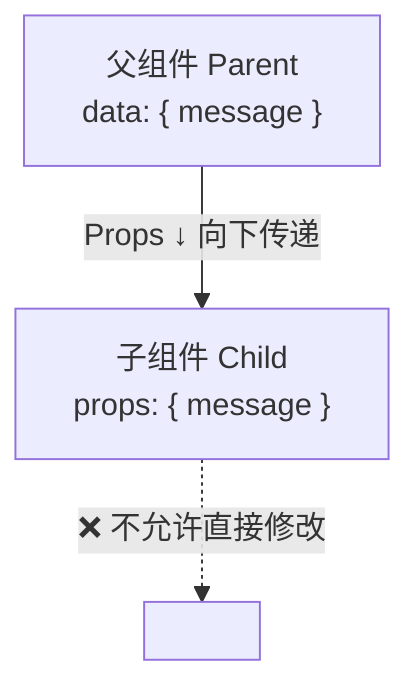

# Props

## 概述

Props（properties 的缩写）是 Vue 组件之间通信的核心机制之一，用于**父组件向子组件传递数据**。它是 Vue 单向数据流的重要组成部分，确保了数据流向的清晰性和可预测性。

### 核心作用

| 作用         | 说明                                  |
| ------------ | ------------------------------------- |
| **数据传递** | 父组件向子组件传递配置信息和数据      |
| **组件复用** | 通过不同的 props 值实现组件的灵活复用 |
| **类型约束** | 定义 prop 类型，提高代码健壮性        |
| **数据验证** | 对传入数据进行校验，确保数据合法性    |

### 基本用法

```javascript
Vue.component("user-card", {
  props: ["name", "age", "email"],
  template: `
    <div class="user-card">
      <h3>{{ name }}</h3>
      <p>年龄: {{ age }}</p>
      <p>邮箱: {{ email }}</p>
    </div>
  `
})
```

```html
<user-card name="张三" :age="25" email="zhangsan@example.com"></user-card>
```

---

## 命名规范

HTML 中的属性名是大小写不敏感的，浏览器会把所有大写字符解释为小写字符。当使用 DOM 中的模板时，驼峰命名法的 prop 名需要使用其等价的 kebab-case（短横线分隔命名）命名。

### 命名转换规则

```
JavaScript (camelCase)    →    HTML (kebab-case)
─────────────────────────────────────────────────
postTitle                 →    post-title
userName                  →    user-name
isActive                  →    is-active
```

### 示例

```javascript
Vue.component("blog-post", {
  props: ["postTitle", "postAuthor"],
  template: `
    <article>
      <h3>{{ postTitle }}</h3>
      <p>作者: {{ postAuthor }}</p>
    </article>
  `
})
```

```html
<blog-post post-title="Vue.js 入门" post-author="李四"></blog-post>
```

> **注意**：如果使用字符串模板（如 `.vue` 文件的 `<template>` 或 JavaScript 模板字符串），则不存在此限制，可以直接使用 camelCase。

---

## Prop 类型

### 字符串数组形式

以字符串数组形式列出 prop，适用于简单场景：

```javascript
props: ["title", "likes", "isPublished", "commentIds", "author"]
```

### 对象形式（推荐）

以对象形式列出 prop，可以指定每个 prop 的类型：

```javascript
props: {
  title: String,
  likes: Number,
  isPublished: Boolean,
  commentIds: Array,
  author: Object,
  callback: Function,
  contactsPromise: Promise
}
```

### 类型对照表

| JavaScript 类型 | Prop 类型  | 说明          |
| --------------- | ---------- | ------------- |
| 字符串          | `String`   | 文本内容      |
| 数字            | `Number`   | 数值、ID 等   |
| 布尔值          | `Boolean`  | 开关状态      |
| 数组            | `Array`    | 列表数据      |
| 对象            | `Object`   | 复杂数据结构  |
| 函数            | `Function` | 回调函数      |
| 日期            | `Date`     | 日期对象      |
| Symbol          | `Symbol`   | ES6 Symbol 值 |

---

## 传递静态或动态 Prop

### 静态传值

直接给 prop 传入一个静态的值：

```html
<blog-post title="My journey with Vue"></blog-post>
```

### 动态传值

通过 `v-bind` 动态给 prop 赋值：

```html
<blog-post v-bind:title="post.title"></blog-post>

<blog-post :title="post.title + ' by ' + post.author.name"></blog-post>
```

### 传入不同类型的数据

#### 传入数字

```html
<blog-post :likes="42"></blog-post>

<blog-post :likes="post.likes"></blog-post>
```

> **提示**：即使传入的是静态数字，也需要使用 `v-bind` 来告诉 Vue 这是一个 JavaScript 表达式而非字符串。

#### 传入布尔值

```html
<blog-post is-published></blog-post>

<blog-post :is-published="false"></blog-post>

<blog-post :is-published="post.isPublished"></blog-post>
```

> **说明**：当 prop 类型为 Boolean 时，仅写属性名不赋值，默认值为 `true`。

#### 传入数组

```html
<blog-post :comment-ids="[234, 266, 273]"></blog-post>

<blog-post :comment-ids="post.commentIds"></blog-post>
```

#### 传入对象

```html
<blog-post :author="{ name: 'Veronica', company: 'Veridian Dynamics' }"></blog-post>

<blog-post :author="post.author"></blog-post>
```

### 批量传入对象属性

使用不带参数的 `v-bind` 将对象的所有属性作为 prop 传入：

```javascript
post: {
  id: 1,
  title: 'My Journey with Vue',
  author: 'John'
}
```

```html
<blog-post v-bind="post"></blog-post>
```

等价于：

```html
<blog-post :id="post.id" :title="post.title" :author="post.author"></blog-post>
```

---

## 单向数据流

### 数据流向示意



### 核心原则

所有的 prop 都使得其父子 prop 之间形成了一个**单向下行绑定**：

- ✅ **父级 prop 的更新会向下流动到子组件中**
- ❌ **子组件不能直接修改 prop**
- ❌ **反向修改会导致数据流向难以理解**

> **重要**：每次父组件发生变更时，子组件中所有的 prop 都将会刷新为最新的值。这意味着不应该在一个子组件内部改变 prop。

### 正确处理 Prop 的方式

#### 场景一：Prop 作为初始值

当 prop 传递一个初始值，子组件希望将其作为一个本地数据使用时，应在 `data` 中定义字段并将 prop 用作初始值：

```javascript
props: ['initialCounter'],
data: function () {
  return {
    counter: this.initialCounter
  }
}
```

#### 场景二：Prop 需要转换

当 prop 以原始值传入且需要进行转换时，应使用计算属性：

```javascript
props: ['size'],
computed: {
  normalizedSize: function () {
    return this.size.trim().toLowerCase()
  }
}
```

#### 场景三：对象/数组的引用传递

```javascript
props: {
  user: Object
},
methods: {
  updateUser() {
    this.user.name = '新名字'
  }
}
```

> **警告**：在 JavaScript 中对象和数组是通过引用传入的，在子组件中修改对象或数组本身**将会**影响到父组件的状态。这种做法虽然可行，但不推荐，应通过 `$emit` 通知父组件修改。

---

## Prop 验证

### 基础验证

为组件的 prop 指定验证要求，如果需求未被满足，Vue 会在浏览器控制台中发出警告：

```javascript
Vue.component("my-component", {
  props: {
    propA: Number,

    propB: [String, Number],

    propC: {
      type: String,
      required: true
    },

    propD: {
      type: Number,
      default: 100
    },

    propE: {
      type: Object,
      default: function () {
        return { message: "hello" }
      }
    },

    propF: {
      validator: function (value) {
        return ["success", "warning", "danger"].indexOf(value) !== -1
      }
    }
  }
})
```

### 验证选项详解

| 选项        | 类型          | 说明           |
| ----------- | ------------- | -------------- |
| `type`      | 构造函数/数组 | 数据类型检查   |
| `required`  | Boolean       | 是否必填       |
| `default`   | 任意          | 默认值         |
| `validator` | Function      | 自定义验证函数 |

### 完整验证示例

```javascript
Vue.component("user-form", {
  props: {
    userId: {
      type: Number,
      required: true,
      validator: function (value) {
        return value > 0
      }
    },
    username: {
      type: String,
      required: true,
      validator: function (value) {
        return value.length >= 3 && value.length <= 20
      }
    },
    email: {
      type: String,
      default: "",
      validator: function (value) {
        if (!value) return true
        return /^[^\s@]+@[^\s@]+\.[^\s@]+$/.test(value)
      }
    },
    role: {
      type: String,
      default: "user",
      validator: function (value) {
        return ["admin", "user", "guest"].indexOf(value) !== -1
      }
    },
    permissions: {
      type: Array,
      default: function () {
        return []
      }
    },
    config: {
      type: Object,
      default: function () {
        return {
          theme: "light",
          language: "zh-CN"
        }
      }
    }
  }
})
```

### 类型检查

`type` 可以是以下原生构造函数：

```javascript
props: {
  stringProp: String,
  numberProp: Number,
  booleanProp: Boolean,
  arrayProp: Array,
  objectProp: Object,
  dateProp: Date,
  functionProp: Function,
  symbolProp: Symbol
}
```

### 自定义构造函数类型

`type` 还可以是自定义构造函数，通过 `instanceof` 进行检查：

```javascript
function Person(firstName, lastName) {
  this.firstName = firstName
  this.lastName = lastName
}

Vue.component("blog-post", {
  props: {
    author: Person
  }
})
```

```html
<blog-post :author="new Person('John', 'Doe')"></blog-post>
```

### 验证时机

> **注意**：prop 验证在组件实例创建**之前**进行，所以在 `default` 或 `validator` 函数中不能访问组件实例（如 `this`）。

---

## 非 Prop 的属性

### 概念

非 prop 的属性是指传向一个组件，但该组件并没有相应 prop 定义的属性。这些属性会被自动添加到组件的根元素上。

### 使用场景

```html
<bootstrap-date-input data-date-picker="activated"></bootstrap-date-input>
```

`data-date-picker="activated"` 会自动添加到 `<bootstrap-date-input>` 的根元素上。

### 替换/合并已有 Attribute

假设组件模板为：

```html
<input type="date" class="form-control" />
```

传入自定义属性：

```html
<bootstrap-date-input class="date-picker-theme-dark" type="text"> </bootstrap-date-input>
```

#### 合并规则

| 属性类型 | 行为 | 结果                                  |
| -------- | ---- | ------------------------------------- |
| `class`  | 合并 | `form-control date-picker-theme-dark` |
| `style`  | 合并 | 样式合并                              |
| 其他属性 | 替换 | 外部值覆盖内部值                      |

> **警告**：传入 `type="text"` 会替换掉 `type="date"`，可能破坏组件功能！

### 禁用 Attribute 继承

使用 `inheritAttrs: false` 禁用根元素继承：

```javascript
Vue.component("base-input", {
  inheritAttrs: false,
  props: ["label", "value"],
  template: `
    <label>
      {{ label }}
      <input
        v-bind="$attrs"
        :value="value"
        @input="$emit('input', $event.target.value)"
      >
    </label>
  `
})
```

### $attrs 对象

`$attrs` 包含了父组件传递但未在 props 中声明的属性（不含 `class` 和 `style`，二者始终合并到根元素）：

```javascript
{
  required: true,
  placeholder: 'Enter your username'
}
```

### 实际应用示例

```html
<base-input
  label="用户名:"
  v-model="username"
  required
  placeholder="请输入用户名"
  class="form-group">
</base-input>
```

渲染结果：

```html
<label class="form-group">
  用户名:
  <input required placeholder="请输入用户名">
</label>
```

> **注意**：`inheritAttrs: false` 不会影响 `style` 和 `class` 的绑定，它们仍会合并到根元素。

---

## 最佳实践

### 1. 始终声明 Prop 类型

```javascript
props: {
  status: String
}
```

### 2. 为复杂类型提供默认值工厂函数

```javascript
props: {
  items: {
    type: Array,
    default: () => []
  },
  config: {
    type: Object,
    default: () => ({})
  }
}
```

### 3. 使用详细的验证规则

```javascript
props: {
  status: {
    type: String,
    required: true,
    validator: value => ['active', 'inactive', 'pending'].includes(value)
  }
}
```

### 4. 命名规范

| 类型    | 规范       | 示例           |
| ------- | ---------- | -------------- |
| 属性名  | camelCase  | `postTitle`    |
| HTML 中 | kebab-case | `post-title`   |
| 事件名  | kebab-case | `@update-user` |

### 5. 避免 Props 变更

```javascript
props: ['user'],

methods: {
  updateUser() {
    this.$emit('update:user', { ...this.user, name: '新名字' })
  }
}
```

### 6. 使用 TypeScript 增强（可选）

```typescript
interface Props {
  title: string
  count?: number
}

Vue.component("my-component", {
  props: {
    title: { type: String, required: true },
    count: { type: Number, default: 0 }
  }
})
```

---

## 常见问题解答

### Q1: 为什么修改 props 中的对象会影响父组件？

**A**: JavaScript 中对象和数组是引用传递。子组件修改对象属性时，实际上修改的是同一个引用。建议通过 `$emit` 通知父组件修改，或使用深拷贝创建本地副本。

```javascript
props: ['user'],
data() {
  return {
    localUser: JSON.parse(JSON.stringify(this.user))
  }
}
```

### Q2: 如何实现 props 的双向绑定？

**A**: 使用 `.sync` 修饰符（Vue 2.3+）：

```html
<text-input :value.sync="text"></text-input>
```

```javascript
Vue.component("text-input", {
  props: ["value"],
  template: `
    <input 
      :value="value" 
      @input="$emit('update:value', $event.target.value)">
  `
})
```

### Q3: props 验证失败会怎样？

**A**: 在开发环境下，Vue 会在控制台输出警告信息，但不会阻止组件渲染。生产环境下不会输出警告。

### Q4: 如何传递所有属性给子组件？

**A**: 使用 `v-bind="$attrs"` 和 `v-on="$listeners"`：

```javascript
Vue.component("wrapper-input", {
  inheritAttrs: false,
  template: `
    <div class="wrapper">
      <input v-bind="$attrs" v-on="$listeners">
    </div>
  `
})
```

### Q5: Boolean 类型的 prop 默认值是什么？

**A**:

- 如果未传递该 prop 且未设置 `default`，Vue 2 的布尔转换会将其置为 `false`
- 如果传递了属性但未赋值（如 `<comp disabled>`），值为 `true`
- 可通过 `default` 显式设置默认值

```javascript
props: {
  disabled: {
    type: Boolean,
    default: false
  }
}
```

### Q6: 如何处理可选的 Object/Array 类型 prop？

**A**: 始终提供工厂函数作为默认值：

```javascript
props: {
  options: {
    type: Object,
    default: () => ({})
  },
  list: {
    type: Array,
    default: () => []
  }
}
```

> **原因**：如果使用对象作为默认值，所有组件实例将共享同一个引用，导致数据污染。

### Q7: 动态 prop 和静态 prop 的区别？

| 类型 | 写法                | 数据类型 |
| ---- | ------------------- | -------- |
| 静态 | `title="hello"`     | 字符串   |
| 动态 | `:title="variable"` | 任意类型 |
| 动态 | `:title="123"`      | 数字     |

---

## 总结

Props 是 Vue 组件通信的基础机制，掌握其正确使用方式对于构建可维护的 Vue 应用至关重要：

1. **命名规范**：JavaScript 中使用 camelCase，HTML 中使用 kebab-case
2. **类型定义**：推荐使用对象形式定义 prop 类型
3. **单向数据流**：遵循单向数据流原则，不直接修改 props
4. **数据验证**：为 prop 添加验证规则，提高代码健壮性
