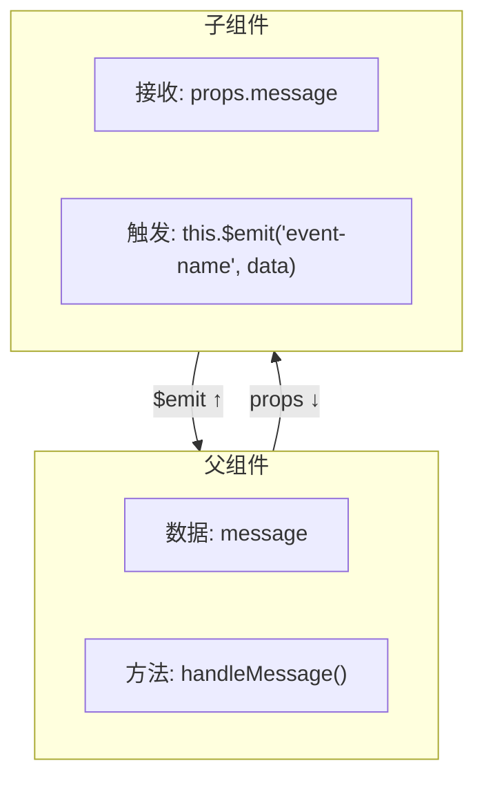
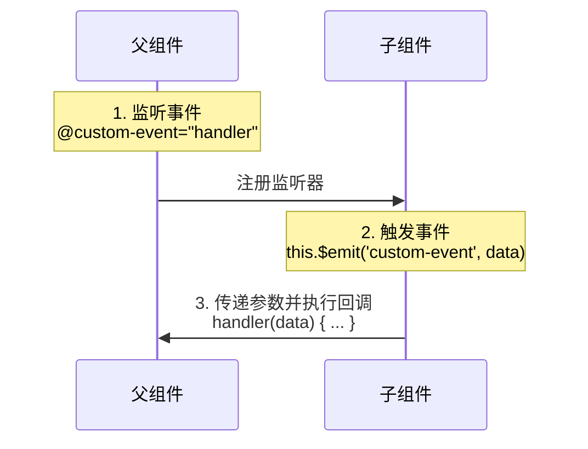
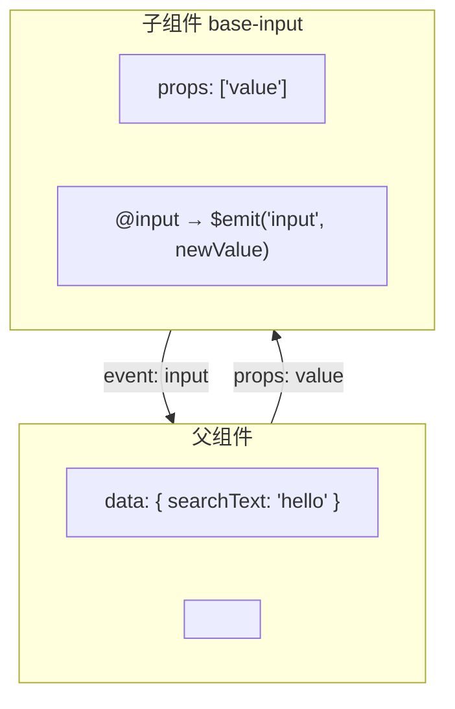
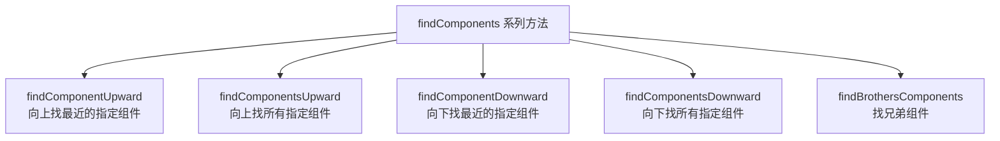

# 组件通信

## 概述

在 Vue 组件系统中，父组件通过 props 向子组件传递数据，而子组件通过**自定义事件**向父组件传递数据。这是 Vue 组件间通信的基础模式，遵循**单向数据流**原则。

### 核心概念

自定义事件是 Vue 组件系统中的重要通信机制，与 props 共同构成完整的组件通信体系：



### 事件通信流程



### 与 Props 的对比

| 特性         | Props                     | 自定义事件                   |
|-------------|---------------------------|------------------------------|
| 数据流向     | 父 → 子                   | 子 → 父                      |
| 通信方向     | 单向向下                   | 单向向上                     |
| 用途         | 传递数据到子组件           | 通知父组件状态变化           |
| 触发时机     | 组件初始化时               | 子组件主动触发               |
| 典型场景     | 配置、数据展示             | 用户交互、状态更新           |

## 通信方式总览

大多数组件并不独立存在，而是相互协作共同构成一个复杂业务功能。Vue 为不同的组件关系提供了不同的通信规则，先建立整体认知再深入细节：

| 组件关系 | 通信方式 | 核心 API |
| --- | --- | --- |
| 父 → 子 | Props Down | `props` |
| 子 → 父 | Event Up | `$emit` / `v-on` |
| 非父子（兄弟、跨级） | Event Bus | `$on` / `$emit` |
| 父直接操作子 | 模板引用 | `ref` / `$refs` |
| 跨多层级 | 依赖注入 | `provide` / `inject` |
| 全局共享状态 | 状态管理 | Vuex |

前四种是组件层面的基础手段，后两种适用于层级更深或范围更广的场景，详见本篇[跨级组件通信](#跨级组件通信)与 [Vuex 概述](../../04-生态系统/02-Vuex/01-Vuex概述.md)。

### 父传子：Props Down

父组件通过属性把数据传给子组件，子组件用 `props` 声明接收。

```vue
<!-- 父组件 -->
<template>
  <div>
    <h1>Props Down Parent</h1>
    <child title="My journey with Vue"></child>
  </div>
</template>

<script>
import child from './01-Child'
export default {
  components: { child }
}
</script>
```

```vue
<!-- 子组件 -->
<template>
  <div>
    <h1>Props Down Child</h1>
    <h2>{{ title }}</h2>
  </div>
</template>

<script>
export default {
  // 简写：props: ['title']
  // 推荐带类型声明，便于校验与文档化
  props: {
    title: String
  }
}
</script>
```

### 子传父：Event Up

子组件用 `$emit` 发布一个自定义事件，并可携带参数：

```vue
<template>
  <div>
    <h1 :style="{ fontSize: fontSize + 'em' }">Event Up Child</h1>
    <button @click="handler">文字增大</button>
  </div>
</template>

<script>
export default {
  props: {
    fontSize: Number
  },
  methods: {
    handler () {
      this.$emit('enlargeText', 0.1)
    }
  }
}
</script>
```

父组件用 `v-on` 监听这个自定义事件。既可以绑定方法，也可以直接写内联表达式，用 `$event` 取事件参数：

```vue
<template>
  <div>
    <h1 :style="{ fontSize: hFontSize + 'em'}">Event Up Parent</h1>

    这里的文字不需要变化

    <child :fontSize="hFontSize" v-on:enlargeText="enlargeText"></child>
    <child :fontSize="hFontSize" v-on:enlargeText="enlargeText"></child>
    <child :fontSize="hFontSize" v-on:enlargeText="hFontSize += $event"></child>
  </div>
</template>

<script>
import child from './02-Child'
export default {
  components: { child },
  data () {
    return { hFontSize: 1 }
  },
  methods: {
    enlargeText (size) {
      this.hFontSize += size
    }
  }
}
</script>
```

### 非父子组件：Event Bus

兄弟组件或任意两个无直接关系的组件之间，可以用一个极简的 Event Bus 中转。本质是借用一个空的 Vue 实例作为事件中心：

```javascript
// eventbus.js
import Vue from 'vue'
export default new Vue()
```

接收方用 `$on` 订阅：

```vue
<template>
  <div>
    <h1>Event Bus Sibling02</h1>
    <div>{{ msg }}</div>
  </div>
</template>

<script>
import bus from './eventbus'
export default {
  data () {
    return { msg: '' }
  },
  created () {
    bus.$on('numchange', (value) => {
      this.msg = `您选择了${value}件商品`
    })
  }
}
</script>
```

发送方用 `$emit` 发布：

```vue
<template>
  <div>
    <h1>Event Bus Sibling01</h1>
    <div class="number" @click="sub">-</div>
    <input type="text" style="width: 30px; text-align: center" :value="value">
    <div class="number" @click="add">+</div>
  </div>
</template>

<script>
import bus from './eventbus'

export default {
  props: {
    num: Number
  },
  created () {
    this.value = this.num
  },
  data () {
    return { value: -1 }
  },
  methods: {
    sub () {
      if (this.value > 1) {
        this.value--
        bus.$emit('numchange', this.value)
      }
    },
    add () {
      this.value++
      bus.$emit('numchange', this.value)
    }
  }
}
</script>

<style>
.number {
  display: inline-block;
  cursor: pointer;
  width: 20px;
  text-align: center;
}
</style>
```

> **注意**：Event Bus 订阅后应在 `beforeDestroy` 中用 `$off` 取消订阅，否则组件销毁后监听器仍然存在，会造成内存泄漏和重复响应。数据流也会因为缺少显式链路而变得难以追踪，中大型项目建议改用 Vuex。
>
> Vue 3 移除了实例上的 `$on` / `$off` / `$once`，Event Bus 模式不再可用，需改用外部库（如 mitt）或状态管理。

### 父直接访问子组件：ref

`ref` 有两个作用，取决于它作用的目标：

- 作用在普通 HTML 标签上，获取到的是 **DOM 元素**
- 作用在组件标签上，获取到的是 **组件实例**

在子组件中定义要暴露的方法：

```vue
<template>
  <div>
    <h1>ref Child</h1>
    <input ref="input" type="text" v-model="value">
  </div>
</template>

<script>
export default {
  data () {
    return { value: '' }
  },
  methods: {
    focus () {
      this.$refs.input.focus()
    }
  }
}
</script>
```

父组件在渲染完毕后通过 `$refs` 访问：

```vue
<template>
  <div>
    <h1>ref Parent</h1>
    <child ref="c"></child>
  </div>
</template>

<script>
import child from './04-Child'
export default {
  components: { child },
  mounted () {
    this.$refs.c.focus()
    this.$refs.c.value = 'hello input'
  }
}
</script>
```

> `$refs` 只会在组件渲染完成之后生效，并且**不是响应式的**。它仅作为直接操作子组件的「逃生舱」——应避免在模板或计算属性中访问 `$refs`。

## 事件命名规范

不同于组件和 prop，事件名**不存在任何自动化的大小写转换**。触发的事件名需要完全匹配监听这个事件所用的名称。

```javascript
// 子组件中触发事件
this.$emit('myEvent')
```

```html
<!-- 父组件中监听 - 没有效果！ -->
<my-component v-on:my-event="doSomething"></my-component>
```

### 原因分析

1. 事件名不会被用作 JavaScript 变量名或属性名，没有理由使用 camelCase 或 PascalCase
2. `v-on` 事件监听器在 DOM 模板中会被自动转换为全小写（HTML 大小写不敏感）
3. `v-on:myEvent` 会变成 `v-on:myevent`，导致无法监听到 `myEvent`

### 最佳实践

**始终使用 kebab-case 的事件名**

```javascript
// ✅ 推荐
this.$emit('my-event')

// ❌ 不推荐
this.$emit('myEvent')
this.$emit('MyEvent')
```

```html
<!-- ✅ 推荐 -->
<my-component @my-event="doSomething"></my-component>
```

## 自定义组件 v-model

### 概念说明

`v-model` 是 Vue 提供的语法糖，用于实现表单元素的双向绑定。在组件上使用 `v-model` 时，需要理解其底层实现机制。

### 默认行为

组件上的 `v-model` 默认会利用名为 `value` 的 prop 和名为 `input` 的事件：

```javascript
// 默认 v-model 实现
Vue.component('base-input', {
  props: ['value'],
  template: `
    <input
      :value="value"
      @input="$emit('input', $event.target.value)"
    >
  `
})
```

```html
<!-- 使用方式 -->
<base-input v-model="searchText"></base-input>

<!-- 等价于 -->
<base-input :value="searchText" @input="searchText = $event"></base-input>
```

### 工作原理



### 自定义 v-model 属性

像单选框、复选框等输入控件会将 `value` 属性用于不同的目的，此时可以使用 `model` 选项避免冲突：

```javascript
Vue.component('base-checkbox', {
  model: {
    prop: 'checked',   // 指定 prop 名称
    event: 'change'    // 指定事件名称
  },
  props: {
    checked: Boolean   // 必须在 props 中声明
  },
  template: `
    <input
      type="checkbox"
      :checked="checked"
      @change="$emit('change', $event.target.checked)"
    >
  `
})
```

```html
<!-- 使用方式 -->
<base-checkbox v-model="lovingVue"></base-checkbox>

<!-- 等价于 -->
<base-checkbox :checked="lovingVue" @change="lovingVue = $event"></base-checkbox>
```

### v-model 配置对比

| 组件类型 | prop | event | 说明 |
|---------|------|-------|------|
| 默认 | `value` | `input` | 适用于大多数表单组件 |
| 复选框 | `checked` | `change` | 使用 `model` 选项自定义 |
| 单选框 | `value` | `change` | 使用 `model` 选项自定义 |
| 自定义 | 自定义 | 自定义 | 根据业务需求定义 |

### v-model 与 .sync 的区别

| 特性         | v-model                     | .sync 修饰符               |
|-------------|-----------------------------|----------------------------|
| 绑定数量     | 每个组件只能有一个           | 可以有多个                 |
| 默认 prop    | `value`                     | 自定义 prop 名             |
| 默认 event   | `input`                     | `update:propName`          |
| 适用场景     | 表单组件、输入控件           | 任意双向数据绑定           |
| 语义性       | 较弱（需了解默认约定）       | 较强（prop 名明确可见）    |

### 自定义 v-model 示例：计数器

```javascript
Vue.component('counter', {
  model: {
    prop: 'count',
    event: 'increment'
  },
  props: {
    count: {
      type: Number,
      default: 0
    },
    step: {
      type: Number,
      default: 1
    }
  },
  template: `
    <div class="counter">
      <button @click="decrement">-</button>
      <span>{{ count }}</span>
      <button @click="increment">+</button>
    </div>
  `,
  methods: {
    increment() {
      this.$emit('increment', this.count + this.step)
    },
    decrement() {
      this.$emit('increment', this.count - this.step)
    }
  }
})
```

```html
<counter v-model="total" :step="5"></counter>
```

## 将原生事件绑定到组件

### 概述

在组件上监听事件时，Vue 需要区分是监听**自定义事件**还是**原生 DOM 事件**。默认情况下，组件上的事件监听器被视为自定义事件。

### .native 修饰符

想在组件的根元素上直接监听原生事件，可以使用 `.native` 修饰符：

```html
<base-input @focus.native="onFocus" @click.native="onClick"></base-input>
```

### .native 的问题

当组件根元素发生变化时，`.native` 监听器可能静默失败：

```html
<!-- 原来的模板 -->
<input class="base-input">

<!-- 重构后的模板 -->
<label>
  {{ label }}
  <input class="base-input">
</label>
```

此时 `.native` 监听器绑定到了 `<label>` 上，而非 `<input>`，导致监听失效。

### 解决方案：$listeners

Vue 提供了 `$listeners` 属性，包含作用在组件上的所有监听器：

```javascript
{
  focus: function (event) { /* ... */ },
  input: function (value) { /* ... */ }
}
```

配合 `v-on="$listeners"` 将监听器指向特定子元素：

```javascript
Vue.component('base-input', {
  inheritAttrs: false,  // 避免根元素继承属性
  props: ['label', 'value'],
  computed: {
    inputListeners() {
      return Object.assign(
        {},
        // 所有父级监听器
        this.$listeners,
        // 添加或覆写特定监听器
        {
          input: (event) => {
            this.$emit('input', event.target.value)
          }
        }
      )
    }
  },
  template: `
    <label>
      {{ label }}
      <input
        v-bind="$attrs"
        :value="value"
        v-on="inputListeners"
      >
    </label>
  `
})
```

现在 `<base-input>` 是一个**完全透明的包裹器**，可以像普通 `<input>` 一样使用：

```html
<base-input
  v-model="email"
  label="邮箱："
  placeholder="请输入邮箱"
  @focus="onFocus"
  @blur="onBlur"
></base-input>
```

### $attrs 与 $listeners 配合使用

| 属性 | 说明 | 用途 |
|-----|------|------|
| `$attrs` | 传递给组件的非 prop 属性 | 向内部元素透传属性 |
| `$listeners` | 作用在组件上的所有事件监听器 | 向内部元素透传事件 |
| `inheritAttrs: false` | 禁止根元素自动继承 $attrs | 手动控制属性绑定位置 |

### 事件透传对比

```mermaid
graph TB
    subgraph native[".native 方式"]
        NParent["父组件<br/><comp @click.native='handler'>"]
        NRoot["子组件根元素<br/><div @click>"]
        NParent -->|"绑定到根元素"| NRoot
        NWarn["⚠️ 根元素变化会导致失效"]
        NRoot -.-> NWarn
    end

    subgraph listeners["$listeners 方式（推荐）"]
        LParent["父组件<br/><comp @click='handler'>"]
        LChild["子组件<br/><input v-on='$listeners'>"]
        LParent -->|"通过 v-on=$listeners"| LChild
        LOk["✅ 精确控制绑定位置"]
        LChild -.-> LOk
    end
```



## .sync 修饰符

### 问题背景

在 Vue 2.3.0+ 版本中，`.sync` 修饰符被重新引入，作为一种更清晰的组件双向绑定语法糖。

### 双向绑定的问题

真正的双向绑定会带来维护问题，子组件可以变更父组件状态，且没有明显的变更来源：

```javascript
// ❌ 问题：子组件直接修改父组件数据，难以追踪
props: ['value'],
methods: {
  updateValue() {
    this.value = 'new value'  // Vue 会警告！
  }
}
```

### 推荐模式：update 事件

使用 `update:myPropName` 模式触发事件：

```javascript
// 子组件
this.$emit('update:title', newTitle)
```

```html
<!-- 父组件 -->
<text-document
  :title="doc.title"
  @update:title="doc.title = $event"
></text-document>
```

### .sync 缩写

Vue 提供了 `.sync` 修饰符作为缩写：

```html
<!-- 完整写法 -->
<text-document
  :title="doc.title"
  @update:title="doc.title = $event"
></text-document>

<!-- 缩写形式 -->
<text-document :title.sync="doc.title"></text-document>
```

### 批量绑定

当需要同时设置多个 prop 时，可以配合 `v-bind` 使用：

```html
<text-document v-bind.sync="doc"></text-document>
```

这样会把 `doc` 对象的每个属性作为独立 prop 传入，并添加更新监听器。

```javascript
// doc 对象
doc: {
  title: '文档标题',
  content: '文档内容',
  author: '作者名'
}

// 等价于
<text-document
  :title="doc.title"
  @update:title="val => doc.title = val"
  :content="doc.content"
  @update:content="val => doc.content = val"
  :author="doc.author"
  @update:author="val => doc.author = val"
></text-document>
```

### 注意事项

1. **不能与表达式一起使用**

```html
<!-- ❌ 无效 -->
<text-document :title.sync="doc.title + '!'"></text-document>

<!-- ✅ 有效 -->
<text-document :title.sync="doc.title"></text-document>
```

2. **不能用于字面量对象**

```html
<!-- ❌ 无效 -->
<text-document v-bind.sync="{ title: doc.title }"></text-document>
```

### 实际示例：可关闭对话框

```javascript
Vue.component('modal-dialog', {
  props: {
    visible: Boolean,
    title: String
  },
  template: `
    <div class="modal" v-if="visible">
      <div class="modal-header">
        <h3>{{ title }}</h3>
        <button @click="close">&times;</button>
      </div>
      <div class="modal-body">
        <slot></slot>
      </div>
    </div>
  `,
  methods: {
    close() {
      this.$emit('update:visible', false)
    }
  }
})
```

```html
<modal-dialog :visible.sync="showDialog" title="提示">
  确定要删除吗？
</modal-dialog>
```

## 跨级组件通信

> 💡 **组件精讲补充**：`ref` 和 `$parent / $children` 在**跨级**通信时是有弊端的。当组件 A 和组件 B 中间隔了数代时，需要借助更强大的通信方案。以下介绍三种不依赖第三方库的跨级通信方法。

### provide / inject 进阶用法

`provide / inject` 是 Vue 2.2.0+ 新增的 API，允许祖先组件向所有子孙后代注入依赖，不论组件层次有多深。

> **官方提示**：provide 和 inject 主要为高阶插件/组件库提供用例，并不推荐直接用于应用程序代码中。但在独立组件开发中，它是非常实用的通信方案。

#### 替代 Vuex 的轻量方案

在入口组件 `app.vue` 中，可以将整个实例通过 `provide` 对外提供，实现轻量级全局状态管理：

```html
<!-- app.vue -->
<template>
  <div>
    <router-view></router-view>
  </div>
</template>
<script>
  export default {
    provide () {
      return {
        app: this
      }
    },
    data () {
      return {
        userInfo: null
      }
    },
    methods: {
      getUserInfo () {
        // 通过 ajax 获取用户信息后，赋值给 this.userInfo
      }
    },
    mounted () {
      this.getUserInfo();
    }
  }
</script>
```

任何组件通过 `inject` 注入 `app` 后，可直接访问 `app.vue` 的 data、computed、methods：

```html
<template>
  <div>{{ app.userInfo }}</div>
</template>
<script>
  export default {
    inject: ['app'],
    methods: {
      changeUserInfo () {
        // 直接调用 app.vue 的方法
        this.app.getUserInfo();
      }
    }
  }
</script>
```

> **注意**：provide 和 inject 绑定并**不是可响应**的。如果传入了一个可监听的对象（如 Vue 实例本身），那么其对象的属性还是可响应的。

#### 独立组件中的使用

独立组件使用 provide / inject 的典型场景是具有联动关系的组件，如 Form 和 FormItem。FormItem 不一定是 Form 的直接子组件，中间可能间隔其它组件，因此不能单纯使用 `$parent` 获取父级实例。使用 inject 只需一行代码：

```js
export default {
  inject: ['form']
}
```

而在 Vue 2.2.0 之前，需要通过计算属性动态获取：

```js
computed: {
  form () {
    let parent = this.$parent;
    while (parent.$options.name !== 'Form') {
      parent = parent.$parent;
    }
    return parent;
  }
}
```

### 自行实现 dispatch 和 broadcast

Vue.js 1.x 的 `$dispatch` 和 `$broadcast` 在 2.x 中已废弃，但可以自行实现功能类似的版本，用于父子组件（含跨级）间通过自定义事件通信。

#### emitter.js 实现

```js
// mixins/emitter.js
function broadcast(componentName, eventName, params) {
  this.$children.forEach(child => {
    const name = child.$options.name;

    if (name === componentName) {
      child.$emit.apply(child, [eventName].concat(params));
    } else {
      broadcast.apply(child, [componentName, eventName].concat([params]));
    }
  });
}

export default {
  methods: {
    dispatch(componentName, eventName, params) {
      let parent = this.$parent || this.$root;
      let name = parent.$options.name;

      while (parent && (!name || name !== componentName)) {
        parent = parent.$parent;
        if (parent) {
          name = parent.$options.name;
        }
      }
      if (parent) {
        parent.$emit.apply(parent, [eventName].concat(params));
      }
    },
    broadcast(componentName, eventName, params) {
      broadcast.call(this, componentName, eventName, params);
    }
  }
};
```

#### 使用方法

```html
<!-- 父组件 A.vue：向下广播 -->
<template>
  <button @click="handleClick">触发事件</button>
</template>
<script>
  import Emitter from '../mixins/emitter.js';

  export default {
    name: 'componentA',
    mixins: [ Emitter ],
    methods: {
      handleClick () {
        // 向下找到名为 componentB 的组件，触发 on-message 事件
        this.broadcast('componentB', 'on-message', 'Hello Vue.js');
      }
    }
  }
</script>
```

```js
// 子组件 B.vue：监听事件
export default {
  name: 'componentB',
  created () {
    this.$on('on-message', this.showMessage);
  },
  methods: {
    showMessage (text) {
      console.log(text);  // Hello Vue.js
    }
  }
}
```

与 Vue.js 1.x 原生方法的区别：

| 特性 | Vue.js 1.x | 自行实现 |
|------|-----------|---------|
| 参数 | 事件名 + 数据 | 组件名 + 事件名 + 数据 |
| 冒泡机制 | 有（首次接收后停止） | 无（精准定位） |
| 多参数 | 支持传入多个参数 | 建议传入一个对象 |

### findComponents 系列方法

通过递归遍历匹配组件的 `name` 选项，直接获取组件实例，进而读取或调用该组件的数据和方法。适用于以下 5 种场景：



#### 实现（assist.js）

```js
// utils/assist.js

// 由一个组件，向上找到最近的指定组件
function findComponentUpward (context, componentName) {
  let parent = context.$parent;
  let name = parent.$options.name;

  while (parent && (!name || [componentName].indexOf(name) < 0)) {
    parent = parent.$parent;
    if (parent) name = parent.$options.name;
  }
  return parent;
}

// 由一个组件，向上找到所有的指定组件
function findComponentsUpward (context, componentName) {
  let parents = [];
  const parent = context.$parent;

  if (parent) {
    if (parent.$options.name === componentName) parents.push(parent);
    return parents.concat(findComponentsUpward(parent, componentName));
  } else {
    return [];
  }
}

// 由一个组件，向下找到最近的指定组件
function findComponentDownward (context, componentName) {
  const childrens = context.$children;
  let children = null;

  if (childrens.length) {
    for (const child of childrens) {
      const name = child.$options.name;

      if (name === componentName) {
        children = child;
        break;
      } else {
        children = findComponentDownward(child, componentName);
        if (children) break;
      }
    }
  }
  return children;
}

// 由一个组件，向下找到所有指定的组件
function findComponentsDownward (context, componentName) {
  return context.$children.reduce((components, child) => {
    if (child.$options.name === componentName) components.push(child);
    const foundChilds = findComponentsDownward(child, componentName);
    return components.concat(foundChilds);
  }, []);
}

// 由一个组件，找到指定组件的兄弟组件
function findBrothersComponents (context, componentName, exceptMe = true) {
  let res = context.$parent.$children.filter(item => {
    return item.$options.name === componentName;
  });
  let index = res.findIndex(item => item._uid === context._uid);
  if (exceptMe) res.splice(index, 1);
  return res;
}

export {
  findComponentUpward,
  findComponentsUpward,
  findComponentDownward,
  findComponentsDownward,
  findBrothersComponents
};
```

#### 使用示例

```html
<!-- 在组件 B 中向上找到组件 A 的实例 -->
<script>
  import { findComponentUpward } from '../utils/assist.js';

  export default {
    name: 'componentB',
    mounted () {
      const comA = findComponentUpward(this, 'componentA');
      if (comA) {
        console.log(comA.name);     // 访问 A 的数据
        comA.sayHello();            // 调用 A 的方法
      }
    }
  }
</script>
```

#### 5 种方法对比

| 方法 | 方向 | 返回值 | 典型场景 |
|------|------|--------|---------|
| `findComponentUpward` | 向上 | 单个实例 | 子组件获取父级表单实例 |
| `findComponentsUpward` | 向上 | 实例数组 | 递归组件中查找所有同类父级 |
| `findComponentDownward` | 向下 | 单个实例 | 父组件查找最近的特定子组件 |
| `findComponentsDownward` | 向下 | 实例数组 | 父组件查找所有特定子组件 |
| `findBrothersComponents` | 平级 | 实例数组 | 查找同级组件（如 RadioGroup 中的 Radio） |

> **注意**：`findBrothersComponents` 的第三个参数 `exceptMe` 默认为 `true`，即排除自身。Vue.js 内部通过 `_uid` 属性区分组件实例。

---

## API 参考

### $emit 实例方法

**语法**：`vm.$emit(eventName, [...args])`

触发当前实例上的事件，附加参数都会传给监听器回调。

```javascript
// 无参数
this.$emit('close')

// 单个参数
this.$emit('update:value', newValue)

// 多个参数
this.$emit('submit', { name: 'John' }, true)

// 传递事件对象
this.$emit('click', $event)
```

**参数说明**：

| 参数        | 类型     | 说明                       |
|------------|----------|----------------------------|
| eventName  | String   | 事件名称（推荐 kebab-case） |
| [...args]  | any      | 传递给监听器的参数          |

**返回值**：返回组件实例本身，支持链式调用。

### $on / $once / $off 事件方法

**语法**：

```javascript
// 监听当前实例上的自定义事件
vm.$on(event, callback)

// 监听一个自定义事件，但是只触发一次
vm.$once(event, callback)

// 移除自定义事件监听器
vm.$off([event, callback])
```

**详细说明**：

```javascript
// 监听事件
this.$on('my-event', (data) => {
  console.log('收到数据:', data)
})

// 监听多个事件
this.$on(['event1', 'event2'], handler)

// 监听一次（触发后自动移除）
this.$once('my-event', (data) => {
  console.log('只触发一次:', data)
})

// 移除监听
this.$off('my-event', handler)  // 移除特定监听器
this.$off('my-event')           // 移除该事件的所有监听器
this.$off()                     // 移除所有事件监听器
```

**注意事项**：

| 方法       | 说明                                       | 使用场景           |
|-----------|--------------------------------------------|-------------------|
| `$on`     | 持续监听事件，直到手动移除                   | 常规事件监听       |
| `$once`   | 只监听一次，触发后自动移除                   | 一次性事件处理     |
| `$off`    | 移除事件监听器                              | 组件销毁时清理     |

> **重要**：在组件中使用 `$on` 监听事件时，需要在 `beforeDestroy` 或 `destroyed` 钩子中手动移除监听器，避免内存泄漏。

```javascript
export default {
  created() {
    this.$on('custom-event', this.handleEvent)
  },
  beforeDestroy() {
    this.$off('custom-event', this.handleEvent)  // 清理监听器
  },
  methods: {
    handleEvent(data) {
      // 处理事件
    }
  }
}
```

### $listeners 属性

**语法**：`vm.$listeners`

包含父作用域中的（不含 `.native` 修饰器的）`v-on` 事件监听器对象。

```javascript
// 父组件
<base-input
  @focus="onFocus"
  @input="onInput"
  @custom-event="onCustomEvent"
/>

// 子组件中 $listeners 的值
{
  focus: function (event) { /* ... */ },
  input: function (value) { /* ... */ },
  'custom-event': function (data) { /* ... */ }
}
```

**用途**：

1. **事件透传**：将父组件的事件监听器传递给子元素
2. **事件合并**：合并自定义事件和原生事件
3. **创建透明包装组件**

**实际应用**：

```javascript
Vue.component('base-input', {
  inheritAttrs: false,
  props: ['value'],
  computed: {
    // 合并监听器
    inputListeners() {
      return Object.assign(
        {},
        this.$listeners,  // 所有父级监听器
        {
          // 覆盖特定监听器
          input: (event) => {
            this.$emit('input', event.target.value)
          }
        }
      )
    }
  },
  template: `
    <input
      v-bind="$attrs"
      :value="value"
      v-on="inputListeners"
    >
  `
})
```

## 最佳实践

### 1. 事件命名规范

#### 命名风格

```javascript
// ✅ 推荐：kebab-case，动词开头
this.$emit('update:user')
this.$emit('remove-item')
this.$emit('change-status')
this.$emit('input')

// ❌ 不推荐
this.$emit('updateUser')    // camelCase
this.$emit('itemRemoved')   // camelCase
this.$emit('MyEvent')       // PascalCase
```

#### 命名语义

| 命名模式          | 含义               | 示例                      |
|------------------|--------------------|---------------------------|
| `动词 + 名词`     | 执行某个操作        | `remove-item`, `add-user` |
| `update:prop`    | 更新某个 prop       | `update:title`, `update:value` |
| `状态变化`        | 状态改变时触发      | `change`, `toggle`, `select` |
| `生命周期`        | 组件生命周期事件    | `mounted`, `ready`        |

#### 完整示例

```javascript
// 用户列表组件
Vue.component('user-list', {
  props: {
    users: Array
  },
  methods: {
    handleRemove(userId) {
      // ✅ 清晰的命名
      this.$emit('remove-user', userId)
    },
    handleEdit(user) {
      // ✅ 传递完整对象
      this.$emit('edit-user', user)
    },
    handleSelect(userIds) {
      // ✅ 批量操作
      this.$emit('select', userIds)
    }
  }
})
```

### 2. 事件参数设计

#### 参数数量建议

```javascript
// ✅ 推荐：传递有意义的数据对象
this.$emit('update:user', { id: 1, name: 'John' })
this.$emit('remove', itemId)

// ✅ 推荐：传递必要的信息
this.$emit('change', { oldValue, newValue })

// ❌ 不推荐：传递过多参数（难以理解）
this.$emit('update', user, index, oldData, newData)

// ✅ 改进：使用对象封装
this.$emit('update', { user, index, oldData, newData })
```

#### 参数类型选择

| 场景             | 推荐类型     | 示例                                      |
|------------------|-------------|-------------------------------------------|
| 单个值           | 原始类型     | `$emit('change', 123)`                    |
| 实体数据         | 对象         | `$emit('select', { id: 1, name: 'John' })`|
| 列表操作         | 数组/ID      | `$emit('remove', [1, 2, 3])`              |
| 表单提交         | 对象         | `$emit('submit', formData)`               |
| 复杂操作         | 对象         | `$emit('update', { item, index, action })`|

#### 特殊情况：事件对象

```html
<!-- 传递原生事件对象 -->
<button @click="handleClick($event)">点击</button>

<!-- 同时传递参数和事件对象 -->
<button @click="handleClick(item, $event)">点击</button>
```

```javascript
methods: {
  handleClick(item, event) {
    // 可以访问原生事件对象
    event.preventDefault()
    this.$emit('click', { item, event })
  }
}
```

### 3. 文档化组件事件

#### JSDoc 注释规范

```javascript
/**
 * 用户选择组件
 * 
 * @event select - 用户选择某项时触发
 * @event change - 选择项变化时触发
 * @event clear - 清空选择时触发
 * @event {Object} update:user - 用户信息更新时触发
 */
Vue.component('user-select', {
  props: {
    users: Array
  },
  methods: {
    handleSelect(user) {
      /**
       * 选择事件
       * @property {Object} user - 被选中的用户对象
       * @property {number} user.id - 用户 ID
       * @property {string} user.name - 用户名称
       */
      this.$emit('select', user)
    }
  }
})
```

#### Vue 组件文档示例

```javascript
/**
 * 可搜索的选择器组件
 * 
 * @component
 * @example
 * <search-select
 *   :options="userList"
 *   v-model="selectedUser"
 *   @change="handleChange"
 *   @search="handleSearch"
 * />
 */
Vue.component('search-select', {
  model: {
    prop: 'value',
    event: 'change'
  },
  props: {
    /**
     * 选项列表
     * @type {Array<{label: string, value: any}>}
     */
    options: {
      type: Array,
      required: true
    },
    /**
     * 当前选中值
     */
    value: [String, Number, Object],
    /**
     * 是否禁用
     */
    disabled: Boolean
  },
  methods: {
    /**
     * 触发搜索事件
     * @param {string} query - 搜索关键词
     * @fires search
     */
    handleSearch(query) {
      this.$emit('search', query)
    }
  }
})
```

### 4. 组件结构设计

#### 表单组件设计模式

```javascript
// ✅ 标准表单组件结构
Vue.component('form-field', {
  model: {
    prop: 'value',
    event: 'input'
  },
  props: {
    value: [String, Number],
    label: String,
    disabled: Boolean,
    placeholder: String,
    required: Boolean
  },
  computed: {
    inputListeners() {
      return {
        ...this.$listeners,
        input: (event) => {
          this.$emit('input', event.target.value)
        }
      }
    }
  },
  template: `
    <div class="form-field">
      <label v-if="label">{{ label }}</label>
      <input
        v-bind="$attrs"
        :value="value"
        :disabled="disabled"
        :placeholder="placeholder"
        v-on="inputListeners"
      >
    </div>
  `
})
```

#### 复合组件通信模式

```javascript
// 父组件：表单容器
Vue.component('form-container', {
  data() {
    return {
      formData: {
        username: '',
        email: '',
        age: 0
      }
    }
  },
  methods: {
    handleSubmit() {
      // 触发提交事件
      this.$emit('submit', this.formData)
    },
    handleFieldChange(field, value) {
      this.$set(this.formData, field, value)
    }
  },
  template: `
    <form @submit.prevent="handleSubmit">
      <form-field
        v-model="formData.username"
        label="用户名"
        @input="handleFieldChange('username', $event)"
      />
      <form-field
        v-model="formData.email"
        label="邮箱"
        type="email"
      />
      <button type="submit">提交</button>
    </form>
  `
})
```

## 常见问题解答

### Q1: 为什么事件监听不到？

**原因分析**：

事件名大小写不匹配是最常见的问题。Vue 的事件系统对大小写敏感，但 HTML 模板会自动转换。

```javascript
// 子组件触发事件
this.$emit('myEvent')

// 父组件监听（DOM 模板）
<MyComponent @my-event="handler" />  // ❌ 监听不到（HTML 转换为小写）
<MyComponent @myEvent="handler" />   // ❌ 监听不到（被转换为 myevent）

// 父组件监听（字符串模板/.vue 文件）
<MyComponent @myEvent="handler" />   // ✅ 可以监听
```

**解决方案**：统一使用 kebab-case

```javascript
// ✅ 推荐：子组件
this.$emit('my-event')

// ✅ 推荐：父组件
<MyComponent @my-event="handler" />
```

**根本原因**：

| 模板类型     | 大小写处理         | 建议         |
|-------------|-------------------|--------------|
| DOM 模板     | 自动转为小写       | 必须用 kebab-case |
| 字符串模板   | 保持原样           | 仍建议 kebab-case |
| .vue 文件    | 保持原样           | 仍建议 kebab-case |

### Q2: v-model 和 .sync 有什么区别？

**本质区别**：

两者都是语法糖，但设计目的和实现细节不同。

| 特性         | v-model                     | .sync 修饰符               |
|-------------|-----------------------------|----------------------------|
| 绑定数量     | 每个组件只能有一个           | 可以有多个                 |
| 默认 prop    | `value`                     | 自定义 prop 名             |
| 默认 event   | `input`                     | `update:propName`          |
| 适用场景     | 表单组件、输入控件           | 任意双向数据绑定           |
| 语义性       | 较弱（需了解默认约定）       | 较强（prop 名明确可见）    |
| Vue 版本     | Vue 2.0+                    | Vue 2.3.0+（重新引入）     |

**代码对比**：

```html
<!-- v-model 示例 -->
<custom-input v-model="text"></custom-input>
<!-- 等价于 -->
<custom-input :value="text" @input="text = $event"></custom-input>

<!-- .sync 示例 -->
<my-dialog :visible.sync="show" :title.sync="title"></my-dialog>
<!-- 等价于 -->
<my-dialog
  :visible="show"
  @update:visible="show = $event"
  :title="title"
  @update:title="title = $event">
</my-dialog>
```
（注：不能用 `<dialog>` 这类原生保留元素作组件名，Vue 会警告）

**使用建议**：

- **使用 v-model**：单个表单值的双向绑定
- **使用 .sync**：多个 prop 的双向绑定、非表单组件

### Q3: 如何在子组件中修改 props？

**不推荐直接修改**，应通过事件通知父组件修改：

```javascript
// ❌ 错误：直接修改
this.someProp = newValue  // Vue 会警告

// ✅ 正确方式 1：使用事件
this.$emit('update:someProp', newValue)

// ✅ 正确方式 2：使用计算属性
computed: {
  localValue: {
    get() { return this.someProp },
    set(val) { this.$emit('update:someProp', val) }
  }
}
```

### Q4: 如何传递原生事件对象？

```html
<!-- 方法 1：内联处理器 -->
<button @click="$emit('click', $event)">点击</button>

<!-- 方法 2：方法处理器 -->
<button @click="handleClick">点击</button>

<!-- 方法 3：同时传递参数和事件对象 -->
<button @click="handleClick(item, $event)">点击</button>
```

```javascript
methods: {
  handleClick(item, event) {
    this.$emit('click', { item, event })
  }
}
```

---
