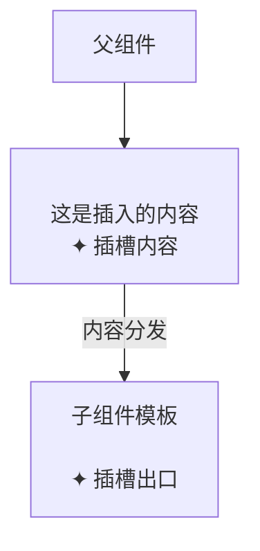
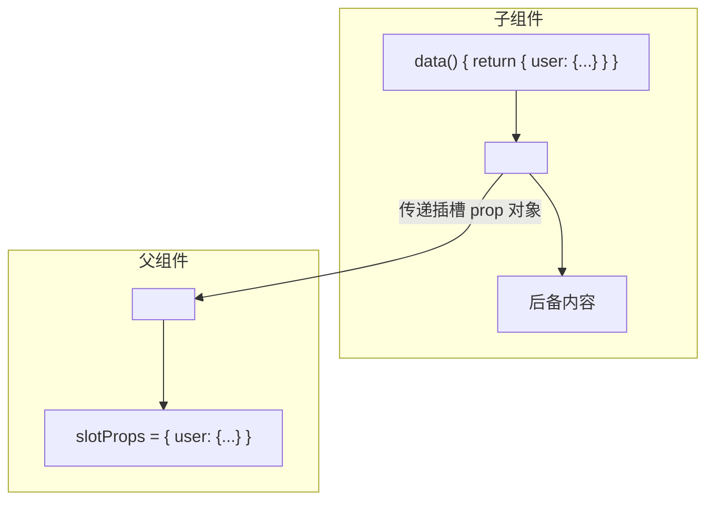

# 插槽 Slot

## 概述

> **版本说明**：在 Vue 2.6.0 中，为具名插槽和作用域插槽引入了新的统一语法（`v-slot` 指令），取代了 `slot` 和 `slot-scope` 这两个已废弃的属性。

插槽（Slot）是 Vue 实现的一套内容分发 API，其设计灵感源自 [Web Components 规范草案](https://github.com/w3c/webcomponents/blob/gh-pages/proposals/Slots-Proposal.md)。它允许开发者在组件模板中预留占位符，由父组件在使用时填充具体内容。

### 核心概念



### 插槽类型对比

| 类型       | 用途           | 语法                   | 适用场景     |
| ---------- | -------------- | ---------------------- | ------------ |
| 默认插槽   | 单一内容分发   | `<slot></slot>`        | 简单内容传递 |
| 具名插槽   | 多位置内容分发 | `<slot name="header">` | 复杂布局组件 |
| 作用域插槽 | 子向父传递数据 | `<slot :data="value">` | 可复用组件   |

---

## 基础用法

### 基本插槽

`<slot>` 元素作为承载分发内容的出口，父组件传入的内容将替换 `<slot>` 标签。

**子组件定义** (`navigation-link.vue`)：

```html
<a v-bind:href="url" class="nav-link">
  <slot></slot>
</a>
```

**父组件使用**：

```html
<navigation-link url="/profile">Your Profile</navigation-link>
```

**渲染结果**：

```html
<a href="/profile" class="nav-link">Your Profile</a>
```

插槽内容可以是任意模板代码：

```html
<navigation-link url="/profile">
  <span class="fa fa-user"></span>
  Your Profile
</navigation-link>
```

甚至可以是其他组件：

```html
<navigation-link url="/profile">
  <font-awesome-icon name="user"></font-awesome-icon>
  Your Profile
</navigation-link>
```

::: warning 注意
如果子组件模板中没有 `<slot>` 元素，则组件标签之间的任何内容都会被抛弃。
:::

---

## 后备内容

后备内容（Fallback Content）即插槽的默认值，当父组件未提供内容时显示。

**子组件定义**：

```html
<button type="submit">
  <slot>Submit</slot>
</button>
```

**使用示例**：

```html
<submit-button></submit-button>
```

**渲染结果**：

```html
<button type="submit">Submit</button>
```

当提供内容时，后备内容会被覆盖：

```html
<submit-button>Save</submit-button>
```

**渲染结果**：

```html
<button type="submit">Save</button>
```

---

## 编译作用域

插槽内容在父组件作用域中编译，无法直接访问子组件的数据。

```html
<navigation-link url="/profile"> Logged in as {{ user.name }} </navigation-link>
```

上述代码中，`user` 来自父组件实例，而非 `<navigation-link>` 组件。

::: danger 重要规则

- **父级模板的所有内容在父级作用域编译**
- **子级模板的所有内容在子作用域编译**
- 父组件无法直接访问子组件的数据（除非通过作用域插槽传递）
  :::

**错误示例**：

```html
<navigation-link url="/profile"> Clicking here will send you to: {{ url }} </navigation-link>
```

这里的 `url` 会是 `undefined`，因为它是 `<navigation-link>` 的内部属性。

---

## 具名插槽

当组件需要多个插槽出口时，使用 `name` 属性区分。

### 定义具名插槽

```html
<div class="container">
  <header>
    <slot name="header"></slot>
  </header>
  <main>
    <slot></slot>
  </main>
  <footer>
    <slot name="footer"></slot>
  </footer>
</div>
```

::: tip 提示
不带 `name` 的 `<slot>` 会带有隐含名称 `"default"`。
:::

### 使用具名插槽

使用 `v-slot` 指令指定插槽名称：

```html
<base-layout>
  <template v-slot:header>
    <h1>Here might be a page title</h1>
  </template>

  <p>A paragraph for the main content.</p>
  <p>And another one.</p>

  <template v-slot:footer>
    <p>Here's some contact info</p>
  </template>
</base-layout>
```

也可以显式指定默认插槽：

```html
<base-layout>
  <template v-slot:header>
    <h1>Here might be a page title</h1>
  </template>

  <template v-slot:default>
    <p>A paragraph for the main content.</p>
    <p>And another one.</p>
  </template>

  <template v-slot:footer>
    <p>Here's some contact info</p>
  </template>
</base-layout>
```

**渲染结果**：

```html
<div class="container">
  <header>
    <h1>Here might be a page title</h1>
  </header>
  <main>
    <p>A paragraph for the main content.</p>
    <p>And another one.</p>
  </main>
  <footer>
    <p>Here's some contact info</p>
  </footer>
</div>
```

### 插槽缩写语法

`v-slot` 可缩写为 `#`：

```html
<base-layout>
  <template #header>
    <h1>Here might be a page title</h1>
  </template>

  <template #default>
    <p>A paragraph for the main content.</p>
  </template>

  <template #footer>
    <p>Here's some contact info</p>
  </template>
</base-layout>
```

::: warning 缩写限制

- `v-slot` 只能添加在 `<template>` 上（独占默认插槽除外）
- 缩写必须有参数，`#default="{ user }"` 有效，但 `#="{ user }"` 无效
  :::

---

## 作用域插槽

作用域插槽允许子组件向插槽内容传递数据，实现子到父的数据通信。

### 基本用法

**子组件定义**：

```html
<span>
  <slot v-bind:user="user"> {{ user.lastName }} </slot>
</span>

<script>
  export default {
    data() {
      return {
        user: {
          firstName: "John",
          lastName: "Doe"
        }
      }
    }
  }
</script>
```

**父组件使用**：

```html
<current-user>
  <template v-slot:default="slotProps"> {{ slotProps.user.firstName }} </template>
</current-user>
```

绑定在 `<slot>` 上的属性称为**插槽 prop**，父组件通过 `v-slot` 接收。

### 独占默认插槽的缩写

当只有默认插槽时，可将 `v-slot` 直接用在组件标签上：

```html
<current-user v-slot:default="slotProps"> {{ slotProps.user.firstName }} </current-user>
```

进一步简化：

```html
<current-user v-slot="slotProps"> {{ slotProps.user.firstName }} </current-user>
```

::: danger 注意
默认插槽的缩写语法**不能**与具名插槽混用：

```html
<current-user v-slot="slotProps">
  {{ slotProps.user.firstName }}
  <template v-slot:other="otherSlotProps"> slotProps is NOT available here </template>
</current-user>
```

存在多个插槽时，必须使用完整的 `<template>` 语法。
:::

### 解构插槽 Prop

`v-slot` 的值支持 ES2015 解构语法：

```html
<current-user v-slot="{ user }"> {{ user.firstName }} </current-user>
```

**重命名 prop**：

```html
<current-user v-slot="{ user: person }"> {{ person.firstName }} </current-user>
```

**定义默认值**：

```html
<current-user v-slot="{ user = { firstName: 'Guest' } }"> {{ user.firstName }} </current-user>
```

### 实际应用示例

**可复用列表组件**：

```html
<template>
  <ul>
    <li v-for="todo in filteredTodos" :key="todo.id">
      <slot name="todo" :todo="todo"> {{ todo.text }} </slot>
    </li>
  </ul>
</template>

<script>
  export default {
    props: ["todos"],
    computed: {
      filteredTodos() {
        return this.todos.filter((todo) => !todo.isDeleted)
      }
    }
  }
</script>
```

**父组件自定义渲染**：

```html
<todo-list :todos="todos">
  <template #todo="{ todo }">
    <span v-if="todo.isComplete">✓</span>
    <span :class="{ done: todo.isComplete }"> {{ todo.text }} </span>
  </template>
</todo-list>
```

---

## 动态插槽名

> Vue 2.6.0+ 新增

使用动态指令参数定义动态插槽名：

```html
<base-layout>
  <template v-slot:[dynamicSlotName]> Dynamic slot content </template>
</base-layout>

<script>
  export default {
    data() {
      return {
        dynamicSlotName: "header"
      }
    }
  }
</script>
```

---

## 插槽原理与底层机制

### 编译过程

Vue 编译器将插槽内容转换为渲染函数：

**模板**：

```html
<base-layout>
  <template #header>
    <h1>Title</h1>
  </template>
  <p>Content</p>
</base-layout>
```

**编译结果（简化）**：

```javascript
// 父组件渲染函数
render(h) {
  return h('base-layout', {
    scopedSlots: {
      header: function() {
        return h('h1', 'Title')
      },
      default: function() {
        return h('p', 'Content')
      }
    }
  })
}
```

### 插槽 prop 传递机制



### $slots 和 $scopedSlots

Vue 实例提供两个属性访问插槽：

```javascript
export default {
  mounted() {
    console.log(this.$slots.default)
    console.log(this.$scopedSlots.header)
  }
}
```

| 属性           | 类型   | 说明                              |
| -------------- | ------ | --------------------------------- |
| `$slots`       | Object | 包含所有非作用域插槽的 VNode 数组 |
| `$scopedSlots` | Object | 包含所有作用域插槽的函数          |

---

## 最佳实践

### 1. 命名规范

```html
<template #header>
  <header>页面头部</header>
</template>

<template #sidebar>
  <aside>侧边栏</aside>
</template>

<template #footer>
  <footer>页面底部</footer>
</template>
```

使用语义化的插槽名称，避免使用 `slot1`、`slot2` 等无意义命名。

### 2. 提供合理的后备内容

```html
<slot name="icon">
  <default-icon />
</slot>
```

### 3. 作用域插槽命名约定

```html
<template #default="{ item, index }"> {{ index }}: {{ item.name }} </template>
```

使用解构并保持命名简洁明了。

### 4. 避免过度使用插槽

插槽适合用于：

- 布局组件（Header、Footer、Sidebar）
- 可复用组件（列表、表格、卡片）
- 需要自定义渲染的场景

不适合用于：

- 简单的数据展示（使用 props）
- 固定的 UI 结构

### 5. 文档化插槽接口

```html
<script>
  export default {
    /**
     * @slot 自定义内容区域
     * @binding {Object} user - 用户信息对象
     * @binding {String} user.name - 用户名
     * @binding {String} user.email - 用户邮箱
     */
  }
</script>
```

---

## 性能优化建议

### 1. 避免不必要的插槽更新

```html
<template>
  <child-component>
    <template #default="{ data }">
      <heavy-component :data="data" />
    </template>
  </child-component>
</template>
```

如果 `heavy-component` 渲染开销大，考虑使用 `v-once`：

```html
<template #default="{ data }">
  <heavy-component v-once :data="data" />
</template>
```

### 2. 使用函数式组件

对于纯展示的插槽内容：

```javascript
export default {
  functional: true,
  render(h, { scopedSlots, props }) {
    return scopedSlots.default && scopedSlots.default(props)
  }
}
```

### 3. 避免在插槽中使用复杂表达式

```html
<template #default="{ item }">
  <span>{{ formatItem(item) }}</span>
</template>
```

将复杂逻辑移到计算属性或方法中。

### 4. 合理使用静态插槽

静态内容不需要响应式更新：

```html
<template #header>
  <h1>Static Title</h1>
</template>
```

---

## 常见问题解答

### Q1: 插槽内容无法访问子组件数据怎么办？

**A**: 使用作用域插槽，子组件通过插槽 prop 传递数据：

```html
<slot :data="childData"></slot>
```

### Q2: 如何判断插槽是否有内容？

**A**: 检查 `$slots` 或 `$scopedSlots`：

```javascript
computed: {
  hasHeader() {
    return !!this.$slots.header || !!this.$scopedSlots.header
  }
}
```

### Q3: 插槽可以嵌套吗？

**A**: 可以，但要注意作用域链：

```html
<parent-component>
  <template #default="{ parentData }">
    <child-component>
      <template #default="{ childData }"> {{ parentData }} - {{ childData }} </template>
    </child-component>
  </template>
</parent-component>
```

### Q4: 如何在 TypeScript 中类型化作用域插槽？

**A**: 使用 Vue 的类型定义：

```typescript
import { VNode } from "vue"

interface ScopedSlots {
  default: (props: { user: User }) => VNode[]
}
```

### Q5: 插槽和 props 有什么区别？

| 特性     | 插槽                 | Props        |
| -------- | -------------------- | ------------ |
| 传递内容 | 模板/VNode           | 数据         |
| 灵活性   | 高（可包含任意内容） | 低（仅数据） |
| 适用场景 | 布局、自定义渲染     | 数据传递     |
| 复杂度   | 较高                 | 较低         |

### Q6: 为什么 v-slot 只能用在 template 上？

**A**: 这是 Vue 的设计决策，目的是：

1. 明确插槽边界
2. 避免作用域混淆
3. 支持多个插槽

独占默认插槽是唯一的例外。

---

## API 参考

### `<slot>` 元素属性

| 属性   | 类型   | 说明                         |
| ------ | ------ | ---------------------------- |
| `name` | String | 插槽名称，默认为 `"default"` |

### `v-slot` 指令

| 语法                      | 说明                 |
| ------------------------- | -------------------- |
| `v-slot:slotName`         | 指定具名插槽         |
| `v-slot:slotName="props"` | 接收作用域插槽 prop  |
| `v-slot="props"`          | 独占默认插槽的缩写   |
| `#slotName`               | `v-slot:` 的缩写形式 |

### 实例属性

| 属性           | 类型                                 | 说明           |
| -------------- | ------------------------------------ | -------------- |
| `$slots`       | `{ [name: string]: ?Array<VNode> }`  | 静态插槽 VNode |
| `$scopedSlots` | `{ [name: string]: props => VNode }` | 作用域插槽函数 |

---

## 废弃语法

> 以下语法自 Vue 2.6.0 起废弃，将在 Vue 3 中移除

### `slot` 属性（具名插槽）

**废弃写法**：

```html
<base-layout>
  <template slot="header">
    <h1>Title</h1>
  </template>
  <p slot="footer">Footer</p>
</base-layout>
```

**推荐写法**：

```html
<base-layout>
  <template #header>
    <h1>Title</h1>
  </template>
  <template #footer>
    <p>Footer</p>
  </template>
</base-layout>
```

### `slot-scope` 属性（作用域插槽）

**废弃写法**：

```html
<slot-example>
  <template slot="default" slot-scope="slotProps"> {{ slotProps.msg }} </template>
</slot-example>
```

**推荐写法**：

```html
<slot-example v-slot="slotProps"> {{ slotProps.msg }} </slot-example>
```

---

## 相关资源

- [Vue 官方文档 - 插槽](https://v2.cn.vuejs.org/v2/guide/components-slots.html)
- [Vue Virtual Scroller](https://github.com/Akryum/vue-virtual-scroller) - 作用域插槽实战案例
- [Vue Promised](https://github.com/posva/vue-promised) - 异步组件插槽应用
