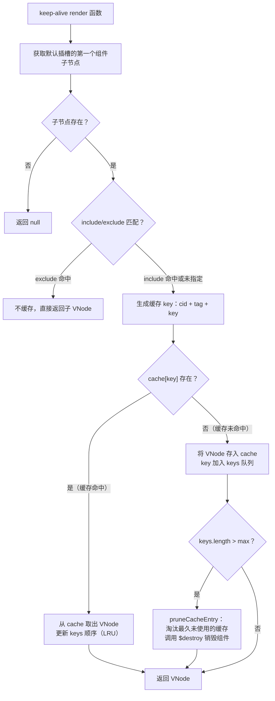
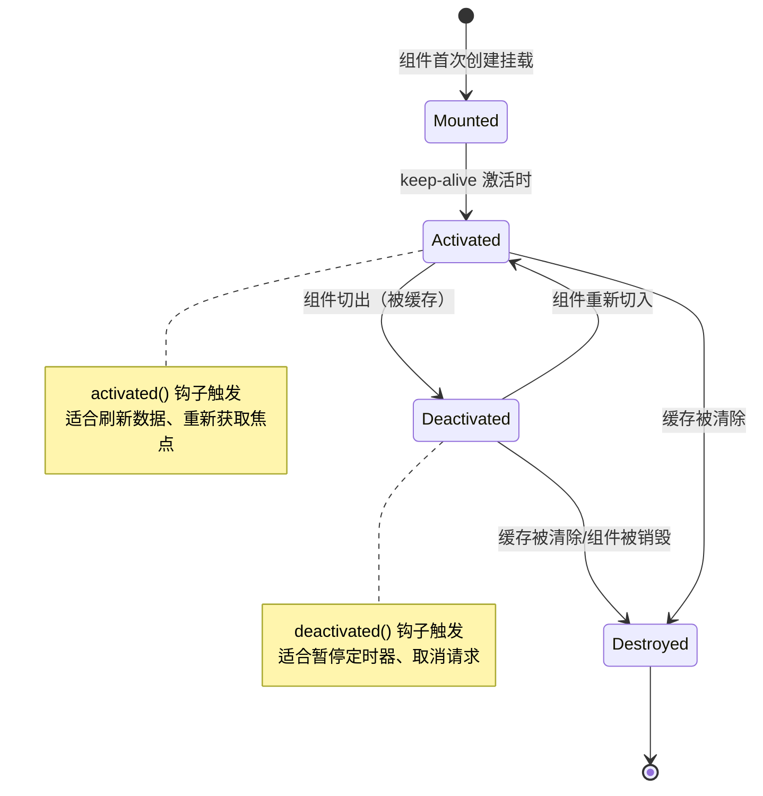
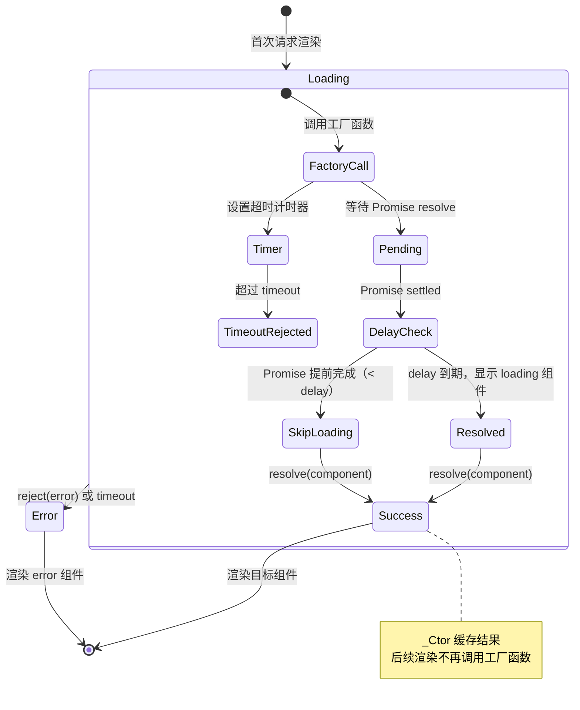

# 动态组件与异步组件

## 概述

在 Vue 应用开发中，动态组件和异步组件是两个重要的高级特性：

- **动态组件**：允许在同一个挂载点动态切换多个组件，实现多标签界面、路由视图等场景
- **异步组件**：支持按需加载组件代码，优化首屏加载性能，减少初始加载体积

这两个特性在大型单页应用（SPA）中尤为重要，能够显著提升应用的性能和用户体验。

---

## 动态组件

### 基本用法

Vue 提供了 `<component>` 元素，配合 `is` 属性实现动态组件切换：

```html
<!-- 组件会在 `currentTabComponent` 改变时改变 -->
<component v-bind:is="currentTabComponent"></component>
```

**完整示例：**

```html
<div id="app">
  <!-- 标签按钮 -->
  <button 
    v-for="tab in tabs" 
    :key="tab"
    :class="['tab-button', { active: currentTab === tab }]"
    @click="currentTab = tab"
  >
    {{ tab }}
  </button>

  <!-- 动态组件 -->
  <component :is="currentTabComponent" class="tab"></component>
</div>

<script>
Vue.component('tab-home', {
  template: '<div>Home component</div>'
})

Vue.component('tab-posts', {
  template: '<div>Posts component</div>'
})

Vue.component('tab-archive', {
  template: '<div>Archive component</div>'
})

new Vue({
  el: '#app',
  data: {
    currentTab: 'Home',
    tabs: ['Home', 'Posts', 'Archive']
  },
  computed: {
    currentTabComponent() {
      return 'tab-' + this.currentTab.toLowerCase()
    }
  }
})
</script>
```

**`is` 属性值类型：**

```javascript
// 1. 字符串形式（已注册组件名）
<component is="my-component"></component>

// 2. 动态绑定字符串
<component :is="componentName"></component>

// 3. 直接绑定组件选项对象
<component :is="componentOptions"></component>
```

```javascript
// 示例：直接使用组件对象
new Vue({
  data: {
    currentComponent: {
      template: '<div>Inline component</div>'
    }
  }
})
```

---

### keep-alive 缓存组件

#### 问题场景

当在动态组件之间切换时，组件会被销毁和重新创建，导致：

- 组件状态丢失（如表单输入、滚动位置）
- 性能损耗（反复创建/销毁开销）

**示例：状态丢失问题**

```html
<div id="app">
  <button @click="current = 'comp-a'">组件 A</button>
  <button @click="current = 'comp-b'">组件 B</button>
  
  <component :is="current"></component>
</div>

<script>
Vue.component('comp-a', {
  data() {
    return { count: 0 }
  },
  template: `
    <div>
      <p>组件 A - 计数: {{ count }}</p>
      <button @click="count++">增加</button>
    </div>
  `
})

Vue.component('comp-b', {
  template: '<div>组件 B</div>'
})

new Vue({
  el: '#app',
  data: { current: 'comp-a' }
})
</script>
```

切换到组件 B 再切回组件 A 时，`count` 会重置为 0。

#### 解决方案

使用 `<keep-alive>` 包裹动态组件，缓存失活的组件实例：

```html
<keep-alive>
  <component :is="currentTabComponent"></component>
</keep-alive>
```

**优化后的完整示例：**

```html
<!DOCTYPE html>
<html>
<head>
  <title>动态组件 + keep-alive 示例</title>
  <script src="https://cdn.jsdelivr.net/npm/vue@2.6.14/dist/vue.js"></script>
  <style>
    .tab-button {
      padding: 6px 10px;
      border: 1px solid #ccc;
      cursor: pointer;
      background: #f0f0f0;
      margin-right: 5px;
    }
    .tab-button.active {
      background: #e0e0e0;
      border-bottom-color: transparent;
    }
    .tab {
      border: 1px solid #ccc;
      padding: 10px;
    }
  </style>
</head>
<body>
  <div id="dynamic-component-demo">
    <button 
      v-for="tab in tabs" 
      :key="tab"
      :class="['tab-button', { active: currentTab === tab }]"
      @click="currentTab = tab"
    >
      {{ tab }}
    </button>

    <keep-alive>
      <component :is="currentTabComponent" class="tab"></component>
    </keep-alive>
  </div>

  <script>
    Vue.component('tab-posts', {
      data() {
        return {
          posts: [
            { id: 1, title: 'Vue 2 入门指南', content: '<p>Vue 2 是一个渐进式框架...</p>' },
            { id: 2, title: '深入理解组件', content: '<p>组件是 Vue 的核心概念...</p>' },
            { id: 3, title: '状态管理模式', content: '<p>Vuex 提供了集中式状态管理...</p>' }
          ],
          selectedPost: null
        }
      },
      template: `
        <div class="posts-tab">
          <ul class="posts-sidebar">
            <li 
              v-for="post in posts"
              :key="post.id"
              :class="{ selected: post === selectedPost }"
              @click="selectedPost = post"
            >
              {{ post.title }}
            </li>
          </ul>
          <div class="selected-post-container">
            <div v-if="selectedPost" class="selected-post">
              <h3>{{ selectedPost.title }}</h3>
              <div v-html="selectedPost.content"></div>
            </div>
            <strong v-else>
              点击左侧标题查看文章内容
            </strong>
          </div>
        </div>
      `
    })

    Vue.component('tab-archive', {
      template: '<div>归档组件 - 查看历史文章列表</div>'
    })

    new Vue({
      el: '#dynamic-component-demo',
      data: {
        currentTab: 'Posts',
        tabs: ['Posts', 'Archive']
      },
      computed: {
        currentTabComponent() {
          return 'tab-' + this.currentTab.toLowerCase()
        }
      }
    })
  </script>
</body>
</html>
```

---

### keep-alive API 详解

`<keep-alive>` 提供了三个属性来精确控制缓存行为：

#### include 属性

指定需要缓存的组件，可以是字符串、正则表达式或数组：

```html
<!-- 1. 字符串（逗号分隔的组件名） -->
<keep-alive include="comp-a,comp-b">
  <component :is="currentComponent"></component>
</keep-alive>

<!-- 2. 正则表达式（需使用 v-bind） -->
<keep-alive :include="/comp-/">
  <component :is="currentComponent"></component>
</keep-alive>

<!-- 3. 数组（需使用 v-bind） -->
<keep-alive :include="['comp-a', 'comp-b']">
  <component :is="currentComponent"></component>
</keep-alive>
```

#### exclude 属性

指定不需要缓存的组件：

```html
<!-- 排除指定组件 -->
<keep-alive exclude="comp-c">
  <component :is="currentComponent"></component>
</keep-alive>

<!-- 正则形式 -->
<keep-alive :exclude="/^admin-/">
  <component :is="currentComponent"></component>
</keep-alive>
```

#### max 属性

限制最多缓存多少组件实例，使用 LRU（最近最少使用）策略：

```html
<!-- 最多缓存 5 个组件实例 -->
<keep-alive :max="5">
  <component :is="currentComponent"></component>
</keep-alive>
```

**LRU 缓存淘汰策略说明：**

当缓存数量达到 max 上限时，最久未被访问的组件实例会被销毁，新访问的组件实例会被缓存。例如 max=3，已缓存 [A, B, C]：
- 访问 D → 缓存变为 [B, C, D]（A 被淘汰）
- 再访问 B → 缓存变为 [C, D, B]（B 移到末尾）

#### keep-alive 的缓存实现（源码级）



**关键源码（简化）：**

```javascript
// src/core/components/keep-alive.js
export default {
  name: 'keep-alive',
  abstract: true,  // 抽象组件：不渲染真实 DOM，不影响 $parent/$children 链

  props: { include, exclude, max },

  created() {
    this.cache = Object.create(null)  // { key: VNode }
    this.keys = []                     // LRU 顺序队列
  },

  destroyed() {
    // keep-alive 销毁时清理所有缓存
    for (const key in this.cache) {
      pruneCacheEntry(this.cache, key, this.keys)
    }
  },

  render() {
    const slot = this.$slots.default
    const vnode = getFirstComponentChild(slot)  // 获取第一个子组件 VNode

    if (vnode && vnode.componentOptions) {
      const componentOptions = vnode.componentOptions
      const name = getComponentName(componentOptions)

      // 检查 include/exclude
      if ((this.include && !matches(this.include, name)) ||
          (this.exclude && matches(this.exclude, name))) {
        return vnode  // 不缓存
      }

      const { cache, keys } = this
      const key = vnode.key == null
        ? componentOptions.Ctor.cid + (componentOptions.tag ? `::${componentOptions.tag}` : '')
        : vnode.key

      if (cache[key]) {
        // 缓存命中：复用缓存的组件实例
        vnode.componentInstance = cache[key].componentInstance
        remove(keys, key)     // 更新 LRU 顺序
        keys.push(key)        // 移到末尾（最近使用）
      } else {
        // 缓存未命中：缓存新 VNode
        cache[key] = vnode
        keys.push(key)
        // LRU 淘汰
        if (this.max && keys.length > parseInt(this.max)) {
          pruneCacheEntry(cache, keys[0], keys)  // 淘汰队首
        }
      }

      vnode.data.keepAlive = true  // 标记为 keep-alive 管理
    }
    return vnode || (slot && slot[0])
  }
}

// 缓存淘汰
function pruneCacheEntry(cache, key, keys) {
  const cached = cache[key]
  if (cached) {
    cached.componentInstance.$destroy()  // 销毁组件实例
  }
  cache[key] = null
  remove(keys, key)
}
```

> **关键点**：keep-alive 使用 `abstract: true` 标记为抽象组件。Vue 在建立 `$parent`/`$children` 关系时会跳过抽象组件，因此被缓存的组件访问 `$parent` 时不会指向 keep-alive，而是指向 keep-alive 的父组件。

#### 生命周期钩子

被 `<keep-alive>` 缓存的组件有两个独特的生命周期钩子：



```javascript
Vue.component('my-component', {
  template: '<div>My Component</div>',
  
  // 组件被激活时调用
  activated() {
    console.log('组件被激活')
    // 适合在这里刷新数据
    this.fetchData()
  },
  
  // 组件被停用时调用
  deactivated() {
    console.log('组件被停用')
    // 适合在这里清除定时器、取消请求等
    this.clearTimer()
  },
  
  methods: {
    fetchData() {
      // 刷新数据
    },
    clearTimer() {
      // 清理资源
    }
  }
})
```

**生命周期对比：**

| 生命周期 | 普通组件 | keep-alive 缓存组件 |
|---------|---------|-------------------|
| 首次加载 | created → mounted | created → mounted → activated |
| 切换离开 | beforeDestroy → destroyed | deactivated |
| 切换回来 | created → mounted | activated |

---

## 异步组件

### 基本概念

在大型应用中，将所有组件打包成一个文件会导致：

- 首屏加载时间过长
- 用户下载了许多暂时不需要的代码
- 浪费带宽和服务器资源

**异步组件**允许将组件定义为工厂函数，Vue 只在需要渲染时才会执行该函数并加载组件定义，实现代码分割和按需加载。

---

### 工厂函数形式

#### 基本语法

```javascript
Vue.component('async-example', function (resolve, reject) {
  // resolve：加载成功回调，接收组件定义对象
  // reject：加载失败回调（可选）
  
  setTimeout(() => {
    // 异步获取组件定义后调用 resolve
    resolve({
      template: '<div>I am async!</div>'
    })
  }, 1000)
})
```

#### 配合 Webpack 代码分割

```javascript
Vue.component('async-webpack-example', function (resolve, reject) {
  // require 语法告诉 webpack 进行代码分割
  require(['./my-async-component'], resolve)
})
```

**Webpack 会自动：**
1. 将 `./my-async-component` 单独打包成一个文件
2. 运行时通过 AJAX 请求加载该文件
3. 加载完成后执行 resolve 回调

#### 异步组件内部实现原理

Vue 通过 `resolveAsyncComponent` 函数处理异步组件的加载，核心是一个基于工厂函数的状态机：



**关键源码（简化）：**

```javascript
// src/core/vdom/helpers/resolve-async-component.js
function resolveAsyncComponent(factory, baseCtor) {
  // 1. 加载失败且配置了 error 组件：直接返回 error 组件
  if (isTrue(factory.error) && isDef(factory.errorComp)) {
    return factory.errorComp
  }

  // 2. 尝试从 _Ctor 缓存获取已解析的组件
  if (isDef(factory.resolved)) {
    return factory.resolved  // 已 resolve，直接返回
  }

  // 3. 首次渲染：调用工厂函数
  const resolve = once((res) => {
    // 工厂 resolve 后：
    factory.resolved = ensureCtor(res, baseCtor)
    // 已 resolve 的组件存入 factory.resolved（_Ctor 缓存）
    // 调用 forceRender 触发重新渲染
    if (!sync) { forceRender(true) }
  })

  const reject = once((reason) => {
    // 工厂 reject：
    // 如果配置了 error 组件，显示 error 组件
    // 否则抛出警告
    if (isDef(factory.error)) {
      factory.errorComp = ensureCtor(factory.error, baseCtor)
      forceRender(true)
    }
  })

  // 4. 调用工厂，处理同步/异步返回
  const res = factory(resolve, reject)
  if (isPromise(res)) {
    // Promise 形式：() => import('./Component.vue')
    res.then(resolve, reject)
  }

  // 5. 设置超时计时器
  if (isDef(factory.timeout)) {
    setTimeout(() => {
      reject(new Error(`Async component timed out after ${factory.timeout}ms`))
    }, factory.timeout)
  }

  // 6. 处理 delay：延迟显示 loading 组件
  if (isDef(factory.delay)) {
    setTimeout(() => {
      factory.delayPassed = true
      forceRender(true)
    }, factory.delay || 200)
  }

  // 7. 首次渲染：返回 loading 组件或 undefined（创建注释节点占位）
  if (sync && factory.loading) {
    return factory.loadingComp  // 同步返回 loading
  }
  return undefined  // 异步等待
}
```

> **关键**：factory.resolved（`_Ctor` 缓存）：resolve 后组件定义被存储，后续渲染直接返回，**工厂函数只调用一次**。

---

### Promise 形式

在支持 ES2015 和 Webpack 2+ 的环境中，推荐使用更简洁的 Promise 语法：

#### 全局注册

```javascript
Vue.component(
  'async-webpack-example',
  // 返回 Promise 的工厂函数
  () => import('./my-async-component')
)
```

#### 局部注册

```javascript
new Vue({
  components: {
    // 异步组件局部注册
    'my-component': () => import('./MyComponent.vue')
  }
})
```

#### 配合动态路径

```javascript
// 根据条件动态加载不同组件
Vue.component('smart-component', () => {
  if (condition) {
    return import('./ComponentA.vue')
  } else {
    return import('./ComponentB.vue')
  }
})

// 动态路径导入
const componentName = 'UserProfile'
Vue.component('dynamic-component', () => 
  import(`./components/${componentName}.vue`)
)
```

---

### 处理加载状态

#### 完整的异步组件配置对象

Vue 2.3.0+ 支持高级异步组件配置：

```javascript
const AsyncComponent = () => ({
  // 需要加载的组件（必须）
  component: import('./MyComponent.vue'),
  
  // 加载中显示的组件
  loading: LoadingComponent,
  
  // 加载失败显示的组件
  error: ErrorComponent,
  
  // 延迟显示 loading 的时间（毫秒）
  // 避免加载过快时的闪烁
  delay: 200,
  
  // 超时时间（毫秒）
  // 超时后显示 error 组件
  timeout: 3000
})

// 注册使用
Vue.component('async-component', AsyncComponent)
```

**参数详解：**

| 参数 | 类型 | 默认值 | 说明 |
|-----|------|-------|------|
| component | Promise | - | 要加载的组件（必填） |
| loading | Component | - | 加载过程中显示的组件 |
| error | Component | - | 加载失败时显示的组件 |
| delay | Number | 200 | 延迟显示 loading 的时间 |
| timeout | Number | Infinity | 超时时间 |

#### 完整示例

```html
<!DOCTYPE html>
<html>
<head>
  <script src="https://cdn.jsdelivr.net/npm/vue@2.6.14/dist/vue.js"></script>
</head>
<body>
  <div id="app">
    <button @click="show = true">加载异步组件</button>
    
    <async-component v-if="show"></async-component>
  </div>

  <script>
    // Loading 组件
    const LoadingComponent = {
      template: '<div style="color: blue;">⏳ 加载中...</div>'
    }

    // Error 组件
    const ErrorComponent = {
      template: '<div style="color: red;">❌ 加载失败</div>'
    }

    // 模拟异步组件
    const AsyncComponent = () => ({
      component: new Promise((resolve, reject) => {
        setTimeout(() => {
          // 模拟网络请求
          if (Math.random() > 0.3) {
            resolve({
              template: '<div style="color: green;">✓ 异步组件加载成功！</div>'
            })
          } else {
            reject(new Error('加载失败'))
          }
        }, 2000)
      }),
      loading: LoadingComponent,
      error: ErrorComponent,
      delay: 200,
      timeout: 5000
    })

    Vue.component('async-component', AsyncComponent)

    new Vue({
      el: '#app',
      data: {
        show: false
      }
    })
  </script>
</body>
</html>
```

---

### 局部注册异步组件

在单文件组件中使用异步组件：

```vue
<template>
  <div>
    <button @click="showAsync = true">显示异步组件</button>
    <async-child v-if="showAsync" />
  </div>
</template>

<script>
import LoadingComponent from './Loading.vue'
import ErrorComponent from './Error.vue'

export default {
  components: {
    AsyncChild: () => ({
      component: import('./AsyncChild.vue'),
      loading: LoadingComponent,
      error: ErrorComponent,
      delay: 200,
      timeout: 10000
    })
  },
  data() {
    return {
      showAsync: false
    }
  }
}
</script>
```

---

## 最佳实践

### 1. 路由懒加载

结合 Vue Router 实现路由级代码分割：

```javascript
// router.js
import Vue from 'vue'
import Router from 'vue-router'

Vue.use(Router)

export default new Router({
  routes: [
    {
      path: '/',
      name: 'Home',
      component: () => import('@/views/Home.vue')
    },
    {
      path: '/about',
      name: 'About',
      component: () => import('@/views/About.vue')
    },
    {
      path: '/user/:id',
      name: 'User',
      component: () => import('@/views/User.vue')
    }
  ]
})
```

### 2. 分组打包

将相关路由打包到同一个 chunk：

```javascript
const UserCenter = () => import(/* webpackChunkName: "user-center" */ '@/views/user/Center.vue')
const UserProfile = () => import(/* webpackChunkName: "user-center" */ '@/views/user/Profile.vue')
const UserSettings = () => import(/* webpackChunkName: "user-center" */ '@/views/user/Settings.vue')

// 这三个组件会被打包到同一个文件 user-center.[hash].js
```

### 3. 预加载关键组件

```javascript
// 在首页加载完成后预加载用户可能会访问的页面
mounted() {
  import('@/views/Dashboard.vue')  // 预加载仪表盘页面
}
```

### 4. keep-alive 使用建议

```javascript
// 推荐：明确指定需要缓存的组件
<keep-alive include="Home,UserProfile">
  <router-view />
</keep-alive>

// 不推荐：缓存所有路由组件（可能导致内存问题）
<keep-alive>
  <router-view />
</keep-alive>
```

### 5. 合理设置 max 值

```html
<!-- 根据应用规模设置合理的缓存上限 -->
<keep-alive :max="10">
  <router-view />
</keep-alive>
```

---

## 常见问题

### Q1: 动态组件切换时如何传递 props？

```html
<!-- 直接在 component 上绑定 props -->
<component 
  :is="currentComponent"
  :data="componentData"
  @event="handleEvent"
/>
```

### Q2: 如何在异步组件中访问 this？

异步组件工厂函数在 Vue 解析时调用，此时还没有组件实例，无法访问 `this`：

```javascript
// ❌ 错误：无法访问 this
Vue.component('async-component', () => ({
  component: import(`./${this.componentName}.vue`)  // this 是 undefined
}))

// ✅ 正确：使用函数参数
Vue.component('async-component', (resolve, reject) => {
  const name = getComponentName()  // 从外部获取
  import(`./${name}.vue`).then(resolve).catch(reject)
})
```

### Q3: keep-alive 中的组件何时触发 activated/deactivated？

```javascript
Vue.component('cached-component', {
  activated() {
    // 组件从缓存中被激活（首次加载或切换回来时）
    console.log('activated')
  },
  deactivated() {
    // 组件被缓存（切换到其他组件时）
    console.log('deactivated')
  }
})
```

**注意：** 
- `activated` 在组件首次挂载时也会调用（`mounted` 之后），之后每次从缓存恢复时再次调用
- 使用 `keep-alive` 时，组件失活只触发 `deactivated`，缓存被清理销毁时才触发 `destroyed`

### Q4: 异步组件加载失败如何处理？

```javascript
const AsyncComponent = () => ({
  component: import('./Component.vue').catch(err => {
    // 加载失败时返回错误组件
    console.error('组件加载失败:', err)
    return {
      template: '<div>组件加载失败，请刷新重试</div>'
    }
  }),
  error: ErrorComponent,
  timeout: 10000
})
```

### Q5: 如何动态修改 keep-alive 的 include/exclude？

```html
<template>
  <keep-alive :include="cachedComponents">
    <router-view />
  </keep-alive>
</template>

<script>
export default {
  data() {
    return {
      cachedComponents: ['Home', 'List']
    }
  },
  methods: {
    addCache(componentName) {
      if (!this.cachedComponents.includes(componentName)) {
        this.cachedComponents.push(componentName)
      }
    },
    removeCache(componentName) {
      const index = this.cachedComponents.indexOf(componentName)
      if (index > -1) {
        this.cachedComponents.splice(index, 1)
      }
    }
  }
}
</script>
```

---

## 注意事项

### 1. keep-alive 要求

```javascript
// ❌ 错误：匿名组件无法被缓存
<keep-alive>
  <component :is="{ template: '<div>匿名组件</div>' }" />
</keep-alive>

// ✅ 正确：使用有名字的组件
Vue.component('my-component', {
  name: 'MyComponent',  // 显式指定 name
  template: '<div>命名组件</div>'
})

<keep-alive include="MyComponent">
  <component :is="currentComponent" />
</keep-alive>
```

### 2. 异步组件与 Vue Router 版本

使用高级异步组件语法（带 loading/error 的配置对象）时，需要 Vue Router 2.4.0+ 版本：

```javascript
// 这种语法需要 Vue Router 2.4.0+
const route = {
  path: '/async',
  component: () => ({
    component: import('./Async.vue'),
    loading: LoadingComponent,
    error: ErrorComponent,
    delay: 200,
    timeout: 3000
  })
}
```

### 3. 工厂函数必须返回 Promise 或调用 resolve

```javascript
// ❌ 错误：既没有调用 resolve，也没有返回 Promise，组件永远不会渲染
Vue.component('bad-async', function (resolve, reject) {
  // 忘记调用 resolve，组件将一直停留在注释占位节点
})

// ✅ 正确：直接返回 Promise
Vue.component('good-async', () => import('./Component.vue'))
```

注意：`() => import('./Component.vue').then(c => c)` 与直接返回 Promise 等价，均可用。

### 4. SSR 兼容性

服务端渲染（SSR）中异步组件需要特殊处理：

```javascript
// 客户端
if (typeof window !== 'undefined') {
  Vue.component('async-component', () => import('./Component.vue'))
}

// 或使用 vue-server-renderer 提供的 createBundleRenderer
```

### 5. Webpack 配置

确保 Webpack 正确配置代码分割：

```javascript
// webpack.config.js
output: {
  filename: '[name].[contenthash].js',
  chunkFilename: '[name].[contenthash].js'  // 异步组件的 chunk 文件名
}
```

---

## 参考资料

- [Vue 2 官方文档 - 动态组件](https://v2.cn.vuejs.org/v2/guide/components-dynamic-async.html)
- [Vue 2 官方文档 - 异步组件](https://v2.cn.vuejs.org/v2/guide/components-dynamic-async.html#异步组件)
- [Webpack 代码分割](https://webpack.js.org/guides/code-splitting/)
- [Vue Router 懒加载](https://router.vuejs.org/zh/guide/advanced/lazy-loading.html)

